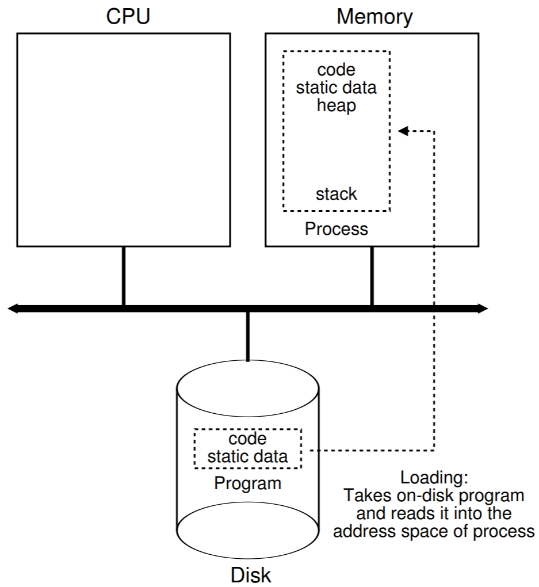
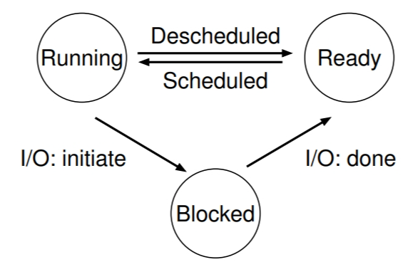
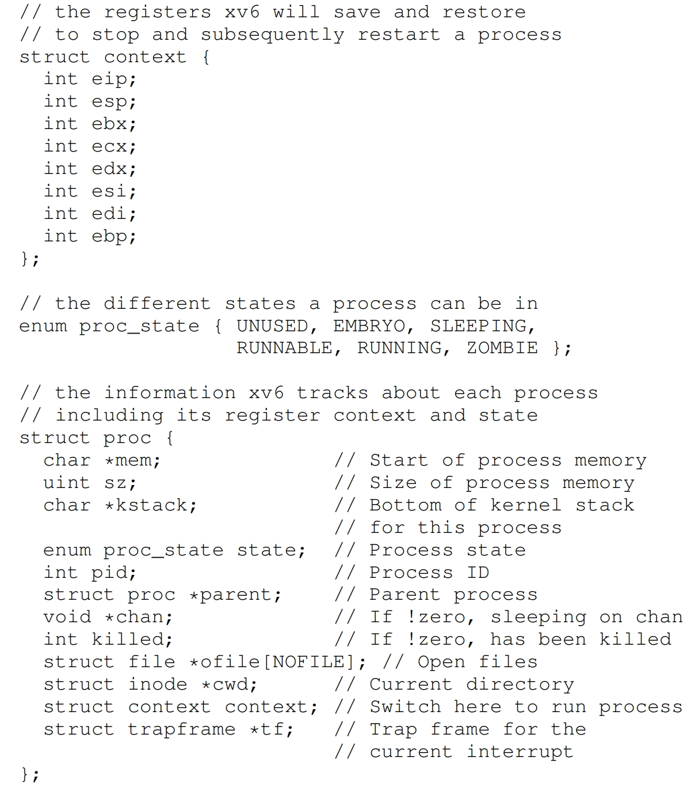
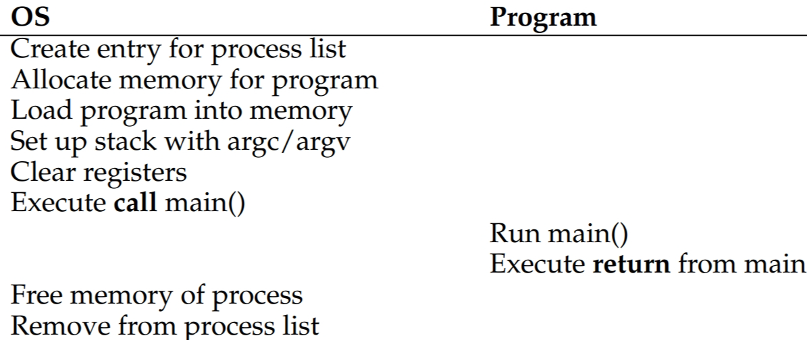
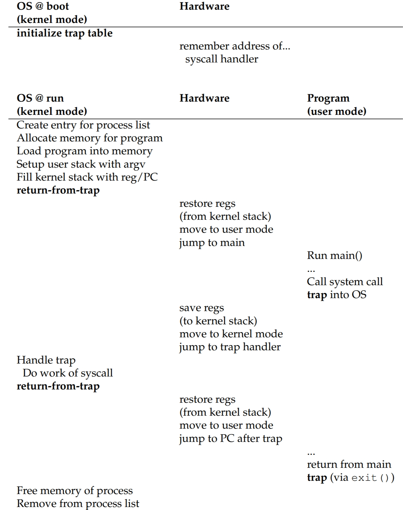
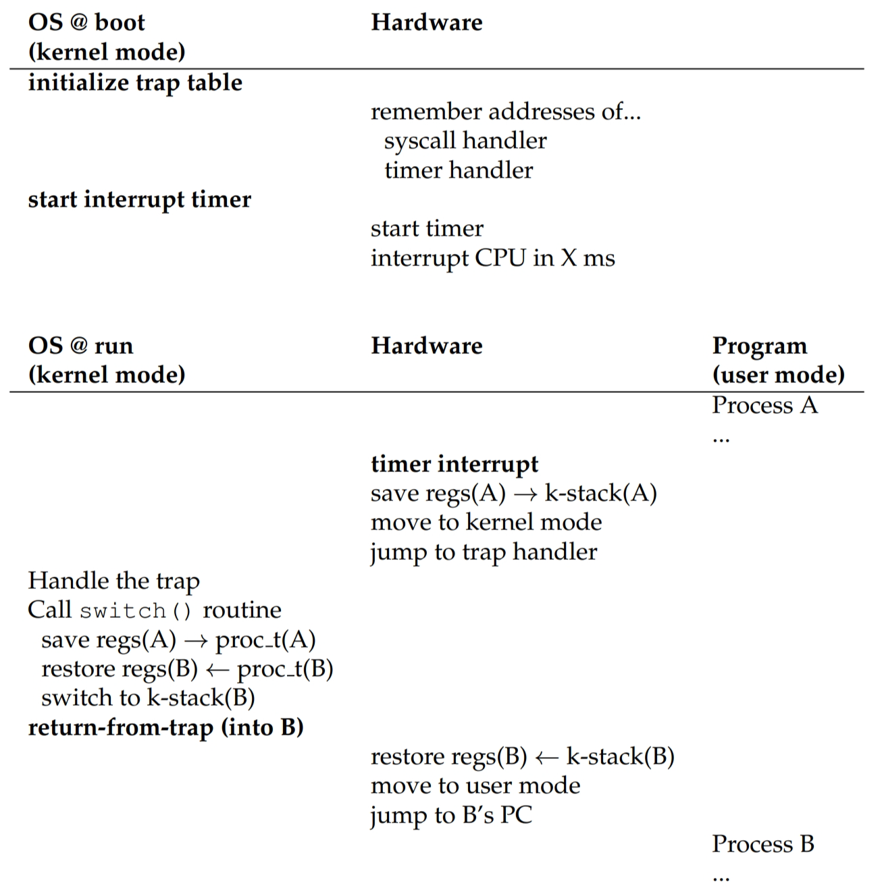

# 进程
> 一个运行的程序 (程序是位于磁盘上的无生命的数据，包含指令和静态数据等)

## 进程抽象
操作系统如何***同时*** (似乎同时) 运行多个程序？
> 虚拟化CPU--时间共享技术 (`time sharing`): 运行一个进程一会，停止，运行另一个程序，如此反复; <br>
缺点: 性能为代价；如果CPU被共享，程序运行的相对变慢；

实现虚拟化CPU操作系统需要哪些能力？
> 底层机制
> + 上下文切换 (`context-switch`)：允许操作系统停止一个正在运行的程序，开始运行另一个程序<br>
> + 时间共享：允许操作系统同时运行多个程序；<br>
>
> 上层策略
> + 调度策略：操作系统决定运行哪一个程序；

进程的执行需要哪些组件？
> - 内存：存放程序指令，运行时需要的数据等；
> - 寄存器：PC寄存器存放下一个要执行的指令，栈指针用于函数参数，局部变量，返回地址等；
> - 磁盘等

程序如何变为一个进程？

> 操作系统首先将存放在磁盘 (或者SSD) 中的代码 (可执行文件) 和静态数据加载到进程地址空间中的内存；<br>
加载这个操作有两种实现：
> + eagerly：早期的操作系统实现方式，在运行程序之前，操作系统将所有的数据都会加载到内存；
> + lazily：现代操作系统采用方式，开始的时候，只加载一小部分代码或数据 (涉及内存的 paging 和 swapping 机制);<br>
>
> 操作系统给进程分配分配栈内存 (stack) 并初始化；<br>
> 操作系统给进程分配堆内存 (heap)；<br>
> 操作系统做一些其他的初始化工作，例如和 I/O 相关的，在 Unix 系统中，每个进程默认会打开三个文件描述符 (标准输入
、输出、错误)；<br>
> 操作系统启动程序运行在入口点 (main 函数) 处；

进程的状态有哪些？
> 简单来看，一个进程大概有下面三个状态：
> + 运行中
> + 就绪
> + 阻塞
>
> 

进程的数据结构包含什么？
> 操作系统可以使用进程的数据结构来跟踪运行中的进程，下面是 xv6 内核的进程数据结构 <br>
>
> 
>
> register context：存放处于停止状态进程的寄存器内容，通过恢复寄存器的值，操作系统可以重新运行一个停止的进程；
此技术也被叫上下文切换；

什么是僵死进程？
> 进程处于终态，但没有被系统回收资源 (没有调用 wait 方法)

## 进程API
在现代操作系统中，一般会包含如下种类和进程有关的API
+ 创建(`Create`)
+ 销毁(`Destroy`)
+ 等待(`Wait`)
+ 状态(`State`)
+ 控制('Miscellaneous Control')：例如挂起(`suspend`)，继续运行(`resume`)

`fork` 系统调用
> 创建一个新进程，复制父进程的进程空间，子进程从 `fork` 的返回开始执行；

`wait` 系统调用
> 父进程调用，等待子进程结束，阻塞调用，子进程结束会回收终止的子进程资源，避免成为僵死进程；

`exec` 系统调用
> 可以在一个进程中用以执行不同的程序；此系统调用没有返回；
```c
#include <stdio.h>
#include <stdlib.h>
#include <unistd.h>
#include <string.h>
#include <sys/wait.h>

int
main(int argc, char *argv[])
{
    printf("hello world (pid:%d)\n", (int) getpid());
    int rc = fork();
    if (rc < 0) {
        // fork failed; exit
        fprintf(stderr, "fork failed\n");
        exit(1);
    } else if (rc == 0) {
        // child (new process)
        printf("hello, I am child (pid:%d)\n", (int) getpid());
        char *myargs[3];
        myargs[0] = strdup("wc");   // program: "wc" (word count)
        myargs[1] = strdup("p3.c"); // argument: file to count
        myargs[2] = NULL;           // marks end of array
        execvp(myargs[0], myargs);  // runs word count
        printf("this shouldn't print out");
    } else {
        // parent goes down this path (original process)
        int wc = wait(NULL);
        printf("hello, I am parent of %d (wc:%d) (pid:%d)\n",
	       rc, wc, (int) getpid());
    }
    return 0;
}
```
> 输出结果
```bash
prompt> ./p3
hello (pid:29383)
child (pid:29384)
      29 107 1030 p3.c
parent of 29384 (rc_wait:29384) (pid:29383)
```
> exec 系统调用行为：将指定的可执行程序 (包括静态数据) 加载到内存，并覆盖当前所在进程的代码段 (以及静态数据)；
当前进程内存空间中堆和栈被重新初始化；<br>
> exec 系统调用**没有**创建一个新进程；

`fork` 和 `exec` 在 `shell` 中的作用
> 在 shell 中执行命令，背后的执行逻辑：首先调用 fork 创建一个子进程，然后子进程中调用 exec ，最后父进程
调用 wait，等待子进程完成；例如执行如下命令
```shell
root> wc p3.c > newfile.txt
```
> 首先调用 fork 创建一个子进程，shell 关闭标准输出并打卡文件 `newfile.txt`，这样打开的文件描述符就是标准输出
的文件描述符 (系统会找到第一个空闲的文件描述符，也就是之前关闭的标准输出) ，然后调用 exec 执行 wc 程序；下面
的程序是详细说明：
```c
#include <stdio.h>
#include <stdlib.h>
#include <unistd.h>
#include <string.h>
#include <fcntl.h>
#include <assert.h>
#include <sys/wait.h>

int
main(int argc, char *argv[])
{
    int rc = fork();
    if (rc < 0) {
        // fork failed; exit
        fprintf(stderr, "fork failed\n");
        exit(1);
    } else if (rc == 0) {
	// child: redirect standard output to a file
	close(STDOUT_FILENO); 
	open("./p4.output", O_CREAT|O_WRONLY|O_TRUNC, S_IRWXU);

	// now exec "wc"...
        char *myargs[3];
        myargs[0] = strdup("wc");   // program: "wc" (word count)
        myargs[1] = strdup("p4.c"); // argument: file to count
        myargs[2] = NULL;           // marks end of array
        execvp(myargs[0], myargs);  // runs word count
    } else {
        // parent goes down this path (original process)
        int wc = wait(NULL);
	assert(wc >= 0);
    }
    return 0;
}
```

## Limited Direct Execution
> 通过虚拟化 CPU (时间共享技术) 可以使得操作系统同时运行多个程序；实现此类的虚拟化，有哪些挑战？

+ 性能：为使程序运行尽可能快，程序直接在CPU上运行；
+ 控制：操作系统需要管理系统资源 (CPU，内存等)；程序的运行需要受到某些限制，不然操作系统对程序
而言只是一个库 (library)；操作系统需要在多个运行的程序之间进行切换；

操作系统职责：**使程序高效运行的同时，保持控制**。

> 操作系统直接运行一个程序的大致流程有哪些？



> 如何对用户程序的运行进行限制？

+ 用户模式：用户程序运行在此模式，运行在此模式的代码受到一些限制，例如不能直接发起I/O请求等 (否则
操作系统可能会杀掉此进程)；
+ 内核模式：操作系统的代码运行在此模式，此模式不受任何限制；

> 用户模式如何与内核模式进行交互？

**系统调用**：给用户模式提供访问文件系统，创建销毁进程，进程间通信等基础能力 (这些能力只有内核模式有权限操作)；

> 操作系统增加限制的运行一个程序的大致流程？



> 用户模式如何指定哪一个系统调用？

系统调用编号 (system-call number)：每一个系统调用都被分配一个编号，用户程序只需指定系统调用编号就可以执行
指定的系统调用；通过这种方式，用户程序不需要直接指定系统调用的地址，间接提供一种保护；

> 操作系统如何获取对CPU的控制以实现在不同的进程间切换？(停止一个进程运行另一个)

+ 合作方式 (等待系统调用)：操作系统信任系统中的进程，假设系统中的进程会周期性地放弃CPU (通过系统调用)，为了
操作系统可以运行以决定运行其他的任务；通常像这样的系统会提供 **yield** 系统调用，此系统调用会将控制权交给
操作系统；

+ 非合作方式 (操作系统主动获取控制权)：时间中断 (timer interrupt)；一个中断定时器周期性产生时间中断，产生中断
时，当前正在运行的进程停止，中断函数被执行，进而操作系统获得CPU的控制权；

> 进程上下文的保持和恢复



上图中，有两种类型的寄存器的保持和恢复：
+ 定时器中断发生时候：运行进程的用户寄存器被硬件保存 (使用当前运行进程的内核栈)；
+ 中断处理函数中：操作系统保存内核寄存器到该进程的进程结构的内存中；

> 进程上下文代码示例 (xv6系统)


