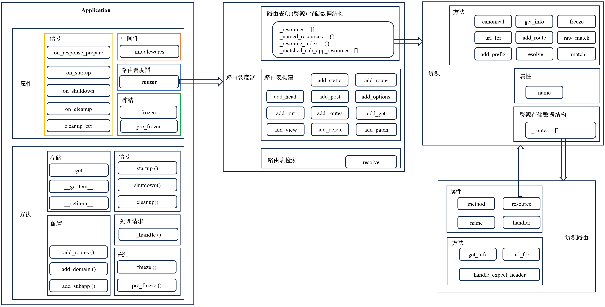

# Application

上图显示了`Application`对象的大体结构，下面将分别介绍`application`、**路由调度器**、
**资源**和**资源路由**对象。
## application
`Application`的初始化如下：
```python
class Application(MutableMapping[Union[str, AppKey[Any]], Any]):
    def __init__(
        self,
        *,
        logger: logging.Logger = web_logger,
        middlewares: Iterable[Middleware] = (),
        handler_args: Optional[Mapping[str, Any]] = None,
        client_max_size: int = 1024**2,
        debug: Any = ...,  # mypy doesn't support ellipsis
    ) -> None:
        ...
        # 路由调度器实例
        self._router = UrlDispatcher()
        # 传递给 RequestHandler 的字典参数
        self._handler_args = handler_args
        self.logger = logger

        self._middlewares: _Middlewares = FrozenList(middlewares)

        # initialized on freezing
        self._middlewares_handlers: _MiddlewaresHandlers = tuple()
        # initialized on freezing
        self._run_middlewares: Optional[bool] = None
        # 存储应用配置变量
        self._state: Dict[Union[AppKey[Any], str], object] = {}
        self._frozen = False
        self._pre_frozen = False
        self._subapps: _Subapps = []
        # 下面是信号机制相关，在执行过程中被调用，附加额外功能
        self._on_response_prepare: _RespPrepareSignal = Signal(self)
        self._on_startup: _AppSignal = Signal(self)
        self._on_shutdown: _AppSignal = Signal(self)
        self._on_cleanup: _AppSignal = Signal(self)
        self._cleanup_ctx = CleanupContext()
        self._on_startup.append(self._cleanup_ctx._on_startup)
        self._on_cleanup.append(self._cleanup_ctx._on_cleanup)
        # 客户端请求的最大大小
        self._client_max_size = client_max_size
```
### 变量存储与获取
`Application`可以方便地存储和读取类似全局变量的`Application`配置，使用样例如下：
```python
my_private_key = web.AppKey("my_private_key", str)
app[my_private_key] = data

async def handler(request: web.Request):
    data = request.app[my_private_key]
    # reveal_type(data) -> str
```
存储和读取变量的底层数据结构是`self._state = {}`，源码如下：
```python
@overload  # type: ignore[override]
def __getitem__(self, key: AppKey[_T]) -> _T: ...

@overload
def __getitem__(self, key: str) -> Any: ...

def __getitem__(self, key: Union[str, AppKey[_T]]) -> Any:
    return self._state[key]

def _check_frozen(self) -> None:
    if self._frozen:
        raise RuntimeError(
            "Changing state of started or joined " "application is forbidden"
        )

@overload  # type: ignore[override]
def __setitem__(self, key: AppKey[_T], value: _T) -> None: ...

@overload
def __setitem__(self, key: str, value: Any) -> None: ...

def __setitem__(self, key: Union[str, AppKey[_T]], value: Any) -> None:
    self._check_frozen()
    ...
    self._state[key] = value

def __delitem__(self, key: Union[str, AppKey[_T]]) -> None:
    self._check_frozen()
    del self._state[key]

@overload  # type: ignore[override]
def get(self, key: AppKey[_T], default: None = ...) -> Optional[_T]: ...

@overload
def get(self, key: AppKey[_T], default: _U) -> Union[_T, _U]: ...

@overload
def get(self, key: str, default: Any = ...) -> Any: ...

def get(self, key: Union[str, AppKey[_T]], default: Any = None) -> Any:
    return self._state.get(key, default)
```
### 中间件机制
`Application`支持中间件机制，中间件有如下作用或特点：
+ 自定义`handler`的行为。
+ 中间件是一个协程，可以用以修改请求或者响应。
+ 中间件接收两个参数：`request`和`handler`，返回一个`response`。
+ 如果传递多个中间件，则中间件的调用链在`handler()`之后按逆序，在`handler()` 之前按顺序。

使用样例如下（如果`aiohttp`版本`>= 4`，则下面的装饰器`@web.middleware`可以去掉）：
```python
from aiohttp import web

async def test(request):
    print('Handler function called')
    return web.Response(text="Hello")

@web.middleware
async def middleware1(request, handler):
    print('Middleware 1 called')
    response = await handler(request)
    print('Middleware 1 finished')
    return response

@web.middleware
async def middleware2(request, handler):
    print('Middleware 2 called')
    response = await handler(request)
    print('Middleware 2 finished')
    return response


app = web.Application(middlewares=[middleware1, middleware2])
app.router.add_get('/', test)
web.run_app(app)
```
例中`test`是用户定义的`handler`，`middleware1`和`middleware2`是中间件，运行结果如下：
```bash
======== Running on http://0.0.0.0:8080 ========
(Press CTRL+C to quit)
Middleware 1 called
Middleware 2 called
Handler function called
Middleware 2 finished
Middleware 1 finished
```
中间件的相关源码如下：
```python
def _fix_request_current_app(app: "Application") -> Middleware:
    async def impl(request: Request, handler: Handler) -> StreamResponse:
        with request.match_info.set_current_app(app):
            return await handler(request)
    return impl

def _prepare_middleware(self) -> Iterator[Middleware]:
    yield from reversed(self._middlewares)
    # 增加一个中间件 (https://github.com/aio-libs/aiohttp/pull/2550)
    # TODO: 等后面请求模块梳理完了，在补充解释这个bug
    yield _fix_request_current_app(self)

async def _handle(self, request: Request) -> StreamResponse:
    match_info = await self._router.resolve(request)
    match_info.add_app(self)
    match_info.freeze()
    resp = None
    request._match_info = match_info
    expect = request.headers.get(hdrs.EXPECT)
    if expect:
        resp = await match_info.expect_handler(request)
        await request.writer.drain()
    if resp is None:
        handler = match_info.handler
        if self._run_middlewares:
            for app in match_info.apps[::-1]:
                assert app.pre_frozen, "middleware handlers are not ready"
                for m in app._middlewares_handlers:
                    # 更新 partial(m, handler=handler) 方法一些属性，使其像 handler一样，
                    # 返回更新后的 partial(m, handler=handler) 方法
                    handler = update_wrapper(partial(m, handler=handler), handler)
        # 如果有中间件，这里的 handler 是最终更新后的 partial(m ,handler) 方法
        resp = await handler(request)
    return resp

def pre_freeze(self) -> None:
    ...
    self._middlewares_handlers = tuple(self._prepare_middleware())
    self._run_middlewares = True if self.middlewares else False
    for subapp in self._subapps:
        subapp.pre_freeze()
        self._run_middlewares = self._run_middlewares or subapp._run_middlewares
```
根据源码可知，中间件机制的执行流程如下：
+ 初始化时候调用`pre_freeze`方法，其中会完成`self._middlewares_handlers`和`self._run_middlewares`变量的更新。
用以更新`self._middlewares_handlers`变量的`self._prepare_middleware`方法是一个生成器，按照参数`self._middlewares`
的逆序生成中间件调用链。
+ 当有客户端发送的请求时，会调用`self._handle`方法处理。如果有中间件，则按初始化阶段构造的顺序，包装生成一个新的
`handler`用以处理请求。

### 信号机制
除了中间件机制外，`Application`也提供了如下的信号机制：
+ `on_response_prepare`：在`response`准备阶段被调用，具体来说就是在准备完`headers`和发送`headers`之前调用。
+ `on_startup`：在应用的启动阶段也就是`setup`阶段被调用。
+ `on_cleanup`：在服务关闭阶段被调用。
+ `on_shutdown`：在服务关闭阶段被调用，但需要在`on_cleanup`之前执行。

信号`on_response_prepare`使用样例如下：
```python
async def on_prepare(request, response):
    response.headers['My-Header'] = 'value'

app.on_response_prepare.append(on_prepare)
```
由于`on_startup`和`on_cleanup`信号对有陷阱，例如在`on_startup`信号中注册有`[create_pg, create_redis]`，
在`on_cleanup`信号中注册有`[dispose_pg, dispose_redis]`，如果`create_pg(app)`执行失败，则`create_redis(app)`不会被执行，
但在服务关闭阶段执行`on_cleanup`信号注册的方法时候，`[dispose_pg, dispose_redis]`都会被执行，这时候就会出错。
解决办法就是`Application`提供了一种新的信号：
+ `cleanup_ctx`：此信号注册的方法确保了只有在 `startup` 阶段执行成功的方法，才会在`cleanup`阶段执行。

信号机制相关的源码如下：
```python
@property
def on_response_prepare(self) -> _RespPrepareSignal:
    return self._on_response_prepare

@property
def on_startup(self) -> _AppSignal:
    return self._on_startup

@property
def on_shutdown(self) -> _AppSignal:
    return self._on_shutdown

@property
def on_cleanup(self) -> _AppSignal:
    return self._on_cleanup

@property
def cleanup_ctx(self) -> "CleanupContext":
    return self._cleanup_ctx

async def startup(self) -> None:
    """Causes on_startup signal

    Should be called in the event loop along with the request handler.
    """
    await self.on_startup.send(self)

async def shutdown(self) -> None:
    """Causes on_shutdown signal

    Should be called before cleanup()
    """
    await self.on_shutdown.send(self)

async def cleanup(self) -> None:
    """Causes on_cleanup signal

    Should be called after shutdown()
    """
    if self.on_cleanup.frozen:
        await self.on_cleanup.send(self)
    else:
        # If an exception occurs in startup, ensure cleanup contexts are completed.
        await self._cleanup_ctx._on_cleanup(self)
```
根据源码和初始化部分可知，每一种信号都是`aiosignal.Signal`类，其源码如下：
```python
class Signal(FrozenList):
    """Coroutine-based signal implementation.

    To connect a callback to a signal, use any list method.

    Signals are fired using the send() coroutine, which takes named
    arguments.
    """

    __slots__ = ("_owner",)

    def __init__(self, owner):
        super().__init__()
        self._owner = owner

    ...

    async def send(self, *args, **kwargs):
        """
        Sends data to all registered receivers.
        """
        if not self.frozen:
            raise RuntimeError("Cannot send non-frozen signal.")

        for receiver in self:
            await receiver(*args, **kwargs)  # type: ignore
```
在初始化阶段有如下设置：
```python
self._on_startup.append(self._cleanup_ctx._on_startup)
self._on_cleanup.append(self._cleanup_ctx._on_cleanup)
```
上述代码确保了在`cleanup_ctx`信号注册的方法在`start`和`cleanup`阶段被正常执行。`CleanupContext`的源码如下：
```python
class CleanupContext(_CleanupContextBase):
    def __init__(self) -> None:
        super().__init__()
        self._exits: List[AsyncIterator[None]] = []

    async def _on_startup(self, app: Application) -> None:
        for cb in self:
            it = cb(app).__aiter__()
            await it.__anext__()
            self._exits.append(it)

    async def _on_cleanup(self, app: Application) -> None:
        errors = []
        for it in reversed(self._exits):
            try:
                await it.__anext__()
            except StopAsyncIteration:
                pass
            except Exception as exc:
                errors.append(exc)
            else:
                errors.append(RuntimeError(f"{it!r} has more than one 'yield'"))
        if errors:
            if len(errors) == 1:
                raise errors[0]
            else:
                raise CleanupError("Multiple errors on cleanup stage", errors)
```
根据`CleanupContext`源码可知，被注册的方法必须是只有一个`yield`表达式的异步生成器。**异步生成器**是指：
使用`async def`定义一个函数，并在函数内部使用`yield`语句来产生值，其允许在生成值的过程中进行异步操作。样例如下：
```python
async def pg_engine(app: web.Application):
    # 异步操作
    app[pg_engine] = await create_async_engine(
        "postgresql+asyncpg://postgre:@localhost:5432/postgre"
    )
    # 生成值
    yield
    await app[pg_engine].dispose()

app.cleanup_ctx.append(pg_engine)
```
源码中`__aiter__()`会返回一个异步生成器对象，`__anext__()`方法会开始异常生成器的执行，一直到`yield`处暂停，
如果没有`yield`表达式，则抛出`StopAsyncIteration`异常。<br>

### 应用嵌套
`Application`也提供了嵌套应用的机制。样例如下：
```python
admin = web.Application()
admin.add_routes([web.get('/resource', handler, name='name')])

app.add_subapp('/admin/', admin)

url = admin.router['name'].url_for()
# URL('/admin/resource')
```
和嵌套应用相关的源码如下：
```python
def _reg_subapp_signals(self, subapp: "Application") -> None:
    def reg_handler(signame: str) -> None:
        subsig = getattr(subapp, signame)

        async def handler(app: "Application") -> None:
            await subsig.send(subapp)

        appsig = getattr(self, signame)
        appsig.append(handler)

    reg_handler("on_startup")
    reg_handler("on_shutdown")
    reg_handler("on_cleanup")

def add_subapp(self, prefix: str, subapp: "Application") -> AbstractResource:
    if not isinstance(prefix, str):
        raise TypeError("Prefix must be str")
    prefix = prefix.rstrip("/")
    if not prefix:
        raise ValueError("Prefix cannot be empty")
    factory = partial(PrefixedSubAppResource, prefix, subapp)
    return self._add_subapp(factory, subapp)

def _add_subapp(
    self, resource_factory: Callable[[], AbstractResource], subapp: "Application"
) -> AbstractResource:
    if self.frozen:
        raise RuntimeError("Cannot add sub application to frozen application")
    if subapp.frozen:
        raise RuntimeError("Cannot add frozen application"
    resource = resource_factory()
    self.router.register_resource(resource)
    self._reg_subapp_signals(subapp)
    self._subapps.append(subapp)
    subapp.pre_freeze()
    return resource

def add_domain(self, domain: str, subapp: "Application") -> AbstractResource:
    if not isinstance(domain, str):
        raise TypeError("Domain must be str")
    elif "*" in domain:
        rule: Domain = MaskDomain(domain)
    else:
        rule = Domain(domain)
    factory = partial(MatchedSubAppResource, rule, subapp)
    return self._add_subapp(factory, subapp)
```
TODO 等下面的资源梳理完来，在解释嵌套应用的实现原理

### 路由调度器对象
`Application`提供路由调度器实例属性，相关源码如下：
```python
self._router = UrlDispatcher()

def add_routes(self, routes: Iterable[AbstractRouteDef]) -> List[AbstractRoute]:
    return self.router.add_routes(routes)

@property
def router(self) -> UrlDispatcher:
    return self._router
```
路由调度器完成路由表的建立与查询。

## 路由调度器
路由调度器`UrlDispatcher`初始化源码如下：
```python
class UrlDispatcher(AbstractRouter, Mapping[str, AbstractResource]):
    NAME_SPLIT_RE = re.compile(r"[.:-]")
    HTTP_NOT_FOUND = HTTPNotFound()

    def __init__(self) -> None:
        super().__init__()
        # 用于存储所有的路由表项
        self._resources: List[AbstractResource] = []
        # 只存储具名的路由表项
        self._named_resources: Dict[str, AbstractResource] = {}
        # 建立路由索引和路由表项关系映射，用于后续的路由选择
        self._resource_index: dict[str, list[AbstractResource]] = {}
        # 存储子app相关的路由表项
        self._matched_sub_app_resources: List[MatchedSubAppResource] = []
```
初始化阶段主要完成用于存储注册的路由表项的数据结构（注册添加的每一项路由规则都对应一个资源，也即一个路由表项）。
### 路由表建立
路由调度器`UrlDispatcher`提供来三种不同的路由项注册能力：http 请求方法路由项、静态资源路由项和基于类视图路由项。<br>

用于 http 请求方法路由项注册的样例如下：
```python
async def hello(request):
    return web.Response(text="Hello, world")

app.router.add_get('/', hello) # 注册一个路由项，也即注册一个资源
```
相关源码实现如下：
```python
def add_head(self, path: str, handler: Handler, **kwargs: Any) -> AbstractRoute:
        """Shortcut for add_route with method HEAD."""
        return self.add_route(hdrs.METH_HEAD, path, handler, **kwargs)

def add_options(self, path: str, handler: Handler, **kwargs: Any) -> AbstractRoute:
    """Shortcut for add_route with method OPTIONS."""
    return self.add_route(hdrs.METH_OPTIONS, path, handler, **kwargs)

def add_get(
    self,
    path: str,
    handler: Handler,
    *,
    name: Optional[str] = None,
    allow_head: bool = True,
    **kwargs: Any,
) -> AbstractRoute:
    """Shortcut for add_route with method GET.

    If allow_head is true, another
    route is added allowing head requests to the same endpoint.
    """
    resource = self.add_resource(path, name=name)
    if allow_head:
        resource.add_route(hdrs.METH_HEAD, handler, **kwargs)
    return resource.add_route(hdrs.METH_GET, handler, **kwargs)

def add_post(self, path: str, handler: Handler, **kwargs: Any) -> AbstractRoute:
    """Shortcut for add_route with method POST."""
    return self.add_route(hdrs.METH_POST, path, handler, **kwargs)

def add_put(self, path: str, handler: Handler, **kwargs: Any) -> AbstractRoute:
    """Shortcut for add_route with method PUT."""
    return self.add_route(hdrs.METH_PUT, path, handler, **kwargs)

def add_patch(self, path: str, handler: Handler, **kwargs: Any) -> AbstractRoute:
    """Shortcut for add_route with method PATCH."""
    return self.add_route(hdrs.METH_PATCH, path, handler, **kwargs)

def add_delete(self, path: str, handler: Handler, **kwargs: Any) -> AbstractRoute:
    """Shortcut for add_route with method DELETE."""
    return self.add_route(hdrs.METH_DELETE, path, handler, **kwargs)
```
从源码可知，`add_xxx`方法内部会调用`self.add_route`方法（`self.add_get`调用逻辑其实就是`self.add_route`方法内部逻辑），
`self.add_route`源码如下：
```python
def add_route(
    self,
    method: str,
    path: str,
    handler: Union[Handler, Type[AbstractView]],
    *,
    name: Optional[str] = None,
    expect_handler: Optional[_ExpectHandler] = None,
) -> AbstractRoute:
    resource = self.add_resource(path, name=name)
    return resource.add_route(method, handler, expect_handler=expect_handler)

def add_resource(self, path: str, *, name: Optional[str] = None) -> Resource:
    if path and not path.startswith("/"):
        raise ValueError("path should be started with / or be empty")
    # Reuse last added resource if path and name are the same
    # 如果连续两次注册路由表项是同一个 name 和同一个 path，只是方法不同，
    # 例如: app.router.add_get("/run", get), app.router.add_post("/run", post)，
    # 则共用一个资源（路由表项）
    if self._resources:
        resource = self._resources[-1]
        if resource.name == name and resource.raw_match(path):
            return cast(Resource, resource)
    if not ("{" in path or "}" in path or ROUTE_RE.search(path)):
        resource = PlainResource(_requote_path(path), name=name)
        self.register_resource(resource)
        return resource
    # 注册的 path 有 {}，例如 "/run/{name}"
    resource = DynamicResource(path, name=name)
    self.register_resource(resource)
    return resource

def register_resource(self, resource: AbstractResource) -> None:
    ...
    name = resource.name

    if name is not None:
        ...
        if name in self._named_resources:
            raise ValueError(
                "Duplicate {!r}, "
                "already handled by {!r}".format(name, self._named_resources[name])
            )
        # 记录具名资源（路由表项）
        self._named_resources[name] = resource
    # 记录资源（路由表项）
    self._resources.append(resource)
    if isinstance(resource, MatchedSubAppResource):
        # We cannot index match sub-app resources because they have match rules
        # 记录子 app 资源（路由表项）
        self._matched_sub_app_resources.append(resource)
    else:
        # 记录路由索引和路由表项（资源）关系
        self.index_resource(resource)

def _get_resource_index_key(self, resource: AbstractResource) -> str:
    """Return a key to index the resource in the resource index."""
    # strip at the first { to allow for variables
    # 提取固定路径，例如 "/run/{name}" 则得到 "/run"作为索引
    return resource.canonical.partition("{")[0].rstrip("/") or "/"

def index_resource(self, resource: AbstractResource) -> None:
    """Add a resource to the resource index."""
    resource_key = self._get_resource_index_key(resource)
    # There may be multiple resources for a canonical path
    # so we keep them in a list to ensure that registration
    # order is respected.
    self._resource_index.setdefault(resource_key, []).append(resource)
```
由源码可知，注册的每一个路由项，在内部都作为一个资源，例如`PlainResource`、
`DynamicResource`、`MatchedSubAppResource`等资源。资源的内部是如何实现的，
我们在下一小节进行介绍。`self.add_route`注册完资源后，接下来会调用`resource.add_route`方法将具体请求方法、
`handler`等信息和资源绑定。

下面看下用于类视图路由项注册。使用样例如下：
```python
class MyView(web.View):
    async def get(self):
        return await get_resp(self.request)

    async def post(self):
        return await post_resp(self.request)
# Example will process GET and POST requests for /path/to
# but raise 405 Method not allowed exception for unimplemented HTTP methods
web.view('/path/to', MyView)
```
相关源码实现如下：
```python
def add_view(
    self, path: str, handler: Type[AbstractView], **kwargs: Any
) -> AbstractRoute:
    """Shortcut for add_route with ANY methods for a class-based view."""
    return self.add_route(hdrs.METH_ANY, path, handler, **kwargs)
```
`self.add_view`内部也是调用`self.add_route`，请求方法是所有的方法。`web.View`实现如下：
```python
class AbstractView(ABC):
    """Abstract class based view."""

    def __init__(self, request: Request) -> None:
        # 被调用也就是被实例化时候，接收一个 request 参数
        self._request = request

    @property
    def request(self) -> Request:
        """Request instance."""
        return self._request

    @abstractmethod
    def __await__(self) -> Generator[Any, None, StreamResponse]:
        """Execute the view handler."""

class View(AbstractView):
    async def _iter(self) -> StreamResponse:
        if self.request.method not in hdrs.METH_ALL:
            self._raise_allowed_methods()
        # 获取和请求方法同名的 handle 属性，例如 MyView.get
        method: Optional[Callable[[], Awaitable[StreamResponse]]] = getattr(
            self, self.request.method.lower(), None
        )
        if method is None:
            self._raise_allowed_methods()
        return await method()

    def __await__(self) -> Generator[Any, None, StreamResponse]:
        return self._iter().__await__()

    def _raise_allowed_methods(self) -> NoReturn:
        allowed_methods = {m for m in hdrs.METH_ALL if hasattr(self, m.lower())}
        raise HTTPMethodNotAllowed(self.request.method, allowed_methods)
```
最后看一下用于静态资源路由项注册。使用样例如下：
```python
router.add_static("/static", path_to_static_folder)
```
源码实现如下：
```python
def add_static(
    self,
    prefix: str,
    path: PathLike,
    *,
    name: Optional[str] = None,
    expect_handler: Optional[_ExpectHandler] = None,
    chunk_size: int = 256 * 1024,
    show_index: bool = False,
    follow_symlinks: bool = False,
    append_version: bool = False,
) -> AbstractResource:
    """Add static files view.

    prefix - url prefix
    path - folder with files

    """
    assert prefix.startswith("/")
    if prefix.endswith("/"):
        prefix = prefix[:-1]
    resource = StaticResource(
        prefix,
        path,
        name=name,
        expect_handler=expect_handler,
        chunk_size=chunk_size,
        show_index=show_index,
        follow_symlinks=follow_symlinks,
        append_version=append_version,
    )
    self.register_resource(resource)
    return resource
```
从源码可知，`add_static`主要使用`StaticResource`资源，将在下一小节介绍，
最后将资源添加到路由表中。

路由调度器`UrlDispatcher`也提供了批量注册路由项的接口，源码如下：
```python
def add_routes(self, routes: Iterable[AbstractRouteDef]) -> List[AbstractRoute]:
    """Append routes to route table.

    Parameter should be a sequence of RouteDef objects.

    Returns a list of registered AbstractRoute instances.
    """
    registered_routes = []
    for route_def in routes:
        registered_routes.extend(route_def.register(self))
    return registered_routes
```
使用样例如下：
```python
app.add_routes([web.get('/path1', get_1),
                web.post('/path1', post_1),
                web.get('/path2', get_2),
                web.post('/path2', post_2)]
```

### 路由表检索
路由表检索就是根据请求的`path`从路由表中找到最佳的匹配资源（路由项），
进而找到注册的处理请求`handler`。相关源码如下：
```python
async def resolve(self, request: Request) -> UrlMappingMatchInfo:
    resource_index = self._resource_index
    allowed_methods: Set[str] = set()

    # Walk the url parts looking for candidates. We walk the url backwards
    # to ensure the most explicit match is found first. If there are multiple
    # candidates for a given url part because there are multiple resources
    # registered for the same canonical path, we resolve them in a linear
    # fashion to ensure registration order is respected.
    url_part = request.rel_url.raw_path
    while url_part:
        for candidate in resource_index.get(url_part, ()):
            # match_dict 是一个 UrlMappingMatchInfo 对象，下面资源章节有详细介绍
            # allowed 是一个 Set，表示当前资源允许的请求方法
            match_dict, allowed = await candidate.resolve(request)
            if match_dict is not None:
                return match_dict
            else:
                allowed_methods |= allowed
        if url_part == "/":
            break
        # 从 url_part 右边分割字符
        # 样例: str = "www.runoob.com"，str.rpartition(".") ==> ('www.runoob', '.', 'com')
        url_part = url_part.rpartition("/")[0] or "/"

    #
    # We didn't find any candidates, so we'll try the matched sub-app
    # resources which we have to walk in a linear fashion because they
    # have regex/wildcard match rules and we cannot index them.
    #
    # For most cases we do not expect there to be many of these since
    # currently they are only added by `add_domain`
    #
    # subapp 资源有两种：PrefixedSubAppResource 和 MatchedSubAppResource
    for resource in self._matched_sub_app_resources:
        match_dict, allowed = await resource.resolve(request)
        if match_dict is not None:
            return match_dict
        else:
            allowed_methods |= allowed

    if allowed_methods:
        return MatchInfoError(HTTPMethodNotAllowed(request.method, allowed_methods))

    return MatchInfoError(self.HTTP_NOT_FOUND)
```
TODO 路由检索流程机制

## 资源
**资源是路由表中的一项**，`aiohttp`提供了多种不同的资源类型。
### 用于 http 请求方法的资源
`PlainResource`表示`path`是固定路径的资源，例如`path = /run`。相关源码实现如下：
```python
class PlainResource(Resource):
    def __init__(self, path: str, *, name: Optional[str] = None) -> None:
        super().__init__(name=name)
        assert not path or path.startswith("/")
        self._path = path

    @property
    def canonical(self) -> str:
        return self._path

    def freeze(self) -> None:
        if not self._path:
            self._path = "/"

    def add_prefix(self, prefix: str) -> None:
        assert prefix.startswith("/")
        assert not prefix.endswith("/")
        assert len(prefix) > 1
        self._path = prefix + self._path

    def _match(self, path: str) -> Optional[Dict[str, str]]:
        # string comparison is about 10 times faster than regexp matching
        if self._path == path:
            return {}
        else:
            return None

    def raw_match(self, path: str) -> bool:
        return self._path == path

    def get_info(self) -> _InfoDict:
        return {"path": self._path}

    def url_for(self) -> URL:  # type: ignore[override]
        return URL.build(path=self._path, encoded=True)

    def __repr__(self) -> str:
        name = "'" + self.name + "' " if self.name is not None else ""
        return f"<PlainResource {name} {self._path}>"
```
`PlainResource`接收的`path`参数要么为空（内部会转为默认的`/`），要么必须以`/`开头。`PlainResource`继承`Resource`类，
源码实现如下：
```python
class Resource(AbstractResource):
    def __init__(self, *, name: Optional[str] = None) -> None:
        super().__init__(name=name)
        self._routes: List[ResourceRoute] = []

    def add_route(
        self,
        method: str,
        handler: Union[Type[AbstractView], Handler],
        *,
        expect_handler: Optional[_ExpectHandler] = None,
    ) -> "ResourceRoute":
        for route_obj in self._routes:
            if route_obj.method == method or route_obj.method == hdrs.METH_ANY:
                raise RuntimeError(
                    "Added route will never be executed, "
                    "method {route.method} is already "
                    "registered".format(route=route_obj)
                )

        route_obj = ResourceRoute(method, handler, self, expect_handler=expect_handler)
        self.register_route(route_obj)
        return route_obj

    def register_route(self, route: "ResourceRoute") -> None:
        assert isinstance(
            route, ResourceRoute
        ), f"Instance of Route class is required, got {route!r}"
        self._routes.append(route)

    async def resolve(self, request: Request) -> _Resolve:
        allowed_methods: Set[str] = set()

        match_dict = self._match(request.rel_url.raw_path)
        if match_dict is None:
            return None, allowed_methods

        for route_obj in self._routes:
            route_method = route_obj.method
            allowed_methods.add(route_method)

            if route_method == request.method or route_method == hdrs.METH_ANY:
                return (UrlMappingMatchInfo(match_dict, route_obj), allowed_methods)
        else:
            return None, allowed_methods

    @abc.abstractmethod
    def _match(self, path: str) -> Optional[Dict[str, str]]:
        pass  # pragma: no cover

    def __len__(self) -> int:
        return len(self._routes)

    def __iter__(self) -> Iterator["ResourceRoute"]:
        return iter(self._routes)
```
`PlainResource`提供的属性或方法如下（没有特殊备注的都表示方法）：
+ `name`（属性）：返回调用者指定的名字，也即 name 参数值；
+ `canonical`（属性）：返回调用者指定的 path 参数值；
+ `add_prefix`：给`path`添加一个前缀`prefix`，`prefix`必须以`/`开头，但不能以`/`结尾；
+ `_match`：如果路径相等，返回一个`{}`，如果不匹配返回`None`；
+ `raw_match`：表示和原始注册的`path`是否相等，返回`True`表示相等，否则返回`False`；
+ `get_info`：返回一个固定的字典对象 `{"path": self._path}`；
+ `url_for`：利用`yarl.URL.build`构建资源中的 url (`path`)，返回`URL`对象。

父类`Resource`中会维护一个列表`self._routes: List[ResourceRoute] = []`，存放当前资源有哪些路由项（`ResourceRoute`数据类型，也即资源路由），
资源路由`ResourceRoute`数据结构在下一小节详细介绍。`Resource`提供了路由注册和路由检索能力，源码实现如下：
```python
def add_route(
    self,
    method: str,
    handler: Union[Type[AbstractView], Handler],
    *,
    expect_handler: Optional[_ExpectHandler] = None,
) -> "ResourceRoute":
    for route_obj in self._routes:
        # 当前资源已经注册过路由，只允许注册不同的请求方法
        if route_obj.method == method or route_obj.method == hdrs.METH_ANY:
            raise RuntimeError(
                "Added route will never be executed, "
                "method {route.method} is already "
                "registered".format(route=route_obj)
            )

    route_obj = ResourceRoute(method, handler, self, expect_handler=expect_handler)
    self.register_route(route_obj)
    return route_obj

def register_route(self, route: "ResourceRoute") -> None:
    assert isinstance(
        route, ResourceRoute
    ), f"Instance of Route class is required, got {route!r}"
    self._routes.append(route)

async def resolve(self, request: Request) -> _Resolve:
    allowed_methods: Set[str] = set()

    match_dict = self._match(request.rel_url.raw_path)
    if match_dict is None:
        # 如果资源路径和请求路径不匹配
        return None, allowed_methods
    # 遍历当前资源内部所有的路由项，直到找到和请求方法匹配的路由项
    for route_obj in self._routes:
        route_method = route_obj.method
        allowed_methods.add(route_method)

        if route_method == request.method or route_method == hdrs.METH_ANY:
            return (UrlMappingMatchInfo(match_dict, route_obj), allowed_methods)
    else:
        return None, allowed_methods
```
路由检索方法`resolve`内部使用了`for ... else ...`语法：
> 如果`for`里的逻辑正常执行完，则`else`逻辑会执行；如果`for`里的逻辑提前退出，例如遇到`break`或者`return`，
则`else`逻辑不会执行。

如果检索成功，即当前资源中找到匹配的路由项，则返回`(UrlMappingMatchInfo, Set)`元组对象，其中`Set`表示当前资源允许请求方法的集合。
如果检索失败，返回`(None, Set)`对象。`UrlMappingMatchInfo`的实现源码如下：
```python
class UrlMappingMatchInfo(BaseDict, AbstractMatchInfo):
    def __init__(self, match_dict: Dict[str, str], route: AbstractRoute):
        super().__init__(match_dict)
        self._route = route
        self._apps: List[Application] = []
        self._current_app: Optional[Application] = None
        self._frozen = False

    @property
    def handler(self) -> Handler:
        return self._route.handler

    @property
    def route(self) -> AbstractRoute:
        return self._route

    @property
    def expect_handler(self) -> _ExpectHandler:
        return self._route.handle_expect_header

    @property
    def http_exception(self) -> Optional[HTTPException]:
        return None

    def get_info(self) -> _InfoDict:  # type: ignore[override]
        return self._route.get_info()

    @property
    def apps(self) -> Tuple["Application", ...]:
        return tuple(self._apps)

    def add_app(self, app: "Application") -> None:
        if self._frozen:
            raise RuntimeError("Cannot change apps stack after .freeze() call")
        if self._current_app is None:
            self._current_app = app
        self._apps.insert(0, app)

    @property
    def current_app(self) -> "Application":
        app = self._current_app
        assert app is not None
        return app

    @contextmanager
    def set_current_app(self, app: "Application") -> Generator[None, None, None]:
        if DEBUG:  # pragma: no cover
            if app not in self._apps:
                raise RuntimeError(
                    "Expected one of the following apps {!r}, got {!r}".format(
                        self._apps, app
                    )
                )
        prev = self._current_app
        self._current_app = app
        try:
            yield
        finally:
            self._current_app = prev

    def freeze(self) -> None:
        self._frozen = True

    def __repr__(self) -> str:
        return f"<MatchInfo {super().__repr__()}: {self._route}>"
```
从源码可知，`UrlMappingMatchInfo`本身是个字典对象，可以像使用字典一样使用它（看作是使用`match_dict`），除此之外，
`UrlMappingMatchInfo`还提供了一些额外的属性和方法。属性`handler`、`route`、`expect_handler`和方法`get_info`
是直接返回资源路由对象`route`的同名属性或方法。

TODO 其他资源类型介绍完在补充这里的 app 相关的方法介绍

`DynamicResource`表示`path`带有可变路径的资源，例如`path = /run/{name}`。可变部分被指定在`{identifier}`，
相关源码实现如下：
```python
# 匹配 {} 内容，包括 {} 本身
ROUTE_RE: Final[Pattern[str]] = re.compile(r"(\{[_a-zA-Z][^{}]*(?:\{[^{}]*\}[^{}]*)*\})")

class DynamicResource(Resource):
    # 匹配形如 {var} 的字符串
    DYN = re.compile(r"\{(?P<var>[_a-zA-Z][_a-zA-Z0-9]*)\}")
    # 匹配形如 {var:re} 的字符串
    DYN_WITH_RE = re.compile(r"\{(?P<var>[_a-zA-Z][_a-zA-Z0-9]*):(?P<re>.+)\}")
    GOOD = r"[^{}/]+"

    def __init__(self, path: str, *, name: Optional[str] = None) -> None:
        super().__init__(name=name)
        pattern = ""
        formatter = ""
        # 如果 path = "/run/{name}" 则 split 输出：["/run/", "{name}", ""]
        # 如果 path = "/run/{name}/{hello}/aaa" 则 split 输出：["/run/", "{name}", "/", "{hello}", "/aaa"]
        for part in ROUTE_RE.split(path):
            match = self.DYN.fullmatch(part)
            if match:
                # 如果是形如 {var} 的字符串
                pattern += "(?P<{}>{})".format(match.group("var"), self.GOOD)
                formatter += "{" + match.group("var") + "}"
                continue

            match = self.DYN_WITH_RE.fullmatch(part)
            if match:
                # 如果是形如 {var: re} 的字符串
                pattern += "(?P<{var}>{re})".format(**match.groupdict())
                formatter += "{" + match.group("var") + "}"
                continue

            if "{" in part or "}" in part:
                raise ValueError(f"Invalid path '{path}'['{part}']")

            # 不包含可变部分 {}
            part = _requote_path(part)
            formatter += part
            # print(re.escape('https://www.python.org')) ==> https://www\.python\.org
            pattern += re.escape(part)

        try:
            compiled = re.compile(pattern)
        except re.error as exc:
            raise ValueError(f"Bad pattern '{pattern}': {exc}") from None
        # PATH_SEP: Final[str] = re.escape("/")
        assert compiled.pattern.startswith(PATH_SEP)
        assert formatter.startswith("/")
        self._pattern = compiled
        self._formatter = formatter

    @property
    def canonical(self) -> str:
        # 返回原始的 path，如果 path = "/run/{name}/aaa" ==> "/run/{name}/aaa"
        # 如果 path = "/run/{name:.*}/aaa" ==> "/run/{name}/aaa"
        return self._formatter

    def add_prefix(self, prefix: str) -> None:
        assert prefix.startswith("/")
        assert not prefix.endswith("/")
        assert len(prefix) > 1
        self._pattern = re.compile(re.escape(prefix) + self._pattern.pattern)
        self._formatter = prefix + self._formatter

    def _match(self, path: str) -> Optional[Dict[str, str]]:
        match = self._pattern.fullmatch(path)
        if match is None:
            return None
        else:
            return {
                key: _unquote_path(value) for key, value in match.groupdict().items()
            }

    def raw_match(self, path: str) -> bool:
        return self._formatter == path

    def get_info(self) -> _InfoDict:
        return {"formatter": self._formatter, "pattern": self._pattern}

    def url_for(self, **parts: str) -> URL:
        # 替换 formatter 中的占位符
        url = self._formatter.format_map({k: _quote_path(v) for k, v in parts.items()})
        return URL.build(path=url, encoded=True)

    def __repr__(self) -> str:
        name = "'" + self.name + "' " if self.name is not None else ""
        return "<DynamicResource {name} {formatter}>".format(
            name=name, formatter=self._formatter
        )
```
`DynamicResource`提供的属性或方法如下（没有特殊备注的都表示方法）：
+ `name`（属性）：返回调用者指定的名字，也即 name 参数值；
+ `canonical`（属性）：返回调用者指定的 path 参数值，结果参考下面三种情况；
    > path = "/run" ==> "/run" <br>
    > path = "/run/{name}/aaa" ==> "/run/{name}/aaa" <br>
    > path = "/run/{name:.*}/aaa" ==> "/run{name}/aaa" <br>
+ `add_prefix`：给`formatter`添加一个前缀`prefix`，`prefix`必须以`/`开头，但不能以`/`结尾；同时给匹配模式`pattern`
也会添加前缀`re.escape(prefix)`；
+ `_match`：如果路径不匹配返回`None`，如果路径匹配返回一个字典，字典中的 key 表示注册可变部分占位符名，
value 表示和占位符匹配的实际值，样例说明如下：
    > path = "/run/{name}/aaa"，则 self._match("/run/123/aaa") 返回 {"name": "123"}
+ `raw_match`：表示和原始注册的`self._formatter`（参考`canonical`属性）是否相等，返回`True`表示相等，否则返回`False`；
+ `get_info`：返回一个固定的字典对象 `{"formatter": self._formatter, "pattern": self._pattern}`；
+ `url_for`：首先替换注册路径中的可变部分为实际的值，然后利用`yarl.URL.build`构建资源中的 url (`path`)，返回`URL`对象。


### 子应用资源
子应用资源有两种：用于域名注册的`MatchedSubAppResource`和用`path`注册的`PrefixedSubAppResource`。
我们先看`PrefixedSubAppResource`资源的内部实现，相关源码如下：
```python
class PrefixedSubAppResource(PrefixResource):
    def __init__(self, prefix: str, app: "Application") -> None:
        super().__init__(prefix)
        # subapp
        self._app = app
        self._add_prefix_to_resources(prefix)

    def add_prefix(self, prefix: str) -> None:
        super().add_prefix(prefix)
        self._add_prefix_to_resources(prefix)

    def _add_prefix_to_resources(self, prefix: str) -> None:
        # subapp 的路由调度器实例
        router = self._app.router
        # 给 subapp 中路由调度器注册的每一路由项(资源)对应的 path 添加前缀 prefix
        for resource in router.resources():
            # Since the canonical path of a resource is about
            # to change, we need to unindex it and then reindex
            router.unindex_resource(resource)
            resource.add_prefix(prefix)
            router.index_resource(resource)

    def url_for(self, *args: str, **kwargs: str) -> URL:
        raise RuntimeError(".url_for() is not supported " "by sub-application root")

    def get_info(self) -> _InfoDict:
        return {"app": self._app, "prefix": self._prefix}

    async def resolve(self, request: Request) -> _Resolve:
        # 委托调用 subapp 中路由调度器路由检索方法
        # match_info 是一个 UrlMappingMatchInfo 对象
        match_info = await self._app.router.resolve(request)
        match_info.add_app(self._app)
        if isinstance(match_info.http_exception, HTTPMethodNotAllowed):
            methods = match_info.http_exception.allowed_methods
        else:
            methods = set()
        return match_info, methods

    def __len__(self) -> int:
        return len(self._app.router.routes())

    def __iter__(self) -> Iterator[AbstractRoute]:
        # 每一项都是资源路由对象
        return iter(self._app.router.routes())

    def __repr__(self) -> str:
        return "<PrefixedSubAppResource {prefix} -> {app!r}>".format(
            prefix=self._prefix, app=self._app
        )
```
`PrefixedSubAppResource`继承于`PrefixResource`，其源码实现如下：
```python
class PrefixResource(AbstractResource):
    def __init__(self, prefix: str, *, name: Optional[str] = None) -> None:
        assert not prefix or prefix.startswith("/"), prefix
        assert prefix in ("", "/") or not prefix.endswith("/"), prefix
        super().__init__(name=name)
        self._prefix = _requote_path(prefix)
        # 用于静态资源路由检索，必须以 / 结尾
        self._prefix2 = self._prefix + "/"

    @property
    def canonical(self) -> str:
        return self._prefix

    def add_prefix(self, prefix: str) -> None:
        assert prefix.startswith("/")
        assert not prefix.endswith("/")
        assert len(prefix) > 1
        self._prefix = prefix + self._prefix
        self._prefix2 = self._prefix + "/"

    def raw_match(self, prefix: str) -> bool:
        return False
```
在`PrefixedSubAppResource`初始化阶段会将调用者传递的`prefix`作为前缀添加到 subapp 中路由调度器注册的每一路由项(资源)对应的 `path`，
样例说明如下：
```python
# admin 是 subapp
admin = web.Application()
#注册资源（路由项）
admin.add_routes([web.get('/resource', handler, name='name')])

app.add_subapp('/admin/', admin)

url = admin.router['name'].url_for()
# URL('/admin/resource')
```
`PrefixedSubAppResource`提供的属性或方法如下（没有特殊备注的都表示方法）：
+ `name`（属性）：返回调用者指定的名字，也即 name 参数值；
+ `canonical`（属性）：返回调用者指定的 prefix 参数值；
+ `add_prefix`：给`_prefix`添加一个前缀`prefix`，`prefix`必须以`/`开头，但不能以`/`结尾；
最后会更新 subapp 中路由调度器实例中注册的所有资源前缀；
+ `get_info`：返回固定的字典对象`{"app": self._app, "prefix": self._prefix}`；

`PrefixedSubAppResource`也提供了路由检索方法`resolve`，其内部会委托调用 subapp 中路由调度器的路由检索方法，
具体可以参考上面路由表检索小结介绍。

接下来我们看下用于域名注册的`MatchedSubAppResource`资源内部实现。`MatchedSubAppResource`资源初始化参数`rule`是`Domain`
或者`MaskDomain`类型，其相关源码实现如下：
```python
class Domain(AbstractRuleMatching):
    # 匹配一个不以连字符 "-" 开始或结尾的长度为 1 到 63 的字符串，且字符串只包含小写字母、数字和连字符
    re_part = re.compile(r"(?!-)[a-z\d-]{1,63}(?<!-)")

    def __init__(self, domain: str) -> None:
        super().__init__()
        self._domain = self.validation(domain)

    @property
    def canonical(self) -> str:
        return self._domain

    def validation(self, domain: str) -> str:
        if not isinstance(domain, str):
            raise TypeError("Domain must be str")
        domain = domain.rstrip(".").lower()
        if not domain:
            raise ValueError("Domain cannot be empty")
        elif "://" in domain:
            raise ValueError("Scheme not supported")
        url = URL("http://" + domain)
        assert url.raw_host is not None
        if not all(self.re_part.fullmatch(x) for x in url.raw_host.split(".")):
            raise ValueError("Domain not valid")
        if url.port == 80:
            return url.raw_host
        return f"{url.raw_host}:{url.port}"

    async def match(self, request: Request) -> bool:
        host = request.headers.get(hdrs.HOST)
        if not host:
            return False
        return self.match_domain(host)

    def match_domain(self, host: str) -> bool:
        return host.lower() == self._domain

    def get_info(self) -> _InfoDict:
        return {"domain": self._domain}

# 域名中有 *
class MaskDomain(Domain):
    # 匹配一个不以连字符 "-" 开始或结尾的长度为 1 到 63 的字符串，且字符串只包含小写字母、数字、星号 "*" 和连字符 "-"
    re_part = re.compile(r"(?!-)[a-z\d\*-]{1,63}(?<!-)")

    def __init__(self, domain: str) -> None:
        super().__init__(domain)
        mask = self._domain.replace(".", r"\.").replace("*", ".*")
        self._mask = re.compile(mask)

    @property
    def canonical(self) -> str:
        return self._mask.pattern

    def match_domain(self, host: str) -> bool:
        return self._mask.fullmatch(host) is not None
```
`Domain`和`MaskDomain`提供了用于后续路由检索的`match`方法，内部执行逻辑如下：
+ 如果请求`headers`中没指定`Host`头，则直接不匹配；
+ 如果请求`headers`中`Host`头值和注册的域名`self._domain`相等或者满足正则规则，则匹配成功，否则失败；

现在可以看下`MatchedSubAppResource`资源相关源码实现：
```python
class MatchedSubAppResource(PrefixedSubAppResource):
    def __init__(self, rule: AbstractRuleMatching, app: "Application") -> None:
        AbstractResource.__init__(self)
        self._prefix = ""
        # subapp
        self._app = app
        self._rule = rule

    @property
    def canonical(self) -> str:
        return self._rule.canonical

    def get_info(self) -> _InfoDict:
        return {"app": self._app, "rule": self._rule}

    async def resolve(self, request: Request) -> _Resolve:
        # 检查和请求的 Host 是否匹配成功
        if not await self._rule.match(request):
            return None, set()
        match_info = await self._app.router.resolve(request)
        match_info.add_app(self._app)
        if isinstance(match_info.http_exception, HTTPMethodNotAllowed):
            methods = match_info.http_exception.allowed_methods
        else:
            methods = set()
        return match_info, methods

    def __repr__(self) -> str:
        return "<MatchedSubAppResource -> {app!r}>" "".format(app=self._app)
```
`MatchedSubAppResource`继承于`PrefixedSubAppResource`，`PrefixedSubAppResource`相关实现参考上面介绍。
`MatchedSubAppResource`提供的属性或方法如下（没有特殊备注的都表示方法）：
+ `name`（属性）：返回调用者指定的名字，也即 name 参数值；
+ `canonical`（属性）：返回调用者指定的 `{url.raw_host}:{url.port}`字符串，如果不指定端口或者默认 80 端口，
则返回 `url.raw_host`字符串，如果是带有 `*` 的域名，返回域名的匹配模式；
+ `add_prefix`：给`_prefix`添加一个前缀`prefix`，`prefix`必须以`/`开头，但不能以`/`结尾；
最后会更新 subapp 中路由调度器实例中注册的所有资源前缀；
+ `get_info`：返回固定的字典对象`{"app": self._app, "rule": self._rule}`；

`MatchedSubAppResource`也提供了路由检索方法`resolve`，其内部先检查注册的域名和请求`request`的`Host`是否匹配成功，
然后会委托调用 subapp 中路由调度器的路由检索方法，具体可以参考上面路由表检索小结介绍。

### 静态资源
TODO

## 资源路由
资源路由对象`ResourceRoute`是资源中记录的属于当前资源路由表的一项，内部会记录请求方法及`handler`等，
数据结构源码实现如下：
```python
class ResourceRoute(AbstractRoute):
    """A route with resource"""

    def __init__(
        self,
        method: str,
        handler: Union[Handler, Type[AbstractView]],
        resource: AbstractResource,
        *,
        expect_handler: Optional[_ExpectHandler] = None,
    ) -> None:
        super().__init__(
            method, handler, expect_handler=expect_handler, resource=resource
        )

    def __repr__(self) -> str:
        return "<ResourceRoute [{method}] {resource} -> {handler!r}".format(
            method=self.method, resource=self._resource, handler=self.handler
        )

    @property
    def name(self) -> Optional[str]:
        if self._resource is None:
            return None
        return self._resource.name

    def url_for(self, *args: str, **kwargs: str) -> URL:
        """Construct url for route with additional params."""
        assert self._resource is not None
        return self._resource.url_for(*args, **kwargs)

    def get_info(self) -> _InfoDict:
        assert self._resource is not None
        return self._resource.get_info()
```
其继承的父类`AbstractRoute`实现的源码如下（省略了抽象方法及参数校验）：
```python
class AbstractRoute(abc.ABC):
    def __init__(
        self,
        method: str,
        handler: Union[Handler, Type[AbstractView]],
        *,
        expect_handler: Optional[_ExpectHandler] = None,
        resource: Optional[AbstractResource] = None,
    ) -> None:
        if expect_handler is None:
            expect_handler = _default_expect_handler

        ...
        self._method = method
        self._handler = handler
        self._expect_handler = expect_handler
        self._resource = resource

    @property
    def method(self) -> str:
        return self._method

    @property
    def handler(self) -> Handler:
        return self._handler

    ...
    
    @property
    def resource(self) -> Optional[AbstractResource]:
        return self._resource
    
    ...

    async def handle_expect_header(self, request: Request) -> Optional[StreamResponse]:
        return await self._expect_handler(request)
```
资源路由提供了如下属性或方法（没有备注的表示方法）：
+ `method`（属性）：调用者注册的路由项请求方法；
+ `handler`（属性）：调用者注册的路由项`handler`；
+ `resource`（属性）：当前资源路由所属的资源；
+ `name`（属性）：返回所属资源的名字，如果所属资源不存在返回`None`；
+ `get_info`：直接返回所属资源的`get_info`结果；
+ `url_for`：直接返回所属资源的`url_for`结果；
