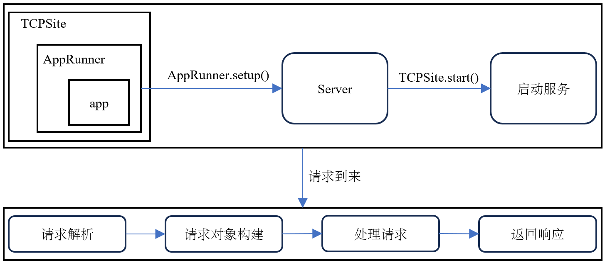

# 引言
我们以一个简单的 http server 样例来窥探 aiohttp 框架的实现原理，下面是样例代码：
```python
from aiohttp import web

async def hello(request):
    return web.Response(text="Hello, world")

app = web.Application()
app.add_routes([web.get('/', hello)])

web.run_app(app)
```
样例代码可知，基于 aiohttp 实现的 http server 主要分三部分：
+ `Application` 对象构建（[Application实现原理](./application.md)）；
  ```python
  app = web.Application()
  ```
+ 添加路由规则，创建路由表（[Application实现原理](./application.md)）；
  ```python
  app.add_routes([web.get("/", hello)])
  ```
+ 启动服务运行；
  ```python
  web.run_app(app)
  ```
本节我们重点看下服务的启动运行。

# 运行框架

aiohttp 底层基于[`asyncio`的`Transports&Protocols`编程实现](../python-asyncio/asyncio-networking.md)。
aiohttp 整个运行大体框架如上图所示，可以分为**服务启动**部分和**请求处理**部分。
处理请求主要分四个步骤：
+ [请求解析](./http_request_parser.md)
+ [请求对象构建](./http_request_build.md)
+ 处理请求
+ [返回响应](./http_response.md)

下面介绍**服务启动**和**处理请求**实现原理。

## 服务启动
服务启动的入口为`web.run_app`，其源码实现如下：
```python

```

## 处理请求
