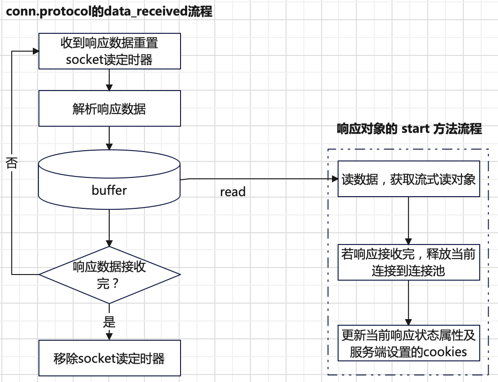

# 引言
`aiohttp`客户端的核心目的是考虑效率，而非使用的便携性。`aiohttp`客户端鼓励使用**会话**实现。一个基础的样例如下：
```python
import aiohttp
import asyncio

async def main():
    async with aiohttp.ClientSession() as session:
        async with session.get('https://example.com') as response:
            print(await response.text())

asyncio.run(main())
```
根据样例代码可知，`aiohttp`客户端核心是一个`aiohttp.ClientSession`会话对象。客户端的实现主要分三步：
+ 会话创建；
  ```python
  aiohttp.ClientSession()
  ```
+ 基于会话发起请求：
  ```python
  session.get('https://example.com')
  ```
+ 等待请求的响应；
  ```python
  await response.text()
  ```

# 会话模式
`aiohttp.ClientSession`会话对象用于高效地管理资源。核心功能如下：
+ **连接池复用**：保持一组打开的`TCP`连接，避免每次请求重新建立连接，避免重复的`DNS`查询，从而提高性能。
+ **资源管理**：通过异步上下文管理器（`async with`）自动管理会话生命周期（如关闭连接池）。
+ **共享配置**：在同一个会话中复用配置。如`headers`、`cookies`、代理、认证等。
+ **灵活性**：支持自定义连接器（`TCPConnector`、`UnixConnector`等），各种`HTTP`特性（如超时、认证）和`Tracing`支持。

一个完整的客户端请求工作流程分如下几步：
+ 构建客户端请求对象`ClientRequest`。
+ 从连接池获取一个可用的空闲连接`Connection`。一个连接对象`Connection`有`protocol`协议对象用于通信。
+ 发送客户端请求。
+ 接收服务端响应数据，通过`ClientResponse`对象。

## 连接池 
`aiohttp`客户端提供了三种连接池管理对象`TCPConnector`、`UnixConnector`和`NamedPipeConnector`。连接池的工作原理总结如下：


连接池的工作流程可以总结如下三步：
+ **连接池初始化**：设置连接池的一些属性，如连接池连接数上限、保持长连接超时时间等。
+ **连接获取**：客户端每次发起请求前从连接池获取一个可用连接。
+ **连接释放**：客户端完成一次请求后，将连接释放到连接池复用（默认情况）或直接关闭连接（参数指定）。

其中根据连接的不同类型（`TCP`、`Unix`还是`NamedPipe`）创建新的连接方式也有差异。
+ `NamedPipe`连接方式：直接调用`asyncio.create_pipe_connection`方法，没有其它逻辑。
  ```python
  async with ceil_timeout(
      timeout.sock_connect, ceil_threshold=timeout.ceil_threshold
  ):
      _, proto = await self._loop.create_pipe_connection(self._factory, self._path)
  ```
+ `Unix`连接方式：直接调用`asyncio.create_unix_connection`方法，没有其它逻辑。
  ```python
    async with ceil_timeout(
      timeout.sock_connect, ceil_threshold=timeout.ceil_threshold
  ):
      _, proto = await self._loop.create_unix_connection(self._factory, self._path)
  ```
+ `TCP`连接方式：在建立连接前，涉及代理、`DNS`解析、域名解析、`HTTPS`协议等。

下面给出`TCPConnector`连接池**创建新连接**的工作原理：


`aiohttp`客户端支持使用代理，根据请求是`http`还是`https`，代理的工作原理如下：
+ `http`请求：
  + 客户端向代理发送完整的`HTTP`请求（包含目标服务器的完整`URL`）。
  + 代理解析请求，提取目标服务器地址（如`Host`头），转发请求。
  + 代理将目标服务器的响应返回给客户端。
+ `https`请求：
  + 客户端发送`CONNECT`请求到代理，建立到目标服务器的隧道。
  + 代理与目标服务器建立`TCP`连接，返回`200 Connection Established`。
  + 客户端通过此隧道直接与目标服务器进行`TLS`加密通信。

## 客户端请求对象
`aiohttp`客户端在发起请求前，会将一个请求构建为一个`ClientRequest`对象。`ClientRequest`对象包含当前请求的所有信息属性或方法：
+ 方法`is_ssl`：如果请求需要`ssl`协议返回`True`，否则返回`False`。例如`https`或`wss`请求返回`True`。
+ 属性`ssl`：返回`ssl`上下文对象或者`None`。
+ 属性`connection_key`：当前请求生成的`ConnectionKey`对象，用于连接池中的`ConnectionKey`。
  ```python
  @property
  def connection_key(self) -> ConnectionKey:
      if proxy_headers := self.proxy_headers:
          h: Optional[int] = hash(tuple(proxy_headers.items()))
      else:
          h = None
      url = self.url
      return tuple.__new__(
          ConnectionKey,
          (
              url.raw_host or "",
              url.port,
              url.scheme in _SSL_SCHEMES,
              self._ssl,
              self.proxy,
              self.proxy_auth,
              h,
          ),
      )
  ```
+ 属性`host`和`port`：返回请求`URL`中的`host`和`port`。
+ 属性`request_info`：返回请求的部分信息，数据结构如下。
  ```python
  class _RequestInfo(NamedTuple):
      url: URL       # real_url 去掉 fragment 部分
      method: str
      headers: "CIMultiDictProxy[str]"  # 请求头信息，一个字典对象
      real_url: URL  # 原始完整的 url
  ```
+ 属性`skip_auto_headers`：返回发送请求时候，哪些自动添加的`HTTP`头部会被跳过。
+ 属性`auth`：请求验证信息。
  ```python
  self.auth = helpers.BasicAuth(url.user or "", url.password or "")
  ```
+ 属性`version`：请求协议版本，例如`(1, 1)`。
+ 属性`headers`：请求头信息，字典对象。`aiohttp`默认自动添加的头如下。
  ```bash
  {
      "Host": `example.com:8080`,
      "Accept": "*/*",
      "Accept-Encoding": "gzip, deflate",
      "User-Agent": "Python/{0[0]}.{0[1]} aiohttp/{1}".format(sys.version_info, __version__),
      "Cookie": {"aaa": 111},   # 如果指定了 cookies 参数，才会有此头。否则没有此头
      "Content-Encoding": "deflate", # 用户没指定此头，且参数指定了compress值，则有此头。值是compress值
      "Transfer-Encoding": "chunked", # 用户指定chunked才有此头
      "Content-Length": "12", # 用户没指定chunked才有此头
      "Authorization": "", # 有验证信息auth才有此头
      "Expect": "100-continue",  # 用户指定 expect 参数才有此头
  }
  ```
+ 属性`compress`：传输内容使用的压缩算法，例如`deflate`。默认为`None`。
+ 属性`chunked`：是否是分块传输。为`True`表示分块传输，`False`为非分块传输。
+ 属性`proxy`、`proxy_auth`和`proxy_headers`：分别表示代理`URL`、代理服务用的验证对象和代理服务用的`headers`。

除了提供请求信息属性外，`ClientRequest`对象还封装了**请求发送**能力`ClientRequest.send`方法。其工作原理总结如下：


## 客户端响应对象
在`aiohttp`中，客户端请求完整执行需要遵守如下流程：
```python
# 从连接池获取一个可用空闲连接
conn = await self._connector.connect(req, traces=traces, timeout=real_timeout)
# 发送请求
resp = await req.send(conn)
# 等待服务端响应完成
await resp.start(conn)
```
其中请求发送完成后会返回一个客户端响应对象`ClientResponse`。对象`ClientResponse`提供的`start`方法会一直等待响应接收完，
其工作原理如下：



`ClientResponse`对象提供了读取具体**响应体**数据的方法，每一个方法都是流式读取数据：
```python
# 直接读取二进制数据
async def read(self) -> bytes:
    pass
# 将二进制数据按指定编码方式编码，返回字符串
async def text(self, encoding: Optional[str] = None, errors: str = "strict") -> str:
    pass
# 返回 json 响应数据
async def json(
    self,
    *,
    encoding: Optional[str] = None,
    loads: JSONDecoder = DEFAULT_JSON_DECODER,
    content_type: Optional[str] = "application/json",
) -> Any:
```
## 超时时间
`aiohttp`客户端提供了超时对象`ClientTimeout`。其定义如下：
```python
class ClientTimeout:
    total: Optional[float] = None
    connect: Optional[float] = None
    sock_read: Optional[float] = None
    sock_connect: Optional[float] = None
    ceil_threshold: float = 5
```
其中默认的超时时间是
```python
DEFAULT_TIMEOUT: Final[ClientTimeout] = ClientTimeout(total=5 * 60, sock_connect=30)
```
各个超时字段的含义如下：
+ **`total`**：一个完整的请求超时时间。从请求开始，到最后接收响应耗费时间（接收响应不一定响应接收完，而是第一次接收响应数据且响应头接收完）。如果超时，则当前的请求任务会被取消。
+ **`connect`**：从连接池获取可用空闲连接的超时时间。若需新建连接，包含建立新连接时间（`TCP`三次握手）。
+ **`socket_read`**：客户端`socket`有可读数据超时时间，也就是收到服务端响应超时时间。每次`socket`有可读数据，
超时定时器会重置。数据接收完成，超时定时器会移除。
+ **`sock_connect`**：建立新连接的超时时间，也即是`TCP`三次握手，如果是`ssl`协议，还包含协议握手时间。
+ **`ceil_threshold`**：一个阈值，上面四个超时时间超过此值，会通过`math.ceil`取整。主要目的是考虑代码效率，
因为对于大的超时时间，不需要精度很高的超时定时器。

## 请求跟踪
`aiohttp`客户端也提供了一些钩子函数，用于跟踪请求的整个链路。下面是`aiohttp`客户端使用`Tracing`的样例代码：
```python
import aiohttp
import asyncio

async def on_request_start(session, trace_config_ctx, params):
    print(f"Starting request: {params.method} {params.url}")

async def on_request_end(session, trace_config_ctx, params):
    print(f"Request completed: {params.method} {params.url} -> Status: {params.response.status}")

async def on_request_exception(session, trace_config_ctx, params):
    print(f"Request exception: {params.method} {params.url} -> Exception: {params.exception}")

async def on_dns_resolve_start(session, trace_config_ctx, params):
    print(f"Resolving DNS: {params.host}")

async def on_dns_resolve_end(session, trace_config_ctx, params):
    print(f"DNS Resolved: {params.host} -> {params.entries}")

async def fetch(url):
    # 初始化一个 TraceConfig 对象
    trace_config = aiohttp.TraceConfig()
    # 注册各种跟踪函数
    trace_config.on_request_start.append(on_request_start)
    trace_config.on_request_end.append(on_request_end)
    trace_config.on_request_exception.append(on_request_exception)
    trace_config.on_dns_resolve_start.append(on_dns_resolve_start)
    trace_config.on_dns_resolve_end.append(on_dns_resolve_end)

    async with aiohttp.ClientSession(trace_configs=[trace_config]) as session:
        try:
            async with session.get(url) as response:
                print(f"Response: {await response.text()}")
        except Exception as e:
            print(f"Request failed: {e}")

async def main():
    url = "https://jsonplaceholder.typicode.com/todos/1"
    await fetch(url)

asyncio.run(main())
```
`Tracing`能力的核心是配置`TraceConfig`对象。`TraceConfig`对象提供了各种信号类（内部是`aiosignal`库的`Signal`类）用于注册各个阶段需要调用的钩子函数。
在`aiohttp`客户端内部，会在请求链路的各个阶段通过`Trace`对象调用`TraceConfig`对象注册的各种跟踪函数。

`Trace`对象提供了如下的用于`Tracing`的钩子函数：
```python
# 调用 TraceConfig.on_request_start 信号。
# 在请求开始前执行。具体来说在从连接池获取连接前被调用。
async def send_request_start(self, method: str, url: URL, headers: "CIMultiDict[str]") -> None:
    pass
# 调用 TraceConfig.on_request_chunk_sent 信号。
# 在每次发送 chunk 数据的时候被调用
async def send_request_chunk_sent(self, method: str, url: URL, chunk: bytes) -> None:
    pass
# 调用 TraceConfig.on_response_chunk_received 信号。
# 在调用 ClientResponse 的 read、text、json等方法读取到响应体数据的时候被调用
async def send_response_chunk_received(self, method: str, url: URL, chunk: bytes) -> None:
    pass
# 调用 TraceConfig.on_request_end 信号。
# 在接收到响应（响应头必须全部接收和解析，响应体可以部分接收）被调用。
async def send_request_end(
    self,
    method: str,
    url: URL,
    headers: "CIMultiDict[str]",
    response: ClientResponse
) -> None:
    pass
# 调用 TraceConfig.on_request_exception 信号。
# 请求链路出现异常时候被调用。
async def send_request_exception(
    self,
    method: str,
    url: URL,
    headers: "CIMultiDict[str]",
    exception: BaseException,
) -> None:
    pass
# 调用 TraceConfig._on_request_redirect 信号。
# 在接收到的响应是重定向时候被调用。
async def send_request_redirect(
    self,
    method: str,
    url: URL,
    headers: "CIMultiDict[str]",
    response: ClientResponse,
) -> None:
    pass
# 调用 TraceConfig.on_connection_queued_start 信号。
# 在连接池满，也就是没有可用空闲连接且已有连接数达到上限，等待可用空闲连接被调用。
async def send_connection_queued_start(self) -> None:
    pass
# 调用 TraceConfig.on_connection_queued_end 信号。
# 在连接池有可用空闲连接时被调用
async def send_connection_queued_end(self) -> None:
    pass
# 调用 TraceConfig.on_connection_create_start 信号。
# 在连接池开始建立新的连接之前被调用。
async def send_connection_create_start(self) -> None:
    pass
# 调用 TraceConfig.on_connection_create_end 信号。
# 在连接池建立新的连接结束之后被调用。
async def send_connection_create_end(self) -> None:
    pass
# 调用 TraceConfig.on_connection_reuseconn 信号。
# 在连接被复用，也就是连接池找到可用的空闲连接时候被调用。
async def send_connection_reuseconn(self) -> None:
    pass
# 调用 TraceConfig.on_dns_resolvehost_start 信号。
# 在开始 DNS 解析之前调用。
async def send_dns_resolvehost_start(self, host: str) -> None:
    pass
# 调用 TraceConfig.on_dns_resolvehost_end 信号。
# 在 DNS 解析之后被调用
async def send_dns_resolvehost_end(self, host: str) -> None:
    pass
# 调用 TraceConfig.on_dns_cache_hit 信号。
# 在 DNS 缓存命中被调用
async def send_dns_cache_hit(self, host: str) -> None:
    pass
# 调用 TraceConfig.on_dns_cache_miss 信号。
# 在 DNS 缓存没有命中被调用
async def send_dns_cache_miss(self, host: str) -> None:
    pass
# 调用 TraceConfig._on_request_headers_sent 信号。
# 在请求头和状态行开始发送前被调用
async def send_request_headers(
    self, method: str, url: URL, headers: "CIMultiDict[str]"
) -> None:
    pass
```
下图总结了`Tracing`的各个钩子函数的调用链关系。


# 直接请求模式
`aiohttp`也提供了直接请求模式，也就是每次请求都是一个独立的会话。对应的方法如下：
```python
def request(
    method: str,
    url: StrOrURL,
    *,
    params: Query = None,
    data: Any = None,
    json: Any = None,
    headers: Optional[LooseHeaders] = None,
    skip_auto_headers: Optional[Iterable[str]] = None,
    auth: Optional[BasicAuth] = None,
    allow_redirects: bool = True,
    max_redirects: int = 10,
    compress: Optional[str] = None,
    chunked: Optional[bool] = None,
    expect100: bool = False,
    raise_for_status: Optional[bool] = None,
    read_until_eof: bool = True,
    proxy: Optional[StrOrURL] = None,
    proxy_auth: Optional[BasicAuth] = None,
    timeout: Union[ClientTimeout, object] = sentinel,
    cookies: Optional[LooseCookies] = None,
    version: HttpVersion = http.HttpVersion11,
    connector: Optional[BaseConnector] = None,
    read_bufsize: Optional[int] = None,
    loop: Optional[asyncio.AbstractEventLoop] = None,
    max_line_size: int = 8190,
    max_field_size: int = 8190,
) -> _SessionRequestContextManager:
```
其内部原理也是使用会话模式，只是每次请求完成后会话会关闭。使用样例如下：
```python
import aiohttp

resp = await aiohttp.request('GET', 'http://python.org/')
data = await resp.read()
```
