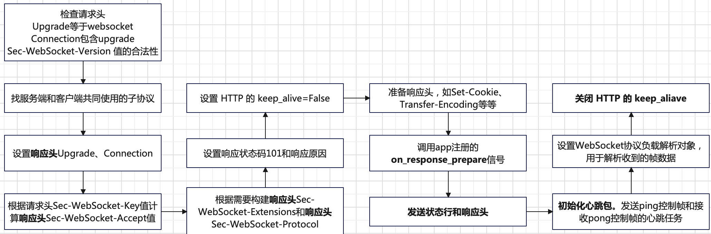
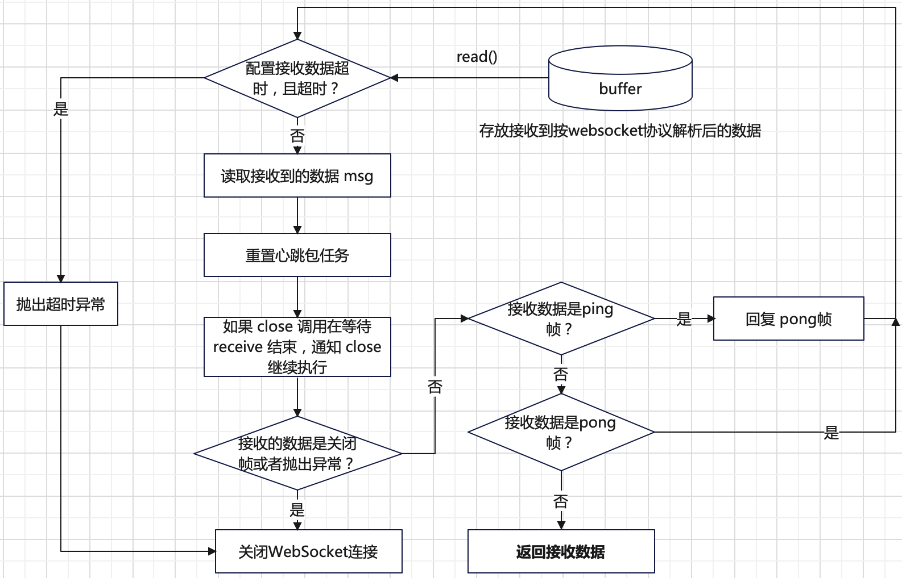

# WebSocket 协议原理
参考资料：[websocket协议规范](https://www.rfc-editor.org/rfc/rfc6455#page-37) 和 [websocket服务端简介](https://developer.mozilla.org/zh-CN/docs/Web/API/WebSockets_API/Writing_WebSocket_servers)

`HTTP`是半双工通信协议，也即只能由客户端发起请求，服务端响应。对于需要双端通信的场景，如客户端和服务端都需要实时感知对方数据的变化，
在`WebSocket`之前的解决方案是`http polling`或`http long polling`。

**http polling**：
+ **工作原理**：客户端定期（例如周期`1s`）向服务器发送请求，以获取最新的数据。客户端发送请求后，服务器会立即响应当前可用的数据（如果有的话），
然后客户端在收到响应后立即发起下一次请求。这样的请求响应循环会周期性地重复。
+ **过程**：
  + 客户端发送`HTTP`请求到服务器。
  + 服务器处理请求，并立刻返回最新的数据（如果有的话，没有新数据也返回告知没有）。
  + 客户端收到响应后，立即发送下一个`HTTP`请求。
+ **存在问题**：
  + 时延：只有客户端请求，服务端才会响应更新后的数据，每次客户端轮询之间可能会有一段时间的等待；
  + 资源浪费：即使服务端没有新数据，客户端定期发送`HTTP`请求，浪费网络带宽，系统等资源；

**HTTP long polling**：
+ **工作原理**：客户端发送一个请求到服务器，但服务器不会立即返回响应。相反，服务器会等待直到有新数据可用时，
才返回响应给客户端。一旦客户端收到响应，它会立即发送下一个请求，继续等待新数据。
+ **过程**：
  + 客户端发送`HTTP`请求到服务器。
  + 服务器收到请求后，检查是否有新数据可用。
  + 如果有新数据，则立即返回响应给客户端，客户端收到响应后处理数据，并立即发送下一个请求。
  + 如果没有新数据可用，则服务器保持连接打开，等待新数据到来或者达到超时时间后返回响应。
+ **存在问题**：
  + 时延：只有客户端请求，服务端才会响应更新后的数据，和`http polling`比减轻延迟，但还是存在；
  + 资源占用：虽然和`http polling`比减少`HTTP`请求数，但需要维持`HTTP`连接，占用服务器资源；

为了解决上述问题，`WebSocket`协议出现了。`WebSocket`协议是全双工通信，且是长连接的；
`WebSocket`协议使得在客户端和服务端通信过程中只需要建立一次`HTTP`连接。

`WebSocket`协议主要由两个阶段组成：**握手**和**数据传输**。
## 握手
握手由客户端发起，服务端解析并响应握手结果，**客户端请求报文**样例如下：
```bash
GET /chat HTTP/1.1
Host: server.example.com
Upgrade: websocket
Connection: Upgrade
Sec-WebSocket-Key: dGhlIHNhbXBsZSBub25jZQ==
Origin: http://example.com
Sec-WebSocket-Protocol: chat, superchat
Sec-WebSocket-Version: 13
# 下面两个是可选的
Sec-WebSocket-Protocol: chat, superchat
Sec-WebSocket-Extensions: permessage-deflate; client_max_window_bits
```
部分请求头的含义说明如下：
+ `Upgrade: websocket`：请求升级为`WebSocket`连接；
+ `Connection: Upgrade`：表示协议升级；
+ `Origin: http://example.com`：可选。浏览器客户端都会有这个请求头，指示了客户端创建`WebSocket`连接的网页的源信息。
服务器可以根据`Origin`头部来验证请求的来源，以确保连接来自于合法的网页；
+ `Sec-WebSocket-Version: 13`：指定`WebSocket`协议的版本号，当前版本为`13`；
+ `Sec-WebSocket-Key：dGhlIHNhbXBsZSBub25jZQ==`：当客户端发送一个`WebSocket`握手请求时，它会生成一个随机的`Sec-WebSocket-Key`并将其包含在请求头中发送给服务器。
服务器在收到这个请求后，会使用一种算法来处理这个键。通常是将其与一个固定的`GUID`结合并进行一些哈希运算。
然后，服务器会在响应中包含自己的处理结果，并将其作为`Sec-WebSocket-Accept`头部的值返回给客户端。客户端接收到响应后，
会验证服务器的处理结果，如果验证成功，则建立`WebSocket`连接；
+ `Sec-WebSocket-Protocol: chat, superchat`：指定了两个子协议：`chat`和`superchat`。客户端向服务器表明它希望在`WebSocket`连接上使用这些协议之一进行通信。
服务器可以选择其中一个协议与客户端进行通信，或者在支持的协议列表中选择一个最合适的协议；
+ `Sec-WebSocket-Extensions: permessage-deflate; client_max_window_bits`：指示了客户端选择了一个名为`permessage-deflate`的扩展，
并且指定参数`client_max_window_bits`。这个参数表示客户端在压缩过程中所允许的最大压缩窗口大小，默认值是`15`；

**服务端响应报文**样例如下：
```bash
HTTP/1.1 101 Switching Protocols
Upgrade: websocket
Connection: Upgrade
Sec-WebSocket-Accept: s3pPLMBiTxaQ9kYGzzhZRbK+xOo=
# 下面是可选的
Sec-WebSocket-Protocol: chat
Sec-WebSocket-Extensions: permessage-deflate; server_max_window_bits=15
```
+ `Sec-WebSocket-Protocol: chat`：服务端与客户端协商后的子协议。表示服务端在此连接上使用`chat`子协议进行通信；
+ `Sec-WebSocket-Extensions: permessage-deflate; server_max_window_bits=15`：指示了服务端选择了一个名为`permessage-deflate`的扩展，
并且指定参数`server_max_window_bits=15`。这个参数表示服务端在压缩过程中所允许的最大压缩窗口大小；
+ `Sec-WebSocket-Accept: s3pPLMBiTxaQ9kYGzzhZRbK`：确认客户端发起的`WebSocket`连接握手请求的合法性。
它是通过对客户端发送的`Sec-WebSocket-Key`进行处理得到的哈希值；

> `permessage-deflate`拓展参数有如下四个：
>   + `client_no_context_takeover`：指定客户端是否允许在消息传输过程中不保留压缩上下文。如果指定了该参数，表示客户端在每个消息之间不会保留压缩上下文，这可能会增加每个消息的压缩开销，但可以节省内存。默认情况下，保留压缩上下文。
>   + `server_no_context_takeover`：指定服务器是否允许在消息传输过程中不保留压缩上下文。应用于服务器端。
>   + `client_max_window_bits`：指定客户端在压缩过程中所允许的最大压缩窗口大小。窗口大小越大，可以提供更好的压缩效果，但也会消耗更多的内存。
>   + `server_max_window_bits`：指定服务器在压缩过程中所允许的最大压缩窗口大小。应用于服务器端。

## 数据传输
`WebSocket`协议的数据传输使用一系列的帧，帧是数据传输的最小单位。帧的结构如下：
```bash
 0                   1                   2                   3
 0 1 2 3 4 5 6 7 8 9 0 1 2 3 4 5 6 7 8 9 0 1 2 3 4 5 6 7 8 9 0 1
+-+-+-+-+-------+-+-------------+-------------------------------+
|F|R|R|R| opcode|M| Payload len |    Extended payload length    |
|I|S|S|S|  (4)  |A|     (7)     |             (16/64)           |
|N|V|V|V|       |S|             |   (if payload len==126/127)   |
| |1|2|3|       |K|             |                               |
+-+-+-+-+-------+-+-------------+ - - - - - - - - - - - - - - - +
|     Extended payload length continued, if payload len == 127  |
+ - - - - - - - - - - - - - - - +-------------------------------+
|                               |Masking-key, if MASK set to 1  |
+-------------------------------+-------------------------------+
| Masking-key (continued)       |          Payload Data         |
+-------------------------------- - - - - - - - - - - - - - - - +
:                     Payload Data continued ...                :
+ - - - - - - - - - - - - - - - - - - - - - - - - - - - - - - - +
|                     Payload Data continued ...                |
+---------------------------------------------------------------+
```
+ `FIN`：指示当前帧是消息的最后一个帧；
+ `RSV 1~3`：用于协议拓展，不使用协议拓展是`0`。若接收方收到`RSV 1~3` 不全为`0`的帧， 
并且双方没有协商使用扩展协议，则接收方应立即终止`WebSocket`连接；
+ `opcode`：表示`playload data`的类型，如果收到未知的`opcode`值，则接收方应终止`WebSocket`连接。
`opcode`取值含义如下：
  + `0x0`：表示`continuation frame`。若一个消息大，可以被拆分为多个帧传输，后续帧的`opcode`的值将是`0x0`，指示它们是一个完整消息的一部分；
  + `0x1`：表示文本帧，例如字符串内容；
  + `0x2`：表示二进制帧，例如图片，视频等；
  + `0x3-7`：被保留用于非控制帧；
  + `0x8`：表示连接关闭；
  + `0x9`：表示一个`ping`；
  + `0xA`：表示一个`pong`；
  + `0xB-F`：被保留用于控制帧；
+ `MASK`：是否对`playload data`进行掩码，如果为`1`，掩码值在`Masking-key`中。
从客户端发往服务端的帧必须设置为`1`；
+ `playload len`：`playload data`的长度；
  + 如果`payload len`值在`0-125`之间，`playload len`使用`7`位表示`playload data`的长度；
  + 如果`playload len`值为`126`，表示需要额外的`16`位来表示`payload data`的长度，
  此时后续的`16`位就是`payload data`的实际长度；
  + 如果`playload len`值为`127`，表示需要额外的`64`位来表示`payload data`的长度，
  此时后续的`64`位就是`payload data`的实际长度；
+ `Masking-key`：表示掩码的值，`32`位数据；
+ `playload data`：有效载荷数据；

`WebSocket`控制帧用于客户端和服务端交互有关`WebSocket`的状态，控制帧可以在握手之后的任意时刻发送。
控制帧有三种：
+ `close`
+ `ping`
+ `pong`

`WebSocket`协议支持消息分多帧发送的目的：
+ The primary purpose of fragmentation is to allow sending a message
that is of unknown size when the message is started without having to
buffer that message.  If messages couldn't be fragmented, then an
endpoint would have to buffer the entire message so its length could
be counted before the first byte is sent.  With fragmentation, a
server or intermediary may choose a reasonable size buffer and, when
the buffer is full, write a fragment to the network.
+ A secondary use-case for fragmentation is for multiplexing, where it
is not desirable for a large message on one logical channel to
monopolize the output channel, so the multiplexing needs to be free
to split the message into smaller fragments to better share the
output channel.

# 服务端实现
在介绍`aiohttp`实现`WebSocket`服务端之前，先看下`WebSocket`服务端样例代码：
```python
from aiohttp import web

async def websocket_handler(request):

    ws = web.WebSocketResponse()
    await ws.prepare(request)

    async for msg in ws:
        if msg.type == aiohttp.WSMsgType.TEXT:
            if msg.data == 'close':
                await ws.close()
            else:
                await ws.send_str(msg.data + '/answer')
        elif msg.type == aiohttp.WSMsgType.ERROR:
            print('ws connection closed with exception %s' % ws.exception())

    print('websocket connection closed')

    return ws

app = web.Application()
app.add_routes([web.get('/ws', websocket_handler)])

if __name__ == '__main__':
    web.run_app(app)
```
`WebSocket`协议复用`HTTP`协议数据接收，请求解析流程。`WebSocket`协议本身实现在`WebSocketResponse`中。
一个`WebSocket`请求首先**复用`HTTP`协议**进行请求发送。服务端接收到请求后，会进一步按照`WebSocket`协议进行`WebSocket`握手和数据传输。
## 握手
下面给出`WebSocket`的**握手执行**流程，也就是`web.WebSocketResponse.prepare`方法实现逻辑。



在握手阶段，服务端首先对接收的请求执行`WebSocket`协议检查，检查通过后会发送`WebSocket`响应头和状态码`101`。
服务端完成握手后，会初始化发送`ping`控制帧和接收`pong`任务的心跳任务，用于检查连接是否存在。初始化心跳任务工作原理总结如下：
+ 创建一个定时执行发送`ping`控制帧的任务，时间周期是`heartbeat`参数指定。
+ 创建一个定时执行没有接收到`pong`控制帧的任务，时间周期是`heartbeat/2`指定。如果超时没有`pong`帧，则关闭`WebSocket`。
+ 每次接收到帧数据（包括数据帧和控制帧），都会初始化心跳任务，也就是执行上面两步。

握手完成的最后一步是关闭`HTTP`的`keep-alive`，因为`WebSocket`何时关闭是由开发者决定。

## 数据传输
`WebSocket`的数据传输包含两部分：**数据发送**和**数据接收**。

其中提供的**数据发送**相关的接口如下：
```python
# 发送 ping 控制帧
async def ping(self, message: bytes = b"") -> None:
    pass
# 发送 pong 控制帧
async def pong(self, message: bytes = b"") -> None:
    pass
# 发送一个帧数据
async def send_frame(
    self, message: bytes, opcode: WSMsgType, compress: Optional[int] = None
) -> None:
    pass
# 发送字符串数据
async def send_str(self, data: str, compress: Optional[int] = None) -> None:
    pass
# 发送字节数据
async def send_bytes(self, data: bytes, compress: Optional[int] = None) -> None:
    pass
# 发送 json 格式数据
async def send_json(
    self,
    data: Any,
    compress: Optional[int] = None,
    *,
    dumps: JSONEncoder = json.dumps,
) -> None:
    await self.send_str(dumps(data), compress=compress)
```
**数据接收**提供的相关接口如下：
```python
# 接收字符串数据
async def receive_str(self, *, timeout: Optional[float] = None) -> str:
    pass
# 接收二进制数据
async def receive_bytes(self, *, timeout: Optional[float] = None) -> bytes:
    pass
# 接收 json 格式数据
async def receive_json(
    self, *, loads: JSONDecoder = json.loads, timeout: Optional[float] = None
) -> Any:
    data = await self.receive_str(timeout=timeout)
    return loads(data)
```
上面的数据接收接口内部都是调用`WebSocketResponse.receive`方法实现。`receive`方法接收数据的工作流程总结如下：



`WebSocket`服务端也提供了`async for`语法对应的数据接收语法糖实现：
```python
async def __anext__(self) -> WSMessage:
    msg = await self.receive()
    if msg.type in (WSMsgType.CLOSE, WSMsgType.CLOSING, WSMsgType.CLOSED):
        raise StopAsyncIteration
    return msg
```

## 协议关闭
协议关闭主要是通过调用`WebSocketResponse.close`方法实现。其方法接口定义如下：
```python
async def close(
    self, *, code: int = WSCloseCode.OK, message: bytes = b"", drain: bool = True
) -> bool:
    pass
```
其工作流程主要如下：
+ 取消心跳包；
+ 如果`receive`在等待中，发送`WSMsgType.CLOSING`消息，并等待`receive`退出；
+ 发送`close`帧，关闭握手；
+ 关闭底层的`transport`；
