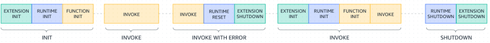
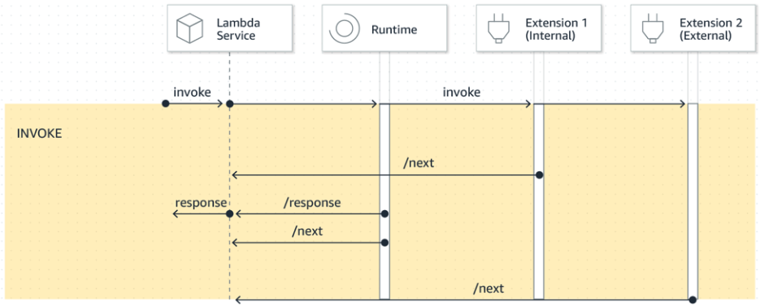

# Lambda 原理
`AWS Lambda`是一个**事件驱动**的**无服务器计算服务**。只需要写函数代码，不用关心服务器、容器、操作系统等任何基础设施，`AWS Lambda`服务会按需自动运行并计费。
与传统方式对比如下：
|传统方式|`AWS Lambda`方式|
|--------|----------------|
|要预配置服务器（`EC2`）|`AWS`提供运行基础设施|
|要部署应用、维护系统|只需上传代码函数|
|为闲时也付费|按实际执行时间（毫秒级）计费|
|难以水平扩展|`AWS`自动扩容，处理并发|

`Lambda`的工作流程如下：
+ 上传`Lambda`函数代码。配置`execution roles`管理`Lambda`函数可以交互哪些`AWS`服务、使用`policy`配置哪些资源可以和`Lambda`函数交互。
+ 配置**触发源**触发`Lambda`函数。触发源包括：`S3`上传文件、`API Gateway`接口调用、`EventBridge`配置的定时器、`DynamoDB`表更新等。
+ 当事件发生时，`AWS Lambda`会使用指定的**语言运行时**启动一个**执行环境**（类似容器）、加载代码、执行代码、返回结果并冻结或关闭执行环境。

## 编程模式
**编程模式定义了代码如何与`AWS Lambda`交互的接口**。编程模式定义了如下的交互流程：
+ `Lambda`收到一个事件。
+ `Lambda`使用语言相关的运行时准备事件对象为指定语言可以使用的格式。
+ 运行时将格式化的`event`对象发送给`Lambda`函数。
+ `Lambda`函数处理事件。

下面以`Python`语言详细说明编程模式。

`Lambda`函数的**入口签名**如下：
```python
def lambda_handler(event, context):
    pass
```
当`AWS Lambda`唤醒此`handler`，运行时传递两个参数`event`和`context`给此`handler`。
+ **`event`**：`Lambda event`一般是一个`JSON object`，例如：
  ```json
  {
      "Order_id": "12345",
      "Amount": 199.99,
      "Item": "Wireless Headphones"
  }
  ```
  `Python`语言**运行时**会将其转为一个`dict`对象。当然也可以传递其它`JSON`数据类型作为`Lambda event`，下表给出`Python`运行时的转化规则：
    |`JSON`数据类型|`Python`数据类型|
    |--------------|----------------|
    |`object`|`dict`|
    |`array`|`list`|
    |`number`|`int`或`float`|
    |`string`|`str`|
    |`Boolean`|`bool`|
    |`null`|`None`|
  
  需要注意不同的事件源产生的`lambda event`内容不同，对于`AWS`服务需要查略相关文档，或者在`Lambda`函数输出`event`内容并在`CloudWatch Log`里面查看。
+ **`context`**：一个实例对象（[对象定义](https://github.com/aws/aws-lambda-python-runtime-interface-client/blob/main/awslambdaric/lambda_context.py)），包含**函数唤醒信息**和**执行环境信息**。
  例如获取唤醒请求的`id`：
  ```python
  request = context.aws_request_id
  ```
  一个`context`对象包含方法或属性详细说明参考[文档](https://docs.aws.amazon.com/lambda/latest/dg/python-context.html)，`context`对象可以用于监控目的。

**`Lambda`函数名字**是`{file-name}.{handler-name}`格式，例如默认名字是`lambda_function.lambda_handler`。默认名字也可以更改。

**`Lambda`函数可以有返回值**，返回值必须是`JSON`可序列化的。返回值类型有`dict`、`list`、`str`、`int`等。根据不同的`invocation type`，返回值的行为也不同：
+ 如果`invocation type`是`RequestResponse`且**同步**唤醒`Lambda`函数，则`AWS Lambda`返回结果到唤醒`Lambda`函数的客户端。`Lambda`运行时对返回结果会使用`JSON`序列化作为响应返回。
  因为`Lambda`控制台使用`RequestResponse`类型，所以可以在控制台看到返回值。
+ 如果`Lambda`函数返回对象不能用`JSON`系列化，运行时会返回一个错误。
+ 如果`Lambda`函数返回`None`，运行时返回`null`。
+ 如果使用`Event`的`invocation type`（异步唤醒`Lambda`函数），返回值被运行时丢弃。

例如`Lambda`函数返回值是：
```json
{
  "statusCode": 200,
  "message": "Receipt processed successfully"
}
```
运行时会将其序列化，作为一个`JSON`字符串返回给唤醒此`Lambda`函数的客户端。

## 执行环境
**执行环境定义了`AWS Lambda`如何管理代码的运行时环境**。执行环境类似容器，是一个安全、隔离的环境。


运行在执行环境中的**函数运行时**和每一个**外部拓展**都是**进程**。进程之间共享设置好的环境变量、权限、认证、资源等。
**每一个执行环境都有一个`/tmp`本地目录可以被使用**。

**执行环境的生命周期**分三个阶段：


+ **初始化**：启动所有的拓展、运行时初始化、`Lambda`函数初始化等。初始化阶段默认超时时间`10s`（排除`provisioned concurrency or SnapStart`）。
  如果在`10s`内没有完成初始化阶段，`AWS Lambda`服务会使用配置的**函数超时时间重试初始化阶段**。
+ **调用**：`Lambda`函数配置的超时时间作用于整个调用阶段。例如函数配置的超时时间是`360s`，则`Lambda`函数和所有的拓展都必须在`360s`内完成。
  **调用阶段就是执行`Lambda handler`方法的阶段**。如果调用阶段失败了，`AWS Lambda`服务会**重置执行环境**，如下图说明。
  
+ **关闭**：`AWS Lambda`服务会发送`SHUTDOWN`事件给每一个注册的**外部拓展**以及**运行时**。关闭阶段超时事件如下：
  + `0ms`：`Lambda`函数没有注册拓展。
  + `500ms`：`Lambda`函数注册了一个**内部拓展**。
  + `2000ms`：`Lambda`函数注册了一个或多个**外部拓展**。

  如果在超时事件内拓展或运行时没有完成，则`AWS Lambda`会发送一个`SIGKILL`信号结束进程。当`Lambda`函数和所有的拓展完成后，
  `AWS Lambda`会**保留执行环境一段事件在内存，为了下次调用重用执行环境**。但每隔几个小时，会终止执行环境以更新运行时。

执行环境的每个阶段都以`AWS Lambda`发送到**运行时和所有注册的扩展的事件开始**。运行时和每个扩展通过**发送`Next API`请求来指示完成**。
当运行时和每个扩展完成且没有挂起的事件时，`AWS Lambda`会冻结执行环境。


**当`AWS Lambda`服务收到一个请求调用`Lambda`函数时，`AWS Lambda`服务首先准备一个执行环境**。在执行环境初始化阶段会执行代码下载、
启动执行环境、执行初始化代码、最后运行`Lambda handler`（调用阶段）。


调用完成后，执行环境被冻结。`AWS Lambda`会保留执行环境一段时间，在此期间新的调用请求带来会更快执行。**不是每次执行完一个请求就终止执行环境，
而是由`AWS Lambda`决定啥时候终止执行环境（一段时间内`Lambda`函数没有收到任何调用），也就是让执行环境进入`SHUTDOWN`阶段**。

如果需要进一步控制**避免每次冷启动执行环境**，可以使用[预留并发功能](https://docs.aws.amazon.com/lambda/latest/dg/provisioned-concurrency.html)，也就是在请求之前提起准备好执行环境。

## Lambda layers
`Lambda`层是包含补充代码或数据的`.zip`文件。层通常包含库依赖项、[自定义运行时系统](https://docs.aws.amazon.com/lambda/latest/dg/runtimes-custom.html)或配置文件。


**对于`go`或`rust`编写的`Lambda`函数，不要使用`Lambda`层**。因为他们是编译后的可执行文件，依赖都打包进可执行文件，直接运行。
如果把相关依赖放进层里，如`xxx.so`依赖放进层里，启动`lambda`动态加载依赖会比较慢。

`AWS Lambda`在**创建执行环境**的时候会将层的内容提取到执行环境的`/opt`本地目录，`Lambda`函数可以直接访问此目录。
**每个`Lambda`最多可以使用`5`层，并且层只能用于基于`.zip`部署的方式**。基于容器部署方式不使用层。

每个层都有一个版本号，版本号不可更改，每次更新层，版本号会增加，旧层会保留除非手动删除。**层里面的依赖需要兼容`Amazon Linux`系统**

对于`Python`运行时，`PATH`环境变量包含`/opt/python`和`opt/python/lib/python3.x/site-packages`。所以**打包层文件结构**如下可以保证`Lambda`函数正确加载依赖（以`/opt/python`路径为例）：
```bash
python/              # Required top-level directory
└── requests/
└── boto3/
└── numpy/
└── (dependencies of the other packages)
```
之后可以[创建层](https://docs.aws.amazon.com/lambda/latest/dg/creating-deleting-layers.html#layers-create)和在`Lambda`函数中[添加层](https://docs.aws.amazon.com/lambda/latest/dg/adding-layers.html)。
## Lambda extensions
[拓展](https://aws.amazon.com/cn/blogs/aws/getting-started-with-using-your-favorite-operational-tools-on-aws-lambda-extensions-are-now-generally-available/)分为**外部拓展**和**内部拓展**。内部拓展在运行时进程内执行（作为一个子线程），可以理解为使用的`import`模块。**外部拓展作为独立的进程**被执行，这里只关注外部拓展。

可以**使用`Lambda`层给`Lambda`函数添加拓展**。一个`Lambda`函数最多注册`10`个拓展。

在执行环境的**初始化阶段**，`AWS Lambda`提取层中的文件到`/opt`目录，并在`/opt/extensions/`下查找拓展，每一个文件作为一个拓展（一个进程启动），多个拓展并行启动。

当然也可以在**容器镜像使用拓展**。
```bash
FROM public.ecr.aws/lambda/python:3.11

# Copy and install the app
COPY /app /app
WORKDIR /app
RUN pip install -r requirements.txt

# Add an extension from the local directory into /opt/extensions
ADD my-extension.zip /opt/extensions
CMD python ./my-function.py
```

可以**使用`Extensions API`和执行环境交互**。在执行环境初始化阶段（**具体`Extension init`阶段**），每一个拓展需要向`AWS Lambda`注册以接收事件。
当拓展注册完后，`AWS Lambda`开始`Runtime init`阶段。运行时进程调用`functionInit`开始`Function init`阶段。
当运行时和每个拓展完成后（初始化阶段完成）会给`AWS Lambda`发送`Next`请求。


在执行环境**调用阶段**，`AWS Lambda`发送`Invoke`事件给每一个注册的拓展（内部拓展或外部拓展）。外部拓展作为独立的进程运行。
`Lambda`函数即使完成，也不影响外部拓展继续运行。**当运行时和所有的拓展发送`Next`请求表示结束时，调用阶段才结束**。



`Invoke`事件内容样例如下：
```bash
{
    "eventType": "INVOKE",
    "deadlineMs": 676051,  # 函数超时时间
    "requestId": "3da1f2dc-3222-475e-9205-e2e6c6318895",
    "invokedFunctionArn": "arn:aws:lambda:us-east-1:123456789012:function:ExtensionTest",
    "tracing": {
        "type": "X-Amzn-Trace-Id",
        "value": "Root=1-5f35ae12-0c0fec141ab77a00bc047aa2;Parent=2be948a625588e32;Sampled=1"
    }
 }
```

在执行环境**关闭阶段**（由`AWS Lambda`服务决定啥时候关闭，一般是等一段事件没有调用），`AWS Lambda`发送事件`SHUTDOWN`给每一个注册的**外部拓展**。
拓展收到`SHUTDOWN`事件后可以做一些清理工作。


`SHUTDOWN`事件内容样例如下：
```bash

{ 
  "eventType": "SHUTDOWN", 
  "shutdownReason": "reason for shutdown",
  "deadlineMs": "the time and date that the function times out in Unix time milliseconds" 
}        
```
**拓展和`Lambda`函数共享资源（`CPU`、内存、`/tmp`存储、`IAM`等。拓展和`Lambda`函数也在同一个执行环境，共享文件系统和网络命名空间等。
拓展可以访问`Lambda`函数配置的环境变量（不是在运行时设置的）**，但排除下面的给运行时进程的环境变量：
+ `AWS_EXECUTION_ENV`、`AWS_LAMBDA_LOG_GROUP_NAME`、`AWS_LAMBDA_LOG_STREAM_NAME`
+ `AWS_XRAY_CONTEXT_MISSING`、`AWS_XRAY_DAEMON_ADDRESS`、`LAMBDA_RUNTIME_DIR`
+ `LAMBDA_TASK_ROOT`、`_AWS_XRAY_DAEMON_ADDRESS`、`_AWS_XRAY_DAEMON_PORT`、`_HANDLER`

**拓展的日志也被输出到`CloudWatch Logs`**。

拓展`API`样例模版（注册`API`）如下：
```bash
http://${AWS_LAMBDA_RUNTIME_API}/2020-01-01/extension/register
```
各个`Extension API`说明如下：
+ **`Register`**：用于拓展向`AWS Lambda`服务注册的`API`接口。
  + `Path`：`/extension/register`
  + `Method`：`POST`
  + `Request headers`：请求头有如下两个。
    + `Lambda-Extension-Name`：**必传**。拓展的名字，包含文件拓展名，`AWS Lambda`使用此名字运行。
    + `Lambda-Extension-Accept-Feature`：**非必传**，逗号分割字符串。用于注册拓展时候启动某些可选功能。
      ```bash
      Lambda-Extension-Accept-Feature: accountId
      ```
      如果指定`accountId`，此`API`响应会包含`accountId`字段（账户`ID`）。
  + `Request body`：`events`字段表示一个注册事件的数组。有效值包括`INVOKE`、`SHUTDOWN`。
    ```bash
    {
        'events': [ 'INVOKE', 'SHUTDOWN']
    }
    ```
  + `Response headers`：响应头`Lambda-Extension-Identifier`表示一个`uuid`值，用于后续的请求。
  + `Response codes`：响应码取值有`200`（返回成功响应）、`400`（`Bad Request`）、`403`、`500`（服务错误，拓展应该退出）。
    ```bash
    # 成功响应体
    {
        "functionName": "helloWorld",
        "functionVersion": "$LATEST",
        "handler": "lambda_function.lambda_handler",
        "accountId": "123456789012"  # 可选字段
    }
    ```
+ **`Next`**：拓展发送`Next`请求告诉`AWS Lambda`表示自己准备完成，可以接收下一个事件。
  + `Path`：`/extension/event/next`
  + `Method`：`GET`（不要设置请求超时时间，没有事件到来，拓展可能会被挂起）
  + `Request headers`：请求头`Lambda-Extension-Identifier`取值为`Register`返回的`uuid`值。
  + `Response headers`：响应头`Lambda-Extension-Event-Identifier`一个`uuid`值。
  + `Response codes`：响应码的取值有`200`（表示返回包含事件`EventInvoke`或事件`EventShutdown`的信息）、`403`、`500`（服务错误，拓展应该退出）。
+ **`Init error`**：当扩展在初始化（`Init`阶段）过程中发生错误，向`AWS Lambda`上报以中止整个函数初始化过程。`AWS Lambda`会终止函数初始化，
  `CloudWatch Logs`会记录错误日志，`Lambda`函数不会被调用。拓展收到此`API`响应应该退出。
  + `Path`：`/extension/init/error`
  + `Method`：`POST`
  + `Request headers`：请求头的取值有如下。
    + `Lambda-Extension-Identifier`：**必传**。取值为`Register`阶段返回的`uuid`值。
    + `Lambda-Extension-Function-Error-Type`：**必传**。错误类型，一个字符串。
  + `Request body`：请求体参数是一个`JSON`对象。
    ```json
    {
          "errorMessage": "string (text description of the error)",
          "errorType": "string",
          "stackTrace": "array of strings"
    }
    ```
  + `Response codes`：响应码取值有`200`、`400`、`403`、`500`。
+ **`Exit error`**：拓展在退出之前向`AWS Lambda`上报错误。`AWS Lambda`收到此请求后，后续的`API`请求都不会成功，`CloudWatch Logs`会记录错误日志。拓展收到此`API`响应应该退出。
  + `Path`：`/extension/exit/error`
  + `Method`：`POST`
  + `Request headers`：请求头的取值有如下。
    + `Lambda-Extension-Identifier`：**必传**。取值为`Register`阶段返回的`uuid`值。
    + `Lambda-Extension-Function-Error-Type`：**必传**。错误类型，一个字符串。
  + `Request body`：请求体参数是一个`JSON`对象。
    ```json
    {
          "errorMessage": "string (text description of the error)",
          "errorType": "string"",
          "stackTrace": "array of strings"
    }
    ```
  + `Response codes`：响应码取值有`200`、`400`、`403`、`500`。

拓展可以接收`AWS Lambda`的[遥测数据](https://docs.aws.amazon.com/lambda/latest/dg/telemetry-api.html)，遥测数据是系统自动生成、收集并传输的运行时信息，用于 监控、诊断、性能分析和行为追踪。

# Lambda 实践
## 权限配置
`Lambda`的权限类别有两种：
+ `Lambda`函数访问其它`AWS`资源的权限。
+ 其它`AWS`用户或实体访问`Lambda`函数的权限。

**[Execution role](https://docs.aws.amazon.com/lambda/latest/dg/lambda-intro-execution-role.html)**（用于`Lambda`函数访问其它`AWS`资源）。必须指定**受信任委托人**为`lambda.amazonaws.com`。
有了`Execution role`后，在分配具体的`policy`（没有需要先创建好）给`Execution role`。最后将`Execution role`绑定到`Lambda`函数。

**[Access permissions](https://docs.aws.amazon.com/lambda/latest/dg/permissions-granting-access.html)**（用于其它`AWS`用户或实体访问`Lambda`函数）。有三种类型。
+ **`identity-based policies`**：授予其它用户、用户组、角色操作`Lambda`函数的权限。
+ **`resource-based policies`**：授予其它账户、`AWS`服务操作`Lambda`函数的权限。若用户尝试访问`Lambda`函数资源，则`AWS Lambda`验证用户的`identity-based policy`和资源的`resource-based policy`。
  当`AWS`服务访问`Lambda`函数，则`AWS Lambda`只会验证`resource-based policy`。

  > 用户访问`Lambda`时，必须同时通过两道“门禁”：你有没有权限做这件事（身份策略）和 资源是否允许你来做这件事（资源策略）。
+ **`attribute-based access control (ABAC)`**：可将标签附加到`Lambda`函数，在某些`API`请求中传递它们。

## 代码部署
`Lambda`函数代码部署到`AWS`上有两种方式：
+ 基于`.zip`方式
+ 基于容器镜像方式

**[基于容器镜像方式](https://docs.aws.amazon.com/lambda/latest/dg/python-image.html)** 有三种实现。`AWS`提供了包含特定语言环境的基础镜像、`AWS`提供的只有`OS`的基础镜像、自定义基础镜像。
为了简单，下面样例使用`AWS`提供的包含语言基础镜像。

`dockerfile`样例如下：
```bash
FROM public.ecr.aws/lambda/python:3.12

# Copy requirements.txt
COPY requirements.txt ${LAMBDA_TASK_ROOT}

# Install the specified packages
RUN pip install -r requirements.txt

# Copy function code
COPY lambda_function.py ${LAMBDA_TASK_ROOT}

# Set the CMD to your handler (could also be done as a parameter override outside of the Dockerfile)
CMD [ "lambda_function.handler" ]
```
将镜像编译好后，需要**部署到`AWS`的容器镜像仓库**，参考官方文档。最后创建`Lambda`函数指定镜像`URI`。

**[基于`.zip`方式](https://docs.aws.amazon.com/lambda/latest/dg/python-package.html)** 将`Lambda`函数代码和依赖都打包为一个`.zip`文件，并上传`AWS`。
其中`.zip`包的结构如下：
```bash
my_deployment_package.zip
|- bin
|  |-jp.py
|- boto3
|  |-compat.py
|  |-data
|  |-docs
...
|- lambda_function.py
```
需要注意`.zip`解压后不能超过`250MB`，包括所有上传层的大小。`Lambda`运行时需要`644`权限操作非可执行文件，需要`755`权限操作目录和可执行文件。

## 函数配置
+ 部署操作：[基于`.zip`函数](https://docs.aws.amazon.com/lambda/latest/dg/configuration-function-zip.html)和[基于容器镜像](https://docs.aws.amazon.com/lambda/latest/dg/images-create.html)。
+ 其它配置：[内存，超时，环境变量等](https://docs.aws.amazon.com/lambda/latest/dg/lambda-functions.html)

## 事件触发
+ `AWS`服务
+ `EventBridge`
