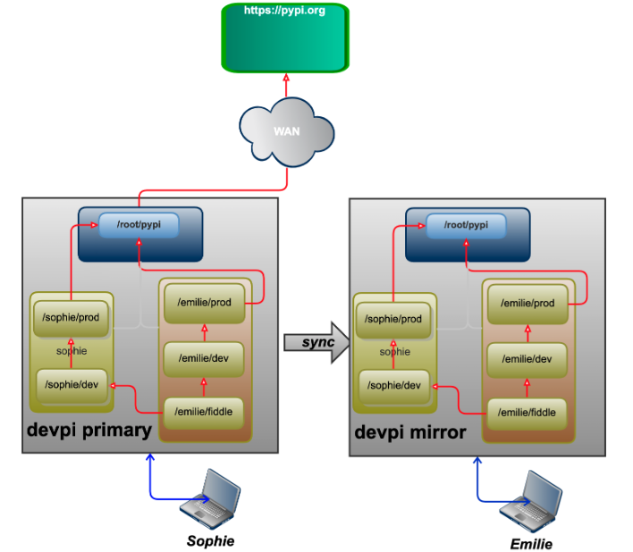

# 部署
部署使用`docker compose`部署，采用主-从集群模式。
## 服务准备
配置文件结构组织如下：
```bash
.
└── dockerfile
    ├── devpi-secret
    ├── docker-compose.yml
    ├── entrypoint.sh
    ├── master.dockerfile
    ├── replica.dockerfile
    └── replica_entrypoint.sh
```
`docker-compose.yml`文件内容如下：
```yml
services:
  devpi-master:
    build:
      context: .
      dockerfile: master.dockerfile
    container_name: devpi-master
    ports:
      - "3141:3141"
    volumes:
      - devpi_master_data:/data
    networks:
      - devpi-net
 
  devpi-replica:
    build:
      context: .
      dockerfile: replica.dockerfile
    container_name: devpi-replica
    ports:
      - "3142:3141"
    volumes:
      - devpi_replica_data:/data
    networks:
      - devpi-net
    depends_on:
      - devpi-master
 
volumes:
  devpi_master_data:
  devpi_replica_data:
 
networks:
  devpi-net:
```
`master.dockerfile`文件内容如下：
```bash
FROM python:3.11-slim
 
RUN pip install devpi-server==6.15.0 -i https://pypi.tuna.tsinghua.edu.cn/simple
 
COPY entrypoint.sh /entrypoint.sh
RUN chmod +x /entrypoint.sh
 
COPY devpi-secret /devpi-secret
RUN chmod 600 /devpi-secret
 
EXPOSE 3141
 
CMD ["/entrypoint.sh"]
```
其中`entrypoint.sh`文件内容如下：
```bash
#!/bin/sh
 
if [ ! -f /data/.serverversion ]; then
  echo "Initializing devpi server data directory..."
  devpi-init --serverdir /data --role primary
fi
 
exec devpi-server --serverdir /data --host 0.0.0.0 --port 3141 --role primary --mirror-cache-expiry 30 --secretfile /devpi-secret
```
`replica.dockerfile`文件内容如下：
```bash
FROM python:3.11-slim
 
RUN pip install devpi-server==6.15.0 -i https://pypi.tuna.tsinghua.edu.cn/simple
 
COPY replica_entrypoint.sh /replica_entrypoint.sh
RUN chmod +x /replica_entrypoint.sh
 
COPY devpi-secret /devpi-secret
RUN chmod 600 /devpi-secret
 
EXPOSE 3141
 
ENTRYPOINT ["/replica_entrypoint.sh"]
```
其中`replica_entrypoint.sh`文件内容如下：
```bash
#!/bin/sh
 
if [ ! -f /data/.serverversion ]; then
  echo "Initializing devpi replica..."
  devpi-init --serverdir /data --role replica --primary-url "http://devpi-master:3141"
fi
 
exec devpi-server --serverdir /data --host 0.0.0.0 --port 3141 --role replica --primary-url "http://devpi-master:3141" --mirror-cache-expiry 30 --secretfile /devpi-secret
```
用于主从认证的`devpi-secret`生成方式为`openssl rand -base64 32 > devpi-secret`
```bash
# 生成命令
openssl rand -base64 32 > devpi-secret
# 文件内容样例
H50YqRnidpeIlPrFnBEU0u3xL6R/2ZvcRK/j8NFTWY8=
```
## 服务启动
```bash
$ sudo docker compose up -d --build
 
# 停止服务
$ sudo docker compose down --volumes --remove-orphans
```
# 主从集群模式及镜像缓存
+ 若客户端请求的包在本地不存在，则会请求源（默认是`https://pypi.org/simple`）。一旦包第一次被请求，则会在本地缓存，
后续的客户端请求直接从本地缓存获取包。默认一个包的元信息被缓存`30min`（上述部署改为`30s`）。也就是默认`30min`后，包的元信息会过期，下次请求会重新访问源，更新包的元信息。
+ 支持**基于复制的主-从模式**。其中**主节点**负责上传，镜像缓存，数据变更等。**从节点**只负责读，从节点会从主节点同步数据。

在另一台机器执行`pip install`命令。
```bash
$ pip3 install requests==2.32.3 --no-cache-dir -i http://10.211.55.11:3141/root/pypi/+simple/ --trusted-host 10.211.55.11
Looking in indexes: http://10.211.55.11:3141/root/pypi/+simple/
Collecting requests==2.32.3
  Downloading http://10.211.55.11:3141/root/pypi/%2Bf/707/61cfe03c773ce/requests-2.32.3-py3-none-any.whl (64 kB)
Requirement already satisfied: charset-normalizer<4,>=2 in /Library/Frameworks/Python.framework/Versions/3.12/lib/python3.12/site-packages (from requests==2.32.3) (3.4.0)
Requirement already satisfied: idna<4,>=2.5 in /Library/Frameworks/Python.framework/Versions/3.12/lib/python3.12/site-packages (from requests==2.32.3) (2.8)
Requirement already satisfied: urllib3<3,>=1.21.1 in /Library/Frameworks/Python.framework/Versions/3.12/lib/python3.12/site-packages (from requests==2.32.3) (2.3.0)
Requirement already satisfied: certifi>=2017.4.17 in /Library/Frameworks/Python.framework/Versions/3.12/lib/python3.12/site-packages (from requests==2.32.3) (2024.12.14)
Installing collected packages: requests
  Attempting uninstall: requests
    Found existing installation: requests 2.32.4
    Uninstalling requests-2.32.4:
      Successfully uninstalled requests-2.32.4
Successfully installed requests-2.32.3
```
在`devpi-server`服务端查看缓存包结果（主节点）如下：
```bash
/var/lib/docker/volumes/dockerfile_devpi_master_data/_data/
└── +files
    └── root
        └── pypi
            └── +f
                └── 707
                    └── 61cfe03c773ce
                        └── requests-2.32.3-py3-none-any.whl
```
同时在从节点查看缓存结果如下：
```bash
/var/lib/docker/volumes/dockerfile_devpi_replica_data/_data/
└── +files
    └── root
        └── pypi
            └── +f
                └── 707
                    └── 61cfe03c773ce
                        └── requests-2.32.3-py3-none-any.whl
```
# 索引继承
索引可以看成存放包的仓库或容器。默认启动`/root/pipy`镜像索引，也可以创建自定义镜像索引，每个镜像索引可单独指定镜像源地址。
## 客户端环境准备
**安装客户端**
```bash
$ pip3 install devpi-client -i https://pypi.tuna.tsinghua.edu.cn/simple
```
**指定客户端使用服务端地址**
```bash
$ devpi use http://10.211.55.11:3141
```
**创建用户**
```bash
$ devpi user -c emilie password=1234
user created: emilie
$ devpi user -c sophie password=1234
user created: sophie
```
查看用户
```bash
$ devpi user -l
emilie
root
sophie
```
查看用户的配置信息
```bash
$ devpi getjson /emilie
{
    "result": {
        "created": "2025-06-18T07:39:20Z",
        "indexes": {},
        "username": "emilie"
    },
    "type": "userconfig"
}
```
**登陆用户**
```bash
$ devpi login emilie --password 1234
logged in 'emilie', credentials valid for 10.00 hours
```
**删除用户**
```bash
先登陆 root 用户
$ devpi login root --password=
删除指定账户
$ devpi user mistake -y --delete
```
**通过配置 devpi-server 参数 --restrict-modify 可以指定哪个用户可以创建，删除用户或索引**。

## 索引创建
```bash
# 已经登陆了 emilie 用户
$ devpi index -c prod volatile=False
http://10.211.55.11:3141/emilie/prod?no_projects=:
  type=stage
  bases=
  volatile=False
  acl_upload=emilie
  acl_toxresult_upload=:ANONYMOUS:
  mirror_whitelist=
  mirror_whitelist_inheritance=intersection
 
$ devpi index -c dev bases=/emilie/prod volatile=True
http://10.211.55.11:3141/emilie/dev?no_projects=:
  type=stage
  bases=emilie/prod
  volatile=True
  acl_upload=emilie
  acl_toxresult_upload=:ANONYMOUS:
  mirror_whitelist=
  mirror_whitelist_inheritance=intersection
 
# 查看创建的索引
$ devpi index -l
emilie/dev
emilie/prod
```
**`volatile`参数为`False`表示不能删除、修改此索引下的包。否则可以删除或修改**。

## 使用索引
**默认情况下不同的用户不能上传包到其他用户索引下**。
```bash
$ devpi use dev
```
## 修改索引
修改哪一个用户索引，需要先登陆对应的用户。
```bash
# 修改 /emilie/dev 索引，继承 /emilie/prod 和 /sophie/dev
$ devpi index /emilie/dev bases=/emilie/prod,/sophie/dev
/emilie/dev bases=/emilie/prod,/sophie/dev
http://10.211.55.11:3141/emilie/dev?no_projects=:
  type=stage
  bases=emilie/prod,sophie/dev
  volatile=True
  acl_upload=emilie
  acl_toxresult_upload=:ANONYMOUS:
  mirror_whitelist=
  mirror_whitelist_inheritance=intersection
```
**修改`/root/pypi`索引使用国内源**
```bash
devpi login root --password=''
 
devpi index root/pypi mirror_url=https://pypi.tuna.tsinghua.edu.cn/simple
 
# 查看
$ devpi index root/pypi
http://10.211.55.11:3141/root/pypi:
  type=mirror
  volatile=False
  mirror_url=https://pypi.tuna.tsinghua.edu.cn/simple
  mirror_web_url_fmt=https://pypi.org/project/{name}/
  title=PyPI
```
## 索引示意说明


一个索引可以继承一个或多个`base`索引。如果当前索引没有需要的包，会从继承的索引查找。创建索引不指定`bases`，
则默认不会继承`/root/pypi`镜像索引，也就是在指定索引没有的包，默认不会从`/root/pypi`查找，所以创建索引根据需要指定`bases`。

例如使用`/emilie/dev`索引安装`requests`包（`/emilie/prod`的`bases`已经添加`/root/pypi`镜像索引） 
```bash
$ pip3 install requests==2.32.4 --no-cache-dir -i http://10.211.55.11:3141/emilie/dev --trusted-host 10.211.55.11
Looking in indexes: http://10.211.55.11:3141/emilie/dev
Collecting requests==2.32.4
  Downloading http://10.211.55.11:3141/root/pypi/%2Bf/27b/abd3cda2a6d50/requests-2.32.4-py3-none-any.whl (64 kB)
Requirement already satisfied: charset_normalizer<4,>=2 in ./devpi/lib/python3.12/site-packages (from requests==2.32.4) (3.4.2)
Requirement already satisfied: idna<4,>=2.5 in ./devpi/lib/python3.12/site-packages (from requests==2.32.4) (3.10)
Requirement already satisfied: urllib3<3,>=1.21.1 in ./devpi/lib/python3.12/site-packages (from requests==2.32.4) (2.4.0)
Requirement already satisfied: certifi>=2017.4.17 in ./devpi/lib/python3.12/site-packages (from requests==2.32.4) (2025.6.15)
Installing collected packages: requests
  Attempting uninstall: requests
    Found existing installation: requests 2.32.3
    Uninstalling requests-2.32.3:
      Successfully uninstalled requests-2.32.3
Successfully installed requests-2.32.4
```
查看主从节点镜像缓存
```bash
# 主节点
/var/lib/docker/volumes/dockerfile_devpi_master_data/_data/
└── +files
    └── root
        └── pypi
            └── +f
                ├── 27b
                │   └── abd3cda2a6d50
                │       └── requests-2.32.4-py3-none-any.whl
                └── 707
                    └── 61cfe03c773ce
                        └── requests-2.32.3-py3-none-any.whl
 
# 从节点
/var/lib/docker/volumes/dockerfile_devpi_replica_data/_data/
└── +files
    └── root
        └── pypi
            └── +f
                ├── 27b
                │   └── abd3cda2a6d50
                │       └── requests-2.32.4-py3-none-any.whl
                └── 707
                    └── 61cfe03c773ce
                        └── requests-2.32.3-py3-none-any.whl
```
# 私有包托管
托管私有包到自建索引。私有包也可以通过`tox`执行测试。

# 支持 web 接口搜索查看

# 服务状态导入导出

# Jenkins 集成
