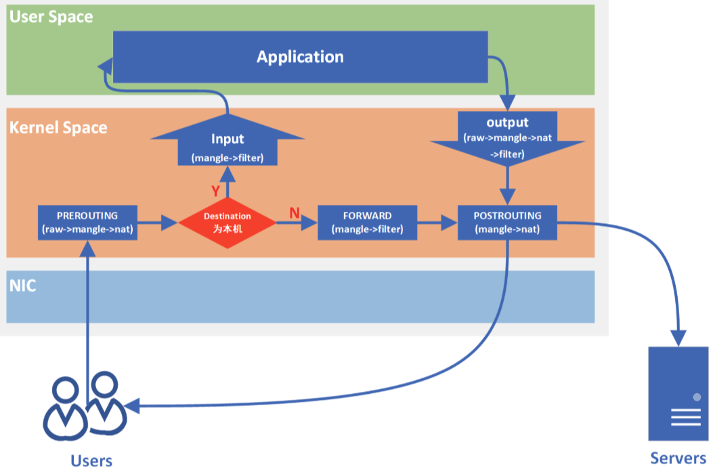

# iptables
`iptables`是 Linux 上的防火墙工具，用于配置和管理网络数据包的过滤规则。`iptables`分为**四表五链**（不涉及`security`表）：
+ `raw`表：可用于关闭`nat`表上启用的连接追踪机制。包含的链为：`PreRouting`，`Output`；
+ `managle`表：指定如何处理数据包，具备拆解报文、修改报文以及重新封装的功能，可用于修改 IP 头部信息，如：TTL。
包含的链为：`PreRouting`，`Forward`，`Input`，`Output`和`PostRouting`；
+ `nat`表：具备网络地址转换的功能，比如 SNAT、DNAT。包含链为：`PreRouting`，`Input`，`Output`，`PostRouting`；
+ `filter`表：负责过滤功能、防火墙，也就是由`filter`表来决定一个数据包是否继续发往它的目的地址或者被丢弃。
包含的链为：`Forward`，`Input`，`Output`；

五链说明如下：
+ `INPUT`链：处理输入数据包；
+ `OUTPUT`链：处理输出数据包；
+ `FORWARD`链：处理转发数据包；
+ `PREROUTING`链：用于目标地址转换（`DNAT`）；
+ `POSTOUTING`链：用于源地址转换（`SNAT`）；

四表执行的优先级是：`raw -> mangle -> nat -> filter`。网络数据经过`iptables`执行流程如下：

每一个链处理结果动作包括接收（`ACCEPT`），丢弃（`DROP`），拒绝（`REJECT`），返回上层（`RETURN`）等。

`iptables`具体操作命令或者支持参数介绍，查看`man iptables`。

# docker网络
`docker`默认创建三种网络：`bridge`、`host`和`none`
```bash
$ sudo docker network ls
NETWORK ID     NAME      DRIVER    SCOPE
40d735af9656   bridge    bridge    local
772e0d536271   host      host      local
7b23eff277df   none      null      local
```
## none网络
`none`网络表示完全隔离的网络，容器内部只有`lo`网络设备，运行容器的时候指定`--network none`参数以让容器使用`none`网络。
```bash
$ sudo docker run -it --network=none busybox
/ # ifconfig 
lo        Link encap:Local Loopback  
          inet addr:127.0.0.1  Mask:255.0.0.0
          inet6 addr: ::1/128 Scope:Host
          UP LOOPBACK RUNNING  MTU:65536  Metric:1
          RX packets:0 errors:0 dropped:0 overruns:0 frame:0
          TX packets:0 errors:0 dropped:0 overruns:0 carrier:0
          collisions:0 txqueuelen:1000 
          RX bytes:0 (0.0 B)  TX bytes:0 (0.0 B)
```
## host网络
`host`网络表示和`docker`宿主机共享网络，容器没有自己独立的 IP。在网络层面来看，可以将使用`host`网络的容器看成宿主机上运行的一个网络服务。
运行容器的时候指定`--network host`参数以让容器使用`host`网络。
```bash
$ sudo docker run --rm -it --network host busybox
/ # ifconfig 
docker0   Link encap:Ethernet  HWaddr 02:42:62:CC:B2:2A  
          inet addr:172.17.0.1  Bcast:172.17.255.255  Mask:255.255.0.0
          UP BROADCAST MULTICAST  MTU:1500  Metric:1
          RX packets:0 errors:0 dropped:0 overruns:0 frame:0
          TX packets:0 errors:0 dropped:0 overruns:0 carrier:0
          collisions:0 txqueuelen:0 
          RX bytes:0 (0.0 B)  TX bytes:0 (0.0 B)

enp0s5    Link encap:Ethernet  HWaddr 00:1C:42:1A:5E:95  
          inet addr:10.211.55.8  Bcast:10.211.55.255  Mask:255.255.255.0
          inet6 addr: fdb2:2c26:f4e4:0:93b1:e2df:e789:44d4/64 Scope:Global
          inet6 addr: fdb2:2c26:f4e4:0:37cf:3427:420d:a2e0/64 Scope:Global
          inet6 addr: fe80::f8eb:79a:ef70:fbb0/64 Scope:Link
          UP BROADCAST RUNNING MULTICAST  MTU:1500  Metric:1
          RX packets:242 errors:0 dropped:0 overruns:0 frame:0
          TX packets:339 errors:0 dropped:0 overruns:0 carrier:0
          collisions:0 txqueuelen:1000 
          RX bytes:72585 (70.8 KiB)  TX bytes:45327 (44.2 KiB)

lo        Link encap:Local Loopback  
          inet addr:127.0.0.1  Mask:255.0.0.0
          inet6 addr: ::1/128 Scope:Host
          UP LOOPBACK RUNNING  MTU:65536  Metric:1
          RX packets:196 errors:0 dropped:0 overruns:0 frame:0
          TX packets:196 errors:0 dropped:0 overruns:0 carrier:0
          collisions:0 txqueuelen:1000 
          RX bytes:18992 (18.5 KiB)  TX bytes:18992 (18.5 KiB)

/ # hostname 
parallels-Parallels-Virtual-Platform
```
在容器内部可以看到`docker`宿主机的所有网络设备，且`hostname`也和`docker`宿主机一样。`docker`宿主机并没有创建新的网络设备。
`host`网络有如下特点：
+ 使用`docker`宿主机的 IP 和端口，运行容器的时候不需要端口映射，也就是不需要指定`-p`参数；
+ 优化容器网络性能，如果容器对网络性能要求高，可以使用`host`网络模式；
+ 由于`host`网络使用`docker`宿主机的端口，需要注意端口冲突问题；
+ 使用`host`网络的容器可以直接配置宿主机的网络，例如管理宿主机的`iptables`等；

## bridge网络
### 默认bridge网络
`bridge`工作在数据链路层，是一个软件模拟的交换机的角色。`bridge`网络一般用于单`docker`宿主机上不同容器间通信，
也就是连接到相同`bridge`网络的容器可以互相通信，连接到不同`bridge`网络不能通信（`docker bridge`驱动通过自动在宿主机网络安装一些规则，例如配置宿主机的`iptables`来实现不同网络隔离能力）。

`docker`在安装的时候会默认创建一个`docker0`网卡的`bridge`网络：
```bash
$ ifconfig
docker0   Link encap:Ethernet  HWaddr 02:42:62:CC:B2:2A  
          inet addr:172.17.0.1  Bcast:172.17.255.255  Mask:255.255.0.0
          UP BROADCAST MULTICAST  MTU:1500  Metric:1
          RX packets:0 errors:0 dropped:0 overruns:0 frame:0
          TX packets:0 errors:0 dropped:0 overruns:0 carrier:0
          collisions:0 txqueuelen:0 
          RX bytes:0 (0.0 B)  TX bytes:0 (0.0 B)

enp0s5    Link encap:Ethernet  HWaddr 00:1C:42:1A:5E:95  
          inet addr:10.211.55.8  Bcast:10.211.55.255  Mask:255.255.255.0
          inet6 addr: fdb2:2c26:f4e4:0:93b1:e2df:e789:44d4/64 Scope:Global
          inet6 addr: fdb2:2c26:f4e4:0:37cf:3427:420d:a2e0/64 Scope:Global
          inet6 addr: fe80::f8eb:79a:ef70:fbb0/64 Scope:Link
          UP BROADCAST RUNNING MULTICAST  MTU:1500  Metric:1
          RX packets:242 errors:0 dropped:0 overruns:0 frame:0
          TX packets:339 errors:0 dropped:0 overruns:0 carrier:0
          collisions:0 txqueuelen:1000 
          RX bytes:72585 (70.8 KiB)  TX bytes:45327 (44.2 KiB)

lo        Link encap:Local Loopback  
          inet addr:127.0.0.1  Mask:255.0.0.0
          inet6 addr: ::1/128 Scope:Host
          UP LOOPBACK RUNNING  MTU:65536  Metric:1
          RX packets:196 errors:0 dropped:0 overruns:0 frame:0
          TX packets:196 errors:0 dropped:0 overruns:0 carrier:0
          collisions:0 txqueuelen:1000 
          RX bytes:18992 (18.5 KiB)  TX bytes:18992 (18.5 KiB)
```
此时`docker0`上没有任何网口：
```bash
$ brctl show
bridge name	bridge id		STP enabled	interfaces
docker0		8000.024262ccb22a	no
```
如果运行容器不指定`--network`参数，则容器连接到默认`bridge`网络。
```bash
$ sudo docker run --rm -it busybox
/ # ip addr show
1: lo: <LOOPBACK,UP,LOWER_UP> mtu 65536 qdisc noqueue qlen 1000
    link/loopback 00:00:00:00:00:00 brd 00:00:00:00:00:00
    inet 127.0.0.1/8 scope host lo
       valid_lft forever preferred_lft forever
    inet6 ::1/128 scope host 
       valid_lft forever preferred_lft forever
6: eth0@if7: <BROADCAST,MULTICAST,UP,LOWER_UP,M-DOWN> mtu 1500 qdisc noqueue 
    link/ether 02:42:ac:11:00:02 brd ff:ff:ff:ff:ff:ff
    inet 172.17.0.2/16 brd 172.17.255.255 scope global eth0
       valid_lft forever preferred_lft forever
```
可以看到，使用默认的`bridge`网络，容器内部会创建一个`eth0@if7`网卡，自动分配的 IP 地址是`172.17.0.2`。`docker`宿主机网卡信息如下：
```bash
$ brctl show
bridge name	bridge id		STP enabled	interfaces
docker0		8000.024262ccb22a	no		veth546ec39
```
可以看到一个新的网口`veth546ec39`被挂到`docker0`上。`eth0@if7`和`veth546ec39`是一对`veth pair`，`veth pair`是成对出现的特殊网络设备，
可以类比一根网线连接的一对网卡，网线一头在容器内部（`eth0@if7`），另一头挂在`docker0`上（`veth546ec39`）。在看下`bridge`网络的配置信息：
```bash
$ sudo docker network inspect bridge
[
    {
        "Name": "bridge",
        "Id": "32b0f0e0ca49f88577247a50239fb1626a3e9143dc83dad6968dae6a15d958e6",
        "Created": "2024-05-29T10:09:59.955738717+08:00",
        "Scope": "local",
        "Driver": "bridge",
        "EnableIPv6": false,
        "IPAM": {
            "Driver": "default",
            "Options": null,
            "Config": [
                {
                    "Subnet": "172.17.0.0/16",
                    "Gateway": "172.17.0.1"
                }
            ]
        },
        "Internal": false,
        "Attachable": false,
        "Ingress": false,
        "ConfigFrom": {
            "Network": ""
        },
        "ConfigOnly": false,
        "Containers": {},
        "Options": {
            "com.docker.network.bridge.default_bridge": "true",
            "com.docker.network.bridge.enable_icc": "true",
            "com.docker.network.bridge.enable_ip_masquerade": "true",
            "com.docker.network.bridge.host_binding_ipv4": "0.0.0.0",
            "com.docker.network.bridge.name": "docker0",
            "com.docker.network.driver.mtu": "1500"
        },
        "Labels": {}
    }
]
```
可以看到子网掩码和默认网关分别是`Subnet: 172.17.0.0/16`和`Gateway: 172.17.0.1`，其中`172.0.0.1`就是`docker0`。
默认运行一个容器后（使用默认`bridge`网络）网络关系如下：
```bash
+-----------+
|  busybox  |
|           |
|172.17.0.2 |
|   eth0    |
+-----------+
     |
+-----------+
|veth546ec39|
+-----------+
     |
+-----------------+
|      docker0    |
|   172.17.0.1    |
+-----------------+
+---------------------------------------------------------------+
|                           Host                                |
+---------------------------------------------------------------+
```
### user-defined-bridges网络
使用`bridge`网络驱动，可以创建自定义的网络。创建一个自定义的`bridge`网络`my-net`命令如下：
```bash
$ sudo docker network create my-net
```
`docker network create`可以指定`subnet`、`gateway`、`ip address`等参数，详细可以参考 [`docker network create`](https://docs.docker.com/reference/cli/docker/network/create/#specify-advanced-options)。
如果要删除自定义的`bridge`网络`my-net`，执行以下命令：
```bash
$ sudo docker network rm my-net
```
如果是一个正在运行的容器需要连接到指定的网络，可以使用如下命令：
```bash
$ sudo docker network connect my-net my-nginx
```
其中`my-nginx`表示正在运行的容器，`my-net`表示已经存在的自定义网络。如果是在启动容器需要指定网络，使用`--network`参数。

下面的命令表示正在运行的容器（`my-nginx`）不连接指定的网络（`my-net`）：
```bash
$ sudo docker network disconnect my-net my-nginx
```
自定义的`bridge`网络和默认的`bridge`网络相比有如下优势：
+ 自定义的`bridge`网络内部有 DNS 服务，也就是说连接到自定义`bridge`网络的容器，可以使用容器名通信。而连接到默认`bridge`网络的容器，
只能通过 IP 互相通信，除非使用`--link`参数（后面废弃了）。容器的 IP 地址只有容器创建完后才知道，使用不方便。
+ 自定义的`bridge`网络有更好的网络隔离性。可以将不同用途的容器连接到自定义的`bridge`网络，连接相同网络的容器可以互相通信，
连接不同网络的容器不能通信。
+ 容器可以随时连接或者不连接自定义`bridge`网络。但对于默认`bridge`网络，如果将一个容器不连接，需要先停止容器，然后重新运行容器，
并使用`--network`参数指定不同的网络。
+ 每一个自定义的`bridge`网络都可单独的配置，使用`docker network create`操作配置。

下面我们实际看下自定义`bridge`网络的特点。创建一个自定义`bridge`网络`my-net`，指定`subnet`和`gateway`参数：
```bash
$ sudo docker network create --driver bridge --subnet 172.33.16.0/24 --gateway 172.33.16.1 my-net
6aca1043b883b929b33950f50bc0e60f8d2ab73a9a8cd0088e9eabf9666c02db
```
查看`docker`宿主机网络情况：
```bash
$ brctl show
bridge name	bridge id		STP enabled	interfaces
br-6aca1043b883		8000.02420af111b6	no		
docker0		8000.024262ccb22a	no
```
新增加一个`br-6aca1043b883`网桥（软件模拟的交换机）。使用`docker network inspect`查看`my-net`配置信息：
```bash
$ sudo docker network inspect my-net
[
    {
        "Name": "my-net",
        "Id": "6aca1043b883b929b33950f50bc0e60f8d2ab73a9a8cd0088e9eabf9666c02db",
        "Created": "2024-05-29T15:20:32.975730181+08:00",
        "Scope": "local",
        "Driver": "bridge",
        "EnableIPv6": false,
        "IPAM": {
            "Driver": "default",
            "Options": {},
            "Config": [
                {
                    "Subnet": "172.33.16.0/24",
                    "Gateway": "172.33.16.1"
                }
            ]
        },
        "Internal": false,
        "Attachable": false,
        "Ingress": false,
        "ConfigFrom": {
            "Network": ""
        },
        "ConfigOnly": false,
        "Containers": {},
        "Options": {},
        "Labels": {}
    }
]
```
可以看到`subnet`和`gateway`以及`Driver`都是创建时候指定的值。再次查看`docker`宿主机网络接口：
```bash
$ ifconfig 
br-6aca1043b883: flags=4099<UP,BROADCAST,MULTICAST>  mtu 1500
        inet 172.33.16.1  netmask 255.255.255.0  broadcast 172.33.16.255
        ether 02:42:0a:f1:11:b6  txqueuelen 0  (Ethernet)
        RX packets 0  bytes 0 (0.0 B)
        RX errors 0  dropped 0  overruns 0  frame 0
        TX packets 0  bytes 0 (0.0 B)
        TX errors 0  dropped 0 overruns 0  carrier 0  collisions 0

docker0: flags=4099<UP,BROADCAST,MULTICAST>  mtu 1500
        inet 172.17.0.1  netmask 255.255.0.0  broadcast 172.17.255.255
        inet6 fe80::42:62ff:fecc:b22a  prefixlen 64  scopeid 0x20<link>
        ether 02:42:62:cc:b2:2a  txqueuelen 0  (Ethernet)
        RX packets 8  bytes 340 (340.0 B)
        RX errors 0  dropped 0  overruns 0  frame 0
        TX packets 46  bytes 6245 (6.2 KB)
        TX errors 0  dropped 0 overruns 0  carrier 0  collisions 0

enp0s5: flags=4163<UP,BROADCAST,RUNNING,MULTICAST>  mtu 1500
        inet 10.211.55.8  netmask 255.255.255.0  broadcast 10.211.55.255
        inet6 fdb2:2c26:f4e4:0:c56e:c964:2926:dc61  prefixlen 64  scopeid 0x0<global>
        inet6 fdb2:2c26:f4e4:0:93b1:e2df:e789:44d4  prefixlen 64  scopeid 0x0<global>
        inet6 fe80::f8eb:79a:ef70:fbb0  prefixlen 64  scopeid 0x20<link>
        ether 00:1c:42:1a:5e:95  txqueuelen 1000  (Ethernet)
        RX packets 3514  bytes 1035104 (1.0 MB)
        RX errors 0  dropped 0  overruns 0  frame 0
        TX packets 1439  bytes 156208 (156.2 KB)
        TX errors 0  dropped 0 overruns 0  carrier 0  collisions 0

lo: flags=73<UP,LOOPBACK,RUNNING>  mtu 65536
        inet 127.0.0.1  netmask 255.0.0.0
        inet6 ::1  prefixlen 128  scopeid 0x10<host>
        loop  txqueuelen 1000  (Local Loopback)
        RX packets 580  bytes 69593 (69.5 KB)
        RX errors 0  dropped 0  overruns 0  frame 0
        TX packets 580  bytes 69593 (69.5 KB)
        TX errors 0  dropped 0 overruns 0  carrier 0  collisions 0
```
新增加`br-6aca1043b883`网卡，其 IP 地址是`172.33.16.1`，也就是创建`my-net`指定的网关地址。

接下来创建三个容器，两个连接`my-net`网络，一个连接默认`bridge`网络：
```bash
$ sudo docker run --rm -it --name use-my-net1 --network my-net busybox
$ sudo docker run --rm -it --name use-my-net2 --network my-net busybox
$ sudo docker run --rm -it --name use-docker0 busybox
```
查看网桥（交换机）信息如下：
```bash
$ brctl show
bridge name	bridge id		STP enabled	interfaces
br-6aca1043b883		8000.02420af111b6	no		veth9e45d72
							vethef33848
docker0		8000.024262ccb22a	no		veth3aef12c
```
当前的网络结构说明如下：
```bash
+-----------+         +-----------+    +-----------+
|use-docker0|         |use-my-net1|    |use-my-net2|
|           |         |           |    |           |
|172.17.0.2 |         |172.33.16.2|    |172.33.16.3|
|   eth0    |         |   eth0    |    |   eht0    |
+-----------+         +-----------+    +-----------+
     |                      |                |
+-----------+         +-----------+    +-----------+
|veth3aef12c|         |veth9e45d72|    |vethef33848|
+-----------+         +-----------+    +-----------+
     |                      |                |
+-----------------+   +-----------------------------------------+
|      docker0    |   |             br-6aca1043b883             |
|   172.17.0.1    |   |             172.33.16.1                 |
+-----------------+   +-----------------------------------------+
+---------------------------------------------------------------+
|                           Host                                |
+---------------------------------------------------------------+
```
容器`use-my-net1`和`use-my-net2`连接相同的网络`my-net`上，可以互相通信（可以通过容器名通信）。
容器`use-docker0`连接到默认的`bridge`网络，和其他两个容器隔离，不能通信。

我们知道，不同的网络可以通过路由进行通信，如果将`docker`宿主机看成一个路由器，那么上面实验两个不同网络是否可以通信呢？
首先查看`docker`宿主机路由表信息：
```bash
$ ip route list
default via 10.211.55.1 dev enp0s5 proto dhcp metric 100 
10.211.55.0/24 dev enp0s5 proto kernel scope link src 10.211.55.8 metric 100 
169.254.0.0/16 dev enp0s5 scope link metric 1000 
172.17.0.0/16 dev docker0 proto kernel scope link src 172.17.0.1 
172.33.16.0/24 dev br-6aca1043b883 proto kernel scope link src 172.33.16.1
```
根据路由表可知，发往`172.17.0.0/16`目标地址的包通过`172.17.0.1`（`docker0`）发送，
发往`172.33.16/24`目标地址的包通过`172.33.16.1`（`br-6aca1043b883`）发送。接着查看`ip_forward`内核参数：
```bash
$ sysctl net.ipv4.ip_forward
net.ipv4.ip_forward = 1
```
`ip_forward`内核参数开启，表示允许路由转发。路由表和`ip_forward`参数都正确配置，不同的`docker`网络还是不通，
继续查看`iptables`配置：
```bash
$ sudo iptables-save
# Generated by iptables-save v1.8.7 on Wed May 29 16:42:26 2024
*filter
:INPUT ACCEPT [0:0]
:FORWARD DROP [0:0]
:OUTPUT ACCEPT [0:0]
:DOCKER - [0:0]
:DOCKER-ISOLATION-STAGE-1 - [0:0]
:DOCKER-ISOLATION-STAGE-2 - [0:0]
:DOCKER-USER - [0:0]
# FORWARD 链的请求跳转到 DOCKER-USER 链处理
-A FORWARD -j DOCKER-USER
# FORWARD 链的请求跳转到 DOCKER-ISOLATION-STAGE-1 链处理
-A FORWARD -j DOCKER-ISOLATION-STAGE-1
-A FORWARD -o br-6aca1043b883 -m conntrack --ctstate RELATED,ESTABLISHED -j ACCEPT
-A FORWARD -o br-6aca1043b883 -j DOCKER
-A FORWARD -i br-6aca1043b883 ! -o br-6aca1043b883 -j ACCEPT
-A FORWARD -i br-6aca1043b883 -o br-6aca1043b883 -j ACCEPT
# FORWARD 链的请求目标是 docker0 所在的网段, 而且已经建立的连接或者和已建立连接相关那么接受请求
-A FORWARD -o docker0 -m conntrack --ctstate RELATED,ESTABLISHED -j ACCEPT
# FORWARD 链的请求目标是 docker0 所在的网段, 那么跳转到 DOCKER 链处理
-A FORWARD -o docker0 -j DOCKER
# FORWARD 链的请求来自于 docker0 所在网段, 而且目标网段不是 docker0 所在网段, 那么接收请求.
-A FORWARD -i docker0 ! -o docker0 -j ACCEPT
# FORWARD 链的请求来自于 docker0 所在网段, 而且目标网段也是 docker0 所在网段, 那么接收请求
-A FORWARD -i docker0 -o docker0 -j ACCEPT
-A DOCKER-ISOLATION-STAGE-1 -i br-6aca1043b883 ! -o br-6aca1043b883 -j DOCKER-ISOLATION-STAGE-2
# DOCKER-ISOLATION-STAGE-1 链的请求如果来自 docker0 所在网段, 而且目标网段不属于 docker0 所在网段,
# 那么跳转到 DOCKER-ISOLATION-STAGE-2 处理
-A DOCKER-ISOLATION-STAGE-1 -i docker0 ! -o docker0 -j DOCKER-ISOLATION-STAGE-2
# DOCKER-ISOLATION-STAGE-1 链未处理的请求返回到上一层继续处理
-A DOCKER-ISOLATION-STAGE-1 -j RETURN
-A DOCKER-ISOLATION-STAGE-2 -o br-6aca1043b883 -j DROP
# DOCKER-ISOLATION-STAGE-2 链的请求如果目标的网段为 docker0 所在网段则丢弃请求
-A DOCKER-ISOLATION-STAGE-2 -o docker0 -j DROP
# DOCKER-ISOLATION-STAGE-2 链未处理的请求返回到上一层继续处理
-A DOCKER-ISOLATION-STAGE-2 -j RETURN
# DOCKER-USER 链未处理的请求返回到上一层继续处理
-A DOCKER-USER -j RETURN
COMMIT
# Completed on Wed May 29 16:42:26 2024
# Generated by iptables-save v1.8.7 on Wed May 29 16:42:26 2024
*nat
:PREROUTING ACCEPT [0:0]
:INPUT ACCEPT [0:0]
:OUTPUT ACCEPT [0:0]
:POSTROUTING ACCEPT [0:0]
:DOCKER - [0:0]
# 如果请求的目标地址是本机的地址, 那么将请求转到 DOCKER 链处理
-A PREROUTING -m addrtype --dst-type LOCAL -j DOCKER
# 如果请求的目标地址不匹配 127.0.0.0/8, 并且目标地址属于本机地址, 那么将请求跳转到 DOCKER 链处理
-A OUTPUT ! -d 127.0.0.0/8 -m addrtype --dst-type LOCAL -j DOCKER
# 对于来自于 172.33.16.0/24 的请求, 目标地址不是 br-6aca1043b883 所在的网段的地址, 
# POSTROUTING 链将会将该请求伪装成宿主机的请求转发到外网
-A POSTROUTING -s 172.33.16.0/24 ! -o br-6aca1043b883 -j MASQUERADE
# 对于来自于 172.17.0.0/16 的请求, 目标地址不是 docker0 所在的网段的地址, 
# POSTROUTING 链将会将该请求伪装成宿主机的请求转发到外网
-A POSTROUTING -s 172.17.0.0/16 ! -o docker0 -j MASQUERADE
# 由 br-6aca1043b883 设备传入的请求 DOCKER 链会返回上一层处理
-A DOCKER -i br-6aca1043b883 -j RETURN
# 由 docker0 设备传入的请求 DOCKER 链会返回上一层处理
-A DOCKER -i docker0 -j RETURN
COMMIT
# Completed on Wed May 29 16:42:26 2024
```
关注下`filter`表中的：
```bash
-A DOCKER-ISOLATION-STAGE-1 -i br-6aca1043b883 ! -o br-6aca1043b883 -j DOCKER-ISOLATION-STAGE-2
-A DOCKER-ISOLATION-STAGE-1 -i docker0 ! -o docker0 -j DOCKER-ISOLATION-STAGE-2
-A DOCKER-ISOLATION-STAGE-1 -j RETURN
-A DOCKER-ISOLATION-STAGE-2 -o br-6aca1043b883 -j DROP
-A DOCKER-ISOLATION-STAGE-2 -o docker0 -j DROP
-A DOCKER-ISOLATION-STAGE-2 -j RETURN
```
**会`DROP`调`docker0`和`br-6aca1043b883`两个`docker`网络之间的双向流量，使其不能通信**。但发往其他网络比如外网，不会`DROP`。

如果想使容器`use-docker0`和另外两个容器`use-my-net1`、`use-my-net2`通信，需要将三个容器连接同一个网络，
比如将`use-docker0`连接到`my-net`网络。
```bash
$ sudo docker network connect my-net use-docker0
```
此时的网络结构如下：
```bash
+----------------------+           +-----------+    +-----------+
|use-docker0           |           |use-my-net1|    |use-my-net2|
|                      |           |           |    |           |
|172.17.0.2 172.33.16.4|           |172.33.16.2|    |172.33.16.3|
|   eth0        eth1   |           |   eth0    |    |   eht0    |
+----------------------+           +-----------+    +-----------+
     |              |                    |                |
+-----------+    +-----------+     +-----------+    +-----------+
|veth3aef12c|    |veth3591dd7|     |veth9e45d72|    |vethef33848|
+-----------+    +-----------+     +-----------+    +-----------+
     |                    |              |                |
+-----------------+   +-----------------------------------------+
|      docker0    |   |             br-6aca1043b883             |
|   172.17.0.1    |   |             172.33.16.1                 |
+-----------------+   +-----------------------------------------+
+---------------------------------------------------------------+
|                           Host                                |
+---------------------------------------------------------------+
```
**同一个`bridge`网络连接的容器个数不要超 1000**，查看[问题](https://github.com/moby/moby/issues/44973)
## docker和外部通信
### docker内部访问外部
默认情况下，`docker`可以直接访问外网。要理解原因，我们需要看下`iptables`的`nat`表：
```bash
# 如果请求的目标地址是本机的地址, 那么将请求转到 DOCKER 链处理
-A PREROUTING -m addrtype --dst-type LOCAL -j DOCKER
# 如果请求的目标地址不匹配 127.0.0.0/8, 并且目标地址属于本机地址, 那么将请求跳转到 DOCKER 链处理
-A OUTPUT ! -d 127.0.0.0/8 -m addrtype --dst-type LOCAL -j DOCKER
# 对于来自于 172.33.16.0/24 的请求, 目标地址不是 br-6aca1043b883 所在的网段的地址, 
# POSTROUTING 链将会将该请求伪装成宿主机的请求转发到外网
-A POSTROUTING -s 172.33.16.0/24 ! -o br-6aca1043b883 -j MASQUERADE
# 对于来自于 172.17.0.0/16 的请求, 目标地址不是 docker0 所在的网段的地址, 
# POSTROUTING 链将会将该请求伪装成宿主机的请求转发到外网
-A POSTROUTING -s 172.17.0.0/16 ! -o docker0 -j MASQUERADE
# 由 br-6aca1043b883 设备传入的请求 DOCKER 链会返回上一层处理
-A DOCKER -i br-6aca1043b883 -j RETURN
# 由 docker0 设备传入的请求 DOCKER 链会返回上一层处理
-A DOCKER -i docker0 -j RETURN
```
上面主要是对来自`docker`网络的流量，且发往的目标地址是外部（也就是数据包的源和目的地址不是同一个网段，
如果是`docker`内部不同的网络，在`filter`表会`DROP`）会执行`MASQUERADE`操作，也就是将包的源地址替换为`Host`的地址发送（`NAT`操作）。

下面运行一个容器，在容器内部执行`ping bing.com`，使用`tcpdump`抓包。先看`docker`宿主机路由表信息：
```bash
$ ip route list
default via 10.211.55.1 dev enp0s5 proto dhcp metric 100 
10.211.55.0/24 dev enp0s5 proto kernel scope link src 10.211.55.8 metric 100 
169.254.0.0/16 dev enp0s5 scope link metric 1000 
172.17.0.0/16 dev docker0 proto kernel scope link src 172.17.0.1 
172.33.16.0/24 dev br-6aca1043b883 proto kernel scope link src 172.33.16.1
```
第一行默认路由会经过网卡`enp0s5`，需要同时抓包`enp0s5`和`docker0`两个网卡数据，结果如下：
```bash
$ sudo tcpdump -i enp0s5 -n icmp
tcpdump: verbose output suppressed, use -v[v]... for full protocol decode
listening on enp0s5, link-type EN10MB (Ethernet), snapshot length 262144 bytes
18:22:27.590443 IP 10.211.55.8 > 13.107.21.200: ICMP echo request, id 9, seq 0, length 64
18:22:27.678514 IP 13.107.21.200 > 10.211.55.8: ICMP echo reply, id 9, seq 0, length 64

$ sudo tcpdump -i docker0 -n icmp
tcpdump: verbose output suppressed, use -v[v]... for full protocol decode
listening on docker0, link-type EN10MB (Ethernet), snapshot length 262144 bytes
18:22:27.590428 IP 172.17.0.2 > 13.107.21.200: ICMP echo request, id 9, seq 0, length 64
18:22:27.678562 IP 13.107.21.200 > 172.17.0.2: ICMP echo reply, id 9, seq 0, length 64
```
抓包结果可知，`docker0`收到来自容器的`ping`包，源 IP 是容器 IP `172.17.0.2`，经过`iptables`规则，会有`MASQUERADE`处理，
也就是`NAT`。之后在`enp0s5`上看到源 IP 改为宿主机的 IP `10.211.55.8`。网络包的流转总结如下：
```bash
                     |                          |
 bing.com            |          Host            |           docker
+---------+     +--------+     +-----+     +---------+     +------+
| network | <---| enp0s5 | <---| NAT | <---| docker0 | <---| 容器 |
+---------+     +--------+     +-----+     +---------+     +------+
                     |                          |
                     |                          |
```

### 外部访问docker内部
通过**端口映射**，也就是运行容器时候指定`-p`参数，这将创建一个`iptables`规则，
映射容器端口到`docker`宿主机上的端口。`-p`参数使用样例如下：
```bash
-p 8080:80  映射 docker 宿主机上的 8080 端口到容器上 TCP 端口 80
-p 192.168.1.100:8080:80  映射 docker 宿主机 IP 是 `192.168.1.100`上的 8080 端口到容器上 TCP 端口 80
-p 8080:80/udp 映射 docker 宿主机上的 8080 端口到容器上的 UDP 端口 80
-p 8080:80/tcp -p 8080:80/udp 映射 docker 宿主机上 TCP 端口 8080 到容器上 TCP 端口 80，docker 宿主机上 UDP 端口 8080 到容器上 UDP 端口 80
```
下面使用端口映射运行一个容器：
```bash
$ sudo docker run -it --rm -p 8080:80 ubuntu:22.04
```
此时查看`docker`宿主机上的`iptables`规则：
```bash
# nat 表增加如下规则
-A POSTROUTING -s 172.17.0.2/32 -d 172.17.0.2/32 -p tcp -m tcp --dport 80 -j MASQUERADE
-A DOCKER ! -i docker0 -p tcp -m tcp --dport 8080 -j DNAT --to-destination 172.17.0.2:80

# filter 表增加如下规则
-A DOCKER -d 172.17.0.2/32 ! -i docker0 -o docker0 -p tcp -m tcp --dport 80 -j ACCEPT
```
```bash
$ ps aux | grep docker-proxy
root        2871  0.0  0.0 1156012 3456 ?        Sl   23:11   0:00 /usr/bin/docker-proxy -proto tcp -host-ip 0.0.0.0 -host-port 8080 -container-ip 172.17.0.2 -container-port 80
root        2877  0.0  0.0 1229744 3456 ?        Sl   23:11   0:00 /usr/bin/docker-proxy -proto tcp -host-ip :: -host-port 8080 -container-ip 172.17.0.2 -container-port 80
```
