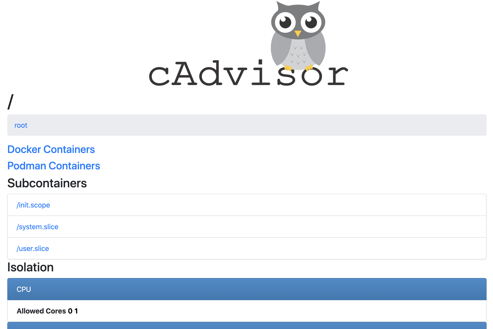
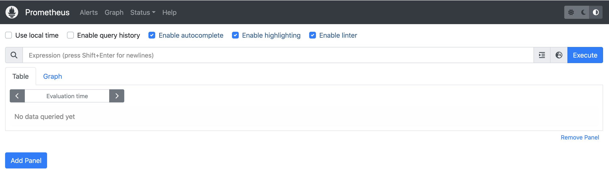
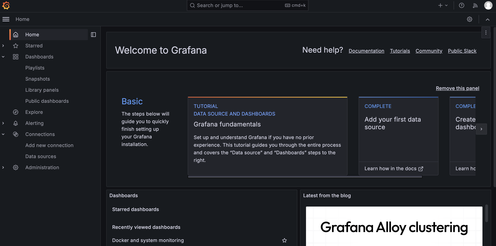
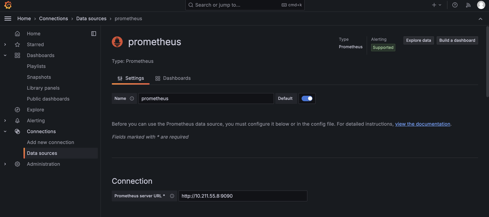
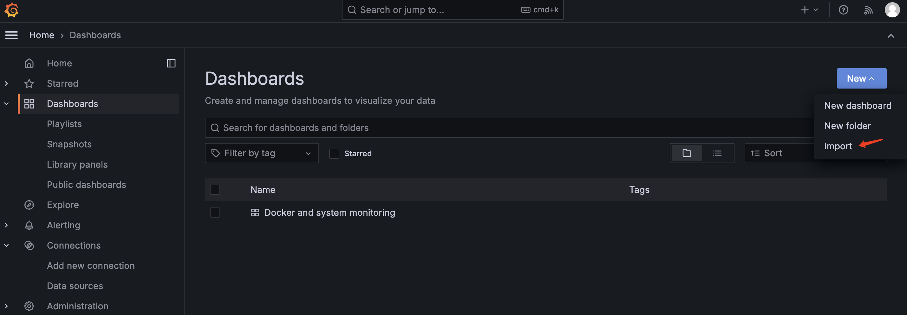
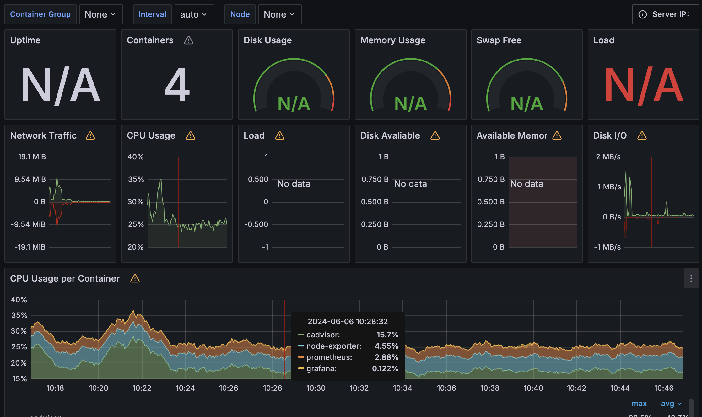

# 服务配置
`cadvisor`、`node-exporter`、`prometheus`和`grafana`实现`docker`和宿主机运行时资源监控。
利用`docker compose`运行多个容器，`docker compose`配置文件`compose.yaml`如下：
```yml
services:
  prometheus:
    image: prom/prometheus:latest
    container_name: prometheus
    ports:
      - 9090:9090
    command:
      - --config.file=/etc/prometheus/prometheus.yml
    volumes:
      - ./prometheus.yml:/etc/prometheus/prometheus.yml:ro
    depends_on:
      - cadvisor
      - node-exporter
    networks:
      - my-net
  
  cadvisor:
    image: m.daocloud.io/gcr.io/cadvisor/cadvisor:latest
    container_name: cadvisor
    ports:
      - 8080:8080
    volumes:
      - /:/rootfs:ro
      - /var/run:/var/run:ro
      - /sys:/sys:ro
      - /var/lib/docker/:/var/lib/docker:ro
      - /dev/disk/:/dev/disk:ro
    devices:
      - /dev/kmsg
    privileged: true
    networks:
      - my-net

  node-exporter:
    image: quay.io/prometheus/node-exporter:latest
    container_name: node-exporter
    ports:
      - 9100:9100
    command:
      - --path.rootfs=/host
    volumes:
      - /:/host:ro,rslave
    networks:
      - my-net
    
  grafana:
    image: grafana/grafana-enterprise:latest
    container_name: grafana
    ports:
      - 3000:3000
    volumes:
      - ./grafana-data:/var/lib/grafana
    environment:
      - GF_SECURITY_ADMIN_PASSWORD=123456
    depends_on:
      - prometheus
    networks:
      - my-net

networks:
  my-net:
    driver: bridge
```
> 由于国内不能直接拉取`gcr.io`下镜像，所有加个前缀`m.daocloud.io`。

上述配置中`grafana`容器`volumes`挂载的本地路径`./grafana-data`目录需要有`other`用户写权限。

`prometheus`服务端配置文件`prometheus.yml`文件如下：
```yml
global:
  scrape_interval:     1s # By default, scrape targets every 15 seconds.
  evaluation_interval: 1s # Evaluate rules every 15 seconds.

  # Attach these extra labels to all timeseries collected by this Prometheus instance.
  external_labels:
    monitor: 'test-monitor'

rule_files:
#  - 'prometheus.rules.yml'

scrape_configs:
  - job_name: 'prometheus'
    scrape_interval: 1s
    static_configs:
      - targets: ['10.211.55.8:9090']

  - job_name: 'node'
    scrape_interval: 1s
    static_configs:
      - targets:
        - 10.211.55.8:9100

  - job_name: 'docker'
    scrape_interval: 1s
    static_configs:
      - targets:
        - 10.211.55.8:8080
```
其中`targets`中需要更改为实际运行指标收集服务的地址。

# 服务运行
**服务启动**
```bash
sudo docker compose up -d
```
1. 服务启动后，通过`http://<ip>:8080`访问`cadvisor`的 webui 界面，可以查看容器和宿主机资源使用情况。


2. 通过`http://<ip>:9090`访问`prometheus`服务的 webui 界面，可以在表达式栏中输入`Prometheus`表达式。
例如，开始检索`container_start_time_seconds`指标，该指标记录了容器的启动时长(以秒为单位)。
可以使用`name="<container_name>"`表达式按名称选择特定的容器。容器名称对应于`Docker Compose`配置中的`container_name`参数。
例如，`container_start_time_seconds{name="redis"}`表达式显示`redis`容器启动时长。


3. 通过`http://<ip>:3000`访问`grafana`界面。初始的时候需要登录，用户名为`admim`，密码为启动`grafana`容器时`GF_SECURITY_ADMIN_PASSWORD`环境变量的值。
登录成功后界面如下

添加数据源`Data sources`选择`prometheus`，指定`prometheus server URL`，其他配置根据需求设置，样例：

配置`Dashboards`，可以从[官方下载](https://grafana.com/grafana/dashboards/)配置好的`json`文件，直接导入，如下所示：

例如选择`Docker and system monitoring`模版，最终效果如下：


**服务停止**
```bash
sudo docker compose down
```
