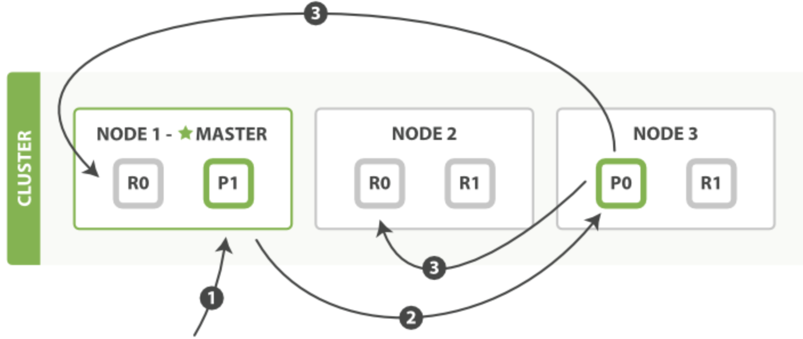
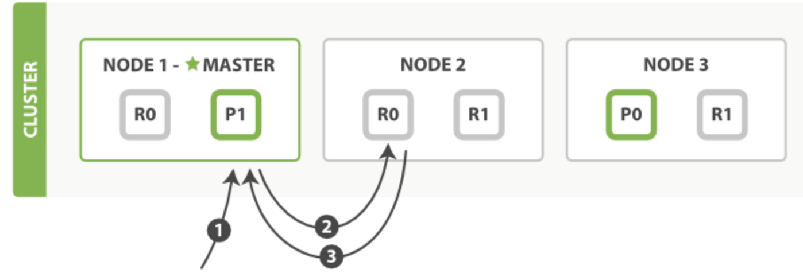
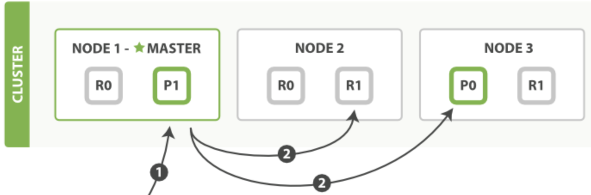
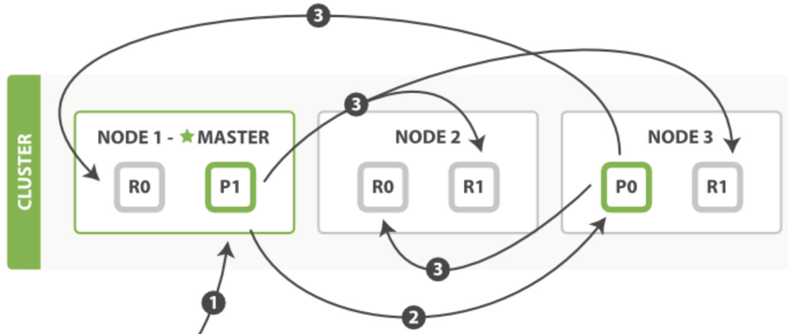

# 综述
`Elasticsearch`面向**文档**，不仅存储文档，而且可以**索引**每个文档使之可以被检索。`Elasticsearch`使用`json`序列化文档。
一个文档样例如下：
```json
{
    "email":      "john@smith.com",
    "first_name": "John",
    "last_name":  "Smith",
    "info": {
        "bio":         "Eco-warrior and defender of the weak",
        "age":         25,
        "interests": [ "dolphins", "whales" ]
    },
    "join_date": "2014/05/01"
}
```
**索引**类似关系型数据库中的一张表。索引一个文档就是存储一个文档到一个索引（类似插入一条数据到表中）。
在关系型数据库中，为提高某一列查询速度，可以对该列创建索引（内部使用`B-tree`），对应`Elasticsearch`是**倒排索引**。
为了更好理解`Elasticsearch`的相关概念，下表总结了和关系型数据库对比。
|关系型数据库|`Elasticsearch`|
|------------|------------|
|数据库（`database`）|集群 / 索引集合|
|表（`Table`）|索引（`Index`）|
|行（`Row`）|文档（`Document`）|
|列（`Column`）|字段（`Field`）|
|主键（`Primary Key`）|文档 `_id`|
|表结构（`Scheam`）|映射（`Mapping`）|

# 集群
一个运行中的`Elasticsearch`实例称为一个节点，而集群是由一个或者多个拥有相同`cluster.name`配置的节点组成。
当有节点加入集群中或者从集群中移除节点时，集群将会重新平均分布所有的数据。
+ **主节点**：负责**管理集群范围内**的所有变更，例如增加、删除索引，或者增加、删除节点等。而主节点并**不需要涉及到文档级别的变更和搜索等操作**。

每个节点（包括主节点）都知道任意文档所处的位置，并且能够将请求直接转发到存储所需文档的节点。无论将请求发送到哪个节点，它都能负责从各个包含所需文档的节点收集回数据，并将最终结果返回給客户端。

可以通过在`Kibana`的`Dev Tools`的`Console`里面执行以下命令查看**集群健康状态**。
```bash
GET /_cluster/health
```
返回集群状态样例如下（测试集群根据官方文档使用`docker compose` 管理三节点集群）：
```json
{
  "cluster_name" : "docker-cluster",
  "status" : "green",
  "timed_out" : false,
  "number_of_nodes" : 3,
  "number_of_data_nodes" : 3,
  "active_primary_shards" : 10,
  "active_shards" : 20,
  "relocating_shards" : 0,
  "initializing_shards" : 0,
  "unassigned_shards" : 0,
  "delayed_unassigned_shards" : 0,
  "number_of_pending_tasks" : 0,
  "number_of_in_flight_fetch" : 0,
  "task_max_waiting_in_queue_millis" : 0,
  "active_shards_percent_as_number" : 100.0
}
```
重点关注下`status`值：
+ **`green`**：所有的主分片和副本分片都正常运行。
+ **`yellow`**：所有的主分片都正常运行，但不是所有的副本分片都正常运行。
+ **`red`**：有主分片没能正常运行。

**索引是实际指向一个或多个物理分片的逻辑命名空间**。一个**分片**是一个底层工作单元，仅保存部分数据。
分片是数据的容器，文档保存在分片内，分片被分配到集群内的各个节点里。当集群规模扩大或缩小，`Elasticsearch`会自动的在各节点中迁移分片，使得数据仍然均匀分布在集群里。
**每一个分片都是一个完整的搜索引擎实例，可以检索存储的文档**。

分片分为主分片和副分片：
+ **主分片**：索引内任意一个文档都归属于一个主分片，所以主分片的数目决定着索引能够保存的最大数据量。在**索引建立的时候就已经确定了主分片数**。
+ **副分片**：副本分片只是一个主分片的拷贝。副本分片作为硬件故障时保护数据不丢失的冗余备份，并为搜索和返回文档等**读操作**提供服务。
**副本分片数可以随时修改**。

如果关闭`Elasticsearch`集群的一个主节点，而集群必须拥有一个主节点来保证正常工作，所以集群会先选举一个新的主节点。
如果关闭节点导致缺失主分片，没有主分片索引也不能正常工作，所以主节点立刻将其它副本分片提升为主分片。

一个文档是根据以下公式决定分配到哪一个主分片：
```bash
shard = hash(routing) % number_of_primary_shards
```
其中`routing`默认是文档`_id`值，**也可以通过请求参数指定**。所以在创建索引的时候就确定好主分片的数量，
并且后续不会改变这个数量。因为如果数量变化了，所有之前路由的值都会无效，文档会找不到。

假如有`3`节点的集群，一个`master`节点。集群中的某一个`index`有`2`个主分片和每个主分片有`2`个副本分片。示意图如下：



一个主分片和其副本分片不会在同一个节点（同一个节点没意义）。当新键单个文档，索引单个文档或删除单个文档请求发送到`Node1`上，执行流程如下：
+ 客户端向`Node 1`发送请求（每个节点都知道集群中任一文档位置，可以直接将请求转发到需要的节点上，所以可以发送请求到集群中的任一节点。）。
+ 节点使用文档的`_id`确定文档属于分片`0`。请求会被转发到`Node 3`，因为分片`0`的**主分片**在`Node 3`上。
+ `Node 3`在**主分片**上面执行请求。如果成功，它将请求并行转发到`Node 1`和`Node 2`的**副本分片上**。
一旦所有的副本分片都报告成功，`Node 3`将向**协调节点**`Node 1`报告成功，**协调节点**向客户端报告成功。

在客户端收到成功响应时，文档变更已经在主分片和所有副本分片执行完成，变更是安全的。有一些请求参数，例如`consistency`、`timeout`等可以用于牺牲数据安全提高性能。

可以从**主分片或者从其它任意副本分片检索文档**。例如取回单个文档示意如下。



+ 客户端向`Node 1`发送获取请求。
+ 节点使用文档的`_id`来确定文档属于分片`0`。分片`0`的副本分片存在于所有的三个节点上。在这种情况下，它将请求转发到`Node 2` 。
+ `Node 2`将文档返回给`Node 1`，然后将文档返回给客户端。

在处理读取请求时，协调结点在每次请求的时候都会通过轮询所有的副本分片来达到负载均衡。

对于批量处理命令`mget`、`bulk`的处理方式和单文档类似。区别在于**协调节点**知道每个文档存在于哪个分片中。
它将整个多文档请求分解成**每个分片**的多文档请求，并且将这些请求**并行转发**到每个参与节点。
**协调节点**一旦收到来自每个节点的应答，就将每个节点的响应收集整理成单个响应，返回给客户端。例如`mget`请求如下：



+ 客户端向`Node 1`发送`mget`请求。
+ `Node 1`为每个分片构建多文档获取请求，然后**并行转发**这些请求到托管在每个所需的主分片或者副本分片的节点上。
一旦收到所有答复，`Node 1`构建响应并将其返回给客户端。

`bulk`请求原理示意如下：



+ 客户端向`Node 1`发送`bulk`请求。
+ `Node 1`为每个节点创建一个批量请求，并将这些请求**并行转发**到每个包含主分片的节点主机。
+ 主分片一个接一个按顺序执行每个操作。当每个操作成功时，主分片**并行转发**新文档（或删除）到副本分片，然后执行下一个操作。
一旦所有的副本分片报告所有操作成功，该节点将向协调节点报告成功，协调节点将这些响应收集整理并返回给客户端。

# 文档
在`Elasticsearch`中，文档是使用`json`序列化的键值对的对象，一个文档的样例如下：
```json
{
    "email":      "john@smith.com",
    "first_name": "John",
    "last_name":  "Smith",
    "info": {
        "bio":         "Eco-warrior and defender of the weak",
        "age":         25,
        "interests": [ "dolphins", "whales" ]
    },
    "join_date": "2014/05/01"
}
```
每一个文档的**核心元数据**包含如下信息：
+ **`_index`**：文档所在的索引。
+ **`_type`**：固定值`_doc`。
+ **`_id`**：文档的唯一`id`，一个字符串。和`_index`以及`_type`组合就可以唯一确定`Elasticsearch`中的一个文档。
创建一个新的文档，可以指定`_id`，也可以使用`Elasticsearch`自动生成。
+ **`_version`**：文档版本号。每次对文档进行修改时（包括删除），` _version`的值会递增。

例如查询一个`index=website`下的`_id=2`的文档数据如下（`GET /website/_doc/2?pretty`）：
```json
{
  "_index" : "website",
  "_type" : "_doc",
  "_id" : "2",
  "_version" : 3,
  "_seq_no" : 4,
  "_primary_term" : 1,
  "found" : true,
  "_source" : {
    "title" : "My first blog entry2",
    "text" : "Just trying this out...",
    "date" : "2014/01/01"
  }
}
```
