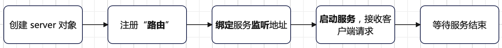
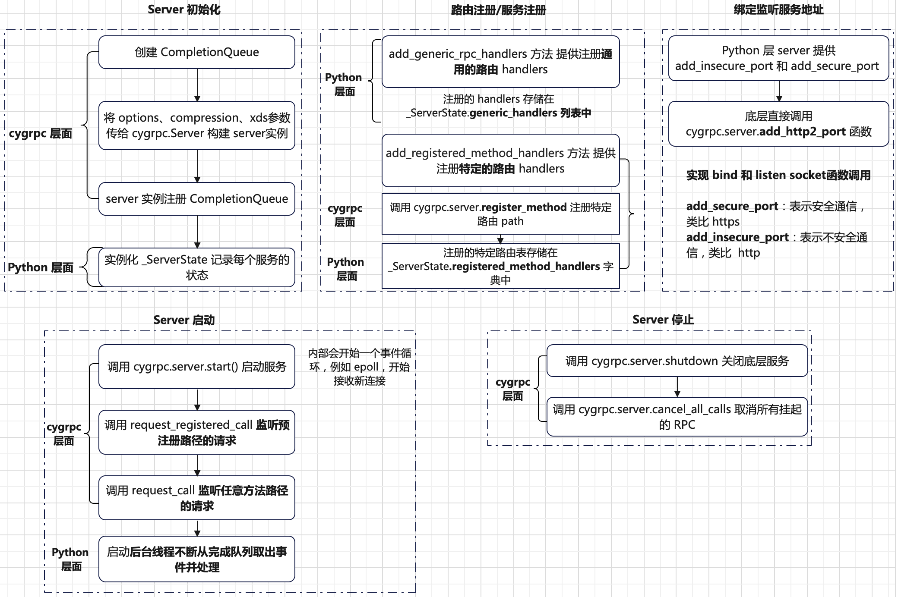
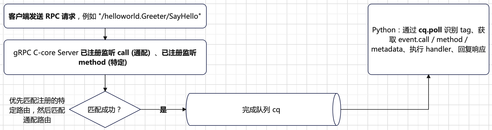
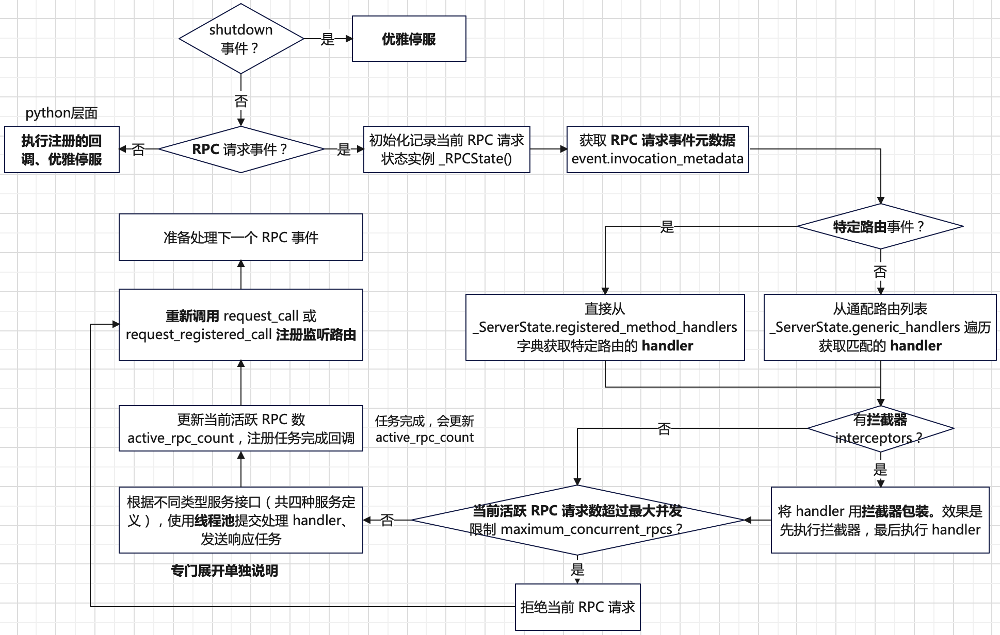
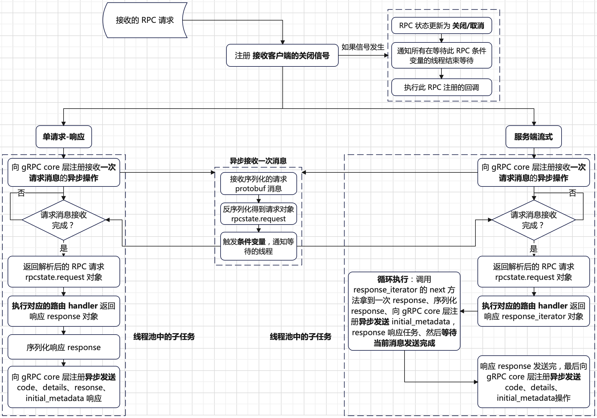
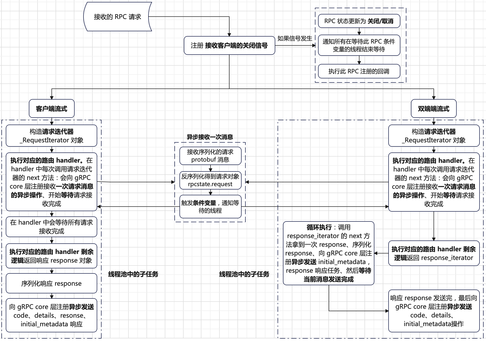
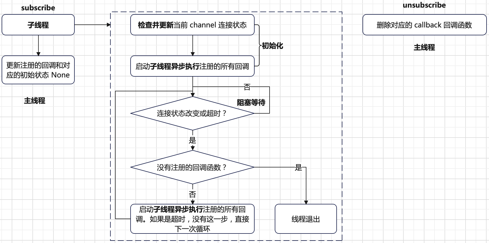
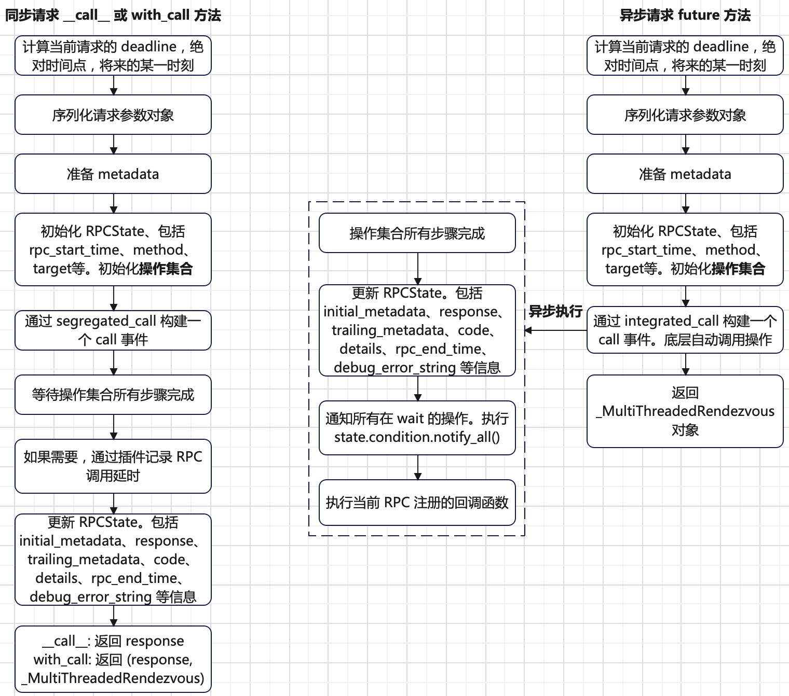

# 核心概念
在`gRPC`中，客户端可以调用不同机器部署的服务端提供的方法，就像本地调用一样方便。`gRPC`的工作原理可以总结如下：


`gRPC`是基于**服务定义**的思想。即通过`.proto`文件定义远端服务可以被调用的方法、参数及返回类型。
服务端实现定义的接口和运行`gRPC`服务以处理客户端请求。客户端有`stub`，其中提供了和服务端相同的方法以供调用。

`gRPC`客户端和服务端可以运行在不同平台，使用不同的语言实现（`gRPC`官方支持多种语言）。例如服务端使用`C++`实现，
客户端使用`Python`实现。

`gRPC`使用[`protobuf`序列化](./protocol.md)消息数据，具有体积小，传输效率高特点。定义好`.proto`文件后，使用`protoc`编译器生成客户端和服务端代码。


## 服务定义
一个服务定义的样例如下：
```proto
service HelloService {
  rpc SayHello (HelloRequest) returns (HelloResponse);
}

message HelloRequest {
  string greeting = 1;
}

message HelloResponse {
  string reply = 1;
}
```
`gRPC`提供了四种服务定义方法：
+ **单次请求-响应**：客户端发送一个单请求到服务端，然后收到服务端的一个响应，像正常的函数调用。
  ```proto
  rpc SayHello(HelloRequest) returns (HelloResponse);
  ```
+ **服务端流式`RPC`**：客户端发送一个单请求到服务端，然后收到服务端的流式响应，客户端读取流式响应直到读完数据。
  ```proto
  rpc LotsOfReplies(HelloRequest) returns (stream HelloResponse);
  ```
+ **客户端流式`RPC`**：客户端发送流式请求到服务端，请求发送完成后客户端等待服务端响应。
  ```proto
  rpc LotsOfGreetings(stream HelloRequest) returns (HelloResponse);
  ```
+ **双端流式`RPC`**：客户端发送流式请求到服务端，服务端返回流式响应。两边的流是独立的，也就是客户端和服务端自行决定读写方式。
例如服务端可以接收完全部客户端流式请求在响应，也可以一边接收流式请求，一边响应。
  ```proto
  rpc BidiHello(stream HelloRequest) returns (stream HelloResponse);
  ```

## RPC 生命周期
`RPC`生命周期描述的是**一次远程调用从客户端发起请求，到服务端处理完成并返回结果，再到资源清理的全过程**。下面以**单次请求-单次响应**服务定义为例说明：
```bash
+----------------+          HTTP/2          +----------------+
|                | -----------------------> |                |
|   Client Stub  |     (1) 发送请求         |     Server     |
|                |                          |   (Handler)    |
+----------------+                          +----------------+
       |                                             |
       |         (2) Protobuf 解码                   |
       | <-------------------------------------------|
       |                                             |
       |         (3) 执行业务逻辑                    |
       |                                             |
       |         (4) Protobuf 编码响应               |
       | <-------------------------------------------|
       |                                             |
+----------------+                          +----------------+
|                | <----------------------- |                |
|   Client Stub  |     (5) 接收响应         |     Server     |
|                |                          |   (Handler)    |
+----------------+                          +----------------+
       |                                            
       |         (6) 解析状态码和 Trailer             
       |
       |         (7) 清理资源并关闭通道              
```
**单请求响应**方式工作流程总结如下：
+ 客户端调用`stub`方法（即发起`RPC`调用），服务端就会收到通知，内容包括：客户端传来的`metadata`、调用的方法名，以及（如果设置了）调用的超时时间（`deadline`）。
`metadata`是指附加信息，例如请求头、认证`token`、`trace ID`。
+ 服务端可以立即返回自己的`initial metadata`（必须在响应之前发送），也可以等待接收到客户端的请求消息后再发送。
服务端的`initial metadata`类似响应头，内容可能包含编码方式、压缩格式。
+ 服务端拿到客户端的请求消息，它会执行所需的业务逻辑，生成并填充一个响应对象。服务端将响应（如果成功）返回给客户端，
同时附带状态信息（状态码和可选的状态消息），以及可选的`trailing metadata`（尾部元数据）。
+ 如果响应状态是`OK`（即没有出错），客户端就会收到响应消息，此次`RPC`调用至此在客户端完成。底层流关闭，`gRPC`框架自动释放资源。

而**服务端流式`RPC`**、**客户端流式`RPC`** 及 **双端流式`RPC`** 的生命周期流程基本和**单次请求响应**一样，除了请求或响应通过流式实现。

需要注意，`gRPC`中`channel`提供了和特定的`gRPC`服务端连接，`channel`被客户端`stub`使用。

# 实现原理
## 服务端
`gRPC`服务端工作流程框架总结如下。



以`Python`实现为例，下面是一个简单的同步方式实现的`gRPC`服务端。
```python
# 定义服务
def serve():
    port = "50051"
    server = grpc.server(futures.ThreadPoolExecutor(max_workers=10))     # 定义一个 server 对象
    helloworld_pb2_grpc.add_GreeterServicer_to_server(Greeter(), server) # 注册路由，即将实现的服务注册进 server
    server.add_insecure_port("[::]:" + port)                             # 绑定并监听服务地址
    server.start()                                                       # 启动服务，接收客户端请求
    print("Server started, listening on " + port)
    server.wait_for_termination()
```
`gRPC`的`server`对象的底层由`cython`的`cygrpc`模块实现，`cygrpc`封装了`C`层的`gRPC Core`的调度和生命周期管理逻辑。
`gRPC Core`也实现了`http2`协议。

`gRPC.server`的生命周期工作原理总结如下。



当`gRPC`的服务端成功启动后，在`cygrpc`层面和`Python`层面对于一个客户端的`RPC`调用数据交互流程如下。



在`gRPC`服务端开始接收客户端`RPC`请求之前，服务端需要**注册等待某类请求到来**的意图（`Intent`），然后通过`Completion Queue`异步地接收和处理请求事件。
+ `request_call`:  监听**任意方法路径**的请求。
+ `request_registered_call`:  监听**预注册路径（特定路径）** 的请求。

因为服务端不会自动接受请求，必须显式调用`request_call`或`request_registered_call`告诉底层**我现在准备好了，请监听某个类型的请求，到来后通过`Completion Queue`通知我**。

在`gRPC`服务端，同一个客户端请求到底被哪个接口（`request_call`还是`request_registered_call`）接住，
是由服务端注册监听的方式决定的。客户端只发出一个请求路径，比如`/helloworld.Greeter/SayHello`。
如果服务端对某些请求路径使用`register_method`并调用`request_registered_call`，则**优先特定路径监听**，否则通过通配路径监听投递请求事件到完成队列。
伪代码说明如下：
```python
if (path in registered_methods_table):
    deliver to registered_call (request_registered_call)
else:
    deliver to generic_call (request_call)
```
在`cygrpc`层面会接收并解析客户端的`RPC`请求，匹配成功后会将请求包装为一个`event`，并携带`tag`投递到`Completion Queue`中。
然后在`Python`层面不断检查`Completion Queue`处理其中的`event`。
```python
# 服务启动后，启动的后台线程用于处理客户端 RPC 请求
def _serve(state: _ServerState) -> None:
    while True:
        timeout = time.time() + _DEALLOCATED_SERVER_CHECK_PERIOD_S
        event = state.completion_queue.poll(timeout)   # 从完成队列获取 event
        if state.server_deallocated:
            _begin_shutdown_once(state)
        if event.completion_type != cygrpc.CompletionType.queue_timeout:
            # 处理 RPC 请求事件
            if not _process_event_and_continue(state, event):
                return
        # We want to force the deletion of the previous event
        # ~before~ we poll again; if the event has a reference
        # to a shutdown Call object, this can induce spinlock.
        event = None


def _begin_shutdown_once(state: _ServerState) -> None:
    with state.lock:
        if state.stage is _ServerStage.STARTED:
            state.server.shutdown(state.completion_queue, _SHUTDOWN_TAG)  # 投递一个 _SHUTDOWN_TAG 的 event
            state.stage = _ServerStage.GRACE
            state.due.add(_SHUTDOWN_TAG)
```
其中`event`处理函数`_process_event_and_continue`实现流程如下。



需要注意`gRPC`服务端提供了**拦截器`interceptors`** 功能，其在注册的具体路由`Handler`执行之前被调用，可以理解为**中间价机制**。
拦截器的**调用顺序和传递的顺序一致**，是**链式调用**，即第一个拦截器调第二个，最后一个拦截器调具体的`Handler`。服务端拦截器源码`Pipeline`如下。
```python
class _ServicePipeline(object):
    interceptors: Tuple[grpc.ServerInterceptor]

    def __init__(self, interceptors: Sequence[grpc.ServerInterceptor]):
        self.interceptors = tuple(interceptors)

    def _continuation(self, thunk: Callable, index: int) -> Callable:
        return lambda context: self._intercept_at(thunk, index, context)
        # 等效替换
        # def continuation_fn(context):
        #     return self._intercept_at(thunk, index, context)
        # return continuation_fn

    def _intercept_at(
        self, thunk: Callable, index: int, context: grpc.HandlerCallDetails
    ) -> grpc.RpcMethodHandler:
        if index < len(self.interceptors):
            interceptor = self.interceptors[index]
            thunk = self._continuation(thunk, index + 1)
            # 此时的 thunk 是下一个拦截器
            return interceptor.intercept_service(thunk, context)
        else:
            return thunk(context)

    def execute(
        self, thunk: Callable, context: grpc.HandlerCallDetails) -> grpc.RpcMethodHandler:
        return self._intercept_at(thunk, 0, context)
```
下面给出使用拦截器样例，说明拦截器的**链式调用**原理。
```python
# 定义如下两个拦截器
class LoggingInterceptor(grpc.ServerInterceptor):
    def intercept_service(self, continuation, handler_call_details):
        print(f"[LoggingInterceptor] Received call: {handler_call_details.method}")
        return continuation(handler_call_details)

class AuthInterceptor(grpc.ServerInterceptor):
    def intercept_service(self, continuation, handler_call_details):
        print(f"[AuthInterceptor] Authorization passed")
        return continuation(handler_call_details)

# 模拟使用拦截器
def create_real_handler(context):
    def real_rpc_handler(request, context):
        return "success"

    return grpc.unary_unary_rpc_method_handler(real_rpc_handler)

class DummyContext(grpc.HandlerCallDetails):
    def __init__(self, method, metadata):
        self.method = method
        self.invocation_metadata = metadata
# 拦截器列表
interceptors = [LoggingInterceptor(), AuthInterceptor()]
pipeline = _ServicePipeline(interceptors)
# 拦截器调用
handler = pipeline.execute(create_real_handler, 
                           DummyContext("/hello.Greeter/SayHi", 
                                        [("authorization", "Bearer secret")]
                                        )
                           )
print("Handler returned:", handler)

########################样例执行结果###########################################
[LoggingInterceptor] Received call: /hello.Greeter/SayHi
[AuthInterceptor] Authorization passed
Handler returned: RpcMethodHandler(request_streaming=False, response_streaming=False, 
                                   request_deserializer=None, response_serializer=None, 
                                   unary_unary=<function create_real_handler.<locals>.real_rpc_handler at ...>,
                                   unary_stream=None, stream_unary=None, stream_stream=None)
```
可以看到，拦截器调用顺序和传递顺序一致。拦截器`LoggingInterceptor`先调用，然后`AuthInterceptor`拦截器被调用，最后执行`create_real_handler`。

接下来看下对于一个`RPC`请求是如何处理的。根据前面介绍可知，`gRPC`定义了四种服务类型。
+ **单次请求-单次响应**
+ **服务端流式**
+ **客户端流式**
+ **双端流式**

每一种类型处理`RPC`请求的工作原理如下。其中**单请求单响应**和**单请求服务端流式**流程如下。



**客户端流式单响应**和**双端流式**流程如下。



为了更好理解上面介绍的四种服务工作流程，下面给出四种服务类型`handler`的样例说明。
+ **单请求响应模式**
  ```python
  def GetFeature(self, request, context):
      feature = get_feature(self.db, request)
      if feature is None:
          return route_guide_pb2.Feature(name="", location=request)
      else:
          return feature
  ```
+ **服务端流式**
  ```python
  # 一个迭代器
  def ListFeatures(self, request, context):
      left = min(request.lo.longitude, request.hi.longitude)
      right = max(request.lo.longitude, request.hi.longitude)
      top = max(request.lo.latitude, request.hi.latitude)
      bottom = min(request.lo.latitude, request.hi.latitude)
      for feature in self.db:
          if (
              feature.location.longitude >= left
              and feature.location.longitude <= right
              and feature.location.latitude >= bottom
              and feature.location.latitude <= top
          ):
              yield feature
  ```
+ **客户端流式**
  ```python
  # 参数 request_iterator 是一个请求迭代器
  def RecordRoute(self, request_iterator, context):
      point_count = 0
      feature_count = 0
      distance = 0.0
      prev_point = None

      start_time = time.time()
      for point in request_iterator:
          point_count += 1
          if get_feature(self.db, point):
              feature_count += 1
          if prev_point:
              distance += get_distance(prev_point, point)
          prev_point = point

      elapsed_time = time.time() - start_time
      return route_guide_pb2.RouteSummary(
          point_count=point_count,
          feature_count=feature_count,
          distance=int(distance),
          elapsed_time=int(elapsed_time),
      )
  ```
+ **双端流式**
  ```python
  # 请求参数 request_iterator 是一个请求迭代器，且此 handler 是一个迭代器
  def RouteChat(self, request_iterator, context):
      prev_notes = []
      for new_note in request_iterator:
          for prev_note in prev_notes:
              if prev_note.location == new_note.location:
                  yield prev_note
          prev_notes.append(new_note)
  ```
可以注意到，每一个`handler`都会有一个`context`参数。`context`是`gRPC`服务端实现的上下文对象，
提供了**与当前`RPC`调用上下文的交互接口**。下面给出部分`context`提供的功能说明，完整的可以看`gRPC`服务端源码。
|功能分类|方法或属性|作用|
|--------|------------|-----|
|元信息|`context.invocation_metadata()`|获取客户端发来的`metadata`（通常是`headers`）|
|客户端身份|`context.peer()`|获取客户端地址，格式如`ipv4:127.0.0.1:12345`|
|状态控制|`context.set_code(code)`|设置返回状态码（如`grpc.StatusCode.OK`）|
|错误信息|`context.set_details(details)`|设置错误详情文字|
|取消检查|`context.is_active()`|客户端连接是否还在|
|提前终止|`context.abort(code, details)`|立即终止并返回指定错误|
|超时控制|`context.time_remaining()`|剩余允许的处理时间（秒）|
|请求元数据|`context.auth_context()`|安全上下文，如证书、`SSL`信息等（如果启用）|
|客户端断开回调|`add_callback(callback)`|客户端取消（或断开）`RPC`，自动触发注册的回调|

## 客户端 Stub
`gRPC`客户端的核心是`channel`，创建好`channel`就可以和服务端通信。以`Python`实现为例，下面是一个简单的同步方式实现的`gRPC`客户端。
```python
def run():
    print("Will try to greet world ...")
    with grpc.insecure_channel("localhost:50051") as channel:  # 创建一个 channel
        stub = helloworld_pb2_grpc.GreeterStub(channel)
        response = stub.SayHello(helloworld_pb2.HelloRequest(name="you"))  # 发起 RPC 调用
    print("Greeter client received: " + response.message)

# 创建 stub 的源码如下
class GreeterStub(object):
    def __init__(self, channel):
        self.SayHello = channel.unary_unary(
                '/helloworld.Greeter/SayHello',
                request_serializer=helloworld__pb2.HelloRequest.SerializeToString,
                response_deserializer=helloworld__pb2.HelloReply.FromString,
                _registered_method=True)
```
`channel`提供了**对`Channel connectivity state`的跟踪与回调机制**，一旦`Channel`状态发生变化，通知感兴趣的调用方进行响应。
样例说明如下：
```python
import grpc

def connectivity_callback(state: grpc.ChannelConnectivity):
    # 如果 channel 状态发生改变，此回调函数会被执行
    print(f"[Callback] Channel state changed")

def main():
    channel = grpc.insecure_channel("localhost:50051")
    # 如果 try_to_connect=True，状态是 IDLE，channel 会尝试连接服务器
    channel.subscribe(callback=connectivity_callback, try_to_connect=True)
```
实现`channel`状态的跟踪与回调机制的入口函数是`subscribe`。其工作原理如下。



`channel`的状态是如下几个枚举值。
+ **`IDLE`**：当前`channel`是空闲状态，还未建立连接。
+ **`CONNECTING`**：当前`channel`正在建立连接。
+ **`READY`**：当前`channel`连接建立成功，可以发起`RPC`请求。
+ **`TRANSIENT_FAILURE`**：当前`channel`有失败，会自动尝试恢复。
+ **`SHUTDOWN`**：当前`channel`已经失败，不可恢复。

因为`gRPC`服务端有四种不同的服务类型，所以在客户端侧的`channel`对象也提供了**四种不同的`Stub`**。
+ **单请求-响应**：入口方法`channel.unary_unary`。
+ **客户端流式**：入口方法`channel.stream_unary`。
+ **服务端流式**：入口方法`channel.unary_stream`。
+ **双端流式**：入口方法`channel.stream_stream`。
  ```python
  # Stub 使用样例
  class GreeterStub(object):
      def __init__(self, channel):
          self.SayHello = channel.unary_unary(
                  '/helloworld.Greeter/SayHello',
                  request_serializer=helloworld__pb2.HelloRequest.SerializeToString,
                  response_deserializer=helloworld__pb2.HelloReply.FromString,
                  _registered_method=True)
          self.SayHelloStreamReply = channel.unary_stream(
                  '/helloworld.Greeter/SayHelloStreamReply',
                  request_serializer=helloworld__pb2.HelloRequest.SerializeToString,
                  response_deserializer=helloworld__pb2.HelloReply.FromString,
                  _registered_method=True)
          self.SayHelloBidiStream = channel.stream_stream(
                  '/helloworld.Greeter/SayHelloBidiStream',
                  request_serializer=helloworld__pb2.HelloRequest.SerializeToString,
                  response_deserializer=helloworld__pb2.HelloReply.FromString,
                  _registered_method=True)
  stub = helloworld_pb2_grpc.GreeterStub(channel)
  response = stub.SayHello(helloworld_pb2.HelloRequest(name="you"))
  ```

`channel`提供的四种`Stub`工作原理总结如下。先看下`channel.unary_unary`类型`Stub`模式。



其中`channel.unary_unary`模式的`Stub`**操作集合**步骤如下：
```python
operations = (
    cygrpc.SendInitialMetadataOperation(
        augmented_metadata, initial_metadata_flags
    ),
    cygrpc.SendMessageOperation(serialized_request, _EMPTY_FLAGS),
    cygrpc.SendCloseFromClientOperation(_EMPTY_FLAGS),
    cygrpc.ReceiveInitialMetadataOperation(_EMPTY_FLAGS),
    cygrpc.ReceiveMessageOperation(_EMPTY_FLAGS),
    cygrpc.ReceiveStatusOnClientOperation(_EMPTY_FLAGS),
)
```
`_MultiThreadedRendezvous`对象的继承关系如下：
```python
class _MultiThreadedRendezvous(_Rendezvous, grpc.Call, grpc.Future)
```
其也是`grpc.Future`的子类，用于异步编程实现。`_MultiThreadedRendezvous`对象提供了获取底层`RPC`状态信息，例如：
```python
# 获取 initial_metadata 信息
def initial_metadata(self) -> Optional[MetadataType]:
    """See grpc.Call.initial_metadata"""
    with self._state.condition:

        def _done():
            return self._state.initial_metadata is not None

        _common.wait(self._state.condition.wait, _done)
        return self._state.initial_metadata
```
