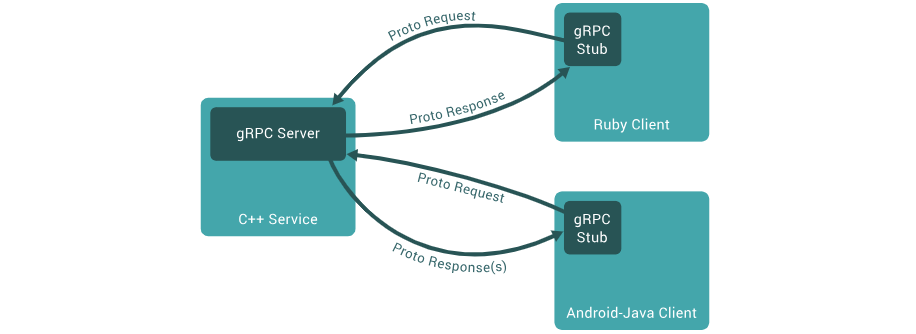
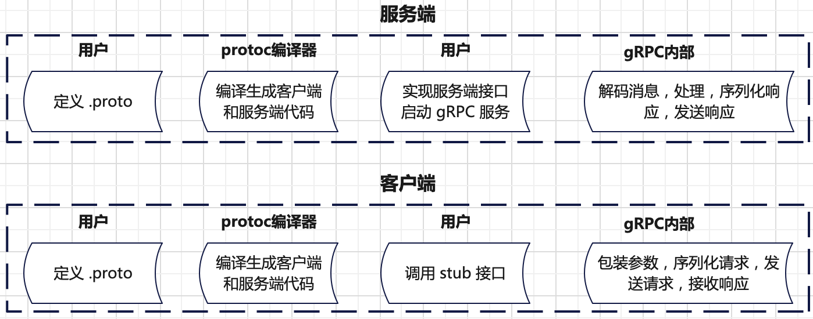

# 核心概念
在`gRPC`中，客户端可以调用不同机器部署的服务端提供的方法，就像本地调用一样方便。`gRPC`的工作原理可以总结如下：



`gRPC`是基于**服务定义**的思想。即通过`.proto`文件定义远端服务可以被调用的方法、参数及返回类型。
服务端实现定义的接口和运行`gRPC`服务以处理客户端请求。客户端有`stub`，其中提供了和服务端相同的方法以供调用。

`gRPC`客户端和服务端可以运行在不同平台，使用不同的语言实现（`gRPC`官方支持多种语言）。例如服务端使用`C++`实现，
客户端使用`Python`实现。

`gRPC`使用[`protobuf`序列化](./protocol.md)消息数据，具有体积小，传输效率高特点。定义好`.proto`文件后，使用`protoc`编译器生成客户端和服务端代码。



## 服务定义
一个服务定义的样例如下：
```proto
service HelloService {
  rpc SayHello (HelloRequest) returns (HelloResponse);
}

message HelloRequest {
  string greeting = 1;
}

message HelloResponse {
  string reply = 1;
}
```
`gRPC`提供了四种服务定义方法：
+ **单次请求-响应**：客户端发送一个单请求到服务端，然后收到服务端的一个响应，像正常的函数调用。
  ```proto
  rpc SayHello(HelloRequest) returns (HelloResponse);
  ```
+ **服务端流式`RPC`**：客户端发送一个单请求到服务端，然后收到服务端的流式响应，客户端读取流式响应直到读完数据。
  ```proto
  rpc LotsOfReplies(HelloRequest) returns (stream HelloResponse);
  ```
+ **客户端流式`RPC`**：客户端发送流式请求到服务端，请求发送完成后客户端等待服务端响应。
  ```proto
  rpc LotsOfGreetings(stream HelloRequest) returns (HelloResponse);
  ```
+ **双端流式`RPC`**：客户端发送流式请求到服务端，服务端返回流式响应。两边的流是独立的，也就是客户端和服务端自行决定读写方式。
例如服务端可以接收完全部客户端流式请求在响应，也可以一边接收流式请求，一边响应。
  ```proto
  rpc BidiHello(stream HelloRequest) returns (stream HelloResponse);
  ```

## RPC 生命周期
`RPC`生命周期描述的是**一次远程调用从客户端发起请求，到服务端处理完成并返回结果，再到资源清理的全过程**。下面以**单次请求-单次响应**服务定义为例说明：
```bash
+----------------+          HTTP/2          +----------------+
|                | -----------------------> |                |
|   Client Stub  |     (1) 发送请求         |     Server     |
|                |                          |   (Handler)    |
+----------------+                          +----------------+
       |                                             |
       |         (2) Protobuf 解码                   |
       | <-------------------------------------------|
       |                                             |
       |         (3) 执行业务逻辑                    |
       |                                             |
       |         (4) Protobuf 编码响应               |
       | <-------------------------------------------|
       |                                             |
+----------------+                          +----------------+
|                | <----------------------- |                |
|   Client Stub  |     (5) 接收响应         |     Server     |
|                |                          |   (Handler)    |
+----------------+                          +----------------+
       |                                            
       |         (6) 解析状态码和 Trailer             
       |
       |         (7) 清理资源并关闭通道              
```
**单请求响应**方式工作流程总结如下：
+ 客户端调用`stub`方法（即发起`RPC`调用），服务端就会收到通知，内容包括：客户端传来的`metadata`、调用的方法名，以及（如果设置了）调用的超时时间（`deadline`）。
`metadata`是指附加信息，例如请求头、认证`token`、`trace ID`。
+ 服务端可以立即返回自己的`initial metadata`（必须在响应之前发送），也可以等待接收到客户端的请求消息后再发送。
服务端的`initial metadata`类似响应头，内容可能包含编码方式、压缩格式。
+ 服务端拿到客户端的请求消息，它会执行所需的业务逻辑，生成并填充一个响应对象。服务端将响应（如果成功）返回给客户端，
同时附带状态信息（状态码和可选的状态消息），以及可选的`trailing metadata`（尾部元数据）。
+ 如果响应状态是`OK`（即没有出错），客户端就会收到响应消息，此次`RPC`调用至此在客户端完成。底层流关闭，`gRPC`框架自动释放资源。

而**服务端流式`RPC`**、**客户端流式`RPC`** 及 **双端流式`RPC`** 的生命周期流程基本和**单次请求响应**一样，除了请求或响应通过流式实现。

需要注意，`gRPC`中`channel`提供了和特定的`gRPC`服务端连接，`channel`被客户端`stub`使用。

# 实现原理
