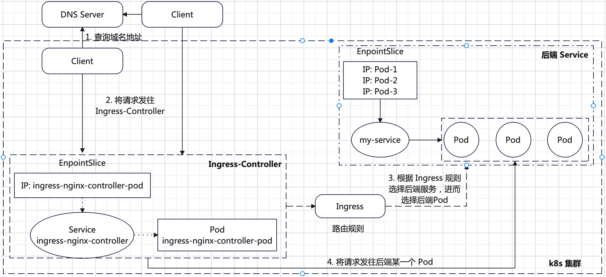
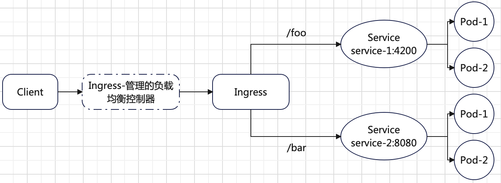
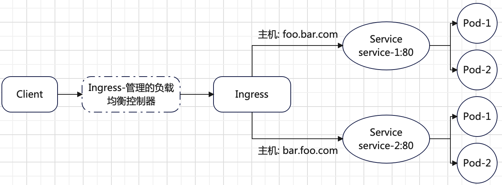

`Ingress`提供从集群外部到集群内服务的`HTTP`和`HTTPS`路由，**工作在七层**。
> 不像`LoadBalancer`类型的`Service`需要给每一个创建的`Service`提供一个负载均衡，
`Ingress`可以提供一个全局的负载均衡，然后通过访问的`URL`将请求转发不同的`Service`后端。

`Ingress`的简单示例如下：


**为了让`Ingress`资源工作，集群必须有一个正在运行的`Ingress`控制器，例如`ingress-nginx`**。

`Ingress`由**三部分**组成：
+ **`Ingress`资源**：一系列路由转发配置。
+ **`Ingress-Controller`**：`Ingress`资源必须使用某个`Ingress`控制器才能生效，`Ingress`控制器有很多，例如`ingress-nginx`等。
+ **`IngressClass`**：是`Ingress-Controller`的具体实例，后续`Ingress`资源定义需要指定某个`IngressClass`名字。

# Ingress 控制器部署
这里选择`ingress-nginx`控制器，部署命令如下：
```bash
# 下载 yaml 文件
$ wget https://raw.githubusercontent.com/kubernetes/ingress-nginx/controller-v1.12.0-beta.0/deploy/static/provider/cloud/deploy.yaml

# 将镜像源 registry.k8s.io 改为国内地址 k8s.m.daocloud.io

# 部署到集群
$ kubectl apply -f deploy.yaml
```
查看`ingress-nginx`命名空间下相关`Pod`的运行状态：
```bash
$ kubectl get pods -n ingress-nginx
NAME                                        READY   STATUS      RESTARTS   AGE
ingress-nginx-admission-create-vrshl        0/1     Completed   0          6m48s
ingress-nginx-admission-patch-qbxln         0/1     Completed   0          6m48s
ingress-nginx-controller-69894b5554-296nt   1/1     Running     0          6m48s
```
同时也会创建一个名为`nginx`的`IngressClass`：
```bash
$ kubectl get ingressclasses.networking.k8s.io
NAME    CONTROLLER             PARAMETERS   AGE
nginx   k8s.io/ingress-nginx   <none>       53m
```
查看在`ingress-nginx`命名空间下创建的名为`ingress-nginx-controller`的`Service`：
```bash
$ kubectl -n ingress-nginx get services ingress-nginx-controller
NAME                       TYPE           CLUSTER-IP      EXTERNAL-IP   PORT(S)                      AGE
ingress-nginx-controller   LoadBalancer   10.102.150.75   <pending>     80:32136/TCP,443:31258/TCP   19h
```
此`Service`类型是`LoadBalancer`，对外暴露的节点端口是`32136`（`http`）和`31258`（`https`）。因为实验是裸机环境，
需要将`Service`类型改为`NodePort`类型（也可以在部署之前`deploy.yaml`文件中更改），否则创建的`ingress`资源的`ADDRESS`为空：
```bash
# 将 type 由 LoadBalancer 改为 NodePort 保存退出
$ kubectl edit -n ingress-nginx services ingress-nginx-controller

# 查看 ingress-nginx-controller 状态
$ kubectl -n ingress-nginx get services ingress-nginx-controller
NAME                       TYPE       CLUSTER-IP      EXTERNAL-IP   PORT(S)                      AGE
ingress-nginx-controller   NodePort   10.102.150.75   <none>        80:32136/TCP,443:31258/TCP   20h
```
至此，将`ingress-nginx-controller`的类型改为`NodePort`类型的`Service`，对外暴露的节点端口是`32136`（`http`）和`31258`（`https`）。

# Ingress 定义
一个典型的`Ingress`资源定义如下：
```yml
# 文件名为 hostnames_ingress.yaml
apiVersion: networking.k8s.io/v1
kind: Ingress
metadata:
  name: hostnames-ingress
spec:
  # nginx 是部署 ingress-nginx-controller 自动创建的一个 ingressClass
  ingressClassName: nginx
  rules:
    # host 只能是域名的形式，不能是 IP
  - host: my.domain
    http:
      paths:
      - path: /
        pathType: Exact
        backend:
          service:
            # 后端服务名为 hostnames
            name: hostnames
            port:
              # 后端服务的端口
              number: 80
```
上述定义的`Ingress`资源含义是：所有`HTTP`请求`http://my.domain/`都会路由到后端名为`hostnames`的`Service`，且此`Service`暴露的端口是`80`。

**首先确保名为`hostnames`的`Service`已经部署**。将`hostnames_ingress.yaml`部署到集群：
```bash
$ kubectl apply -f hostnames_ingress.yaml

# 查看 ingress 状态
$ kubectl get ingress -n default
NAME                CLASS   HOSTS       ADDRESS         PORTS   AGE
hostnames-ingress   nginx   my.domain   10.102.150.75   80      18h

# ingress 的详细信息
$ kubectl describe ingress hostnames-ingress
Name:             hostnames-ingress
Labels:           <none>
Namespace:        default
Address:          10.102.150.75
Ingress Class:    nginx
Default backend:  <default>
Rules:
  Host        Path  Backends
  ----        ----  --------
  my.domain
              /   hostnames:80 (192.168.1.9:8080,192.168.1.8:8080,192.168.1.11:8080)
Annotations:  <none>
Events:
  Type    Reason  Age                From                      Message
  ----    ------  ----               ----                      -------
  Normal  Sync    63s (x2 over 92m)  nginx-ingress-controller  Scheduled for sync
```
可以看到，`Ingress`的核心是`Rules`规则，其中定义的`Host`是`my.domain`，转发规则`/`被转发到服务`hostnames:80`。`Ingress`的负载均衡地址是名为`ingress-nginx-controller`的`Service`的集群`IP`地址。

有两种方式可以通过访问创建的`Ingress`对象进而访问后端的`Pod`：
+ 如果是在集群内，可以直接通过将域名`my.domain`解析到名`ingress-nginx-controller`的`Service`集群`IP`地址，端口为`80`。
  ```bash
  $ curl --resolve my.domain:80:10.102.150.75 http://my.domain:80/
  hostnames-55f7dfb6db-lpfr2
  ```
+ 如果在集群外，可以直接通过将域名`my.domain`解析到某一个节点的`IP`地址，端口为`32136`（`http`）。
  ```bash
  $ curl --resolve my.domain:32136:10.211.55.9 http://my.domain:32136/
  hostnames-55f7dfb6db-dh2q9
  ```

因此可总结如下关于`Ingress`、`Ingress-Controller`、`IngressClass`及后端`Service`和`Pod`的网络请求关系：



**总结**：集群中运行的`Ingress-Controller`其实就是一个负载均衡服务，例如`nginx`。用户创建的`Ingress`资源，会被`ingress-nginx-controller`生成一份`nginx`的配置，
存放在`/etc/nginx/nginx.conf`中。然后使用该配置启动一个`nginx`服务。
+ 如果`Ingress`资源更新（包括创建新的`Ingress`或者删除旧的`Ingress`），则对应生成的`/etc/nginx/nginx.conf`配置也会更新。
+ 如果只是被代理的`Service`对象更新，则配置不用更新，`nginx`服务不需重新加载配置。
+ 可以通过`ConfigMap`定制`/etc/nginx/nginx.conf`配置，`ConfigMap`里面的字段会被合并到配置中。

**`Ingress-Nginx-Controller`提供的服务，其实就是一个可以根据`Ingress`资源和被代理后端`Service`变化来自动更新`Nginx`负载均衡器。**

# Ingress 实战详解
`Ingress`资源定义中的`rules`和`paths`是数组数据结构，可以配置多项。
## 简单扇出
一个扇出（`Fanout`）配置根据请求的`HTTP URI`将来自同一`IP`地址的流量路由到多个`Service`。样例示意图如下：



其实就是配置多个`path`路径。对应的`Ingress`定义如下：
```yml
apiVersion: networking.k8s.io/v1
kind: Ingress
metadata:
  name: simple-fanout-example
spec:
  rules:
  - host: foo.bar.com
    http:
      paths:
      - path: /foo
        pathType: Prefix
        backend:
          service:
            name: service1
            port:
              number: 4200
      - path: /bar
        pathType: Prefix
        backend:
          service:
            name: service2
            port:
              number: 8080
```

## 基于名称的虚拟主机服务
基于名称的虚拟主机支持将针对多个主机名的`HTTP`流量路由到同一`IP`地址上。样例示意图如下：



其实就是基于`host`头部字段来路由请求。对应的`Ingress`的定义如下：
```yml
apiVersion: networking.k8s.io/v1
kind: Ingress
metadata:
  name: name-virtual-host-ingress
spec:
  rules:
  - host: foo.bar.com
    http:
      paths:
      - pathType: Prefix
        path: "/"
        backend:
          service:
            name: service1
            port:
              number: 80
  - host: bar.foo.com
    http:
      paths:
      - pathType: Prefix
        path: "/"
        backend:
          service:
            name: service2
            port:
              number: 80
```
创建的`Ingress`资源没有在`rules`中定义主机`host`字段，则规则可以匹配指向`Ingress`控制器`IP`地址的所有网络流量，而无需基于名称的虚拟主机。
```yml
apiVersion: networking.k8s.io/v1
kind: Ingress
metadata:
  name: name-virtual-host-ingress-no-third-host
spec:
  rules:
  - host: first.bar.com
    http:
      paths:
      - pathType: Prefix
        path: "/"
        backend:
          service:
            name: service1
            port:
              number: 80
  - host: second.bar.com
    http:
      paths:
      - pathType: Prefix
        path: "/"
        backend:
          service:
            name: service2
            port:
              number: 80
  - http:
      paths:
      - pathType: Prefix
        path: "/"
        backend:
          service:
            name: service3
            port:
              number: 80
```
上面的`Ingress`对象会将请求`first.bar.com`的流量路由到`service1`，将请求`second.bar.com`的流量路由到`service2`，
而将所有其他流量路由到`service3`。

## 处理 TLS 流量
在客户端和`Ingress-Controller`之间使用`TLS`加密连接，但在`Ingress-Controller`和后端`Pod`之间可以是`HTTP`明文方式连接。

首先生成证书和私钥（有的话可跳过）：
```bash
$ mkdir tls & cd tls

$ openssl genrsa -out tls.key 2048

$ openssl req -new -x509 -key tls.key -out tls.cert -days 360 -subj /CN=my.domain

# 查看文件信息如下
$ tree
.
├── tls.cert
└── tls.key
```
基于上述生成的证书和私钥，创建一个`tls`类似的`Secret`对象：
```bash
$ kubectl create secret tls tls-secret-ingress --cert=tls.cert --key=tls.key
secret/tls-secret-ingress created

# 查看 Secret 对象
$ kubectl get secrets
NAME                 TYPE                             DATA   AGE
my-registry          kubernetes.io/dockerconfigjson   1      10d
tls-secret-ingress   kubernetes.io/tls                2      2s
```
更新`Ingress`资源对象，以支持`HTTPS`连接：
```yml
# 文件名 hostnames_ingress.yaml
apiVersion: networking.k8s.io/v1
kind: Ingress
metadata:
  name: hostnames-ingress
spec:
  # 和 TLS 配置相关的都在此属性下
  tls:
  - hosts:
    - my.domain  # 主机名和下面的保存一致，指定接收 TLS 连接的主机
    secretName: tls-secret-ingress
  # nginx 是部署 ingress-nginx-controller 自动创建的一个 ingressClass
  ingressClassName: nginx
  rules:
    # host 只能是域名的形式，不能是 IP
  - host: my.domain
    http:
      paths:
      - path: /
        pathType: Exact
        backend:
          service:
            # 后端服务名为 hostnames
            name: hostnames
            port:
              # 后端服务的端口
              number: 80
```
将上述`hostnames_ingress.yaml`资源对象部署到集群：
```bash
$ kubectl apply -f hostnames_ingress.yaml
ingress.networking.k8s.io/hostnames-ingress created

# 查看 ingress 对象
$ kubectl get ingress hostnames-ingress
NAME                CLASS   HOSTS       ADDRESS         PORTS     AGE
hostnames-ingress   nginx   my.domain   10.102.150.75   80, 443   65s
```
在集群内访问创建的`Ingress`（在集群外访问需要更改`IP`为节点`IP`，端口为`31258`）：
```bash
$ curl -v -k --resolve my.domain:443:10.102.150.75 https://my.domain/
* Added my.domain:443:10.102.150.75 to DNS cache
* Hostname my.domain was found in DNS cache
*   Trying 10.102.150.75:443...
* Connected to my.domain (10.102.150.75) port 443
* ALPN: curl offers h2,http/1.1
* TLSv1.3 (OUT), TLS handshake, Client hello (1):
* TLSv1.3 (IN), TLS handshake, Server hello (2):
* TLSv1.3 (IN), TLS handshake, Encrypted Extensions (8):
* TLSv1.3 (IN), TLS handshake, Certificate (11):
* TLSv1.3 (IN), TLS handshake, CERT verify (15):
* TLSv1.3 (IN), TLS handshake, Finished (20):
* TLSv1.3 (OUT), TLS change cipher, Change cipher spec (1):
* TLSv1.3 (OUT), TLS handshake, Finished (20):
* SSL connection using TLSv1.3 / TLS_AES_256_GCM_SHA384 / X25519 / RSASSA-PSS
* ALPN: server accepted h2
* Server certificate:
*  subject: CN=my.domain
*  start date: Oct 22 08:07:15 2024 GMT
*  expire date: Oct 17 08:07:15 2025 GMT
*  issuer: CN=my.domain
*  SSL certificate verify result: self-signed certificate (18), continuing anyway.
*   Certificate level 0: Public key type RSA (2048/112 Bits/secBits), signed using sha256WithRSAEncryption
* using HTTP/2
* [HTTP/2] [1] OPENED stream for https://my.domain/
* [HTTP/2] [1] [:method: GET]
* [HTTP/2] [1] [:scheme: https]
* [HTTP/2] [1] [:authority: my.domain]
* [HTTP/2] [1] [:path: /]
* [HTTP/2] [1] [user-agent: curl/8.5.0]
* [HTTP/2] [1] [accept: */*]
> GET / HTTP/2
> Host: my.domain
> User-Agent: curl/8.5.0
> Accept: */*
>
* TLSv1.3 (IN), TLS handshake, Newsession Ticket (4):
* TLSv1.3 (IN), TLS handshake, Newsession Ticket (4):
* old SSL session ID is stale, removing
< HTTP/2 200
< date: Tue, 22 Oct 2024 08:25:09 GMT
< content-type: text/plain; charset=utf-8
< content-length: 26
< strict-transport-security: max-age=31536000; includeSubDomains
<
* Connection #0 to host my.domain left intact
hostnames-55f7dfb6db-dh2q9
```
