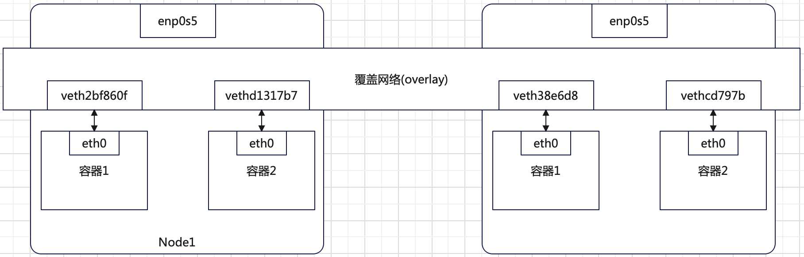

# 单机容器网络原理
每一个容器由于`network namespace`隔离，只能看见自己的*网络栈*。**网络栈**包含**网卡**、**回环设备**、**路由表**和`iptables`规则。

被隔离在不同`network namespace`下的容器如何相互通信？

为了理解上述问题，将容器看作主机，如果实现两台主机通信，最直接的办法是通过一根网线将两台主机连接起来。如果实现多台主机间互相通信，
将多台主机通过网线连接到一台交换机上。

**网桥（bridge）** 扮演着虚拟交换机的角色。网桥是一个工作在数据链路层的设备，根据`MAC`地址将数据包转发到网桥的不同的端口。
所以`docker`会默认在宿主机上创建一个`docker0`的网桥。连接相同网桥的容器可以互相通信。
```bash
$ ip addr show docker0
3: docker0: <NO-CARRIER,BROADCAST,MULTICAST,UP> mtu 1500 qdisc noqueue state DOWN group default
    link/ether 02:42:f8:3a:dd:6a brd ff:ff:ff:ff:ff:ff
    inet 172.17.0.1/16 brd 172.17.255.255 scope global docker0
       valid_lft forever preferred_lft forever
    inet6 fe80::42:f8ff:fe3a:dd6a/64 scope link
       valid_lft forever preferred_lft forever
```
将一个容器连接到一个网桥，例如`docker0`网桥，需要一个 **`Veth Pair`虚拟设备**。`Veth Pair`虚拟设备具有如下特点：
+ 被创建出来后，总是以两张虚拟网卡（`Veth Peer`）的形式成对出现。
+ 从其中一张网卡发出的数据包可以直接出现在对端的网卡上，即使这两张网卡在不同的`network namespace`中。

在宿主机上运行一个`busybox`容器：
```bash
$ sudo docker run --rm -itd --name busybox-1 busybox
```
查看容器的网络设备：
```bash
# 在宿主机上执行
$ sudo docker exec -it busybox-1 /bin/sh
# 在容器中执行
/ # ip addr
1: lo: <LOOPBACK,UP,LOWER_UP> mtu 65536 qdisc noqueue qlen 1000
    link/loopback 00:00:00:00:00:00 brd 00:00:00:00:00:00
    inet 127.0.0.1/8 scope host lo
       valid_lft forever preferred_lft forever
    inet6 ::1/128 scope host
       valid_lft forever preferred_lft forever
16: eth0@if17: <BROADCAST,MULTICAST,UP,LOWER_UP,M-DOWN> mtu 1500 qdisc noqueue
    link/ether 02:42:ac:11:00:02 brd ff:ff:ff:ff:ff:ff
    inet 172.17.0.2/16 brd 172.17.255.255 scope global eth0
       valid_lft forever preferred_lft forever
# 在容器中执行
/ # netstat -rn
Kernel IP routing table
Destination     Gateway         Genmask         Flags   MSS Window  irtt Iface
0.0.0.0         172.17.0.1      0.0.0.0         UG        0 0          0 eth0
172.17.0.0      0.0.0.0         255.255.0.0     U         0 0          0 eth0
```
容器`busybox-1`中有个`eth0@if17`的网卡，它是`Veth Pair`在容器中的一端。而`Veth Pair`的另一端在宿主机上，如下：
```bash
# 宿主机上执行
$ ip addr
...
3: docker0: <BROADCAST,MULTICAST,UP,LOWER_UP> mtu 1500 qdisc noqueue state UP group default
    link/ether 02:42:f8:3a:dd:6a brd ff:ff:ff:ff:ff:ff
    inet 172.17.0.1/16 brd 172.17.255.255 scope global docker0
       valid_lft forever preferred_lft forever
    inet6 fe80::42:f8ff:fe3a:dd6a/64 scope link
       valid_lft forever preferred_lft forever
...
17: veth2bf860f@if16: <BROADCAST,MULTICAST,UP,LOWER_UP> mtu 1500 qdisc noqueue master docker0 state UP group default
    link/ether 46:5d:12:96:d3:d5 brd ff:ff:ff:ff:ff:ff link-netnsid 2
    inet6 fe80::445d:12ff:fe96:d3d5/64 scope link
       valid_lft forever preferred_lft forever
# 宿主机上执行
$ brctl show
bridge name	bridge id		STP enabled	interfaces
...
docker0		8000.0242f83add6a	no		veth2bf860f
							    ...
```
其中宿主机上的`veth2bf860f@if6`虚拟网卡就是容器`busybox-1`中`eth0@if17`虚拟网卡的另一端。通过`brctl show`命令可知，
`veth2bf860f`虚拟网卡被插到`docker0`上。

此时在宿主机上在启动一个`busybox-2`容器：
```bash
$ sudo docker run --rm -itd --name busybox-2 busybox
```
通过`brctl show`可知，一个`vethd1317b7`虚拟网卡也被插到`docker0`上。
```bash
$ brctl show
bridge name	bridge id		STP enabled	interfaces
...
docker0		8000.0242f83add6a	no		veth2bf860f
							vethd1317b7
```
这时候在容器`busybox-1`里面可以`ping`通容器`busybox-2`地址，反之亦然。原理解释如下：
+ 在容器`busybox-1`里面访问`busybox-2`地址，例如`ping 172.17.0.3`。目的地址`172.17.0.3`会匹配`busybox-1`容器路由表的第二条规则，
此条路由规则的网关是`0.0.0.0`表示这是一条**直连规则**，也即直接通过`busybox-1`容器的网卡`eth0`走**二层网络**直发目的主机。
+ 通过**二层网络**到达`busybox-2`容器，需要目的地址`172.17.0.3`的`MAC`地址。所以`busybox-1`容器的网络协议栈会通过`eth0`网卡发送一个`ARP`广播，
以获取目的地址`172.17.0.3`的`MAC`地址。
+ 容器`busybox-1`中的`eth0`网卡是个`Veth Pair`设备的一端，一端在容器`busybox-1`的`network namespace`中，另一端在宿主机的`host namespace`中，
且被插在`docker0`网桥上，所以容器`busybox-1`发出的`APR`广播会到达`docker0`网桥，`docker0`网桥会扮演**二层交换机**角色，
把`ARP`广播转发到其他插在`docker0`网桥上的网卡。因此，容器`busybox-2`的网络协议栈收到此`APR`广播，将`172.17.0.3`对应的`MAC`地址回复给`busybox-1`容器。
+ 容器`busybox-1`拿到`172.17.0.3`的`MAC`地址后，可以开始通过容器的`eth0`网卡发送数据包。从容器`busybox-1`发出的数据包会直接到达`docker0`网桥，
`docker0`网桥扮演**二层交换机**角色，并根据目的`MAC`地址（`busybox-2`容器的`MAC`地址）在其`CAM`表（交换机通过`MAC`地址学习维护的端口和`MAC`地址对应表）查找对应端口为`vethd1317b7`，
然后将数据包发往该端口。
+ 端口`vethd1317b7`是容器`busybox-2`插在`docker0`网桥上的另一端网卡。数据包直接进入`busybox-2`容器网络接口`eth0`，进而进入`busybox-2`容器网络协议栈。

**总结**：**不同容器间通信通过`Veth Pair`虚拟设备+宿主机网桥方式实现**。

一张图说明容器间通信如下：
```bash
容器1 namespace       容器2 namespace
+-----------+         +--------------+
| busybox-1 |         |  busybox-2   |
|           |         |              |
|172.17.0.2 |         |  172.17.0.3  |
|   eth0    |         |      eth0    |
+-----------+         +--------------+
     |                       |
-----|-----------------------|--------------+  
+------------------------------------+      |
| veth2bf860f|          |vethd1317b7 |      |
|------------+          +------------|      |
|               docker0              |      |
|             172.17.0.1             |      | 宿主机 namespace
+------------------------------------+      | 
                                            |
            +------+                        | 
            |enp0s5|                        |
------------+------+------------------------+
```


# 跨主机容器网络原理
类似单机容器间通信方式（`Veth Pair`虚拟设备+宿主机网桥方式），对于跨主机容器间通信可以通过软件的方式创建一个整个集群**公用的网桥**，
然后把集群中所有的容器连到这个公共的网桥实现容器跨主机通信。

上面的思想用一张图总结如下：


上面说的`overlay`网络，可以由每个节点上**特殊网桥**组成。例如`Node1`上容器需要和`Node2`上容器通信，`Node1`上的**特殊网桥**收到数据包后，
可以发送到`Node2`上，`Node2`上**特殊网桥**收到数据包后可以正确交给`Node2`上的容器。

容器的跨主机通信经典解决方案是`flannel`方案。`flannel`方案的实现有三种模式：`UDP`模式，`VXLAN`模式和`HOST-GW`模式，
其中`UDP`模式效率差，已经被淘汰，这里不做介绍。`HOST-GW`是一个工作在三层（`IP`层）解决方案，这里也不做介绍。
## Flannel-vxlan原理
`VXLAN`（`virtual extensible LAN`，虚拟可拓展局域网），是`Linux`内核支持的网络虚拟化技术，数据包的封装和解封装都在内核态完成。

`VXLAN`的**设计思想**：在现有的三层网络（通过`IP`层通信）之上覆盖一层虚拟的，由内核`VXLAN`模块负责维护的二层网络（通过数据链路层，`MAC`地址通信），
使得这个`VXLAN`二层网络上的主机（包括容器）可以像在同一个局域网内通信。实际这些主机可能分布在不同的局域网内。

`VXLAN`的**实现方式**：`VXLAN`会在宿主机上设置一个特殊的网络设备作为隧道的两端，此设备是`VTEP`（`VXLAN tunnel end point`，虚拟隧道端点）。
宿主机上的`flannel.1`设备就是`VTEP`设备，既有`IP`地址，也有`MAC`地址。
```bash
$ ip addr show flannel.1
4: flannel.1: <BROADCAST,MULTICAST,UP,LOWER_UP> mtu 1450 qdisc noqueue state UNKNOWN group default
    link/ether 4a:dc:e3:5e:4c:6c brd ff:ff:ff:ff:ff:ff
    inet 192.168.0.0/32 scope global flannel.1
       valid_lft forever preferred_lft forever
    inet6 fe80::48dc:e3ff:fe5e:4c6c/64 scope link
       valid_lft forever preferred_lft forever
```
基于`VTEP`设备进行**隧道通信**的流程如下：


`VXLAN`的**工作流程**：`Node1`上容器`192.168.0.2`需要和`Node2`上容器`192.168.1.3`通信。
+ `Node1-container`发出的请求数据包的目的`IP`是`Node2`上`192.168.1.3`的容器`IP`。
+ 数据包会来到宿主机`Node1`的`cni0`网桥（类比`docker0`网桥，原理参考单宿主机容器通信）。
+ 根据`Node1`宿主机路由规则，数据包会交给`flannel.1`接口设备处理。`Node1`上的`flannel.1`设备可以看成隧道的入口。
在隧道入口的数据包称为**原始`IP`** 数据包。
  ```bash
  # Node1 上执行
  $ netstat -rn
  Kernel IP routing table
  Destination     Gateway         Genmask         Flags   MSS Window  irtt Iface
  0.0.0.0         10.211.55.1     0.0.0.0         UG        0 0          0 enp0s5
  10.211.55.0     0.0.0.0         255.255.255.0   U         0 0          0 enp0s5
  10.211.55.1     0.0.0.0         255.255.255.255 UH        0 0          0 enp0s5
  172.17.0.0      0.0.0.0         255.255.0.0     U         0 0          0 docker0
  192.168.0.0     0.0.0.0         255.255.255.0   U         0 0          0 cni0
  192.168.1.0     192.168.1.0     255.255.255.0   UG        0 0          0 flannel.1
  ```
  每一个节点，例如`Node2`，启动并加入`Flannel`网络时，`flanneld`进程会在**其他所有节点**，例如`Node1`，上添加如下的路由规则：
  ```bash
  # Node1 上执行
  $ netstat -rn
  Kernel IP routing table
  Destination     Gateway         Genmask         Flags   MSS Window  irtt Iface
  ...
  192.168.1.0     192.168.1.0     255.255.255.0   UG        0 0          0 flannel.1
  ```
  此条路由规则的含义是：凡是发往`192.168.1.0/24`目的地址的数据包，都需要经过`flannel.1`设备接口，且下一跳网关地址是`192.168.1.0`，
  而`192.168.1.0`正是`Node2`上`flannel.1`设备的地址。
+ `VXLAN`是一个**虚拟的二层网络**。为了将在隧道入口的**原始`IP`** 数据包发往正确的目的主机，需要找到隧道的出口，也即目的主机的`flannel.1`设备。
根据路由规则，知道了目的主机`flannel.1`设备的`IP`地址，例如`Node2`上`192.168.1.0`的`flannel.1`设备地址，还需要获取目的`flannel.1`设备的`MAC`地址。
知道了目的`flannel.1`的`IP`地址，可以根据`ARP`表获取目的`flannel.1`设备的`MAC`地址。
  ```bash
  # Node1 上执行
  $ ip neigh show dev flannel.1
  192.168.1.0 lladdr 22:81:95:8b:e0:97 PERMANENT
  ```
  每一个节点，例如`Node2`，启动并加入`Flannel`网络时，`flanneld`进程会在**其他所有节点**，例如`Node1`，上添加上述的`ARP`记录。
  此`ARP`记录含义是：`IP`地址是`192.168.1.0`的`MAC`地址是`22:81:95:8b:e0:97`。
+ 获取目的`flannel.1`设备的`MAC`地址后，`Linux`内核开始二层的封包，并得到一个二层数据帧。格式如下：
  ```bash
  +-----------------------------+------------------------+---+
  |destination dev flannel.1 MAC|destination container IP|...|
  +-----------------------------+------------------------+---+
          内部以太网报头                 内部IP报头
  ```
  上述封装得到的二层数据帧不能在宿主机的二层网络传输，所以称为**内部数据帧**。
+ `Linux`内核需要继续将得到的**内部数据帧**封装为一个可以在宿主机二层网络传输的普通数据帧。具体来说就是在**内部数据帧**前加一个特殊的`VXLAN`标志，
表示此数据帧是`VXLAN`使用的数据帧。然后将其封装为一个`UDP`包发出。此时需要目的宿主机的`IP`地址。
+ `flannel.1`设备扮演网桥的角色，在宿主机二层网络进行`UDP`包的转发。网桥设备进行转发的依据是`FDB`（`fowwarding database`）数据库。
`flanneld`进程负责维护`flannel.1`网桥对应的`FDB`数据库（新节点启动加入`flannel`网络，`flanneld`进程在**其他所有节点**添加`FDB`记录）。
  ```bash
  # 在 Node1 上，使用目的 flannel.1 设备的 MAC 地址 22:81:95:8b:e0:97
  $ bridge fdb show flannel.1 | grep 22:81:95:8b:e0:97
  22:81:95:8b:e0:97 dev flannel.1 dst 10.211.55.10 self permanent
  ```
  上述`FDB`记录的含义是：发往目的`flannel.1`设备（`MAC`地址是`22:81:95:8b:e0:97`）的二层数据帧应通过`flannel.1`设备发往`IP`地址是`10.211.55.10`的目的主机。
+ 开始宿主机网络的封包过程。因为`UDP`包是一个四层数据包，所以经过三层和二层网络传输的时候，会添加上目的`IP`和目的`MAC`。格式如下：
  ```bash
  +--------------------+-------------------+---+------------+-----------------------------+------------------------+---+
  |destination node mac|destination node IP|UDP|VXLAN header|destination dev flannel.1 MAC|destination container IP|...|
  +--------------------+-------------------+---+------------+-----------------------------+------------------------+---+
      外部以太网报头          外部IP报头                            内部以太网报头                 内部IP报头
  ```
  外部以太网报头，也即目的主机的`MAC`地址，是宿主机网络`ARP`表学习的内容，无需`flannel`网络维护。
+ 宿主机封装好的二层数据帧通过源宿主机（`Node1`）发出，最终到达目的宿主机（`Node2`）上。目的宿主机内核网络栈发现有`VXLAN header`标志，
内核会进行拆包，将包交给`flannel.1`设备，进而进入到容器`192.168.1.3`中。**`Node1`和`Node2`可以不在一个子网**。

**`VXLAN`模式通信流程总结**：
+ 准备工作：新节点，例如`Node2`，启动并加入`flannel`网络，`flanneld`进程负责在**其他所有节点**上添加如下信息。
  ```bash
  $ netstat -rn
  Kernel IP routing table
  Destination     Gateway         Genmask         Flags   MSS Window  irtt Iface
  ...
  192.168.1.0     192.168.1.0     255.255.255.0   UG        0 0          0 flannel.1
  ```
  此条路由规则的含义是：凡是发往`192.168.1.0/24`目的地址的数据包，都需要经过`flannel.1`设备接口，且下一跳网关地址是`192.168.1.0`，
  而`192.168.1.0`正是`Node2`上`flannel.1`设备的地址。
  ```bash
  $ ip neigh show dev flannel.1
  192.168.1.0 lladdr 22:81:95:8b:e0:97 PERMANENT
  ```
  此`ARP`记录含义是：`IP`地址是`192.168.1.0`的`MAC`地址是`22:81:95:8b:e0:97`。
  ```bash
  $ bridge fdb show flannel.1 | grep 22:81:95:8b:e0:97
  22:81:95:8b:e0:97 dev flannel.1 dst 10.211.55.10 self permanent
  ```
  上述`FDB`记录的含义是：发往目的`flannel.1`设备（`MAC`地址是`22:81:95:8b:e0:97`）的二层数据帧应通过`flannel.1`设备发往`IP`地址是`10.211.55.10`的目的主机。
+ 根据准备工作获取隧道出口地址，及隧道出口所在的宿主机`IP`。进而`Linux`内核开始封包，并进行传输。

**`VXLAN`模式原理总结**：
+ 容器都连接在`cni0`网桥上，网络插件负责在宿主机上创建一个特殊设备，例如`flannel.1`，`cni0`与`flannel.1`之间通过`IP`转发（路由表）进行协作。
+ 网络插件要通过某种方法将不同宿主机上的`flannel.1`设备连通，进而实现容器跨主机通信。

## CNI网络插件工作原理
部署`k8s`集群时候，需要安装`CNI`网络插件，可以在宿主机的`/opt/cni/bin/`下看到（`flannel`插件）：
```bash
$ ls /opt/cni/bin/
bandwidth  bridge  dhcp  dummy  firewall  flannel  host-device  host-local  ipvlan  LICENSE  loopback  macvlan  portmap  ptp  README.md  sbr  static  tap  tuning  vlan  vrf
```
各个可执行程序的含义可以参考`/opt/cni/bin/README.md`。

以`flannel`为例，实现一个`k8s`集群容器网络方案需要两部分工作：
+ 实现网络方案本身：实现`flanneld`进程的逻辑，创建和配置`flannel.1`设备，配置宿主机路由，配置`ARP`表和`FDB`表等。
+ 实现网络方案对应的`CNI`插件：主要工作是配置`Infa`容器的网络栈，并连接到`cni0`网桥上。
  > 创建`Pod`的第一步是先创建`Infa`容器，用来`hold`住`Pod`的`Network Namespace`。具体参考`Pod`的实现原理。

在宿主机上安装`flanneld`（网络方案本身）进程，其实是一个运行的`pod`：
```bash
$ kubectl get pods -n kube-flannel -o wide
NAME                    READY   STATUS    RESTARTS      AGE     IP             NODE                      NOMINATED NODE   READINESS GATES
kube-flannel-ds-cnvrb   1/1     Running   6 (17m ago)   7d18h   10.211.55.9    ylq-ubuntu-server         <none>           <none>
kube-flannel-ds-wkrgj   1/1     Running   6 (17m ago)   7d18h   10.211.55.10   ylq-ubuntu-server-node1   <none>           <none>
```
`flanneld`进程启动后，会对应在宿主机上生成`CNI`配置文件`/etc/cni/net.d/10-flannel.conflist`。此配置文件内容在`k8s`集群中会作为一个`configmap`，
告诉集群要使用`flannel`容器网络方案。
```bash
$ kubectl describe configmaps kube-flannel-cfg -n kube-flannel
Name:         kube-flannel-cfg
Namespace:    kube-flannel
Labels:       app=flannel
              k8s-app=flannel
              tier=node
Annotations:  <none>

Data
====
net-conf.json:
----
{
  "Network": "192.168.0.0/16",
  "EnableNFTables": false,
  "Backend": {
    "Type": "vxlan"
  }
}


cni-conf.json:
----
{
  "name": "cbr0",
  "cniVersion": "0.3.1",
  "plugins": [
    {
      "type": "flannel",
      "delegate": {
        "hairpinMode": true,
        "isDefaultGateway": true
      }
    },
    {
      "type": "portmap",
      "capabilities": {
        "portMappings": true
      }
    }
  ]
}


BinaryData
====

Events:  <none>
```
容器运行时（`CRI`）加载上述`CNI`配置，`flannel`和`portmap`插件会被依次调用以完成**配置容器网络**和**配置端口映射**操作。

`CNI`插件工作原理如下：
+ `kubelet`组件需要创建一个`pod`时，首先容器运行时接口（`CRI`）创建一个`Infa`容器。然后`CRI`为`CNI`插件准备参数，最后调用`CNI`插件为`Infa`容器配置网络。
+ 为`Infa`容器配置网络调用的`CNI`插件是`/opt/cni/bin/flannel`插件，该插件需要的参数有两部分。
  + 一部分是**环境变量**：
    + `CNI_COMMAND`：取值是`ADD`或`DEL`。`ADD`和`DEL`两个操作是`CNI`插件仅需实现的两个方法。`ADD`表示把容器添加到`CNI`网络中，
    `DEL`表示从`CNI`网络移除容器。对于**网桥类型的`CNI`插件**，例如`flannel`的`VXLAN`模式，这两个操作意味着以`Veth Pair`方式插入`CNI`网桥`cni0`，
    或者从网桥拔掉。
    + `CNI_IFNAME`：对于`ADD`操作需要此环境变量值。取值为容器中网卡的名字，例如`eth0`。
    + `CNI_NETNS`：对于`ADD`操作需要此环境变量值。取值为`Infa`容器的`Network Namespace`文件路径，取值为`/proc/<容器进程PID>/net/`。
    + `CNI_CONTAINERID`：对于`ADD`操作需要此环境变量。取值为`Infa`容器的`ID`。
    + `CNI_ARGS`：用户自定义参数，用于传递给`CNI`插件。
  + 另一部分是从`CNI`配置文件加载默认配置。注意在`flannel`插件的配置中有个`delegate`字段：
    ```json
    {
      ...
      "plugins": [
        {
          "type": "flannel",
          "delegate": {
            "hairpinMode": true,
            "isDefaultGateway": true
          }
        },
      ...
      ]
    }
    ```
    `delegate`含义是：调用`flannel`插件实际是**委托调用**内部的`CNI bridge`插件。`flannel`插件要做的工作是对加载的默认`CNI`配置**补充**，
    例如对`delegate`的完整补充如下：
    ```json
    {
      "cniVersion": "0.3.1",
      "hairpinMode": true,
      "ipMasq": false,
      "ipam": {
        "ranges": [
          [
            {
              "subnet": "192.168.0.0/24"
            }
          ]
        ],
        "routes": [
          {
            "dst": "192.168.0.0/16"
          }
        ],
        "type": "host-local"
      },
      "isDefaultGateway": true,
      "isGateway": true,
      "mtu": 1450,
      "name": "cbr0",
      "type": "bridge"
    }
    ```
    补充后的`delegate`字段完整信息会以`json`的格式保存在`/var/lib/cni/flannel/`下，给后续删除操作`DEL`使用。
    其中`ipam`字段中的`subnet`信息通过读取宿主机上`flannel`生成的配置文件：
    ```bash
    $ cat /run/flannel/subnet.env
    FLANNEL_NETWORK=192.168.0.0/16
    FLANNEL_SUBNET=192.168.0.1/24
    FLANNEL_MTU=1450
    FLANNEL_IPMASQ=true
    ```
+ 将上一步准备的环境变量参数及补充后的`CNI`配置参数传递给委托的`CNI bridge`插件。开始将`Infa`容器加入`CNI`网络中。
  + `CNI bridge`插件首先检查宿主机上的`CNI`网桥是否存在，不存在就创建它。类似在宿主机上执行：
    ```bash
    # 在宿主机上执行
    ip link add cni0 type bridge
    ip link set cni0 up
    ```
  + `CNI bridge`插件通过`Infa`容器的`Network Namespace`文件进入`Infa`容器的`Network Namespace`中。创建一对`Veth Pair`设备，
  并把`Veth Pair`的一端移动到宿主机上的`Network Namespace`中。类似执行如下命令：
    ```bash
    # 在容器中执行
    ip link add eth0 type veth peer name veth17f9e044
    ip link set eth0 up
    # 将 Veth Pair 的另一端 veth17f9e044 放到宿主机的 Network Namespace
    ip link set veth17f9e044 netns $HOST_NS
    # 进入宿主机的 Network Namespace 启动 veth17f9e044 设备
    ip netns exec $HOST_NS ip link set veth17f9e044 up
    ```
  + `CNI bridge`插件将上一步的`veth17f9e044`设备连接到`CNI`网桥上。类似在宿主机上执行：
    ```bash
    # 在宿主机上执行
    ip link set veth17f9e044 master cni0
    ```
  + `CNI bridge`插件为`veth17f9e044`设备设置`hairpinMode`模式（发夹模式）。
    > 默认情况下，网桥设备不允许一个数据包从一个端口进来，然后在从该端口发出。但是可以设置`hairpinMode`模式从而取消这个限制。
    >
    > 开启`hairpinMode`模式的主要应用场景是：容器需要通过`NAT`方式自己访问自己的场景。在集群中`pod`可以通过`service`访问自己。

  + `CNI bridge`插件接下来调用`CNI ipam`插件。从`ipam.subnet`字段规定的网段为`Infa`容器分配一个可用的`IP`地址。
  `CNI bridge`插件会将这个`IP`地址添加到`Infa`容器的`eth0`网卡，同时给`Infa`容器设置默认路由。类似在容器中执行：
    ```bash
    # 在容器中执行
    ip addr add 192.168.0.2/24 dev eth0
    ip route add default via 192.168.0.1 dev eth0
    ```
  + `CNI bridge`插件为`CNI`网桥`cni0`添加`IP`地址。类似在宿主机上执行：
    ```bash
    # 在宿主机上执行
    ip addr add 192.168.0.1/24 dev cni0
    ```
对于非网桥类型的`CNI`的原理和上述介绍有区别，例如`flannel`的`host-gw`模式、`calico`方案等。
