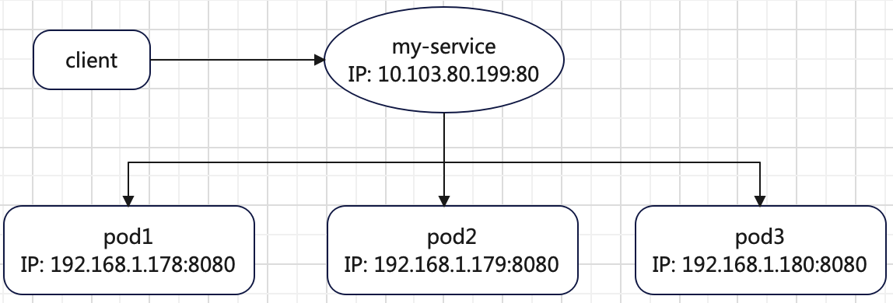
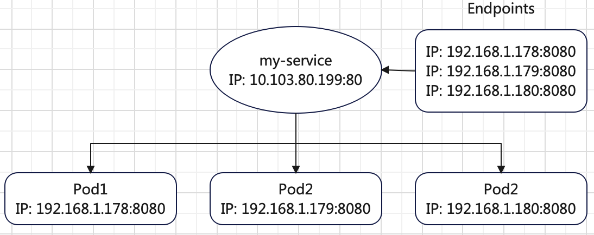
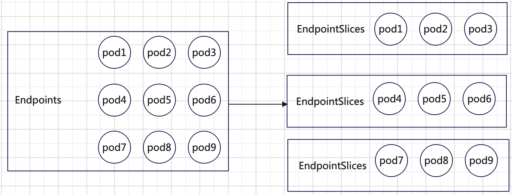
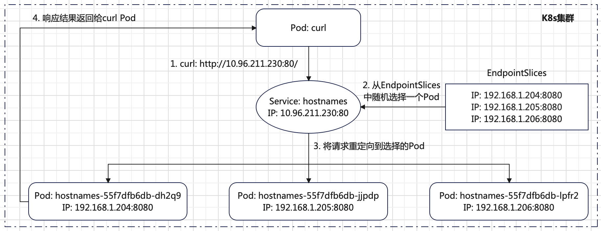
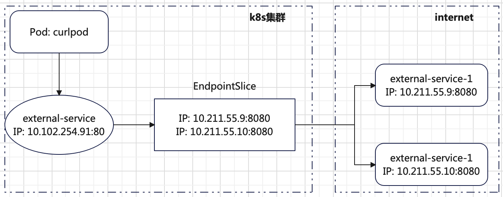
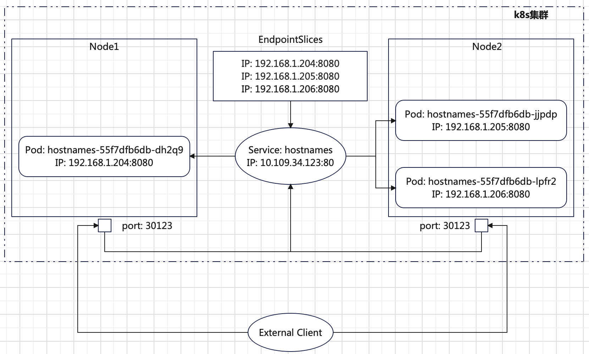
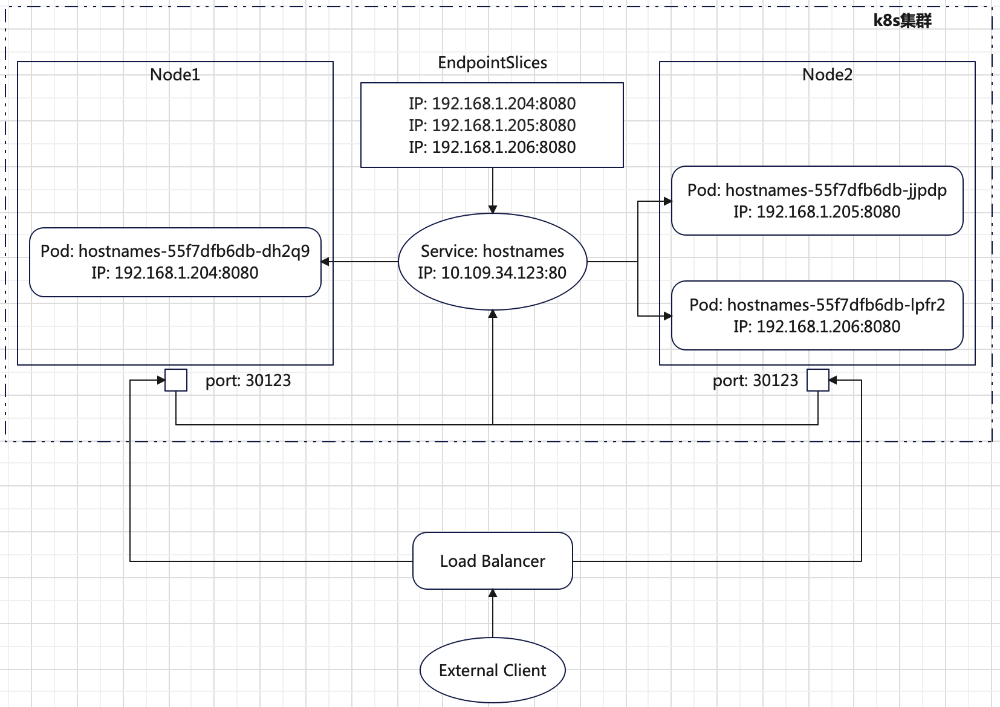
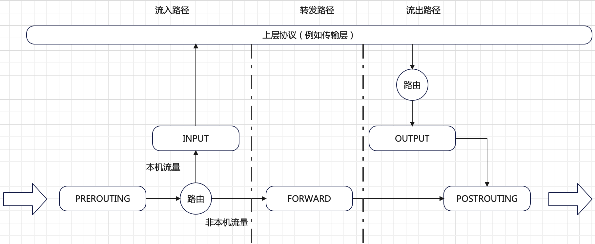

`Service`是一种抽象，用于将运行在一个或者一组`pod`上的应用程序公开为网络服务方法。`Service`提供了**固定的`IP`和端口号**，
使得客户端（请求方）无需关注提供服务的`pod`变化。
+ `pod`是临时资源，可以随时创建和销毁，`pod`的`IP`是变化的。
+ 提供相同服务的一组`pod`之间有负载均衡需求。

`Service`和`pod`之间的依赖大体关系如下：



# Service 基础概念
## Endpoints
`Service`是一种抽象，任何到达`Service`的请求都会被转发到属于该`Service`背后的某`Pod`中的应用。`Service`不和具体的`Pod`直接关联，
在`Service`和`Pod`之间有一个`Endpoints`对象。**`Endpoints` 对象**是一个列表，定义了一组`Pod`的`IP`和端口。
````bash
$ kubectl get endpoints hostnames
NAME        ENDPOINTS                                                  AGE
hostnames   192.168.1.187:8080,192.168.1.188:8080,192.168.1.189:8080   13m
``````
`Service`、`Pod`和`Endpoints`三者之间的关系总结如下：



当一个客户端请求`Service`，服务代理从`Endpoints`中选择一个`IP`和端口的`Pod`，并将请求重映射到选择的`Pod`。
当`Pod`发生变化，比如添加或者删除或者不能通过就绪探针检测，`k8s`会自动更新对应的`Endpoints`对象。

## EndpointSlices
当某`Service`存在很多后端`Pod`，并且该工作负载频繁扩缩或上线更新时，
对该`Service`的单个`Endpoints`对象的每次更新都意味着（在控制平面内以及在节点（`kube-proxy`）和`API`服务器之间）`K8s`集群组件之间会出现大量流量。 
这种额外的流量在`CPU`使用方面也有开销。

出于性能方面的考虑，`k8s`会限制单个`Endpoints`对象中可以容纳的`Pod`数量。当一个`Service`拥有`1000`个以上`Pod`时，
`k8s`会截断`Endpoints`对象中的数据，选择最多`1000`个可能的`Pod`存储到`Endpoints`对象中，
并在`Endpoints`上设置注解`endpoints.kubernetes.io/over-capacity: truncated`。如果后端`Pod`的数量降至`1000`以下，
控制平面也会移除该注解。请求流量仍会被发送到后端，但任何依赖`Endpoints`的负载均衡机制最多只能将流量发送到`1000`个可用的`Pod`。

**`EndpointSlices`是`k8s`用于扩缩`Service`以处理大量后端`Pod`的机制，还允许集群高效更新其健康后端的列表**。
> 使用`EndpointSlices`时，添加或移除单个`Pod`对于正监视变更的客户端会触发相同数量的更新，但这些更新消息的大小在大规模场景下要小得多。

`EndpointSlices`和`Endpoints`间的关系如下：



如图所示，假如一个`Service`后端有`9`个`Pod`，如果每个`EndpointSlices`被配置为最多有`3`个`Pod`的`Endpoints`切片，
则`k8s`会创建`3`个不同的`EndpointSlices`对象。默认情况下，`EndpointSlices`最多存储`100`个`Pod`，但可以通过`kube-controller-manager`组件的`--max-endpoints-per-slice`参数指定。

从`1.19`版本开始，`EndpointSlices`功能默认打开，`k8s`会自动为设置了选择算符的`Service`创建`EndpointSlice`。
这些`EndpointSlice`将包含对与`Service`选择算符匹配的所有`Pod`的引用。
```bash
$ kubectl get endpointslices.discovery.k8s.io hostnames-n74bs
NAME              ADDRESSTYPE   PORTS   ENDPOINTS                                   AGE
hostnames-n74bs   IPv4          8080    192.168.1.188,192.168.1.187,192.168.1.189   4h37m
````
上述`hostnames-n74bs`的`EndpointSlices`是创建名为`hostnames`的`Service`时，`k8s`自动创建的。

## Service 定义
一个典型的`Service`定义如下：
```yml
# 文件名：hostnames_service.yaml
apiVersion: v1
kind: Service
metadata:
  name: hostnames
spec:
  selector:
    app: hostnames
  ports:
    - name: http
      protocol: TCP
      port: 80
      targetPort: 8080
```
主要字段的含义如下：
+ **`.spec.selector`**：将`Service`流量路由到具有与此`selector`匹配的标签键值对的`Pod`。例如上述创建的名为`hostnames`的`Service`只会代理具有标签`app=hostnames`的`Pod`。
+ **`.spec.ports.port`**：`Service`公开的端口。上述创建的`hostnames`服务公开的端口为`80`。
+ **`.spec.ports.targetPort`**：此`Service`代理`Pod`的端口号或者名称。
+ **`.spec.ports.protocol`**：`Service`端口的`IP`协议。
+ **`.spec.ports.name`**：`Service`端口的名称，在此`Service`定义的`spec`下必须是唯一的。这一字段值必须与`EndpointPort`中的`name`字段相同。

上述定义样例将创建一个名为`hostnames`的，服务类型默认为`ClusterIP`的`Service`。此`Service`代理指向所有标签包含`app=hostnames`的`Pod`。
且此`Service`的`80`端口代理`Pod`的`8080`端口。

上述定义的`Service`代理的应用`Deployment`定义如下：
```yml
# 文件名：hostnames_deployment.yaml
apiVersion: apps/v1
kind: Deployment
metadata:
  name: hostnames
spec:
  replicas: 7
  selector:
    matchLabels:
      app: hostnames
  template:
    metadata:
      labels:
        app: hostnames
    spec:
      containers:
      - name: hostnames
        image: my.registry.io/serve_hostname:0.0.1
        ports:
        - containerPort: 8080
          protocol: TCP
      imagePullSecrets:
        - name: my-registry
```
该应用提供的服务是每次访问`Pod`的`8080`端口，返回此`Pod`的`hostname`。将定义的`Deployment`和`Service`部署到集群中：
```bash
$ kubectl apply -f hostnames_deployment.yaml
$ kubectl apply -f hostnames_service.yaml
```
查看部署的`Pod`和`Service`以及`Endpoints`和`EndpointSlices`状态信息：
```bash
# 查看 Pod 状态
$ kubectl get pods -n default
NAME                         READY   STATUS    RESTARTS      AGE
hostnames-55f7dfb6db-59twg   1/1     Running   1 (63m ago)   24h
hostnames-55f7dfb6db-78wwn   1/1     Running   1 (63m ago)   24h
hostnames-55f7dfb6db-8skr8   1/1     Running   0             9s
hostnames-55f7dfb6db-kt24n   1/1     Running   0             9s
hostnames-55f7dfb6db-nc7rm   1/1     Running   0             9s
hostnames-55f7dfb6db-qgwgl   1/1     Running   0             9s
hostnames-55f7dfb6db-xkhgf   1/1     Running   1 (63m ago)   24h

# 查看 EndpointSlices 状态
$ kubectl get endpointslices.discovery.k8s.io -n default
NAME              ADDRESSTYPE   PORTS   ENDPOINTS                                               AGE
hostnames-4rbll   IPv4          8080    192.168.1.199,192.168.1.201                             3m55s
hostnames-n74bs   IPv4          8080    192.168.1.192,192.168.1.194,192.168.1.195 + 2 more...   24h

# 查看 Endpoints 状态
$ kubectl get endpoints hostnames
NAME        ENDPOINTS                                                              AGE
hostnames   192.168.1.192:8080,192.168.1.194:8080,192.168.1.195:8080 + 4 more...   24h

# 查看 service 状态
$ kubectl get services hostnames
NAME        TYPE        CLUSTER-IP      EXTERNAL-IP   PORT(S)   AGE
hostnames   ClusterIP   10.96.211.230   <none>        80/TCP    10s
```
`kube-controller-manager`组件`Pod`的启动参数已经添加`--max-endpoints-per-slice=5`。因为在`hostnames_deployment.yaml`中定义副本个数为`7`，
所以`k8s`集群创建了两个`EndpointSlices`资源，分别是`hostnames-n74bs`和`hostnames-4rbll`。
> 发现`EndpointSlices`和`Endpoints`两个资源同时存在，主要目录是兼容考虑，因为老版本的`k8s`只有`Endpoints`资源，
后续可能只会存在`EndpointSlices`。

同时集群也自动给创建的名为`hostnames`的`Service`分配了集群`IP`地址`10.96.211.230`，端口号`80`（因为定义的`Service`类型默认是`ClusterIP`模式）。
因为分配的是个集群`IP`地址，因此只能在集群内部访问此`Service`，有以下两种方式访问：
+ 在集群的某个节点上访问此`Service`。
+ 在`Pod`内部访问此`Service`。

下面实验下在`Pod`内部访问`Service`（`Pod`副本已改为`3`个）：
```bash
# 运行一个带 curl 命令的 Pod
$ kubectl run curlpod --image=curlimages/curl --tty -i --rm -- sh
# 在 Pod 中多次执行 curl 命令请求 Service
~ $ curl http://10.96.211.230:80/
hostnames-55f7dfb6db-jjpdp
~ $ curl http://10.96.211.230:80/
hostnames-55f7dfb6db-lpfr2
~ $ curl http://10.96.211.230:80/
hostnames-55f7dfb6db-dh2q9
```
多次请求服务，返回不同不同`Pod`的`hostname`，说明`Service`提供了负载均衡能力。上述`curl`命令执行流程如下：



# Service 实践详解
## 会话亲和性
默认情况下`Service`提供的负载均衡（其实是`kube-proxy`实现，后面原理部分介绍）会"路由"一个请求到随机一个后端`Pod`。
**在某些场景下，需要将来自同一个客户端`IP`的请求路由到同一个`Pod`上**。可以通过设置`Service`属性`sessionAffinity`实现：
```yml
apiVersion: v1
kind: Service
metadata:
  name: hostnames
spec:
  sessionAffinity: ClientIP
  ...
```
`sessionAffinity`的取值只有`ClientIP`和`None`两种，其中`Node`是默认值：
+ `None`：根据负载均衡算法，随机选择一个后端`Pod`。
+ `ClientIP`：将来自同一个客户端`IP`的请求路由到同一个`Pod`上。

查看`Service`的`sessionAffinity`配置是否生效：
```bash
$ kubectl get services hostnames -o yaml | grep sessionAffinity
...
  sessionAffinity: ClientIP
...
```
在两个节点`10.211.55.9`和`10.211.55.10`上分别请求`Service`：
```bash
# 在 10.211.55.9 节点上执行 3 次
$ curl http://10.96.211.230:80/
hostnames-55f7dfb6db-lpfr2
$ curl http://10.96.211.230:80/
hostnames-55f7dfb6db-lpfr2
$ curl http://10.96.211.230:80/
hostnames-55f7dfb6db-lpfr2

# 在 10.211.55.10 节点上执行 3 次
$ curl http://10.96.211.230:80/
hostnames-55f7dfb6db-jjpdp
$ curl http://10.96.211.230:80/
hostnames-55f7dfb6db-jjpdp
$ curl http://10.96.211.230:80/
hostnames-55f7dfb6db-jjpdp
```
每个节点上多次请求`Service`都路由到相同的`Pod`。
> `Service`是工作在四层（`TCP`或`UDP`），因此会话亲和性不能基于`cookies`，因为`cookies`工作在七层。

## 多端口配置
一个`Service`可以同时公开多个端口，此时每个端口必须具有唯一的名字。例如，如果后端`Pod`监听两个端口，`http`协议监听`8080`端口，
`https`协议监听`8443`端口，此时将服务的`80`端口映射`Pod`的`8080`端口，服务的`443`端口映射`Pod`的`8443`端口，如下配置所示：
```yml
apiVersion: v1
kind: Service
metadata:
  name: my-service
spec:
  selector:
    app.kubernetes.io/name: MyApp
  ports:
    - name: http
      protocol: TCP
      port: 80
      targetPort: 8080
    - name: https
      protocol: TCP
      port: 443
      targetPort: 8443
```

## 使用具名 Pod 端口
`Pod`中的端口定义可以指定名字，可以在`Service`的`targetPort`属性中引用这些名字。使用样例如下：
```yml
apiVersion: v1
kind: Pod
metadata:
  name: nginx
  labels:
    app.kubernetes.io/name: proxy
spec:
  containers:
  - name: nginx
    image: nginx:stable
    ports:
      - containerPort: 80
        # Pod 中端口指定名字 http-web-svc
        name: http-web-svc

---
apiVersion: v1
kind: Service
metadata:
  name: nginx-service
spec:
  selector:
    app.kubernetes.io/name: proxy
  ports:
  - name: name-of-service-port
    protocol: TCP
    port: 80
    # 引用 Pod 中端口的名字
    targetPort: http-web-svc
```
使用具名`Pod`端口的好处是：后续更改`Pod`的端口号，而不需要更改`Service`的配置，只要名字不变。

## 服务发现
**客户端`Pod`如何找到`Service`的`IP`和端口？**`k8s`提供了两种方式用于服务发现：**环境变量**和 **`DNS`**。

### 环境变量
当`Pod`被创建的时候，`k8s`会初始化**一系列指向当前存在所有`Service`的环境变量**。
+ 如果`Pod`在`Service`**之后**被创建，则`Pod`中的进程**可以**通过环境变量获取`Service`的`IP`和端口号。
+ 如果`Pod`在`Service`**之前**被创建，则`Pod`中的进程**不可以**通过环境变量获取`Service`的`IP`和端口号。

在`Pod`中查看环境变量如下：
```bash
$ kubectl exec hostnames-55f7dfb6db-jjpdp -- env
PATH=/usr/local/bin:/usr/local/sbin:/usr/local/bin:/usr/sbin:/usr/bin:/sbin:/bin
HOSTNAME=hostnames-55f7dfb6db-jjpdp
...
KUBERNETES_SERVICE_PORT=443
HOSTNAMES_PORT_80_TCP_PROTO=tcp
KUBERNETES_SERVICE_HOST=10.96.0.1
KUBERNETES_PORT=tcp://10.96.0.1:443
KUBERNETES_PORT_443_TCP=tcp://10.96.0.1:443
HOSTNAMES_PORT=tcp://10.96.211.230:80
HOSTNAMES_PORT_80_TCP=tcp://10.96.211.230:80
KUBERNETES_SERVICE_PORT_HTTPS=443
HOSTNAMES_SERVICE_PORT_HTTP=80
HOSTNAMES_PORT_80_TCP_PORT=80
KUBERNETES_PORT_443_TCP_PROTO=tcp
KUBERNETES_PORT_443_TCP_PORT=443
KUBERNETES_PORT_443_TCP_ADDR=10.96.0.1
HOSTNAMES_SERVICE_HOST=10.96.211.230
HOSTNAMES_SERVICE_PORT=80
HOSTNAMES_PORT_80_TCP_ADDR=10.96.211.230
HOME=/root

# 查看集群当前时刻 default 命名空间的 Service
$ kubectl get services -n default
NAME         TYPE        CLUSTER-IP      EXTERNAL-IP   PORT(S)   AGE
hostnames    ClusterIP   10.96.211.230   <none>        80/TCP    3h10m
kubernetes   ClusterIP   10.96.0.1       <none>        443/TCP   28d
```
当前集群在`default`命名空间有两个`Service`，分别是`hostnames`和`kubernetes`。在`Pod`中，每一个`Service`相关的环境变量都存在。
客户端`Pod`可以通过环境变量查找对应`Service`的`IP`和端口。

但环境变量的缺陷显而易见：`Pod`必须在`Service`之后创建。

### DNS
在`kube-system`命名空间中存在`coredns`的`Pod`，用于提供`DNS`服务。同时也会存在`kube-dns`的`Service`用以代理`coredns`后端`Pod`。
```bash
# 查看 coredns Pod
$ kubectl get pods -n kube-system -o wide
NAME                                        READY   STATUS    RESTARTS         AGE     IP             NODE                      NOMINATED NODE   READINESS GATES
coredns-855c4dd65d-7j98d                    1/1     Running   14 (6h57m ago)   28d     192.168.0.31   ylq-ubuntu-server         <none>           <none>
coredns-855c4dd65d-cf8kd                    1/1     Running   14 (6h57m ago)   28d     192.168.0.30   ylq-ubuntu-server         <none>           <none>
etcd-ylq-ubuntu-server                      1/1     Running   14 (22h ago)     28d     10.211.55.9    ylq-ubuntu-server         <none>           <none>
kube-apiserver-ylq-ubuntu-server            1/1     Running   14 (6h57m ago)   28d     10.211.55.9    ylq-ubuntu-server         <none>           <none>
kube-controller-manager-ylq-ubuntu-server   1/1     Running   0                5h56m   10.211.55.9    ylq-ubuntu-server         <none>           <none>
kube-proxy-48595                            1/1     Running   14 (22h ago)     28d     10.211.55.9    ylq-ubuntu-server         <none>           <none>
kube-proxy-ttgq9                            1/1     Running   14 (6h56m ago)   28d     10.211.55.10   ylq-ubuntu-server-node1   <none>           <none>
kube-scheduler-ylq-ubuntu-server            1/1     Running   25 (5h ago)      28d     10.211.55.9    ylq-ubuntu-server         <none>           <none>

# 查看 kube-dns Service
$ kubectl get services -n kube-system kube-dns
NAME       TYPE        CLUSTER-IP   EXTERNAL-IP   PORT(S)                  AGE
kube-dns   ClusterIP   10.96.0.10   <none>        53/UDP,53/TCP,9153/TCP   28d
```
集群中运行的其他`Pod`被自动配置使用此`DNS`服务，通过修改每个`Pod`的`/etc/resolv.conf`文件实现。
```bash
# 查看 Pod 中的 /etc/resolv.conf 文件
$ kubectl exec hostnames-55f7dfb6db-jjpdp -- cat /etc/resolv.conf
search default.svc.cluster.local svc.cluster.local cluster.local localdomain
nameserver 10.96.0.10
options ndots:5
```
可以看到每个`Pod`的`DNS`服务器地址配置为`kube-dns`服务的`IP`地址`10.96.0.10`。
> `Pod`可以通过`dnsPolicy`参数配置使用哪个`DNS`服务器。

**每一个`Service`在集群内的`DNS`都有一项记录，可以通过`FQDN`名字访问**。`FQDN`规则如下：
```bash
<service-name>.<namespace>.svc.cluster.local
```
例如在`default`命名空间下的`hostnames`的`Service`可以通过`hostnames.default.svc.cluster.local`域名进行访问：
```bash
# dnsutils Pod 支持 nslookup 程序
$ kubectl run dnsutils --image=tutum/dnsutils -- sleep infinity

# 在 Pod 内执行
$ kubectl exec dnsutils -- nslookup hostnames.default.svc.cluster.local
Server:		10.96.0.10
Address:	10.96.0.10#53

Name:	hostnames.default.svc.cluster.local
Address: 10.96.211.230
```
可以看到通过`FQDN`可以解析出`hostnames`的`IP`地址`10.96.211.230`。

新创建一个名为`my-service`的`Service`，可知集群中已经存在的`Pod`内没有`my-service`相关的环境变量，但通过`DNS`可以依旧查询其`IP`：
```bash
# 创建 my-service
$ kubectl apply -f my_service.yaml
service/my-service created

# 查询 my-service 的 IP
$ kubectl exec dnsutils -- nslookup my-service.default.svc.cluster.local
Server:		10.96.0.10
Address:	10.96.0.10#53

Name:	my-service.default.svc.cluster.local
Address: 10.105.245.66

# 查询 default 下所有 Service
$ kubectl get services
NAME         TYPE        CLUSTER-IP      EXTERNAL-IP   PORT(S)   AGE
hostnames    ClusterIP   10.96.211.230   <none>        80/TCP    3h55m
kubernetes   ClusterIP   10.96.0.1       <none>        443/TCP   28d
my-service   ClusterIP   10.105.245.66   <none>        80/TCP    24s
```
需要注意：客户端依然需要获取`Service`的端口号，可以通过之前介绍的环境变量或者使用标准端口。

## 访问集群外服务
**集群内的客户端`Pod`如何访问集群外的服务？** 通过利用`Service`提供的负载均衡和服务发现，集群内的客户端`Pod`可以像访问集群内的服务一样访问集群外的服务。

通过手动创建一个不带`pod selector`的`Service`，`k8s`不会创建对应的`EndpointSlice`资源。这时候在手动创建一个`EndpointSlice`资源并绑定到之前创建的`Service`对象。
创建一个不带`pod selector`的`Service`如下：
```yml
# 文件名为 external_service.yaml
apiVersion: v1
kind: Service
metadata:
  name: external-service
spec:
  ports:
    - name: http
      protocol: TCP
      port: 80
      targetPort: 8080
```
接着创建一个`EndpointSlice`资源对象：
```yml
apiVersion: discovery.k8s.io/v1
kind: EndpointSlice
metadata:
  name: external-service-1 # 按惯例将 Service 的名称用作 EndpointSlice 名称的前缀
  labels:
    # 你应设置 "kubernetes.io/service-name" 标签。设置其值以匹配 Service 的名称
    kubernetes.io/service-name: external-service
addressType: IPv4
ports:
  - name: http # 应与定义的 Service 端口的名称匹配
    appProtocol: http
    protocol: TCP
    port: 8080
endpoints:  # 此列表中的 IP 地址可以按任何顺序显示
  - addresses:
      - "10.211.55.9"
  - addresses:
      - "10.211.55.10"
```
通过在`EndpointSlice`上设置`kubernetes.io/service-name`标签可以将`EndpointSlice`链接到`Service`。
外部服务的`IP`地址是`10.211.55.9`和`10.211.55.10`（宿主机的地址），监听的端口是`8080`。

将手动创建的`Service`和`EndpointSlice`部署到集群中：
```bash
$ kubectl apply -f external_service_endpointslice.yaml
endpointslice.discovery.k8s.io/external-service-1 created

$ kubectl apply -f external_service.yaml
service/external-service created

# 查看服务 external-service 状态
$ kubectl get services external-service
NAME               TYPE        CLUSTER-IP      EXTERNAL-IP   PORT(S)   AGE
external-service   ClusterIP   10.102.254.91   <none>        80/TCP    53m

# 查看 EndpointSlice external-service-1 状态
$ kubectl get endpointslices.discovery.k8s.io external-service-1
NAME                 ADDRESSTYPE   PORTS   ENDPOINTS                  AGE
external-service-1   IPv4          8080    10.211.55.9,10.211.55.10   54m
```

分别在宿主机`10.211.55.9`和`10.211.55.10`启动服务（`docker`镜像已提前下载好）：
```bash
# 10.21.55.9 上执行
$ sudo docker run --rm -d -p 8080:8080 --name hostname my.registry.io/serve_hostname:0.0.1
ff15e03d56299c661d76a717eac1f36b3eadfc3b9ee1a7ee69d02f1d18883531

# 10.211.55.10 上执行
$ sudo docker run --rm -d -p 8080:8080 --name hostname my.registry.io/serve_hostname:0.0.1
91cb88013e8fd4b543a0f72605b5421289d17096bc88fb6b4e214f9ada96ca56
```
在集群内的`Pod`中请求创建的名为`external-service`的`Service`：
```bash
# 运行一个带 curl 命令的 Pod
$ kubectl run curlpod --image=curlimages/curl --tty -i --rm -- sh

# 在 Pod 内执行
~ $ curl http://external-service.default.svc.cluster.local:80/
ff15e03d5629
~ $ curl http://external-service.default.svc.cluster.local:80/
91cb88013e8f
```
可以看到，集群内的`Pod`可以成功请求到集群外的服务，且多次请求返回不同的`hostname`，验证了`Service`的负载均衡。
上述请求流程如下：



**集群内的`Pod`也可以直接通过外部服务的域名访问外部服务**，而不需要将外部服务的`IP`等信息记录到`EndpointSlice`资源中。
通过`Service`机制的`ExternalName`类型实现。
```yml
# 文件名是 external-service.yaml
apiVersion: v1
kind: Service
metadata:
  name: external-service
spec:
  type: ExternalName  # 指定类型为 ExternalName
  externalName: my.domain  # 指定自定义外部服务域名
```
将自定义的静态域名`my.domain`添加到集群`DNS`解析规则中（[集群DNS配置](https://kubernetes.io/zh-cn/docs/tasks/administer-cluster/dns-custom-nameservers/)）。
```bash
# 编辑 CoreDNS 的配置文件 Corefile 的 ConfigMap coredns
kubectl -n kube-system edit configmap coredns

# 添加 hosts 支持域名静态解析
apiVersion: v1
data:
  Corefile: |
    .:53 {
        errors
        health {
           lameduck 5s
        }
        # 这里添加 hosts 静态域名配置
        hosts {
          10.211.55.10 my.domain
          fallthrough
        }
        ready
        kubernetes cluster.local in-addr.arpa ip6.arpa {
           pods insecure
           fallthrough in-addr.arpa ip6.arpa
           ttl 30
        }
        prometheus :9153
        forward . /etc/resolv.conf {
           max_concurrent 1000
        }
        cache 30
        loop
        reload
        loadbalance
    }
kind: ConfigMap
metadata:
  creationTimestamp: "2024-09-18T07:49:14Z"
  name: coredns
  namespace: kube-system
  resourceVersion: "490684"
  uid: 46901245-b8cd-4da3-87f8-cdacb95a967b
```
重启`CoreDNS`的`Pod`：
```bash
$ kubectl -n kube-system rollout restart deployment coredns
```
验证在集群`Pod`内可直接解析自定义静态域名`my.domain`的`IP`地址为`10.211.55.10`：
```bash
# dnsutils Pod 支持 nslookup 程序
$ kubectl run dnsutils --image=tutum/dnsutils -- sleep infinity

# 在 Pod 内执行
$ kubectl exec dnsutils -- nslookup my.domain
Server:		10.96.0.10
Address:	10.96.0.10#53

Name:	my.domain
Address: 10.211.55.10
```
下面开始将之前定义的`external-service.yaml`部署到集群中：
```bash
$ kubectl apply -f external_service.yaml
service/external-service created

# 查看集群 Service 信息
$ kubectl get services external-service
NAME               TYPE           CLUSTER-IP   EXTERNAL-IP   PORT(S)   AGE
external-service   ExternalName   <none>       my.domain     <none>    18s
```
注意此时没有手动创建`EndpointSlice`或者`Endpoints`资源。在节点`10.211.55.10`启动服务，并在集群内部`Pod`访问创建的`external-service`：
```bash
# 在 10.211.55.10 节点执行
$ sudo docker run --rm -d -p 8080:8080 --name hostname my.registry.io/serve_hostname:0.0.1
6efbe29f4e1d3ef7adaa6461929ad464bca4488ee6b6a997dce800ac7b7c20dd

# 运行一个带 curl 命令的 Pod
$ kubectl run curlpod --image=curlimages/curl --tty -i --rm -- sh

# 在 Pod 内执行，端口号必须是外部服务的端口号
~ $ curl http://external-service.default.svc.cluster.local:8080/
6efbe29f4e1d
```
**`ExternalName`模式工作在`DNS`层面，会创建一个`CNAME`记录，值为`my.domain`。将访问`external-service.default.svc.cluster.local`映射到`my.domain`域名**。

## 集群外访问集群内服务
将集群内`Service`暴露给集群外，有以下几种方式：
+ 设置`Service`的`type`值为`NodePort`。
+ 设置`Service`的`type`值为`LoadBalancer`，可以看作是`NodePort`的拓展。
+ 通过`Ingress`方案，下面单独章节介绍。

### NodePort 方式
一个`NodePort`类型的`Service`既可以在集群内访问，也可以在集群外访问（通过集群节点的`IP`）。配置`Service`的`type`为`NodePort`的样例如下：
```yml
# 文件名为 hostnames_service.yaml
apiVersion: v1
kind: Service
metadata:
  name: hostnames
spec:
  type: NodePort  # 设置为 NodePort
  selector:
    app: hostnames
  ports:
    - name: http
      protocol: TCP
      port: 80  # 服务的端口
      targetPort: 8080  # Pod 的端口
      nodePort: 30123   # 集群节点端口，可以通过节点的这个端口访问服务
```
如果不指定`nodePort`端口，则会在`--service-node-port-range`指定的端口范围（默认值：`30000-32767`，此参数是`kube-apiserver`组件参数）选择一个。
集群中的**每个节点都将自己配置为监听所分配的端口（每个节点端口相同）**，并将流量转发到与该`Service`关联的某个就绪端点`Pod`。
所以可以通过连接集群某一个节点，实现从集群外访问集群内服务。

将上述`NodePort`类型的服务部署到集群：
```bash
$ kubectl apply -f hostnames_service.yaml
service/hostnames created

# 查看 hostnames Service 状态信息
$ kubectl -n default get services hostnames
NAME        TYPE       CLUSTER-IP      EXTERNAL-IP   PORT(S)        AGE
hostnames   NodePort   10.109.34.123   <none>        80:30123/TCP   53s
```
创建的名为`hostnames`的`Service`被分配的集群`IP`是`10.109.34.123`，端口列显示了`Service`端口`80`和节点端口`30123`。
此`Service`可以通过以下两种方式访问：
+ `10.109.34.123:80`
+ `<node ip>:30123`

在节点上直接访问名为`hostnames`的`Service`结果如下（在集群`Pod`内访问也一样）：
```bash
# 直接访问 Service 的地址
$ curl http://10.109.34.123:80/
hostnames-55f7dfb6db-lpfr2
# 通过节点 10.211.55.10 访问
$ curl http://10.211.55.10:30123/
hostnames-55f7dfb6db-lpfr2
# 通过节点 10.211.55.9 访问
$ curl http://10.211.55.9:30123/
hostnames-55f7dfb6db-lpfr2
```
上述请求`NodePort`类型的`Service`的流程如下：



**`Service`选择的`Pod`可能在接收请求的节点上，也可能不在接收请求的节点上**。

`NodePort`方式缺点：如果请求的`Node`故障，则请求会失败。所以应该为`Node`层前加一个负载均衡，接下来进行说明。

### LoadBalancer 方式
类型为`LoadBalancer`的`Service`可以看成是`NodePort`类型`Service`的拓展。`LoadBalancer`类型的`Service`一般用于云厂商，
当指定`Service`的类型是`LoadBalancer`时，云平台会自动创建一个负载均衡，然后可以通过访问负载均衡来访问`Service`。

`LoadBalancer`类型的`Service`工作流程如下：



`LoadBalancer`类型的`Service`定义如下：
```yml
# 文件名是 hostnames_service.yaml
apiVersion: v1
kind: Service
metadata:
  name: hostnames
spec:
  type: LoadBalancer  # 设置为 LoadBalancer
  selector:
    app: hostnames
  ports:
    - name: http
      protocol: TCP
      port: 80  # 服务的端口
      targetPort: 8080  # Pod 的端口
```
将此`LoadBalancer`类型的`Service`部署到集群：
```bash
$ kubectl apply -f hostnames_service.yaml
service/hostnames created

# 查看 hostnames Service 状态
$ kubectl get services hostnames
NAME        TYPE           CLUSTER-IP     EXTERNAL-IP   PORT(S)        AGE
hostnames   LoadBalancer   10.102.3.175   <pending>     80:30263/TCP   7s

# 查看 hostnames Service 详细信息
$ kubectl describe services hostnames
Name:                     hostnames
Namespace:                default
Labels:                   <none>
Annotations:              <none>
Selector:                 app=hostnames
Type:                     LoadBalancer
IP Family Policy:         SingleStack
IP Families:              IPv4
IP:                       10.102.3.175
IPs:                      10.102.3.175
Port:                     http  80/TCP
TargetPort:               8080/TCP
NodePort:                 http  30263/TCP
Endpoints:                192.168.1.228:8080,192.168.1.230:8080,192.168.1.231:8080
Session Affinity:         None
External Traffic Policy:  Cluster
Internal Traffic Policy:  Cluster
Events:                   <none>
```
可以看到，集群自动为此`Service`分配来一个`NodePort`值`30263`，可以直接访问节点的此端口进而访问`Service`。
```bash
$ curl http://10.211.55.9:30263/
hostnames-55f7dfb6db-jjpdp
```
## 流量策略
可以设置`.spec.internalTrafficPolicy`和`.spec.externalTrafficPolicy`字段来控制`Kubernetes`如何将流量路由到健康（“就绪”）的后端`Pod`。
[流量策略](https://kubernetes.io/zh-cn/docs/reference/networking/virtual-ips/#traffic-policies)


# Service 网络原理
`Service`是由`kube-proxy`组件和`iptables`共同实现完成。基于`Service`的负载均衡工作在四层，后面介绍的基于`Ingress`的负载均衡工作在七层。
这里只介绍类型为`ClusterIP`和`NodePort`的`Service`网络实现原理。
## iptables 简介
[docker网络原理](../docker/network.md)详细介绍来`iptables`原理。下面是网络请求通过`iptables`检查点工作原理图：



## ClusterIP
创建一个`ClusterIP`类型的`Service`：
```bash
$ kubectl -n default get services hostnames
NAME        TYPE        CLUSTER-IP       EXTERNAL-IP   PORT(S)   AGE
hostnames   ClusterIP   10.101.212.161   <none>        80/TCP    24s
```
**`Service`被分配的`CLUSTER-IP`是一个虚拟的`IP`，没有任何设备绑定，只有和端口组合才有意义，所以不要尝试`ping`**。

假如在节点`10.211.55.10`上请求此`Service`（在`Pod`中请求也是一样）。流量首先来到`OUTPUT`链，只关心`nat`表的`OUTPUT`链：
```bash
$ sudo iptables-save -t nat | grep -- "-A OUTPUT"
-A OUTPUT -m comment --comment "kubernetes service portals" -j KUBE-SERVICES
# -m comment --comment "kubernetes service portals"：这是一个注释模块，用于为规则添加注释，
# 在这里注释的是 "kubernetes service portals"，意味着此规则与 Kubernetes 的服务端口转发有关
```
该链将跳转到子链`KUBE-SERVICES`中：
```bash
# 只显示和 Service 10.101.212.161 有关的 
$ sudo iptables-save -t nat | grep -- "-A KUBE-SERVICES"
-A KUBE-SERVICES -d 10.101.212.161/32 -p tcp -m comment --comment "default/hostnames:http cluster IP" -m tcp --dport 80 -j KUBE-SVC-AC2ON6IKLZPGXVMV
-A KUBE-SERVICES -m comment --comment "kubernetes service nodeports; NOTE: this must be the last rule in this chain" -m addrtype --dst-type LOCAL -j KUBE-NODEPORTS
```
该链含义是凡是目的地址是`10.101.212.161`，目的端口是`80`，协议是`tcp`的数据包都会继续跳到子链`KUBE-SVC-AC2ON6IKLZPGXVMV`中。
其中`10.101.212.161`正是创建的`Service`的`IP`地址。这条`iptables`规则就为名为`hostnames`的`Service`设置了固定的入口地址，
因为**只是`iptables`上一条规则，没有具体的网络设备，所以不能`ping`此`Service`的地址**。

继续查看`KUBE-SVC-AC2ON6IKLZPGXVMV`链的信息：
```bash
$ sudo iptables-save -t nat | grep -- "-A KUBE-SVC-AC2ON6IKLZPGXVMV"
-A KUBE-SVC-AC2ON6IKLZPGXVMV ! -s 192.168.0.0/16 -d 10.101.212.161/32 -p tcp -m comment --comment "default/hostnames:http cluster IP" -m tcp --dport 80 -j KUBE-MARK-MASQ
-A KUBE-SVC-AC2ON6IKLZPGXVMV -m comment --comment "default/hostnames:http -> 192.168.1.228:8080" -m statistic --mode random --probability 0.33333333349 -j KUBE-SEP-QWWDGY5WUYHBTOH6
-A KUBE-SVC-AC2ON6IKLZPGXVMV -m comment --comment "default/hostnames:http -> 192.168.1.230:8080" -m statistic --mode random --probability 0.50000000000 -j KUBE-SEP-NKE5SXCLKDWDGJHW
-A KUBE-SVC-AC2ON6IKLZPGXVMV -m comment --comment "default/hostnames:http -> 192.168.1.231:8080" -j KUBE-SEP-C4L6HVXWO3MK3KPG
```
+ 可以看到首先会将源地址不是`Pod`内，且目前地址是`10.101.212.161`，目的端口`80`，协议是`tcp`的数据包（**也就是从`Pod`外请求此`Service`的数据包**）跳转到子链`KUBE-MARK-MASQ`。
  ```bash
  # 子链 KUBE-MARK-MASQ 信息如下
  $ sudo iptables-save -t nat | grep -- "-A KUBE-MARK-MASQ"
  -A KUBE-MARK-MASQ -j MARK --set-xmark 0x4000/0x4000

  # 只是通过 --set-xmark 对数据包打个标志，后面会用到
  ```
+ 然后下面三条规则（因为有三个后端`Pod`）是一组随机模式（`--mode random`）的`iptables`链。且三条规则被选中的概率相同，都是`1/3`。
**这里也是`Service`实现负载均衡的位置**。查看其中一个子链`KUBE-SEP-QWWDGY5WUYHBTOH6`信息如下：
  ```bash
  $ sudo iptables-save -t nat | grep -- "-A KUBE-SEP-QWWDGY5WUYHBTOH6"
  -A KUBE-SEP-QWWDGY5WUYHBTOH6 -s 192.168.1.228/32 -m comment --comment "default/hostnames:http" -j KUBE-MARK-MASQ
  -A KUBE-SEP-QWWDGY5WUYHBTOH6 -p tcp -m comment --comment "default/hostnames:http" -m tcp -j DNAT --to-destination 192.168.1.228:8080
  ```
  可以看到，此子链其实是一条`DNAT`规则。但在做`DNAT`之前，首先会对源地址是`192.168.1.228`的数据包（**从选中的`Pod`内请求数据包**）执行`KUBE-MARK-MASQ`子链（`--set-xmark`打标志）。

  **`DNAT`的作用是在`PREROUTING`检查点之前，也就是在路由之前将流入的数据包的目的`IP`地址和端口改为`--to-destination`指定的新的`IP`和端口**。
  可以看到，`--to-destination`指定的`192.168.1.228:8080`正是被代理的后端`Pod`地址和端口。

此时，**访问`Service`的请求数据包经过`iptables`规则被变成访问某一个代理的后端`Pod`数据包了。这些`iptables`规则是`kube-proxy`负责维护的**。

最后经过`DNAT`的数据包来到`POSTROUTING`链：
```bash
# 只列出和k8s有关的
$ sudo iptables-save -t nat | grep -- "-A POSTROUTING"
-A POSTROUTING -m comment --comment "kubernetes postrouting rules" -j KUBE-POSTROUTING

# 查看子链 KUBE-POSTROUTING
$ sudo iptables-save -t nat | grep -- "-A KUBE-POSTROUTING"
-A KUBE-POSTROUTING -m mark ! --mark 0x4000/0x4000 -j RETURN
-A KUBE-POSTROUTING -j MARK --set-xmark 0x4000/0x0
-A KUBE-POSTROUTING -m comment --comment "kubernetes service traffic requiring SNAT" -j MASQUERADE --random-fully
```
`KUBE-POSTROUTING`链规则的含义是：对于没有`0x4000/0x4000`标志的数据包不做处理，直接放行。对于有`0x4000/0x4000`标志的数据包，
执行`MASQUERADE`操作，也就是`SNAT`操作（将数据包的源`IP`替换为节点上的`CNI`网桥`IP`，或者节点`flannel.1`设备`IP`，或者不做替换，取决于请求位置。例如在不同的节点，在同节点上的`Pod`内等）。
> `--random-fully`确保`SNAT`操作中使用的端口号是完全随机的。

可以通过`tcpdump`抓包观察：
```bash
# cnio 网卡，抓取 tcp 协议的 80 或 8080 端口
$ sudo tcpdump -i cni0 tcp port 80 or tcp port 8080 -n

# flannel.1 网卡，抓取 tcp 协议的 80 或 8080 端口
$ sudo tcpdump -i flannel.1 tcp port 80 or tcp port 8080 -n
```

## NodePort
创建一个`NodePort`类型的`Service`：
```bash
$ kubectl get services hostnames
NAME        TYPE       CLUSTER-IP       EXTERNAL-IP   PORT(S)        AGE
hostnames   NodePort   10.106.188.243   <none>        80:30123/TCP   13s
```
指定的节点端口是`30123`。假设在节点`10.211.55.9`上直接访问服务：
```bash
$ curl http://10.211.55.10:30123/
```
数据包首先到达`PREROUTING`链（从`10.211.55.10`节点上看）：
```bash
$ sudo iptables-save -t nat | grep -- "-A PREROUTING"
-A PREROUTING -m comment --comment "kubernetes service portals" -j KUBE-SERVICES

# 查看 KUBE-SERVICES 子链，只显示和 hostnames Service 相关的
$ sudo iptables-save -t nat | grep -- "-A KUBE-SERVICES"
-A KUBE-SERVICES -d 10.106.188.243/32 -p tcp -m comment --comment "default/hostnames:http cluster IP" -m tcp --dport 80 -j KUBE-SVC-AC2ON6IKLZPGXVMV
-A KUBE-SERVICES -m comment --comment "kubernetes service nodeports; NOTE: this must be the last rule in this chain" -m addrtype --dst-type LOCAL -j KUBE-NODEPORTS
```
从`iptables`规则可知：
+ 发往目的地址是`10.106.188.243`，目的端口`80`且是`tcp`协议的数据包（也就是发往`Service`地址的数据包）经过`KUBE-SVC-AC2ON6IKLZPGXVMV`链（后续转发规则和上面的`ClusterIP`类似一致）。
+ 目标地址类型为`LOCAL`，也就是本地节点`IP`地址的数据包经过`KUBE-NODEPORTS`链处理。

`KUBE-NODEPORTS`链的相关信息如下：
```bash
# 只显示和 hostnames Service 有关的规则
$ sudo iptables-save -t nat | grep -- "-A KUBE-NODEPORTS"
-A KUBE-NODEPORTS -d 127.0.0.0/8 -p tcp -m comment --comment "default/hostnames:http" -m tcp --dport 30123 -m nfacct --nfacct-name  localhost_nps_accepted_pkts -j KUBE-EXT-AC2ON6IKLZPGXVMV
-A KUBE-NODEPORTS -p tcp -m comment --comment "default/hostnames:http" -m tcp --dport 30123 -j KUBE-EXT-AC2ON6IKLZPGXVMV
```
上述规则含义是将发往目的端口`30123`的数据包交给`KUBE-EXT-AC2ON6IKLZPGXVMV`链处理。`KUBE-EXT-AC2ON6IKLZPGXVMV`链信息如下：
```bash
$ sudo iptables-save -t nat | grep -- "-A KUBE-EXT-AC2ON6IKLZPGXVMV"
-A KUBE-EXT-AC2ON6IKLZPGXVMV -m comment --comment "masquerade traffic for default/hostnames:http external destinations" -j KUBE-MARK-MASQ
-A KUBE-EXT-AC2ON6IKLZPGXVMV -j KUBE-SVC-AC2ON6IKLZPGXVMV

$ sudo iptables-save -t nat | grep -- "-A KUBE-MARK-MASQ"
-A KUBE-MARK-MASQ -j MARK --set-xmark 0x4000/0x4000

$ sudo iptables-save -t nat | grep -- "-A KUBE-SVC-AC2ON6IKLZPGXVMV"
-A KUBE-SVC-AC2ON6IKLZPGXVMV ! -s 192.168.0.0/16 -d 10.106.188.243/32 -p tcp -m comment --comment "default/hostnames:http cluster IP" -m tcp --dport 80 -j KUBE-MARK-MASQ
-A KUBE-SVC-AC2ON6IKLZPGXVMV -m comment --comment "default/hostnames:http -> 192.168.1.228:8080" -m statistic --mode random --probability 0.33333333349 -j KUBE-SEP-QWWDGY5WUYHBTOH6
-A KUBE-SVC-AC2ON6IKLZPGXVMV -m comment --comment "default/hostnames:http -> 192.168.1.230:8080" -m statistic --mode random --probability 0.50000000000 -j KUBE-SEP-NKE5SXCLKDWDGJHW
-A KUBE-SVC-AC2ON6IKLZPGXVMV -m comment --comment "default/hostnames:http -> 192.168.1.231:8080" -j KUBE-SEP-C4L6HVXWO3MK3KPG

$ sudo iptables-save -t nat | grep -- "-A KUBE-SEP-C4L6HVXWO3MK3KPG"
-A KUBE-SEP-C4L6HVXWO3MK3KPG -s 192.168.1.231/32 -m comment --comment "default/hostnames:http" -j KUBE-MARK-MASQ
-A KUBE-SEP-C4L6HVXWO3MK3KPG -p tcp -m comment --comment "default/hostnames:http" -m tcp -j DNAT --to-destination 192.168.1.231:8080
```
`KUBE-EXT-AC2ON6IKLZPGXVMV`链功能和之前`ClusterIP`类型的`Service`完全一样。最终，**通过节点访问`Service`的请求数据包经过`iptables`规则被变成访问某一个代理的后端`Pod`数据包了。
这些`iptables`规则是`kube-proxy`负责维护的**。

由于经过`DNAT`后数据包的目的地址是`192.168.1.231`，不是本机的`IP`地址`10.211.55.10`，所以数据包会经过`FORWARD`链。
`FORWARD`链和`Service`相关的信息如下：
```bash
$ sudo iptables-save -t filter | grep -- "-A FORWARD"
-A FORWARD -m comment --comment "kubernetes forwarding rules" -j KUBE-FORWARD

$ sudo iptables-save -t filter | grep -- "-A KUBE-FORWARD"
-A KUBE-FORWARD -m conntrack --ctstate INVALID -m nfacct --nfacct-name  ct_state_invalid_dropped_pkts -j DROP
-A KUBE-FORWARD -m comment --comment "kubernetes forwarding rules" -m mark --mark 0x4000/0x4000 -j ACCEPT
-A KUBE-FORWARD -m comment --comment "kubernetes forwarding conntrack rule" -m conntrack --ctstate RELATED,ESTABLISHED -j ACCEPT
```
`FORWARD`链相关的规则只是做了判断，只有`0x4000/0x4000`标志的数据包才会转发。

最后数据包来到`POSTROUTING`链，这里和`ClusterIP`类型的`Service`完全一样，最终都会做`SNAT`操作。
