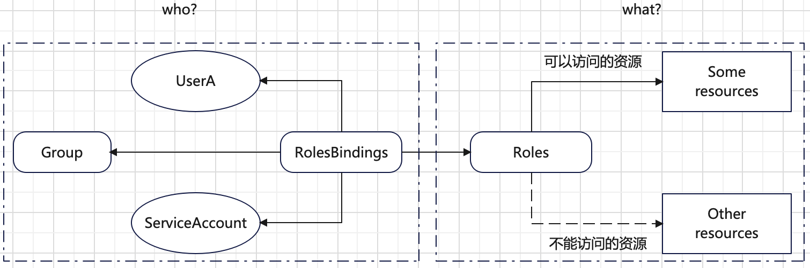
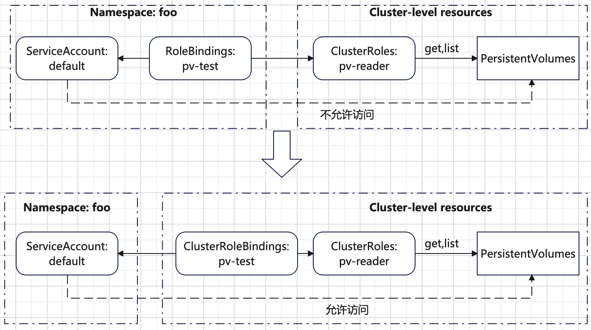

# ServiceAccount 概述
`ServiceAccount`用于表示非人类用户（例如`Pod`等）的一种身份标识。`ServiceAccount`的格式样例如下：
```bash
system:serviceaccount:<namespace>:<service account name>
```
每一个`namespace`都有一个名为`default`的默认`ServiceAccount`（创建`namespace`时候自动创建）：
```bash
$ kubectl -n default get serviceaccounts
NAME      SECRETS   AGE
default   0         36d
```
`Pod`可以被显示指定某一个`ServiceAccount`。如果不显示指定，则`Pod`使用当前`namespace`下的`default`默认`ServiceAccount`。
通过不同的`ServiceAccount`，可以实现`Pod`访问集群资源权限的精细控制。

**每一个`Pod`只能使用相同`namespace`下的某一个`ServiceAccount`，不能使用其他`namespace`下的`ServiceAccount`**。

可以使用`kubectl create serviceaccount <serviceaccount name>` 命令创建新的`ServiceAccount`。
```bash
$ kubectl -n default create serviceaccount foo
serviceaccount/foo created

# 查看创建的 foo ServiceAccount
$ kubectl -n default get serviceaccounts foo
NAME   SECRETS   AGE
foo    0         16s

# 查看 ServiceAccount 详细信息
$ kubectl -n default describe serviceaccounts foo
Name:                foo
Namespace:           default
Labels:              <none>
Annotations:         <none>
Image pull secrets:  <none>
Mountable secrets:   <none>
Tokens:              <none>
Events:              <none>
```
新版本的`k8s`默认不会创建默认的`secrets`和`ServiceAccount`绑定。所以看到`Mountable secrets`字段和`Tokens`字段为`<none>`，可以创建单独`secrets`对象进行关联。

默认情况下，`Pod`可以挂载任意的`Secret`对象。但如果一个`ServiceAccount`的注解有：
```bash
kubernetes.io/enforce-mountable-secrets="true"
```
则使用此`ServiceAccount`的`Pod`只能挂载`Mountable secrets`指定的`Secret`对象。

`ServiceAccount`中有`Image pull secrets`字段，用于自动添加到使用此`ServiceAccount`的`Pod`中。这样的**好处**就是不需要每个`Pod`都需要单独添加`imagePullSecrets`字段。

在`Pod`的模版定义中，可以通过`spec.serviceAccountName`字段指定`Pod`使用的`ServiceAccount`，例如：
```yml
apiVersion: v1
kind: Pod
metadata:
  name: curl-custom-sa
spec:
  # 指定服务账户
  serviceAccountName: foo
  containers:
  - name: main
    image: tutum/curl
    command: ["sleep", "9999999"]
  - name: ambassador
    image: luksa/kubectl-proxy:1.6.2
```
`ServiceAccount`的目的是用于权限控制，而`k8s`集群的权限的校验是通过`RBAC`（基于角色的访问控制）。

# 基于角色的访问控制概述
和`RBAC`校验相关的有四种资源，分为两类：
+ `Roles`和`ClusterRoles`：决定在某种资源上可以执行的动作（`what`）。
+ `RoleBindings`和`ClusterRoleBindings`：将上面的`Roles`绑定到具体的用户，组或者`ServiceAccount`（`who`）。

其中`Roles`和`RoleBindings`表示命名空间的资源，`ClusterRoles`和`ClusterRoleBindings`表示集群层面资源。

下图总结了`roles`和`rolesbindings`大致关系：



## 使用 Roles 和 RoleBindings
运行一个`Pod`，并在`Pod`中访问`Api Server`组件以验证`RBAC`工作机制。
```bash
# 创建一个新的命名空间
$ kubectl create namespace foo
namespace/foo created

# 在新的 foo 命名空间运行 kubectl-proxy Pod
$ kubectl -n foo run test --image=luksa/kubectl-proxy
pod/test created

$ kubectl -n foo get pods
NAME   READY   STATUS    RESTARTS   AGE
test   1/1     Running   0          25s

# 在 test Pod 中访问 api server
$ kubectl -n foo exec -it test -- sh
/ # curl 127.0.0.1:8001/api/v1/namespaces/default/services
{
  "kind": "Status",
  "apiVersion": "v1",
  "metadata": {},
  "status": "Failure",
  "message": "services is forbidden: User \"system:serviceaccount:foo:default\" cannot list resource \"services\" in API group \"\" in the namespace \"default\"",
  "reason": "Forbidden",
  "details": {
    "kind": "services"
  },
  "code": 403
}/ #
```
可以看到在命名空间`foo`中，默认的`default`的`ServiceAccount`没有权限`list`相同`namespace`下的`Service`资源。

为了解决上述的权限问题，首先定义一个`Role`资源。
```yml
# 文件名是 service_reader.yaml
apiVersion: rbac.authorization.k8s.io/v1
kind: Role
metadata:
  namespace: foo  # 指定 Role 资源所在的命名空间
  name: service-reader
rules:
  - apiGroups: [""] # "" 表示 core apiGroup，“*” 表示所有 API 组
    verbs: ["get", "list"]  # 给 get 和 list 权限
    resources: ["services"] # 操作的资源类型
```
定义的`Role`资源针对`foo`命名空间下的`Service`资源，允许做`get`和`list`操作。下图显示了`Role`资源操作权限示意图：


将上述定义的`Role`资源部署到集群：
```bash
$ kubectl -n foo apply -f service_reader.yaml
role.rbac.authorization.k8s.io/service-reader created

# 查看 Role 资源信息
$ kubectl -n foo get roles.rbac.authorization.k8s.io service-reader
NAME             CREATED AT
service-reader   2024-10-25T08:45:13Z

$ kubectl -n foo describe roles.rbac.authorization.k8s.io service-reader
Name:         service-reader
Labels:       <none>
Annotations:  <none>
PolicyRule:
  Resources  Non-Resource URLs  Resource Names  Verbs
  ---------  -----------------  --------------  -----
  services   []                 []              [get list]
```
下一步，需要将创建的`Role`资源绑定到`foo`命名空间的名为`default`的`ServiceAccount`，也就是`Pod`默认使用的`ServiceAccount`。
```bash
$ kubectl -n foo create rolebinding test --role=service-reader --serviceaccount=foo:default
rolebinding.rbac.authorization.k8s.io/test created

# 查看 rolebinding
$ kubectl -n foo get rolebindings.rbac.authorization.k8s.io test
NAME   ROLE                  AGE
test   Role/service-reader   4s

$ kubectl -n foo describe rolebindings.rbac.authorization.k8s.io test
Name:         test
Labels:       <none>
Annotations:  <none>
Role:
  Kind:  Role
  Name:  service-reader
Subjects:
  Kind            Name     Namespace
  ----            ----     ---------
  ServiceAccount  default  foo
```
绑定完成后结果示意图如下：


查看`RoleBindings`资源的`yaml`信息如下：
```bash
$ kubectl -n foo get rolebindings.rbac.authorization.k8s.io test -o yaml
apiVersion: rbac.authorization.k8s.io/v1
kind: RoleBinding
metadata:
  creationTimestamp: "2024-10-25T09:14:33Z"
  name: test
  namespace: foo
  resourceVersion: "727762"
  uid: d8f8ba8b-46d9-49db-955c-f0f266969990
roleRef:
  apiGroup: rbac.authorization.k8s.io
  kind: Role
  name: service-reader
subjects:
- kind: ServiceAccount
  name: default
  namespace: foo
```
其中`roleRef`属性表示**单个**需要绑定的`Role`资源对象。`subjects`表示要绑定的用户，可以是**多个**。

最后在`Pod`中重新访问`api server`：
```bash
$ kubectl -n foo exec -it test -- sh
/ # curl 127.0.0.1:8001/api/v1/namespaces/foo/services
{
  "kind": "ServiceList",
  "apiVersion": "v1",
  "metadata": {
    "resourceVersion": "729031"
  },
  "items": []
}/
```
可以看到此时`Pod`可以成功访问相同命名空间下的`Service`资源。

**一个命名空间下的`Role`资源也可以被绑定到另一个命名空间下的`ServiceAccount`，或其他`Subjects`**。示意说明如下：


可以更改`foo`命名空间下的`RoleBindings`资源：
```bash
$ kubectl edit rolebinding test -n foo

# 添加如下内容
subjects:
- kind: ServiceAccount
 name: default
 namespace: bar
```

## 使用 ClusterRoles 和 ClusterRoleBindings
+ `ClusterRoles`和`ClusterRoleBindings`是集群层面的资源。针对某些没有`namespace`概念的资源（比如`Nodes`、`PersistentVolumes`、`Namespaces`等）
以及某些`URL`没有对应的具体资源（例如`/healthz`），不能使用基于`namespace`的`RoleBindings`和`Roles`赋予权限。

+ 而且使用`ClusterRoleBindings`和`ClusterRoles`资源，可以在所有`namespace`共享，不需要创建多份。

**首先**在`Pod`访问`PersistentVolumes`资源（集群层面资源，不像`Pod`属于命名空间的资源）：
```bash
$ kubectl -n foo exec -it test -- sh
/ # curl 127.0.0.1:8001/api/v1/persistentvolumes
{
  "kind": "Status",
  "apiVersion": "v1",
  "metadata": {},
  "status": "Failure",
  "message": "persistentvolumes is forbidden: User \"system:serviceaccount:foo:default\" cannot list resource \"persistentvolumes\" in API group \"\" at the cluster scope",
  "reason": "Forbidden",
  "details": {
    "kind": "persistentvolumes"
  },
  "code": 403
}
```
可以看到，默认的名为`default`的`ServiceAccount`没有权限访问`PersistentVolumes`资源。

为了解决上述权限问题，首先创建一个名为`pv-reader`的`ClusterRoles`资源：
```bash
$ kubectl -n foo create clusterrole pv-reader --verb=get,list --resource=persistentvolumes
clusterrole.rbac.authorization.k8s.io/pv-reader created

# 查看 pv-reader 定义的信息
$ kubectl -n foo get clusterrole pv-reader -o yaml
apiVersion: rbac.authorization.k8s.io/v1
kind: ClusterRole
metadata:
  creationTimestamp: "2024-10-25T10:14:08Z"
  name: pv-reader
  resourceVersion: "733264"
  uid: 94bf8c4e-56b3-480a-8f20-5b3f80cab9de
rules:
- apiGroups:
  - ""
  resources:
  - persistentvolumes
  verbs:
  - get
  - list
```
接下来将创建的`ClusterRoles`绑定到名为`default`的`ServiceAccount`：
```bash
$ kubectl -n foo create clusterrolebinding pv-test --clusterrole=pv-reader --serviceaccount=foo:default
clusterrolebinding.rbac.authorization.k8s.io/pv-test created

# 查看 ClusterRoleBindings pv-test
$ kubectl -n foo get clusterrolebindings.rbac.authorization.k8s.io pv-test -o yaml
apiVersion: rbac.authorization.k8s.io/v1
kind: ClusterRoleBinding
metadata:
  creationTimestamp: "2024-10-25T10:19:55Z"
  name: pv-test
  resourceVersion: "733795"
  uid: 98fbfa86-2d2b-4c5f-87c1-50e402147a69
roleRef:
  apiGroup: rbac.authorization.k8s.io
  kind: ClusterRole
  name: pv-reader
subjects:
- kind: ServiceAccount
  name: default
  namespace: foo
```
对于集群层面的资源（类似`Pod`属于命名空间的资源）访问权限，必须使用`ClusterRoleBindings`和`ClusterRoles`。下图总结如下：



此时在`Pod`中访问`PersistentVolumes`资源：
```bash
$ kubectl -n foo exec -it test -- sh
/ # curl 127.0.0.1:8001/api/v1/persistentvolumes
{
  "kind": "PersistentVolumeList",
  "apiVersion": "v1",
  "metadata": {
    "resourceVersion": "735094"
  },
  "items": []
}
```
可以正常访问。

**然后**对于`api server`暴露的非资源`URLs`，也需要相关的权限才可以访问。一般来说，可以自动通过名为`system:discovery`的`ClusterRole`和名为`system:discovery`的`ClusterRoleBinding`分配权限。

查看名为`system:discovery`的`ClusterRole`信息如下：
```yml
apiVersion: rbac.authorization.k8s.io/v1
kind: ClusterRole
metadata:
  annotations:
    rbac.authorization.kubernetes.io/autoupdate: "true"
  creationTimestamp: "2024-09-18T07:49:13Z"
  labels:
    kubernetes.io/bootstrapping: rbac-defaults
  name: system:discovery
  resourceVersion: "74"
  uid: 3771415a-bd9f-4c4c-9e93-ccc6138e54d8
rules:
- nonResourceURLs:
  - /api
  - /api/*
  - /apis
  - /apis/*
  - /healthz
  - /livez
  - /openapi
  - /openapi/*
  - /readyz
  - /version
  - /version/
  verbs:
  - get
```
查看名为`system:discovery`的`ClusterRoleBinding`信息如下：
```yml
apiVersion: rbac.authorization.k8s.io/v1
kind: ClusterRoleBinding
metadata:
  annotations:
    rbac.authorization.kubernetes.io/autoupdate: "true"
  creationTimestamp: "2024-09-18T07:49:13Z"
  labels:
    kubernetes.io/bootstrapping: rbac-defaults
  name: system:discovery
  resourceVersion: "139"
  uid: 4c206bc7-548f-41f3-9fad-d9d1e87e3910
roleRef:
  apiGroup: rbac.authorization.k8s.io
  kind: ClusterRole
  name: system:discovery
subjects:
- apiGroup: rbac.authorization.k8s.io
  kind: Group
  name: system:authenticated
```
可以看到，`system:discovery`的`ClusterRole`具有众多非资源`URLs`的`get`权限，且被绑定到组`system:authenticated`。
> `system:authenticated`表示所有被校验成功的用户。

也就是说所有被校验成功的`Pod`都可以访问`system:discovery`的`ClusterRole`指定的非资源`URLs`。例如在`Pod`中可以直接访问`/api`的`URL`。
```bash
$ kubectl -n foo exec -it test -- sh
/ # curl 127.0.0.1:8001/api
{
  "kind": "APIVersions",
  "versions": [
    "v1"
  ],
  "serverAddressByClientCIDRs": [
    {
      "clientCIDR": "0.0.0.0/0",
      "serverAddress": "10.211.55.9:6443"
    }
  ]
}
```
**最后**对于命名空间的资源（例如`Pod`、`ConfigMaps`等），如果有`ClusterRole`类型的资源，则可以使用`ClusterRoleBinding`或者`RoleBinding`两种绑定。
二者区别如下示意图所示：


如果使用`ClusterRoleBinding`绑定，则`Pod`可以访问所有命名空间的资源。如果使用`RoleBinding`绑定，则`Pod`只能访问所在命名空间的资源。

总结如下：
|资源类型|使用的`Role`类型|使用的绑定类型|
|--------|----------------|--------------|
|`Cluster-level`资源（`Nodes`、`PersistentVolumes`等）|`ClusterRole`|`ClusterRoleBinding`|
|非资源的`URLs`（`/api`、`/healthz`等）|`ClusterRole`|`ClusterRoleBinding`|
|所有命名空间下的命名空间资源（`Pod`等）|`ClusterRole`|`ClusterRoleBinding`|
|某一个命名空间下的命名空间资源（`Pod`等），共享资源|`ClusterRole`|`RoleBinding`|
|某一个命名空间下的命名空间资源（`Pod`等）|`Role`|`RoleBinding`|
