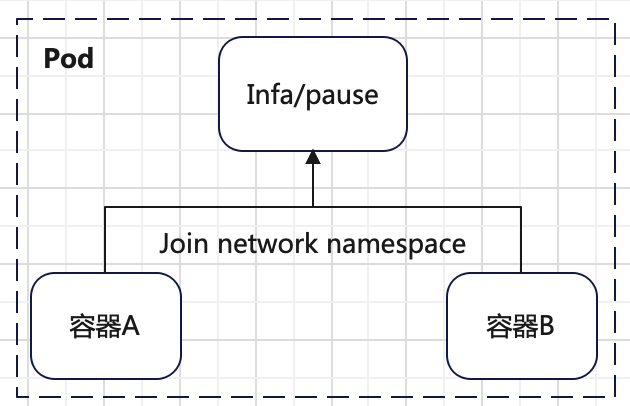
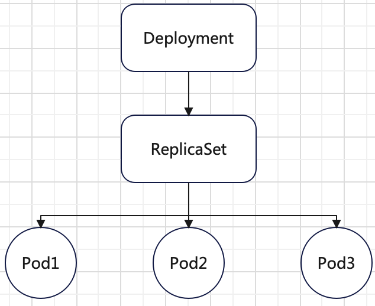

# 容器概述
容器的**核心功能**是通过**约束和修改进程的动态表现，为其创造一个边界**。容器本质上是宿主机上的一个进程，
也就是说宿主机上的所有容器都共享宿主机的内核。这也是为什么`Windows`系统不能运行`Linux`容器，低版本内核`Linux`系统不能运行高版本`Linux`容器。

容器创建过程分三个方面工作：
+ 为容器进程设置`Namespace`参数。
  > `Mount Namespace`需要先执行挂载动作，然后启动容器进程，这样在容器内挂载才会生效。
+ 为容器进程指定`Cgroup`参数。
+ 为容器进程切换根目录，调用`chroot`。

一个正在运行的容器可以分以下两个方面看：
+ 一组联合挂载的`rootfs`文件系统，这一部分是**容器镜像**，也是容器的静态视图。
+ 一个由`Namespace`和`Cgroup`实现的隔离环境，这一部分是**容器运行时**，容器的动态视图。

# Pod
`Pod`是`k8s`中最小的调度单位。`Pod`的本质在扮演传统的**虚拟机角色**，容器是这个虚拟机里运行的用户进程。
所以在`Pod`的`API`定义中，凡是和调度，网络，存储，安全等相关的字段都是`Pod`级别的定义（机器相关），而不是容器级别。

`Pod`内可以有多个容器，`Pod`内的所有容器都共享同一个`Network Namespace`，并且可以声明共享同一个`Volume`。
`Pod`中有一个`Infra`容器，此容器永远是第一个被创建的容器，其他用户定义的容器通过`Join Network Namespace`的方式与`Infra`容器关联在一起。



`Pod`里面的所有容器有如下特点：
+ 互相可以用`localhost`通信。
+ 所有的网络资源都是一个`Pod`一份，且被`Pod`内所有的容器共享，一个`Pod`只有一个`IP`地址。
+ `Pod`的生命周期只和`Infra`容器有关，和其他容器无关。

由于`Pod`的这种设计（类比虚拟机角色），`Pod`里面的容器共享`Volume`实现比较简单。`Pod`中`Volume`定义在`Pod`层级，
每个容器声明挂载`Pod`中定义的`Volume`即可实现容器共享挂载的宿主机上的目录。下面是一个`Pod`的定义：
```yml
apiVersion: v1
kind: Pod
metadata:
  name: two-containers
spec:
  volumes:
    - name: shared-data
      hostPath:
        path: /data
  containers:
    - name: nginx-container
      image: nginx
      volumeMounts:
        - mountPath: /usr/share/nginx/html
          name: shared-data
    - name: debian-container
      image: debian
      volumeMounts:
        - mountPath: /pod-data
          name: shared-data
```
上述的`Pod`定义了`nginx-container`和`debian-container`两个容器，且都挂载了`shared-data`这个`Volume`。`Volume`是`hostPath`类型的挂载，
其对应的目录就是宿主机的`/data`目录，所以两个容器都可以访问宿主机的`/data`目录。

`Pod`中的容器大致可以分以下三种：
+ **主容器**：运行具体应用的容器。
+ **`Init Container`**：在`Pod`内**所有主容器启动之前启动**，`Init`容器运行完就退出。如果为一个`Pod`指定了多个`Init`容器，
这些容器会按顺序逐个运行。每个`Init`容器必须运行成功，下一个才能够运行。当所有`Init`容器运行完成时，`Kubernetes`才会为`Pod`初始化启动应用容器。
  ```yml
  apiVersion: v1
  kind: Pod
  metadata:
    name: myapp-pod
    labels:
      app.kubernetes.io/name: MyApp
  spec:
    containers:
    - name: myapp-container
      image: busybox:1.28
      command: ['sh', '-c', 'echo The app is running! && sleep 3600']
    initContainers:
    - name: init-myservice
      image: busybox:1.28
      command: ['sh', '-c', "until nslookup myservice.$(cat /var/run/secrets/kubernetes.io/serviceaccount/namespace).svc.cluster.local; do echo waiting for myservice; sleep 2; done"]
  ```
  样例中`init-myservice`就是一个`Init`容器，`Init`容器可以用于初始化环境设置，一次性任务等。
+ **`Sidecar Container`**：辅助容器是和主容器在同一个`Pod`中运行的。主要用来执行日志收集，数据同步，监控等需求。
  ```yml
  apiVersion: apps/v1
  kind: Deployment
  metadata:
    ...
  spec:
    ...
    template:
      spec:
        containers:
          - name: myapp
            image: alpine:latest
            command: ['sh', '-c', 'while true; do echo "logging" >> /opt/logs.txt; sleep 1; done']
            volumeMounts:
              - name: data
                mountPath: /opt
        initContainers:
          - name: logshipper
            image: alpine:latest
            restartPolicy: Always
            command: ['sh', '-c', 'tail -F /opt/logs.txt']
            volumeMounts:
              - name: data
                mountPath: /opt
        volumes:
          - name: data
            emptyDir: {}
  ```
  和`Init`容器定义类似，只是**需要声明`restartPolicy: Always`字段**。
  > `Sidecar`容器也可以是普通的容器，不一定是`initContainer`类型的容器。`initContainer`类型的`Sidecar`在`V1.29`版本才支持。

下面介绍`Pod`定义相关的几个字段。
+ `nodeSelector`：节点选择器，只有匹配`nodeSelector`指定标签的节点才会部署`Pod`。
+ `nodeName`：一旦`Pod`的此字段被赋值，则`k8s`认为此`Pod`已经被调度，一般由调度器设置。但可以人工设置骗过调度器。
+ `hostAliases`：定义`Pod`的`/etc/hosts`文件里面的内容，只对非`hostNetwork`的`Pod`有效。
  ```yml
  apiVersion: v1
  kind: Pod
  metadata:
    name: dnsutils
    namespace: default
  spec:
    restartPolicy: Always
    containers:
    - name: dnsutils
      # 国内无法访问 registry.k8s.io，替换为 k8s.m.daocloud.io
      image: k8s.m.daocloud.io/e2e-test-images/agnhost:2.39
      imagePullPolicy: IfNotPresent
    hostAliases:
    - ip: "10.211.55.10"
      hostnames:
      - "foo"
      - "bar"
  ```
  上述定义的`Pod`的`/etc/hosts`内容如下：
  ```bash
  $ kubectl exec dnsutils -- cat /etc/hosts
  # Kubernetes-managed hosts file.
  127.0.0.1	localhost
  ::1	localhost ip6-localhost ip6-loopback
  fe00::0	ip6-localnet
  fe00::0	ip6-mcastprefix
  fe00::1	ip6-allnodes
  fe00::2	ip6-allrouters
  192.168.1.138	dnsutils
  
  # Entries added by HostAliases.
  10.211.55.10	foo	bar
  ```
  可以看到在`Pod`的`/etc/hosts`文件追加了`10.211.55.10 foo bar`内容。
+ `shareProcessNamespace`：在`Pod`中的所有容器之间共享单个进程名字空间。设置了此字段之后，
容器将能够查看来自同一`Pod`中其他容器的进程并发出信号，并且每个容器中的第一个进程不会被分配`PID 1`。
  ```yml
  apiVersion: v1
  kind: Pod
  metadata:
    name: dnsutils
    namespace: default
  spec:
    # 设置 shareProcessNamespace 参数
    shareProcessNamespace: true
    restartPolicy: Always
    containers:
    - name: dnsutils
      image: k8s.m.daocloud.io/e2e-test-images/agnhost:2.39
      imagePullPolicy: IfNotPresent
  ```
  在上述`Pod`内的容器`dnsutils`里执行`ps`命令：
  ```bash
  $ kubectl exec dnsutils -c dnsutils -- ps
  PID   USER     TIME  COMMAND
      1 65535     0:00 /pause
     20 root      0:00 /agnhost pause
     32 root      0:00 ps
  ```
  可以看到`/pause`容器的进程`ID=1`，`dnsutils`容器的进程`ID=20`。作为对比，不设置`shareProcessNamespace`字段，执行结果如下：
  ```bash
  $ kubectl exec dnsutils -c dnsutils -- ps
  PID   USER     TIME  COMMAND
      1 root      0:00 /agnhost pause
     13 root      0:00 ps
  ```
  可以看到只能看到`dnsutils`容器的进程，且`ID=1`。
+ `lifecycle`：这是容器层级的参数，表示在容器状态发生变化时触发的一系列钩子。
  ```yml
  apiVersion: v1
  kind: Pod
  metadata:
    name: lifecycle-demo
  spec:
    containers:
    - name: lifecycle-demo-container
      image: nginx
      lifecycle:
        postStart:
          exec:
            command: ["/bin/sh", "-c", "echo Hello from the postStart handler > /usr/share/message"]
        preStop:
          exec:
            command: ["/bin/sh","-c","nginx -s quit; while killall -0 nginx; do sleep 1; done"]
  ```
  `postStart`表示在容器启动后立刻执行。`postStart`定义的操作虽然是在容器的`ENTRYPOINT`之后，但是不保证在`ENTRYPOINT`执行完才执行，
  也就是说`postStart`启动时，`ENTRYPOINT`可能还没结束。

  `preStop`表示在容器被结束之前（例如收到`SIGKILL`信号），执行。`preStop`操作是同步的，会阻塞当前容器的结束流程，
  直到`preStop`命令执行完成。

继续介绍下`Pod`中的`Projected Volume`（投射数据卷）：为容器提供预先定义好的数据。主要介绍以下四种：
+ **`Secret`**：将数据加密保存在`etcd`中，`Pod`里面的容器通过`Volume`挂载的方式访问`Secret`里面保存的加密信息。
首先创建一个存放数据库用户和密码的`Secret`对象（**容器以`subPath`卷挂载方式使用`Secret`时，将无法接收`Secret`的更新**）：
  ```yml
  apiVersion: v1
  kind: Secret
  metadata:
    name: secret-mysql
  type: Opaque
  data:
    username: YWRtaW4=
    password: MTIzNDU2
  ```
  其中`data`字段中的`username`和`password`需要是`base64`编码格式：
  ```bash
  # username
  $ echo -n "admin" | base64
  YWRtaW4=
  # password
  $ echo -n "123456" | base64
  MTIzNDU2
  ```
  创建一个`Pod`，引用上述的`Secret`对象：
  ```yml
  apiVersion: v1
  kind: Pod
  metadata:
    name: secret-test-pod
    labels:
      name: secret-test
  spec:
    volumes:
    - name: secret-volume
      secret:
        secretName: secret-mysql
    containers:
    - name: secret-test-container
      image: busybox
      args:
      - sleep
      - "86400"
      volumeMounts:
      - name: secret-volume
        readOnly: true
        mountPath: "/etc/secret-volume"
  ```
  在`Pod`中查看对应的`secret-mysql`信息是否存在：
  ```bash
  # 查看 Pod 中挂载的目录内容，也就是 Secret 定义中 data 字段指定的 key
  $ kubectl exec secret-test-pod -- ls /etc/secret-volume/
  password
  username
  # 查看挂载的文件数据
  $ kubectl exec secret-test-pod -- cat /etc/secret-volume/password
  123456
  $ kubectl exec secret-test-pod -- cat /etc/secret-volume/username
  admin
  ```
  这种通过挂载方式进入容器的`Secret`，一旦对应的`etcd`中数据更新，则`Volume`里的文件内容也会更新，但更新会有延时，编程需要做好重试。
+ **`ConfigMap`**：用法和`Secret`类似，但`ConfigMap`保存的是无需加密的配置信息（**容器以`subPath`卷挂载方式使用`ConfigMap`时，将无法接收`ConfigMap`的更新**）。
首先创建一个`yaml`文件存放需要挂载的配置信息：
  ```yml
  cube_size_to_pano_resolution:
    2048: 8000
    4096: 16000
    6144: 24000
  ```
  从上述文件在集群创建一个`ConfigMap`对象。
  ```bash
  $ kubectl create configmap configmap-test --from-file configmap_test.yaml

  # 查看 configmap 内容
  $ kubectl get configmaps configmap-test -o yaml
  apiVersion: v1
  data:
    configmap_test.yaml: |
      cube_size_to_pano_resolution:
        2048: 8000
        4096: 16000
        6144: 24000
  kind: ConfigMap
  metadata:
    creationTimestamp: "2024-11-13T07:16:25Z"
    name: configmap-test
    namespace: default
    resourceVersion: "1079429"
    uid: e029dfbf-8099-4a17-8dc7-c174e54f8f51
  ```
  创建一个`Pod`，引用上述创建的`ConfigMap`对象：
  ```yml
  apiVersion: v1
  kind: Pod
  metadata:
    name: configmap-test-pod
    labels:
      name: configmap-test
  spec:
    volumes:
    - name: configmap-volume
      configMap:
        name: configmap-test
    containers:
    - name: configmap-test-container
      image: busybox
      args:
      - sleep
      - "86400"
      volumeMounts:
      - name: configmap-volume
        readOnly: true
        mountPath: "/etc/configmap-volume"
  ```
  在`Pod`中查看对应的`configmap-test`资源对象是否存在：
  ```bash
  # 查看 Pod 中挂载的目录内容，也就是 ConfigMap 定义中 data 字段指定的 key
  $ kubectl exec configmap-test-pod -- ls /etc/configmap-volume
  configmap_test.yaml
  # 查看文件内容
  $ kubectl exec configmap-test-pod -- cat /etc/configmap-volume/configmap_test.yaml
  cube_size_to_pano_resolution:
    2048: 8000
    4096: 16000
    6144: 24000
  ```
+ **`Download API`**：让`Pod`里面的容器可以直接获取`Pod API`对象本身的信息。所公开的数据以纯文本格式的只读文件形式存在（**容器以`subPath`卷挂载方式使用`downward API`时，在字段值更改时将不能接收到它的更新**）。
`Download API`可以作为环境变量或者`Volume`。
  ```yml
  apiVersion: v1
  kind: Pod
  metadata:
    name: downloadapi-test-pod
    labels:
      name: downloadapi-test
  spec:
    # 卷挂载方式
    volumes:
    - name: downloadapi-volume
      downwardAPI:
        items:
          - path: "labels"
            fieldRef:
              fieldPath: metadata.labels
          - path: "annotations"
            fieldRef:
              fieldPath: metadata.annotations
    containers:
    - name: downloadapi-test-container
      image: busybox
      args:
      - sleep
      - "86400"
      # 环境变量方式
      env:
      - name: MY_NODE_NAME
        valueFrom:
          fieldRef:
            fieldPath: spec.nodeName
      volumeMounts:
      - name: downloadapi-volume
        mountPath: "/etc/downloadapi-volume"
  ```
  在`Pod`中查看挂载的卷以及环境变量结果：
  ```bash
  # 查看挂载卷
  $ kubectl exec downloadapi-test-pod -- ls /etc/downloadapi-volume
  annotations
  labels
  $ kubectl exec downloadapi-test-pod -- cat /etc/downloadapi-volume/labels
  name="downloadapi-test"
  # 查看环境变量
  $ kubectl exec downloadapi-test-pod -- printenv MY_NODE_NAME
  ylq-ubuntu-server-node1
  ```
  `Download API`支持的字段可以查看 [Download API](https://kubernetes.io/zh-cn/docs/concepts/workloads/pods/downward-api/)
+ **`ServiceAccountToken`**：`ServiceAccount`用于访问集群资源，每个可以设置不同权限。而`ServiceAccountToken`则是`ServiceAccount`的授权信息和文件，
实际是一种特殊的`Secret`。集群中的每个`Pod`都有默认的`ServiceAccount`以及自动挂载默认的`ServiceAccountToken`：
  ```yml
  spec:
    containers:
    - image: k8s.m.daocloud.io/e2e-test-images/agnhost:2.39
      imagePullPolicy: IfNotPresent
      name: dnsutils
      resources: {}
      terminationMessagePath: /dev/termination-log
      terminationMessagePolicy: File
      # 默认挂载的卷
      volumeMounts:
      - mountPath: /var/run/secrets/kubernetes.io/serviceaccount
        name: kube-api-access-7rdtr
        readOnly: true
    ...
    # 默认挂载的卷
    volumes:
    - name: kube-api-access-7rdtr
      projected:
        defaultMode: 420
        sources:
        - serviceAccountToken:
            expirationSeconds: 3607
            path: token
        - configMap:
            items:
            - key: ca.crt
              path: ca.crt
            name: kube-root-ca.crt
        - downwardAPI:
            items:
            - fieldRef:
                apiVersion: v1
                fieldPath: metadata.namespace
              path: namespace
  ```

接下来继续看下`Pod`的健康检查和恢复机制。`Pod`的健康检查可以通过探针实现，探针有三种：
+ **存活探针**：决定何时重启容器。 例如，存活探针可以捕获程序死锁。一个容器的存活探针失败多次，`kubelet`将重启该容器。
存活探针不会等待就绪探针成功。如果想在执行存活探针前等待，可以定义`initialDelaySeconds`。
  ```yml
  apiVersion: v1
  kind: Pod
  metadata:
    labels:
      test: liveness
    name: liveness-exec
  spec:
    containers:
    - name: liveness
      image: registry.k8s.io/busybox
      args:
      - /bin/sh
      - -c
      - touch /tmp/healthy; sleep 30; rm -f /tmp/healthy; sleep 600
      # 定义存活探针
      livenessProbe:
        exec:
          command:
          - cat
          - /tmp/healthy
        initialDelaySeconds: 5
        periodSeconds: 5
  ```
  存活探针除了`exec`，还可以有`HTTP`和`TCP`方式。
+ **就绪探针**：决定何时容器准备好开始接受流量。 这种探针在等待应用执行耗时的初始任务时非常有用，例如建立网络连接、加载文件和预热缓存。
如果就绪探针返回的状态为失败，`Kubernetes`会将该`Pod`从所有对应服务的端点中移除。
  ```yml
  # 就绪探针
  readinessProbe:
    exec:
      command:
      - cat
      - /tmp/healthy
    initialDelaySeconds: 5
    periodSeconds: 5
  ```
  就绪探针和存活探针配置基本一样，也有`HTTP`和`TCP`方式。
+ **启动探针**：可以用于对慢启动容器进行存活性检测，避免它们在启动运行之前就被`kubelet`杀掉。配置了这类探针，会禁用存活检测和就绪检测，直到启动探针成功为止。
这类探针仅在启动时执行，不像存活探针和就绪探针那样周期性地运行。
  ```yml
  # 存活探针
  livenessProbe:
    httpGet:
      path: /healthz
      port: liveness-port
    failureThreshold: 1
    periodSeconds: 10
  # 启动探针 
  startupProbe:
    httpGet:
      path: /healthz
      port: liveness-port
    failureThreshold: 30
    periodSeconds: 10
  ```
  启动探针失败，会根据`restartPolicy`配置决定是否重启。

探针的官方文档可以查看[探针配置](https://kubernetes.io/zh-cn/docs/tasks/configure-pod-container/configure-liveness-readiness-startup-probes/)

`Pod`的恢复过程（重启）永远发生在当前节点，一旦`Pod`和一个节点绑定（除非`.spec.nodeName`改变）就不会离开绑定的节点。
即使节点宕机，也不会迁移到其它节点。

# Deployments
`Deployment`用于管理一组`Pod`，是一种控制器对象。`k8s`中的控制器编排模式是控制循环，逻辑如下：
```bash
for {
    实际状态 = 获取集群中对象 X 的实际状态；
    期望状态 = 获取集群中对象 X 的期望状态；
    if 实际状态 == 期望状态:
        什么都不做；
    else:
        执行编排动作，将实际状态调整为期望状态；
}
```
`Deployment`对象的样例如下：
```yml
apiVersion: apps/v1
kind: Deployment
metadata:
  name: nginx-deployment
  labels:
    app: nginx
spec:
  replicas: 2
  selector:
    matchLabels:
      app: nginx
  template:
    metadata:
      labels:
        app: nginx
    spec:
      containers:
      - name: nginx
        image: nginx:1.14.2
        ports:
        - containerPort: 80
```
定义了所有带有标签`app=nginx`的`Pod`的期望状态是`replicas=2`。定义的`template`字段是被管理`Pod`创建使用的模版，内容和上面介绍的`Pod`对象基本一样。
```bash
# 在集群中部署 Deployment
$ kubectl apply -f nginx-deployment.yaml
deployment.apps/nginx-deployment created
# 查询部署结果
$ kubectl get pods
NAME                               READY   STATUS    RESTARTS        AGE
nginx-deployment-d556bf558-2bjdz   1/1     Running   0               13s
nginx-deployment-d556bf558-6ts2w   1/1     Running   0               13s
```
实际上`Deployment`并不直接管理`Pod`对象，而是`ReplicaSet`直接管理`Pod`，`Deployment`管理`ReplicaSet`。三者的关系如下：



`Deployment`只允许容器配置`restartPolicy=Always`。`Deployment`最终对`Pod`的控制动作有两个：
+ 水平拓展：更改期望的副本数。通过命令行操作的方式如下：
  ```bash
  $ kubectl scale deployment nginx-deployment --replicas=3
  deployment.apps/nginx-deployment scaled
  ```
  这时候查看`Deployment`可以发现`replicas`值已经被更新为`3`。
+ 滚动更新：每次部署或者更新`Deployment`时，都会自动创建一个`ReplicaSet`对象，**`ReplicaSet`和应用版本一一对应**。
  ```bash
  # 部署 Deployment
  $ kubectl apply -f nginx-deployment.yaml
  deployment.apps/nginx-deployment created
  # 查看部署的结果
  $ kubectl get deployments.apps
  NAME               READY   UP-TO-DATE   AVAILABLE   AGE
  nginx-deployment   2/2     2            2           21s
  # 查看自动创建的 ReplicaSet 对象，名字后面的随机字符串是 pod-template-hash
  $ kubectl get rs
  NAME                         DESIRED   CURRENT   READY   AGE
  nginx-deployment-d556bf558   2         2         2       57s
  ```
  每次更新`Deployment`，都会触发一次滚动更新。更新`Deployment`方式有多种，例如使用`kubectl edit`命令：
  ```bash
  $ kubectl edit deployments.apps nginx-deployment
  ```
  将`nginx`使用的镜像版本由`1.14.2`改为`1.16.1`，可以通过`kubectl rollout status`命令查看滚动更新结果：
  ```bash
  $ kubectl rollout status deployment nginx-deployment
  deployment "nginx-deployment" successfully rolled out
  ```
  查看`Deployment`的事件信息
  ```bash
  $ kubectl describe deployments.apps nginx-deployment
  Events:
    Type    Reason             Age    From                   Message
    ----    ------             ----   ----                   -------
    Normal  ScalingReplicaSet  3m33s  deployment-controller  Scaled up replica set nginx-deployment-d556bf558 to 2
    Normal  ScalingReplicaSet  3m2s   deployment-controller  Scaled up replica set nginx-deployment-7dbfbc79cf to 1
    Normal  ScalingReplicaSet  3m     deployment-controller  Scaled down replica set nginx-deployment-d556bf558 to 1 from 2
    Normal  ScalingReplicaSet  3m     deployment-controller  Scaled up replica set nginx-deployment-7dbfbc79cf to 2 from 1
    Normal  ScalingReplicaSet  2m59s  deployment-controller  Scaled down replica set nginx-deployment-d556bf558 to 0 from 1
  ```
  可以发现，第一次创建`Deployment`时，其创建了一个`ReplicaSet`对象`nginx-deployment-d556bf558`，并将其扩容到`2`个副本。
  每次更新`Deployment`时，都会创建一个新的`ReplicaSet`对象`nginx-deployment-7dbfbc79cf`，并首先将其扩容到`1`等待就绪，
  然后将旧的`ReplicaSet`副本从`2`缩容到`1`。然后继续将新的`ReplicaSet`副本从`1`扩容到`2`。最后将旧的`ReplicaSet`副本从`1`缩容到`0`。
  如此交替进行。

  默认情况下，更新过程中，`Deployment`确保可用副本数介于`75%-125%`之间。在计算`availableReplicas`数值时候不考虑终止过程中的`Pod`，
  `availableReplicas`的值一定介于`replicas - maxUnavailable`和`replicas + maxSurge`之间。在上线期间看到`Pod`个数比预期的多，
  `Deployment`所消耗的总的资源也大于`replicas + maxSurge`个`Pod`所用的资源，直到被终止的`Pod`所设置的`terminationGracePeriodSeconds`到期为止。
  ```yml
  spec:
    replicas: 2
    strategy:
      rollingUpdate:
        maxSurge: 100%
        maxUnavailable: 0%
      type: RollingUpdate
  ```

  > `Deployment`滚动更新策略的好处就是，遇到新的`Pod`起不来，则不会影响太多线上服务，因为旧的`Pod`还工作。

可以通过如下命令查看`Deployment`历史修改版本信息：
```bash
$ kubectl rollout history deployment nginx-deployment
deployment.apps/nginx-deployment
REVISION  CHANGE-CAUSE
1         <none>
2         <none>
```
> `CHANGE-CAUSE`的内容是从`Deployment`的`kubernetes.io/change-cause`注解复制过来的。复制动作发生在修订版本创建时。
可以通过以下方式设置`CHANGE-CAUSE`消息：
> + 使用`kubectl annotate deployment/nginx-deployment kubernetes.io/change-cause="image updated to 1.16.1"`为`Deployment`添加注解。
> + 手动编辑资源的清单。

查看`Deployment`历史版本的详细信息如下：
```bash
$ kubectl rollout history deployment nginx-deployment --revision=1
deployment.apps/nginx-deployment with revision #1
Pod Template:
  Labels:	app=nginx
	pod-template-hash=d556bf558
  Containers:
   nginx:
    Image:	nginx:1.14.2
    Port:	80/TCP
    Host Port:	0/TCP
    Environment:	<none>
    Mounts:	<none>
  Volumes:	<none>
  Node-Selectors:	<none>
  Tolerations:	<none>
```
可以使用`--to-revision`参数回滚到指定版本。
```bash
$ kubectl rollout undo deployment nginx-deployment --to-revision=1
deployment.apps/nginx-deployment rolled back
```
回滚的动作也是一种滚动更新。指定版本的`ReplicaSet`和当前版本的`ReplicaSet`交替创建或缩容。查看`Deployment`事件信息如下：
```bash
Events:
  Type    Reason             Age   From                   Message
  ----    ------             ----  ----                   -------
  ...
  Normal  ScalingReplicaSet  73s   deployment-controller  Scaled up replica set nginx-deployment-d556bf558 to 1 from 0
  Normal  ScalingReplicaSet  72s   deployment-controller  Scaled down replica set nginx-deployment-7dbfbc79cf to 1 from 2
  Normal  ScalingReplicaSet  72s   deployment-controller  Scaled up replica set nginx-deployment-d556bf558 to 2 from 1
  Normal  ScalingReplicaSet  71s   deployment-controller  Scaled down replica set nginx-deployment-7dbfbc79cf to 0 from 1
```

每次滚动更新都会创建一个新的`ReplicaSet`对象，为了控制历史`ReplicaSet`版本数量，可以通过`.spec.revisionHistoryLimit`用来设定出于回滚目的所要保留的旧`ReplicaSet`数量。
这些旧`ReplicaSet`会消耗`etcd`中的资源。

**`Deployment`控制`ReplicaSet`（应用版本），`ReplicaSet`控制`Pod`（副本数）。**

# StatefulSet
对于有状态应用，也就是各个实例之间不是对等关系以及实例对外部数据有依赖关系。例如主从关系，主备关系等。不适合使用`Deployment`管理。
有状态的应用大概分两种情况：
+ **拓扑状态**：应用的多个实例之间不是对等关系，实例需要按特定顺序启动。例如实例之间有主从关系，主节点先于从节点启动。
如果实例被重启，则需按照之前的启动顺序启动，且新创建的的实例和原来的实例有相同的网络标识，这样原先的访问者可以通过相同的标识访问新创建的实例。
+ **存储状态**：多个实例分别绑定不同的存储数据。`PodA`第一次读取的数据和之后一段时间读取的数据应该是同一份，即使在此期间，`PodA`被重新创建过。
例如数据库的多个存储实例。

对于**拓扑状态**的用于，`StatefulSet`利用`Headless Services`来维持`Pod`间的拓扑状态。因为`Headless Services`为`Pod`提供唯一的网络标识。
一个`Headless Services`的样例如下：
```yml
apiVersion: v1
kind: Service
metadata:
  name: nginx
  labels:
    app: nginx
spec:
  ports:
  - port: 80
    name: web
  clusterIP: None
  selector:
    app: nginx
```
其中`clusterIP`必须设置为`None`以表示一个`Headless Services`。此`Services`创建后没有分配一个`Services IP`，
而是以`DNS`记录的方式暴露其代理的所有`Pod`的`IP`地址，每一个被代理的`Pod`的`DNS`记录如下：
```bash
<pod-name>.<svc-name>.<namespace>.svc.cluster.local
```
一个`StatefulSet`对象的定义如下：
```yml
apiVersion: apps/v1
kind: StatefulSet
metadata:
  name: web
spec:
  selector:
    matchLabels:
      app: nginx
  serviceName: "nginx"
  replicas: 2
  template:
    metadata:
      labels:
        app: nginx
    spec:
      containers:
      - name: nginx
        image: nginx:1.16.1
        ports:
        - containerPort: 80
          name: web
```
其中`serviceName: nginx`指示`StatefulSet`控制器使用`nginx`这个`Headless Services`来保证`Pod`的网络标识。
将上述`Headless Services`和`StatefulSet`部署到集群（先部署`Headless Services`然后部署`StatefulSet`）：
```bash
# 查看 Headless Services 的信息
$ kubectl get  services
NAME         TYPE        CLUSTER-IP   EXTERNAL-IP   PORT(S)   AGE
nginx        ClusterIP   None         <none>        80/TCP    3s
# 查看 StatefulSet 信息
$ kubectl get statefulsets.apps web
NAME   READY   AGE
web    2/2     63s
# 查看 pod 的信息
$ kubectl get pods -o wide
NAME       READY   STATUS    RESTARTS        AGE     IP              NODE                      NOMINATED NODE   READINESS GATES
web-0      1/1     Running   0               15m     192.168.1.195   ylq-ubuntu-server-node1   <none>           <none>
web-1      1/1     Running   0               15m     192.168.1.196   ylq-ubuntu-server-node1   <none>           <none>
# 查看 statefulsets 事件信息
$ kubectl describe statefulsets.apps web
...
Events:
  Type    Reason            Age    From                    Message
  ----    ------            ----   ----                    -------
  Normal  SuccessfulCreate  2m31s  statefulset-controller  create Pod web-0 in StatefulSet web successful
  Normal  SuccessfulCreate  2m30s  statefulset-controller  create Pod web-1 in StatefulSet web successful
```
可以看到`StatefulSet`给其管理的所有`Pod`名字进行了编号，编号规则是`-`，且从`0`开始。`Pod`创建严格按照编号进行，
`web-0`进入`Running`状态之前，`web-1`会一直处于`Pending`状态。

在`Pod`内通过`DNS`来访问`StatefulSet`管理的`Pod`：
```bash
# 访问 web-0 
$ kubectl exec dnsutils -- nslookup web-0.nginx.default.svc.cluster.local
Server:		10.96.0.10
Address:	10.96.0.10#53

Name:	web-0.nginx.default.svc.cluster.local
Address: 192.168.1.195
# 访问 web-1
$ kubectl exec dnsutils -- nslookup web-1.nginx.default.svc.cluster.local
Server:		10.96.0.10
Address:	10.96.0.10#53

Name:	web-1.nginx.default.svc.cluster.local
Address: 192.168.1.196
```
如果将`StatefulSet`管理的`Pod`删除，则会按照之前的编号顺序，重新创建两个`Pod`，且两个新创建的`Pod`的`DNS`记录保存不变。
> 实验发现，如果只是删除一个`Pod`，例如删除`web-0`或者`web-1`，则只会创建被删除的`Pod`。

对于**存储状态**的应用，`StatefulSet`管理的`Pod`可以通过`volumeClaimTemplates`声明挂载`Volume`的模版来挂载一个`Volume`。样例如下：
```yml
apiVersion: apps/v1
kind: StatefulSet
metadata:
  name: web
spec:
  selector:
    matchLabels:
      app: nginx
  serviceName: "nginx"
  replicas: 2
  minReadySeconds: 10
  template:
    metadata:
      labels:
        app: nginx
    spec:
      terminationGracePeriodSeconds: 10
      containers:
      - name: nginx
        image: nginx:1.16.1
        ports:
        - containerPort: 80
          name: web
        volumeMounts:  # 挂载 Volume
        - name: www
          mountPath: /usr/share/nginx/html
  volumeClaimTemplates: # 挂载 Volume 模版
  - metadata:
      name: www
    spec:
      accessModes: [ "ReadWriteOnce" ]
      storageClassName: "my-storage-class"
      resources:
        requests:
          storage: 1Gi
```
当`StatefulSet`管理的`Pod`被删除后，例如`web-0`被删除，则`web-0`对应的`PVC`和`PV`并不会删除，数据依然存在。
`StatefulSet`控制器发现`web-0`的`Pod`消失，会重新创建一个名为`web-0`的新`Pod`。新创建名为`web-0`的`Pod`声明使用的`PVC`还是名为`www-web-0`（因为创建`Pod`的模版定义没变），
所以就会查找到同名的`PVC`，进而找到对应的`PV`和新创建的`Pod`绑定。进而新创建的`Pod`还可以继续访问之前的数据。

**最后使用`StatefulSet`部署一个`mysql`集群**，`mysql`集群有以下特点：
+ 主从复制功能，一个主节点，多个从节点。
+ 所有写操作在主节点，读操作在所有节点。
+ 从节点可以水平拓展。

> 裸机部署`mysql`集群，从节点同步主节点数据需要做有以下操作：
> + 安装好`mysql`主节点之后，需要通过`XtraBackup`工具将主节点数据备份到指定目录，同时会生成一个备份信息文件`xtrabackup_binlog_info`文件；
>   ```sql
>   # xtrabackup_binlog_info 文件内容如下
>   mysql-bin.000123   45678
>   ```
> + 配置从节点，在从节点第一次启动前，需要将主节点的备份数据及备份信息文件`xtrabackup_binlog_info`一起复制到自己的`/var/lib/mysql`下，
> 然后执行下面的`SQL`语句：
>   ```sql
>   CHANGE MASTER TO
>     MASTER_HOST='主节点IP',
>     MASTER_USER='replica_user',
>     MASTER_PASSWORD='password',
>     MASTER_LOG_FILE='mysql-bin.000123',
>     MASTER_LOG_POS=45678;
>   ```
> + 启动从节点。后续启动更多的从节点，可以从已经完成数据备份的从节点备份数据即可。
>   ```sql
>   START SLAVE;
>   ```

部署`mysql`集群需要解决如下三个问题：
+ 主节点和从节点需要有不同的配置文件。
+ 主节点和从节点需要传输备份信息文件，备份信息文件给从节点从主节点备份数据使用。
+ 从节点第一次启动之前需要做一些`SQL`初始化工作。

首先看下问题一：主节点和从节点需要有不同的配置文件。定义如下的`ConfigMap`文件：
```yml
apiVersion: v1
kind: ConfigMap
metadata:
  name: mysql
  labels:
    app: mysql
    app.kubernetes.io/name: mysql
data:
  primary.cnf: |
    # 仅在主服务器上应用此配置
    [mysqld]
    log-bin # 启动二进制文件形式的主从复制 
  replica.cnf: |
    # 仅在副本服务器上应用此配置
    [mysqld]
    super-read-only # 从节点会拒绝除主节点同步写之外的所有写操作，对用户是只读    
```
上述定义了`primary.cnf`和`replica.cnf`两个`mysql`配置文件。其中`data`部分是`key-value`格式，`primary.cnf`和`replica.cnf`就是`key`，
`|`后面的对应的内容就是`value`。此`ConfigMap`被挂载进`Pod`后，会在挂载目录下生成名为`primary.cnf`或者`replica.cnf`的文件。

继续创建两个`Service`，定义如下：
```yml
# 为 StatefulSet 成员提供稳定的 DNS 表项的无头服务（Headless Service）
apiVersion: v1
kind: Service
metadata:
  name: mysql
  labels:
    app: mysql
    app.kubernetes.io/name: mysql
spec:
  ports:
  - name: mysql
    port: 3306
  clusterIP: None
  selector:
    app: mysql
---
# 用于连接到任一 MySQL 实例执行读操作的客户端服务
# 对于写操作，你必须连接到主服务器：mysql-0.mysql
apiVersion: v1
kind: Service
metadata:
  name: mysql-read
  labels:
    app: mysql
    app.kubernetes.io/name: mysql
    readonly: "true"
spec:
  ports:
  - name: mysql
    port: 3306
  selector:
    app: mysql
```
其中`Headless Service`用于给`StatefulSet`管理的`Pod`提供稳定唯一的网络标示，例如`mysql-0.mysql`表示主节点，`mysql-1.mysql`表示从节点。
名为`mysql-read`的普通`Service`用于用户的读请求。

然后看下问题二：主从节点需要传输备份数据。这部分涉及问题较多，分几个步骤完成：
+ 需要做初始化工作，根据`mysql`节点的角色为`Pod`挂载不同的配置文件。同时`mysql`集群中的每个节点都要有唯一的`ID`文件`server-id.conf`。
此部分工作可以用`initContainers`实现：
  ```yml
  # template.spec 部分内容
  spec:
    initContainers:
    - name: init-mysql
      image: mysql:5.7
      command:
      - bash
      - "-c"
      - |
        set -ex
        # 基于 Pod 序号生成 MySQL 服务器的 ID。
        [[ $HOSTNAME =~ -([0-9]+)$ ]] || exit 1
        ordinal=${BASH_REMATCH[1]}
        echo [mysqld] > /mnt/conf.d/server-id.cnf
        # 添加偏移量以避免使用 server-id=0 这一保留值。
        echo server-id=$((100 + $ordinal)) >> /mnt/conf.d/server-id.cnf
        # 将合适的 conf.d 文件从 config-map 复制到 emptyDir。
        if [[ $ordinal -eq 0 ]]; then
          cp /mnt/config-map/primary.cnf /mnt/conf.d/
        else
          cp /mnt/config-map/replica.cnf /mnt/conf.d/
        fi          
      volumeMounts:
      - name: conf
        mountPath: /mnt/conf.d
      - name: config-map
        mountPath: /mnt/config-map
  ```
  上述初始化容器`init-mysql`首先根据`Pod`的编号生成一个`/mnt/conf.d/server-id.cnf`文件，然后根据`Pod`编号为`0`时认为是主节点，
  进而拷贝`primary.cnf`的`ConfigMap`配置，否则拷贝从节点的`replica.cnf`的`ConfigMap`配置。
  > 同一个`Pod`中的所有容器共享网络空间，所以拿到的都是同一个`hostname`。

+ 从节点启动前将要同步的数据（来自主节点或者其他从节点）拷贝到自己的`/var/lib/mysql/mysql`目录下。
这部分工作也通过一个`initContainer`容器完成：
  ```yml
  # template.spec 部分内容
  initContainers:
  - name: init-mysql
    ...
  - name: clone-mysql
    image: gcr.io/google-samples/xtrabackup:1.0
    command:
    - bash
    - "-c"
    - |
      set -ex
      # 如果已有数据，则跳过克隆。
      [[ -d /var/lib/mysql/mysql ]] && exit 0
      # 跳过主实例（序号索引 0）的克隆。
      [[ `hostname` =~ -([0-9]+)$ ]] || exit 1
      ordinal=${BASH_REMATCH[1]}
      [[ $ordinal -eq 0 ]] && exit 0
      # 从原来的对等节点克隆数据。
      ncat --recv-only mysql-$(($ordinal-1)).mysql 3307 | xbstream -x -C /var/lib/mysql
      # 准备备份。
      xtrabackup --prepare --target-dir=/var/lib/mysql          
    volumeMounts:
    - name: data
      mountPath: /var/lib/mysql
      subPath: mysql
    - name: conf
      mountPath: /etc/mysql/conf.d
  ```
  上述名为`clone-mysql`的`initContainer`容器在判断需要同步数据的时候，直接使用`ncat`命令向`DNS`记录为`mysql-<当前pod编号-1>.mysql`的`Pod`，
  即当前`Pod`的前一个`Pod`发起数据传输请求，使用`xbstream`命令将收到的备份数据保存在`/var/lib/mysql`目录下。
  其中`/var/lib/mysql`挂载的是个`PVC`，数据持久存储，即使`Pod`重启也可以继续访问原始数据。

最后看下第三个问题：从节点启动之前，需要执行初始化的`SQL`语句以使用之前同步的备份的数据对从节点初始化（主节点没有这个问题，主节点直接启动即可）。
可以使用`Sidecar`容器完成这个工作：
```yml
# template.spec 部分
containers:
...
- name: xtrabackup
  image: gcr.io/google-samples/xtrabackup:1.0
  ports:
  - name: xtrabackup
    containerPort: 3307
  command:
  - bash
  - "-c"
  - |
    set -ex
    cd /var/lib/mysql

    # 确定克隆数据的 binlog 位置（如果有的话）。
    if [[ -f xtrabackup_slave_info && "x$(<xtrabackup_slave_info)" != "x" ]]; then
      # XtraBackup 已经生成了部分的 “CHANGE MASTER TO” 查询
      # 因为我们从一个现有副本进行克隆。(需要删除末尾的分号!)
      cat xtrabackup_slave_info | sed -E 's/;$//g' > change_master_to.sql.in
      # 在这里要忽略 xtrabackup_binlog_info （它是没用的）。
      rm -f xtrabackup_slave_info xtrabackup_binlog_info
    elif [[ -f xtrabackup_binlog_info ]]; then
      # 我们直接从主实例进行克隆。解析 binlog 位置。
      [[ `cat xtrabackup_binlog_info` =~ ^(.*?)[[:space:]]+(.*?)$ ]] || exit 1
      rm -f xtrabackup_binlog_info xtrabackup_slave_info
      echo "CHANGE MASTER TO MASTER_LOG_FILE='${BASH_REMATCH[1]}',\
            MASTER_LOG_POS=${BASH_REMATCH[2]}" > change_master_to.sql.in
    fi

    # 检查我们是否需要通过启动复制来完成克隆。
    if [[ -f change_master_to.sql.in ]]; then
      echo "Waiting for mysqld to be ready (accepting connections)"
      until mysql -h 127.0.0.1 -e "SELECT 1"; do sleep 1; done

      echo "Initializing replication from clone position"
      mysql -h 127.0.0.1 \
            -e "$(<change_master_to.sql.in), \
                    MASTER_HOST='mysql-0.mysql', \
                    MASTER_USER='root', \
                          MASTER_PASSWORD='', \
                          MASTER_CONNECT_RETRY=10; \
                        START SLAVE;" || exit 1
            # 如果容器重新启动，最多尝试一次。
            mv change_master_to.sql.in change_master_to.sql.orig
          fi

          # 当对等点请求时，启动服务器发送备份。
          exec ncat --listen --keep-open --send-only --max-conns=1 3307 -c \
            "xtrabackup --backup --slave-info --stream=xbstream --host=127.0.0.1 --user=root"          
        volumeMounts:
        - name: data
          mountPath: /var/lib/mysql
          subPath: mysql
        - name: conf
          mountPath: /etc/mysql/conf.d
        resources:
          requests:
            cpu: 100m
            memory: 100Mi
```
上述的`xtrabackup`的`Sidecar`容器主要完成以下工作：
+ 如果有`xtrabackup_slave_info`文件且不为空，则说明备份数据是从一个从节点生成，在这种情况下`XtraBackup`工具在备份的时候，
已经在`xtrabackup_slave_info`里面生成了`CHANGE MASTER TO`的`SQL`语句。直接将`xtrabackup_slave_info`命名为`change_master_to.sql.in`文件，直接使用即可。
+ 如何`xtrabackup_slave_info`文件不存在，但`xtrabackup_binlog_info`文件存在，说明备份信息来自主节点。这时候需要解析`xtrabackup_binlog_info`文件，
读取`MASTER_LOG_POS`和`MASTER_LOG_FILE`两个字段值，构造`SQL`初始化语句。并将信息写到`change_master_to.sql.in`文件中。
+ 利用上述的`change_master_to.sql.in`文件进行从节点的初始化工作。首先因为`Pod`里面的常规容器启动没有先后顺序（`mysql`容器和`xtrabackup`辅助容器启动没有顺序），
所以会等待`mysqld`服务启动，通过执行`SELECT 1`语句检查。之后会开始执行`change_master_to.sql.in`文件中的`CHANGE MASTER TO`语句和`SLAVE START`语句完成从节点的初始化。
最后需要将`change_master_to.sql.in`文件重命名，避免`Pod`重启时，再次执行初始化工作。
+ 启动一个数据传输服务，利用`ncat`工具监听`3307`端口，一旦收到数据传输请求，就执行`xtrabackup --backup`命令。

解决了上述三个问题后，接下来可以定义主角`mysql`容器，定义如下：
```yml
# template.spec 部分
containers:
- name: mysql
  image: mysql:5.7
  env:
  - name: MYSQL_ALLOW_EMPTY_PASSWORD
    value: "1"
  ports:
  - name: mysql
    containerPort: 3306
  volumeMounts:
  - name: data
    mountPath: /var/lib/mysql
    subPath: mysql
  - name: conf
    mountPath: /etc/mysql/conf.d
  resources:
    requests:
      cpu: 500m
      memory: 1Gi
  livenessProbe:
    exec:
      command: ["mysqladmin", "ping"]
    initialDelaySeconds: 30
    periodSeconds: 10
    timeoutSeconds: 5
  readinessProbe:
    exec:
      # 检查我们是否可以通过 TCP 执行查询（skip-networking 是关闭的）。
      command: ["mysql", "-h", "127.0.0.1", "-e", "SELECT 1"]
    initialDelaySeconds: 5
    periodSeconds: 2
    timeoutSeconds: 1
```
上述`mysql`容器定义了存活探针`livenessProbe`和就绪探针`readinessProbe`。至此，完整的`mysql`集群定义完成。

下面给出`mysql`集群完整定义`StatefulSet`如下：
```yml
apiVersion: apps/v1
kind: StatefulSet
metadata:
  name: mysql
spec:
  selector:
    matchLabels:
      app: mysql
      app.kubernetes.io/name: mysql
  serviceName: mysql
  replicas: 3
  template:
    metadata:
      labels:
        app: mysql
        app.kubernetes.io/name: mysql
    spec:
      initContainers:
      - name: init-mysql
        image: mysql:5.7
        command:
        - bash
        - "-c"
        - |
          set -ex
          # 基于 Pod 序号生成 MySQL 服务器的 ID。
          [[ $HOSTNAME =~ -([0-9]+)$ ]] || exit 1
          ordinal=${BASH_REMATCH[1]}
          echo [mysqld] > /mnt/conf.d/server-id.cnf
          # 添加偏移量以避免使用 server-id=0 这一保留值。
          echo server-id=$((100 + $ordinal)) >> /mnt/conf.d/server-id.cnf
          # 将合适的 conf.d 文件从 config-map 复制到 emptyDir。
          if [[ $ordinal -eq 0 ]]; then
            cp /mnt/config-map/primary.cnf /mnt/conf.d/
          else
            cp /mnt/config-map/replica.cnf /mnt/conf.d/
          fi          
        volumeMounts:
        - name: conf
          mountPath: /mnt/conf.d
        - name: config-map
          mountPath: /mnt/config-map
      - name: clone-mysql
        image: swr.cn-north-4.myhuaweicloud.com/ddn-k8s/gcr.io/google-samples/xtrabackup:1.0
        command:
        - bash
        - "-c"
        - |
          set -ex
          # 如果已有数据，则跳过克隆。
          [[ -d /var/lib/mysql/mysql ]] && exit 0
          # 跳过主实例（序号索引 0）的克隆。
          [[ `hostname` =~ -([0-9]+)$ ]] || exit 1
          ordinal=${BASH_REMATCH[1]}
          [[ $ordinal -eq 0 ]] && exit 0
          # 从原来的对等节点克隆数据。
          ncat --recv-only mysql-$(($ordinal-1)).mysql 3307 | xbstream -x -C /var/lib/mysql
          # 准备备份。
          xtrabackup --prepare --target-dir=/var/lib/mysql          
        volumeMounts:
        - name: data
          mountPath: /var/lib/mysql
          subPath: mysql
        - name: conf
          mountPath: /etc/mysql/conf.d
      containers:
      - name: mysql
        image: mysql:5.7
        env:
        - name: MYSQL_ALLOW_EMPTY_PASSWORD
          value: "1"
        ports:
        - name: mysql
          containerPort: 3306
        volumeMounts:
        - name: data
          mountPath: /var/lib/mysql
          subPath: mysql
        - name: conf
          mountPath: /etc/mysql/conf.d
        resources:
          requests:
            cpu: 500m
            memory: 1Gi
        livenessProbe:
          exec:
            command: ["mysqladmin", "ping"]
          initialDelaySeconds: 30
          periodSeconds: 10
          timeoutSeconds: 5
        readinessProbe:
          exec:
            # 检查我们是否可以通过 TCP 执行查询（skip-networking 是关闭的）。
            command: ["mysql", "-h", "127.0.0.1", "-e", "SELECT 1"]
          initialDelaySeconds: 5
          periodSeconds: 2
          timeoutSeconds: 1
      - name: xtrabackup
        image: swr.cn-north-4.myhuaweicloud.com/ddn-k8s/gcr.io/google-samples/xtrabackup:1.0
        ports:
        - name: xtrabackup
          containerPort: 3307
        command:
        - bash
        - "-c"
        - |
          set -ex
          cd /var/lib/mysql

          # 确定克隆数据的 binlog 位置（如果有的话）。
          if [[ -f xtrabackup_slave_info && "x$(<xtrabackup_slave_info)" != "x" ]]; then
            # XtraBackup 已经生成了部分的 “CHANGE MASTER TO” 查询
            # 因为我们从一个现有副本进行克隆。(需要删除末尾的分号!)
            cat xtrabackup_slave_info | sed -E 's/;$//g' > change_master_to.sql.in
            # 在这里要忽略 xtrabackup_binlog_info （它是没用的）。
            rm -f xtrabackup_slave_info xtrabackup_binlog_info
          elif [[ -f xtrabackup_binlog_info ]]; then
            # 我们直接从主实例进行克隆。解析 binlog 位置。
            [[ `cat xtrabackup_binlog_info` =~ ^(.*?)[[:space:]]+(.*?)$ ]] || exit 1
            rm -f xtrabackup_binlog_info xtrabackup_slave_info
            echo "CHANGE MASTER TO MASTER_LOG_FILE='${BASH_REMATCH[1]}',\
                  MASTER_LOG_POS=${BASH_REMATCH[2]}" > change_master_to.sql.in
          fi

          # 检查我们是否需要通过启动复制来完成克隆。
          if [[ -f change_master_to.sql.in ]]; then
            echo "Waiting for mysqld to be ready (accepting connections)"
            until mysql -h 127.0.0.1 -e "SELECT 1"; do sleep 1; done

            echo "Initializing replication from clone position"
            mysql -h 127.0.0.1 \
                  -e "$(<change_master_to.sql.in), \
                          MASTER_HOST='mysql-0.mysql', \
                          MASTER_USER='root', \
                          MASTER_PASSWORD='', \
                          MASTER_CONNECT_RETRY=10; \
                        START SLAVE;" || exit 1
            # 如果容器重新启动，最多尝试一次。
            mv change_master_to.sql.in change_master_to.sql.orig
          fi

          # 当对等点请求时，启动服务器发送备份。
          exec ncat --listen --keep-open --send-only --max-conns=1 3307 -c \
            "xtrabackup --backup --slave-info --stream=xbstream --host=127.0.0.1 --user=root"          
        volumeMounts:
        - name: data
          mountPath: /var/lib/mysql
          subPath: mysql
        - name: conf
          mountPath: /etc/mysql/conf.d
        resources:
          requests:
            cpu: 100m
            memory: 100Mi
      volumes:
      - name: conf
        emptyDir: {}
      - name: config-map
        configMap:
          name: mysql
  volumeClaimTemplates:
  - metadata:
      name: data
    spec:
      accessModes: ["ReadWriteOnce"]
      resources:
        requests:
          storage: 100Mi
      storageClassName: local-storage
```
`mysql`集群**部署流程总结**如下：
+ `StatefulSet`控制器给管理的`Pod`分配唯一稳定的名字，序号从`0`开始，例如`mysql-0`、`mysql-1`等。
`StatefulSet`控制器严格按序号顺序启动`Pod`，等到当前`Pod`启动就绪才会启动下一个`Pod`。以此执行`mysql`副本的有序启动。
+ 每一个`Pod`启动的时候，首先执行`initContainers`容器。`init-mysql`容器完成生成特殊`mysql`配置文件`server-id.cnf`以及根据是主节点还是从节点选择挂载`primary.cnf`或者`replica.cnf`的`ConfigMap`文件。
序号为`0`的`Pod`（`mysql-0`）认为是主节点，其他是从节点。`clone-mysql`的`initContainer`完成要备份数据的同步工作（**主节点跳过**），
可能从主节点同步备份数据也可能从从节点同步备份数据。因为`StatefulSet`保证`Pod`的启动顺序，所以选择从前一个`Pod`同步备份数据，
因为前一个`Pod`一定是启动成功的。
+ 在一个`Pod`中，`initContainers`容器完成后，开始运行常规的容器。这里要完成两部分工作，正常的`mysql`服务以及当前节点数据初始化。
数据初始化以及提供数据备份能力在`xtrabackup`的`Sidecar`容器中完成（**主节点跳过数据初始化步骤**）。

挂载用到了`PV`和`PVC`，所以先创建三个基于本地存储的`PV`，每个`mysql`节点对于一个：
```yml
# 文件名 mysql-pv.yaml
apiVersion: v1
kind: PersistentVolume
metadata:
  name: mysql-pv-0
spec:
  capacity:
    storage: 1Gi                                                  # PV 提供的存储容量
  accessModes:
    - ReadWriteOnce                                               # 访问模式
  persistentVolumeReclaimPolicy: Retain                           # 回收策略 (Retain, Recycle, Delete)
  storageClassName: local-storage                                 # 存储类名称
  hostPath:                                                       # 本地路径（物理存储路径）
    path: /home/ylq/workspace/k8s/applications/mysql-0-storage      # 在宿主机上的目录
    type: DirectoryOrCreate                                       # 如果目录不存在则创建
---
apiVersion: v1
kind: PersistentVolume
metadata:
  name: mysql-pv-1
spec:
  capacity:
    storage: 1Gi                                                  # PV 提供的存储容量
  accessModes:
    - ReadWriteOnce                                               # 访问模式
  persistentVolumeReclaimPolicy: Retain                           # 回收策略 (Retain, Recycle, Delete)
  storageClassName: local-storage                                 # 存储类名称
  hostPath:                                                       # 本地路径（物理存储路径）
    path: /home/ylq/workspace/k8s/applications/mysql-1-storage      # 在宿主机上的目录
    type: DirectoryOrCreate                                       # 如果目录不存在则创建
---
apiVersion: v1
kind: PersistentVolume
metadata:
  name: mysql-pv-2
spec:
  capacity:
    storage: 1Gi                                                  # PV 提供的存储容量
  accessModes:
    - ReadWriteOnce                                               # 访问模式
  persistentVolumeReclaimPolicy: Retain                           # 回收策略 (Retain, Recycle, Delete)
  storageClassName: local-storage                                 # 存储类名称
  hostPath:                                                       # 本地路径（物理存储路径）
    path: /home/ylq/workspace/k8s/applications/mysql-2-storage      # 在宿主机上的目录
    type: DirectoryOrCreate                                       # 如果目录不存在则创建
```
将`mysql-pv`部署到集群，检查`PV`的状态：
```bash
# PV 状态
$ kubectl get pv
NAME         CAPACITY   ACCESS MODES   RECLAIM POLICY   STATUS      CLAIM   STORAGECLASS    VOLUMEATTRIBUTESCLASS   REASON   AGE
mysql-pv-0   1Gi        RWO            Retain           Available           local-storage   <unset>                          111s
mysql-pv-1   1Gi        RWO            Retain           Available           local-storage   <unset>                          111s
mysql-pv-2   1Gi        RWO            Retain           Available           local-storage   <unset>                          111s
```
最后将上述的`ConfigMap`、`Service`和`StatefulSet`定义部署到集群。观察`Pod`的启动进度：
```bash
$ kubectl get pods -l app=mysql -w
NAME      READY   STATUS    RESTARTS   AGE
mysql-0   1/2     Running   0          6s
mysql-0   2/2     Running   0          7s
mysql-1   0/2     Pending   0          0s
mysql-1   0/2     Pending   0          0s
mysql-1   0/2     Init:0/2   0          0s
mysql-1   0/2     Init:1/2   0          1s
mysql-1   0/2     PodInitializing   0          2s
mysql-1   1/2     Running           0          3s
mysql-1   2/2     Running           0          8s
mysql-2   0/2     Pending           0          0s
mysql-2   0/2     Pending           0          0s
mysql-2   0/2     Init:0/2          0          0s
mysql-2   0/2     Init:1/2          0          1s
mysql-2   0/2     Init:1/2          0          2s
mysql-2   0/2     PodInitializing   0          7s
mysql-2   1/2     Running           0          8s
mysql-2   2/2     Running           0          12s
# 最终Pod 的状态
$ kubectl get pods -l app=mysql
NAME      READY   STATUS    RESTARTS   AGE
mysql-0   2/2     Running   0          64s
mysql-1   2/2     Running   0          57s
mysql-2   2/2     Running   0          49s
```
上述`mysql-0`是主节点，`mysql-1`和`mysql-2`是从节点。查看`PVC`绑定情况如下：
```bash
$ kubectl get pvc
NAME           STATUS   VOLUME       CAPACITY   ACCESS MODES   STORAGECLASS    VOLUMEATTRIBUTESCLASS   AGE
data-mysql-0   Bound    mysql-pv-0   1Gi        RWO            local-storage   <unset>                 13m
data-mysql-1   Bound    mysql-pv-1   1Gi        RWO            local-storage   <unset>                 13m
data-mysql-2   Bound    mysql-pv-2   1Gi        RWO            local-storage   <unset>                 13m
```
下面验证部署的`mysql`集群工作状态。首先用`mysql`客户端连接主节点`mysql-0.mysql`，创建一张表并插入一条记录：
```bash
kubectl run mysql-client --image=mysql:5.7 -i --rm --restart=Never --\
  mysql -h mysql-0.mysql <<EOF
CREATE DATABASE test;
CREATE TABLE test.messages (message VARCHAR(250));
INSERT INTO test.messages VALUES ('hello');
EOF
```
访问创建的名为`mysql-read`的`Service`查询插入的记录：
```bash
$ kubectl run mysql-client --image=mysql:5.7 -i -t --rm --restart=Never --\
  mysql -h mysql-read -e "SELECT * FROM test.messages"
+---------+
| message |
+---------+
| hello   |
+---------+
pod "mysql-client" deleted
```
因为名为`mysql-read`的`Service`后端`Pod`涉及所有的节点，包括主节点和从节点，每次访问`mysql-read`都可能选择不同的节点：
```bash
$ kubectl run mysql-client-loop --image=mysql:5.7 -i -t --rm --restart=Never --\
  bash -ic "while sleep 1; do mysql -h mysql-read -e 'SELECT @@server_id,NOW()'; done"
If you don't see a command prompt, try pressing enter.
+-------------+---------------------+
| @@server_id | NOW()               |
+-------------+---------------------+
|         100 | 2024-11-22 02:28:49 |
+-------------+---------------------+
+-------------+---------------------+
| @@server_id | NOW()               |
+-------------+---------------------+
|         101 | 2024-11-22 02:28:50 |
+-------------+---------------------+
+-------------+---------------------+
| @@server_id | NOW()               |
+-------------+---------------------+
|         102 | 2024-11-22 02:28:54 |
+-------------+---------------------+
```
因为每个`mysql`节点都配置了就绪探针，所以一旦检测某个节点未就绪，则`mysql-read`的`Service`后端就会删除此`Pod`，
直到`Pod`重新就绪才会重新加入`mysql-read`的后端`Pod`。

可以通过命令方便地扩容从节点数量：
```bash
kubectl scale statefulset mysql --replicas=<nums>
```
`StatefulSet`可以使用`spec.updateStrategy.rollingUpdate.partition`字段进行金丝雀发布，例如将`partition`设置为`2`，
则只有序号大于等于`2`的`Pod`才会更新，序号小于`2`的`Pod`不会更新，即使序号小于`2`的`Pod`重新，也会保持原来更新前的状态。

# DaemonSet
`DaemonSet`确保全部（或者某些）节点上**运行一个`Pod`的副本**。当有节点加入集群时，也会为他们新增一个`Pod`。
当有节点从集群移除时，这些`Pod`也会被回收。删除`DaemonSet`将会删除它创建的所有`Pod`。

`DaemonSet`适合使用的场景样例如下：
+ 在每个节点上运行集群守护进程。
+ 在每个节点上运行日志收集守护进程。
+ 在每个节点上运行监控守护进程。

下面给出一个`DaemonSet`的配置样例：
```yml
apiVersion: apps/v1
kind: DaemonSet
metadata:
  name: fluentd-elasticsearch
  namespace: default
  labels:
    k8s-app: fluentd-logging
spec:
  selector:
    matchLabels:
      name: fluentd-elasticsearch
  template:
    metadata:
      labels:
        name: fluentd-elasticsearch
    spec:
      tolerations:
      # 这些容忍度设置是为了让该守护进程集在控制平面节点上运行
      # 如果你不希望自己的控制平面节点运行 Pod，可以删除它们
      - key: node-role.kubernetes.io/control-plane
        operator: Exists
        effect: NoSchedule
      - key: node-role.kubernetes.io/master
        operator: Exists
        effect: NoSchedule
      containers:
      - name: fluentd-elasticsearch
        image: quay.io/fluentd_elasticsearch/fluentd:v2.5.2
        resources:
          limits:
            memory: 200Mi
          requests:
            cpu: 100m
            memory: 200Mi
        volumeMounts:
        - name: varlog
          mountPath: /var/log
        - name: varlibdockercontainers
          mountPath: /var/lib/docker/containers
          readOnly: true
      # 可能需要设置较高的优先级类以确保 DaemonSet Pod 可以抢占正在运行的 Pod
      # priorityClassName: important
      terminationGracePeriodSeconds: 30
      volumes:
      - name: varlog
        hostPath:
          path: /var/log
      - name: varlibdockercontainers
        hostPath:
          path: /var/lib/docker/containers
```
上述`DaemonSet`管理的是`fluentd-elasticsearch`的`Pod`，用于收集容器日志到`elasticsearch`。`DaemonSet`定义不需要`replicas`字段。
`DaemonSet`控制器会遍历存放在`etcd`里面的节点列表，会检测节点是否有携带有标签`name: fluentd-elasticsearch`的`Pod`。
+ 如果没有就在该节点创建一个此`Pod`。
+ 如果这种`Pod`数量大于`1`，则删除多余的`Pod`。
+ 如果`Pod`数为`1`，什么都不需要做。

**`DaemonSet`控制器如何将`Pod`部署到指定的节点呢？**`DaemonSet`控制器在向`k8s`发起创建`Pod`请求之前，
会直接修改根据模版生成的`Pod`对象（不会更改`DaemonSet`的`spec.template`定义），在`Pod`的`API`对象上添加`nodeAffinity`字段：
```yml
nodeAffinity:
  requiredDuringSchedulingIgnoredDuringExecution:
    nodeSelectorTerms:
    - matchFields:
      - key: metadata.name
        operator: In
        values:
        - target-host-name
```
其中`requiredDuringSchedulingIgnoredDuringExecution`表示`nodeAffinity`只在每次调度时候考虑。且这个`Pod`只允许在`metadata.name`是`target-host-name`的节点上运行。

同时`DaemonSet`控制器会在`Pod`的定义中添加`spec.template.spec.tolerations`字段（[自动添加的`tolerations`](https://kubernetes.io/zh-cn/docs/concepts/workloads/controllers/daemonset/)），
也可以自己定义`tolerations`。表示允许在有“污点”的节点上调度。

如果节点的标签被修改，`DaemonSet`将立刻向新匹配上的节点添加`Pod`，同时删除不匹配的节点上的`Pod`。

将上述`DaemonSet`定义的对象部署到集群：
```bash
# 部署
$ kubectl apply -f daemonset.yml
daemonset.apps/fluentd-elasticsearch created
# 查看 Pod 状态
$ kubectl get pods -l name=fluentd-elasticsearch -o wide
NAME                          READY   STATUS    RESTARTS   AGE     IP              NODE                      NOMINATED NODE   READINESS GATES
fluentd-elasticsearch-d7m2s   1/1     Running   0          2m38s   192.168.0.82    ylq-ubuntu-server         <none>           <none>
fluentd-elasticsearch-ns978   1/1     Running   0          2m38s   192.168.1.247   ylq-ubuntu-server-node1   <none>           <none>
```
可以看到`fluentd-elasticsearch`的`Pod`在集群的两个节点上都成功部署。查看`Pod`的定义：
```bash
$ kubectl get pods fluentd-elasticsearch-d7m2s -o yaml
...
spec:
  affinity:
    nodeAffinity:
      requiredDuringSchedulingIgnoredDuringExecution:
        nodeSelectorTerms:
        - matchFields:
          - key: metadata.name
            operator: In
            values:
            - ylq-ubuntu-server
...
tolerations:
  - effect: NoSchedule
    key: node-role.kubernetes.io/control-plane
    operator: Exists
  - effect: NoSchedule
    key: node-role.kubernetes.io/master
    operator: Exists
  - effect: NoExecute
    key: node.kubernetes.io/not-ready
    operator: Exists
  - effect: NoExecute
    key: node.kubernetes.io/unreachable
    operator: Exists
  - effect: NoSchedule
    key: node.kubernetes.io/disk-pressure
    operator: Exists
  - effect: NoSchedule
    key: node.kubernetes.io/memory-pressure
    operator: Exists
  - effect: NoSchedule
    key: node.kubernetes.io/pid-pressure
    operator: Exists
  - effect: NoSchedule
    key: node.kubernetes.io/unschedulable
    operator: Exists
```
发现`DaemonSet`控制器自动在`Pod`定义添加`nodeAffinity`和`tolerations`字段定义。另一个`Pod`也类似。

# Job 和 CronJob
对于执行完一次就退出的离线业务，需要使用`Job`对象进行管理。下面是一个`Job`对象的定义：
```yml
apiVersion: batch/v1
kind: Job
metadata:
  name: pi
spec:
  template:
    spec:
      containers:
      - name: pi
        image: perl:5.34.0
        command: ["perl",  "-Mbignum=bpi", "-wle", "print bpi(2000)"]
      restartPolicy: Never
  backoffLimit: 4
```
上述定义的`Job`会计算 $\pi$ 小数点后`2000`位。
