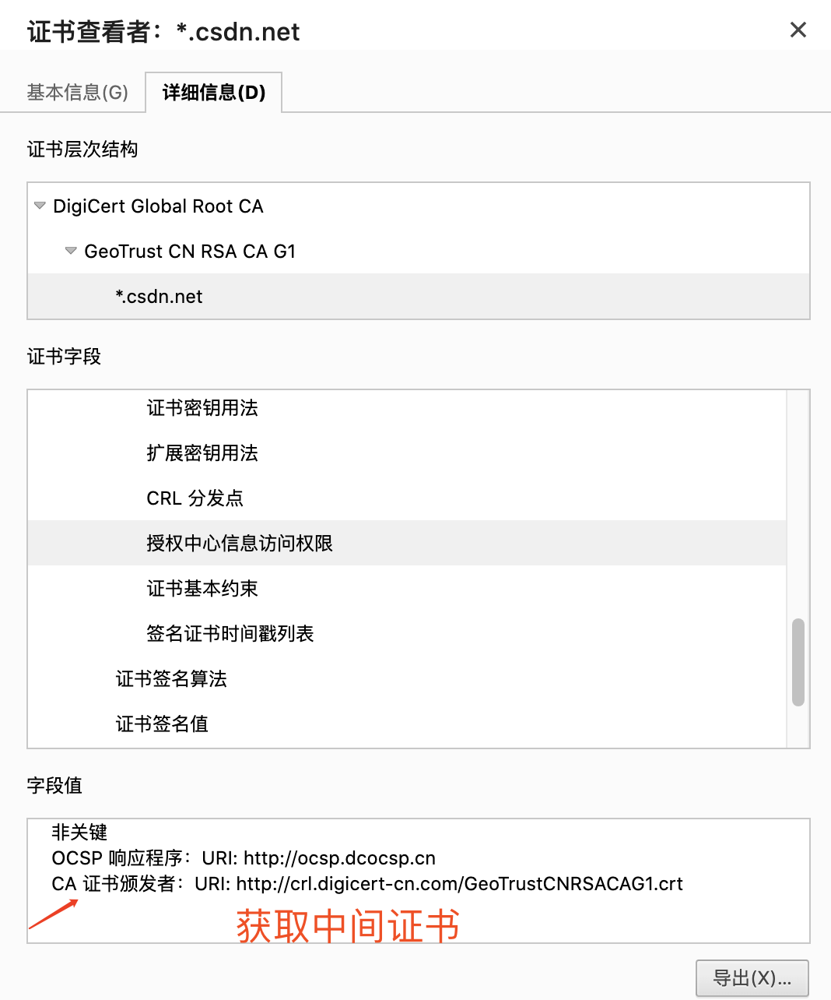

# 引言
## HTTPS vs HTTP
`HTTPS`协议是身披`SSL&TLS`协议外壳的`HTTP`，`HTTPS`和`HTTP`协议对比如下：
```bash
  HTTP协议         HTTPS协议
+----------+     +----------+
|   HTTP   |     |   HTTP   |
|          |     |----------|
|          |     |  SSL&TLS |
+----------+     +----------+
|TCP(传输层)|     |TCP(传输层)|
+----------+     +----------+
|IP(网络层) |     |IP(网络层) |
+----------+     +----------+
|    ...   |     |    ...   |
+----------+     +----------+
```
## 对称加密
+ 加密和解密同用一个密钥的方式。
+ 加密和解密过程速度很快，适合于大量数据的加密。
+ 主要的缺点是密钥的分发和管理问题，如果密钥泄漏，会导致信息安全受到威胁。

## 非对称加密
+ 发送方和接收方使用一对密钥来进行加密和解密，这对密钥包括公钥和私钥。
+ 公钥可以自由发布，用于加密数据，而私钥则只有接收方拥有，用于解密数据。
+ 非对称加密解决了对称加密中密钥分发和管理的问题，但加密和解密速度通常较慢，适合于加密小量数据或者用于密钥交换。

## 证书
证书用来确认通信方身份的真实性。证书的签名流程如下：
+ **打包**：`CA` 会把持有者的公钥，用途，颁发者，有效时间等信息进行打包，然后对这些信息进行`Hash`计算，得到一个`Hash`值。
+ **签名**：然后`CA`用自己的私钥将该`Hash`值加密，生成`Certificate Signature`。
+ **添加**：将`Certificate Signature`添加到证书文件中，形成数字证书。

客户端对证书身份的验证流程如下：
+ **打包**：客户端使用相同的`Hash`算法，对证书信息进行打包，`Hash`计算，得到一个`Hash`值`H1`。
+ **公钥解密**：使用`CA`机构的公钥对数字证书`Certificate Signature`内容进行解密，得到`Hash`值`H2`。
+ **比较**：如何`H1`和`H2`的值相同，则为可信证书。

实际中使用的都是**证书链**，证书链包含根证书、中间证书和服务器证书，一般终端设备或浏览器内置根证书。证书签发流程如下：
+ 根证书`CA`使用自己的私钥对中间证书进行签名，授权中间机构证书。
+ 中间机构使用自己的私钥对服务器证书进行签名，授权服务器证书。

证书链校验流程如下：
+ 客户端通过服务器证书中签发机构信息获取中间证书公钥，用中间证书公钥对服务器证书进行校验。
+ 客户端通过中间证书中签发机构信息在本地查找获取根证书公钥，用根证书公钥对中间证书进行校验。

证书链样例及中间证书获取如下图所示：


# HTTPS 通信流程
`HTTPS`通信分为如下三个阶段：
+ **TCP三次握手**
+ **TLS握手**
+ **HTTP数据传输（SSL加密）**

`HTTPS`使用对称加密和非对称加密两种方式，非对称加密用于握手阶段，对称加密用于数据传输阶段。

## TLS握手
`TLS`握手阶段流程如下：
+ **客户端**发送`Client Hello`报文开始`SSL`通信。`Client Hello`报文包含客户端支持的`SSL`版本，加密套件（`Cipher Suites`）列表，
客户端生成的一个 32 字节的随机数`R1`等。
+ **服务端**响应`Server Hello`响应报文。`Server Hello`响应报文包含`SSL`版本，加密套件（`Cipher Suites`）以及服务端生成的一个 32
位的随机数`R2`。其中加密套件是从接收的客户端加密套件中筛选出来的。
+ **服务端**继续发送`Certificate`、`Server Key Exchange`和`Server Hello Done`三个报文。
  + `Certificate`表示服务端证书。
  + `Server Key Exchange`表示一个对称密钥，用于`DH`算法，`RSA`算法不需要，没这个报文。
  + `Server Hello Done`表示服务端完成握手协议，通知客户端继续下一步。
+ **客户端**开始证书校验。
+ **客户端**发送`Client Key Exchange`报文。证书校验通过后，客户端获的服务端的公钥，
然后客户端生成一个随机数`R3`，并用获取的公钥加密此随机数生成`PreMaster Key`发送给服务端，
后面服务端接收到`PreMaster Key`后，用自己的私钥解密获取随机数`R3`，这样客户端和服务端都有随机数`R1`、
`R2`和`R3`，然后两端用相同的算法生成一个**对称密钥**，握手结束后，会通过该**对称密钥**传输应用数据。
+ **客户端**继续发送`Change Cipher Spec`报文，表示客户端接下来使用前面生成的**对称密钥**来传输数据。
+ **客户端**继续发送`Finished`报文，该报文包含连接至今全部报文的整体校验值，
握手协商是否成功要以服务端是否可以正确解密该报文为准。
+ **服务端**也发送`Change Cipher Spec`报文，表示服务端接下来使用前面生成的**对称密钥**来传输数据。
+ **服务端**也发送`Finished`报文。

# HTTPS 使用样例
## 自签名证书
### 创建根 CA 证书
+ 生成私钥
  ```bash
  openssl ecparam -out contoso.key -name prime256v1 -genkey
  ```
  这里使用`ecparam`加密算法，参数指定`prime256v1`，生成的密钥是`contoso.key`。
+ 生成自签名证书请求（CSR）
  ```bash
  openssl req -new -sha256 -key contoso.key -out contoso.csr
  ```
+ 生成证书
  ```bash
  openssl x509 -req -sha256 -days 365 -in contoso.csr -signkey contoso.key -out contoso.crt
  ```

### 创建服务器证书
