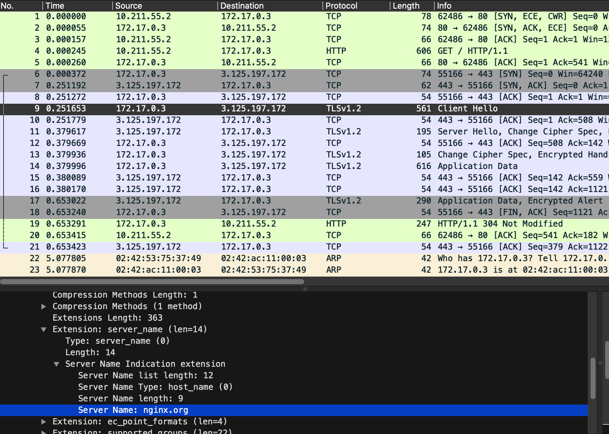
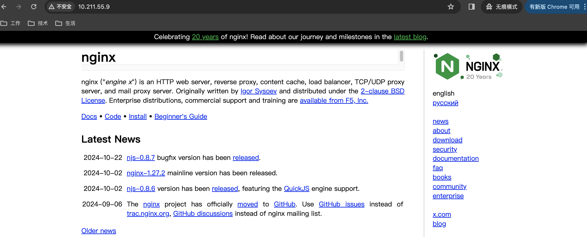

# 服务部署与配置
`nginx`服务采用`docker`容器部署。配置文件默认名为`nginx.conf`，存放路径是`/etc/nginx/nginx.conf`。部署命令样例如下：
```bash
sudo docker run -d --rm -p 80:80 --name my-nginx -v /home/ylq/workspace/nginx/nginx.conf:/etc/nginx/nginx.conf nginx:latest
```
配置文件`nginx.conf`由一系列的**指令**和**参数**组成。指令的样例如下：
```bash
# 一个简单的指令：指令名和参数之间以空格分割，结尾以;结尾
worker_processes 1;
# 一个块指令：在 {} 中可以包含其他的块指令和简单指令
http {...}
```
`nginx`中主要的**块指令**（以`{}`结束）如下：
+ `events`：包含通用的网络连接相关指令，例如`multi_accept`、`worker_connections`，`use`等指令。
+ `http`：包含处理`http/https`请求的各种配置指令，例如反向代理，缓存等。
+ `stream`：包含处理四层`TCP/UDP`流量的配置指令。
+ `server`：**定义在`http`或`stream`块中**，用于配置具体的虚拟主机。
+ `location`：**定义在`server`块中**，定义路径的匹配规则及其对应的处理方式。
+ `upstream`：**定义在`http`或`stream`块中**，用于配置后端服务器组，实现负载均衡、健康检查等。

下面给出`nginx.conf`配置文件样例：
```bash
user nobody; # a directive in the 'main' context

events {
    # configuration of connection processing
}

http {
    # Configuration specific to HTTP and affecting all virtual servers
    server {
        # configuration of HTTP virtual server 1
        location /one {
            # configuration for processing URIs starting with '/one'
        }
        location /two {
            # configuration for processing URIs starting with '/two'
        }
    }

    server {
        # configuration of HTTP virtual server 2
    }
}

stream {
    # Configuration specific to TCP/UDP and affecting all virtual servers
    server {
        # configuration of TCP virtual server 1
    }
}
```
可以通过如下命令检测配置文件`nginx.conf`的语法：
```bash
nginx -t -c <path>/nginx.conf

```
# Web 服务器
考虑如下的`nginx.conf`配置：
```bash
events {}

http {
    server {
        listen 80;
        server_name nginx-handbook.test;
        return 200 "Hello, happy\n";
    }
}
```
上述定义了一个虚拟服务`server`，服务名（域名）是`nginx-handbook.test`且监听`80`端口。请求成功后会返回`200`状态码，响应`Hello, happy\n`内容。
执行结果如下：
```bash
# 启动 nginx 服务
$ sudo docker run -d --rm -p 80:80 --name my-nginx -v /home/ylq/workspace/nginx/nginx.conf:/etc/nginx/nginx.conf nginx:latest

# 发送一个 http 请求
$ curl -i --resolve nginx-handbook.test:80:10.211.55.9 http://nginx-handbook.test
HTTP/1.1 200 OK
Server: nginx/1.27.1
Date: Mon, 04 Nov 2024 06:59:50 GMT
Content-Type: text/plain
Content-Length: 13
Connection: keep-alive

Hello, happy
```
在`nginx.conf`配置中可以配置多个`server`块，`nginx`通过以下两种方式区分一个请求应该被哪个`server`处理。
+ `listen`指令指定不同的监听端口。考虑如下配置：
  ```bash
  events {}

  http {
      server {
          listen 80;
          server_name nginx-handbook.test;
          return 200 "Hello, from pod 80\n";
      }
      server {
          listen 8080;
          server_name nginx-handbook.test;
          return 200 "Hello, from pod 8080\n";
      }
  }
  ```
  定义两个`server`，分别监听`80`和`8080`端口，其他配置完全一样。请求处理结果如下：
  ```bash
  # 启动 nginx 服务，暴露 80 和 8080 端口
  $ sudo docker run -d --rm -p 80:80 -p 8080:8080 --name my-nginx -v /home/ylq/workspace/nginx/nginx.conf:/etc/nginx/nginx.conf nginx:latest

  # 发送 http 请求
  $ curl --resolve nginx-handbook.test:80:10.211.55.9 http://nginx-handbook.test:80
  Hello, from pod 80
  $ curl --resolve nginx-handbook.test:8080:10.211.55.9 http://nginx-handbook.test:8080
  Hello, from pod 8080
  ```
+ `server_name`指令区分不同的`server`。考虑如下配置：
  ```bash
  events {}

  http {
      server {
          listen 80;
          server_name nginx-handbook.test;
          return 200 "Hello, from nginx-handbook.test.\n";
      }
      server {
          listen 80;
          server_name nginx-handbook.test-1;
          return 200 "Hello, from nginx-handbook.test-1.\n";
      }
  }
  ```
  定义两个`server`，分别指定`server_name`为`nginx-handbook.test`和`nginx-handbook.test-1`，其他配置完全一样。请求处理结果如下：
  ```bash
  # 重载 nginx 配置
  $ sudo docker restart my-nginx
  # 发送 http 请求
  $ curl --resolve nginx-handbook.test:80:10.211.55.9 http://nginx-handbook.test:80
  Hello, from nginx-handbook.test.
  $ curl --resolve nginx-handbook.test-1:80:10.211.55.9 http://nginx-handbook.test-1:80
  Hello, from nginx-handbook.test-1.
  ```
接下来看下`nginx`如何用作**静态的服务器**。首先准备一些静态文件如下：
```bash
$ ls srv/nginx-handbook-projects/static-demo/
about.html  index.html  mini.min.css  the-nginx-handbook.jpg
```
更新`nginx.conf`配置如下：
```bash
events {}

http {
    server {
        listen 80;
        server_name nginx-handbook.test;
        root /srv/nginx-handbook-projects/static-demo;
    }
}
```
配置中的`root`指令用于声明`server`的根目录。对于**此`server`接收的任何请求**，`root /srv/nginx-handbook-projects/static-demo`用于告诉`nginx`在`/srv/nginx-handbook-projects/static-demo/`目录下寻找文件。
默认情况下，`nginx`会寻找`index.html`文件。
```bash
# 重启 nginx，挂载静态文件
$ sudo docker run -d --rm -p 80:80 --name my-nginx -v /home/ylq/workspace/nginx/nginx.conf:/etc/nginx/nginx.conf -v /home/ylq/workspace/nginx/srv/nginx-handbook-projects/static-demo/:/srv/nginx-handbook-projects/static-demo/ nginx:latest
```

在浏览器请求结果如下：


截图显示`css`代码没有起作用，因为上面的`Index`、`About`和`Nothing`样式不对。直接访问`css`文件结果如下：
```bash
# 只显示请求头数据
$ curl -I --resolve nginx-handbook.test:80:10.211.55.9 http://nginx-handbook.test:80/mini.min.css
HTTP/1.1 200 OK
Server: nginx/1.27.1
Date: Mon, 04 Nov 2024 08:33:52 GMT
Content-Type: text/plain
Content-Length: 46887
Last-Modified: Thu, 31 Oct 2024 10:07:22 GMT
Connection: keep-alive
ETag: "672356da-b727"
Accept-Ranges: bytes
```
可以看到`Content-Type`的值是`text/plain`，期望应该是`text/css`。所以修改`nginx.conf`配置文件，增加`types`指令：
```bash
events {}

http {
    types {
        text/html html;  # 解析以 html 后缀的任何文件为 text/html 格式
        text/css css;    # 解析以 css 后缀的任何文件为 text/css 格式
    }
    server {
        listen 80;
        server_name nginx-handbook.test;
        root /srv/nginx-handbook-projects/static-demo;
    }
}
```
如果指定了`types`指令，`nginx`只会以`types`指令指定的类型解析，没匹配的类型都按默认的`text/plain`解析。重载`nginx`配置，
在浏览器重新请求结果如下：


可以看到`css`已经生效，`Index`、`About`和`Nothing`样式已经变为期望样式。

将每一个文件的解析格式在`types`中声明不太现实，因此`nginx`提供了`mime.types`文件，需要`include`指令引入即可。更改后的`nginx.conf`配置如下：
```bash
events {}

http {
    include /etc/nginx/mime.types;  # 使用 include 指令引入 mime.types 文件，效果和上面介绍的 types 一样
    server {
        listen 80;
        server_name nginx-handbook.test;
        root /srv/nginx-handbook-projects/static-demo;
    }
}
```
上面介绍了`nginx`作为静态服务器相关配置介绍，**接下来需要了解下`location`、变量、重定向，重写和`try_files`等指令用法**。

先看下`location`块用法，更新`nginx.conf`配置如下：
```bash
events {}

http {
    include /etc/nginx/mime.types;
    server {
        listen 80;
        server_name nginx-handbook.test;
        # 添加 location 块
        location /agatha {
            return 200 "Are you ok.\n";
        }
    }
}
```
重载`nginx`配置，请求结果如下：
```bash
# 请求 /agatha uri
$ curl --resolve nginx-handbook.test:80:10.211.55.9 http://nginx-handbook.test/agatha
Are you ok.
# 请求 /agatha-ooo uri
$ curl --resolve nginx-handbook.test:80:10.211.55.9 http://nginx-handbook.test/agatha-ooo
Are you ok.
```
上述请求结果可知，`location /agatha`是**前缀匹配**。不同类型的匹配规则如下：
+ **前缀匹配**：`location /agatha`。
+ **精确匹配**：`location = /agatha`。
+ **正则匹配（大小写敏感）**：`location ~ /agatha[0-9]`。
+ **正则匹配（大小写不敏感）**：`location ~* /agatha[0-9]`。

默认情况下匹配**优先级关系**：精确匹配 > 正则匹配 > 前缀匹配。修改`nginx.conf`配置文件如下：
```bash
events {}

http {
    include /etc/nginx/mime.types;
    server {
        listen 80;
        server_name nginx-handbook.test;
        location /agatha {
            return 200 "From prefix match.\n";
        }
        location = /agatha {
            return 200 "From exact match.\n";
        }
        location ~* /agatha[0-9] {
            return 200 "From regex match.\n";
        }
    }
}
```
重载`nginx`配置，请求结果如下，验证上述优先级关系：
```bash
$ curl --resolve nginx-handbook.test:80:10.211.55.9 http://nginx-handbook.test/agatha
From exact match.
$ curl --resolve nginx-handbook.test:80:10.211.55.9 http://nginx-handbook.test/agatha8
From regex match.
$ curl --resolve nginx-handbook.test:80:10.211.55.9 http://nginx-handbook.test/agatha-1
From prefix match.
```
但可以调整前缀匹配和正则匹配的默认优先级关系，通过**指定`location ^~ /agatha`使得前缀匹配的优先级高于正则匹配优先级**。

然后看下`nginx`中的**变量**。`set`指令可以在配置文件的任何地方声明新的变量，语法如下：
```bash
set $variable value;
```
变量的值可以是字符串，整数或者布尔值。除此之外，`nginx`还[内置了众多变量](https://nginx.org/en/docs/varindex.html)。
修改`nginx.conf`配置文件如下：
```bash
events {}

http {
    include /etc/nginx/mime.types;
    server {
        listen 80;
        server_name nginx-handbook.test;
        set $name $arg_name;  # 查询请求uri中的name参数值。
        return 200 "Host - $host\nURI - $uri\nArgs - $args\nname - $name\n";
    }
}
```
上述定义中的`$host`、`$uri`和`$args`都是`nginx`中内置的变量，`$name`是自定义变量。重载`nginx`配置，请求结果如下：
```bash
# 注意参数中的 & 需要加转译
$ curl --resolve nginx-handbook.test:80:10.211.55.9 http://nginx-handbook.test/agatha?name=yang\&my=1
Host - nginx-handbook.test
URI - /agatha
Args - name=yang&my=1
Name - yang
```
接下来看下`nginx`中的**重定向**和**重写**指令。更新`nginx.conf`配置如下：
```bash
events {}

http {
    include /etc/nginx/mime.types;
    server {
        listen 80;
        server_name nginx-handbook.test;
        root /srv/nginx-handbook-projects/static-demo;
        location = /index_page {
                return 307 /index.html;  # 返回 307 重定向
        }
    }
}
```
上述配置定义了对于`uri`是`/index_page`的请求，会返回`307`，重定向`uri`为`/index.html`。如果在浏览器中访问，
会发现请求的`uri`自动变为`/index.html`。请求结果如下：


重写指令`rewrite`会内部更改`uri`。更新`nginx.conf`配置如下：
```bash
events {}

http {
    include /etc/nginx/mime.types;
    server {
        listen 80;
        server_name nginx-handbook.test;
        root /srv/nginx-handbook-projects/static-demo;
        rewrite /index_pag /index.html;  # 内部重写 uri
    }
}
```
如果在浏览器访问`/index_pag`的`uri`，则可以成功访问，且浏览器的`url`不会自动更改。请求结果如下：


**重写的代价比重定向代价高，因为重写会导致`nginx`重新评估`server`块。**

最后看下`nginx`中的 **`try_files`指令**。更新`nginx.conf`配置如下：
```bash
events {}

http {
    include /etc/nginx/mime.types;
    server {
        listen 80;
        server_name nginx-handbook.test;
        root /srv/nginx-handbook-projects/static-demo;
        try_files $uri $uri/ /not_found;
        location /not_found {
            return 404 "sadly, you've hit a brick wall buddy.\n";
        }
    }
}
```
定义的`try_files $uri $uri/ /not_found;`配置含义是`nginx`收到请求后首先查找`$uri`指定的资源是否存在，如果不存在，
则将请求的`uri`当成一个目录，会自动寻找`index.html`文件，如果还不存在则会走到`/not_found`的`location`块。请求结果如下：
```bash
# 请求 about.html 资源
$ curl -I --resolve nginx-handbook.test:80:10.211.55.9 http://nginx-handbook.test/about.html
HTTP/1.1 200 OK
Server: nginx/1.27.1
Date: Tue, 05 Nov 2024 08:10:55 GMT
Content-Type: text/html
Content-Length: 960
Last-Modified: Thu, 31 Oct 2024 10:07:22 GMT
Connection: keep-alive
ETag: "672356da-3c0"
Accept-Ranges: bytes

# 请求不存在的资源
$ curl --resolve nginx-handbook.test:80:10.211.55.9 http://nginx-handbook.test/about_1.html
sadly, you've hit a brick wall buddy.
```

# 反向代理
反向代理是指对**服务端**进行代理。也就是客户端和代理服务器`nginx`建立连接，代理服务器`nginx`接收客户端的请求，代理服务器`nginx`和后端建立连接，
然后代理服务器`nginx`将请求转发给后端服务端，同时将后端服务的响应返回给请求的客户端。

更改`nginx.conf`配置如下：
```bash
events {}

http {
    include /etc/nginx/mime.types;
    server {
        listen 80;
        server_name nginx.test;
        location / {
            proxy_pass "https://nginx.org/";
            proxy_ssl_server_name on;
            error_log /var/log/nginx/my_error.log;
        }
    }
}
```
定义中的`proxy_pass`指令指定了被代理的服务端地址，样例中是`https://nginx.org/`。指令`proxy_ssl_server_name on`用于代理`https`的时候设置，
表示开始`SNI`功能，以便`nginx`和代理服务器`https://nginx.org/`在`TLS`握手时提供代理服务器域名`nginx.org`。未启用`SNI`会导致部分服务器无法识别请求的主机名，
返回握手失败错误。

在`nginx`代理服务器和被代理的地址`https://nginx.org/`建立连接时候抓包结果如下：



可知，在指定`proxy_ssl_server_name on`指令后，`nginx`代理端在和被代理的`https://nginx.org/`地址建立`TLS`连接时，
在`TLS`拓展中会指定`Server Name: nginx.org`域名，也就是被代理服务器的域名。

下面在浏览器中直接请求`nginx`代理服务器，使用`http`协议，结果如下：



也可以向被代理的地址的请求中添加`header`，样例如下：
```bash
proxy_set_header Host $host;
proxy_set_header X-Real-IP $remote_addr;
```
如果想屏蔽某个`header`，也就是不传到被代理的服务，可以通过`proxy_set_header`指令将其设置为空，样例：
```bash
proxy_set_header Accept-Encoding "";
```

**默认情况下，`nginx`内部会缓存被代理服务的响应，直到整个响应接收完成，`nginx`才会发送给客户端**。
> 这种缓存行为针对被代理服务处理块，客户端处理慢的场景会优化被代理服务处理效率。因为被代理服务和`nginx`之间交互很快，
可以加快被代理服务的处理效率，进而提高客户端的性能。

可以通过`proxy_buffers`指令控制缓存的开或者关。使用缓存的样例如下：
```bash
proxy_buffers 16 4k;
proxy_buffer_size 2k;
```
其中`proxy_buffer_size`指定的缓存大小用于存储响应的第一部分，也就是**响应头**。

如果不使用缓存，被代理服务返回的响应会同步返回给客户端。关闭缓存的样例如下：
```bash
proxy_buffering off;
```
关闭缓存后，`nginx`仅仅使用`proxy_buffer_size`指定的大小缓存响应头。

`nginx`向被代理的服务地址发送请求时，可以指定固定的源`IP`地址，通过`proxy_bind`指令实现。样例如下：
```bash
location / {
    proxy_pass http://backend;
    proxy_bind 192.168.1.10;
}
```
在此配置中，`nginx`会绑定到`192.168.1.10`这个本地`IP`地址，发起对`http://backend`的请求。

# 负载均衡
## 七层负载均衡
`nginx`作为负载均衡时需要使用`upstream`指令定义一组后端服务。修改`nginx.conf`配置文件如下：
```bash
events {}

http {
    upstream backend {
        server 192.168.1.112:8080;
        server 192.168.1.113:8080;
        server 192.168.1.114:8080;
    }
    server {
        listen 80;
        server_name nginx-load-balancer.test;
        location / {
            proxy_pass http://backend;
        }
    }
}
```
其中`upstream`指定的三个后端服务在`k8s`集群信息如下：
```bash
$ kubectl -n default get pods -o wide
NAME                         READY   STATUS    RESTARTS       AGE   IP              NODE                      NOMINATED NODE   READINESS GATES
hostnames-55f7dfb6db-2hvc5   1/1     Running   0              14m   192.168.1.114   ylq-ubuntu-server-node1   <none>           <none>
hostnames-55f7dfb6db-c8vlx   1/1     Running   0              14m   192.168.1.112   ylq-ubuntu-server-node1   <none>           <none>
hostnames-55f7dfb6db-vxmpt   1/1     Running   0              14m   192.168.1.113   ylq-ubuntu-server-node1   <none>           <none>
```
为了将请求传递给后端服务组，需要将组的名字`backend`在`proxy_pass`指令中指定。更新`nginx`配置，请求结果如下：
```bash
$ curl --resolve nginx-load-balancer.test:80:10.211.55.9 http://nginx-load-balancer.test
hostnames-55f7dfb6db-c8vlx
$ curl --resolve nginx-load-balancer.test:80:10.211.55.9 http://nginx-load-balancer.test
hostnames-55f7dfb6db-vxmpt
$ curl --resolve nginx-load-balancer.test:80:10.211.55.9 http://nginx-load-balancer.test
hostnames-55f7dfb6db-2hvc5
```
可以看到，`upstream`指令指定的三个后端服务依次被请求（`nginx`默认的负载均衡算法是轮询）。

**负载均衡算法**有如下：
+ 轮询（`Round Robin`）：请求被均匀分发到后端服务组，每一个服务可以配置`weight`参数。
  ```bash
  upstream backend {
     # no load balancing method is specified for Round Robin
     server backend1.example.com;
     server backend2.example.com;
  }
  ```
+ 最少连接（`Least Connections `）：请求会被分发到有最少活跃连接的服务，每一个服务可以配置`weight`参数。
  ```bash
  upstream backend {
      least_conn;
      server backend1.example.com;
      server backend2.example.com;
  }
  ```
+ 源地址哈希（`IP Hash`）：根据请求客户端`IP`的`Hash`值选择一个后端服务。确保相同客户端的请求被分发到相同的后端服务。
  ```bash
  upstream backend {
      ip_hash;
      server backend1.example.com;
      server backend2.example.com;
  }
  ```
+ 一致性哈希（`Consistent Hashing`）：适用于分布式系统。根据用户定义的`key`，可以是文本字符串或者变量，
决定一个请求被分发到哪一个后端服务。
  ```bash
  upstream backend {
      hash $request_uri consistent;
      server backend1.example.com;
      server backend2.example.com;
  }
  ```
  上述定义的`key`是请求的`uri`。
+ 最少响应时间（`Least Time `）：根据`least_time`指令指定的参数计算最低响应延时，参数有如下选项：
  + `header`：从后端服务接收**响应头**时间。
  + `last_byte`：从后端服务接收**完整响应**时间。
  + `last_byte inflight` – 从后端服务接收**完整响应**时间，同时考虑不完整响应。

  ```bash
  upstream backend {
      least_time header;
      server backend1.example.com;
      server backend2.example.com;
  }
  ```
+ 随机（`Random`）：每一个请求都随机选择一个后端服务。如果指定了`two`参数，`nginx`首先根据`weight`参数随机选择两台服务器，
然后在选择的两台服务器中根据以下指定方式选择一个：
  + `least_conn`：最少活跃连接数。
  + `least_time=header`：从后端服务接收响应头最少时间。
  + `least_time=last_byte`：从后端服务接收完整响应最少时间。

  ```bash
  upstream backend {
      random two least_time=last_byte;
      server backend1.example.com;
      server backend2.example.com;
      server backend3.example.com;
  }
  ```
**设置后端服务权重**。默认情况下，`nginx`使用轮询负载均衡算法，可以对每个服务指定`weight`参数调整被选择的权重，`weight`参数默认值是`1`。
```bash
upstream backend {
    server backend1.example.com weight=5;
    server backend2.example.com;
    server 192.0.0.1 backup;
}
```
上面的样例中`backend1.example.com`服务有`weight=5`，而其他两个服务有`weight=1`。其中`192.0.0.1`的服务被标记为`backup`，
表示此服务是个备份服务，只有其他两个主要服务都不可用才会接收请求。每`6`个请求中有`5`个被分发到`backend1.example.com`，
`1`个被分发到`backend2.example.com`。

**设置服务慢启动**。服务慢启动可以预防刚恢复的服务因为连接过多，负载过重导致的请求超时进而导致服务再次标记为失败。
通过使用`slow_start`参数允许服务逐渐恢复`weight`值从`0`到指定值。
```bash
upstream backend {
    server backend1.example.com slow_start=30s;
    server backend2.example.com;
    server 192.0.0.1 backup;
}
```
样例中指定了`slow_start=30s`，表示在`30`秒内逐步增加请求的分配比例。刚加入的服务器不会立即接收全量流量，
而是在`30`秒时间内逐步增加负载。

如果在后端服务组中只有一个后端服务，则`max_fails`、`fail_timeout`和`slow_start`参数会被忽略。


**设置会话持久性**。会话持久性用于确保同一用户的请求在一个会话期间始终被转发到同一台服务器。上面介绍的`hash`和`ip_hash`负载均衡算法已经保持了会话持久性。

会话持久性方法可以通过`sticky`参数指定。
+ `Sticky cookie`：当客户端首次请求时，`nginx`会在响应中添加一个标记后端服务的`Cookie`，之后的请求会根据该`Cookie`将客户端请求分配到同一后端服务。
  ```bash
  upstream backend {
      server backend1.example.com;
      server backend2.example.com;
      sticky cookie srv_id expires=1h domain=.example.com path=/;
  }
  ```
  其中`srv_id`表示`cookie`的名字。`expires=1h`表示此`cookie`的过期时间是`1h`。`domain=.example.com`定义了此`cookie`的作用域（`example.com`和它的所有子域，如`www.example.com`、`api.example.com`均有效）。
  `path=/`定义了此`cookie`的路径，表示对整个网站路径有效，例如`/home`等。

+ `Sticky route`：客户端首次请求时，`nginx`将随机或按其他策略分配一个后端服务，并为该客户端分配`route=x`标识。随后，在响应中设置`cookie`或在`URL`参数中加入`route=x`标识。
后续的请求，`nginx`根据配置可能会检查请求中`cookie`或者`URL`中是否有`route=x`标识，并将请求转发对应的后端服务。
  ```bash
  upstream backend {
      server backend1.example.com route=a;
      server backend2.example.com route=b;
      sticky route $route_cookie $route_uri;
  }
  ```

+ `Sticky learn`：`nginx`会学习并跟踪每个客户端的会话状态，将客户端后续请求保持在同一个后端服务上。
  ```bash
  upstream backend {
     server backend1.example.com;
     server backend2.example.com;
     sticky learn
         create=$upstream_cookie_examplecookie
         lookup=$cookie_examplecookie
         zone=client_sessions:1m
         timeout=1h;
  }
  ```
  其中`create=$upstream_cookie_examplecookie`表示客户端首次请求时，**响应的后端服务在`response`中**创建一个`examplecookie`的`cookie`的会话。
  然后`nginx`将`examplecookie`的`cookie`和后端服务的映射关系存储在共享内存中。

  `lookup=$cookie_examplecookie`表示在客户端后续请求中查找`examplecookie`的`cookie`。

  `zone=client_sessions:1m`表示存放会话映射关系的共享内存，大小是`1Mb`，共享内存名字是`client_sessions`。

> `cookie`通常用于保存会话状态、用户偏好、跟踪用户活动等信息。是一组键值对，通常以`key=value`的格式存储。
服务端通过`HTTP`响应头`Set-Cookie`，样例如下：
>  ```bash
>  HTTP/1.1 200 OK
>  Set-Cookie: user_id=12345; Expires=Tue, 07 Nov 2023 13:00:00 GMT; Path=/; Domain=example.com; Secure; HttpOnly
>  ```
> 客户端请求通过设置`Cookie`：
> ```bash
> GET /profile HTTP/1.1
> Host: example.com
> Cookie: user_id=12345
> ```
> **`cookie`的完整信息在服务端保存，根据客户端传递的`cookie`标识获取完整`cookie`信息**。所以解释了`sticky learn`适合高并发复杂场景，`sticky cookie`适合简单场景。

**设置后端服务的连接数限制**。通过`max_conns`指令可以设置某个后端服务最大活跃连接数。
```bash
upstream backend {
    server backend1.example.com max_conns=3;
    server backend2.example.com;
    queue 100 timeout=70;
}
```
上面样例中`backend1.example.com max_conns=3`表示后端服务`backend1.example.com`最多同时处理三个并发请求。
超过三个请求到达`backend1.example.com`服务会进入队列排队。`backend2.example.com`表示没有连接数限制，直到系统上线。
`queue 100 timeout=70`表示在整个`upstream`中，如果当前的服务器已达到连接上限，多出的请求会进入最大`100`个请求的队列，
如果请求队列满或者请求在超时时间后没有被后端服务处理，则客户端收到错误。

如果在其他的`worker_processes`中有打开的空闲的`keepalive`连接，则`max_conns`参数会忽略，也就是某个服务实际连接数可能超过`max_conns`值。

**多个`worker_processes`共享数据**。指令`zone`可以指定一个共享内存以及大小。
+ 如果`upstream`块不指定`zone`指令，则每一个`worker_processes`都会保持一份`server group`配置的备份，
以及各自的相关计数器。计数器包括每一个后端服务当前的连接数，每一个服务请求失败数等。
+ 如果`upstream`块指定`zone`指令，则`server group`配置保存在共享内存中，所有`worker_processes`共享此一份配置，使用相同的计数器。

**配置`HTTP`负载均衡使用`DNS`**。指令`resolver`可以指定`nginx`使用的`DNS`服务器地址。
```bash
http {
    resolver 10.0.0.1 valid=300s ipv6=off;   # 配置 resolve 指令 
    resolver_timeout 10s;
    server {
        location / {
            proxy_pass http://backend;
        }
    }
    upstream backend {
        zone backend 32k;
        least_conn;
        # ...
        server backend1.example.com resolve;  # 需要指定 resolve 参数
        server backend2.example.com resolve;
    }
}
```
上述定义中`resolver 10.0.0.1 valid=300s ipv6=off;`定义了`DNS`服务器地址`10.0.0.1`，`valid=300s`表示当前解析的`DNS`记录有效时间是`300s`，
超过此时间后`nginx`会重调用`DNS`服务重新解析。

## 四层负载均衡
> 为了支持`TCP`或`UDP`负载均衡，`nginx`编译需要有`--with-stream`参数。

四层负载均衡或者反向代理都需要**在`stream`块指令**中配置（上面介绍的七层是在`http`块指令中配置）。修改`nginx.conf`的配置如下：
```bash
stream {
    upstream stream_backend {
        least_conn;  # 最少连接负载均衡算法，可以是之前介绍的其他负载均衡算法
        server backend1.example.com:12345 weight=5;
        server backend2.example.com:12345 max_fails=2 fail_timeout=30s;
        server backend3.example.com:12345 max_conns=3;
    }

    upstream dns_servers {
        least_conn;
        server 192.168.136.130:53;
        server 192.168.136.131:53;
        server 192.168.136.132:53;
    }
    # 代理 TCP 流服务
    server {
        listen        12345;
        proxy_pass    stream_backend;
        proxy_timeout 3s;
        proxy_connect_timeout 1s;
    }
    # 代理 UDP 流服务
    server {
        listen     53 udp;  # 指定 udp 协议类型
        proxy_pass dns_servers;
    }
    # 只有一个后端服务，不需要配置 upstream
    server {
        listen     12346;
        proxy_pass backend4.example.com:12346;  # 如果域名解析多个地址，则使用轮询负载均衡算法
    }
}
```
定义中的`proxy_connect_timeout`指令设置了和被代理服务**建立连接的超时时间**。`proxy_timeout`指令设置了和被代理服务建立连接后，
**等待响应数据的超时时间（响应数据包含读或写）**。如果在超时时间内，没有读或写数据，则连接关闭。

测试使用的`nginx.conf`配置如下：
```bash
events {}

stream {
    upstream backend {
        hash $remote_addr;
        server 192.168.1.121:8080;
        server 192.168.1.122:8080;
        server 192.168.1.124:8080;
    }
    server {
        listen 80;
        server_name nginx-load-balancer.test;
        proxy_pass backend;
        proxy_timeout 3s;
        proxy_connect_timeout 1s;
    }
}
```
使用`hash`负载均衡，`key`是源`IP`地址。查看集群后端服务`Pod`信息如下：
```bash
$ kubectl -n default get pods -o wide
NAME                         READY   STATUS    RESTARTS        AGE   IP              NODE                      NOMINATED NODE   READINESS GATES
hostnames-55f7dfb6db-2hvc5   1/1     Running   1 (116m ago)    29h   192.168.1.124   ylq-ubuntu-server-node1   <none>           <none>
hostnames-55f7dfb6db-c8vlx   1/1     Running   1 (116m ago)    29h   192.168.1.121   ylq-ubuntu-server-node1   <none>           <none>
hostnames-55f7dfb6db-vxmpt   1/1     Running   1 (116m ago)    29h   192.168.1.122   ylq-ubuntu-server-node1   <none>           <none>
```
更新`nginx`的配置，多次请求结果如下：
```bash
$ curl --resolve nginx-load-balancer.test:80:10.211.55.9 http://nginx-load-balancer.test
hostnames-55f7dfb6db-vxmpt
$ curl --resolve nginx-load-balancer.test:80:10.211.55.9 http://nginx-load-balancer.test
hostnames-55f7dfb6db-vxmpt
$ curl --resolve nginx-load-balancer.test:80:10.211.55.9 http://nginx-load-balancer.test
hostnames-55f7dfb6db-vxmpt
```
请求结果符合负载均衡算法预期。从同一个客户端，固定一个后端服务返回。

## 健康检查
**被动健康检查**。通过指令`fail_timeout`和`max_fails`设置了后端服务在`fail_timeout`指定的时间内失败次数达到`max_fails`指定的值，
则`nginx`将此后端服务标记为不可用。同时在`fail_timeout`指定的时间内，不会将请求转发到此服务。
```bash
upstream backend {
    server backend1.example.com;
    server backend2.example.com max_fails=3 fail_timeout=30s;
}
```
上述`backend2.example.com`服务如果在`30s`内失败的请求数达到`3`次，则`nginx`标记次服务不可用`30s`。
如果服务组里只有一个后端服务，则`fail_timeout`和`max_fails`参数被忽略。

**主动健康检查**。`nginx`周期性给每个后端服务发送健康检查请求，检查响应是否正确。通过`health_check`指令实现。
```bash
http {
    upstream backend {
        zone backend 64k;  # 需要开启 zone 指令，共享内存
        server backend1.example.com;
        server backend2.example.com;
        server backend3.example.com;
        server backend4.example.com;
    }
    server {
        location / {
            proxy_pass http://backend;
            health_check;  # 使用 health_check 主动健康检查指令
        }
    }
}
```
上面样例配置默认行为是：每`5s`，`nginx`会发送一个`uri`是`/`的请求到每一个后端服务。如果出现请求错误（后端服务响应的状态码不在`200-399`之间）或者超时，
则健康检查失败，`nginx`会将此服务标记为不健康，直到下次健康检查通过。

默认行为可以更改，也就是`health_check`指令后可以加参数，例如（完整可以查官方文档）：
```bash
location / {
    proxy_pass   http://backend;
    health_check interval=10 fails=3 passes=2;
}
```

`TCP`健康检查类似，`health_check`指令在`server`块指令中。
