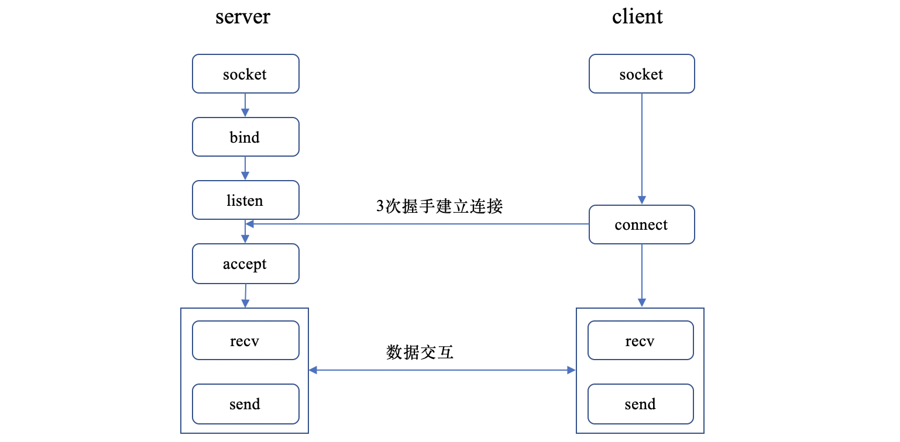
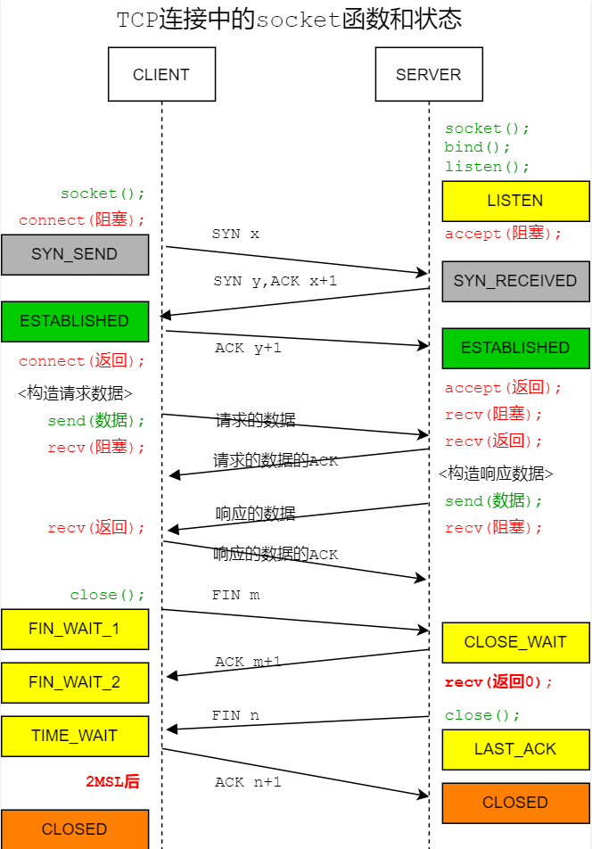

# 概述
基于`TCP`的`Socket`编程流程如下：

基于`TCP`的`socket`状态流转如下：<br>


# Socket API 功能
## bind
**作用**：将 IP 地址/端口信息绑定在`socket`相关数据结构上，并且根据通过端口映射，将`socket`指针保存在内核哈希表里。

工作原理：
+ 确保套接字参数`socketfd`（一个整数）小于`NR_OPEN`配置。
  > `NR_OPEN`表示系统支持的最大文件描述符数量（Ubuntu 测试值为 1048576），此值在编译时确定，在运行时不可更改，如果更改需要重新编译内核。
  使用命令`sysctl fs.nr_open`或`cat /proc/sys/fs/nr_open`查看。
+ 内核通过拉链哈希表的方式来管理所有的`bind`的`socket`。哈希表是由数组和链表组成的，哈希槽上保存的是哈希冲突的（多个）`bucket`，
它们用链表串联一起，遍历链表找出对应端口所在的`bucket`，下面的`tbx`就是一个`bucket`。哈希表结构如下：
  ```bash
    bhash
  +------+
  |  ... |
  +------+      +------+      +------+      +------+
  | head | <==> | tb1  | <==> | tb2  | <==> | ...  |
  +------+      +------+      +------+      +------+
  |  ... |
  +------+
  ```
  端口值是计算哈希值的一个参数，当计算找到哈希槽位以后，遍历所有的`bind`状态的`socket`，目的是为了判断是否冲突。
  + 如果在哈希表里**找到**了对应的`bucket`满足其网络命名空间和端口号与正在进行绑定的`socket`一样，
  说明正在绑定的端口已经被绑定过了。查看已经绑定的`socket`和正在绑定的`socket`是否都开启了`SO_REUSEADDR`且正在绑定的`socket`不是`listen`状态，
  或者查看已经绑定的`socket`和正在绑定的`socket`是否都开启了`SO_REUSEPORT`且在相同的用户空间下，
  如果上述条件为真则走绑定成功逻辑，将正在绑定的`socket`作为一个`bucket`添加到哈希表中，
  否则返回绑定失败，也就是看到端口已被占用错误。
  + 如果**没有找到**`bucket`满足其网络命名空间和端口号与正在进行绑定的`socket`一样，说明正在绑定的端口之前没有被绑定过，
  直接走绑定成功逻辑，将正在绑定的`socket`作为一个`bucket`添加到哈希表中。

IP 地址的绑定在端口绑定之前就已经完成。

## listen
**作用**：申请和初始化接收队列，包括**全连接队列**和**半连接队列**。

工作原理：
+ 获取内核参数`net.core.somaxconn`，比较用户传的`backlog`参数和`net.core.somaxconn`值，
取二者最小值。所以用户传的`backlog`参数如果比`net.core.somaxconn`值大，则`backlog`参数不起作用。
  > `net.core.somaxconn`是 Linux 内核参数，用于定义 TCP 栈可以接受的最大挂起连接数。
  当服务器收到连接请求的速度超过其处理速度时，这些连接会被放入一个队列中等待处理。
  该参数用于确定了这个队列的最大大小。
  >
  > 将`net.core.somaxconn`设置为较高的值对于高流量服务器很有用，可以避免因队列溢出而丢弃连接请求。
  但是，设置得太高可能会导致资源耗尽，因此根据系统的具体要求和资源进行调整很重要。
  使用如下命令查看`net.core.somaxconn`值：
  >  ```bash
  >  sysctl net.core.somaxconn
  >  或编辑
  >  /etc/sysctl.conf 文件
  >  ```
+ 定义**全连接队列**和**半连接队列**数据对象。其中**全连接队列**是链表数据结构，
因为后面`accept`时只需先进先出即可，不需要复杂的查找工作。**半连接队列**是`hash`表数据结构，
因为服务端在第三次握手的时候，需要快速查找第一次握手的`request_sock`对象。
+ 计算**半连接队列**的长度。计算规则如下：
  ```bash
  # 取 backlog、net.core.somaxconn 和 net.ipv4.tcp_max_syn_backlog 三者最小值
  nr_table_entries = min(backlog, net.core.somaxconn, net.ipv4.tcp_max_syn_backlog)
  # 确保值 >= 8，避免用户传入一个太小的值导致无法建立连接
  nr_table_entries = max(nr_table_entries, 8)
  # 用来上对齐到 2 的整数幂次的
  nr_table_entries = roundup_pow_of_two(nr_table_entries + 1)

  样例说明如下
  backlog = 5   net.core.somaxconn = 128   net.ipv4.tcp_max_syn_backlog = 4096
  则计算结果 nr_table_entries = roundup_pow_of_two(8 + 1) = 16
  ```
  > `net.ipv4.tcp_max_syn_backlog` 是一个 Linux 内核参数，用于控制 TCP 协议的 SYN 队列（**半连接队列**）的最大长度。
  在 TCP 握手过程中，当客户端向服务器发送 SYN 包时，服务器会将其放入一个队列（**半连接队列**）中等待处理。
  这个参数就是用来限制这个队列的最大长度，防止服务器过载或者遭受 SYN 攻击。
  >
  > 当 SYN 队列（**半连接队列**）满了之后，新的连接请求就会被拒绝，
  这样可以防止服务器因为处理过多的连接请求而过载。通常情况下，这个参数的默认值是比较保守的，
  但是在某些情况下（比如高负载环境），可能需要调整它的值以适应更多的连接请求。
+ 根据**半连接队列**大小，申请**半连接队列**需要的内存。
  > 半连接队列上的每一个元素是一个指针（struct request_sock *），半连接对象`request_sock`在握手过程中分配，
  计算完`hash`值挂到对应的指针上。
+ 设置**全连接队列**的最大长度为`backlog`和`net.core.somaxconn`间的最小值。

为了性能考虑，内核只记录 2 的幂次表示半连接队列的大小，例如假设半连接队列长度是 256，
则内核记录半连接队列大小`max_qlen_log = 8`（2 的 8 次方为 256）。

**全连接队列**大小是`backlog`和`net.core.somaxconn`之间的最小值。
**半连接队列**大小和`backlog`、`net.core.somaxconn`和`net.ipv4.tcp_max_syn_backlog`有关。

## connect
**作用**：和服务端建立建立连接。

工作原理：
+ 选择一个可用端口。
  + 如果在`connect`之前调用过`bind`，则直接选择之前绑定的端口。
  + 如果在`connect`之前没有调用过`bind`，则读取`net.ipv4.ip_local_port_range`内核参数获取本地端口配置。
    > `net.ipv4.ip_local_port_range`参数默认值是 32768 60999，表示可用端口范围。可以修改此内核参数，
    以扩大可选端口范围。

    使用`for`循环在可用端口范围内查找可用端口。伪代码如下：
    ```bash
    # remaining 表示可用端口数，offset 是个随机数
    # 从某个随机数开始遍历查找可用端口
    for (i = 1; i <= remaining; i++)
      port = low + (i + offset) % remaining;
    ```
    对于每一个候选的端口查看是否在`net.ipv4.ip_local_reserved_ports`内核参数指定的范围中，
    如果在的话就不能用。如果不在内核参数`net.ipv4.ip_local_reserved_ports 设置`指定的范围中，
    则查找一个记录端口使用`hash`表（整个系统中会维护一个所有使用过的端口的哈希表），
    + 如果在`hash`表没有找到，则说明当前候选端口可用，返回可用端口。
    + 如果在`hash`表找到，表示有其它连接已经使用这个端口了。进一步会遍历记录所有`ESTABLISH`状态`socket`的`hash`表，
    比较已连接`socket`使用的四元组和当前正在建立连接的四元组是否完全一致，如果完全一致，
    返回`-EADDRNOTAVAIL`错误，否则返回可用端口。
    > 实际比较的不仅仅是四元组，还包括使用的协议等，也就是五元组。
    四元组（源 IP，源端口，目的 IP，目的端口）样例如下：
    > ```bash
    > # 192.169.1.101 客户端   192.168.1.100 服务端
    > 连接1：192.168.1.101 5000 192.168.1.100 8090
    > 连接2：192.168.1.101 5000 192.168.1.100 8091
    > ```

    遍历完所有可用端口没有找到可用端口，则返回`-EADDRNOTAVAIL`（`Cannot assign requested address`）错误。
+ 发送`SYN`包

一台客户端机器最大能建立的连接数不止 65535，只要`server`够多，机器资源多，可建立的连接数没有上限。

客户端一般不要使用`bind`操作，因为`bind`操作会使得`connect`的端口选择方式无效，
会使用`bind`内部的端口选择逻辑（如果指定端口为 0），`bind`操作端口选择参考上面 **bind**
解释，其不会检查`ESTABLISH`状态`socket`的`hash`表，默认情况下一个端口只会使用一次。
> 上面的选择端口的都是从`net.ipv4.ip_local_port_range`范围中的某一个随机位置开始循环的。
如果可用端口充足，则能快一点找到可用端口，循环很快就能退出。假设实际中`net.ipv4.ip_local_port_range`中的端口快被用光了，
这时候内核大概率循环多轮才能找到，会导致`connect`系统调用的`CPU`开销的上涨。
所以，最好不要等到端口不够用了才加大`net.ipv4.ip_local_port_range`的范围，而是事先就应该保持一个充足的范围。

## accept
**作用**：从已经建立好的**全连接队列中**取出第一个返回给用户进程。

工作原理：
+ 内核仍然是通过`hash` + 拉链的方式来保存所有的`listen`状态的`socket`。如下所示：
  ```bash
    listening_hash
  +----------------+
  |       ...      |
  +----------------+      +---------+      +----------+      +------+
  |      head      | <==> | socket1 | <==> |  socket2 | <==> | ...  |
  +----------------+      +---------+      +----------+      +------+
  |       ...      |
  +----------------+
  ```
  当有多个进程都`bind`和`listen`了同一个端口的时候。有客户端连接请求到来的时候就涉及到选择哪个`socket`（进程）进行处理的问题。
+ 在`accept`内部，会对`hash`值相同的所有`listen`状态的`socket`计算匹配分，匹配分最高的`socket`会被选中。基于匹配分规则样例说明：
假设一台机器有两个 IP 地址，分别是`10.0.0.1`和`10.0.0.2`，在服务器上启动三个服务进程如下：
  ```bash
  进程A: ./webserver.py 10.0.0.1 8888 
  进程B: ./webserver.py 0.0.0.0 8888
  进程C: ./webserver.py 127.0.0.1 8888
  ```
  + 如果客户端指定`10.0.0.1:8888`，则 A 进程会优先执行。因为匹配到 A 进程的`socket`时，
  发现握手包中的目的 IP 和 A 进程`socket`的 IP 地址完全匹配，则进程 A 的`socket`得最高分 4。
  + 如果客户端指定`10.0.0.2:8888`，由于进程 B 的`socket`监听`0.0.0.0`，
  则进程 B 的`socket`不需要进行目的 IP 匹配，其得分 2，由于没有更高分，所以进程 B 的`socket`会被选择。
  + 如果客户端指定`127.0.0.1:8888`，则进程 C 的`socket`会匹配得 4 分，进程 B 的`socket`得分 2，
  则进程 C 的`socket`会被选中。
  + 如果有多个`socket`的匹配分一样，则内核通过`next_pseudo_random32`进行随机选择，
  在内核态做**负载均衡**，选择一个`socket`。

## recv
网络收包的大概流程如下：
+ 数据帧到达网卡后，网络驱动以 DMA 的方式把网卡上的数据写到内存`RingBuffer`中。
  > 当`RingBuffer`满的时候，新来的数据包将给丢弃。`ifconfig`查看网卡的时候，可以里面有个`overruns`，
  表示因为环形队列满被丢弃的包。如果发现有丢包，可能需要通过`ethtool`命令来加大环形队列的长度。
+ 向 CPU 发起一个**硬中断**，告知 CPU 有数据到达，CPU 开始处理注册的中断函数，在中断函数中发起**软中断**。
  > 硬中断在哪个 CPU 上被响应，那么软中断也是在这个 CPU 上处理的。如果发现 Linux 软中断 CPU 消耗都集中在一个核上的话，
  做法是要把调整硬中断的 CPU 亲和性，来将硬中断打散到不同的 CPU 核上去。
+ `ksoftirqd`内核线程响应软中断，开始处理`RingBuffer`上的数据帧，将数据帧交给各级协议栈处理。
  > 每个核都都有一个`ksoftirqd`线程。在网络层协议处理数据的时候，会处理`netfilter`和`iptable`过滤，
  如果你有很多或者很复杂的`netfilter`或`iptables`规则，这些规则都是在软中断的上下文中执行的，
  会加大网络延迟。
+ 处理后的数据放到对应`socket`的**接收队列**中。
  > 接收队列（接收缓存）的大小与内核参数`net.core.rmem_max`和`net.core.rmem_default`有关系。

`recv`方法最终就是访问`socket`的接收队列，如果没有数据，且指定阻塞`socket`，则会让调用进程休眠，
一直等到接收队列有数据被唤醒。

## send
网络包发送的大概流程如下：
+ 通过系统调用进入内核态，内核会申请一个内核态的`skb`内存，将用户待发送的数据拷贝进去。
+ 将新新申请的`skb`添加到发送队列的末尾。
  + 如果满足未发送的数据已经超过最大窗口（发送缓存区大小）的一半或者当前准备发送的`skb`是发送队列的头，
  则开始走发送流程。
  + 如果**发送条件不满足**，这次的用户要发送的数据只是拷贝到内核就算完事了，直接返回。
+ 假设满足发送条件，会`clone`一个`skb`。是因为`skb`后续在调用网络层，最后到达网卡发送完成的时候，
这个`skb`（副本）会被释放掉。`TCP`协议是支持丢失重传的，在收到对方的`ACK `之前，这个`skb`不能被删除。
所以内核的做法就是每次调用网卡发送的时候，实际上传递出去的是`skb`的一个拷贝，
等收到`ACK`再真正删除（原始的`skb`）。
+ 网络层开始路由表查找，`netfilter`过滤，`skb`切分（**数据大于`MTU`的话，是会执行分片**）等操作。
  > **如果设置了非常复杂的路由表规则，会导致 CPU 开销增加。数据切分有性能开销，且增加了重传率
  （只要一个分片丢失，整个包都得重传）**。路由表查看命令
  > ```bash
  > route -n
  > ```
+ 将发送的`skb`放到一个`RingBuffer`中，开始**直接发送**。至此都占用的是用户进程的系统态时间`(sy)`，
当当前发送进程的时间片`quota`耗尽，或者其他进程需要 CPU 的时候，触发**软中断**（`NET_TX_SOFTIRQ`）发送。
在**软中断发送的数据消耗的 CPU 时间都是`si`里，不会消耗用户进程的系统时间了**。
+ 网卡开始发送数据包。数据发送完后，触发**硬中断**释放`RingBuffer`的内存。
注意在硬中断中会触发**软中断**（`NET_RX_SOFTIRQ`）。

在网络包的发送过程中，用户进程（在内核态）完成了绝大部分的工作。
只有当内核态进程被切走前才会发起软中断。发送过程中，绝大部分以上的开销都是在用户进程内核态消耗掉的。
这部分时间是`sy`。只有少部分情况才会触发软中断（`NET_TX`类型），
由软中断`ksoftirqd`内核线程来发送，这部分时间是`si`。监控网络 IO 对服务器造成的 CPU 开销的时候，
应该考虑`sy`和`si`。

查看软中断信息`/proc/softirqs`，**发现`NET_RX`中断比`NET_TX`中断多很多**，原因如下：
+ 数据发送完成以后，通过硬中断的方式来通知驱动发送完毕。但硬中断无论是有数据接收，还是发送完毕，触发的软中断都是`NET_RX_SOFTIRQ`。
+ 数据接收都走软中断`NET_RX`，数据发送绝大部分工作在用户进程内核态完成，
只有进程配额耗尽或者其他进程需要 CPU，才会触发软中断`NET_TX`。

**数据发送过程中涉及数据拷贝情况如下**：
+ 内核申请完`skb`之后，这时候会将用户传递进来的`buffer`里的数据（要发送的数据）内容都拷贝到`skb`中。
+ 从传输层进入网络层的时候，每一个`skb`都会被克隆一个新的副本出来。网络层以及下面的驱动、软中断等组件在发送完成的时候会将这个副本删除。
传输层保存着原始的`skb`，在当网络对方没有`ack`的时候，还可以重新发送，以实现 TCP 可靠传输。
+ 当 IP 层发现`skb`大于 MTU 时，会再申请额外的`skb`，并将原来的`skb`拷贝为多个小的`skb`。

## close
**作用**：关闭 TCP 读写两个方向。在发送方向，系统会尝试将发送缓冲区的数据发送给对端，
并最后发送一个 FIN 报文，接下来对`socket`进行写操作会返回异常。在输出方向，读会返回异常。

会对`socket`引用计数减 1（因为`socket`可以被多个进程共享），一旦发现`socket`引用次数计数到 0，就会对`socket`进行彻底释放。

## shutdown
**作用**：关闭某个方向的连接使之成为半双工状态。
+ `SHUT_RD`：关闭读方向，函数执行后调用读操作返回 EOF，接收缓存区数据被丢弃。
如果后续有数据到达，会直接返回对端 ACK 报文，然后将数据丢弃。
+ `SHUT_WR`：关闭写方向，会直接关掉所有多进程里同个`socket`的写方向，应用程序再调写操作会报错。
函数执行时会把发送缓冲区的数据立即发送出去，然后发送一个 FIN 报文给对端。
+ `SHUT_RDWR`：同时关闭两个方向，和`close`区别如下
  + `close`会关闭连接并释放资源，而`shutdown`并不会释放掉连接和资源（还可以继续 ACK 确认信息）
  + `close`不会影响其他进程对`socket`的使用，`shutdown`是全部进程不可用
  + `close`不一定会立即发送 FIN 结束报文（引用计数为 0 时才会），而`shutdown`会立即发送 FIN 结束报文

# SO_REUSEPORT和SO_REUSEADDR
## SO_REUSEPORT
允许同一机器上的多个进程同时创建不同的`socket`来`bind`和`listen`在相同的端口上。
然后在**内核层面实现多个用户进程的负载均衡**。

使用场景：**用于多进程环境下，提供服务的并发能力。多个进程可用监听相同的端口**。

解决问题：**解决惊群问题，避免锁的使用**。也就是多个程同时监听相同的端口，来了新的连接，
选择哪一个进行`accept`。`SO_REUSEPORT`在内核层面进行负载均衡，同时只有一个进程可用`accept`，
避免锁的使用。

## SO_REUSEADDR
**允许在套接字关闭后立即重新绑定到相同的地址和端口**。通常情况下，
如果一个套接字被关闭后，该地址和端口会被操作系统保留一段时间（`socket`处于 `TIME_WAIT`状态），
以确保之前的连接已经完全终止。

使用场景：**服务快速重启**。

解决问题：解决`TIME_WAIT`状态下`socket`不能立刻绑定问题。

# 三次握手原理
+ 握手从客户端调用`connect`开始发起，首先客户端会将客户端`socket`状态设置为`TCP_SYN_SENT`，
动态选择一个可用端口，然后申请和构造一个`SYN`包，启动重传定时器，发出**第一次握手请求**
+ 服务端接收到握手请求`SYN`包后，判断当前服务端`socket`是`listen`状态后会首先查找半连接队列，
判断**半连接队列是否满**，如果满了，且未开启`net.ipv4.tcp_syncookies`内核参数，则当前握手包丢弃。进一步会继续判断**全连接队列是否满**，
如果全连接队列满了，且有`young ack`，则当前握手也直接丢弃
  > `young ack`是半连接队列里保持着的一个计数器。记录的是刚有`SYN`到达，没有被`SYN_ACK`重传定时器重传过`SYN_ACK`，同时也没有完成过三次握手的`sock`数量。
  >
  > `net.ipv4.tcp_syncookies`内核参数用于防止`SYN Flood 攻击`。`SYN Flood`攻击是通过消耗光服务器上的半连接队列来使得正常的用户连接请求无法被响应。
  开启此功能，半连接队列满了仍然也还可以保证正常握手的进行。
+ 服务端构造`SYN ACK`响应包，发送**第二次握手**。且把前握手信息（`request_sock`）添加到**半连接队列**，并开启计时器。
计时器的作用是如果某个时间之内还收不到客户端的第三次握手的话，服务器会重传`SYN ACK`包
+ 客户端收到`SYN ACK`包后，修改自身的`socket`状态未`ESTABLISHED`，清除`connect`时设置的重传定时器，
开启保活计时器后发出**第三次握手**的`ACK`确认
+ 服务端收到第三次握手的`ACK`包，从**半连接队列**找到`request_sock`对象后，创建一个子`socket`，
并顺便再次判断**全连接队列是否满**，满了就丢弃。接下来会**删除半连接队列的请求**，将子`socket`**添加到全连接队列**中，
设置服务端`socket`状态`ESTABLISHED`
+ 服务端`accept`会从全连接队列取出第一个对象返回

**如果端口号不足，可能会导致 CPU 耗时增加，`connect`变慢**。因为，在`connect`中动态选择端口时候，
会使用一个循环查找可用端口，如果可用端口少，则循环会执行多次，增加耗时，
且每次循环都会等待一个自旋锁，占用 CPU。
+ 调整`net.ipv4.ip_local_port_range`范围
+ 复用连接，使用长连接代替短连接，降低 TCP 连接次数

**如果出现握手丢包，会导致重试，重试时间以秒为单位**。全连接队列或者半连接队列满的时候都会导致丢包。
+ 打开`net.ipv4.tcp_syncookies`内核参数，保证不会因为半连接队列满丢包
+ 加大队列长度
+ 尽快执行`accept`
+ 复用连接，使用长连接代替短连接，降低 TCP 连接次数

使用如下命令查看监听端口`socket`的某个状态
```bash
netstat -antp | grep SYN_RECV
```
使用如下命令查看全连接队列是否满
```bash
$ netstat -s
10 times the listen queue of a socket overflowed
```
`times the listen queue of a socket overflowed`前面的数字在动态增长，则全连接队列的溢出。

# 特殊地址原理
## 本机网络 127.0.0.1 通信
+ `127.0.0.1`通信**不需要经过网卡**。
+ 和跨机网络通信相比，节约了一些开销，也就是发送数据不需要进`RingBuffer`中，
而是直接将`skb`传给接收协议栈（通过软中断）。但是其它开始还是存在的，
比如系统调用，协议栈（网络层，传输层），网络设备子系统，驱动（虚拟出的）等。
+ `127.0.0.1`通信也也需要 IP 分片。如果`skb`大于 MTU 的话，仍然会进行分片。只不过`lo`的 MTU 比 Ethernet 要大很多。
通过`ifconfig`命令就可以查到，普通网卡一般为 1500，而`lo`虚拟接口能有 65536。

查看本机`local`和`main`路由表命令
```bash
ip route list table local
ip route list table main
```
`local`路由表优先级最高，先查找，然后查找`main`路由表。

## 本机网络 IO 之 Unix Domain Socket
`Unix Domain Socket`和普通的`Socket`使用上的主要区别如下：
+ 在创建`socket`的时候，普通的`socket`第一个参数`family`为`AF_INET`， 
而`Unix Domain Socket`指定为`AF_UNIX`即可
+ `Server`的标识不再是`ip`和`port`，而是一个路径，例如`/dev/shm/fpm-cgi.sock`

`Unix Domain Socket`的**建立连接**过程如下：
+ 客户端调用`connect`时候，内部会先创建一个新的`socket`，用于和服务端通信
+ 新申请一个`skb`对象关联新创建的客户端`socket`和服务端`socket`，并将关联好的`skb`放到服务端监听队列
+ 连接连接的过程没有三次握手，全连接队列，半连接队列啥的，过程比较简单
+ 服务端调用`accept`时候会从监听队列取出`skb`，进而获取客户端`socket`对象

`Unix Domain Socket`的**数据发送**流程如下：
+ 将用户发送数据拷贝到内核缓存区`skb`，接下来**直接把`skb`给放到对端的接收队列里了**

本机通信中`Unix Domain Socket`性能要好于`127.0.0.1`方式。

基于`Unix Domain Socket`实现的服务端样例如下：
```python
import os
import socket

def main():
    server_address = "./uds.sock"
    try:
        os.unlink(server_address)
    except Exception:
        if os.path.exists(server_address):
            raise
    sock = socket.socket(socket.AF_UNIX, socket.SOCK_STREAM)
    sock.bind(server_address)
    sock.listen(1)
    print("Server on ", server_address)
    # client_address is ""
    connection, client_address = sock.accept()
    print("New Connection")
    while True:
        data = connection.recv(1024)
        if not data:
            break
        print("Received: ", data.decode())
    connection.close()
    os.unlink(server_address)

if __name__ == "__main__":
    main()
```
客户端样例代码如下：
```bash
import socket

def main():
    server_address = "./uds.sock"
    sock = socket.socket(socket.AF_UNIX, socket.SOCK_STREAM)
    print('Connecting to', server_address)
    sock.connect(server_address)
    message = 'Hello, server!'
    sock.sendall(message.encode())
    sock.close()

if __name__ == "__main__":
    main()
```

## 特殊地址 0.0.0.0
如果一个服务是绑定到`0.0.0.0`，那么外部机器访问该机器上所有 IP 都可以访问该服务。
如果服务绑定到的是特定的 IP，则只有访问该 IP 才能访问到服务。

在内部实现中，收到客户端连接请求时候，服务端如果绑定`0.0.0.0`，则不会进行 IP 地址对比，
否则需要比对客户端发送请求的目的 IP 地址。

# 网络工具及监控调优介绍
## 网卡工具
+ **`ethtool`**：查看和设置网卡参数，部分命令解释如下：
  + `-i`：显示网卡驱动的信息
    ```bash
    $ ethtool -i ens33
    driver: e1000
    version: 6.5.0-28-generic
    firmware-version: 
    expansion-rom-version: 
    bus-info: 0000:02:01.0
    supports-statistics: yes
    supports-test: yes
    supports-eeprom-access: yes
    supports-register-dump: yes
    supports-priv-flags: no
    ```
  + `-S`：查看网卡收发包的统计情况
  + `-g/-G`：查看或者修改`RingBuffer`的大小
  + `-l/-L`：查看或者修改网卡队列数
  + `-c/-C`：查看或者修改硬中断合并策略
+ **`ifconfig`**：网络管理工具`ifconfig`不只是可以为网卡配置`ip`，启动或者禁用网卡，
也包含了一些网卡的统计信息。
  ```bash
  ens33: flags=4163<UP,BROADCAST,RUNNING,MULTICAST>  mtu 1500
        inet 192.168.32.128  netmask 255.255.255.0  broadcast 192.168.32.255
        inet6 fe80::bf2a:175e:b5bb:e2a5  prefixlen 64  scopeid 0x20<link>
        ether 00:0c:29:e9:32:02  txqueuelen 1000  (Ethernet)
        RX packets 5860  bytes 536575 (536.5 KB)
        RX errors 0  dropped 0  overruns 0  frame 0
        TX packets 758  bytes 106513 (106.5 KB)
        TX errors 0  dropped 0 overruns 0  carrier 0  collisions 0
  ```
  + `RX packets`：接收的总包数
  + `RX bytes`：接收的总字节数
  + `RX errors`：接收过程中发生的错误数
  + `RX dropped`：数据包已经进入了`RingBuffer`，但是由于其它原因导致的丢包
  + `RX overruns`：表示 FIFO 的`overruns`，由于`RingBuffer`不足导致的丢包
+ **伪文件系统`/proc`**：通过`/proc`可以查看内核内部数据结构、改变内核设置。
  + `/proc/sys` 目录可以查看或修改内核参数
  + `/proc/cpuinfo` 可以查看 CPU 信息
  + `/proc/meminfo` 可以查看内存信息
  + `/proc/interrupts` 统计所有的硬中断
  + `/proc/softirqs` 统计的所有的软中断信息
  + `/proc/slabinfo` 统计了内核数据结构的 slab 内存使用情况
  + `/proc/net/dev` 可以看到一些**网卡统计数据** <br>
    ```bash
    $ cat /proc/net/dev
    Inter-|   Receive                                                |  Transmit
    face  | bytes   packets errs drop fifo frame compressed multicast|bytes    packets errs drop fifo colls carrier compressed
       lo:  241688   2987    0    0    0     0          0         0   241688    2987    0    0    0     0       0          0
    ens33:  547991   6042    0    0    0     0          0         0   107871     767    0    0    0     0       0          0
    ```
      + `bytes`：发送或接收数据的总字节数
      + `packets`：接口发送或接收数据包总数
      + `errs`：由设备驱动程序检测到的发送或接收错误总数
      + `drop`：设备驱动程序丢弃的数据包总数
      + `fifo`：FIFO 缓冲区错误的数量
      + `frame`：The number of packet framing errors.（分组帧错误的数量）
      + `colls`：接口上检测到的冲突数
+ **`/sys/class/net/eth0/statistics/`**：包含了网卡的统计信息。查看命令如下：
  ```bash
  # 其中 etho 是网卡，根据实际的情况替换
  $ cd /sys/class/net/eth0/statistics/
  # 发送统计数据
  $ grep . * | grep tx
  tx_aborted_errors:0
  tx_bytes:109019
  tx_carrier_errors:0
  tx_compressed:0
  tx_dropped:0
  tx_errors:0
  tx_fifo_errors:0
  tx_heartbeat_errors:0
  tx_packets:773
  tx_window_errors:0
  # 接收统计数据
  $ grep . * | grep rx
  rx_bytes:555057
  rx_compressed:0
  rx_crc_errors:0
  rx_dropped:0
  rx_errors:0
  rx_fifo_errors:0
  rx_frame_errors:0
  rx_length_errors:0
  rx_missed_errors:0
  rx_nohandler:0
  rx_over_errors:0
  rx_packets:6152
  ```
## 监控与调优
### RingBuffer 
数据帧到达网卡后，首先通过 DMA 存放到`RingBuffer`中。查看网卡的`RingBuffer`信息如下：
```bash
$ ethtool -g ens33 
Ring parameters for ens33:
Pre-set maximums:
RX:		4096
RX Mini:	n/a
RX Jumbo:	n/a
TX:		4096
Current hardware settings:
RX:		256
RX Mini:	n/a
RX Jumbo:	n/a
TX:		256
```
`RingBuffer`起到一个数据的收发中转站的角色。对于接收过程来讲，网卡负责往`RingBuffer`中写入收到的数据帧，
`ksoftirqd`内核线程负责从中取走处理。只要`ksoftirqd`线程工作的足够快，`RingBuffer`这个中转站就不会出现问题。
如果数据太多，`ksoftirqd`线程处理不过来，会导致`RingBuffer`满，进而后面的数据帧会被丢弃。
上述工具中提到的都可以查看因为`RingBuffer`满导致的丢包，以`ethtool`为例：
```bash
$ ethtool -S ens33 
NIC statistics:
     ...
     rx_fifo_errors: 0
     tx_fifo_errors: 0
     ...
```
`rx_fifo_errors`如果不为 0 （在`ifconfig`中体现为`overruns`指标增长），
就表示有包因为`RingBuffer`满而被丢弃。这时候可以增加`RingBuffer`的大小：
```bash
$ sudo ethtool -G ens33 rx 512 tx 512
```
设置的值不能超过系统限制，例如上面查看的最大值 4096。增大`RingBuffer`大小有缺点，
就是**排队的包过多会增加处理网络包的延时**。最好是加快内核线程处理速度，接着往下看。

### 硬中断
数据被接收到`RingBuffer`之后，下一个执行就是就是向 CPU 硬中断的发起。可以通过`/proc/interrupts`查看硬中断情况。

如果网卡支持**多队列**（多个`RingBuffer`），可以通过将不同的队列分给不同的 CPU 核心来处理，从而加快内核处理网络包的速度。
每一个队列都有一个中断号，可以独立向某个 CPU 核心发起硬中断请求，让 CPU 来`poll`包。
通过将接收进来的包被放到不同的内存队列里，多个 CPU 就可以同时分别向不同的队列发起消费了。
这个特性叫做 RSS（Receive Side Scaling，接收端扩展）。使用如下命令查看网卡队列
```bash
# ethtool -l eth0
Channel parameters for eth0:
Pre-set maximums:
RX:     0
TX:     0
Other:      1
Combined:   63
Current hardware settings:
RX:     0
TX:     0
Other:      1
Combined:   8
```
上述结果表示当前网卡支持的最大队列数是 63，当前开启的队列数是 8。对当前这个配置，
最多同时可以有 8 个核心来参与网络收包。若想提高内核收包的能力，直接简单加大队列数，
比加大`RingBuffer`更为有用。因为加大`RingBuffer`只是给个更大的空间让网络帧能继续排队，
而加大队列数则能让包更早地被内核处理。使用如下命令修改队列数
```bash
ethtool -L eth0 combined 32
```
硬中断发生在哪一个核上，软中断就由哪个核来处理。所有通过加大网卡队列数，
硬中断工作、软中断工作都会有更多的核心参与进来。每一个队列都有一个中断号，
每一个中断号都是绑定在一个特定的 CPU 上，通过修改`/proc/irq/{中断号}/smp_affinity`更改绑定关系。

**硬中断合并**可以减少中断数量可以使得**系统整体吞吐量增加**，CPU 更少被打断，可以提高 CPU 的工作效率，
但是会导致包的**延时增大，实时性降低**。查看网卡硬中断合并信息
```bash
$ ethtool -c ens33 
Coalesce parameters for ens33:
Adaptive RX: n/a  TX: n/a
...

rx-usecs: 3
rx-frames: n/a
...
```
  + `Adaptive RX`：自适应中断合并，网卡驱动自己判断啥时候该合并啥时候不合并
  + `rx-usecs`：当过这么长时间过后，一个`RX interrupt`就会被产生
  + `rx-frames`：当累计接收到这么多个帧后，一个`RX interrupt`就会被产生
修改硬中断合并参数命令
```bash
ethtool -C ens33 adaptive-rx on
```

### 软中断
软中断信息在`/proc/softirqs`中，使用如下命令查看
```bash
cat /proc/softirqs
```
软中断和它对应的硬中断是在同一个核心上处理的。因此，硬中断分散到多核上处理的时候，
软中断的优化其实也就跟着做了，也会被多核处理。内核参数`net.core.netdev_budget`
```bash
$ sysctl net.core.netdev_budget
net.core.netdev_budget = 300
```
表示`ksoftirqd`内核线程一次最多处理 300 个数据包，处理够了就让出 CPU。如果想提高内核处理网络包的效率，
可以让`ksoftirqd`线程多干一会儿网络包的接收，再让出 CPU。通过如下命令设置
```bash
sysctl -w net.core.netdev_budget=600
```
如果要保证重启仍然生效，需要将这个配置写到`/etc/sysctl.conf`。

如果应用中是大文件的传输，大部分包都是一段数据，不用 GRO 的话，会每次都将一个小包传送到协议栈（IP 接收函数、TCP 接收）函数中进行处理。
开启 GRO 的话，Linux 就会智能进行包的合并，之后将一个大包传给协议处理函数，这样 CPU 的效率也是就提高了。
查看是否开启 GRO 命令
```bash
$ ethtool -k ens33 | grep generic-receive-offload
generic-receive-offload: on
```
打开 GRO 的命令如下
```bash
ethtool -K eth0 gro on
```
GRO 只是包的接收阶段的优化方式，对于发送是 GSO。
