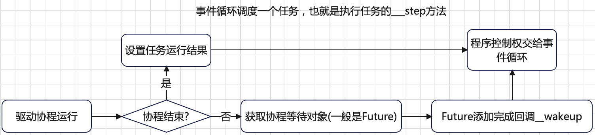

# 引言
在 [协程语法](./asyncio-syntax.md) 中我们介绍了生成器和协程的语法原理。本章开始介绍`Tasks`、`Futures`和`Coroutines`相关原理。


`asyncio`库的核心是事件循环，调度的基本单位是`Task`，`Task` 是`Future` 的子类。
异步编程中，`Future`用来表示未来的结果（[Future对象](../python-futures/futures.md)）。**协程**是用户编写的具体业务程序。
`asyncio` 运行一个协程会首先将其包装为一个 `Task`给事件循环调度。
> 事件循环类比为操作系统，协程（内部其实被包装为`Task`）类比为线程或进程。

# Coroutines
协程建议使用 `async/await` 语法声明。下面是一个简单的协程样例：
```python
import asyncio

async def main():
    print("Hello")
    await asyncio.sleep(1)
    print("World")

asyncio.run(main())
```
协程不能通过调用而单独运行。协程必须交给事件循环调度运行，就好比线程或进程必须交给操作系统调度运行一样。`asyncio`提供了`asyncio.run`入口来运行协程。
`asyncio.run`的工作原理会在[调度原理](./asyncio-scheduling.md)中详细说明。

# Futures
`Future`是一个占位符，表示一个任务执行的未来结果，通常用于异步编程中。它也是一个有状态的容器，初始状态是`PENDING`，终态是`CANCELLED`/`FINISHED`。
[Future对象](../python-futures/futures.md)详细介绍了`Future`的实现理念。

因为在编程逻辑中，其它执行体如线程、进程、协程等需要等待某一个任务的执行结果，所以`Future`必须是一个可等待对象。
在基于线程、进程异步编程中，`Future`通过条件变量实现可等待能力。基于协程的异步编程，由于是单线程模式，所以`Future`对象需要实现`__await__`方法以实现可等待能力。
```python
class Future:
    ...
    _asyncio_future_blocking = False
    def __await__(self):
        if not self.done():
            self._asyncio_future_blocking = True
            yield self  # This tells Task to wait for completion.
        if not self.done():
            raise RuntimeError("await wasn't used with future")
        return self.result()  # May raise too.

    __iter__ = __await__  # make compatible with 'yield from'.
```
变量`_asyncio_future_blocking`有两个作用：
+ 值取`bool`值，表示对象是`asyncio`实现的`Future`对象。
+ 值取`True`，表示`Future`对象还未完成，在阻塞中，也就是暂停在`yield`处。

同时考虑到一个协程在某处被暂停后，例如暂停在`await <exp>`处，当等待的对象（一般都是`Future`对象）完成后，此协程应该有机会恢复接着运行。
所以`Future`对象应该支持完成回调。而且回调方法的执行应该在协程对应在`Task`的上下文。同时为统一所有的`Task`都被事件循环调度。
因此`Future`需要将回调方法注册到事件循环中。
```python
def __schedule_callbacks(self):
    """Internal: Ask the event loop to call all callbacks.

    The callbacks are scheduled to be called as soon as possible. Also
    clears the callback list.
    """
    callbacks = self._callbacks[:]
    if not callbacks:
        return

    self._callbacks[:] = []
    for callback, ctx in callbacks:
        # 往事件循环注册回调
        self._loop.call_soon(callback, self, context=ctx)
```

# Tasks
协程不能单独被调用执行，也就是说不能将协程直接给事件循环调度。协程只能通过调用方执行`send`进行驱动执行。为此有`Task`这么一个概念。
协程在`asyncio`内部会被包装为一个`Task`，进而将`Task`交给事件循环调度执行。所以说，`Task`是协程的驱动器。又因每一个`Task`都应该有对应的执行结果，
所以`Task`是`Future`的子类。

`Task`的核心方法是`__step`，其是被包装协程的驱动器。`__step`的工作流程总结如下：



可以看到，协程的内部等待对象`Future`会注册一个完成回调方法`__wakeup`。`__wakeup`的目的是当此协程等待的`Future`完成后，
会将此协程对应的`Task`继续添加到事件循环中等待被事件循环调度，也就是恢复`Task`的继续执行。`__wakeup`实现如下：
```python
def __wakeup(self, future):
    try:
        future.result()
    except BaseException as exc:
        # This may also be a cancellation.
        self.__step(exc)
    else:
        # Don't pass the value of `future.result()` explicitly,
        # as `Future.__iter__` and `Future.__await__` don't need it.
        # If we call `_step(value, None)` instead of `_step()`,
        # Python eval loop would use `.send(value)` method call,
        # instead of `__next__()`, which is slower for futures
        # that return non-generator iterators from their `__iter__`.
        self.__step()
    self = None  # Needed to break cycles when an exception occurs.
```
> 协程内部等待对象其实就是协程内`await future`表达式中的`future`。

在`python3.12`中，`Task`增加了`eager_start`参数。当`eager_start`设置为`True`且事件循环正在运行时，
**任务会在创建时立即开始执行其协程**，直至协程首次遇到阻塞操作。如果协程在首次阻塞前就返回或引发异常，任务将直接完成，
并且不会被添加到事件循环的调度队列中。

每一个任务`Task`在**创建的时候都会往事件循环添加`__step`方法**，以使得任务自身可以被事件循环调度。
```python
class Task(futures._PyFuture):
    def __init__(self, coro, *, loop=None, name=None, context=None,
                 eager_start=False):
        super().__init__(loop=loop)
        ...
        if eager_start and self._loop.is_running():
            # 事件循环在运行，且设置eager_start
            self.__eager_start()
        else:
            # 往事件循环注册__step
            self._loop.call_soon(self.__step, context=self._context)
            _register_task(self)
```
为了对 **`Task`是事件循环调度的基本单位**加深理解，下面看一个样例：
```python
import asyncio
import time

async def counter(name: str):
    for i in range(0, 2):
        print("{0}: {1}".format(name, i))
        await asyncio.sleep(1)

async def main_task():
    start_time = time.time()
    tasks = []
    for n in range(4):
        tasks.append(asyncio.create_task(counter("task{0}".format(n))))
    for task in tasks:
        res = await task
    print("main_task cost {0}s".format(time.time() - start_time))


async def main_coro():
    start_time = time.time()
    for n in range(4):
        await counter("coro{0}".format(n))
    print("main_coro cost {0}s".format(time.time() - start_time))


print("Start run task...")
asyncio.run(main_task())
print("Start run coro...")
asyncio.run(main_coro())
```
`main_coro`方法是直接运行协程。`main_task`方法是先将协程转为任务，然后运行。运行结果如下：
```bash
code $ (master) python3 coro_and_task.py
Start run task...
task0: 0
task1: 0
task2: 0
task3: 0
task0: 1
task2: 1
task1: 1
task3: 1
main_task cost 2.0148472785949707s
Start run coro...
coro0: 0
coro0: 1
coro1: 0
coro1: 1
coro2: 0
coro2: 1
coro3: 0
coro3: 1
main_coro cost 8.061261653900146s
```
`main_task`中`4`个任务是并发调度运行，耗时`2s`，而`main_coro`中`4`个协程是串行运行，耗时`8s`。

**main_coro 的执行流程如下：**
+ `aysncio.run(main_coro())`首先将协程`main_coro`包装创建一个`Task`给事件循环调度，此时事件循环就绪队列只有一个`main_coro_task.__step`。
+ 事件循环从就绪队列取出`main_coro_task.__step`开始执行。当遇到`await asyncio.sleep(1)`，获取的协程内部等待对象`Future`会添加当前`Task`的`__wakeup`方法，
当等待的`Future`完成，此`Task`可恢复运行。同时`asyncio.sleep(1)`内部会往事件循环中注册一个`1s`后执行`futures._set_result_unless_cancelled`方法的`handle`。
然后把控制权从新交给事件循环，但由于此时就绪队列为空（`1s`时间还没到），事件循环会等待。
+ `1s`时间到后，事件循环就绪队列会有`futures._set_result_unless_cancelled`方法的可执行`handle`，方法`futures._set_result_unless_cancelled` 会被调用，
将第`2`步获取的协程内部等待对象`Future` 设置结果，此时注册的回调函数`main_coro_task.__wakeup`会被调用，恢复`Task`执行，继续下个`for`循环。

在`main_coro`方法内，每次只有一个`Task`在事件循环中，所以`4`个协程是串行执行。

**main_task 的执行流程如下：**
+ `aysncio.run(main_task())`首先将协程`main_task`包装创建一个`Task`给事件循环调度，此时事件循环就绪队列只有一个`main_task_task.__step`。
+ 事件循环从就绪队列取出`main_task_task.__step`开始执行。`asyncio.create_task`会将协程`counter`包装创建`Task`。
此时有事件循环中有`5`个`Task` (一个 `main_task`，四个 `counter`)，事件循环就绪队列有`4`个 `Task(counter("task{}")).__step`的`handle`。
当遇到`await task`，获取的协程内部等待对象`Future`会添加当前`Task`的`__wakeup`方法，当等待的`Future`完成，此`Task`可恢复运行。
然后把控制权从新交给事件循环。
+ 事件循环从就绪队列取出一个`Task(counter("task{}")).__step`执行。当遇到`asyncio.sleep(1)`，获取的协程内部等待对象`Future`会添加当前`Task`的`__wakeup`方法， 
当此`Future`完成，此`Task`可恢复运行。同时`asyncio.sleep(1)`内部会往事件循环中注册一个`1s`后执行`futures._set_result_unless_cancelled`方法的`handle`。
然后把控制权交给事件循环，继续处理后面`3`个`Task(counter("task{}")).__step`。此步可以认为`4`个任务同时运行。
+ `1s`时间到后，事件循环就绪队列会有`4`个`futures._set_result_unless_cancelled`的可执行`handle`，方法`futures._set_result_unless_cancelled` 会被调用，
将第`3`步获取的协程内部等待对象`Future`设置结果，此时注册的回调函数`Tasks.__wakeup`会被调用，继续程序往下执行。

在`main_task`方法内，同时有`4`个`Task`在事件循环中，所以`4`个协程是并发执行。
