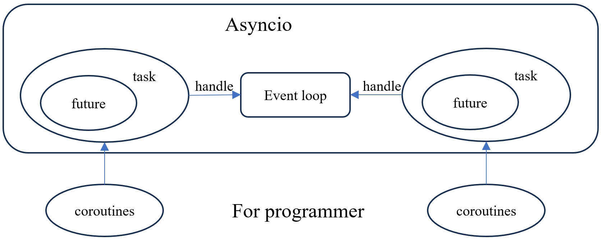

# 引言
在 [协程&生成器基础语法](./asyncio-syntax.md) 中我们介绍了生成器和协程的语法原理，
本章我们开始介绍 asyncio 库`Tasks`、`Futures`和`Coroutines`相关原理。


Asyncio 库的核心是事件循环，调度的基本单位是`Task`，`Task` 是一个`Future` 的
子类；在异步编程中，`Future` 一般用来表示未来结果对象 (可以理解为表示未来结果
的当前占位符)。**协程**是用户编写的具体业务程序，`asyncio` 运行一个协程会首先将其包装为一个 `Task`
给事件循环调度。<br>

本篇将主要介绍协程，Future, Task等概念。

# Coroutines
协程建议使用 `async/await` 语法声明。下面是一个简单的协程样例：
```python
import asyncio

async def main():
    print("Hello")
    await asyncio.sleep(1)
    print("World")

asyncio.run(main())
```
协程不能通过调用单独运行，asyncio 提供了 asyncio.run 入口来运行协程，asyncio.run 的
源码如下：
```python
def run(main, *, debug=None):
    ...
    loop = events.new_event_loop()
    try:
        events.set_event_loop(loop)
        if debug is not None:
            loop.set_debug(debug)
        # 核心是这行代码
        return loop.run_until_complete(main)
    finally:
        ...
```
可以发现，asyncio.run 内部通过调用 loop.run_until_complete 来运行一个协程，继续看
loop.run_until_complete 的源码：
```python
# loop.run_until_complete
def run_until_complete(self, future):
    """Run until the Future is done.

    If the argument is a coroutine, it is wrapped in a Task.

    WARNING: It would be disastrous to call run_until_complete()
    with the same coroutine twice -- it would wrap it in two
    different Tasks and that can't be good.

    Return the Future's result, or raise its exception.
    """
    ...
    new_task = not futures.isfuture(future)
    # 将协程包装为Task
    future = tasks.ensure_future(future, loop=self)
    if new_task:
        # An exception is raised if the future didn't complete, so there
        # is no need to log the "destroy pending task" message
        future._log_destroy_pending = False

    future.add_done_callback(_run_until_complete_cb)
    try:
        self.run_forever()
    except:
        if new_task and future.done() and not future.cancelled():
            # The coroutine raised a BaseException. Consume the exception
            # to not log a warning, the caller doesn't have access to the
            # local task.
            future.exception()
        raise
    finally:
        future.remove_done_callback(_run_until_complete_cb)
    if not future.done():
        raise RuntimeError('Event loop stopped before Future completed.')

    return future.result()

# tasks.ensure_future
def ensure_future(coro_or_future, *, loop=None):
    """Wrap a coroutine or an awaitable in a future.

    If the argument is a Future, it is returned directly.
    """
    if coroutines.iscoroutine(coro_or_future):
        if loop is None:
            loop = events.get_event_loop()
        # 这里将一个协程包装为一个Task
        task = loop.create_task(coro_or_future)
        ...
        return task
    elif futures.isfuture(coro_or_future):
        if loop is not None and loop is not futures._get_loop(coro_or_future):
            raise ValueError('The future belongs to a different loop than '
                             'the one specified as the loop argument')
        return coro_or_future
    elif inspect.isawaitable(coro_or_future):
        return ensure_future(_wrap_awaitable(coro_or_future), loop=loop)
    else:
        raise TypeError('An asyncio.Future, a coroutine or an awaitable is '
                        'required')
# loop.create_task
def create_task(self, coro, *, name=None):
    """Schedule a coroutine object.

    Return a task object.
    """
    self._check_closed()
    if self._task_factory is None:
        task = tasks.Task(coro, loop=self, name=name)
        ...
    else:
        task = self._task_factory(self, coro)
        tasks._set_task_name(task, name)

    return task
```
在 run_until_complete 内部，首先将一个协程通过 task.ensure_future 包装为一个 `Task`，然后
调用 run_forever 方法开始任务的执行，run_forever 方法的源码如下：
```python
# loop.run_forever
def run_forever(self):
    """Run until stop() is called."""
    ...
    self._thread_id = threading.get_ident()
    ...
    try:
        events._set_running_loop(self)
        while True:
            self._run_once()
            if self._stopping:
                break
    finally:
        self._stopping = False
        self._thread_id = None
        events._set_running_loop(None)
        self._set_coroutine_origin_tracking(False)
        sys.set_asyncgen_hooks(*old_agen_hooks)
```
在 run_forever 方法内，核心逻辑是调用 _run_once 方法来执行任务，我们接着看 _run_once 方法的
源码：
```python
def _run_once(self):
    """Run one full iteration of the event loop.

    This calls all currently ready callbacks, polls for I/O,
    schedules the resulting callbacks, and finally schedules
    'call_later' callbacks.
    """
    ...
    # This is the only place where callbacks are actually *called*.
    # All other places just add them to ready.
    # Note: We run all currently scheduled callbacks, but not any
    # callbacks scheduled by callbacks run this time around --
    # they will be run the next time (after another I/O poll).
    # Use an idiom that is thread-safe without using locks.
    ntodo = len(self._ready)
    for i in range(ntodo):
        # 从就绪队列取出一个可运行的 Handle
        handle = self._ready.popleft()
        if handle._cancelled:
            continue
        if self._debug:
            ...
        else:
            # 开始执行，例如运行Task的 __step 方法
            handle._run()
    handle = None  # Needed to break cycles when an exception occurs.
```
至此，我们梳理完了一个协程通过 asyncio.run 运行的全链路：
1. 调用 loop.run_until_complete
2. 将协程包装为 Task，然后调用 loop.run_forever
3. 不断调用 loop._run_once 直到任务完成

回到开头的一句话：`Task` 是调度的基本单位。`Task` 可以认为是协程运行的驱动器，因为
`Task` 中会有一些和事件循环交互的方法。由于 `Task` 是`Future` 的子类，了解`Task`之前
先了解下`Future`的实现原理。

# Futures
`Future`是一个占位符，表示一个任务执行的未来结果。它也是一个有状态的容器，初始
状态是`PENDING`，终态是`CANCELLED`/`FINISHED`。其实现源码如下：
```python
class Future:
    ...

    def get_loop(self):
        """Return the event loop the Future is bound to."""
        loop = self._loop
        if loop is None:
            raise RuntimeError("Future object is not initialized.")
        return loop

    def cancel(self):
        """Cancel the future and schedule callbacks.

        If the future is already done or cancelled, return False.  Otherwise,
        change the future's state to cancelled, schedule the callbacks and
        return True.
        """
        self.__log_traceback = False
        if self._state != _PENDING:
            return False
        self._state = _CANCELLED
        self.__schedule_callbacks()
        return True

    def __schedule_callbacks(self):
        """Internal: Ask the event loop to call all callbacks.

        The callbacks are scheduled to be called as soon as possible. Also
        clears the callback list.
        """
        callbacks = self._callbacks[:]
        if not callbacks:
            return

        self._callbacks[:] = []
        for callback, ctx in callbacks:
            self._loop.call_soon(callback, self, context=ctx)

    def cancelled(self):
        """Return True if the future was cancelled."""
        return self._state == _CANCELLED

    # Don't implement running(); see http://bugs.python.org/issue18699

    def done(self):
        """Return True if the future is done.

        Done means either that a result / exception are available, or that the
        future was cancelled.
        """
        return self._state != _PENDING

    def result(self):
        """Return the result this future represents.

        If the future has been cancelled, raises CancelledError.  If the
        future's result isn't yet available, raises InvalidStateError.  If
        the future is done and has an exception set, this exception is raised.
        """
        if self._state == _CANCELLED:
            raise exceptions.CancelledError
        if self._state != _FINISHED:
            raise exceptions.InvalidStateError('Result is not ready.')
        self.__log_traceback = False
        if self._exception is not None:
            raise self._exception
        return self._result

    def exception(self):
        """Return the exception that was set on this future.

        The exception (or None if no exception was set) is returned only if
        the future is done.  If the future has been cancelled, raises
        CancelledError.  If the future isn't done yet, raises
        InvalidStateError.
        """
        if self._state == _CANCELLED:
            raise exceptions.CancelledError
        if self._state != _FINISHED:
            raise exceptions.InvalidStateError('Exception is not set.')
        self.__log_traceback = False
        return self._exception

    def add_done_callback(self, fn, *, context=None):
        """Add a callback to be run when the future becomes done.

        The callback is called with a single argument - the future object. If
        the future is already done when this is called, the callback is
        scheduled with call_soon.
        """
        if self._state != _PENDING:
            self._loop.call_soon(fn, self, context=context)
        else:
            if context is None:
                context = contextvars.copy_context()
            self._callbacks.append((fn, context))

    # New method not in PEP 3148.

    def remove_done_callback(self, fn):
        """Remove all instances of a callback from the "call when done" list.

        Returns the number of callbacks removed.
        """
        filtered_callbacks = [(f, ctx)
                              for (f, ctx) in self._callbacks
                              if f != fn]
        removed_count = len(self._callbacks) - len(filtered_callbacks)
        if removed_count:
            self._callbacks[:] = filtered_callbacks
        return removed_count

    # So-called internal methods (note: no set_running_or_notify_cancel()).

    def set_result(self, result):
        """Mark the future done and set its result.

        If the future is already done when this method is called, raises
        InvalidStateError.
        """
        if self._state != _PENDING:
            raise exceptions.InvalidStateError(f'{self._state}: {self!r}')
        self._result = result
        self._state = _FINISHED
        self.__schedule_callbacks()

    def set_exception(self, exception):
        """Mark the future done and set an exception.

        If the future is already done when this method is called, raises
        InvalidStateError.
        """
        if self._state != _PENDING:
            raise exceptions.InvalidStateError(f'{self._state}: {self!r}')
        if isinstance(exception, type):
            exception = exception()
        if type(exception) is StopIteration:
            raise TypeError("StopIteration interacts badly with generators "
                            "and cannot be raised into a Future")
        self._exception = exception
        self._state = _FINISHED
        self.__schedule_callbacks()
        self.__log_traceback = True

    def __await__(self):
        if not self.done():
            self._asyncio_future_blocking = True
            yield self  # This tells Task to wait for completion.
        if not self.done():
            raise RuntimeError("await wasn't used with future")
        return self.result()  # May raise too.

    __iter__ = __await__  # make compatible with 'yield from'.

```
`Future`可以被取消，设置执行结果或者异常，可以添加完成回调函数 (通过调用`loop.call_soon`
注册到事件循环的就绪队列)。

# Tasks
`Task`增加`__step`和`__wakeup`方法，通过这两个方法使得`Task`具有驱动协程运行的能力，
其源码如下：
```python
class Task(futures._PyFuture):  # Inherit Python Task implementation
                                # from a Python Future implementation.
    ...
    def __step(self, exc=None):
        ...
        coro = self._coro
        self._fut_waiter = None

        _enter_task(self._loop, self)
        # Call either coro.throw(exc) or coro.send(None).
        try:
            if exc is None:
                # We use the `send` method directly, because coroutines
                # don't have `__iter__` and `__next__` methods.
                result = coro.send(None)
            else:
                result = coro.throw(exc)
        except StopIteration as exc:
            if self._must_cancel:
                # Task is cancelled right before coro stops.
                self._must_cancel = False
                super().cancel()
            else:
                super().set_result(exc.value)
        ...
        else:
            blocking = getattr(result, '_asyncio_future_blocking', None)
            if blocking is not None:
                # Yielded Future must come from Future.__iter__().
                if futures._get_loop(result) is not self._loop:
                    new_exc = RuntimeError(
                        f'Task {self!r} got Future '
                        f'{result!r} attached to a different loop')
                    self._loop.call_soon(
                        self.__step, new_exc, context=self._context)
                elif blocking:
                    if result is self:
                        new_exc = RuntimeError(
                            f'Task cannot await on itself: {self!r}')
                        self._loop.call_soon(
                            self.__step, new_exc, context=self._context)
                    else:
                        # 是一个 Future 对象，添加完成回调__wakeup以唤醒当前Task继续运行
                        result._asyncio_future_blocking = False
                        result.add_done_callback(
                            self.__wakeup, context=self._context)
                        self._fut_waiter = result
                        if self._must_cancel:
                            if self._fut_waiter.cancel():
                                self._must_cancel = False
                else:
                    new_exc = RuntimeError(
                        f'yield was used instead of yield from '
                        f'in task {self!r} with {result!r}')
                    self._loop.call_soon(
                        self.__step, new_exc, context=self._context)

            elif result is None:
                # Bare yield relinquishes control for one event loop iteration.
                self._loop.call_soon(self.__step, context=self._context)
            elif inspect.isgenerator(result):
                # Yielding a generator is just wrong.
                new_exc = RuntimeError(
                    f'yield was used instead of yield from for '
                    f'generator in task {self!r} with {result!r}')
                self._loop.call_soon(
                    self.__step, new_exc, context=self._context)
            else:
                # Yielding something else is an error.
                new_exc = RuntimeError(f'Task got bad yield: {result!r}')
                self._loop.call_soon(
                    self.__step, new_exc, context=self._context)
        finally:
            _leave_task(self._loop, self)
            self = None  # Needed to break cycles when an exception occurs.

    def __wakeup(self, future):
        try:
            future.result()
        except BaseException as exc:
            # This may also be a cancellation.
            self.__step(exc)
        else:
            # Don't pass the value of `future.result()` explicitly,
            # as `Future.__iter__` and `Future.__await__` don't need it.
            # If we call `_step(value, None)` instead of `_step()`,
            # Python eval loop would use `.send(value)` method call,
            # instead of `__next__()`, which is slower for futures
            # that return non-generator iterators from their `__iter__`.
            self.__step()
        self = None  # Needed to break cycles when an exception occurs.
```
`__step`主要完成以下三个事情：
1. 通过`send`或`throw`来驱动协程的运行
2. 给自己等待的`Future`对象设置完成回调`__wakeup`，当等待的`Future`完成后以唤醒自己继续执行
3. 调用`loop.call_soon`给事件循环就绪队列注册运行的命令，自己让步，将控制权交给
事件循环

为了加深理解，下面看一个样例：
```python
import asyncio
import time

async def counter(name: str):
    for i in range(0, 2):
        print("{0}: {1}".format(name, i))
        await asyncio.sleep(1)

async def main_task():
    start_time = time.time()
    tasks = []
    for n in range(4):
        tasks.append(asyncio.create_task(counter("task{0}".format(n))))
    for task in tasks:
        print(task)
        res = await task
        print("Task res: ", res)
    print("main_task cost {0}s".format(time.time() - start_time))


async def main_coro():
    start_time = time.time()
    for n in range(4):
        await counter("coro{0}".format(n))
    print("main_coro cost {0}s".format(time.time() - start_time))


print("Start run task...")
asyncio.run(main_task())
print("Start run coro...")
asyncio.run(main_coro())
```
main_coro 是直接运行协程，main_task 是先将协程转为任务，然后运行。运行结果如下：
```bash
code $ (master) python3 coro_and_task.py
Start run task...
<Task pending name='Task-2' coro=<counter() running at D:\WorkSpace\blog\programming\python-asyncio\code\coro_and_task.py:4>>
task0: 0
task1: 0
task2: 0
task3: 0
task0: 1
task2: 1
task1: 1
task3: 1
Task res:  None
<Task finished name='Task-3' coro=<counter() done, defined at D:\WorkSpace\blog\programming\python-asyncio\code\coro_and_task.py:4> result=None>
Task res:  None
<Task finished name='Task-4' coro=<counter() done, defined at D:\WorkSpace\blog\programming\python-asyncio\code\coro_and_task.py:4> result=None>
Task res:  None
<Task finished name='Task-5' coro=<counter() done, defined at D:\WorkSpace\blog\programming\python-asyncio\code\coro_and_task.py:4> result=None>
Task res:  None
main_task cost 2.0148472785949707s
Start run coro...
coro0: 0
coro0: 1
coro1: 0
coro1: 1
coro2: 0
coro2: 1
coro3: 0
coro3: 1
main_coro cost 8.061261653900146s
```
main_task 4个任务是并行运行，耗时2s，而 main_coro 4个协程是串行运行，耗时8s。<br>
**main_coro 的执行流程如下：**
1. aysncio.run(main_coro()) 首先将协程 main_coro 包装为一个`Task`给事件循环调度，
此时事件循环就绪队列只有 main_coro_task.__step 一个 handle
2. 事件循环从就绪队列取出 main_coro_task.__step 开始执行，直到第一次遇到
`asyncio.sleep(1)`，`asyncio.sleep(1)`会往事件循环中注册一个 1s 后执行`futures._set_result_unless_cancelled`的 handle，
并返回一个`Future`，此时当前任务 (main_coro_task) 会将返回的`Future`注册一个完成回调`__wakeup`，然后
把控制权从新交给事件循环，但由于此时就绪队列为空 (1s 时间还没到)，事件循环会等待
3. 1s 时间到后，事件循环就绪队列会有`futures._set_result_unless_cancelled`的可执行 handle，
方法`futures._set_result_unless_cancelled` 会被调用，将第 2 步返回的`Future` 设置
结果，根据`Future.set_result`源码可知，此时注册的回调函数`Tasks.__wakeup`会被调用，
继续下个for循环，依次类推

**main_task 的执行流程如下：**
1. aysncio.run(main_task()) 首先将协程 main_task 包装为一个`Task`给事件循环调度，
此时事件循环就绪队列只有 main_task_task.__step 一个 handle
2. 事件循环从就绪队列取出 main_task_task.__step 开始执行，`asyncio.create_task(counter)`
会将协程 counter 包装为`Task`，此时有事件循环中有 5 个`Task` (一个 main_task，4个 counter)，事件循环就绪队列有 4 个
Task(counter("task{}")).__step 的 handle。直到第一次遇到 await task，await task 会返回一个`Future`
类，此时当前任务 (main_task_task) 会将返回的`Future`注册一个完成回调`__wakeup`，
然后 把控制权从新交给事件循环
3. 事件循环继续从就绪队列取出第一个 Task(counter("task{}")).__step 开始执行，直到第一次遇到
`asyncio.sleep(1)`，`asyncio.sleep(1)`会往事件循环中注册一个 1s 后执行`futures._set_result_unless_cancelled`的 handle，
并返回一个`Future`，此时当前任务 (Task(counter("task{}"))) 会将返回的`Future`注册一个完成回调`__wakeup`，然后
把控制权从新交给事件循环。事件循环继续处理后面的三个 Task(counter("task{}")).__step，此步可以认为
4 个任务同时运行
4. 1s 时间到后，事件循环就绪队列会有 4 个`futures._set_result_unless_cancelled`的可执行 handle，
方法`futures._set_result_unless_cancelled` 会被调用，将第 3 步返回的`Future` 设置
结果，根据`Future.set_result`源码可知，此时注册的回调函数`Tasks.__wakeup`会被调用，
继续程序往下执行
