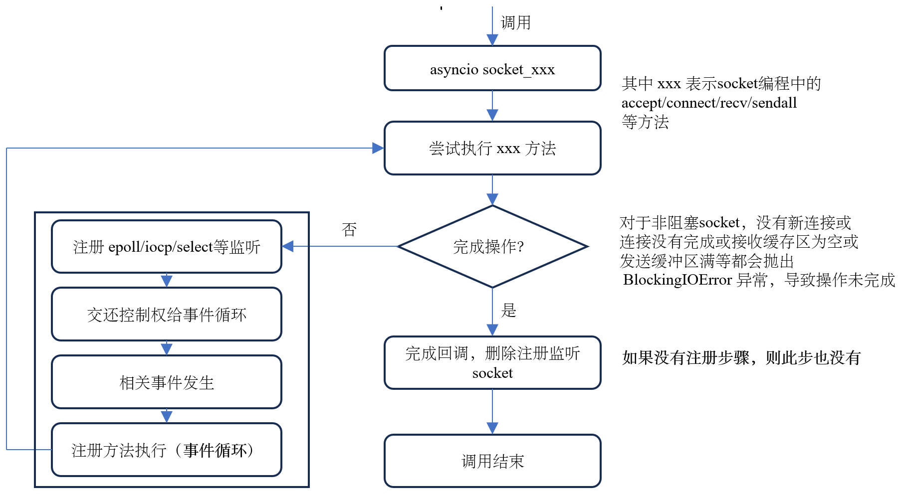

# 引言
针对网络编程，asyncio 库提供了底层`socket`接口，基于`socket`封装的`Transports&Protocols`
以及基于`Transports&Protocols`封装的`Streams`三种方式。下面将分别介绍。
# Socket
基于 TCP 的 socket 编程一般流程如下：

详细的入门指导可参考 [同步socket编程](https://realpython.com/python-sockets/)。Asyncio 库提供了 socket 编程 API 部分同步接口的
异步版本，具体如下表所示：
| 阻塞 socket | 异步 socket |
| :---------- | :---------- |
|`socket`|-|
|`bind`|-|
|`listen`|-|
|`accept`|`sock_accept`|
|`connect`|`sock_connect`|
|`recv`|`sock_recv`|
|`send`|-|
|`sendall`|`sock_sendall`|

在介绍异步 socket API 源码之前，先看一个具体的基于 asyncio 实现的 socket 编程。服务端代码如下：
```python
import socket
import asyncio

port = 9006

async def handle_client(client, addr):
    loop = asyncio.get_event_loop()
    result = None
    while result != "quit":
        result = await loop.sock_recv(client, 1024)
        result = result.decode()
        print("got from {0}: {1}".format(addr, result))
        response = "got message"
        await loop.sock_sendall(client, response.encode())
    client.close()

async def run_server():
    server = socket.socket(socket.AF_INET, socket.SOCK_STREAM)
    server.bind(("", port))
    server.listen(5)
    server.setblocking(False)

    loop = asyncio.get_event_loop()

    while True:
        client, addr = await loop.sock_accept(server)
        print("connected to client: ", addr)
        loop.create_task(handle_client(client, addr))

asyncio.run(run_server())
```
客户端代码如下：
```python
import socket
import asyncio

async def request():
    loop = asyncio.get_event_loop()
    client = socket.socket(socket.AF_INET, socket.SOCK_STREAM)
    await loop.sock_connect(client, ("127.0.0.1", 9006))
    await loop.sock_sendall(client, "ack from client connect success".encode())
    result = await loop.sock_recv(client, 1024)
    print(result.decode())
    while True:
        send_message = input()
        await loop.sock_sendall(client, send_message.encode())
        if send_message == "quit":
            break
        receive_message = await loop.sock_recv(client, 1024)
        print("got message from server: ", receive_message.decode())
    client.close()

asyncio.run(request())
```
运行服务端代码和客户端代码，输出结果如下:
```bash
# 服务端结果
$ python3 server.py
connected to client:  ('127.0.0.1', 57404)
got from ('127.0.0.1', 57404): ack from client connect success
got from ('127.0.0.1', 57404): hello world
got from ('127.0.0.1', 57404): quit

# 客户端结果
$ python3 client.py
got message
hello world
got message from server:  got message
quit
$
```
上面的服务端和客户端在建立连接过程中分别使用了`sock_accept`和`sock_connect`异步接口，其源码实现如下：
```python
async def sock_accept(self, sock):
    """Accept a connection.

    The socket must be bound to an address and listening for connections.
    The return value is a pair (conn, address) where conn is a new socket
    object usable to send and receive data on the connection, and address
    is the address bound to the socket on the other end of the connection.
    """
    # 如果是 ssl socket 则抛出异常
    _check_ssl_socket(sock)
    if self._debug and sock.gettimeout() != 0:
        raise ValueError("the socket must be non-blocking")
    # 创建一个 Future 对象，表示此操作未来结果
    fut = self.create_future()
    self._sock_accept(fut, sock)
    return await fut

def _sock_accept(self, fut, sock):
    fd = sock.fileno()
    try:
        conn, address = sock.accept()
        conn.setblocking(False)
    except (BlockingIOError, InterruptedError):
        # 确保当前的 sock 没有绑定 在运行的 transport 对象
        self._ensure_fd_no_transport(fd)
        # 走到这里表示还没有新的 client 连接，将监听 socket 注册到 epoll/iocp/select/... 可读事件
        handle = self._add_reader(fd, self._sock_accept, fut, sock)
        fut.add_done_callback(
            functools.partial(self._sock_read_done, fd, handle=handle))
    except (SystemExit, KeyboardInterrupt):
        raise
    except BaseException as exc:
        # 设置异常，传递给上层调用
        fut.set_exception(exc)
    else:
        # 新的 client 连接成功，设置 sock_accept 操作结果以通知上层调用恢复执行
        fut.set_result((conn, address))

def _sock_read_done(self, fd, fut, handle=None):
    if handle is None or not handle.cancelled():
        self.remove_reader(fd)
```
`sock_accept`内部会添加`_sock_read_done`完成回调，确保在取消、异常或者成功都将
注册的监听 sock 移除。为什么要移除呢？个人理解是：
+ 保证 socket API 幂等性，也就是说每次调用 `sock_accept`，
执行的流程应该和第一次调用一样，不能因为上次调用而影响本次内部执行逻辑的变化。
具体来说每次调用`_add_reader`都是执行注册，而不是修改。
+ 不仅仅是`sock_accept`，下面介绍其它异步接口都有这个特性。

继续看`sock_connect`的源码：
```python
async def sock_connect(self, sock, address):
    """Connect to a remote socket at address.

    This method is a coroutine.
    """
    # 如果是 ssl socket 则抛出异常
    base_events._check_ssl_socket(sock)
    if self._debug and sock.gettimeout() != 0:
        raise ValueError("the socket must be non-blocking")

    if sock.family == socket.AF_INET or (
            base_events._HAS_IPv6 and sock.family == socket.AF_INET6):
        # DNS 解析，获取 ip + port
        resolved = await self._ensure_resolved(
            address, family=sock.family, type=sock.type, proto=sock.proto,
            loop=self,
        )
        _, _, _, _, address = resolved[0]

    # 创建一个 Future 对象，表示此操作未来结果
    fut = self.create_future()
    self._sock_connect(fut, sock, address)
    try:
        return await fut
    finally:
        # Needed to break cycles when an exception occurs.
        fut = None

def _sock_connect(self, fut, sock, address):
    fd = sock.fileno()
    try:
        sock.connect(address)
    except (BlockingIOError, InterruptedError):
        # Issue #23618: When the C function connect() fails with EINTR, the
        # connection runs in background. We have to wait until the socket
        # becomes writable to be notified when the connection succeed or
        # fails.
        # 确保当前的 sock 没有绑定 在运行的 transport 对象
        self._ensure_fd_no_transport(fd)
        # 走到这里表示连接还没有完成，将连接 socket 注册到 epoll/iocp/select/... 可写事件
        handle = self._add_writer(
            fd, self._sock_connect_cb, fut, sock, address)
        fut.add_done_callback(
            functools.partial(self._sock_write_done, fd, handle=handle))
    except (SystemExit, KeyboardInterrupt):
        raise
    except BaseException as exc:
        # 设置异常，传递给上层调用
        fut.set_exception(exc)
    else:
        # 连接成功，设置 sock_connect 操作结果以通知上层调用恢复执行
        fut.set_result(None)
    finally:
        fut = None

def _sock_write_done(self, fd, fut, handle=None):
    if handle is None or not handle.cancelled():
        self.remove_writer(fd)

def _sock_connect_cb(self, fut, sock, address):
    if fut.done():
        return

    try:
        err = sock.getsockopt(socket.SOL_SOCKET, socket.SO_ERROR)
        if err != 0:
            # Jump to any except clause below.
            raise OSError(err, f'Connect call failed {address}')
    except (BlockingIOError, InterruptedError):
        # socket is still registered, the callback will be retried later
        pass
    except (SystemExit, KeyboardInterrupt):
        raise
    except BaseException as exc:
        # 设置异常，传递给上层调用
        fut.set_exception(exc)
    else:
        # 连接成功，设置 sock_connect 操作结果以通知上层调用恢复执行
        fut.set_result(None)
    finally:
        fut = None
```
`sock_connect`首先会执行 dns 解析以获取 ip + port(ipv4)，dns 解析调用`_ensure_resolved`方法，源码如下：
```python
async def _ensure_resolved(self, address, *,
                           family=0, type=socket.SOCK_STREAM,
                           proto=0, flags=0, loop):
    host, port = address[:2]
    # 如果 host 已经是一个IP地址，则跳过 getaddrinfo 执行
    info = _ipaddr_info(host, port, family, type, proto, *address[2:])
    if info is not None:
        # "host" is already a resolved IP.
        return [info]
    else:
        return await loop.getaddrinfo(host, port, family=family, type=type,
                                      proto=proto, flags=flags)

# loop.getaddrinfo
async def getaddrinfo(self, host, port, *,
                      family=0, type=0, proto=0, flags=0):
    if self._debug:
        getaddr_func = self._getaddrinfo_debug
    else:
        getaddr_func = socket.getaddrinfo

    return await self.run_in_executor(
        None, getaddr_func, host, port, family, type, proto, flags)

def run_in_executor(self, executor, func, *args):
    self._check_closed()
    if self._debug:
        self._check_callback(func, 'run_in_executor')
    if executor is None:
        executor = self._default_executor
        # Only check when the default executor is being used
        # 如果执行器已经 shutdown 则抛出异常
        self._check_default_executor()
        if executor is None:
            executor = concurrent.futures.ThreadPoolExecutor(
                thread_name_prefix='asyncio'
            )
            self._default_executor = executor
    # 将 concurrent.futures.Future 对象包装为 asyncio.Future 对象并返回
    return futures.wrap_future(
        executor.submit(func, *args), loop=self)
```
由于`socket.getaddrinfo`是阻塞的方法，为了避免其阻塞整个事件循环，需要将其放到`run_in_executor`中执行，`run_in_executor`
内部使用一个线程池，返回一个`Asyncio.Future`可等待对象。<br>

数据交互涉及的方法有`sock_sendall`、`sock_recv`等。先看`sock_sendall`，相关源码如下：
```python
async def sock_sendall(self, sock, data):
    """Send data to the socket.

    The socket must be connected to a remote socket. This method continues
    to send data from data until either all data has been sent or an
    error occurs. None is returned on success. On error, an exception is
    raised, and there is no way to determine how much data, if any, was
    successfully processed by the receiving end of the connection.
    """
    _check_ssl_socket(sock)
    if self._debug and sock.gettimeout() != 0:
        raise ValueError("the socket must be non-blocking")
    try:
        # 先尝试发送，如果发送部分数据(发送缓存区有空闲空间)或者发送缓存区满，则执行下面当注册回调机制
        n = sock.send(data)
    except (BlockingIOError, InterruptedError):
        # 遇到发送缓冲区满
        n = 0

    if n == len(data):
        # all data sent
        return

    fut = self.create_future()
    fd = sock.fileno()
    self._ensure_fd_no_transport(fd)
    # use a trick with a list in closure to store a mutable state
    # 往 epoll/iocp/select 等注册此 sock 写事件，当发送缓存区空闲时候触发 self._sock_sendall
    handle = self._add_writer(fd, self._sock_sendall, fut, sock,
                              memoryview(data), [n])
    fut.add_done_callback(
        functools.partial(self._sock_write_done, fd, handle=handle))
    return await fut

def _sock_sendall(self, fut, sock, view, pos):
    if fut.done():
        # Future cancellation can be scheduled on previous loop iteration
        return
    start = pos[0]
    try:
        n = sock.send(view[start:])
    except (BlockingIOError, InterruptedError):
        # 遇到发送缓存区满，什么都不做，等下次执行，因为此 sock 还在监听中
        return
    except (SystemExit, KeyboardInterrupt):
        raise
    except BaseException as exc:
        fut.set_exception(exc)
        return

    start += n

    if start == len(view):
        fut.set_result(None)
    else:
        pos[0] = start
```
接下来看下`sock_recv`，相关源码如下：
```python
async def sock_recv(self, sock, n):
    """Receive data from the socket.

    The return value is a bytes object representing the data received.
    The maximum amount of data to be received at once is specified by
    nbytes.
    """
    _check_ssl_socket(sock)
    if self._debug and sock.gettimeout() != 0:
        raise ValueError("the socket must be non-blocking")
    try:
        # 先尝试接收，如果接收缓存区有数据，立刻返回；如果接收缓存区为空，执行下面等监听注册回调机制
        return sock.recv(n)
    except (BlockingIOError, InterruptedError):
        # 接收缓存区为空
        pass
    fut = self.create_future()
    fd = sock.fileno()
    self._ensure_fd_no_transport(fd)
    # 往 epoll/iocp/select 等注册此 sock 读事件，当接收缓存区有数据时候触发 self._sock_recv
    handle = self._add_reader(fd, self._sock_recv, fut, sock, n)
    fut.add_done_callback(
        functools.partial(self._sock_read_done, fd, handle=handle))
    return await fut

def _sock_read_done(self, fd, fut, handle=None):
    if handle is None or not handle.cancelled():
        self.remove_reader(fd)

def _sock_recv(self, fut, sock, n):
    # _sock_recv() can add itself as an I/O callback if the operation can't
    # be done immediately. Don't use it directly, call sock_recv().
    if fut.done():
        return
    try:
        data = sock.recv(n)
    except (BlockingIOError, InterruptedError):
        # 接收缓存区空，什么都不做，等下次调用，因为此sock 还是监听中，没有移除
        return  # try again next time
    except (SystemExit, KeyboardInterrupt):
        raise
    except BaseException as exc:
        fut.set_exception(exc)
    else:
        fut.set_result(data)
```
asyncio 库也实现了`sock_recv_info`和`sock_sendfile`，原理和上面介绍的 sock_xxx 类似。
下图总结了 sock_xxx 的执行流程：

了解了相关异步 socket API 的实现原理，我们回过头看上面介绍的异步编程服务端和客户端的执行流程
首先介绍**服务端执行流程**：
+ 首先`asyncio.run(run_server())`会将协程`run_server()`包装为一个`Task`给事件
循环调度，事件循环取出此时就绪队列中唯一的 `handle` （`Task`初始化时会添加）开始驱动协程`run_server()`
执行。
+ 执行到`await loop.sock_accept(server)`时，若此时有已连接建立好的连接，则完成
调用，开始往下执行；若此时还没建立好的连接，则协程阻塞在此处，并将控制权交给事件循环
等操作`sock_accept`完成后，唤醒包含此协程的`Task`继续执行。
+ 继续执行到`loop.create_task(handle_client(client, addr))`会创建一个包含协程
`handle_client(client, addr)`的新`Task`供事件循环调度，此时事件循环就绪队列
会增加一个此`Task`的`handle`，继续执行到`await loop.sock_accept(server)`，
若没有新的连接建立，则把控制权叫给事件循环，执行其他的任务。如果此时一直有新的
连接建立，则永远不会把控制权交给事件循环，这是bug。
+ 假如事件循环有机会取出包含`handle_client`协程的`Task`的`handle`执行时，会执行
到`await loop.sock_recv(client, 1024)`，如果此 socket 接收缓存区为空，则此协程
阻塞在此处，将控制权交给事件循环，等接收缓存区有数据，则完成`sock_recv`操作，
并唤醒包含此协程的`Task`继续执行；若此时接收缓存区有数据，则完成调用，直接返回，
继续往下执行。一直执行到`await loop.sock_sendall(client, response.encode())`，
若数据全部发生完成，则完成调用，继续往下执行；若数据没有全部发送完成，则阻塞在
此处，把控制权交给事件循环，等数据全部发送完成，则唤醒包含此协程的`Task`继续执行。

**客户端执行流程**：
+ 首先`asyncio.run(request())`会将协程`request()`包装为一个`Task`给事件
循环调度，事件循环取出此时就绪队列中唯一的 `handle` （`Task`初始化时会添加）开始驱动协程`request()`
执行。
+ 执行到`await`语句时，若后面的相关操作没有完成，会阻塞此处，并把控制权交给事件
循环，等相关操作完成后，会唤醒包含此协程的`Task`继续执行（整个事件循环中只有一个任务）。


# Transport&Prorocols

# Streams
