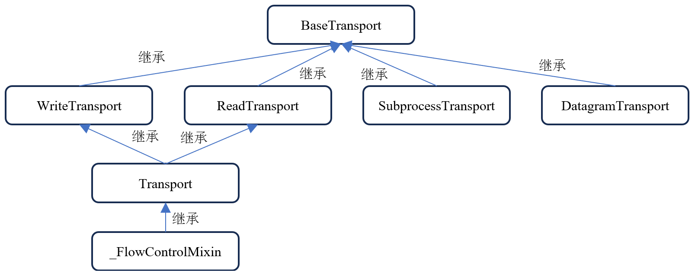
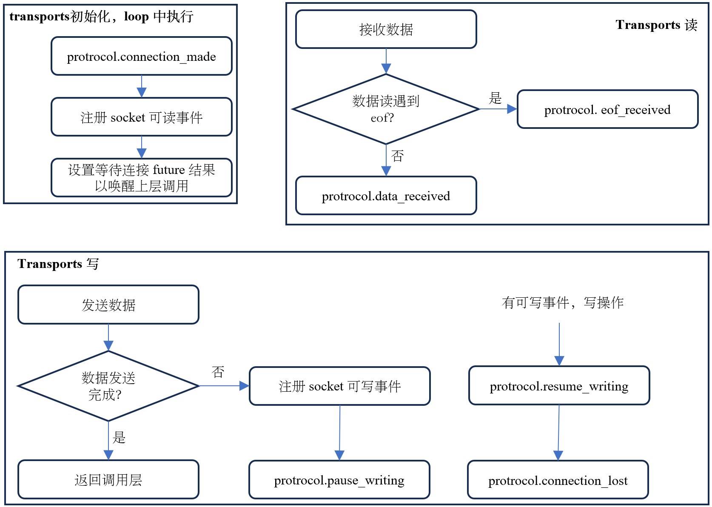

# 引言
针对网络编程，asyncio 库提供了底层`socket`接口，基于`socket`封装的`Transports&Protocols`
以及基于`Transports&Protocols`封装的`Streams`三种方式。下面将分别介绍。
# Socket
基于 TCP 的 socket 编程一般流程如下：

详细的入门指导可参考 [同步socket编程](https://realpython.com/python-sockets/)。Asyncio 库提供了 socket 编程 API 部分同步接口的
异步版本，具体如下表所示：
| 阻塞 socket | 异步 socket |
| :---------- | :---------- |
|`socket`|-|
|`bind`|-|
|`listen`|-|
|`accept`|`sock_accept`|
|`connect`|`sock_connect`|
|`recv`|`sock_recv`|
|`send`|-|
|`sendall`|`sock_sendall`|

在介绍异步 socket API 源码之前，先看一个具体的基于 asyncio 实现的 socket 编程。服务端代码如下：
```python
import socket
import asyncio

port = 9006

async def handle_client(client, addr):
    loop = asyncio.get_event_loop()
    result = None
    while result != "quit":
        result = await loop.sock_recv(client, 1024)
        result = result.decode()
        print("got from {0}: {1}".format(addr, result))
        response = "got message"
        await loop.sock_sendall(client, response.encode())
    client.close()

async def run_server():
    server = socket.socket(socket.AF_INET, socket.SOCK_STREAM)
    server.bind(("", port))
    server.listen(5)
    server.setblocking(False)

    loop = asyncio.get_event_loop()

    while True:
        client, addr = await loop.sock_accept(server)
        print("connected to client: ", addr)
        loop.create_task(handle_client(client, addr))

asyncio.run(run_server())
```
客户端代码如下：
```python
import socket
import asyncio

async def request():
    loop = asyncio.get_event_loop()
    client = socket.socket(socket.AF_INET, socket.SOCK_STREAM)
    await loop.sock_connect(client, ("127.0.0.1", 9006))
    await loop.sock_sendall(client, "ack from client connect success".encode())
    result = await loop.sock_recv(client, 1024)
    print(result.decode())
    while True:
        send_message = input()
        await loop.sock_sendall(client, send_message.encode())
        if send_message == "quit":
            break
        receive_message = await loop.sock_recv(client, 1024)
        print("got message from server: ", receive_message.decode())
    client.close()

asyncio.run(request())
```
运行服务端代码和客户端代码，输出结果如下:
```bash
# 服务端结果
$ python3 server.py
connected to client:  ('127.0.0.1', 57404)
got from ('127.0.0.1', 57404): ack from client connect success
got from ('127.0.0.1', 57404): hello world
got from ('127.0.0.1', 57404): quit

# 客户端结果
$ python3 client.py
got message
hello world
got message from server:  got message
quit
$
```
上面的服务端和客户端在建立连接过程中分别使用了`sock_accept`和`sock_connect`异步接口，其源码实现如下：
```python
async def sock_accept(self, sock):
    """Accept a connection.

    The socket must be bound to an address and listening for connections.
    The return value is a pair (conn, address) where conn is a new socket
    object usable to send and receive data on the connection, and address
    is the address bound to the socket on the other end of the connection.
    """
    # 如果是 ssl socket 则抛出异常
    _check_ssl_socket(sock)
    if self._debug and sock.gettimeout() != 0:
        raise ValueError("the socket must be non-blocking")
    # 创建一个 Future 对象，表示此操作未来结果
    fut = self.create_future()
    self._sock_accept(fut, sock)
    return await fut

def _sock_accept(self, fut, sock):
    fd = sock.fileno()
    try:
        conn, address = sock.accept()
        conn.setblocking(False)
    except (BlockingIOError, InterruptedError):
        # 确保当前的 sock 没有绑定 在运行的 transport 对象
        self._ensure_fd_no_transport(fd)
        # 走到这里表示还没有新的 client 连接，将监听 socket 注册到 epoll/iocp/select/... 可读事件
        handle = self._add_reader(fd, self._sock_accept, fut, sock)
        fut.add_done_callback(
            functools.partial(self._sock_read_done, fd, handle=handle))
    except (SystemExit, KeyboardInterrupt):
        raise
    except BaseException as exc:
        # 设置异常，传递给上层调用
        fut.set_exception(exc)
    else:
        # 新的 client 连接成功，设置 sock_accept 操作结果以通知上层调用恢复执行
        fut.set_result((conn, address))

def _sock_read_done(self, fd, fut, handle=None):
    if handle is None or not handle.cancelled():
        self.remove_reader(fd)
```
`sock_accept`内部会添加`_sock_read_done`完成回调，确保在取消、异常或者成功都将
注册的监听 sock 移除。为什么要移除呢？个人理解是：
+ 保证 socket API 幂等性，也就是说每次调用 `sock_accept`，
执行的流程应该和第一次调用一样，不能因为上次调用而影响本次内部执行逻辑的变化。
具体来说每次调用`_add_reader`都是执行注册，而不是修改。
+ 不仅仅是`sock_accept`，下面介绍其它异步接口都有这个特性。

继续看`sock_connect`的源码：
```python
async def sock_connect(self, sock, address):
    """Connect to a remote socket at address.

    This method is a coroutine.
    """
    # 如果是 ssl socket 则抛出异常
    base_events._check_ssl_socket(sock)
    if self._debug and sock.gettimeout() != 0:
        raise ValueError("the socket must be non-blocking")

    if sock.family == socket.AF_INET or (
            base_events._HAS_IPv6 and sock.family == socket.AF_INET6):
        # DNS 解析，获取 ip + port
        resolved = await self._ensure_resolved(
            address, family=sock.family, type=sock.type, proto=sock.proto,
            loop=self,
        )
        _, _, _, _, address = resolved[0]

    # 创建一个 Future 对象，表示此操作未来结果
    fut = self.create_future()
    self._sock_connect(fut, sock, address)
    try:
        return await fut
    finally:
        # Needed to break cycles when an exception occurs.
        fut = None

def _sock_connect(self, fut, sock, address):
    fd = sock.fileno()
    try:
        sock.connect(address)
    except (BlockingIOError, InterruptedError):
        # Issue #23618: When the C function connect() fails with EINTR, the
        # connection runs in background. We have to wait until the socket
        # becomes writable to be notified when the connection succeed or
        # fails.
        # 确保当前的 sock 没有绑定 在运行的 transport 对象
        self._ensure_fd_no_transport(fd)
        # 走到这里表示连接还没有完成，将连接 socket 注册到 epoll/iocp/select/... 可写事件
        handle = self._add_writer(
            fd, self._sock_connect_cb, fut, sock, address)
        fut.add_done_callback(
            functools.partial(self._sock_write_done, fd, handle=handle))
    except (SystemExit, KeyboardInterrupt):
        raise
    except BaseException as exc:
        # 设置异常，传递给上层调用
        fut.set_exception(exc)
    else:
        # 连接成功，设置 sock_connect 操作结果以通知上层调用恢复执行
        fut.set_result(None)
    finally:
        fut = None

def _sock_write_done(self, fd, fut, handle=None):
    if handle is None or not handle.cancelled():
        self.remove_writer(fd)

def _sock_connect_cb(self, fut, sock, address):
    if fut.done():
        return

    try:
        err = sock.getsockopt(socket.SOL_SOCKET, socket.SO_ERROR)
        if err != 0:
            # Jump to any except clause below.
            raise OSError(err, f'Connect call failed {address}')
    except (BlockingIOError, InterruptedError):
        # socket is still registered, the callback will be retried later
        pass
    except (SystemExit, KeyboardInterrupt):
        raise
    except BaseException as exc:
        # 设置异常，传递给上层调用
        fut.set_exception(exc)
    else:
        # 连接成功，设置 sock_connect 操作结果以通知上层调用恢复执行
        fut.set_result(None)
    finally:
        fut = None
```
`sock_connect`首先会执行 dns 解析以获取 ip + port(ipv4)，dns 解析调用`_ensure_resolved`方法，源码如下：
```python
async def _ensure_resolved(self, address, *,
                           family=0, type=socket.SOCK_STREAM,
                           proto=0, flags=0, loop):
    host, port = address[:2]
    # 如果 host 已经是一个IP地址，则跳过 getaddrinfo 执行
    info = _ipaddr_info(host, port, family, type, proto, *address[2:])
    if info is not None:
        # "host" is already a resolved IP.
        return [info]
    else:
        return await loop.getaddrinfo(host, port, family=family, type=type,
                                      proto=proto, flags=flags)

# loop.getaddrinfo
async def getaddrinfo(self, host, port, *,
                      family=0, type=0, proto=0, flags=0):
    if self._debug:
        getaddr_func = self._getaddrinfo_debug
    else:
        getaddr_func = socket.getaddrinfo

    return await self.run_in_executor(
        None, getaddr_func, host, port, family, type, proto, flags)

def run_in_executor(self, executor, func, *args):
    self._check_closed()
    if self._debug:
        self._check_callback(func, 'run_in_executor')
    if executor is None:
        executor = self._default_executor
        # Only check when the default executor is being used
        # 如果执行器已经 shutdown 则抛出异常
        self._check_default_executor()
        if executor is None:
            executor = concurrent.futures.ThreadPoolExecutor(
                thread_name_prefix='asyncio'
            )
            self._default_executor = executor
    # 将 concurrent.futures.Future 对象包装为 asyncio.Future 对象并返回
    return futures.wrap_future(
        executor.submit(func, *args), loop=self)
```
由于`socket.getaddrinfo`是阻塞的方法，为了避免其阻塞整个事件循环，需要将其放到`run_in_executor`中执行，`run_in_executor`
内部使用一个线程池，返回一个`Asyncio.Future`可等待对象。<br>

数据交互涉及的方法有`sock_sendall`、`sock_recv`等。先看`sock_sendall`，相关源码如下：
```python
async def sock_sendall(self, sock, data):
    """Send data to the socket.

    The socket must be connected to a remote socket. This method continues
    to send data from data until either all data has been sent or an
    error occurs. None is returned on success. On error, an exception is
    raised, and there is no way to determine how much data, if any, was
    successfully processed by the receiving end of the connection.
    """
    _check_ssl_socket(sock)
    if self._debug and sock.gettimeout() != 0:
        raise ValueError("the socket must be non-blocking")
    try:
        # 先尝试发送，如果发送部分数据(发送缓存区有空闲空间)或者发送缓存区满，则执行下面当注册回调机制
        n = sock.send(data)
    except (BlockingIOError, InterruptedError):
        # 遇到发送缓冲区满
        n = 0

    if n == len(data):
        # all data sent
        return

    fut = self.create_future()
    fd = sock.fileno()
    self._ensure_fd_no_transport(fd)
    # use a trick with a list in closure to store a mutable state
    # 往 epoll/iocp/select 等注册此 sock 写事件，当发送缓存区空闲时候触发 self._sock_sendall
    handle = self._add_writer(fd, self._sock_sendall, fut, sock,
                              memoryview(data), [n])
    fut.add_done_callback(
        functools.partial(self._sock_write_done, fd, handle=handle))
    return await fut

def _sock_sendall(self, fut, sock, view, pos):
    if fut.done():
        # Future cancellation can be scheduled on previous loop iteration
        return
    start = pos[0]
    try:
        n = sock.send(view[start:])
    except (BlockingIOError, InterruptedError):
        # 遇到发送缓存区满，什么都不做，等下次执行，因为此 sock 还在监听中
        return
    except (SystemExit, KeyboardInterrupt):
        raise
    except BaseException as exc:
        fut.set_exception(exc)
        return

    start += n

    if start == len(view):
        fut.set_result(None)
    else:
        pos[0] = start
```
接下来看下`sock_recv`，相关源码如下：
```python
async def sock_recv(self, sock, n):
    """Receive data from the socket.

    The return value is a bytes object representing the data received.
    The maximum amount of data to be received at once is specified by
    nbytes.
    """
    _check_ssl_socket(sock)
    if self._debug and sock.gettimeout() != 0:
        raise ValueError("the socket must be non-blocking")
    try:
        # 先尝试接收，如果接收缓存区有数据，立刻返回；如果接收缓存区为空，执行下面等监听注册回调机制
        return sock.recv(n)
    except (BlockingIOError, InterruptedError):
        # 接收缓存区为空
        pass
    fut = self.create_future()
    fd = sock.fileno()
    self._ensure_fd_no_transport(fd)
    # 往 epoll/iocp/select 等注册此 sock 读事件，当接收缓存区有数据时候触发 self._sock_recv
    handle = self._add_reader(fd, self._sock_recv, fut, sock, n)
    fut.add_done_callback(
        functools.partial(self._sock_read_done, fd, handle=handle))
    return await fut

def _sock_read_done(self, fd, fut, handle=None):
    if handle is None or not handle.cancelled():
        self.remove_reader(fd)

def _sock_recv(self, fut, sock, n):
    # _sock_recv() can add itself as an I/O callback if the operation can't
    # be done immediately. Don't use it directly, call sock_recv().
    if fut.done():
        return
    try:
        data = sock.recv(n)
    except (BlockingIOError, InterruptedError):
        # 接收缓存区空，什么都不做，等下次调用，因为此sock 还是监听中，没有移除
        return  # try again next time
    except (SystemExit, KeyboardInterrupt):
        raise
    except BaseException as exc:
        fut.set_exception(exc)
    else:
        fut.set_result(data)
```
asyncio 库也实现了`sock_recv_info`和`sock_sendfile`，原理和上面介绍的 sock_xxx 类似。
下图总结了 sock_xxx 的执行流程：

了解了相关异步 socket API 的实现原理，我们回过头看上面介绍的异步编程服务端和客户端的执行流程。<br>
**服务端执行流程**：
+ 首先`asyncio.run(run_server())`会将协程`run_server()`包装为一个`Task`给事件
循环调度，事件循环取出此时就绪队列中唯一的 `handle` （`Task`初始化时会添加）开始驱动协程`run_server()`
执行。
+ 执行到`await loop.sock_accept(server)`时，若此时有已连接建立好的连接，则完成
调用，开始往下执行；若此时还没建立好的连接，则协程阻塞在此处，并将控制权交给事件循环
等操作`sock_accept`完成后，唤醒包含此协程的`Task`继续执行。
+ 继续执行到`loop.create_task(handle_client(client, addr))`会创建一个包含协程
`handle_client(client, addr)`的新`Task`供事件循环调度，此时事件循环就绪队列
会增加一个此`Task`的`handle`，继续执行到`await loop.sock_accept(server)`，
若没有新的连接建立，则把控制权叫给事件循环，执行其他的任务。如果此时一直有新的
连接建立，则永远不会把控制权交给事件循环，这是bug。
+ 假如事件循环有机会取出包含`handle_client`协程的`Task`的`handle`执行时，会执行
到`await loop.sock_recv(client, 1024)`，如果此 socket 接收缓存区为空，则此协程
阻塞在此处，将控制权交给事件循环，等接收缓存区有数据，则完成`sock_recv`操作，
并唤醒包含此协程的`Task`继续执行；若此时接收缓存区有数据，则完成调用，直接返回，
继续往下执行。一直执行到`await loop.sock_sendall(client, response.encode())`，
若数据全部发生完成，则完成调用，继续往下执行；若数据没有全部发送完成，则阻塞在
此处，把控制权交给事件循环，等数据全部发送完成，则唤醒包含此协程的`Task`继续执行。

**客户端执行流程**：
+ 首先`asyncio.run(request())`会将协程`request()`包装为一个`Task`给事件
循环调度，事件循环取出此时就绪队列中唯一的 `handle` （`Task`初始化时会添加）开始驱动协程`request()`
执行。
+ 执行到`await`语句时，若后面的相关操作没有完成，会阻塞此处，并把控制权交给事件
循环，等相关操作完成后，会唤醒包含此协程的`Task`继续执行（整个事件循环中只有一个任务）。


# Transports&Protocols
基于`socket`，asyncio 封装了`Transports&Protocols`抽象层，其屏蔽了底层 `socket`
细节，便于开发。`Transports&Protocols`有如下特点：
+ `Transports`和`Protocols`被底层的事件循环 API 调用，例如`loop.create_connection()`。
其实现是基于回调的模式，并且其实现具有有较高的性能。
+ 从上层视角看，`Transports`考虑**怎么**传输数据，而`Protocols`决定**哪些**数据被传输。
`Transports`是`socket`的抽象，`Protocols`是应用的抽象。
+ `Transports`和`Protocols`总是成对出现，互相调用其接口。

asyncio 提供了 5 种**抽象**`Transports`，分别是`WriteTransport`、`ReadTransport`、
`Transport`、`DatagramTransport`和`SubprocessTransport`，以及一个混合类`_FlowControlMixin`，
继承关系如下图：

每个抽象类实现的抽象方法如下表：
|BaseTransport|ReadTransport|WriteTransport|SubprocessTransport|DatagramTransport|_FlowControlMixin|
|:------------|:------------|:-------------|:------------------|:----------------|:----------------|
|`get_extra_info`|`is_reading`|`set_write_buffer_limits`|`get_pid`|`sendto`|`_maybe_pause_protocol`|
|`is_closing`|`pause_reading`|`get_write_buffer_size`|`get_returncode`|`abort`|`_maybe_resume_protocol`|
|`close`|`resume_reading`|`get_write_buffer_limits`|`get_pipe_transport`||`get_write_buffer_limits`|
|`set_protocol`||`write`|`send_signal`||`_set_write_buffer_limits`|
|`get_protocol`||`writelines`|`terminate`||`set_write_buffer_limits`|
|||`write_eof`|`kill`||`get_write_buffer_size`|
|||`can_write_eof`|
|||`abort`|

asyncio 提供了 4 种**抽象**`Protocol`，分别是`Protocol`、`BufferedProtocol`、
`DatagramProtocol`和`SubprocessProtocol`，它们都继承`BaseProtocol`抽象类，
每个类包含的方法如下表所示：
|BaseProtocol|Protocol|BufferedProtocol|DatagramProtocol|SubprocessProtocol|
|:-----------|:-----------|:-----------|:-----------|:-----------|
|`connection_made`|`data_received`|`get_buffer`|`datagram_received`|`pipe_data_received`|
|`connection_lost`|`eof_received`|`buffer_updated`|`error_received`|`pipe_connection_lost`|
|`pause_writing`||`eof_received`||`process_exited`|
|`resume_writing`|||||

具体的`Protocols`需要用户实现。适用具体场景的`Transports`由 asyncio 提供，会继承上面某些抽象类。
我们先看用于 TCP socket 编程的`Transports`实现。
`Transports`初始化源码实现如下：
```python
# 父类
class _SelectorTransport(transports._FlowControlMixin, transports.Transport):

    max_size = 256 * 1024  # Buffer size passed to recv().

    # Attribute used in the destructor: it must be set even if the constructor
    # is not called (see _SelectorSslTransport which may start by raising an
    # exception)
    _sock = None

    def __init__(self, loop, sock, protocol, extra=None, server=None):
        super().__init__(extra, loop)
        self._extra['socket'] = trsock.TransportSocket(sock)
        try:
            # 获取 socket 本身的地址: (ip, port)
            self._extra['sockname'] = sock.getsockname()
        except OSError:
            self._extra['sockname'] = None
        if 'peername' not in self._extra:
            try:
                # 获取 socket 连接端(远端)的地址：(ip, port)
                self._extra['peername'] = sock.getpeername()
            except socket.error:
                self._extra['peername'] = None
        self._sock = sock
        self._sock_fd = sock.fileno()

        self._protocol_connected = False
        self.set_protocol(protocol)

        self._server = server
        # 写 buffer
        self._buffer = collections.deque()
        self._conn_lost = 0  # Set when call to connection_lost scheduled.
        self._closing = False  # Set when close() called.
        self._paused = False  # Set when pause_reading() called

        if self._server is not None:
            # 将此 tarnsport 注册到 server 对象，server 对象记录每一个连接的 tarnsport
            self._server._attach(self)
        # 事件循环中 _transports 变量记录每一个 socket 绑定的 transport
        # 区别一个 socket 最多有一个 transport 传输数据
        loop._transports[self._sock_fd] = self

    def set_protocol(self, protocol):
        self._protocol = protocol
        self._protocol_connected = True

# 子类
class _SelectorSocketTransport(_SelectorTransport):

    _start_tls_compatible = True
    _sendfile_compatible = constants._SendfileMode.TRY_NATIVE

    def __init__(self, loop, sock, protocol, waiter=None, extra=None, server=None):
        self._read_ready_cb = None
        super().__init__(loop, sock, protocol, extra, server)
        # 表示写结束
        self._eof = False
        self._empty_waiter = None
        if _HAS_SENDMSG:
            self._write_ready = self._write_sendmsg
        else:
            self._write_ready = self._write_send
        # Disable the Nagle algorithm -- small writes will be
        # sent without waiting for the TCP ACK.  This generally
        # decreases the latency (in some cases significantly.)
        base_events._set_nodelay(self._sock)

        self._loop.call_soon(self._protocol.connection_made, self)
        # only start reading when connection_made() has been called
        self._loop.call_soon(self._add_reader,
                             self._sock_fd, self._read_ready)
        if waiter is not None:
            # only wake up the waiter when connection_made() has been called
            self._loop.call_soon(futures._set_result_unless_cancelled, waiter, None)

    def set_protocol(self, protocol):
        if isinstance(protocol, protocols.BufferedProtocol):
            self._read_ready_cb = self._read_ready__get_buffer
        else:
            self._read_ready_cb = self._read_ready__data_received

        super().set_protocol(protocol)
```
初始化阶段，除了完成必要的变量初始化，写缓存 buffer 初始化，还要做以下的重要工作：
+ 禁用 `Nagle` 算法；
+ 将`protocol.connection_made`方法添加到事件循环就绪队列，让其尽快被调用；
+ 将`self._add_reader`方法添加到事件循环的就绪队列，并确保其在`protocol.connection_made`之后被调用 （事件循环的就绪队列
可以认为是个先进先出的队列），并将此连接 socket 的可读事件回调方法设置为`self._read_ready`；
+ 最后将调用方等待的 Future 对象`waiter`的`futures._set_result_unless_cancelled`方法添加到事件循环就绪队列，
等待被执行以**唤醒**调用方继续执行；

当 socket 接收缓冲区有数据时，回调方法`self._read_ready`会被执行。假设`self._read_ready_cb = self._read_ready__data_received`，
读逻辑相关源码如下:
```python
# 子类
class _SelectorSocketTransport(_SelectorTransport):
    ...

    def _read_ready(self):
        self._read_ready_cb()

    def _read_ready__data_received(self):
        if self._conn_lost:
            return
        try:
            data = self._sock.recv(self.max_size)
        except (BlockingIOError, InterruptedError):
            return
        except (SystemExit, KeyboardInterrupt):
            raise
        except BaseException as exc:
            self._fatal_error(exc, 'Fatal read error on socket transport')
            return

        if not data:
            # 客户端关闭
            self._read_ready__on_eof()
            return

        try:
            self._protocol.data_received(data)
        except (SystemExit, KeyboardInterrupt):
            raise
        except BaseException as exc:
            self._fatal_error(
                exc, 'Fatal error: protocol.data_received() call failed.')

    def _read_ready__on_eof(self):
        if self._loop.get_debug():
            logger.debug("%r received EOF", self)

        try:
            keep_open = self._protocol.eof_received()
        except (SystemExit, KeyboardInterrupt):
            raise
        except BaseException as exc:
            self._fatal_error(
                exc, 'Fatal error: protocol.eof_received() call failed.')
            return

        if keep_open:
            # We're keeping the connection open so the
            # protocol can write more, but we still can't
            # receive more, so remove the reader callback.
            self._loop._remove_reader(self._sock_fd)
        else:
            self.close()
```
从 socket 接收缓存区读到数据后，会有如下三种情况发生：
+ 数据读成功：调用`protocol.data_received`方法，将读取的数据告诉给协议层；
+ 数据读遇到客户端关闭连接：调用`self._read_ready__on_eof`方法，进而调用`protocol.eof_received`方法，根据
`protocol.eof_received`返回值，决定执行`self.close`还是只不监听读事件；
+ 数据读和处理过程抛出异常：调用`self._fatal_error`并返回；

`self.close`和`self._fatal_error`源码如下：
```python
# 父类
class _SelectorTransport(transports._FlowControlMixin, transports.Transport):
    ...

    def close(self):
        if self._closing:
            return
        self._closing = True
        self._loop._remove_reader(self._sock_fd)
        if not self._buffer:
            # 缓存没有可写数据
            self._conn_lost += 1
            self._loop._remove_writer(self._sock_fd)
            self._loop.call_soon(self._call_connection_lost, None)

    def _fatal_error(self, exc, message='Fatal error on transport'):
        # Should be called from exception handler only.
        if isinstance(exc, OSError):
            if self._loop.get_debug():
                logger.debug("%r: %s", self, message, exc_info=True)
        else:
            self._loop.call_exception_handler({
                'message': message,
                'exception': exc,
                'transport': self,
                'protocol': self._protocol,
            })
        self._force_close(exc)

    def _force_close(self, exc):
        # 强制关闭，会丢失缓存数据
        if self._conn_lost:
            return
        if self._buffer:
            self._buffer.clear()
            self._loop._remove_writer(self._sock_fd)
        if not self._closing:
            self._closing = True
            self._loop._remove_reader(self._sock_fd)
        self._conn_lost += 1
        self._loop.call_soon(self._call_connection_lost, exc)

# 子类
class _SelectorSocketTransport(_SelectorTransport):
    ...

    def close(self):
        self._read_ready_cb = None
        self._write_ready = None
        super().close()
```
- 调用`self.close`首先设置关闭标志位`self._closing`，然后移除 socket 的读监听回调，使此`transport`不能继续读新数据；
如果此时写缓存 buffer 有数据，则会等其发送完成，否则会移除 socket 的写回调，然后将`self._call_connection_lost`添加
到事件循环中。
- 调用`self._fatal_error`会首先调用`loop.call_exception_handler`将异常传递给事件循环，然后强制关闭此`transport`，
写缓存 buffer 数据会被丢弃，最后会移除 socket 读写回调，并将`self._call_connection_lost`添加到事件循环中。

`self._call_connection_lost`方法源码如下：
```python
# 父类
class _SelectorTransport(transports._FlowControlMixin, transports.Transport):
    ...

    def _call_connection_lost(self, exc):
        # 关闭/强制关闭时候会被调用
        try:
            if self._protocol_connected:
                # 调用 protocol 的 connection_lost 方法，通知 protocol 做相应处理
                self._protocol.connection_lost(exc)
        finally:
            self._sock.close()
            self._sock = None
            self._protocol = None
            self._loop = None
            server = self._server
            if server is not None:
                # 将此连接 transport 从 server 对象中移除
                server._detach(self)
                self._server = None
```
调用`self._call_connection_lost`会首先调用协议的`protocol.connection_lost`方法，通知协议做相关处理，
最后会将此 `transport` 底层的 socket 关闭以及将其从 server 对象中移除。<br>

接下来我们看下`transport`的写逻辑是如何实现的，其源码如下：
```python
# 子类
class _SelectorSocketTransport(_SelectorTransport):
    ...

    def write(self, data):
        if not isinstance(data, (bytes, bytearray, memoryview)):
            raise TypeError(f'data argument must be a bytes-like object, '
                            f'not {type(data).__name__!r}')
        if self._eof:
            raise RuntimeError('Cannot call write() after write_eof()')
        if self._empty_waiter is not None:
            raise RuntimeError('unable to write; sendfile is in progress')
        if not data:
            return

        if self._conn_lost:
            # 说明不可读也不可写
            if self._conn_lost >= constants.LOG_THRESHOLD_FOR_CONNLOST_WRITES:
                logger.warning('socket.send() raised exception.')
            self._conn_lost += 1
            return

        if not self._buffer:
            # Optimization: try to send now.
            try:
                n = self._sock.send(data)
            except (BlockingIOError, InterruptedError):
                pass
            except (SystemExit, KeyboardInterrupt):
                raise
            except BaseException as exc:
                self._fatal_error(exc, 'Fatal write error on socket transport')
                return
            else:
                data = memoryview(data)[n:]
                if not data:
                    return
            # Not all was written; register write handler.
            self._loop._add_writer(self._sock_fd, self._write_ready)

        # Add it to the buffer.
        self._buffer.append(data)
        # 如果写 buffer 数据超过高水位线，则暂定写 调用 protocol.pause_writing
        self._maybe_pause_protocol()
```
在条件检查都通过后，`write`方法会将待发送的数据添加到写 buffer 中，然后注册写回调`self._write_ready`并调用`self._maybe_pause_protocol`以防 buffer 数据
太多，超过高水位线。因为 buffer 底层数据结构是没有大小限制的，如果不限制则可能导致 buffer 太大，导致服务器崩溃。
`self._maybe_pause_protocol`的源码在`transports.py` 中的 `_FlowControlMixin`类中。
> 在`write`中有个优化逻辑，如果当前写 buffer 没有数据，则尝试立刻发送，如果数据发送完成直接返回，否则将未发送的数据
添加到写 buffer 中，等待事件循环执行写回调。

写回调`self._write_ready`在初始化中被设置为`self._write_send`或者`self._write_sendmsg`，其实现如下：
```python
# 子类
class _SelectorSocketTransport(_SelectorTransport):
    def _get_sendmsg_buffer(self):
        return itertools.islice(self._buffer, SC_IOV_MAX)

    def _write_sendmsg(self):
        assert self._buffer, 'Data should not be empty'
        if self._conn_lost:
            return
        try:
            nbytes = self._sock.sendmsg(self._get_sendmsg_buffer())
            self._adjust_leftover_buffer(nbytes)
        except (BlockingIOError, InterruptedError):
            pass
        except (SystemExit, KeyboardInterrupt):
            raise
        except BaseException as exc:
            self._loop._remove_writer(self._sock_fd)
            self._buffer.clear()
            self._fatal_error(exc, 'Fatal write error on socket transport')
            if self._empty_waiter is not None:
                self._empty_waiter.set_exception(exc)
        else:
            # 如果写 buffer 数据少，则调用 protocol.resume_writing
            self._maybe_resume_protocol()  # May append to buffer.
            if not self._buffer:
                # 数据全部写完，异常写回调
                self._loop._remove_writer(self._sock_fd)
                if self._empty_waiter is not None:
                    self._empty_waiter.set_result(None)
                if self._closing:
                    # 已经关闭(close 被调用)
                    self._call_connection_lost(None)
                elif self._eof:
                    # 如果有 eof，关闭写端
                    self._sock.shutdown(socket.SHUT_WR)

    def _adjust_leftover_buffer(self, nbytes: int) -> None:
        # 调整写 buffer，也就是从 buffer 中删除已经发送的数据
        buffer = self._buffer
        while nbytes:
            b = buffer.popleft()
            b_len = len(b)
            if b_len <= nbytes:
                nbytes -= b_len
            else:
                buffer.appendleft(b[nbytes:])
                break

    def _write_send(self):
        assert self._buffer, 'Data should not be empty'
        if self._conn_lost:
            # 不可读也不可写
            return
        try:
            buffer = self._buffer.popleft()
            n = self._sock.send(buffer)
            if n != len(buffer):
                # Not all data was written
                self._buffer.appendleft(buffer[n:])
        except (BlockingIOError, InterruptedError):
            pass
        except (SystemExit, KeyboardInterrupt):
            raise
        except BaseException as exc:
            self._loop._remove_writer(self._sock_fd)
            self._buffer.clear()
            self._fatal_error(exc, 'Fatal write error on socket transport')
            if self._empty_waiter is not None:
                self._empty_waiter.set_exception(exc)
        else:
            # 如果写 buffer 数据少，则调用 protocol.resume_writing
            self._maybe_resume_protocol()  # May append to buffer.
            if not self._buffer:
                self._loop._remove_writer(self._sock_fd)
                if self._empty_waiter is not None:
                    self._empty_waiter.set_result(None)
                if self._closing:
                    # 已经关闭(close 被调用)
                    self._call_connection_lost(None)
                elif self._eof:
                    # 如果有 eof，关闭写端
                    self._sock.shutdown(socket.SHUT_WR)
```
如果在发送数据的过程中遇到异常，走强制关闭的逻辑。写逻辑涉及到`eof`，
`eof`机制就是用于告诉对位的读端在收到这个标记后就不需要再接收数据，且后续的数据发送完后也请尽快的关闭。
`Transport`提供了如下写`eof`相关方法给调用方：
```python
# 子类
class _SelectorSocketTransport(_SelectorTransport):
    ...

    def write_eof(self):
        if self._closing or self._eof:
            return
        self._eof = True
        if not self._buffer:
            self._sock.shutdown(socket.SHUT_WR)

    def can_write_eof(self):
        return True
```
`transport`写操作除了有`write`方法，也提供了`writelines`方法，源码如下：
```python
# 子类
class _SelectorSocketTransport(_SelectorTransport):
    ...

    def writelines(self, list_of_data):
        if self._eof:
            raise RuntimeError('Cannot call writelines() after write_eof()')
        if self._empty_waiter is not None:
            raise RuntimeError('unable to writelines; sendfile is in progress')
        if not list_of_data:
            return
        self._buffer.extend([memoryview(data) for data in list_of_data])
        self._write_ready()
        # If the entire buffer couldn't be written, register a write handler
        if self._buffer:
            self._loop._add_writer(self._sock_fd, self._write_ready)
```
最后需要了解下析构方法`__del__`，根据源码可知，主要是为了防止在`transport`初始化失败内存泄露：
```python
# 父类
class _SelectorTransport(transports._FlowControlMixin, transports.Transport):
    ...

    def __del__(self, _warn=warnings.warn):
        if self._sock is not None:
            # 预防在 __init__ 阶段失败
            _warn(f"unclosed transport {self!r}", ResourceWarning, source=self)
            self._sock.close()
            if self._server is not None:
                self._server._detach(self)
```
以上就是`transport`的基本介绍，除此之外，`transport`还提供了其他给调用方的方法，如下：
```python
# 父类
class _SelectorTransport(transports._FlowControlMixin, transports.Transport):

    ...

    def abort(self):
        self._force_close(None)

    def get_protocol(self):
        return self._protocol

    def is_closing(self):
        return self._closing

    def is_reading(self):
        return not self.is_closing() and not self._paused

    def pause_reading(self):
        # 暂停读就是从事件监听中移除此 socket 可读监听事件
        if not self.is_reading():
            return
        self._paused = True
        self._loop._remove_reader(self._sock_fd)
        if self._loop.get_debug():
            logger.debug("%r pauses reading", self)

    def resume_reading(self):
        # 恢复读就是把此 socket 可读事件加到事件监听中
        if self._closing or not self._paused:
            return
        self._paused = False
        self._add_reader(self._sock_fd, self._read_ready)
        if self._loop.get_debug():
            logger.debug("%r resumes reading", self)

    def get_write_buffer_size(self):
        # 获取写 buffer 队列的大小
        return sum(map(len, self._buffer))

    def _add_reader(self, fd, callback, *args):
        if not self.is_reading():
            return
        self._loop._add_reader(fd, callback, *args)
```
下图总结了`Transports`内部逻辑关系以及和`Protocols`交互逻辑：



了解了`Transports`和`Protocols`的实现原理，下面我们看一个具体的样例实现，服务
端代码如下：
```python
import asyncio
import signal

class EchoServerProtocol(asyncio.Protocol):
    def connection_made(self, transport):
        peername = transport.get_extra_info("peername")
        print("Connection from {0}".format(peername))
        self.transport = transport

    def data_received(self, data):
        message = data.decode()
        print("Data received: {0}".format(message))
        print("Send: {0}".format(message))
        self.transport.write(data)
        print("Close the client socket")
        self.transport.close()


async def main():
    loop = asyncio.get_event_loop()
    server = await loop.create_server(lambda: EchoServerProtocol(),
                                      "127.0.0.1", 8888, start_serving=False)
    async with server:
        await server.serve_forever()

asyncio.run(main())
```
客户端如下：
```python
import asyncio

class EchoClientProtocol(asyncio.Protocol):
    def __init__(self, message, on_con_lost):
        self.message = message
        self.on_con_lost = on_con_lost

    def connection_made(self, transport):
        transport.write(self.message.encode())
        print("Data sent: {0}".format(self.message))

    def data_received(self, data):
        print("Data received: {0}".format(data.decode()))

    def connection_lost(self, exc):
        print("The server closed the connection")
        self.on_con_lost.set_result(True)

async def main():
    loop = asyncio.get_running_loop()
    on_con_lost = loop.create_future()
    message = 'Hello World!'
    transport, protocol = await loop.create_connection(
        lambda: EchoClientProtocol(message, on_con_lost), '127.0.0.1', 8888
    )
    # Wait until the protocol signals that the connection is lost and close the transport.
    try:
        await on_con_lost
    finally:
        transport.close()

asyncio.run(main())
```
运行结果如下：
```bash
# server
$ (master) python3 tcp_server.py
Connection from ('127.0.0.1', 51257)
Data received: Hello World!
Send: Hello World!
Close the client socket

# client
$ (master) python3 tcp_client.py
Data sent: Hello World!
Data received: Hello World!
The server closed the connection
```
服务端调用`loop.create_server`创建一个 TCP socket 服务，客户端调用`loop.create_connection`和
服务端通信，配合实现的自定义`Protocols`类，轻松实现网络编程。我们先看下`loop.create_server`的
实现原理：
```python
async def create_server(
        self, protocol_factory, host=None, port=None,
        *,
        family=socket.AF_UNSPEC,
        flags=socket.AI_PASSIVE,
        sock=None,
        backlog=100,
        ssl=None,
        reuse_address=None,
        reuse_port=None,
        keep_alive=None,
        ssl_handshake_timeout=None,
        ssl_shutdown_timeout=None,
        start_serving=True):
    """Create a TCP server.

    The host parameter can be a string, in that case the TCP server is
    bound to host and port.

    The host parameter can also be a sequence of strings and in that case
    the TCP server is bound to all hosts of the sequence. If a host
    appears multiple times (possibly indirectly e.g. when hostnames
    resolve to the same IP address), the server is only bound once to that
    host.

    Return a Server object which can be used to stop the service.

    This method is a coroutine.
    """
    ...

    if host is not None or port is not None:
        if sock is not None:
            raise ValueError(
                'host/port and sock can not be specified at the same time')

        if reuse_address is None:
            reuse_address = os.name == "posix" and sys.platform != "cygwin"
        sockets = []
        if host == '':
            hosts = [None]
        elif (isinstance(host, str) or
              not isinstance(host, collections.abc.Iterable)):
            hosts = [host]
        else:
            hosts = host

        fs = [self._create_server_getaddrinfo(host, port, family=family,
                                              flags=flags)
              for host in hosts]
        infos = await tasks.gather(*fs)
        infos = set(itertools.chain.from_iterable(infos))

        completed = False
        try:
            for res in infos:
                af, socktype, proto, canonname, sa = res
                try:
                    sock = socket.socket(af, socktype, proto)
                except socket.error:
                    # Assume it's a bad family/type/protocol combination.
                    if self._debug:
                        logger.warning('create_server() failed to create '
                                       'socket.socket(%r, %r, %r)',
                                       af, socktype, proto, exc_info=True)
                    continue
                sockets.append(sock)
                if reuse_address:
                    sock.setsockopt(
                        socket.SOL_SOCKET, socket.SO_REUSEADDR, True)
                if reuse_port:
                    _set_reuseport(sock)
                if keep_alive:
                    sock.setsockopt(
                        socket.SOL_SOCKET, socket.SO_KEEPALIVE, True)
                # Disable IPv4/IPv6 dual stack support (enabled by
                # default on Linux) which makes a single socket
                # listen on both address families.
                if (_HAS_IPv6 and
                        af == socket.AF_INET6 and
                        hasattr(socket, 'IPPROTO_IPV6')):
                    sock.setsockopt(socket.IPPROTO_IPV6,
                                    socket.IPV6_V6ONLY,
                                    True)
                try:
                    sock.bind(sa)
                except OSError as err:
                    msg = ('error while attempting '
                           'to bind on address %r: %s'
                           % (sa, err.strerror.lower()))
                    if err.errno == errno.EADDRNOTAVAIL:
                        # Assume the family is not enabled (bpo-30945)
                        sockets.pop()
                        sock.close()
                        if self._debug:
                            logger.warning(msg)
                        continue
                    raise OSError(err.errno, msg) from None

            if not sockets:
                raise OSError('could not bind on any address out of %r'
                              % ([info[4] for info in infos],))

            completed = True
        finally:
            if not completed:
                for sock in sockets:
                    sock.close()
    else:
        if sock is None:
            raise ValueError('Neither host/port nor sock were specified')
        if sock.type != socket.SOCK_STREAM:
            raise ValueError(f'A Stream Socket was expected, got {sock!r}')
        sockets = [sock]

    for sock in sockets:
        sock.setblocking(False)

    server = Server(self, sockets, protocol_factory,
                    ssl, backlog, ssl_handshake_timeout,
                    ssl_shutdown_timeout)
    if start_serving:
        server._start_serving()
        # Skip one loop iteration so that all 'loop.add_reader'
        # go through.
        await tasks.sleep(0)

    if self._debug:
        logger.info("%r is serving", server)
    return server
```
`loop.create_server`逻辑比较简单，主要完成`socket`和`bind`的调用，并返回一个
`Server`对象。源码中最后启动服务逻辑`await tasks.sleep(0)`语句作用（个人理解）：
+ `await tasks.sleep(0)`是把控制权交给事件循环，因为可能存在一种情况是创建多个
`server`，也就是`loop.create_server`会被多次调用，这时候要保证所有的`server`都
启动完成，在执行后面的通信过程。

还有一个需要弄清楚，就是什么是`Server`对象？`Server`是一个抽象概念，可以认为是
一个服务实体，内部会记录所有连接客户端 `(transports)` 并维护，对外提供一些便捷的交互方式，源码
如下：
```python
class Server(events.AbstractServer):

    def __init__(self, loop, sockets, protocol_factory, ssl_context, backlog,
                 ssl_handshake_timeout, ssl_shutdown_timeout=None):
        self._loop = loop
        self._sockets = sockets
        # Weak references so we don't break Transport's ability to
        # detect abandoned transports
        # 记录所有连接客户端的 transport
        self._clients = weakref.WeakSet()
        self._waiters = []
        self._protocol_factory = protocol_factory
        self._backlog = backlog
        self._ssl_context = ssl_context
        self._ssl_handshake_timeout = ssl_handshake_timeout
        self._ssl_shutdown_timeout = ssl_shutdown_timeout
        self._serving = False
        self._serving_forever_fut = None

    def __repr__(self):
        return f'<{self.__class__.__name__} sockets={self.sockets!r}>'

    def _attach(self, transport):
        # 注册连接的 transport，在连接transport初始化时候被调用
        assert self._sockets is not None
        self._clients.add(transport)

    def _detach(self, transport):
        # 删除连接的 transport，在connection_lost时候被调用
        self._clients.discard(transport)
        if len(self._clients) == 0 and self._sockets is None:
            self._wakeup()

    def _wakeup(self):
        # 没有连接的时候会调用。唤醒所有 await wait_closed()
        waiters = self._waiters
        self._waiters = None
        for waiter in waiters:
            if not waiter.done():
                waiter.set_result(None)

    def _start_serving(self):
        if self._serving:
            return
        self._serving = True
        for sock in self._sockets:
            sock.listen(self._backlog)
            self._loop._start_serving(
                self._protocol_factory, sock, self._ssl_context,
                self, self._backlog, self._ssl_handshake_timeout,
                self._ssl_shutdown_timeout)

    def get_loop(self):
        return self._loop

    def is_serving(self):
        return self._serving

    @property
    def sockets(self):
        # 获取当前服务正在监听的所有 socket
        if self._sockets is None:
            return ()
        return tuple(trsock.TransportSocket(s) for s in self._sockets)

    def close(self):
        sockets = self._sockets
        if sockets is None:
            return
        self._sockets = None

        for sock in sockets:
            self._loop._stop_serving(sock)

        self._serving = False

        if (self._serving_forever_fut is not None and
                not self._serving_forever_fut.done()):
            self._serving_forever_fut.cancel()
            self._serving_forever_fut = None

        if len(self._clients) == 0:
            self._wakeup()

    def close_clients(self):
        for transport in self._clients.copy():
            transport.close()

    def abort_clients(self):
        for transport in self._clients.copy():
            transport.abort()

    async def start_serving(self):
        self._start_serving()
        # Skip one loop iteration so that all 'loop.add_reader'
        # go through.
        await tasks.sleep(0)

    async def serve_forever(self):
        if self._serving_forever_fut is not None:
            raise RuntimeError(
                f'server {self!r} is already being awaited on serve_forever()')
        if self._sockets is None:
            raise RuntimeError(f'server {self!r} is closed')

        self._start_serving()
        self._serving_forever_fut = self._loop.create_future()

        try:
            await self._serving_forever_fut
        except exceptions.CancelledError:
            try:
                self.close()
                await self.wait_closed()
            finally:
                raise
        finally:
            self._serving_forever_fut = None

    async def wait_closed(self):
        """Wait until server is closed and all connections are dropped.

        - If the server is not closed, wait.
        - If it is closed, but there are still active connections, wait.

        Anyone waiting here will be unblocked once both conditions
        (server is closed and all connections have been dropped)
        have become true, in either order.

        Historical note: In 3.11 and before, this was broken, returning
        immediately if the server was already closed, even if there
        were still active connections. An attempted fix in 3.12.0 was
        still broken, returning immediately if the server was still
        open and there were no active connections. Hopefully in 3.12.1
        we have it right.
        """
        # Waiters are unblocked by self._wakeup(), which is called
        # from two places: self.close() and self._detach(), but only
        # when both conditions have become true. To signal that this
        # has happened, self._wakeup() sets self._waiters to None.
        # 只有self._wakeup中会设置为 None
        if self._waiters is None:
            return
        waiter = self._loop.create_future()
        self._waiters.append(waiter)
        await waiter
```
启动服务的时候，会调用`listen`，在`loop.create_server`中已经调用了`socket`和`bind`，
然后执行`loop._start_serving`，其源码实现如下：
```python
def _start_serving(self, protocol_factory, sock,
                   sslcontext=None, server=None, backlog=100,
                   ssl_handshake_timeout=constants.SSL_HANDSHAKE_TIMEOUT,
                   ssl_shutdown_timeout=constants.SSL_SHUTDOWN_TIMEOUT):
    self._add_reader(sock.fileno(), self._accept_connection,
                         protocol_factory, sock, sslcontext, server, backlog,
                         ssl_handshake_timeout, ssl_shutdown_timeout)

def _accept_connection(
        self, protocol_factory, sock,
        sslcontext=None, server=None, backlog=100,
        ssl_handshake_timeout=constants.SSL_HANDSHAKE_TIMEOUT,
        ssl_shutdown_timeout=constants.SSL_SHUTDOWN_TIMEOUT):
    # This method is only called once for each event loop tick where the
    # listening socket has triggered an EVENT_READ. There may be multiple
    # connections waiting for an .accept() so it is called in a loop.
    # See https://bugs.python.org/issue27906 for more details.
    for _ in range(backlog):
        try:
            conn, addr = sock.accept()
            if self._debug:
                logger.debug("%r got a new connection from %r: %r",
                             server, addr, conn)
            conn.setblocking(False)
        except (BlockingIOError, InterruptedError, ConnectionAbortedError):
            # Early exit because the socket accept buffer is empty.
            return None
        except OSError as exc:
            # There's nowhere to send the error, so just log it.
            if exc.errno in (errno.EMFILE, errno.ENFILE,
                             errno.ENOBUFS, errno.ENOMEM):
                # Some platforms (e.g. Linux keep reporting the FD as
                # ready, so we remove the read handler temporarily.
                # We'll try again in a while.
                self.call_exception_handler({
                    'message': 'socket.accept() out of system resource',
                    'exception': exc,
                    'socket': trsock.TransportSocket(sock),
                })
                self._remove_reader(sock.fileno())
                self.call_later(constants.ACCEPT_RETRY_DELAY,
                                self._start_serving,
                                protocol_factory, sock, sslcontext, server,
                                backlog, ssl_handshake_timeout,
                                ssl_shutdown_timeout)
            else:
                raise  # The event loop will catch, log and ignore it.
        else:
            extra = {'peername': addr}
            accept = self._accept_connection2(
                protocol_factory, conn, extra, sslcontext, server,
                ssl_handshake_timeout, ssl_shutdown_timeout)
            self.create_task(accept)

async def _accept_connection2(
        self, protocol_factory, conn, extra,
        sslcontext=None, server=None,
        ssl_handshake_timeout=constants.SSL_HANDSHAKE_TIMEOUT,
        ssl_shutdown_timeout=constants.SSL_SHUTDOWN_TIMEOUT):
    protocol = None
    transport = None
    try:
        protocol = protocol_factory()
        waiter = self.create_future()
        if sslcontext:
            transport = self._make_ssl_transport(
                conn, protocol, sslcontext, waiter=waiter,
                server_side=True, extra=extra, server=server,
                ssl_handshake_timeout=ssl_handshake_timeout,
                ssl_shutdown_timeout=ssl_shutdown_timeout)
        else:
            transport = self._make_socket_transport(
                conn, protocol, waiter=waiter, extra=extra,
                server=server)

        try:
            # ssl 握手失败的时候，会设置 waiter 异常，这里需要捕获下处理
            await waiter
        except BaseException:
            transport.close()
            # gh-109534: When an exception is raised by the SSLProtocol object the
            # exception set in this future can keep the protocol object alive and
            # cause a reference cycle.
            waiter = None
            raise
            # It's now up to the protocol to handle the connection.

    except (SystemExit, KeyboardInterrupt):
        raise
    except BaseException as exc:
        if self._debug:
            context = {
                'message':
                    'Error on transport creation for incoming connection',
                'exception': exc,
            }
            if protocol is not None:
                context['protocol'] = protocol
            if transport is not None:
                context['transport'] = transport
            self.call_exception_handler(context)
```
`loop._start_serving`逻辑比较简单，就是将监听 socket 添加可读事件，当有新的连接建立，
回调函数`loop._accept_connection`会被调用。<br>

关闭服务的时候，也就是调用`Server.close()`，内部会调`loop._stop_serving`，其源码如下：
```python
def _stop_serving(self, sock):
    self._remove_reader(sock.fileno())
    sock.close()
```
在上面的样例中，客户端代码调用`loop.create_connection`方法，其源码实现如下：
```python
async def create_connection(
        self, protocol_factory, host=None, port=None,
        *, ssl=None, family=0,
        proto=0, flags=0, sock=None,
        local_addr=None, server_hostname=None,
        ssl_handshake_timeout=None,
        ssl_shutdown_timeout=None,
        happy_eyeballs_delay=None, interleave=None,
        all_errors=False):
    """Connect to a TCP server.

    Create a streaming transport connection to a given internet host and
    port: socket family AF_INET or socket.AF_INET6 depending on host (or
    family if specified), socket type SOCK_STREAM. protocol_factory must be
    a callable returning a protocol instance.

    This method is a coroutine which will try to establish the connection
    in the background.  When successful, the coroutine returns a
    (transport, protocol) pair.
    """
    if server_hostname is not None and not ssl:
        raise ValueError('server_hostname is only meaningful with ssl')

    if server_hostname is None and ssl:
        # Use host as default for server_hostname.  It is an error
        # if host is empty or not set, e.g. when an
        # already-connected socket was passed or when only a port
        # is given.  To avoid this error, you can pass
        # server_hostname='' -- this will bypass the hostname
        # check.  (This also means that if host is a numeric
        # IP/IPv6 address, we will attempt to verify that exact
        # address; this will probably fail, but it is possible to
        # create a certificate for a specific IP address, so we
        # don't judge it here.)
        if not host:
            raise ValueError('You must set server_hostname '
                             'when using ssl without a host')
        server_hostname = host

    ...

    if happy_eyeballs_delay is not None and interleave is None:
        # If using happy eyeballs, default to interleave addresses by family
        interleave = 1

    if host is not None or port is not None:
        if sock is not None:
            raise ValueError(
                'host/port and sock can not be specified at the same time')

        infos = await self._ensure_resolved(
            (host, port), family=family,
            type=socket.SOCK_STREAM, proto=proto, flags=flags, loop=self)
        if not infos:
            raise OSError('getaddrinfo() returned empty list')

        if local_addr is not None:
            laddr_infos = await self._ensure_resolved(
                local_addr, family=family,
                type=socket.SOCK_STREAM, proto=proto,
                flags=flags, loop=self)
            if not laddr_infos:
                raise OSError('getaddrinfo() returned empty list')
        else:
            laddr_infos = None

        if interleave:
            infos = _interleave_addrinfos(infos, interleave)

        exceptions = []
        if happy_eyeballs_delay is None:
            # not using happy eyeballs
            for addrinfo in infos:
                try:
                    sock = await self._connect_sock(
                        exceptions, addrinfo, laddr_infos)
                    break
                except OSError:
                    continue
        else:  # using happy eyeballs
            sock, _, _ = await staggered.staggered_race(
                (functools.partial(self._connect_sock,
                                   exceptions, addrinfo, laddr_infos)
                 for addrinfo in infos),
                happy_eyeballs_delay, loop=self)

        if sock is None:
            exceptions = [exc for sub in exceptions for exc in sub]
            try:
                if all_errors:
                    raise ExceptionGroup("create_connection failed", exceptions)
                if len(exceptions) == 1:
                    raise exceptions[0]
                else:
                    # If they all have the same str(), raise one.
                    model = str(exceptions[0])
                    if all(str(exc) == model for exc in exceptions):
                        raise exceptions[0]
                    # Raise a combined exception so the user can see all
                    # the various error messages.
                    raise OSError('Multiple exceptions: {}'.format(
                        ', '.join(str(exc) for exc in exceptions)))
            finally:
                exceptions = None

    else:
        if sock is None:
            raise ValueError(
                'host and port was not specified and no sock specified')
        if sock.type != socket.SOCK_STREAM:
            # We allow AF_INET, AF_INET6, AF_UNIX as long as they
            # are SOCK_STREAM.
            # We support passing AF_UNIX sockets even though we have
            # a dedicated API for that: create_unix_connection.
            # Disallowing AF_UNIX in this method, breaks backwards
            # compatibility.
            raise ValueError(
                f'A Stream Socket was expected, got {sock!r}')

    transport, protocol = await self._create_connection_transport(
        sock, protocol_factory, ssl, server_hostname,
        ssl_handshake_timeout=ssl_handshake_timeout,
        ssl_shutdown_timeout=ssl_shutdown_timeout)
    if self._debug:
        # Get the socket from the transport because SSL transport closes
        # the old socket and creates a new SSL socket
        sock = transport.get_extra_info('socket')
        logger.debug("%r connected to %s:%r: (%r, %r)",
                     sock, host, port, transport, protocol)
    return transport, protocol

async def _create_connection_transport(
        self, sock, protocol_factory, ssl,
        server_hostname, server_side=False,
        ssl_handshake_timeout=None,
        ssl_shutdown_timeout=None):

    sock.setblocking(False)

    protocol = protocol_factory()
    waiter = self.create_future()
    if ssl:
        sslcontext = None if isinstance(ssl, bool) else ssl
        transport = self._make_ssl_transport(
            sock, protocol, sslcontext, waiter,
            server_side=server_side, server_hostname=server_hostname,
            ssl_handshake_timeout=ssl_handshake_timeout,
            ssl_shutdown_timeout=ssl_shutdown_timeout)
    else:
        transport = self._make_socket_transport(sock, protocol, waiter)

    try:
        # ssl 握手失败的时候，会设置 waiter 异常，这里需要捕获下处理
        await waiter
    except:
        transport.close()
        raise

    return transport, protocol
```
`loop.create_connection`源码使用了[Happy Eyeballs](https://zh.wikipedia.org/wiki/Happy_Eyeballs)算法。<br>

至此，我们梳理了基于`Transports&Protocols`编程的完成流程，下面开始介绍基于
`Streams`的网络编程。

# Streams
基于`Transports&Protocols`，asyncio 实现了更高级别的`Streams`用于网络编程。`Streams`
将基于回调和底层`Transports&Protocols`的异步网络编程模式转为同步编程模式，使得开发更加高效。
下面是基于`Streams`实现的 TCP 服务端和客户端样例。<br>
**服务端代码如下**：
```python
import asyncio

async def handle_echo(reader, writer):
    data = await reader.read(100)
    message = data.decode()
    addr = writer.get_extra_info('peername')

    print(f"Received {message!r} from {addr!r}")

    print(f"Send: {message!r}")
    writer.write(data)
    await writer.drain()

    print("Close the connection")
    writer.close()
    await writer.wait_closed()

async def main():
    server = await asyncio.start_server(
        handle_echo, '127.0.0.1', 8888)

    addrs = ', '.join(str(sock.getsockname()) for sock in server.sockets)
    print(f'Serving on {addrs}')

    async with server:
        await server.serve_forever()

asyncio.run(main())
```
**客户端代码如下**：
```python
import asyncio

async def tcp_echo_client(message):
    reader, writer = await asyncio.open_connection(
        '127.0.0.1', 8888)

    print(f'Send: {message!r}')
    writer.write(message.encode())
    await writer.drain()

    data = await reader.read(100)
    print(f'Received: {data.decode()!r}')

    print('Close the connection')
    writer.close()
    await writer.wait_closed()

asyncio.run(tcp_echo_client('Hello World!'))
```
基于`Streams`实现的 TCP 编程，代码简洁清晰，编程思想符合同步编程实现。从样例可以看到，
服务端主要调用`start_server`，其返回一个`Server`对象；客户端主要调用`open_connection`，
其返回读写流用于数据交换。下面我们详细研究下`start_server`和`open_connection`内部实现原理。
`start_server`的源码实现如下：
```python
async def start_server(client_connected_cb, host=None, port=None, *,
                       limit=_DEFAULT_LIMIT, **kwds):
    """Start a socket server, call back for each client connected.

    The first parameter, `client_connected_cb`, takes two parameters:
    client_reader, client_writer.  client_reader is a StreamReader
    object, while client_writer is a StreamWriter object.  This
    parameter can either be a plain callback function or a coroutine;
    if it is a coroutine, it will be automatically converted into a
    Task.

    The rest of the arguments are all the usual arguments to
    loop.create_server() except protocol_factory; most common are
    positional host and port, with various optional keyword arguments
    following.  The return value is the same as loop.create_server().

    Additional optional keyword argument is limit (to set the buffer
    limit passed to the StreamReader).

    The return value is the same as loop.create_server(), i.e. a
    Server object which can be used to stop the service.
    """
    loop = events.get_running_loop()

    def factory():
        reader = StreamReader(limit=limit, loop=loop)
        protocol = StreamReaderProtocol(reader, client_connected_cb,
                                        loop=loop)
        return protocol

    return await loop.create_server(factory, host, port, **kwds)
```
`start_server`内部实现和基于`Transports&Protocols`实现 TCP 服务端编程思想基本一致。
调用`loop.create_server`实现一个服务，并返回`Server`对象，协议使用`StreamReaderProtocol`，
新增`StreamReader`和`StreamWriter`两个用于读写流类。<br>

`open_connection`源码如下：
```python
async def open_connection(host=None, port=None, *,
                          limit=_DEFAULT_LIMIT, **kwds):
    """A wrapper for create_connection() returning a (reader, writer) pair.

    The reader returned is a StreamReader instance; the writer is a
    StreamWriter instance.

    The arguments are all the usual arguments to create_connection()
    except protocol_factory; most common are positional host and port,
    with various optional keyword arguments following.

    Additional optional keyword arguments are loop (to set the event loop
    instance to use) and limit (to set the buffer limit passed to the
    StreamReader).

    (If you want to customize the StreamReader and/or
    StreamReaderProtocol classes, just copy the code -- there's
    really nothing special here except some convenience.)
    """
    loop = events.get_running_loop()
    reader = StreamReader(limit=limit, loop=loop)
    protocol = StreamReaderProtocol(reader, loop=loop)
    transport, _ = await loop.create_connection(
        lambda: protocol, host, port, **kwds)
    writer = StreamWriter(transport, protocol, reader, loop)
    return reader, writer
```
`open_connection`内部实现和基于`Transports&Protocols`实现 TCP 客户端编程思想基本一致。
调用`loop.create_connection`建立连接，协议使用`StreamReaderProtocol`，
新增`StreamReader`和`StreamWriter`两个用于读写流类，并返回。<br>
进一步，我们可能需要弄明白`StreamReaderProtocol`是如何实现的，以及`StreamWriter`和`StreamReader`
内部工作原理。我们先从源码层面了解`StreamReaderProtocol`的实现原理。<br>
先看`StreamReaderProtocol`初始化实现：
```python
class StreamReaderProtocol(FlowControlMixin, protocols.Protocol):
    """Helper class to adapt between Protocol and StreamReader.

    (This is a helper class instead of making StreamReader itself a
    Protocol subclass, because the StreamReader has other potential
    uses, and to prevent the user of the StreamReader to accidentally
    call inappropriate methods of the protocol.)
    """

    _source_traceback = None

    def __init__(self, stream_reader, client_connected_cb=None, loop=None):
        super().__init__(loop=loop)
        if stream_reader is not None:
            self._stream_reader_wr = weakref.ref(stream_reader)
            self._source_traceback = stream_reader._source_traceback
        else:
            self._stream_reader_wr = None
        if client_connected_cb is not None:
            # This is a stream created by the `create_server()` function.
            # Keep a strong reference to the reader until a connection
            # is established.
            # 根据 start_server 源码，stream_reader 是在函数 factory() 内部实现，
            # 函数返回后，此对象可能会被垃圾回收，所以这里保持一个强引用，直到
            # 连接被建立
            self._strong_reader = stream_reader
        self._reject_connection = False
        self._task = None
        self._transport = None
        # 服务端会传此参数
        self._client_connected_cb = client_connected_cb
        self._over_ssl = False
        # StreamWriter.wait_closed 会使用，以等待协议关闭
        self._closed = self._loop.create_future()

    @property
    def _stream_reader(self):
        if self._stream_reader_wr is None:
            return None
        return self._stream_reader_wr()

class FlowControlMixin(protocols.Protocol):
    """Reusable flow control logic for StreamWriter.drain().

    This implements the protocol methods pause_writing(),
    resume_writing() and connection_lost().  If the subclass overrides
    these it must call the super methods.

    StreamWriter.drain() must wait for _drain_helper() coroutine.
    """

    def __init__(self, loop=None):
        if loop is None:
            self._loop = events.get_event_loop()
        else:
            self._loop = loop
        self._paused = False
        self._drain_waiters = collections.deque()
        self._connection_lost = False
```
`StreamReaderProtocol`继承`FlowControlMixin`和`protocols.Protocol`，而`FlowControlMixin`
也继承`protocols.Protocol`，所以`StreamReaderProtocol`会具体实现`protocols.Protocol`
规定的方法。连接建立和连接丢失实现如下：

```python
class StreamReaderProtocol(FlowControlMixin, protocols.Protocol):
    ...
    def connection_made(self, transport):
        if self._reject_connection:
            context = {
                'message': ('An open stream was garbage collected prior to '
                            'establishing network connection; '
                            'call "stream.close()" explicitly.')
            }
            if self._source_traceback:
                context['source_traceback'] = self._source_traceback
            self._loop.call_exception_handler(context)
            transport.abort()
            return
        self._transport = transport
        reader = self._stream_reader
        if reader is not None:
            # 设置 reader 的底层 transport
            reader.set_transport(transport)
        self._over_ssl = transport.get_extra_info('sslcontext') is not None
        if self._client_connected_cb is not None:
            # 服务端才会传 client_connected_cb，走下面调用 client_connected_cb
            writer = StreamWriter(transport, self, reader, self._loop)
            res = self._client_connected_cb(reader, writer)
            if coroutines.iscoroutine(res):
                # 传递的 client_connected_cb 方法是协程处理逻辑
                def callback(task):
                    if task.cancelled():
                        transport.close()
                        return
                    exc = task.exception()
                    if exc is not None:
                        self._loop.call_exception_handler({
                            'message': 'Unhandled exception in client_connected_cb',
                            'exception': exc,
                            'transport': transport,
                        })
                        transport.close()
                # 将协程转为 Task 共事件循环调度
                self._task = self._loop.create_task(res)
                # 添加任务完成回调
                self._task.add_done_callback(callback)

            self._strong_reader = None

    def connection_lost(self, exc):
        reader = self._stream_reader
        if reader is not None:
            if exc is None:
                # 将 eof 喂到 StreamReader 中
                reader.feed_eof()
            else:
                reader.set_exception(exc)
        if not self._closed.done():
            if exc is None:
                self._closed.set_result(None)
            else:
                self._closed.set_exception(exc)
        super().connection_lost(exc)
        self._stream_reader_wr = None
        self._stream_writer = None
        self._task = None
        self._transport = None
# 父类
class FlowControlMixin(protocols.Protocol):
    ...
    def connection_lost(self, exc):
        self._connection_lost = True
        # Wake up the writer(s) if currently paused.
        if not self._paused:
            return

        for waiter in self._drain_waiters:
            if not waiter.done():
                if exc is None:
                    waiter.set_result(None)
                else:
                    waiter.set_exception(exc)
```
`connection_made`中服务端和客户端区别：
+ 如果是服务端，`client_connected_cb` 会被调用，参数是`reader`和`writer`，
在`client_connected_cb`内部实现和客户端数据交互。
+ 如果是客户端，没有`client_connected_cb`参数，因为客户端是通过`open_connection`
返回`reader`和`writer`和服务端实现数据交互。

接收数据方法相关实现如下：
```python
class StreamReaderProtocol(FlowControlMixin, protocols.Protocol):
    ...
    def data_received(self, data):
        reader = self._stream_reader
        if reader is not None:
            reader.feed_data(data)

    def eof_received(self):
        reader = self._stream_reader
        if reader is not None:
            reader.feed_eof()
        if self._over_ssl:
            # Prevent a warning in SSLProtocol.eof_received:
            # "returning true from eof_received()
            # has no effect when using ssl"
            return False
        return True
```
其主要功能是将接收的数据或者 eof 喂到 `StreamReader`中。下面看下和控制写流程相关的方法：
```python
class FlowControlMixin(protocols.Protocol):
    def pause_writing(self):
        assert not self._paused
        self._paused = True
        if self._loop.get_debug():
            logger.debug("%r pauses writing", self)

    def resume_writing(self):
        assert self._paused
        self._paused = False
        if self._loop.get_debug():
            logger.debug("%r resumes writing", self)
        # 恢复写，通知 await drain() 往下执行
        for waiter in self._drain_waiters:
            if not waiter.done():
                waiter.set_result(None)

    async def _drain_helper(self):
        if self._connection_lost:
            raise ConnectionResetError('Connection lost')
        if not self._paused:
            return
        # 如果写被 transport 暂停，需要等待
        waiter = self._loop.create_future()
        self._drain_waiters.append(waiter)
        try:
            await waiter
        finally:
            self._drain_waiters.remove(waiter)
```
因为底层`Transports`使用写 buffer，为了使得其大小不无限增大，需要在适当时候暂停或者恢复写操作，
具体可看`Transports`的`write`实现原理。<br>

接下来看`StreamReader`的内部工作原理。先看下`StreamReader`初始化实现：
```python
class StreamReader:

    _source_traceback = None

    def __init__(self, limit=_DEFAULT_LIMIT, loop=None):
        # The line length limit is  a security feature;
        # it also doubles as half the buffer limit.

        if limit <= 0:
            raise ValueError('Limit cannot be <= 0')

        self._limit = limit
        if loop is None:
            self._loop = events.get_event_loop()
        else:
            self._loop = loop
        # 缓存异步接收到的数据
        self._buffer = bytearray()
        self._eof = False    # Whether we're done.
        # 等待有可读数据
        self._waiter = None  # A future used by _wait_for_data()
        self._exception = None
        self._transport = None
        self._paused = False
        if self._loop.get_debug():
            self._source_traceback = format_helpers.extract_stack(
                sys._getframe(1))
```
初始化阶段会定义两个重要的变量：
+ `self._buffer`: 缓存异步回调接收的数据。
+ `self._waiter`: 一个 Future 对象，用于读同步操作，也就是`self._buffer`没有数据的时候会等待。

下面看下喂数据（也就是将异常接收的数据缓存到 `self._buffer`）相关实现：
```python

class StreamReader:
    ...
    def feed_eof(self):
        self._eof = True
        self._wakeup_waiter()

    def at_eof(self):
        """Return True if the buffer is empty and 'feed_eof' was called."""
        return self._eof and not self._buffer

    def feed_data(self, data):
        assert not self._eof, 'feed_data after feed_eof'

        if not data:
            return

        self._buffer.extend(data)
        self._wakeup_waiter()

        if (self._transport is not None and not self._paused and len(self._buffer) > 2 * self._limit):
            try:
                # buffer 数据太多，底层的 transport 暂停接收数据
                self._transport.pause_reading()
            except NotImplementedError:
                # The transport can't be paused.
                # We'll just have to buffer all data.
                # Forget the transport so we don't keep trying.
                # 不支持暂停读操作，则对 self._buffer 不做任何限制
                self._transport = None
            else:
                self._paused = True
```
喂数据有两种场景：
+ `feed_eof`：表示读结束，设置读结束标志位`self._eof`，然后调用`self._wakeup_waiter`以唤醒在等待的读操作。
+ `feed_data`：表示正常收到数据，将数据存到`self._buffer`中，然后调用`self._wakeup_waiter`唤醒在等待的读操作，
如果此时`self._buffer`中数据超过 limit 的两倍，则调用`self._transport.pause_reading`通知底层的`transport`暂停接收新数据，
并设置暂停标志位`self._paused`。

`_wakeup_waiter`源码实现如下：
```python
class StreamReader:
    ...
    def _wakeup_waiter(self):
        """Wakeup read*() functions waiting for data or EOF."""
        waiter = self._waiter
        if waiter is not None:
            self._waiter = None
            if not waiter.cancelled():
                waiter.set_result(None)
```
下面看下用于读同步的实现：
```python
class StreamReader:
    ...
    async def _wait_for_data(self, func_name):
        """Wait until feed_data() or feed_eof() is called.
    
        If stream was paused, automatically resume it.
        """
        # StreamReader uses a future to link the protocol feed_data() method
        # to a read coroutine. Running two read coroutines at the same time
        # would have an unexpected behaviour. It would not possible to know
        # which coroutine would get the next data.
        if self._waiter is not None:
            raise RuntimeError(
                f'{func_name}() called while another coroutine is '
                f'already waiting for incoming data')
    
        assert not self._eof, '_wait_for_data after EOF'
    
        # Waiting for data while paused will make deadlock, so prevent it.
        # This is essential for readexactly(n) for case when n > self._limit.
        if self._paused:
            self._paused = False
            self._transport.resume_reading()
    
        self._waiter = self._loop.create_future()
        try:
            await self._waiter
        finally:
            self._waiter = None
```
`_wait_for_data`内部如果遇到当前`StreamReader`被暂停，则会恢复读，以防止死锁情况发生。
如果没有此逻辑，在下面场景可能导致死锁：
> `self.feed_data`被调用执行了暂停操作，此时`readexactly`被调用，但是参数 `n > len(self._buffer)`，`readexactly`
会调用`_wait_for_data`，而`_wait_for_data`会等待`feed_data`或者`feed_eof`被调用，但是由于开始`StreamReader`
已经被暂停，所以`feed_data`和`feed_eof`不会被调用，导致死锁。

接下来看下`StreamReader`读操作的实现，`StreamReader`实现了`read`、`readexactly`、`readuntil`和`readline`，
我们主要看下`read`实现：
```python
class StreamReader:
    ...
    def _maybe_resume_transport(self):
        if self._paused and len(self._buffer) <= self._limit:
            self._paused = False
            self._transport.resume_reading()

    async def read(self, n=-1):
        """Read up to `n` bytes from the stream.

        If n is not provided, or set to -1, read until EOF and return all read
        bytes. If the EOF was received and the internal buffer is empty, return
        an empty bytes object.

        If n is zero, return empty bytes object immediately.

        If n is positive, this function try to read `n` bytes, and may return
        less or equal bytes than requested, but at least one byte. If EOF was
        received before any byte is read, this function returns empty byte
        object.

        Returned value is not limited with limit, configured at stream
        creation.

        If stream was paused, this function will automatically resume it if
        needed.
        """

        if self._exception is not None:
            raise self._exception

        if n == 0:
            return b''

        if n < 0:
            # This used to just loop creating a new waiter hoping to
            # collect everything in self._buffer, but that would
            # deadlock if the subprocess sends more than self.limit
            # bytes.  So just call self.read(self._limit) until EOF.
            blocks = []
            while True:
                block = await self.read(self._limit)
                if not block:
                    break
                blocks.append(block)
            return b''.join(blocks)

        if not self._buffer and not self._eof:
            await self._wait_for_data('read')

        # This will work right even if buffer is less than n bytes
        data = bytes(self._buffer[:n])
        del self._buffer[:n]

        self._maybe_resume_transport()
        return data
```
`read(n)`根据参数 n 的不同，返回值有如下三种情况：
+ 如果`n = 0`，返回空字节数组；
+ 如果`n < 0`，会一直读，直到遇到 EOF，返回包含所有读到数据的字节数组；
+ 如果`n > 0`，会返回最多 n 个字节，最少 1 个字节的数组；

`read`最后如果检测到`StreamReader`被暂停且缓存`self._buffer`数据少于`self._limit`，则恢复底层`transport`读。`StreamReader`支持`async for`语法：
```python
class StreamReader:
    ...
    def __aiter__(self):
        return self

    async def __anext__(self):
        val = await self.readline()
        if val == b'':
            raise StopAsyncIteration
        return val
```
以上我们了解了完整的`StreamReader`的工作原理，接下来我们看下`StreamWriter`的工作原理。先看下`StreamWriter`初始化实现：
```python
class StreamWriter:
    """Wraps a Transport.

    This exposes write(), writelines(), [can_]write_eof(),
    get_extra_info() and close().  It adds drain() which returns an
    optional Future on which you can wait for flow control.  It also
    adds a transport property which references the Transport
    directly.
    """

    def __init__(self, transport, protocol, reader, loop):
        self._transport = transport
        self._protocol = protocol
        # drain() expects that the reader has an exception() method
        assert reader is None or isinstance(reader, StreamReader)
        self._reader = reader
        self._loop = loop
        self._complete_fut = self._loop.create_future()
        self._complete_fut.set_result(None)
```
`StreamWriter`初始化只是完成基本变量初始化。`StreamWriter`写相关操作基本是对底层`transport`的包装，直接调用`transport`
的相关方法，新增的两个方法是`self.drain`和`self.wait_close`，源码如下：
```python
class StreamWriter:
    ...
    async def wait_closed(self):
        await self._protocol._get_close_waiter(self)

    async def drain(self):
        """Flush the write buffer.

        The intended use is to write

          w.write(data)
          await w.drain()
        """
        if self._reader is not None:
            exc = self._reader.exception()
            if exc is not None:
                raise exc
        if self._transport.is_closing():
            # Wait for protocol.connection_lost() call
            # Raise connection closing error if any,
            # ConnectionResetError otherwise
            # Yield to the event loop so connection_lost() may be
            # called.  Without this, _drain_helper() would return
            # immediately, and code that calls
            #     write(...); await drain()
            # in a loop would never call connection_lost(), so it
            # would not see an error when the socket is closed.
            await sleep(0)
        await self._protocol._drain_helper()
```
`wait_closed`在`StreamWriter`的`close`方法之后调用，等待底层连接关闭，确保所有数据都被发送完成。使用样例：
```python
writer.close()
await writer.wait_closed()
```
`drain`用于等到合适的时候在恢复流的写操作，使用样例如下：
```python
writer.write(data)
await writer.drain()
```
如果`StreamWriter`写被暂停，则`await writer.drain()`会暂停，直到写操作恢复。在`drain`中，如果遇到底层的`transport`
因为某些原因关闭，则通过`await sleep(0)`把控制器权交给事件循环，使得`connection_lost`在执行`protocol._drain_helper`
之前被调用，进而使得`protocol._drain_helper`感知到底层`transport`关闭，这样`await writer.drain`会早感知错误，
不会继续驱动下一条`writer.write(data)` 执行。
