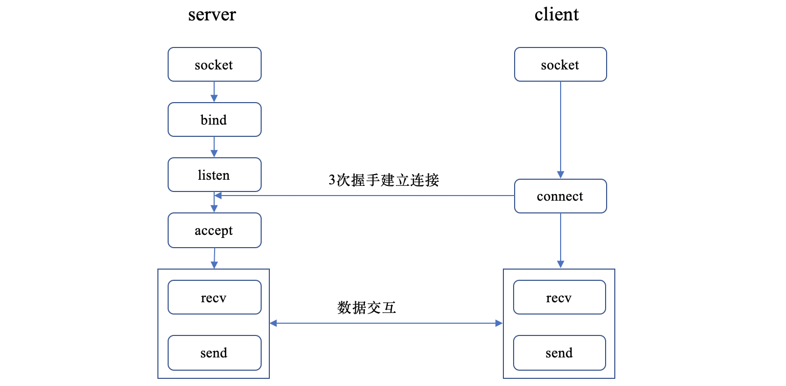
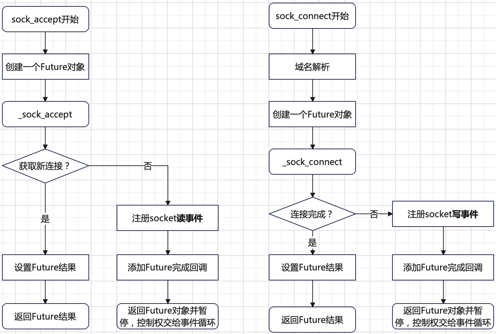
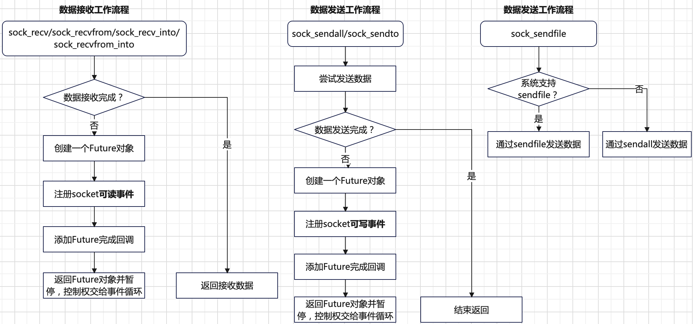
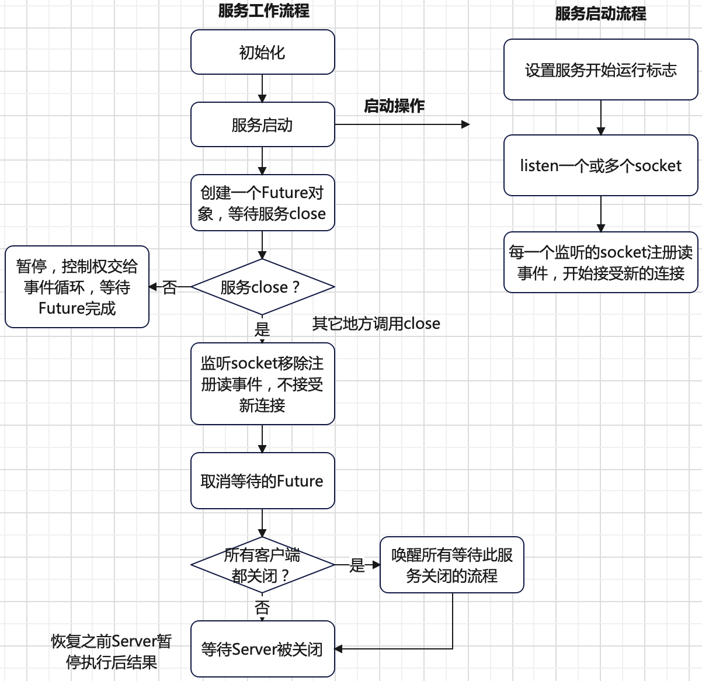
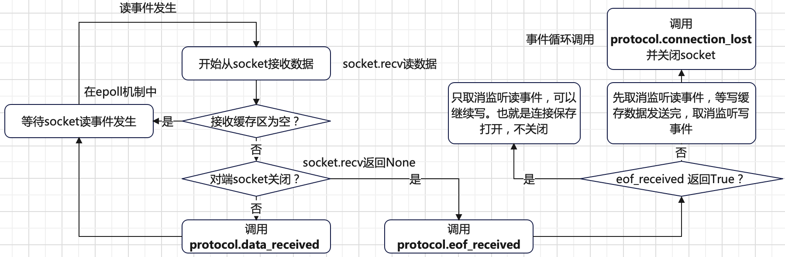
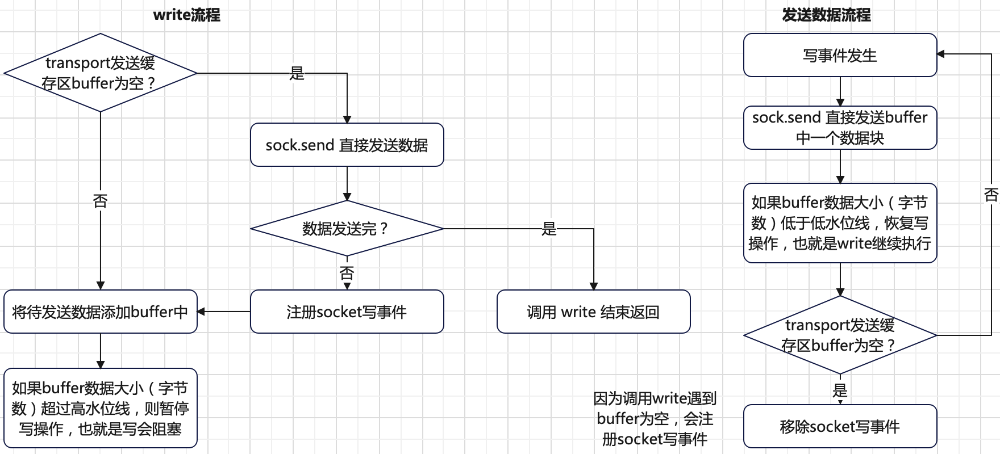
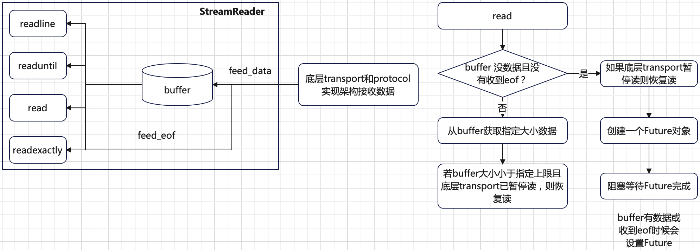
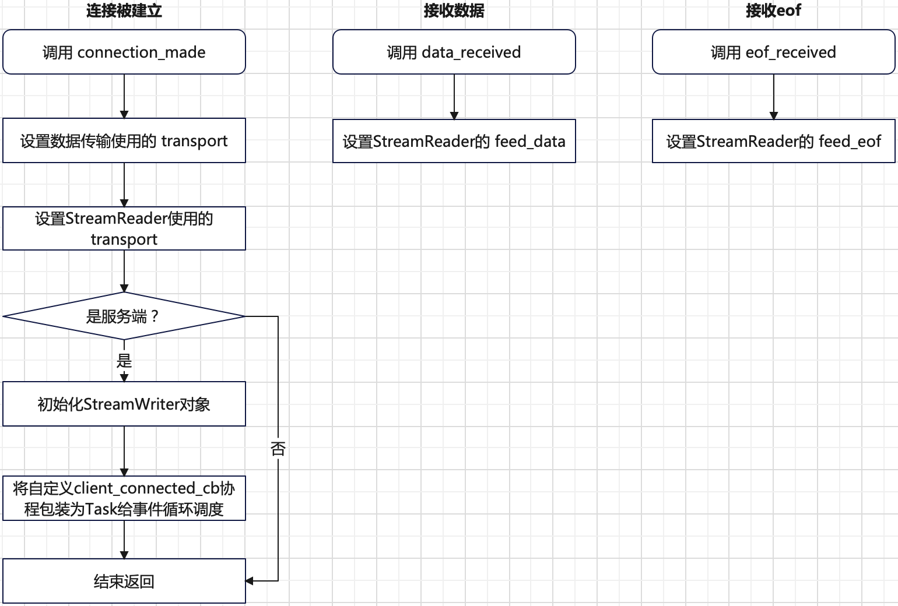

# 引言
针对网络编程，`asyncio`库提供了三种形式：
+ 底层`socket`接口。
+ 基于`socket`封装的`Transports&Protocols`。
+ 基于`Transports&Protocols`封装的`Streams`三种方式。
# Socket
基于`TCP`的`socket`编程一般流程如下：

详细的入门指导可参考 [同步socket编程](https://realpython.com/python-sockets/)。`asyncio`库提供了`socket`编程`API`部分同步接口的异步版本：
```python
async def sock_recv(self, sock, nbytes):
    raise NotImplementedError

async def sock_recv_into(self, sock, buf):
    raise NotImplementedError

async def sock_recvfrom(self, sock, bufsize):
    raise NotImplementedError

async def sock_recvfrom_into(self, sock, buf, nbytes=0):
    raise NotImplementedError

async def sock_sendall(self, sock, data):
    raise NotImplementedError

async def sock_sendto(self, sock, data, address):
    raise NotImplementedError

async def sock_connect(self, sock, address):
    raise NotImplementedError

async def sock_accept(self, sock):
    raise NotImplementedError

async def sock_sendfile(self, sock, file, offset=0, count=None,
                        *, fallback=None):
    raise NotImplementedError
```
先看一个具体的基于`asyncio`实现的`socket`编程。服务端代码如下：
```python
import socket
import asyncio

port = 9006

async def handle_client(client, addr):
    loop = asyncio.get_event_loop()
    result = None
    while result != "quit":
        result = await loop.sock_recv(client, 1024)
        result = result.decode()
        print("got from {0}: {1}".format(addr, result))
        response = "got message"
        await loop.sock_sendall(client, response.encode())
    client.close()

async def run_server():
    server = socket.socket(socket.AF_INET, socket.SOCK_STREAM)
    server.bind(("", port))
    server.listen(5)
    server.setblocking(False)

    loop = asyncio.get_event_loop()

    while True:
        client, addr = await loop.sock_accept(server)
        print("connected to client: ", addr)
        loop.create_task(handle_client(client, addr))

asyncio.run(run_server())
```
客户端代码如下：
```python
import socket
import asyncio

async def request():
    loop = asyncio.get_event_loop()
    client = socket.socket(socket.AF_INET, socket.SOCK_STREAM)
    await loop.sock_connect(client, ("127.0.0.1", 9006))
    await loop.sock_sendall(client, "ack from client connect success".encode())
    result = await loop.sock_recv(client, 1024)
    print(result.decode())
    while True:
        send_message = input()
        await loop.sock_sendall(client, send_message.encode())
        if send_message == "quit":
            break
        receive_message = await loop.sock_recv(client, 1024)
        print("got message from server: ", receive_message.decode())
    client.close()

asyncio.run(request())
```
运行服务端代码和客户端代码，输出结果如下:
```bash
# 服务端结果
$ python3 server.py
connected to client:  ('127.0.0.1', 57404)
got from ('127.0.0.1', 57404): ack from client connect success
got from ('127.0.0.1', 57404): hello world
got from ('127.0.0.1', 57404): quit

# 客户端结果
$ python3 client.py
got message
hello world
got message from server:  got message
quit
$
```
上面的服务端和客户端在建立连接过程中分别使用了`sock_accept`和`sock_connect`异步接口，工作原理可以总结如下：



在`sock_accept`和`sock_connect`内部工作流程中注册的`Future`完成回调方法分别是`self._sock_read_done` 
和`self._sock_write_done`，确保在`Future`完成时将注册监听的`socket`移除。

对于`sock_connect`方法，当注册的**套接字变为可写时，意味这连接已经完成**。异步编程中，`socket`必须设置为非阻塞模式。
在下面情况发生时，会抛出`BlockingIOError`异常：
+ **没有新连接到来**，针对`sock_accept`方法；
+ **连接没完成**，针对`sock_connect`方法；
+ **接收缓存区为空**，针对`sock_recvxxx`方法；
+ **发送缓存区满**，针对`sock_sendxxx`方法；

客户端和服务端的数据交互。数据**接收**涉及的异步接口如下：
+ `sock_recv`：从套接字接收数据，返回接收的字节数组。
+ `sock_recvfrom`：从套接字接收数据，返回接收字节数组和发送方地址信息。
+ `sock_recv_into`：从套接字接收数据，并直接写入缓存区（如`bytearray`或`memoryview`）。减少内存分配和拷贝。
返回接收的字节数。
+ `sock_recvfrom_into`：从套接字接收数据，并将其写入到指定缓冲区，同时获取发送方的地址信息。

数据**发送**涉及的异步接口如下：
+ `sock_sendall`：发送数据到已建立连接的套接字，直到指定数据发送完成。
+ `sock_sendto`：发送数据到指定的目标地址。可用于已连接的套接字，也可用于未连接的套接字（`UDP`）。
+ `sock_sendfile`：尝试调用底层的`sendfile`系统调用方法。避免发送数据在内核态和用户态拷贝，适合大文件传输。

异步`socket`数据接收和数据发送工作流程如下：



其中注册的`Future`完成回调都是在函数的功能完成后，取消注册的`socket`监听事件。`send`和`sendto`补充说明如下：
+ `socket.send`：只能用于`TCP`协议，也就是提前建立好连接。每次调用，实际发送的数据大小可能小于指定的`data`大小，
具体根据发送缓存区剩余空间。大数据`data`需要分多次调用`send`传输。
+ `socket.sendto`：一般用于`UDP`协议，不需要提前建立连接。每次调用，需要保证发送数据`data`大小要小于发送缓存区大小。
数据`data`是通过**一次调用**传输。如果发送数据超过发送缓存区大小，抛出如下异常：
  ```bash
  OSError: [Errno 90] Message too long
  ```

# Transports&Protocols
`asyncio`基于底层`socket`封装了`Transports&Protocols`抽象层。屏蔽了底层 `socket`细节。其有如下特点：
+ `Transports`和`Protocols`被底层的事件循环`API`调用，例如`loop.create_connection()`。其实现是基于回调的模式，并且其实现具有有较高的性能。
+ `Transports`考虑**怎么传输数据**，而`Protocols`决定**哪些数据被传输**。`Transports`是底层`socket`的抽象，而`Protocols`是应用的抽象。
+ `Transports`和`Protocols`总是成对出现，互相调用其接口。

下面看一个基于`Transports`和`Protocols`实现的具体的样例。服务端代码如下：
```python
import asyncio
import signal

class EchoServerProtocol(asyncio.Protocol):
    def connection_made(self, transport):
        peername = transport.get_extra_info("peername")
        print("Connection from {0}".format(peername))
        self.transport = transport

    def data_received(self, data):
        message = data.decode()
        print("Data received: {0}".format(message))
        print("Send: {0}".format(message))
        self.transport.write(data)
        print("Close the client socket")
        self.transport.close()


async def main():
    loop = asyncio.get_event_loop()
    server = await loop.create_server(lambda: EchoServerProtocol(),
                                      "127.0.0.1", 8888, start_serving=False)
    async with server:
        await server.serve_forever()

asyncio.run(main())
```
客户端代码如下：
```python
import asyncio

class EchoClientProtocol(asyncio.Protocol):
    def __init__(self, message, on_con_lost):
        self.message = message
        self.on_con_lost = on_con_lost

    def connection_made(self, transport):
        transport.write(self.message.encode())
        print("Data sent: {0}".format(self.message))

    def data_received(self, data):
        print("Data received: {0}".format(data.decode()))

    def connection_lost(self, exc):
        print("The server closed the connection")
        self.on_con_lost.set_result(True)

async def main():
    loop = asyncio.get_running_loop()
    on_con_lost = loop.create_future()
    message = 'Hello World!'
    transport, protocol = await loop.create_connection(
        lambda: EchoClientProtocol(message, on_con_lost), '127.0.0.1', 8888
    )
    # Wait until the protocol signals that the connection is lost and close the transport.
    try:
        await on_con_lost
    finally:
        transport.close()

asyncio.run(main())
```
运行结果如下：
```bash
# server
$ (master) python3 tcp_server.py
Connection from ('127.0.0.1', 51257)
Data received: Hello World!
Send: Hello World!
Close the client socket

# client
$ (master) python3 tcp_client.py
Data sent: Hello World!
Data received: Hello World!
The server closed the connection
```
服务端调用`loop.create_server`创建一个`TCP socket`服务，客户端调用`loop.create_connection`和服务端通信，
配合自定义`Protocols`类，轻松实现网络编程。
```python
# 创建服务端
async def create_server(
        self, protocol_factory, host=None, port=None,
        *,
        family=socket.AF_UNSPEC,
        flags=socket.AI_PASSIVE,
        sock=None,
        backlog=100,
        ssl=None,
        reuse_address=None,
        reuse_port=None,
        ssl_handshake_timeout=None,
        ssl_shutdown_timeout=None,
        start_serving=True):

# 连接到一个服务端
async def create_connection(
        self, protocol_factory, host=None, port=None,
        *, ssl=None, family=0,
        proto=0, flags=0, sock=None,
        local_addr=None, server_hostname=None,
        ssl_handshake_timeout=None,
        ssl_shutdown_timeout=None,
        happy_eyeballs_delay=None, interleave=None,
        all_errors=False):
```

上述样例涉及了三个重要概念`Transports`、`Protocols`和`Server`。

## Server
`Server`是一个抽象概念，可以认为是一个服务实体，由`loop.create_server`方法返回。一个`Server`对象内部会记录所有连接的客户端，每一个客户端都有独立的`transport`。
`Server`对象的工作流程如下：



`Server`对象提供了`self._attach`和`self._detach`两个方法用于记录和删除每一个建立连接客户端创建的`transport`实例。

服务的关闭流程优雅写法如下：
```python
self.close()
await self.wait_closed()
```
因为需要等待所有客户端都关闭后，一个服务才算真正关闭，否则有资源泄漏。当所有客户端都关闭后，会调用`Server`的`self._wakeup`方法。
以唤醒所有调用`self.wait_closed`而暂停的地方。

服务`Server`启动之后，会一直监听有没有新的客户端连接。当新的客户端连接到来时，建立连接后的工作流程主要涉及`Transports`和`Protocols`。

## Transports 和 Protocols
当新的客户端连接建立完成（调用`socket.accept`成功），会接着初始化`transport`对象。每一个客户端都对应一个`transport`实例。
建立客户端连接初始化阶段流程如下：


上述流程中，调用方创建的`Future`对象会在实例化`transport`后，等待`protocol.connection_made`方法执行后，才会被设置完成，
进而恢复调用方执行，也就是调用方执行完流程并退出结束。
```python
# transport 实例化
class _SelectorSocketTransport(_SelectorTransport):

    _start_tls_compatible = True
    _sendfile_compatible = constants._SendfileMode.TRY_NATIVE

    def __init__(self, loop, sock, protocol, waiter=None, extra=None, server=None):
        ...

        # Disable the Nagle algorithm -- small writes will be
        # sent without waiting for the TCP ACK.  This generally
        # decreases the latency (in some cases significantly.)
        base_events._set_nodelay(self._sock)

        self._loop.call_soon(self._protocol.connection_made, self)
        # only start reading when connection_made() has been called
        self._loop.call_soon(self._add_reader, self._sock_fd, self._read_ready)
        if waiter is not None:
            # only wake up the waiter when connection_made() has been called
            self._loop.call_soon(futures._set_result_unless_cancelled, waiter, None)
```
`transport`实例化核心完成工作如下：
```bash
+------------+      +-------------------------------------+      +-----------------+      +---------------------+
|禁用Nagle算法| ---> |添加protocol.connection_made事件循环方法| ---> |注册已连接sock读事件| ---> |设置调用方等待Future完成|
+------------+      +-------------------------------------+      +-----------------+      +---------------------+
```
只有`protocol.connection_made`方法被成功调用，才认为客户端连接成功建立，才可以注册`socket`读事件开始接收数据。
最后设置调用方等待的`Future`对象`waiter`，也即是`async def _accept_connection2`方法恢复运行完成客户端连接建立连接初始化。

**客户端连接建立调用`protocol`的第一个方法是`connection_made`**。每一个建立连接的用于通信的`socket`都有一个`transport`对象，
用于数据传输。

连接建立完成后，开始数据传输。数据传输**读**工作流程总结如下：



利用`transport`读流程涉及的`protocol`方法如下：
```python
# 建立连接调用方法
def connection_made(self, transport):
    pass
# 接收数据调用方法
def data_received(self, data):
    pass
# 对端关闭或发送eof，调用write_eof
def eof_received(self):
    pass
# 关闭连接或者连接异常
def connection_lost(self, exc):
    pass
```
每次建立客户端连接，实例化`transport`时，都会调用`Server`对象的`_attach`方法以注册客户端`transport`实例。
当关闭连接，`transport`被关闭时候，会调用`Server`的`_detach`方法以取消客户端`transport`实例。

`transport`实例对外提供了如下**发送数据**相关的方法：
```python
# 其中 data 必须是 bytes-like 对象
def write(self, data):
    pass
# 关闭写端，也就是不能发送数据，但还可以接收数据
def write_eof(self):
    pass
# list_of_data 是一个可迭代对象，每一个元素 data 都是 bytes-like 对象
def writelines(self, list_of_data):
    pass
```
数据传输**写**流程工作如下：



`transport`写流程涉及的`protocol`方法如下：
```python
# buffer 数据大小（字节数）超过高水位线调用，会暂停 write 方法执行
def pause_writing(self):
    pass
# buffer 数据大小（字节数）低于低水位线调用，会恢复 write 方法执行
def resume_writing(self):
    pass
```
因为`buffer`底层数据结构是没有大小限制的，如果不限制则可能导致`buffer`太大，导致服务器崩溃。

在`transport`写逻辑过程中涉及`eof`机制，`eof`机制用于告诉对位的读端在收到这个标记后就不需要再接收数据，且后续的数据发送完后也请尽快的关闭。
```python
def write_eof(self):
    if self._closing or self._eof:
        return
    self._eof = True
    if not self._buffer:
        self._sock.shutdown(socket.SHUT_WR)
```
其实`write_eof`就是判断`buffer`没数据的时候，关闭`socket`的写端。表示后续不会发送数据，但还可以接收数据。

可以看到，在`transport`实例内部发送数据使用了`buffer`机制，可以使得调用`write`方法更快执行，进而节约时间处理其它业务逻辑。
毕竟数据直接写缓存比通过网络`IO`快很多。

# Streams
基于`Transports`和`Protocols`，`asyncio`实现了更高级别的`Streams`用于网络编程。
`Streams`将基于回调的`Transports`和`Protocols`的异步网络编程模式转为同步编程模式，使得开发更加高效。

下面是基于`Streams`实现的`TCP`服务端和客户端样例。
**服务端代码如下**：
```python
import asyncio

async def handle_echo(reader, writer):
    data = await reader.read(100)
    message = data.decode()
    addr = writer.get_extra_info('peername')

    print(f"Received {message!r} from {addr!r}")

    print(f"Send: {message!r}")
    writer.write(data)
    await writer.drain()

    print("Close the connection")
    writer.close()
    await writer.wait_closed()

async def main():
    server = await asyncio.start_server(
        handle_echo, '127.0.0.1', 8888)

    addrs = ', '.join(str(sock.getsockname()) for sock in server.sockets)
    print(f'Serving on {addrs}')

    async with server:
        await server.serve_forever()

asyncio.run(main())
```
**客户端代码如下**：
```python
import asyncio

async def tcp_echo_client(message):
    reader, writer = await asyncio.open_connection(
        '127.0.0.1', 8888)

    print(f'Send: {message!r}')
    writer.write(message.encode())
    await writer.drain()

    data = await reader.read(100)
    print(f'Received: {data.decode()!r}')

    print('Close the connection')
    writer.close()
    await writer.wait_closed()

asyncio.run(tcp_echo_client('Hello World!'))
```
基于`Streams`实现的`TCP`编程，代码简洁清晰，编程思想符合同步编程实现。从样例可以看到，服务端主要调用`start_server`，
其返回一个`Server`对象；客户端主要调用`open_connection`，其返回读写流用于数据交换。
```python
# 启动一个服务端
async def start_server(client_connected_cb, host=None, port=None, *, limit=_DEFAULT_LIMIT, **kwds):
    loop = events.get_running_loop()
    def factory():
        reader = StreamReader(limit=limit, loop=loop)
        protocol = StreamReaderProtocol(reader, client_connected_cb,
                                        loop=loop)
        return protocol
    return await loop.create_server(factory, host, port, **kwds)

# 客户端连接服务端
async def open_connection(host=None, port=None, *, limit=_DEFAULT_LIMIT, **kwds):
    loop = events.get_running_loop()
    reader = StreamReader(limit=limit, loop=loop)
    protocol = StreamReaderProtocol(reader, loop=loop)
    transport, _ = await loop.create_connection(
        lambda: protocol, host, port, **kwds)
    writer = StreamWriter(transport, protocol, reader, loop)
    return reader, writer
```
基于`Streams`的网络编程涉及`StreamWriter`、`StreamReader`和`StreamReaderProtocol`三个对象。

## StreamReader
`StreamReader`对象是读流对象，用于按流式方式读取接收的数据。对外提供如下接口：
```python
# 读取数据直到遇到 separator，返回的数据包含 separator 
async def readuntil(self, separator=b'\n'):
    pass
# 如果n = 0，返回空字节数组；
# 如果n < 0，会一直读，直到遇到 EOF，返回包含所有读到数据的字节数组；
# 如果n > 0，会返回最多 n 个字节，最少 1 个字节的数组；
async def read(self, n=-1):
    pass
# 如果n = 0，返回空字节数组；
# 如果n < 0，抛出异常；
# 如果n > 0，返回 n 个字节数组；若收到 eof 后缓存数据少于 n，抛出异常
async def readexactly(self, n):
    pass
# 读取一行数据，也就是读取遇到 b`\n` 为止。返回的数据包含b`\n`
async def readline(self):
    pass
```
读流的工作流程可总结如下：



`StreamReader`的`read`相关方法是**同步方法**。如果缓存`buffer`没有数据则会阻塞等待，直到缓存`buffer`有数据或者收到`eof`。

为了保证缓存`buffer`中累加的数据不会太多，每次通过`feed_data(self, data)`添加数据时都会判断缓存已有数据是否超过上限的两倍，
如果超过则会暂停底层`transport`的读操作，暂停期间存在数据接收丢失风险。每次通过`read`相关方法获取数据，会判断缓存数据是否低于水位线，进而恢复底层`transport`的读操作。

存在一个问题，**`buffer`中的数据是怎么被添加的**？接着看`StreamReaderProtocol`对象。

## StreamReaderProtocol
`Streams`是基于`transport`和`protocol`实现。为适配流式编程实现，实现了`StreamReaderProtocol`。其实现了如下`protocol`方法：
```python
# 暂停发送数据
def pause_writing(self):
    pass
# 恢复发送数据
def resume_writing(self):
    pass
# 连接丢失或对端关闭
def connection_lost(self, exc):
    pass
# 连接建立
def connection_made(self, transport):
    pass
# 接收到数据
def data_received(self, data):
    pass
# 接收到 eof
def eof_received(self):
    pass
```
下面总结了`StreamReaderProtocol`部分工作流程：



`StreamReaderProtocol`不对外开放，用户只需要实现自己的`client_connected_cb`方法即可，接口定义如下：
```python
# client_reader 是 StreamReader 对象；
# client_writer 是 StreamWriter 对象；
async def client_connected_cb(client_reader, client_writer):
    pass
```
至此直到了连接建立到流式数据数据接收的工作原理。而流式数据发送是通过`StreamWriter`对象实现。

## StreamWriter
`StreamWriter`用于流式的数据发送。上面介绍`transport`和`protocol`部分已经知道，`transport`写数据会通过先将数据写到缓存，
后台通过`epoll`机制，通过`socket`写事件将缓存数据发送走。这种实现方式已经式流式写。所以`StreamWriter`提供的写方法直接调用`transport`写实现：
```python
# 其中 data 必须是 bytes-like 对象
def write(self, data):
    self._transport.write(data)
# data 是一个可迭代对象，每一个元素都是 bytes-like 对象
def writelines(self, data):
    self._transport.writelines(data)
# 关闭写端，也就是不能发送数据，但还可以接收数据
def write_eof(self):
    return self._transport.write_eof()
```
发送数据使用样例如下：
```python
writer.write(data)
await writer.drain()
```
在上面的介绍中，`transport`发送数据过程中，为防止`transport`使用的缓存大小太大，会控制写暂停和写恢复以控制缓存大小。
```python
# protocol 实现的写暂停
def pause_writing(self):
    pass

# protocol 实现写恢复
def resume_writing(self):
    pass
```
所以在`await writer.drain`中会判断当前底层`transport`写是否暂停，如果暂停则等待直到写恢复。否则立刻返回。

优雅关闭写流实现如下：
```python
writer.close()
await writer.wait_closed()
```
`await writer.wait_closed`会等待底层`transport`关闭后才返回，确保所有数据发送完成，优雅退出。
