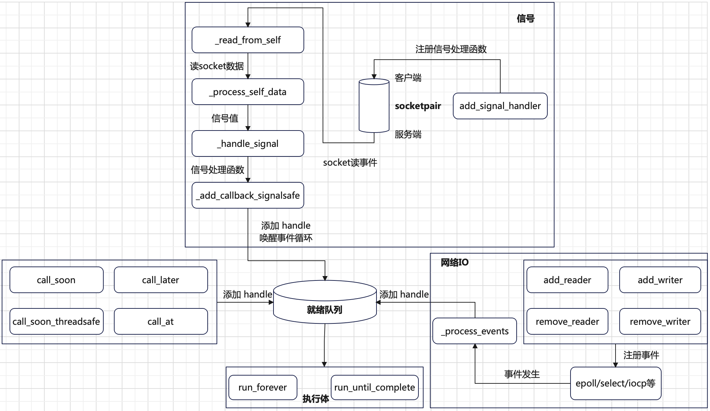
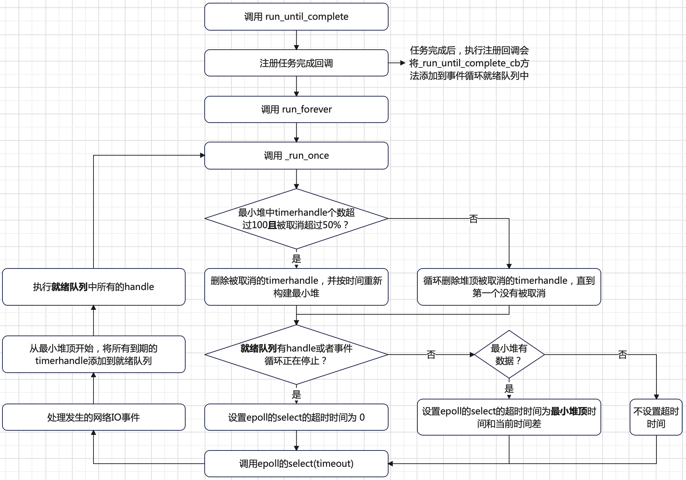
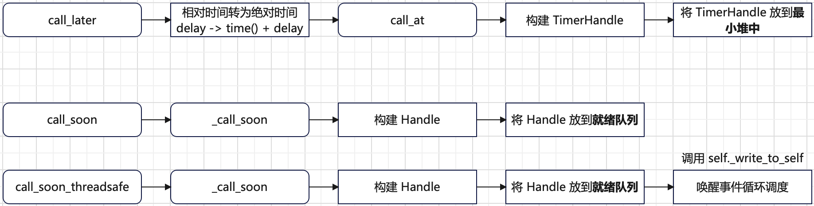
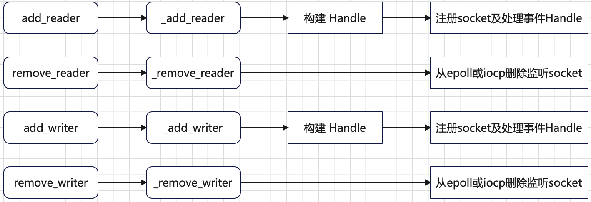

# 引言
在[核心概念](./asyncio-futures-tasks-coroutines.md)我们了解了`Futures`、`Tasks`和`Coroutines`的实现原理。本章我们将了解`asyncio`的调度原理。



`asyncio`的核心是事件循环。上图是事件循环中调度相关部分的工作原理。可将调度逻辑分为**任务添加**和**任务执行**两大块。
其中一个任务`Task`在**调度内部**会被包装为`Handle`实体。

# Handle
`Handle`本身是对回调方法的进一步封装。增加了如下能力：
+ 取消能力：在`Handle`被执行之前可以被取消。
+ 提供异步环境下每一个`Handle`的上下文安全：每一个`Handle`通过`contextvars.copy_context()`实现自己独立上下文环境，
解决共享变量安全问题。
+ 异常处理能力：捕获并处理每一个`Handle`执行过程中可能抛出的异常。

`asyncio`提供了两种类型的`Handle`实体：
+ `Handle`：需要立刻执行；
+ `TimerHandle`：在将来的某一时刻执行；

`Handle`的构建样例如下：
```python
# 构建一个 TimerHandle
timer = events.TimerHandle(when, callback, args, self, context)
# 构建一个 Handle
handle = events.Handle(callback, args, self, context)
```

# 任务执行
协程被执行的入口函数是`asyncio.run`方法。`asyncio.run`的工作大体流程如下：
```bash
+-------------+    +---------------+    +-------------------------------------+
|创建事件循环对象|--->|将协程封装为 Task|--->|调用事件循环的 run_until_complete(task)|
+-------------+    +---------------+    +-------------------------------------+
```
在事件循环调度内部，`Handle`被执行的详细流程如下：



在`asyncio`调度内部，事件循环有两个核心的队列：
+ **就绪队列**：一个`FIFO`队列，里面的`Handle`会尽可能快地执行。
+ **最小堆**：按时间指标构建，存放所有的`TimerHandle`实体。

如果调用`run_until_complete`方法，会注册一个任务完成回调`_run_until_complete_cb`方法。做的唯一工作就是停止当前的事件循环。
```python
def _run_until_complete_cb(fut):
    if not fut.cancelled():
        exc = fut.exception()
        if isinstance(exc, (SystemExit, KeyboardInterrupt)):
            # Issue #22429: run_forever() already finished, no need to
            # stop it.
            return
    # 停止事件循环
    futures._get_loop(fut).stop()
```
在调度的内部使用了`epoll`或者`iocp`模型以处理高效的网络`IO`。所以`asyncio`特别适合网络编程，实现单线程高效率的`IO`处理。

# 任务添加
任务添加是指将要执行的任务添加到事件循环的调度队列中。类比将多线程或多进程任务提交到操作系统调度执行。在`asyncio`中，
事件循环中任务的添加方式有三种：
+ 调用`loop.call_xxx`方法直接添加到调度的就绪队列或者最小堆中。
+ 利用`IO`多路复用模型`epoll`或`iocp`将注册的`socket`事件处理函数，在事件发生时，添加到事件循环的就绪队列中。
+ 利用`socketpair`将信号处理函数，在信号发生时，添加到事件循环的就绪队列中。

## 直接添加任务
`asyncio`的事件循环类提供了`call_soon`、`call_at`、`call_later`和`call_soon_threadsafe`四个方法用于将执行的任务直接添加到事件循环调度的最小堆或就绪队列中。
四个方法的定义如下：
```python
# 相对当前时刻往后 delay 时间后执行
def call_later(self, delay, callback, *args, context=None):
    pass
# 将来时刻 when 执行
def call_at(self, when, callback, *args, context=None):
    pass
# 尽可能快地执行
def call_soon(self, callback, *args, context=None):
    pass
# 也是尽可能快地执行，线程安全的调用方式
def call_soon_threadsafe(self, callback, *args, context=None):
    pass
```
上述四个方法的工作流程总结如下：



其中`call_at`、`call_later`和`call_soon`三个方法是在事件循环的线程中调用。但`call_soon_threadsafe`方法是在其它线程中调用，
也就是调用线程和事件循环线程不是同一个。所谓的线程安全主要体现在如下两个方面：
+ 唤醒事件循环调度。为了处理网络`IO`，事件循环使用了高效的`epoll`或`IOCP`模型。如果没有相关`IO`事件发生，
事件循环调度可能会阻塞在`self._selector.select(timeout)`处。所以在其它线程添加任务，需要唤醒事件循环。
+ 事件循环调度被唤醒后，在事件循环线程上下文中执行添加的方法，可以安全的访问事件循环的所有对象。

唤醒事件循环调度的方法`self._write_to_self`实现如下：
```python
def _write_to_self(self):
    # This may be called from a different thread, possibly after
    # _close_self_pipe() has been called or even while it is
    # running.  Guard for self._csock being None or closed.  When
    # a socket is closed, send() raises OSError (with errno set to
    # EBADF, but let's not rely on the exact error code).
    csock = self._csock
    if csock is None:
        return
    try:
        csock.send(b'\0')
    except OSError:
        if self._debug:
            logger.debug("Fail to write a null byte into the "
                         "self-pipe socket",
                         exc_info=True)
```
因为在事件循环初始化阶段会创建一个`socketpair`用于事件循环内部通信。
```python
def _make_self_pipe(self):
    # A self-socket, really. :-)
    self._ssock, self._csock = socket.socketpair()
    self._ssock.setblocking(False)
    self._csock.setblocking(False)
    self._internal_fds += 1
    self._add_reader(self._ssock.fileno(), self._read_from_self)
```
至此，`self._write_to_self`唤醒工作原理总结如下：
+ `socketpair`的服务端`self._ssock`往`epoll`或`iocp`注册了`socket`读事件。
+ `self._write_to_self`往`socketpair`的客户端`self._csock`写一个空字符。
+ `socketpair`服务端`self._ssock`产生可读事件。
+ 唤醒`self._selector.select(timeout)`，使得事件循环开始运行。

## 网络IO任务
`asyncio`使用了常用的`epoll`或者`IOCP`网络`IO`模型来高效处理网络`IO`事件。提供了四个接口用于注册或删除事件处理函数，
分别是`add_reader`、`remove_reader`、`add_writer`和`remove_writer`。
```python
def add_reader(self, fd, callback, *args):
    pass

def remove_reader(self, fd):
    pass

def add_writer(self, fd, callback, *args):
    pass

def remove_writer(self, fd):
    pass
```
上面四个方法的工作流程可简化如下：



如果某个`socket`注册事件发生时，在事件循环调度`self._selector.select(timeout)`会返回相关`socket`及事件处理`Handle`。
接着通过`self._process_events`方法处理相关的`Handle`。
```python
def _process_events(self, event_list):
    for key, mask in event_list:
        fileobj, (reader, writer) = key.fileobj, key.data
        if mask & selectors.EVENT_READ and reader is not None:
            if reader._cancelled:
                self._remove_reader(fileobj)
            else:
                self._add_callback(reader)
        if mask & selectors.EVENT_WRITE and writer is not None:
            if writer._cancelled:
                self._remove_writer(fileobj)
            else:
                self._add_callback(writer)
```
`self._process_events`做的事件就是将相关`Handle`添加到事件循环的**就绪队列**中等待被执行。

## 信号处理任务
在事件循环初始化时会创建一个`socketpair`对象。
```python
def _make_self_pipe(self):
    # A self-socket, really. :-)
    self._ssock, self._csock = socket.socketpair()
    self._ssock.setblocking(False)
    self._csock.setblocking(False)
    self._internal_fds += 1
    self._add_reader(self._ssock.fileno(), self._read_from_self)
```
> `socketpair`的特点就是：在一端写数据，在另一端可以读相关数据。常用于进程间通信。

创建`socketpair`后，会将一端`self._ssock`可读事件及处理函数`self._read_from_self`注册到`epoll/IOCP`。

`asyncio`提供了`add_signal_handler`方法用于往事件循环中添加信号处理函数。`add_signal_handler`的核心逻辑如下：
```python
def add_signal_handler(self, sig, callback, *args):
    ...
    try:
        # set_wakeup_fd() raises ValueError if this is not the
        # main thread.  By calling it early we ensure that an
        # event loop running in another thread cannot add a signal
        # handler.
        signal.set_wakeup_fd(self._csock.fileno())
    except (ValueError, OSError) as exc:
        raise RuntimeError(str(exc))

    handle = events.Handle(callback, args, self, None)
    self._signal_handlers[sig] = handle
    ...
```
其中`signal.set_wakeup_fd(self._csock.fileno)`用于在接收到信号时，将信号通知写入一个文件描述符，也就是写入`self._csock`。
这样`socketpair`的另一端`self._ssock`就会有读事件发生。接着通过如下的事件处理调用链：
```bash
+--------------------+    +-----------------------------+    +---------------------------+    +-------------------------------------+
|self._read_from_self|--->|self._process_self_data(data)|--->|self._handle_signal(signum)|--->|self._add_callback_signalsafe(handle)|
+--------------------+    +-----------------------------+    +---------------------------+    +-------------------------------------+
```
将事件处理函数添加到事件循环的调度**就绪队列中**。同时最后也会通过`self._write_to_self`唤醒事件循环调度，
因为信号的发生也是异步的，不是在事件循环线程上下文中。
