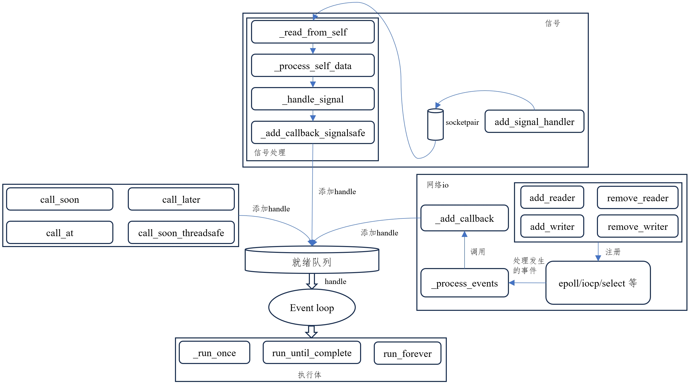

# 引言
在 [futures&tasks&coroutines原理](./asyncio-futures-tasks-coroutines.md) 我们了解
了`Futures`、`Tasks`和`Coroutines`的实现原理，本章我们将了解 asyncio 的调度原理。


asyncio 库调度核心可以分为**任务执行**与**任务添加**，这里的任务不是`Task`，而是一个就绪
队列中可执行 handle。二者相互合作，使得 asyncio 调度可以模拟并行运行多个`Task`。接下来
将分别介绍**任务执行**和**任务添加**。

# 任务执行
任务执行逻辑比较简单，就是通过执行体`run_until_compelte`或`run_forever`最终调用
`_run_once`不断从就绪队列取出一个 handle 然后运行。在介绍执行体`run_until_compelte`、
`run_forever`和`_run_once`之前，我们先弄明白什么是 handle。
## Handle
源码有两种 Handle 实现，分别是不带时间的普通 Handle 和带时间的TimerHandle，
先看和时间无关的 Handle，源码如下：
```python
class Handle:
    ...
    def __init__(self, callback, args, loop, context=None):
        if context is None:
            context = contextvars.copy_context()
        self._context = context
        self._loop = loop
        self._callback = callback
        self._args = args
        self._cancelled = False
        self._repr = None
        if self._loop.get_debug():
            self._source_traceback = format_helpers.extract_stack(
                sys._getframe(1))
        else:
            self._source_traceback = None

    ...

    def cancel(self):
        if not self._cancelled:
            self._cancelled = True
            if self._loop.get_debug():
                # Keep a representation in debug mode to keep callback and
                # parameters. For example, to log the warning
                # "Executing <Handle...> took 2.5 second"
                self._repr = repr(self)
            self._callback = None
            self._args = None

    def cancelled(self):
        return self._cancelled

    def _run(self):
        try:
            self._context.run(self._callback, *self._args)
        except (SystemExit, KeyboardInterrupt):
            raise
        except BaseException as exc:
            cb = format_helpers._format_callback_source(
                self._callback, self._args)
            msg = f'Exception in callback {cb}'
            context = {
                'message': msg,
                'exception': exc,
                'handle': self,
            }
            if self._source_traceback:
                context['source_traceback'] = self._source_traceback
            self._loop.call_exception_handler(context)
        self = None  # Needed to break cycles when an exception occurs.
```
可以看到，Handle 可以看成是事件循环中要执行方法 (callback) 的封装，增加的取消
和异常处理的能力。TimerHandle 是 Handle 的子类，额外增加了和事件有关的属性以及
排序相关的方法，其源码如下：
```python
class TimerHandle(Handle):
    """Object returned by timed callback registration methods."""

    __slots__ = ['_scheduled', '_when']

    def __init__(self, when, callback, args, loop, context=None):
        assert when is not None
        super().__init__(callback, args, loop, context)
        if self._source_traceback:
            del self._source_traceback[-1]
        # 表示可以被执行的时间点，当前时间大于等于 when 时候，此 handle 可以被执行
        self._when = when
        # 表示是否等待被调度
        self._scheduled = False

    ...

    def __hash__(self):
        return hash(self._when)

    def __lt__(self, other):
        return self._when < other._when

    def __le__(self, other):
        if self._when < other._when:
            return True
        return self.__eq__(other)

    def __gt__(self, other):
        return self._when > other._when

    def __ge__(self, other):
        if self._when > other._when:
            return True
        return self.__eq__(other)

    def __eq__(self, other):
        if isinstance(other, TimerHandle):
            return (self._when == other._when and
                    self._callback == other._callback and
                    self._args == other._args and
                    self._cancelled == other._cancelled)
        return NotImplemented

    def __ne__(self, other):
        equal = self.__eq__(other)
        return NotImplemented if equal is NotImplemented else not equal

    def cancel(self):
        if not self._cancelled:
            self._loop._timer_handle_cancelled(self)
        super().cancel()

    def when(self):
        """Return a scheduled callback time.

        The time is an absolute timestamp, using the same time
        reference as loop.time().
        """
        return self._when
```
知道了什么是 handle，接下来看看执行体的实现原理。
## 执行体
`run_until_compelte`、`run_forever`和`_run_once`驱动着事件循环不断的运行，
其源码如下：
```python
def run_until_complete(self, future):
    """Run until the Future is done.

    If the argument is a coroutine, it is wrapped in a Task.

    WARNING: It would be disastrous to call run_until_complete()
    with the same coroutine twice -- it would wrap it in two
    different Tasks and that can't be good.

    Return the Future's result, or raise its exception.
    """
    self._check_closed()
    self._check_running()

    new_task = not futures.isfuture(future)
    # 将一个协程转为一个Task
    future = tasks.ensure_future(future, loop=self)
    if new_task:
        # An exception is raised if the future didn't complete, so there
        # is no need to log the "destroy pending task" message
        future._log_destroy_pending = False
    # 将这个任务添加完成回调，任务完成后会通知事件循环退出
    future.add_done_callback(_run_until_complete_cb)
    try:
        # 委托 run_forever
        self.run_forever()
    except:
        if new_task and future.done() and not future.cancelled():
            # The coroutine raised a BaseException. Consume the exception
            # to not log a warning, the caller doesn't have access to the
            # local task.
            future.exception()
        raise
    finally:
        future.remove_done_callback(_run_until_complete_cb)
    if not future.done():
        raise RuntimeError('Event loop stopped before Future completed.')

    return future.result()
```
`run_until_compelte`内部委托 `run_forever`调用，`run_forever`的源码如下：
```python
def run_forever(self):
    """Run until stop() is called."""
    self._check_closed()
    self._check_running()
    self._set_coroutine_origin_tracking(self._debug)
    self._thread_id = threading.get_ident()

    old_agen_hooks = sys.get_asyncgen_hooks()
    sys.set_asyncgen_hooks(firstiter=self._asyncgen_firstiter_hook,
                           finalizer=self._asyncgen_finalizer_hook)
    try:
        events._set_running_loop(self)
        while True:
            self._run_once()
            if self._stopping:
                break
    finally:
        self._stopping = False
        self._thread_id = None
        events._set_running_loop(None)
        self._set_coroutine_origin_tracking(False)
        sys.set_asyncgen_hooks(*old_agen_hooks)
```
`run_forever`内部会不断调用`_run_once`，直到事件循环停止，`_run_once`的源码如下：
```python
def _run_once(self):
    """Run one full iteration of the event loop.

    This calls all currently ready callbacks, polls for I/O,
    schedules the resulting callbacks, and finally schedules
    'call_later' callbacks.
    """

    sched_count = len(self._scheduled)
    # 判断当前等待被调度的 TimerHandle 数是否超过100且取消的比例超过0.5
    if (sched_count > _MIN_SCHEDULED_TIMER_HANDLES and
        self._timer_cancelled_count / sched_count >
            _MIN_CANCELLED_TIMER_HANDLES_FRACTION):
        # Remove delayed calls that were cancelled if their number
        # is too high
        new_scheduled = []
        for handle in self._scheduled:
            if handle._cancelled:
                handle._scheduled = False
            else:
                new_scheduled.append(handle)
        # 对堆重新排序
        heapq.heapify(new_scheduled)
        self._scheduled = new_scheduled
        self._timer_cancelled_count = 0
    else:
        # Remove delayed calls that were cancelled from head of queue.
        while self._scheduled and self._scheduled[0]._cancelled:
            self._timer_cancelled_count -= 1
            handle = heapq.heappop(self._scheduled)
            handle._scheduled = False

    timeout = None
    # 如果就绪队列有任务，等待超时时间设置为0，不等待，尽快调度
    if self._ready or self._stopping:
        timeout = 0
    elif self._scheduled:
        # 否则拿到堆顶的 TimerHandle 计算最小的超时时间
        # Compute the desired timeout.
        when = self._scheduled[0]._when
        timeout = min(max(0, when - self.time()), MAXIMUM_SELECT_TIMEOUT)

    # 从 epoll/iocp/select 等获取就绪事件
    event_list = self._selector.select(timeout)
    # 处理就绪事件并将其添加到事件循环的就绪队列
    self._process_events(event_list)

    # Handle 'later' callbacks that are ready.
    end_time = self.time() + self._clock_resolution
    while self._scheduled:
        handle = self._scheduled[0]
        if handle._when >= end_time:
            break
        handle = heapq.heappop(self._scheduled)
        handle._scheduled = False
        self._ready.append(handle)

    # This is the only place where callbacks are actually *called*.
    # All other places just add them to ready.
    # Note: We run all currently scheduled callbacks, but not any
    # callbacks scheduled by callbacks run this time around --
    # they will be run the next time (after another I/O poll).
    # Use an idiom that is thread-safe without using locks.
    ntodo = len(self._ready)
    for i in range(ntodo):
        handle = self._ready.popleft()
        if handle._cancelled:
            continue
        if self._debug:
            try:
                self._current_handle = handle
                t0 = self.time()
                handle._run()
                dt = self.time() - t0
                if dt >= self.slow_callback_duration:
                    logger.warning('Executing %s took %.3f seconds',
                                   _format_handle(handle), dt)
            finally:
                self._current_handle = None
        else:
            handle._run()
    handle = None  # Needed to break cycles when an exception occurs.
```
至此理解了调度中**任务执行**的相关原理，接下来介绍调度中**任务是如何添加**到就绪队列的。

# 任务添加
任务(就绪队列中的一个任务，不是`Task`)的添加有三种来源，普通的协程通过直接
调用`call_xx`方法，网络IO通过回调注册的方式，信号处理添加方式，
我们先看下直接调用`call_xx`等方法添加任务的原理：
## 调用`call_xx`
asyncio 库提供了`call_soon`、`call_later`、`call_at`和`call_soon_threadsafe`直接
调用方法往事件循环的队列 (就绪队列或者 TimerHandle 堆) 添加 handler，源码如下：
```python
def call_soon(self, callback, *args, context=None):
    """Arrange for a callback to be called as soon as possible.

    This operates as a FIFO queue: callbacks are called in the
    order in which they are registered.  Each callback will be
    called exactly once.

    Any positional arguments after the callback will be passed to
    the callback when it is called.
    """
    self._check_closed()
    if self._debug:
        self._check_thread()
        self._check_callback(callback, 'call_soon')
    handle = self._call_soon(callback, args, context)
    if handle._source_traceback:
        del handle._source_traceback[-1]
    return handle

def _call_soon(self, callback, args, context):
    handle = events.Handle(callback, args, self, context)
    if handle._source_traceback:
        del handle._source_traceback[-1]
    self._ready.append(handle)
    return handle
```
`call_soon`源码可知，其会将可执行回调方法`callback`包装为一个 handler，直接
添加到事件循环的就绪队列，使其尽快执行。
```python
def call_later(self, delay, callback, *args, context=None):
    """Arrange for a callback to be called at a given time.

    Return a Handle: an opaque object with a cancel() method that
    can be used to cancel the call.

    The delay can be an int or float, expressed in seconds.  It is
    always relative to the current time.

    Each callback will be called exactly once.  If two callbacks
    are scheduled for exactly the same time, it undefined which
    will be called first.

    Any positional arguments after the callback will be passed to
    the callback when it is called.
    """
    timer = self.call_at(self.time() + delay, callback, *args,
                         context=context)
    if timer._source_traceback:
        del timer._source_traceback[-1]
    return timer

def call_at(self, when, callback, *args, context=None):
    """Like call_later(), but uses an absolute time.

    Absolute time corresponds to the event loop's time() method.
    """
    self._check_closed()
    if self._debug:
        self._check_thread()
        self._check_callback(callback, 'call_at')
    timer = events.TimerHandle(when, callback, args, self, context)
    if timer._source_traceback:
        del timer._source_traceback[-1]
    heapq.heappush(self._scheduled, timer)
    timer._scheduled = True
    return timer
```
`call_at`和`call_later`是和 TimerHandle 有关，将 TimerHandle 添加到堆上，使其
在某个时间点之后执行。
```python
def call_soon_threadsafe(self, callback, *args, context=None):
    """Like call_soon(), but thread-safe."""
    self._check_closed()
    if self._debug:
        self._check_callback(callback, 'call_soon_threadsafe')
    handle = self._call_soon(callback, args, context)
    if handle._source_traceback:
        del handle._source_traceback[-1]
    self._write_to_self()
    return handle
```
`call_soon_threadsafe`是`call_soon`线程安全的版本。一般情况下，`call_soon`、
`call_at`和`call_later`都是在事件循环的线程中调用，如果想在非事件循环的线程
调用 (其他线程调用)，应该使用`call_soon_threadsafe`版本。下面解释下`call_soon_threadsafe`
中`safe`到底指什么。
+ 唤醒事件循环线程。根据`_run_once`源码可知，当事件循环没有可执行的任务时，
事件循环线程可能阻塞在`event_list = self._selector.select(timeout)`。事件
循环内部会有一个 socketpair，此时通过`_write_to_self`发送一个字节，可以唤醒
事件循环处理就绪队列中的任务
+ 事件循环被唤醒后，在事件循环线程上下文中执行添加的方法，可以安全的访问事件
循环的所有对象

以上就是直接调用`call_xx`的方式往事件循环添加 handle 的原理介绍，接下来介绍
网络IO通过回调注册方式实现原理。

## 网络IO的回调注册
asyncio 库借助 epoll/iocp/select 实现对网络IO事件处理的注册。相关方法源码如下：
```python
def _add_reader(self, fd, callback, *args):
    self._check_closed()
    handle = events.Handle(callback, args, self, None)
    try:
        key = self._selector.get_key(fd)
    except KeyError:
        self._selector.register(fd, selectors.EVENT_READ,
                                (handle, None))
    else:
        mask, (reader, writer) = key.events, key.data
        self._selector.modify(fd, mask | selectors.EVENT_READ,
                              (handle, writer))
        if reader is not None:
            reader.cancel()

def _remove_reader(self, fd):
    if self.is_closed():
        return False
    try:
        key = self._selector.get_key(fd)
    except KeyError:
        return False
    else:
        mask, (reader, writer) = key.events, key.data
        mask &= ~selectors.EVENT_READ
        if not mask:
            self._selector.unregister(fd)
        else:
            self._selector.modify(fd, mask, (None, writer))

        if reader is not None:
            reader.cancel()
            return True
        else:
            return False

def _add_writer(self, fd, callback, *args):
    self._check_closed()
    handle = events.Handle(callback, args, self, None)
    try:
        key = self._selector.get_key(fd)
    except KeyError:
        self._selector.register(fd, selectors.EVENT_WRITE,
                                (None, handle))
    else:
        mask, (reader, writer) = key.events, key.data
        self._selector.modify(fd, mask | selectors.EVENT_WRITE,
                              (reader, handle))
        if writer is not None:
            writer.cancel()

def _remove_writer(self, fd):
    """Remove a writer callback."""
    if self.is_closed():
        return False
    try:
        key = self._selector.get_key(fd)
    except KeyError:
        return False
    else:
        mask, (reader, writer) = key.events, key.data
        # Remove both writer and connector.
        mask &= ~selectors.EVENT_WRITE
        if not mask:
            self._selector.unregister(fd)
        else:
            self._selector.modify(fd, mask, (reader, None))

        if writer is not None:
            writer.cancel()
            return True
        else:
            return False

def add_reader(self, fd, callback, *args):
    """Add a reader callback."""
    self._ensure_fd_no_transport(fd)
    return self._add_reader(fd, callback, *args)

def remove_reader(self, fd):
    """Remove a reader callback."""
    self._ensure_fd_no_transport(fd)
    return self._remove_reader(fd)

def add_writer(self, fd, callback, *args):
    """Add a writer callback.."""
    self._ensure_fd_no_transport(fd)
    return self._add_writer(fd, callback, *args)

def remove_writer(self, fd):
    """Remove a writer callback."""
    self._ensure_fd_no_transport(fd)
    return self._remove_writer(fd)
```
`add_writer`、`add_reader`、`remove_writer`和`remove_reader`四个方法借助 selectors
模块实现对 socket 的监听。对于发生的 socket 事件，通过 `_process_events` 方法处理，
其源码如下：
```python
def _process_events(self, event_list):
    for key, mask in event_list:
        fileobj, (reader, writer) = key.fileobj, key.data
        if mask & selectors.EVENT_READ and reader is not None:
            if reader._cancelled:
                self._remove_reader(fileobj)
            else:
                self._add_callback(reader)
        if mask & selectors.EVENT_WRITE and writer is not None:
            if writer._cancelled:
                self._remove_writer(fileobj)
            else:
                self._add_callback(writer)
```
从源码可知，对于就绪的网络IO事件，通过调用`_add_callback`方法将具体事件处理函数
添加到事件循环就绪队列中，`_add_callback`源码如下：
```python
def _add_callback(self, handle):
    """Add a Handle to _scheduled (TimerHandle) or _ready."""
    assert isinstance(handle, events.Handle), 'A Handle is required here'
    if handle._cancelled:
        return
    assert not isinstance(handle, events.TimerHandle)
    # 添加到事件循环的就绪队列
    self._ready.append(handle)
```
以上就是网络 IO 通过回调注册方式实现往事件循环添加 handle 的原理。接下来介绍
信号处理添加的方式。

## 信号处理
信号处理 handle 的添加本质上也是网络IO的方式，内部通过 socketpair 实现。
我们首先看下准备阶段 socketpair 初始化：
```python
def _make_self_pipe(self):
    # A self-socket, really. :-)
    self._ssock, self._csock = socket.socketpair()
    self._ssock.setblocking(False)
    self._csock.setblocking(False)
    self._internal_fds += 1
    self._add_reader(self._ssock.fileno(), self._read_from_self)
```
源码可知，首先创建一个互相已连接的 socket 对：`_ssock`和`_csock`，然后将`_ssock`
添加可读事件监听。做完准备工作，接下来看下信号处理函数是如何被添加到事件循环中
```python
def add_signal_handler(self, sig, callback, *args):
    """Add a handler for a signal.  UNIX only.

    Raise ValueError if the signal number is invalid or uncatchable.
    Raise RuntimeError if there is a problem setting up the handler.
    """
    ...
    try:
        # set_wakeup_fd() raises ValueError if this is not the
        # main thread.  By calling it early we ensure that an
        # event loop running in another thread cannot add a signal
        # handler.
        # 信号发生时候，会往 _csock 写入信号值，进而触发 _ssock 读事件
        signal.set_wakeup_fd(self._csock.fileno())
    except (ValueError, OSError) as exc:
        raise RuntimeError(str(exc))

    handle = events.Handle(callback, args, self, None)
    self._signal_handlers[sig] = handle

    try:
        # Register a dummy signal handler to ask Python to write the signal
        # number in the wakeup file descriptor. _process_self_data() will
        # read signal numbers from this file descriptor to handle signals.
        # 信号发生时候，这里不做处理，快速返回，处理方法会统一放到事件循环中
        signal.signal(sig, _sighandler_noop)

        # Set SA_RESTART to limit EINTR occurrences.
        signal.siginterrupt(sig, False)
    except OSError as exc:
        ...
```
`add_signal_handler`逻辑简单，注册 socketpair 的写端，下面看下 socketpair 的读端
逻辑：
```python
def _read_from_self(self):
    while True:
        try:
            data = self._ssock.recv(4096)
            if not data:
                break
            self._process_self_data(data)
        except InterruptedError:
            continue
        except BlockingIOError:
            break

def _process_self_data(self, data):
    for signum in data:
        if not signum:
            # ignore null bytes written by _write_to_self()
            continue
        self._handle_signal(signum)

def _handle_signal(self, sig):
    """Internal helper that is the actual signal handler."""
    handle = self._signal_handlers.get(sig)
    if handle is None:
        return  # Assume it's some race condition.
    if handle._cancelled:
        self.remove_signal_handler(sig)  # Remove it properly.
    else:
        self._add_callback_signalsafe(handle)

def _add_callback(self, handle):
    """Add a Handle to _scheduled (TimerHandle) or _ready."""
    assert isinstance(handle, events.Handle), 'A Handle is required here'
    if handle._cancelled:
        return
    assert not isinstance(handle, events.TimerHandle)
    self._ready.append(handle)

def _add_callback_signalsafe(self, handle):
    """Like _add_callback() but called from a signal handler."""
    self._add_callback(handle)
    # 唤醒事件循环
    self._write_to_self()
```
`_add_callback_signalsafe`原理可以参考上面介绍的`call_soon_threadsafe`的原理，
二者实现相似。至此，我们介绍了信号往事件循环中添加的原理，同时也完成了 asyncio 
调度原理的介绍。
