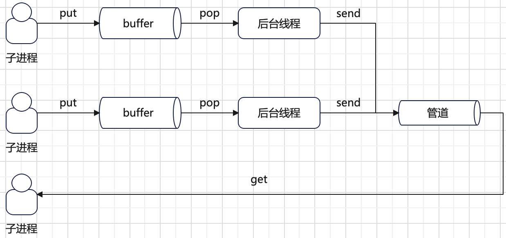

# 可重入锁
一个线程获取可重入锁后，相同的线程可以再次获取，而不会出现死锁。线程获取可重入锁的次数必须和释放可重入锁的次数相同。
可重入锁的获取和释放必须是相同的线程。

可重入锁的实现原理是基于不可重入锁（互斥锁），并在此基础上增加`owner`和`count`属性。
+ **`owner`属性**：记录成功获取锁的线程`ID`。
+ **`count`属性**：记录`owner`线程获取锁的次数。

可重入锁的定义如下：
```python
class _RLock:
    """This class implements reentrant lock objects.

    A reentrant lock must be released by the thread that acquired it. Once a
    thread has acquired a reentrant lock, the same thread may acquire it
    again without blocking; the thread must release it once for each time it
    has acquired it.

    """

    def __init__(self):
        self._block = _allocate_lock()  # 不可重入锁
        self._owner = None
        self._count = 0
```
获取可重入锁的实现如下：
```python
def acquire(self, blocking=True, timeout=-1):
    me = get_ident()
    if self._owner == me:
        self._count += 1
        return 1
    rc = self._block.acquire(blocking, timeout)
    if rc:
        self._owner = me
        self._count = 1
    return rc
```
如果已获取可重入锁的线程再次调用`acquire`，则简单将计数器值加一并立刻返回，否则获取底层锁并更新`owner`和`count`属性。
如果是其他的线程调用`acquire`，则会等待底层锁被释放才可以获取。

释放可重入锁的实现如下：
```python
def release(self):
    # 如果调用的线程没有获取锁，抛出异常
    if self._owner != get_ident():
        raise RuntimeError("cannot release un-acquired lock")
    self._count = count = self._count - 1
    if not count:
        self._owner = None
        self._block.release()
```
必须是已获取可重入锁的线程才可以调用`release`方法。释放的逻辑是将计数器`count`减一，如果计数器非`0`表示锁依然被调用线程拥有。
如果计数器为`0`会释放底层锁，并重置可重入锁，此时可重入锁不被任何线程拥有。

# 条件变量
条件变量允许一个或者多个线程挂起等待，直到收到其他线程通知。线程在挂起等待时会释放条件变量使用的底层锁，挂起等待线程在收到其他线程通知时，
会重新获取条件变量底层锁。**条件变量可以有效替代轮询使用场景**。

条件变量的定义如下：
```python
class Condition:
    def __init__(self, lock=None):
        if lock is None:
            lock = RLock()
        self._lock = lock
        self.acquire = lock.acquire
        self.release = lock.release
        # 如果底层使用的是可重入锁，可重入锁会自己实现_is_owned, _release_save 和 _acquire_restore 方法
        try:
            self._release_save = lock._release_save
        except AttributeError:
            pass
        try:
            self._acquire_restore = lock._acquire_restore
        except AttributeError:
            pass
        try:
            self._is_owned = lock._is_owned
        except AttributeError:
            pass
        # 一个双端队列，存放每个线程调用wait使用的临时锁对象。沟通wait和notify方法。
        self._waiters = _deque()
```
条件变量进入等待的实现如下：
```python
def wait(self, timeout=None):
    if not self._is_owned():
        raise RuntimeError("cannot wait on un-acquired lock")
    # 不可重入锁
    waiter = _allocate_lock()
    waiter.acquire()
    self._waiters.append(waiter)
    # 释放条件变量锁
    saved_state = self._release_save()
    gotit = False
    try:    # restore state no matter what (e.g., KeyboardInterrupt)
        if timeout is None:
            waiter.acquire()
            gotit = True
        else:
            if timeout > 0:
                gotit = waiter.acquire(True, timeout)
            else:
                gotit = waiter.acquire(False)
        return gotit
    finally:
        # 被唤醒后，重新获取条件变量锁
        self._acquire_restore(saved_state)
        if not gotit:
            try:
                self._waiters.remove(waiter)
            except ValueError:
                pass
```
一个线程必须先获取条件变量的锁，才可以调用`wait`方法。线程调用`wait`方法后会释放条件变量的锁，这样其他的线程可以获取此条件变量。
调用`wait`的线程进入挂起和被其他线程唤醒的机制是通过一个临时创建的不可重入锁对象实现。
+ 调用`wait`的线程创建一个临时不可重入锁对象`waiter`，并两次调用`acquire`方法使得线程自身被挂起。
+ 其他线程调用`notify`方法释放`waiter`锁对象以实现唤醒其他被挂起的线程。

由于条件变量调用`wait`后会释放条件变量的锁，被唤醒后会重新获取锁。如果条件变量使用可重入锁，锁释放和获取会有些不同。
```python
# 不可重入锁
def _release_save(self):
    self._lock.release()           # No state to save

def _acquire_restore(self, x):
    self._lock.acquire()           # Ignore saved state

def _is_owned(self):
    if self._lock.acquire(0):
        self._lock.release()
        return False
    else:
        return True
# 可重入锁
def _acquire_restore(self, state):
    self._block.acquire()
    self._count, self._owner = state

def _release_save(self):
    if self._count == 0:
        raise RuntimeError("cannot release un-acquired lock")
    count = self._count
    self._count = 0
    owner = self._owner
    self._owner = None
    self._block.release()
    return (count, owner)

def _is_owned(self):
    return self._owner == get_ident()
```
对于可重入锁，主要是要保存和恢复锁的`owner`和`count`属性。

条件变量通知实现如下：
```python
def notify(self, n=1):
    if not self._is_owned():
        raise RuntimeError("cannot notify on un-acquired lock")
    all_waiters = self._waiters
    waiters_to_notify = _deque(_islice(all_waiters, n))
    if not waiters_to_notify:
        return
    for waiter in waiters_to_notify:
        waiter.release()
        try:
            all_waiters.remove(waiter)
        except ValueError:
            pass

def notify_all(self):
    self.notify(len(self._waiters))
```
一个线程必须先获取条件变量的锁，才可以调用`notify`方法。`notify`方法会调用指定数目的`waiter`锁对象的`release`方法以通知其他调用`waiter`的`acquire`进入挂起的线程。

# 信号量
信号量用于多线程间一种同步机制，其内部维护一个计数值。当计数值大于`0`时，每次调用`acquire`方法会使得计数值减一并立刻返回成功。
当计数值等于`0`时，每次调用`acquire`方法会使得调用线程挂起等待直到其他线程调用`release`方法释放一个信号量。总结如下：
+ 调用`acquire`：计数值减一，如果计数值为`0`，则调用线程挂起等待。
+ 调用`release`：计数值加一，通知**一个**因为调用`acquire`而等待的线程。

信号量的底层实现通过一个条件变量`_cond`和一个计数值`_value`。
+ **条件变量`_cond`**：用于多线程安全和同步。
+ **计数值`_value`**：用于记录当前剩余可用资源数。

信号量的定义如下：
```python
class Semaphore:
    """This class implements semaphore objects.

    Semaphores manage a counter representing the number of release() calls minus
    the number of acquire() calls, plus an initial value. The acquire() method
    blocks if necessary until it can return without making the counter
    negative. If not given, value defaults to 1.

    """
    def __init__(self, value=1):
        if value < 0:
            raise ValueError("semaphore initial value must be >= 0")
        self._cond = Condition(Lock()) # 条件变量，底层使用不可重入锁
        self._value = value            # 计数值
```
获取信号量的实现如下：
```python
def acquire(self, blocking=True, timeout=None):
    if not blocking and timeout is not None:
        raise ValueError("can't specify timeout for non-blocking acquire")
    rc = False
    endtime = None
    with self._cond:
        while self._value == 0:
            if not blocking:
                break
            if timeout is not None:
                if endtime is None:
                    endtime = _time() + timeout
                else:
                    timeout = endtime - _time()
                    if timeout <= 0:
                        break
            self._cond.wait(timeout)  # 没有资源，线程挂起等待
        else:
            self._value -= 1
            rc = True
    return rc
```
> `while ... else ...`含义：当`while`的条件表达式为真时，`else`逻辑不会执行。当`while`的条件表达式为假（包括`break`跳出循环），
`else`逻辑才会执行。

如果信号量计数值大于`0`，调用`acquire`方法会立刻返回成功并将计数值减一。如果信号量计数值等于`0`，表示没有可用资源，
调用`acquire`的线程会挂起等待（传递`blocking`参数）直到超时时间失败或者被其他线程调用`release`释放一个计数值唤醒。

释放信号量的相关实现如下：
```python
def release(self):
    with self._cond:
        self._value += 1
        self._cond.notify()
```
信号量的释放只是简单将计数值加一，并唤醒一个等待的线程。这里没有限制计数值上限，如果需要限制可以使用`BoundedSemaphore`对象。

# 管道
管道用于多进程/多线程间的一种通信方式。在`Python`中实现了两种用途的管道，分别是全双工通信管道和半双工通信管道。
+ **全双工通信**：管道的每一端既可以读也可以写。
+ **半双工通信**：管道的每一端要么是读，要么是写。

管道的实现如下：
```python
def Pipe(duplex=True):
    '''
    Returns pair of connection objects at either end of a pipe
    '''
    if duplex:
        # 全双工
        s1, s2 = socket.socketpair()
        s1.setblocking(True)
        s2.setblocking(True)
        c1 = Connection(s1.detach())
        c2 = Connection(s2.detach())
    else:
        # 半双工
        fd1, fd2 = os.pipe()
        c1 = Connection(fd1, writable=False)
        c2 = Connection(fd2, readable=False)

    return c1, c2
```
这里只关注半双工通信的实现，也就是利用`os.pipe()`实现的管道通信。其中返回的读端`c1`和写端`c2`都是`Connection`类型对象。
将管道用于消息队列**需要解决如何区分管道中的多个消息**，也就是发送的消息，可以正确的读出来。解决方式就是：发送的每一个消息都会增加一个消息头，
记录当前消息字节数。`Connection`类发送和接收消息的实现如下：
```python
# 发送消息
def _send_bytes(self, buf):
    n = len(buf)
    if n > 0x7fffffff:
        # 消息太大，使用8个字节的无符号整数表示消息大小，也就是 !Q
        pre_header = struct.pack("!i", -1)
        header = struct.pack("!Q", n)
        self._send(pre_header)
        self._send(header)
        self._send(buf)
    else:
        # For wire compatibility with 3.7 and lower
        header = struct.pack("!i", n)
        if n > 16384:
            # The payload is large so Nagle's algorithm won't be triggered
            # and we'd better avoid the cost of concatenation.
            self._send(header)
            self._send(buf)
        else:
            # Issue #20540: concatenate before sending, to avoid delays due
            # to Nagle's algorithm on a TCP socket.
            # Also note we want to avoid sending a 0-length buffer separately,
            # to avoid "broken pipe" errors if the other end closed the pipe.
            self._send(header + buf)
# 接收消息
def _recv_bytes(self, maxsize=None):
    buf = self._recv(4)
    size, = struct.unpack("!i", buf.getvalue())
    if size == -1:
        buf = self._recv(8)
        size, = struct.unpack("!Q", buf.getvalue())
    if maxsize is not None and size > maxsize:
        return None
    return self._recv(size)
```

# 多进程共享安全队列
`multiprocessing.queues`类提供类`Queue`用于多进程间共享安全队列。核心是使用管道实现跨进程间通信。具体的实现方式总结如下：
+ **管道**：用于跨进程共享数据。管道存储数据受操作系统限制，如果管道满了，则对管道写操作会阻塞。
+ **有界信号量**：用于表示队列数据个数最大值。防止队列数据太多。
+ **普通队列**：每一个子进程私有的队列`collections.deque()`。用作每一个子进程的缓存，这样子进程写数据时可以快速完成，
不需要等到数据完全写到管道中。
+ **条件变量**：用于后台线程和子进程写数据间同步。每次子进程写数据时，都会通过条件变量通知后台线程消费子进程缓存队列数据，
将数据写到管道中。
+ **后台线程**：用于将每一个子进程缓存队列数据发送到管道中。每一个子进程都会有一个后台线程。
+ **锁**：保证多进程间数据安全。

下面总结了`multiprocessing.queues.Queue`工作原理：



在多进程编程下，需要关注下序列化与反序列化。序列化的目地是将数据转为子节流，便于通过管道等机制在不同进程间传递数据。
> 序列化的时候方法`__getstate__`被调用(可以记录哪些信息需要序列化，把不能序列化的属性排除掉)，反序列化的时候`__setstate__`被调用(参数是`__getstate__`方法的返回值)。
> 
> ```python
> import multiprocessing as mp
> import threading
> import time
> import os
> 
> 
> class MyQueue():
>     def __init__(self):
>         self.queue = []
>         self.lock = threading.Lock() # 不可序列化
>         self.test = 2
> 
>     def put(self, obj):
>         self.queue.append(obj)
> 
>     def get(self):
>         return self.queue.pop(0)
> 
>     def __getstate__(self):
>         return self.queue, self.test
> 
>     def __setstate__(self, state):
>         self.queue, self.test = state
> 
> 
> def child_fun(arg):
>     print("Child process get attribute {0} with pid {1}".format(arg.__dict__, os.getpid()))
>     arg.put("Value from child process")
>     print("Child put value success with queue len ", len(arg.queue))
> 
> def main():
>     my_queue = MyQueue()
>     p = mp.Process(target=child_fun, args=(my_queue,))
>     p.start()
>     my_queue.put("Value2 from parent process.")
>     time.sleep(1)
>     print("Parent process get value: {0}".format(my_queue.get()))
> 
> if __name__ == "__main__":
>     main()
>     
> -------------------------------------------------------------------------------
> # 参数通过序列化传给子进程，由于重写了序列化的两个方法，所以拿到的参数对象属性只有两个，没有lock对象.
> Child process get attribute {'queue': [], 'test': 2} with pid 42099
> Child put value success with queue len  1
> # 因为 MyQueue 不能跨进程访问，所以在父进程空间里看不到子进程放的数据
> Parent process get value: Value2 from parent process.
> ```
> 
> 默认对象不实现`__setstate__`和`__getstate__`方法的时候，序列化的时候，自动保存和加载对象的`__dict__`属性字典。在上面的例子中，也就是
> 
> ```python
> my_queue = MyQueue()
> print(my_queue.__dict__)
> ----------------------------------------------------------------------------------
> {'queue': [], 'lock': <unlocked _thread.lock object at 0x7fc871bca150>, 'test': 2}
> ```
> 
> 由于有lock属性存在，默认情况 MyQueue 是不可序列化的；如果需要对象 MyQueue 可序列化，需要重写`__setstate__`和`__getstate__`方法，排出掉不可序列化的 lock 属性。

