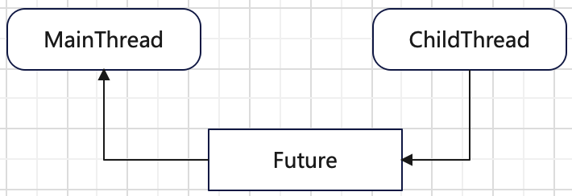
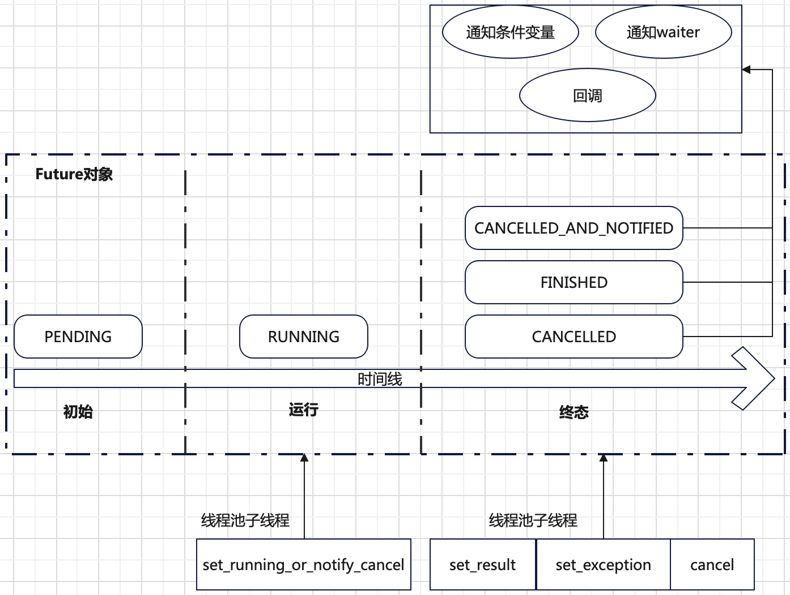

# Future

异步编程执行结果通知有多种实现方案，例如:
+ 基于回调参数(Callback argument)
+ **返回一个占位符(Return a placeholder (**Future**))**
+ 基于队列(Deliver to a queue)
+ 基于回调注册(Callback registry (e.g. POSIX signals))

`Future` 表示一个未来的结果，在任务刚提交开始执行的时候(主线程的工作)，这个结果是空的，等任务异步(例如通过子线程)执行完后，子线程会将任务执行结果填充这个 `Future`，这样主线程可以通过 `Future` 获取结果。可以将 `Future` 看成是主线程和子线程通信的媒介。



**`Future`对象就像现实世界中的快递包裹**，在客户（主线程）和快递员（子线程）之间传递结果。包裹里面的商品就类比结果。

从内部来看，`Future`对象的实现具有如下属性：
+ **一个状态机**：初始状态是`PENDING`、中间状态是`RUNNING`、终态是`CANCELLED`或者`CANCELLED_AND_NOTIFIED`或者`FINISHED`。
+ **存储任务运行结果和异常**：执行任务的子线程根据任务的执行结果会设置此属性内容。
+ **回调函数**：在`Future`进入终态时，会执行所有此`Future`已注册的回调函数。
+ **等待者队列**：在`Future`进入终态时，会唤醒所有的此`Future`的等待者。等待者是指调用`wait`或`as_completed`方法的线程。
+ **一个条件变量**：用于多线程安全地查询或者更新相关属性（结果或状态等）。允许线程挂起并释放锁，等待其他线程唤醒，比轮询更加高效。
  ```python
  class Future(object):
    """Represents the result of an asynchronous computation."""

    def __init__(self):
        """Initializes the future. Should not be called by clients."""
        self._condition = threading.Condition()
        self._state = PENDING
        self._result = None
        self._exception = None
        self._waiters = []
        self._done_callbacks = []
  ```

从外部来看，`Future`对象实现了如下对外接口：
+ **获取`Future`运行状态**：`cancelled`方法返回此`Future`是否被取消。`running`方法返回此`Future`当前是否在运行中。
`done`方法返回此`Future`是否已经完成。
  ```python
  def cancelled(self):
      """Return True if the future was cancelled."""
      with self._condition:
          return self._state in [CANCELLED, CANCELLED_AND_NOTIFIED]

  def running(self):
      """Return True if the future is currently executing."""
      with self._condition:
          return self._state == RUNNING

  def done(self):
      """Return True if the future was cancelled or finished executing."""
      with self._condition:
          return self._state in [CANCELLED, CANCELLED_AND_NOTIFIED, FINISHED]
  ```
+ **获取`Future`的结果或异常**：`result`方法返回此`Future`对象结果属性（被执行任务的子线程设置），当`Future`还未完成时，`result`方法会阻塞。
同理`exception`方法返回此`Future`对象的异常信息属性（被执行任务的子线程设置）。当`Future`还未完成时，`exception`方法会阻塞。
  ```python
  def result(self, timeout=None):
      try:
          with self._condition:
              if self._state in [CANCELLED, CANCELLED_AND_NOTIFIED]:
                  raise CancelledError()
              elif self._state == FINISHED:
                  return self.__get_result()

              self._condition.wait(timeout)

              if self._state in [CANCELLED, CANCELLED_AND_NOTIFIED]:
                  raise CancelledError()
              elif self._state == FINISHED:
                  return self.__get_result()
              else:
                  raise TimeoutError()
      finally:
          # Break a reference cycle with the exception in self._exception
          self = None
  ```
+ **更新结果或异常**：`set_result`方法和`set_exception`方法分别设置`Future`对象的结果和异常信息两个属性（被执行任务的子线程调用）。
同时会更新`Future`状态为`FINISHED`，并唤醒所有等待此`Future`条件变量的其他线程。最后会唤醒所有的等待者（调用`wait`或者`as_completed`线程）及调用注册的所有回调函数。
  ```python
  def set_result(self, result):
      """Sets the return value of work associated with the future.

      Should only be used by Executor implementations and unit tests.
      """
      with self._condition:
          if self._state in {CANCELLED, CANCELLED_AND_NOTIFIED, FINISHED}:
              raise InvalidStateError('{}: {!r}'.format(self._state, self))
          self._result = result
          self._state = FINISHED
          for waiter in self._waiters:
              waiter.add_result(self)
          self._condition.notify_all()
      self._invoke_callbacks()
  ```
+ **取消**：`cancel`方法会取消此`Future`对象，也就是直接将`Future`设置为终态`CANCELLED`。**只有`PENDING`状态的`Future`才可以被取消**，这样子线程运行任务之前会检查`Future`状态如果取消，则不会执行。
并唤醒所有等待此`Future`条件变量的其他线程，及调用注册的所有回调函数。
  ```python
  def cancel(self):
      """Cancel the future if possible.

      Returns True if the future was cancelled, False otherwise. A future
      cannot be cancelled if it is running or has already completed.
      """
      with self._condition:
          if self._state in [RUNNING, FINISHED]:
              return False

          if self._state in [CANCELLED, CANCELLED_AND_NOTIFIED]:
              return True

          self._state = CANCELLED
          self._condition.notify_all()

      self._invoke_callbacks()
      return True
  ```
+ **注册回调**：`add_done_callback`方法用于注册回调函数，当`Future`进入终态时候，回调函数会被调用。
  ```python
  def add_done_callback(self, fn):
      """Attaches a callable that will be called when the future finishes.

      Args:
          fn: A callable that will be called with this future as its only
              argument when the future completes or is cancelled. The callable
              will always be called by a thread in the same process in which
              it was added. If the future has already completed or been
              cancelled then the callable will be called immediately. These
              callables are called in the order that they were added.
      """
      with self._condition:
          if self._state not in [CANCELLED, CANCELLED_AND_NOTIFIED, FINISHED]:
              self._done_callbacks.append(fn)
              return
      try:
          fn(self)
      except Exception:
          LOGGER.exception('exception calling callback for %r', self)
  ```
+ **设置`Future`开始运行或者通知等待者被取消**：`set_running_or_notify_cancel`方法会将`Future`状态设置为`RUNNING`，如果`Future`已经被取消，
则通知此`Future`上的所有等待者（调用`wait`或者`as_completed`的线程）。**`set_running_or_notify_cancel`方法只能在线程池中的子线程开始执行任务前调用**。
  ```python
  def set_running_or_notify_cancel(self):
      """Mark the future as running or process any cancel notifications.

      Should only be used by Executor implementations and unit tests.

      If the future has been cancelled (cancel() was called and returned
      True) then any threads waiting on the future completing (though calls
      to as_completed() or wait()) are notified and False is returned.

      If the future was not cancelled then it is put in the running state
      (future calls to running() will return True) and True is returned.

      This method should be called by Executor implementations before
      executing the work associated with this future. If this method returns
      False then the work should not be executed.
      """
      with self._condition:
          if self._state == CANCELLED:
              self._state = CANCELLED_AND_NOTIFIED
              for waiter in self._waiters:
                  waiter.add_cancelled(self)
              # self._condition.notify_all() is not necessary because
              # self.cancel() triggers a notification.
              return False
          elif self._state == PENDING:
              self._state = RUNNING
              return True
          else:
              LOGGER.critical('Future %s in unexpected state: %s',
                              id(self),
                              self._state)
              raise RuntimeError('Future in unexpected state')
  ```

下面一张图总结了`Future`对象的工作原理：


