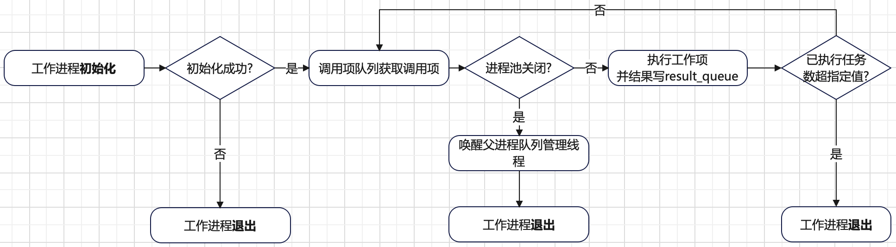

# 进程池
进程池相比较线程池的难点是跨进程间通信问题。具体来说重点需要解决如下问题：
+ 子进程如何获取提交的工作项，因为提交任务的进程和子进程不是同一个。
+ 子进程执行的结果如何更新到提交任务（`submit`）返回的`Future`中，因为二者不是同一个进程。

为了同时解决上述两个问题，需要**跨进程共享队列**及**后台管理线程入队工作项和读取子进程执行结果并更新对应`Future`**。
下面一张图总结了进程池的设计思想：


和线程池类似，进程池的工作机制也需要以下几个要素：
+ **进程池执行器**：负责管理所有的子进程、提供任务提交入口。
+ **工作项**：提交的具体任务的抽象。
+ **工作进程入口函数**：处理提交的任务。
+ **`Future`对象**：用于存储任务执行结果，及不同进程间结果同步。

**工作项`_WorkItem`** 是任务的静态抽象。工作项有如下功能：
+ 定义任务应该如何运行（`fn`方法）。
+ 任务运行结果应该存储在哪里（`Future`对象）。

工作项的相关实现如下：
```python
class _WorkItem(object):
    def __init__(self, future, fn, args, kwargs):
        self.future = future
        self.fn = fn
        self.args = args
        self.kwargs = kwargs
```
**工作进程入口函数`_process_worker`** 会不断从可调用项队列`call_queue`获取可调用项`call_item`，并执行`call_item.fn`方法。
子进程的执行结果会放到跨进程的结果队列`result_queue`中，供父进程的队列管理线程获取结果并更新对应的`Future`对象。
其工作流程总结如下：



工作进程入口函数的相关实现如下：
```python
def _process_worker(call_queue, result_queue, initializer, initargs, max_tasks=None):
    """Evaluates calls from call_queue and places the results in result_queue.

    """
    if initializer is not None:
        try:
            initializer(*initargs)
        except BaseException:
            _base.LOGGER.critical('Exception in initializer:', exc_info=True)
            # The parent will notice that the process stopped and
            # mark the pool broken
            return
    num_tasks = 0
    exit_pid = None
    while True:
        call_item = call_queue.get(block=True)
        if call_item is None:
            # 为 None 说明进程池正在关闭
            # Wake up queue management thread
            result_queue.put(os.getpid())
            return
        # 更新当前子进程已经执行的任务数，如果超过来最大可运行任务数，当前子进程退出
        if max_tasks is not None:
            num_tasks += 1
            if num_tasks >= max_tasks:
                exit_pid = os.getpid()

        try:
            r = call_item.fn(*call_item.args, **call_item.kwargs)
        except BaseException as e:
            exc = _ExceptionWithTraceback(e, e.__traceback__)
            _sendback_result(result_queue, call_item.work_id, exception=exc,
                             exit_pid=exit_pid)
        else:
            # 将执行结果写到 result_queue 中，供父进程队列管理线程获取以更新`Future`
            _sendback_result(result_queue, call_item.work_id, result=r,
                             exit_pid=exit_pid)
            del r

        # Liberate the resource as soon as possible, to avoid holding onto
        # open files or shared memory that is not needed anymore
        del call_item
        # 当前子进程已执行任务数超过可执行的最大指，子进程退出，避免一个子进程长时间跑有内存泄漏
        if exit_pid is not None:
            return
```
首先解释下参数`max_tasks`。`max_tasks`表示当前子进程可以执行的任务数最大值，如果当前子进程已运行任务数超过此参数指定的值，
则当前子进程会退出以**避免一个进程长时间运行带来内存泄漏问题**。

执行结果通过调用`_sendback_result`方法放到一个跨进程的`result_queue`队列。父进程的队列管理线程会接收到此结果，并更新`Future`对象。
`_sendback_result`方法的相关实现如下：
```python
def _sendback_result(result_queue, work_id, result=None, exception=None,
                     exit_pid=None):
    """Safely send back the given result or exception"""
    try:
        result_queue.put(_ResultItem(work_id, result=result,
                                     exception=exception, exit_pid=exit_pid))
    except BaseException as e:
        exc = _ExceptionWithTraceback(e, e.__traceback__)
        result_queue.put(_ResultItem(work_id, exception=exc,
                                     exit_pid=exit_pid))
```
其中会将执行结果包装为一个`_ResultItem`对象，`_ResultItem`对象的定义如下：
```python
class _ResultItem(object):
    def __init__(self, work_id, exception=None, result=None, exit_pid=None):
        self.work_id = work_id
        self.exception = exception
        self.result = result
        self.exit_pid = exit_pid
```
+ `work_id`：当前执行工作项的`ID`，在父进程的队列管理线程中用于关联具体的工作项`_WorkItem`对象。
+ `exception/result`：存放当前任务执行的异常或者结果。
+ `exit_pid`：当前退出的子进程`PID`，如果没有取值为`None`。

**进程池控制器**的工作流程可以总结如下：
