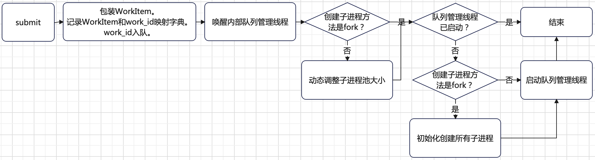

# 进程池
进程池相比较线程池的难点是跨进程间通信问题。具体来说重点需要解决如下问题：
+ 子进程如何获取提交的工作项，因为提交任务的进程和子进程不是同一个。
+ 子进程执行的结果如何更新到提交任务（`submit`）返回的`Future`中，因为二者不是同一个进程。

为了同时解决上述两个问题，需要**跨进程共享队列**及**后台管理线程入队工作项和读取子进程执行结果并更新对应`Future`**。
下面一张图总结了进程池的设计思想：


和线程池类似，进程池的工作机制也需要以下几个要素：
+ **进程池执行器**：负责管理所有的子进程、提供任务提交入口。
+ **工作项**：提交的具体任务的抽象。
+ **工作进程入口函数**：处理提交的任务。
+ **`Future`对象**：用于存储任务执行结果，及不同进程间结果同步。

**工作项`_WorkItem`** 是任务的静态抽象。工作项有如下功能：
+ 定义任务应该如何运行（`fn`方法）。
+ 任务运行结果应该存储在哪里（`Future`对象）。

工作项的相关实现如下：
```python
class _WorkItem(object):
    def __init__(self, future, fn, args, kwargs):
        self.future = future
        self.fn = fn
        self.args = args
        self.kwargs = kwargs
```
**工作进程入口函数`_process_worker`** 会不断从可调用项队列`call_queue`获取可调用项`call_item`，并执行`call_item.fn`方法。
子进程的执行结果会放到跨进程的结果队列`result_queue`中，供父进程的队列管理线程获取结果并更新对应的`Future`对象。
其工作流程总结如下：


工作进程入口函数的相关实现如下：
```python
def _process_worker(call_queue, result_queue, initializer, initargs, max_tasks=None):
    """Evaluates calls from call_queue and places the results in result_queue.

    """
    if initializer is not None:
        try:
            initializer(*initargs)
        except BaseException:
            _base.LOGGER.critical('Exception in initializer:', exc_info=True)
            # The parent will notice that the process stopped and
            # mark the pool broken
            return
    num_tasks = 0
    exit_pid = None
    while True:
        call_item = call_queue.get(block=True)
        if call_item is None:
            # 为 None 说明进程池正在关闭
            # Wake up queue management thread
            result_queue.put(os.getpid())
            return
        # 更新当前子进程已经执行的任务数，如果超过来最大可运行任务数，当前子进程退出
        if max_tasks is not None:
            num_tasks += 1
            if num_tasks >= max_tasks:
                exit_pid = os.getpid()

        try:
            r = call_item.fn(*call_item.args, **call_item.kwargs)
        except BaseException as e:
            exc = _ExceptionWithTraceback(e, e.__traceback__)
            _sendback_result(result_queue, call_item.work_id, exception=exc,
                             exit_pid=exit_pid)
        else:
            # 将执行结果写到 result_queue 中，供父进程队列管理线程获取以更新`Future`
            _sendback_result(result_queue, call_item.work_id, result=r,
                             exit_pid=exit_pid)
            del r

        # Liberate the resource as soon as possible, to avoid holding onto
        # open files or shared memory that is not needed anymore
        del call_item
        # 当前子进程已执行任务数超过可执行的最大指，子进程退出，避免一个子进程长时间跑有内存泄漏
        if exit_pid is not None:
            return
```
首先解释下参数`max_tasks`。`max_tasks`表示当前子进程可以执行的任务数最大值，如果当前子进程已运行任务数超过此参数指定的值，
则当前子进程会退出以**避免一个进程长时间运行带来内存泄漏问题**。

执行结果通过调用`_sendback_result`方法放到一个跨进程的`result_queue`队列。父进程的队列管理线程会接收到此结果，并更新`Future`对象。
`_sendback_result`方法的相关实现如下：
```python
def _sendback_result(result_queue, work_id, result=None, exception=None,
                     exit_pid=None):
    """Safely send back the given result or exception"""
    try:
        result_queue.put(_ResultItem(work_id, result=result,
                                     exception=exception, exit_pid=exit_pid))
    except BaseException as e:
        exc = _ExceptionWithTraceback(e, e.__traceback__)
        result_queue.put(_ResultItem(work_id, exception=exc,
                                     exit_pid=exit_pid))
```
其中会将执行结果包装为一个`_ResultItem`对象，`_ResultItem`对象的定义如下：
```python
class _ResultItem(object):
    def __init__(self, work_id, exception=None, result=None, exit_pid=None):
        self.work_id = work_id
        self.exception = exception
        self.result = result
        self.exit_pid = exit_pid
```
+ `work_id`：当前执行工作项的`ID`，在父进程的队列管理线程中用于关联具体的工作项`_WorkItem`对象。
+ `exception/result`：存放当前任务执行的异常或者结果。
+ `exit_pid`：当前退出的子进程`PID`，如果没有取值为`None`。

**进程池控制器**的工作流程可以总结如下：通过`submit`接口接收提交的任务，并将任务包装为进程池内部的工作项`_WorkItem`。
将工作项`_WorkItem`和对应的`work_id`映射关系存放一个字典中，而把数据量最小的`work_id`放到一个内部工作项`ID`队列中。
启动内部的队列管理后台线程（已经启动就跳过），并唤醒队列管理线程开始处理提交的工作项。需要注意是，只有创建子进程的方法不是`fork`时，
才会动态调整内部子进程池中进程数，否则在第一次创建队列管理线程时就初始化好所有的子进程。一张图展示如下：



> 因为先创建队列管理线程，在使用`fork`创建子进程可能会存在死锁问题，所以针对`fork`创建子进程方式，
先创建好整个子进程池，不会动态调整进程池大小。

为此，进程池控制器应该具有如下属性：
+ 进程池管理相关：
  + `_max_workers`：定义进程池最大子进程数。
  + `_mp_context`：进程上下文管理对象（`multoprocessing.get_context`方法返回），可以获取创建进程的方法（`fork`、`spawn`等），创建子进程，多进程共享队列等。
  + `_safe_to_dynamically_spawn_children`：一个`bool`值，是否可以动态创建子进程。只有不是`fork`方法创建子进程才可以动态创建子进程。
  + `_max_tasks_per_child`：一个子进程可以执行的任务数最大值，只针对不是`fork`创建子进程的系统有效。如果一个子进程已运行任务数超过此参数指定的值， 
  则当前子进程会退出以避免一个进程长时间运行带来内存泄漏问题。
  + `_processes`：一个字典对象，其中`key`是子进程的`PID`值，`value`是子进程对象。
  + `_idle_worker_semaphore`：一个信号量对象，用于记录进程池中空闲的子进程数。
  + `_pending_work_items`：一个字典对象，其中`key`是包装的`_WorkItem`对应的内部`work_id`，`value`是对应的`_WorkItem`。
  后续只需将`work_id`入队就行，不需要整个`_WorkItem`入队。
  + `_queue_count`：生成`work_id`。
+ 队列管理线程：
  + `_executor_manager_thread`：队列管理线程对象。
  + `_executor_manager_thread_wakeup`：内部是一个管道，用于唤醒队列管理线程。
+ 任务队列相关：
  + `_work_ids`：一个简单的`FIFO`队列，不能跨进程。`submit`是生产端，队列管理线程是消费端。
  + `_call_queue`：跨进程共享队列，里面存放`call_item`。队列管理线程是生产端，子进程是消费端。
  + `_result_queue`：跨进程共享队列，里面存放子进程执行的结果`_ResultItem`。子进程是生产端，队列管理线程是消费端。
  + `queue_size`：队列大小，控制`_call_queue`队列上限。默认值是`_max_workers + 1`。
+ 进程池关闭：
  + `_shutdown_thread`：一个`bool`值，表示线程池是否正在关闭，调用`shutdown`方法时被设置。
  + `_shutdown_lock`：一个不可重入锁对象，用于多线程间安全。
+ 其它属性：
  + `_broken`：记录进程池是否异常。默认值是`False`，进程池有异常（队列管理线程有异常）会设置异常信息字符串。
  + `_initializer`：用于子进程初始化函数。
  + `_initargs`：子进程初始化函数的参数。
  + `_cancel_pending_futures`：`bool`值，调用`shutdown`方法指定。表示是否取消还未消费的任务对应的`Futures`。

进程池控制器的定义如下：
```python
class ProcessPoolExecutor(_base.Executor):
    def __init__(self, max_workers=None, mp_context=None,
                 initializer=None, initargs=(), *, max_tasks_per_child=None):
        _check_system_limits()

        if max_workers is None:
            self._max_workers = os.process_cpu_count() or 1
            if sys.platform == 'win32':
                self._max_workers = min(_MAX_WINDOWS_WORKERS, self._max_workers)
        else:
            if max_workers <= 0:
                raise ValueError("max_workers must be greater than 0")
            elif (sys.platform == 'win32' and
                max_workers > _MAX_WINDOWS_WORKERS):
                raise ValueError(f"max_workers must be <= {_MAX_WINDOWS_WORKERS}")

            self._max_workers = max_workers

        if mp_context is None:
            if max_tasks_per_child is not None:
                mp_context = mp.get_context("spawn")
            else:
                mp_context = mp.get_context()
        self._mp_context = mp_context

        self._safe_to_dynamically_spawn_children = (
                self._mp_context.get_start_method(allow_none=False) != "fork")

        if initializer is not None and not callable(initializer):
            raise TypeError("initializer must be a callable")
        self._initializer = initializer
        self._initargs = initargs

        if max_tasks_per_child is not None:
            if not isinstance(max_tasks_per_child, int):
                raise TypeError("max_tasks_per_child must be an integer")
            elif max_tasks_per_child <= 0:
                raise ValueError("max_tasks_per_child must be >= 1")
            if self._mp_context.get_start_method(allow_none=False) == "fork":
                # https://github.com/python/cpython/issues/90622
                raise ValueError("max_tasks_per_child is incompatible with"
                                 " the 'fork' multiprocessing start method;"
                                 " supply a different mp_context.")
        self._max_tasks_per_child = max_tasks_per_child

        self._executor_manager_thread = None

        self._processes = {}

        self._shutdown_thread = False
        self._shutdown_lock = threading.Lock()
        self._idle_worker_semaphore = threading.Semaphore(0)
        self._broken = False
        self._queue_count = 0
        self._pending_work_items = {}
        self._cancel_pending_futures = False
        # 使用管道唤醒队列管理线程。在`submit`和`shutdown`方法中调用。不和子进程公用result_queue._reader 管道
        # 避免子进程挂了，但没是否管道锁，导致死锁，也就没办法唤醒队列管理线程了。
        self._executor_manager_thread_wakeup = _ThreadWakeup()
        # 调用队列大小，比子进程最大数目多1，目的是避免有的子进程空闲。但不能太大，因为在调用队列中的任务不能取消，只能等跑完。
        queue_size = self._max_workers + EXTRA_QUEUED_CALLS
        self._call_queue = _SafeQueue(
            max_size=queue_size, ctx=self._mp_context,
            pending_work_items=self._pending_work_items,
            shutdown_lock=self._shutdown_lock,
            thread_wakeup=self._executor_manager_thread_wakeup)
        # 杀掉工作进程可能会有`broken pipe`错误，这种忽略
        self._call_queue._ignore_epipe = True
        self._result_queue = mp_context.SimpleQueue()
        self._work_ids = queue.Queue()
```
进程池的任务提交入口`submit`实现如下：
```python
def submit(self, fn, /, *args, **kwargs):
    with self._shutdown_lock:
        if self._broken:
            raise BrokenProcessPool(self._broken)
        if self._shutdown_thread:
            raise RuntimeError('cannot schedule new futures after shutdown')
        if _global_shutdown:
            raise RuntimeError('cannot schedule new futures after '
                               'interpreter shutdown')

        f = _base.Future()
        w = _WorkItem(f, fn, args, kwargs)

        self._pending_work_items[self._queue_count] = w
        self._work_ids.put(self._queue_count)
        self._queue_count += 1
        # Wake up queue management thread
        self._executor_manager_thread_wakeup.wakeup()

        if self._safe_to_dynamically_spawn_children:
            self._adjust_process_count()
        self._start_executor_manager_thread()
        return f
```
`submit`方法内首先会尝试获取进程池`shutdown`相关的锁，避免进程池在`shutdown`期间接收新的任务。只有进程池没有异常，
且没有`shutdown`时，进程池才会接收新的任务。`submit`完成提交任务的包装（`_WorkItem`），映射（`_WorkItem`和`work_id`）及入队（`work_ids`）后，
会唤醒和启动（已经启动跳过）队列管理线程，以通知开始处理新的工作项。在返回`Future`之前，若系统创建子进程的方法**不是`fork`**，
则会调整进程池中子进程数。

其中唤醒队列管理线程的实现如下：
```python
class _ThreadWakeup:
    def __init__(self):
        self._closed = False
        self._reader, self._writer = mp.Pipe(duplex=False)  # 双端队列

    def close(self):
        if not self._closed:
            self._closed = True
            self._writer.close()
            self._reader.close()

    def wakeup(self):
        if not self._closed:
            self._writer.send_bytes(b"")

    def clear(self):
        if not self._closed:
            while self._reader.poll():
                self._reader.recv_bytes()
```
内部使用一个双端管道进行多线程间同步。因为任务提交处理是在同一个进程的多线程间流转，也就是`submit`到队列管理线程之间。

动态调整进程池进程数`self._adjust_process_count()`方法实现如下：
```python
def _adjust_process_count(self):
    if self._idle_worker_semaphore.acquire(blocking=False):
        return

    process_count = len(self._processes)
    if process_count < self._max_workers:
        self._spawn_process()

# 创建子进程
def _spawn_process(self):
    p = self._mp_context.Process(
        target=_process_worker,
        args=(self._call_queue,
              self._result_queue,
              self._initializer,
              self._initargs,
              self._max_tasks_per_child))
    p.start()
    self._processes[p.pid] = p
```
首先会通过信号量`self._idle_worker_semaphore`判断进程池中是否有空闲的子进程，如果没有则创建一个新的子进程添加到池子中。
当前会确保基础池中的子进程数不会超过设置的上限。

在`submit`方法逻辑的最后一步是启动队列管理线程`self._start_executor_manager_thread`，其实现如下：
```python
def _start_executor_manager_thread(self):
    if self._executor_manager_thread is None:
        # Start the processes so that their sentinels are known.
        if not self._safe_to_dynamically_spawn_children:  # ie, using fork.
            self._launch_processes()
        self._executor_manager_thread = _ExecutorManagerThread(self)
        self._executor_manager_thread.start()
        _threads_wakeups[self._executor_manager_thread] = \
            self._executor_manager_thread_wakeup

# 初始化整个进程池
def _launch_processes(self):
    # https://github.com/python/cpython/issues/90622
    assert not self._executor_manager_thread, (
            'Processes cannot be fork()ed after the thread has started, '
            'deadlock in the child processes could result.')
    for _ in range(len(self._processes), self._max_workers):
        self._spawn_process()
```
如果队列管理线程已经启动，也就是`self._executor_manager_thread`已经存在，则什么都不做。否则会启动队列管理线程`_ExecutorManagerThread(self)`。
如果系统使用`fork`创建子进程，则进程池不能动态调整池大小（启动队列管理线程后，`fork`可能存在死锁），所以会调用`self._launch_processes`初始化整个进程池。

接下来重点介绍下队列管理线程的实现。队列管理线程角色就像是一个中介，负载将用户提交的任务转交给子进程，然后将子进程执行结果转交给用户。
其工作流程可以总结如下所示：


队列管理线程的主流程实现如下：
```python
def run(self):
    while True:
        # gh-109047: During Python finalization, self.call_queue.put()
        # creation of a thread can fail with RuntimeError.
        try:
            # 1. 将 work_item 添加到 call_queue
            self.add_call_item_to_queue()
        except BaseException as exc:
            cause = format_exception(exc)
            self.terminate_broken(cause)
            return
        # 2. 等待执行结果或被唤醒
        result_item, is_broken, cause = self.wait_result_broken_or_wakeup()

        if is_broken:
            self.terminate_broken(cause)
            return
        if result_item is not None:
            # 3. 更新 Future 结果
            self.process_result_item(result_item)

            process_exited = result_item.exit_pid is not None
            if process_exited:
                p = self.processes.pop(result_item.exit_pid)
                p.join()
            # Delete reference to result_item to avoid keeping references
            # while waiting on new results.
            del result_item

            if executor := self.executor_reference():
                if process_exited:
                    with self.shutdown_lock:
                        executor._adjust_process_count()
                else:
                    executor._idle_worker_semaphore.release()
                del executor
        # 4. 进程池 shutdown
        if self.is_shutting_down():
            self.flag_executor_shutting_down()

            # When only canceled futures remain in pending_work_items, our
            # next call to wait_result_broken_or_wakeup would hang forever.
            # This makes sure we have some running futures or none at all.
            self.add_call_item_to_queue()

            # Since no new work items can be added, it is safe to shutdown
            # this thread if there are no pending work items.
            if not self.pending_work_items:
                self.join_executor_internals()
                return
```
简要总结下队列管理线程做的事情如下，详细逻辑看上面流程图和源码：
+ 获取工作项`work_item`，并放到`call_queue`中，供子进程消费。
+ 等待任务执行结果或者等待被唤醒（其他时间线程都处于休眠状态）
+ 更新任务对应`Future`结果。
+ 优雅退出。

其中添加工作项`work_item`的方法`self.add_call_item_to_queue`实现如下：
```python
def add_call_item_to_queue(self):
    # Fills call_queue with _WorkItems from pending_work_items.
    # This function never blocks.
    while True:
        if self.call_queue.full():
            return
        try:
            work_id = self.work_ids_queue.get(block=False)
        except queue.Empty:
            return
        else:
            work_item = self.pending_work_items[work_id]

            if work_item.future.set_running_or_notify_cancel():
                self.call_queue.put(_CallItem(work_id,
                                              work_item.fn,
                                              work_item.args,
                                              work_item.kwargs),
                                    block=True)
            else:
                del self.pending_work_items[work_id]
                continue
```
`self.add_call_item_to_queue`方法不会阻塞。等待任务执行结果或等待被唤醒方法`self.wait_result_broken_or_wakeup`实现如下：
```python
def wait_result_broken_or_wakeup(self):
    result_reader = self.result_queue._reader
    assert not self.thread_wakeup._closed
    wakeup_reader = self.thread_wakeup._reader
    readers = [result_reader, wakeup_reader]
    worker_sentinels = [p.sentinel for p in list(self.processes.values())]
    # 如果没有信号发生，线程进入休眠状态
    ready = mp.connection.wait(readers + worker_sentinels)

    cause = None
    is_broken = True
    result_item = None
    if result_reader in ready:
        try:
            result_item = result_reader.recv()
            is_broken = False
        except BaseException as exc:
            cause = format_exception(exc)

    elif wakeup_reader in ready:
        is_broken = False

    # No need to hold the _shutdown_lock here because:
    # 1. we're the only thread to use the wakeup reader
    # 2. we're also the only thread to call thread_wakeup.close()
    # 3. we want to avoid a possible deadlock when both reader and writer
    #    would block (gh-105829)
    self.thread_wakeup.clear()

    return result_item, is_broken, cause
```
其中等待的信号有三种：唤醒线程的读管道有数据`wakeup_reader`、结果队列`result_queue`有数据和子进程异常退出`p.sentinel`。

更新对应任务`Future`的方法`self.process_result_item`实现如下，直接更新`Future`的`result`属性，并清理已完成工作项映射。
```python
def process_result_item(self, result_item):
    work_item = self.pending_work_items.pop(result_item.work_id, None)
    # work_item can be None if another process terminated (see above)
    if work_item is not None:
        if result_item.exception:
            work_item.future.set_exception(result_item.exception)
        else:
            work_item.future.set_result(result_item.result)
```
最后看下进程池控制器如何优雅地关闭。关闭这个动作有两种场景：**主动关闭**和**异常关闭**。优雅关闭是指：进程池管理的子进程及队列管理线程也要退出。

进程池主动关闭，也就是进程池控制器提供的`shutdown`方法相关实现如下：
```python
def shutdown(self, wait=True, *, cancel_futures=False):
    with self._shutdown_lock:
        # 后台管理线程会使用此值，取消所有任务
        self._cancel_pending_futures = cancel_futures
        self._shutdown_thread = True
        if self._executor_manager_thread_wakeup is not None:
            # Wake up queue management thread
            self._executor_manager_thread_wakeup.wakeup()

    if self._executor_manager_thread is not None and wait:
        self._executor_manager_thread.join()
    # To reduce the risk of opening too many files, remove references to
    # objects that use file descriptors.
    self._executor_manager_thread = None
    self._call_queue = None
    if self._result_queue is not None and wait:
        self._result_queue.close()
    self._result_queue = None
    self._processes = None
    self._executor_manager_thread_wakeup = None
```
会优雅等待后台队列管理线程退出，而队列管理线程会使得子进程优雅退出，具体可以看队列管理线程源码。
对于进程池异常关闭进程池控制器优雅退出的实现如下：
```python
def _python_exit():
    global _global_shutdown
    _global_shutdown = True
    items = list(_threads_wakeups.items())
    for _, thread_wakeup in items:
        # call not protected by ProcessPoolExecutor._shutdown_lock
        thread_wakeup.wakeup()
    for t, _ in items:
        t.join()

threading._register_atexit(_python_exit)
```
`python`解析器在退出前会执行`_python_exit`方法。在`_python_exit`方法中设置`_global_shutdown`全局标志，表示解析器正在退出。
同时会唤醒队列管理线程，并等待队列管理线程优雅退出。
