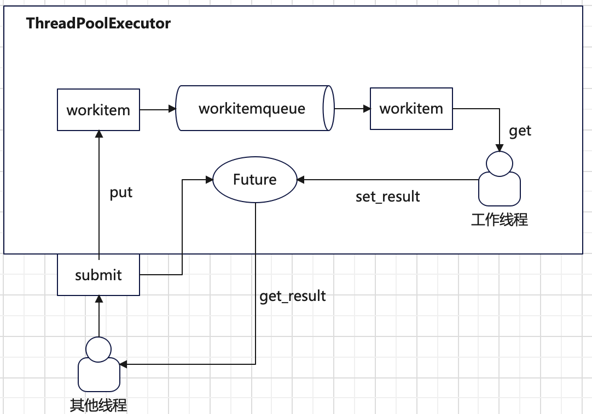
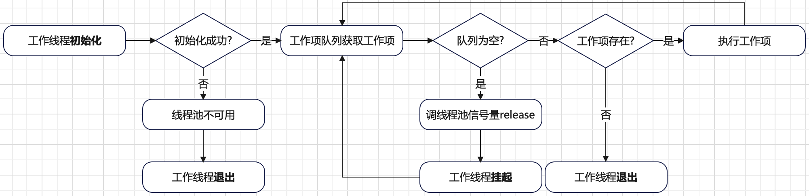

# 线程池
举个现实中购物的样例作为切入点：现实中有一个**快递公司**，**客户**通过快递公司提供的入口下单一个**商品**，并得到一个**快递单号**。
客户可以通过快递单号查询商品状态。快递公司内部分配一个**快递员**对商品进行配送，快递成功送达或者异常意味任务结束。

类比上述快递样例，线程池的工作机制实现需要有以下几个要素：
+ **线程池执行器**（快递公司）：负责管理所有的子线程（快递员）以及提供任务提交入口（商品下单）。 
+ **工作项**（商品）：提交的具体任务的抽象。
+ **工作线程入口函数**（快递员）：处理提交的任务。
+ **`Future`对象**（快递单号）：用于存储任务执行结果，及不同线程间结果同步。

下面一张图总结来线程池的工作原理：



**工作项`_WorkItem`** 是任务的静态抽象。工作项有如下功能：
+ 定义任务应该如何运行。
+ 任务运行结果应该存储在哪里。

工作项的具体实现如下：
```python
class _WorkItem:
    def __init__(self, future, fn, args, kwargs):
        self.future = future
        self.fn = fn
        self.args = args
        self.kwargs = kwargs

    def run(self):
        if not self.future.set_running_or_notify_cancel():
            return

        try:
            result = self.fn(*self.args, **self.kwargs)
        except BaseException as exc:
            self.future.set_exception(exc)
            # Break a reference cycle with the exception 'exc'
            self = None
        else:
            self.future.set_result(result)
```
`_WorkItem`对象定义了一个`run`方法，用于执行任务，并将执行结果更新到`Future`对象。在开始运行任务前，会调用`Future`的`set_running_or_notify_cancel`方法，
以更新`Future`对象的状态机为`RUNNING`。

**工作线程入口函数`_worker`** 会不断从工作项队列取出一个工作项`_WorkItem`，并执行`_WorkItem.run()`。其工作流程可以总结如下：



工作线程的入口函数相关实现如下：
```python
def _worker(executor_reference, work_queue, initializer, initargs):
    if initializer is not None:
        try:
            initializer(*initargs)
        except BaseException:
            _base.LOGGER.critical('Exception in initializer:', exc_info=True)
            executor = executor_reference()
            if executor is not None:
                # 线程池不可用，所有后续操作抛出异常，已提交任务的Future都设置异常
                executor._initializer_failed()
            return
    try:
        while True:
            try:
                work_item = work_queue.get_nowait()
            except queue.Empty:
                executor = executor_reference()
                if executor is not None:
                    # 队列为空，通知线程池有一个空闲的工作线程
                    executor._idle_semaphore.release()
                del executor
                # 工作线程挂起，直到队列有数据
                work_item = work_queue.get(block=True)

            if work_item is not None:
                work_item.run()
                # Delete references to object. See GH-60488
                del work_item
                continue

            executor = executor_reference()
            # Exit if:
            #   - The interpreter is shutting down OR
            #   - The executor that owns the worker has been collected OR
            #   - The executor that owns the worker has been shutdown.
            if _shutdown or executor is None or executor._shutdown:
                # Flag the executor as shutting down as early as possible if it
                # is not gc-ed yet.
                if executor is not None:
                    executor._shutdown = True
                # Notice other workers
                work_queue.put(None)
                return
            del executor
    except BaseException:
        _base.LOGGER.critical('Exception in worker', exc_info=True)
```
重点解释下工作线程退出的场景，也就是工作线程获取的工作项是`None`。退出有两种触发场景：
+ 线程池主动调用`shutdown`方法。这时候`executor._shutdown=True`，所以工作线程在退出之前会往工作项队列`put`一个`None`，
以通知其他工作线程退出。
+ 因为异常原因，`python`解释器退出或者线程执行器实例被垃圾回收。这时候工作线程在退出之前会往工作项队列`put`一个`None`，
以通知其他工作线程退出。

**线程池控制器**
