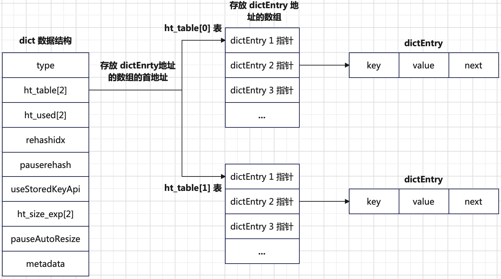

# 字符串
## 数据结构
### 简单动态字符串 SDS
`redis`内部的字符串类型`sds`的内存布局如下：
```bash
          headers                    buf
           ^                          ^
+----------+----------+---------------+--------------+
|                     |                              |
+-----+-------+-------+---+---+---+---+---+----+-----+
| len | alloc | flags | h | e | l | l | o | \0 | ... |
+-----+-------+-------+---+---+---+---+---+----+-----+
```
其中各个字段的含义如下：
+ `len`：字符串的长度，不包括`\0`字符。
+ `alloc`：表示`buf`已经分配的字节数（包括空闲空间），也就是`size(buf)-1`，`-1`表示留一个字节给`\0`。
+ `flags`：一个字节，低`3`位表示使用数据结构的类型。`sdshdr64`、`sdshdr32`、`sdshdr16`、`sdshdr8`等。
  ```c
  struct __attribute__ ((__packed__)) sdshdr5 {
      unsigned char flags; /* 3 lsb of type, and 5 msb of string length */
      char buf[];
  };
  struct __attribute__ ((__packed__)) sdshdr8 {
      uint8_t len; /* used */
      uint8_t alloc; /* excluding the header and null terminator */
      unsigned char flags; /* 3 lsb of type, 5 unused bits */
      char buf[];
  };
  struct __attribute__ ((__packed__)) sdshdr16 {
      uint16_t len; /* used */
      uint16_t alloc; /* excluding the header and null terminator */
      unsigned char flags; /* 3 lsb of type, 5 unused bits */
      char buf[];
  };
  struct __attribute__ ((__packed__)) sdshdr32 {
      uint32_t len; /* used */
      uint32_t alloc; /* excluding the header and null terminator */
      unsigned char flags; /* 3 lsb of type, 5 unused bits */
      char buf[];
  };
  struct __attribute__ ((__packed__)) sdshdr64 {
      uint64_t len; /* used */
      uint64_t alloc; /* excluding the header and null terminator */
      unsigned char flags; /* 3 lsb of type, 5 unused bits */
      char buf[];
  };
  ```
+ `buf`：存放以`\0`结尾的字符串。

# 哈希
## 数据结构
### 哈希表（字典）
哈希表，也可叫字典，可以有多个**哈希节点**。一个哈希节点保存一个健值对。哈希节点定义：
```c
typedef struct dictEntry {
    void *key;  // 健，可以是任意数据类型
    union {
        void *val;
        uint64_t u64;
        int64_t s64;
        double d;
    } v;  // 值，一个任意类型的指针，或一个uint64_t类型的数据，或int64_t类型的数据，或double类型的数据
    struct dictEntry *next;  // 指向另一个哈希节点的指针，用于解决哈希冲突问题（冲突的健用单向链表解决）
} dictEntry;
```
**字典**的定义如下：
```c
struct dict {
    dictType *type;

    dictEntry **ht_table[2];
    unsigned long ht_used[2];

    long rehashidx; /* rehashing not in progress if rehashidx == -1 */

    /* Keep small vars at end for optimal (minimal) struct padding */
    unsigned pauserehash : 15; /* If >0 rehashing is paused */

    unsigned useStoredKeyApi : 1;
    signed char ht_size_exp[2]; /* exponent of size. (size = 1<<exp) */
    int16_t pauseAutoResize;  /* If >0 automatic resizing is disallowed (<0 indicates coding error) */
    void *metadata[];
};
```
字典数据结构定义的各个字段含义如下：
+ `type`：指向`dictType`类型的指针。`dictType`结构保存一簇用于操作特定类型健值对的函数或标志位。不同类型用途的字典有不同类型的特定函数。
其中部分`dictType`结构定义如下。
  ```c
  typedef struct dictType {
      // 计算健的哈希值函数
      uint64_t (*hashFunction)(const void *key);
      // 复制健函数
      void *(*keyDup)(void *privdata, const void *key);
      // 复制值函数
      void *(*valDup)(void *privdata, const void *obj);
      // 比较健的函数
      int (*keyCompare)(void *privdata, const void *key1, const void *key2);
      // 销毁健的函数
      void (*keyDestructor)(void *privdata, void *key);
      // 销毁值的函数
      void (*valDestructor)(void *privdata, void *obj);
      ...
  } dictType;
  ```
+ `ht_table`：包含两个哈希表`ht_table[0]`和`ht_table[1]`的指针数组。一般情况下使用`ht_table[0]`哈希表，在进行`rehash`操作时使用`ht_table[1]`。
+ `ht_used`：一个数组，分别记录两个哈希表中已有的哈希节点的数目。
+ `rehashidx`：记录`rehash`的进度，用于渐进式`rehash`操作。值为`-1`表示没有进行`rehash`操作。
+ `pauserehash`：如果值大于`0`，表示暂停`rehash`操作。
+ `useStoredKeyApi`：标志位，表示是否使用预存键的`api`。值为`1`，表示直接使用键的预存哈希值，避免重复计算。
+ `ht_size_exp`：一个数组，记录两个哈希表大小的指数。哈希表大小是`size = 1 << ht_size_exp[i]`。哈希表的大小总是`2`的幂。
+ `pauseAutoResize`：控制自动调整哈希表大小的行为。`redis`会根据负载因子`ht_used / size`动态调整表大小。`pauseAutoResize`值大于`0`可临时禁用。

字典数据结构的图示说明如下：



### ListPack
`listpack`是一个序列化格式的字符串列表（一个连续内存存储），数据结构如下：
```bash
+------------+----------+--------+-----+--------+-----+
| total bytes| num elem | entry1 | ... | entryN | end |
+------------+----------+--------+-----+--------+-----+
```
各个字段含义说明如下：
+ `total bytes`：整个`listpack`对象的空间大小。`4`个字节。
+ `num elem`：`listpack`对象包含的元素个数，也就是`entry`的个数。`2`个字节。`num elem = 65535`说明实际元素的个数可能比`65535`大，
为了获取实际的元素个数，需要遍历整个`listpack`。
+ `end`：`listpack`对象结束标志。`1`个字节，值为`0xFF`。
+ `entryx`：实际存储的元素，可以存储**字符串**或者**整数**。`entry`的数据结构如下：
  ```bash
  +--------+---------+---------+
  | encode | content | backlen |
  +--------+---------+---------+
  ```
  各个字段含义说明如下：
  + `encode`：编码类型，决定后面`content`存储的内容，`1`个字节。`encode`值的含义说明如下：
    + 取值`0xxx xxxx`：`7`位长度无符号整数，范围`0-127`，后`7`位为数据。
    + 取值`110x xxxx`：`13`位长度有符号整数，范围``-4096-4095``。后`5`位及接下来`1`个字节表示数据。
    + 取值`1111 0001`：`16`位有符号整数，范围``-32768-32767``，接下来`2`个字节表示数据。
    + 取值`1111 0010`：`24`位有符号整数，范围``-8388608-8388607``，接下来`3`个字节表示数据。
    + 取值`1111 0011`：`32`位有符号整数，范围`-2147483648-2147483647`，接下来`4`个字节表示数据。
    + 取值`1111 0100`：`64`位有符号整数，接下来`8`个字节表示数据。
    + 取值`10xx xxxx`：`6`位无符号整数字符串长度，后`6`位表示字符串长度，接下来是字符串数据。
    + 取值`1110 xxxx`：`12`位无符号整数字符串长度，后`4`位是高位，接下里`1`个字节是低位，在之后才是字符串数据。
    + 取值`1111 0000`：`32`位无符号整数字符串长度，接下来`4`个字节表示字符串长度，之后才是字符串数据。

    对于负整数，`redis`将其转为正整数存储，例如对于`13`位整数存储中，存储范围`[0, 8191]`，其中`[0, 4095]`表示`0-4095`，`[4096, 8191]`表示`-4096 - -1`。
  + `content`：实际存储的数据，字符串或者整数。
  + `backlen`：表示当前`entry`的`encode + content`的长度，单位字节，大小`<=5`字节。`backlen`的每个字节的第一位是标志位，
  `0`表示结束，`1`表示未结束，剩下`7`位为有效位。`backlen`用于`listpack`对象**从后往前遍历**。`backlen`的编码和解码规则如下：
    ```bash
            +-+-+-+-+-+-+-+-+
    1个字节 |0|x|x|x|x|x|x|x|
            +-+-+-+-+-+-+-+-+
    
            +-+-+-+-+-+-+-+-+-+-+-+-+-+-+-+-+
    2个字节 |0|x|x|x|x|x|x|x|1|x|x|x|x|x|x|x|
            +-+-+-+-+-+-+-+-+-+-+-+-+-+-+-+-+
    
            +-+-+-+-+-+-+-+-+-+-+-+-+-+-+-+-+-+-+-+-+-+-+-+-+
    3个字节 |0|x|x|x|x|x|x|x|1|x|x|x|x|x|x|x|1|x|x|x|x|x|x|x|
            +-+-+-+-+-+-+-+-+-+-+-+-+-+-+-+-+-+-+-+-+-+-+-+-+
    
            +-+-+-+-+-+-+-+-+-+-+-+-+-+-+-+-+-+-+-+-+-+-+-+-+-+-+-+-+-+-+-+-+
    4个字节 |0|x|x|x|X|x|x|x|1|x|x|x|x|x|x|x|1|x|x|x|x|x|x|x|1|x|x|x|x|x|x|x|
            +-+-+-+-+-+-+-+-+-+-+-+-+-+-+-+-+-+-+-+-+-+-+-+-+-+-+-+-+-+-+-+-+
    
            +-+-+-+-+-+-+-+-+-+-+-+-+-+-+-+-+-+-+-+-+-+-+-+-+-+-+-+-+-+-+-+-+-+-+-+-+-+-+-+-+
    5个字节 |0|x|x|x|X|x|x|x|1|x|x|x|x|x|x|x|1|x|x|x|x|x|x|x|1|x|x|x|x|x|x|x|1|x|x|x|x|x|x|x|
            +-+-+-+-+-+-+-+-+-+-+-+-+-+-+-+-+-+-+-+-+-+-+-+-+-+-+-+-+-+-+-+-+-+-+-+-+-+-+-+-+
    ```
    **编码规则：从左往右。解码规则：从右往左**。例如数字`136`的二进制是`0000001 0001000`，需要`2`个字节存储（每个字节只有`7`位是有效的）。

    编码流程如下：
    + 右移`7`位，保留高`7`位，也就是`0000001`，保存在`p[0]`位置，`p[0]`的第一位为`0`。
    + 将剩下的低`7`位，也就是`0001000`，保存在`p[1]`位置，`p[1]`的第一位为`1`。此时`backlen`的二进制值是`00000001 10001000`。
    
    解码的流程如下：
    + 解码`p[1]`的值`10001000`取低`7`位`0001000`，也就是十进制`8`，保存为`v=8`。取最高位值看是否为`1`，如果为`1`继续取下一个字节。
    + 解码`p[0]`的值`00000001`，取低`7`位`0000001`，因为是解码的第二个字节，将其左移`7`位，即`0000001 << 7 = 128`，将其和上一步的`v`相加，即`v = 8 + 128 = 136`，
    取最高位为`0`，解码结束，得到`backlen=136`。

## 使用场景
哈希数据类型，对于**少量数据会使用`listpack`数据结构存储**，对于**大量数据会使用字典数据结构**。
+ 对于哈希类型数据存储，初始化默认使用`listpack`数据结构。数据存储样例如下：
  ```bash
  +------------+----------+--------+--------+-----+-----+
  | total bytes| num elem |  key1  | value1 | ... | end |
  +------------+----------+--------+--------+-----+-----+
  ```
+ 当满足以下条件时，会将`listpack`数据结构转为字典数据结构存储数据。也就是创建一个字典对象，遍历在`listpack`中的键值插入到字典中。
  ```bash
  # 任何一个条件满足，都会执行数据结构转化为字典存储。
  1. listpack 占用内存大小超过 1G
  2. key 和 value 的长度超过 server.hash_max_listpack_value。在 redis.conf 中 hash-max-listpack-value 配置，默认 64。
  3. key 的个数超过 server.hash_max_listpack_entries。在 redis.conf 中 hash-max-listpack-entries 配置，默认 512。
  ```

少量数据使用`listpack`节约内存，大量数据使用字典存储提高效率。需要注意是，当数据量减少到不满足上面三个条件，
`redis`也不会自动将字典存储数据结构转为`listpack`数据结构。如果有这种需求，可以新建一个哈希键，
使用`HGETALL`获取所有字段值，再`HSET`写入新键（触发新键自动选择`listpack`），最后删除旧键。

# 列表
## 数据结构
从`redis 7.0`及之后，列表数据类型底层使用`quicklist`数据结构。`quicklist`是一个双端链表，链表的每一个节点是`listpack`对象。
每一个节点`quicklistNode`的数据定义如下：
```c
typedef struct quicklistNode {
    struct quicklistNode *prev;
    struct quicklistNode *next;
    unsigned char *entry;        /* 指向 listpack 对象的地址 */
    size_t sz;                   /* entry size in bytes */
    unsigned int count : 16;     /* count of items in listpack */
    unsigned int encoding : 2;   /* RAW==1 or LZF==2 */
    unsigned int container : 2;  /* PLAIN==1 or PACKED==2 */
    unsigned int recompress : 1; /* was this node previous compressed? */
    unsigned int attempted_compress : 1; /* node can't compress; too small */
    unsigned int dont_compress : 1; /* prevent compression of entry that will be used later */
    unsigned int extra : 9; /* more bits to steal for future usage */
} quicklistNode;
```
其中`encoding`表示当前`quicklistNode`的压缩方式，取值有`RAW`和`LZF`。
+ `RAW`表示当前节点数据不压缩。
+ `LZF`表示当前节点数据使用`LZF`压缩算法压缩，节约内存。

`container`表示当前节点作为存储数据容器类型，取值有`PLAIN`和`PACKED`。
+ `PLAIN`表示一个节点存储一个元素，像普通的链表节点存储元素一样。
+ `PACKED`表示一个节点存储一个`listpack`对象数据。

**`quicklist`的定义**如下：
```c
typedef struct quicklist {
    quicklistNode *head;
    quicklistNode *tail;
    unsigned long count;        /* total count of all entries in all listpacks */
    unsigned long len;          /* number of quicklistNodes */
    signed int fill : QL_FILL_BITS;       /* fill factor for individual nodes */
    unsigned int compress : QL_COMP_BITS; /* depth of end nodes not to compress;0=off */
    unsigned int bookmark_count: QL_BM_BITS;
    quicklistBookmark bookmarks[];
} quicklist;
```
其中`bookmarks`相关成员和内存优化相关，在内存碎片整理相关。下面解释下`fill`和`compress`参数含义：
+ `fill`为**正数**表示每个`quicklistNode`节点中`listpak`对象最大元素个数。为**负数**，取值有如下（可以通过修改配置文件中的`list-max-listpack-size`选项，配置`listpack`节点占内存大小）：
  + `-1`：`listpack`节点最大为`4KB`；
  + `-2`：`listpack`节点最大为`8KB`；
  + `-3`：`listpack`节点最大为`16KB`；
  + `-4`：`listpack`节点最大为`32KB`；
  + `-5`：`listpack`节点最大为`64KB`；
+ `compress`考虑`quicklistNode`节点个数较多时，我们经常访问的是两端的数据。为了进一步节省空间允许对中间的`quicklistNode`节点进行压缩，
通过修改配置文件`list-compress-depth`进行配置设置`compress`参数。该项的具体含义是两端各有`compress`个节点不压缩。

`quicklist`的数据结构示意图如下：


## 使用场景
列表数据类型，**数据量少**的时候会使用`listpack`数据结构存储。当**数据量较多**时，会使用`quicklist`，其中每一个节点`quicklistNode`指向`listpack`对象。
+ 列表数据类型，初始化默认使用`listpack`数据结构。数据存储样例如下：
  ```bash
  +------------+----------+--------+--------+-----+-----+
  | total bytes| num elem |  key1  | value1 | ... | end |
  +------------+----------+--------+--------+-----+-----+
  ```
+ 当满足以下条件时，会创建`quicklistNode`节点。`quicklistNode`节点指向`listpack`对象。
  ```bash
  # 任何一个条件满足都会执行数据结构转化，listpack 转为 quicklist
  1. 当 list-max-listpack-size 值是正数，且更新后当前 listpack 对象元素个数超过 list-max-listpack-size 值
  2. 当 list-max-listpack-size 值是负数，且更新后当前 listpack 对象大小超过 list-max-listpack-size 值
  ```
需要注意是，当`quicklist`中数据量减少到不满足上面`2`个条件时，也会执行`quicklist`到`listpack`数据结构转化。

# 集合
## 数据结构
### 整数集合
整数集合数据结构`intset`的定义如下：
```c
typedef struct intset {
    uint32_t encoding;
    uint32_t length;
    int8_t contents[];
} intset;
```
其中各个字段的含义如下：
+ `encoding`：编码类型，决定每个元素占用字节数，取值有如下：
  + `INTSET_ENC_INT16`：存储的每个元素都是`int16_t`类型值；
  + `INTSET_ENC_INT32`：存储的每个元素都是`int32_t`类型值；
  + `INTSET_ENC_INT64`：存储的每个元素都是`int64_t`类型值；
+ `length`：存储的元素数量，也就是`contents`数组的长度；
+ `contents`：一个数组，存储元素，根据`encoding`值决定一个元素的数据类型；

当一个集合**只包含整数值元素且集合的元素数量不多时**（元素个数不超过配置项`set-max-intset-entries`，默认值`512`）才会使用整数集合`intset`数据结构存储数据。

当插入的整数值的编码大于当前整数集合`intset`的编码`encoding`时，会执行**升级流程**。也就是将整数集合中现有的元素重新按当前插入元素的编码重新存储。
整数集合的编码更新为当前元素编码值。升级流程是不可逆的，也就是即使最大编码整数元素被删除，整个`intset`编码方式也不会变小。

## 使用场景
对于集合数据类型`set`，底层使用的数据结构有如下情况：
+ 如果添加的集合元素可以转为整数且集合元素个数不超过`set-max-intset-entries`配置（默认`512`），则使用**整数集合`intset`** 存储数据。
+ 否则，如果添加的元素个数不超过`set-max-listpack-entries`配置（默认`128`）且每个元素的长度（字节大小）不超过`set-max-listpack-value`配置（默认`64`），
则底层使用 **`listpack`存储数据**。
+ 否则，使用**哈希表`dict`数据结构**存储。只使用`key`，`value`设置为`NULL`。

集合数据类型`set`使用的数据结构并不是一直不变的。每次添加元素都会判断当前`set`使用数据结构是否满足添加当前元素。
如果出现条件不满足情况，会将整数集合`intset`转为`listpack`或者哈希表`dict`。而`listpack`转为哈希表`dict`。
**上述数据结构过程是不可逆的，也就是只是升级不能降级**。

# 有序集合
## 数据结构
### 跳表
对于一个有序链表，查找和删除的操作时间复杂度都是`O(n)`，也就是需要遍历整个链表。
```bash
# 链表结构
    头节点
+-------------+     +----------+     +----------+     +----------+     +----------+     +----------+     +------+                                
| head | next | --> | 3 | next | --> | 4 | next | --> | 6 | next | --> | 7 | next | --> | 8 | next | --> | null |
+-------------+     +----------+     +----------+     +----------+     +----------+     +----------+     +------+
```
如何优化链表的查找呢？解决方案就是：以空间换时间，在原有的有序链表上增加多层索引，进而将查找变为近似二分查找。增加多层索引的数据结构如下：
```bash
+-------------+                                                        +----------+                                                          +------+                                
| head | next | -----------------------------------------------------> | 7 | next | -------------------------------------------------------> | null |
+-------------+                                                        +----------+                                                          +------+                                
|    down     |                                                        |   down   |             
+-------------+                                                        +----------+
      |                                                                      |
      v                                                                      v
+-------------+                      +----------+                      +----------+                      +-----------+                       +------+                                
|      | next | -------------------> | 4 | next | -------------------> | 7 | next | -------------------> | 10 | next | --------------------> | null |
+-------------+                      +----------+                      +----------+                      +-----------+                       +------+                                
|    down     |                      |   down   |                      |   down   |                      |   down    |              
+-------------+                      +----------+                      +----------+                      +-----------+
      |                                    |                                 |                                 |
      v                                    v                                 v                                 v
+-------------+     +----------+     +----------+     +----------+     +----------+     +----------+     +-----------+     +-----------+     +------+                                
|      | next | --> | 3 | next | --> | 4 | next | --> | 6 | next | --> | 7 | next | --> | 8 | next | --> | 10 | next | --> | 12 | next | --> | null |
+-------------+     +----------+     +----------+     +----------+     +----------+     +----------+     +-----------+     +-----------+     +------+                                
|    down     |     |   down   |     |   down   |     |   down   |     |   down   |     |   down   |     |   down    |     |   down    |              
+-------------+     +----------+     +----------+     +----------+     +----------+     +----------+     +-----------+     +-----------+
```
上面每层索引的节点不必要保存链表的详细信息，只保留用于查找的数据即可。每一个链表节点的详细信息都在最底层的链表保存。
查找的过程变为**从最高层索引开始查找**，一直找到小于等于目标元素的最后一个节点，然后转到**次高层索引继续查找**，一直到底层链表为止。

跳表在查找，插入和删除等操作时间复杂度为`O(logn)`，效率和红黑树、`AVL`树差不多。同时相对`AVL`树或者红黑树，跳表在**区间范围**问题上有明显优势。

跳表在具体实现上，在`redis`中，每一个跳表节点`zskiplistNode`的定义如下：
```c
typedef struct zskiplistNode {
    sds ele;  // 存储具体数据
    double score;  // 用于排序的分值
    struct zskiplistNode *backward; // 指向当前节点的前一个节点，用于双向遍历
    struct zskiplistLevel {
        struct zskiplistNode *forward; // 指向该层中的下一个节点的指针
        unsigned long span;  // 该层中当前节点到下一个节点的跨度（间隔节点数），用于快速计算排名，左开右闭原则
    } level[];
} zskiplistNode;
```
跳表节点`zskiplistNode`的数据结构示意图如下：


其中每一层箭头表示`forward`，箭头上的数字表示`span`值。每次新插入`zskiplistNode`节点，都会执行以下流程：
+ 查找需要插入的位置。从`header`节点最高层开始，从上层往下查找。
+ 如果新插入的节点层数大于跳跃表最大层数，则调整跳跃表的最大层数（高度）。新节点层数计算如下：
  ```c
  // ZSKIPLIST_P = 0.25   RAND_MAX = 0x7fffffff  ZSKIPLIST_MAXLEVEL = 32
  int zslRandomLevel(void) {
      static const int threshold = ZSKIPLIST_P*RAND_MAX;
      int level = 1;
      while (random() < threshold)
          level += 1;
      return (level<ZSKIPLIST_MAXLEVEL) ? level : ZSKIPLIST_MAXLEVEL;
  }
  ```
  所以`level = 1`的概率是`1-0.25`、`level = 2`的概率是`0.25*(1-0.25)`。层数越大，概率越小。
+ 插入节点，调整受影响节点每层的`forward`和`span`。
+ 调整`backward`以及跳跃表的`length`属性。

下面是跳表`zskiplist`的定义：
```c
typedef struct zskiplist {
    struct zskiplistNode *header, *tail;
    unsigned long length;  // 跳表节点总数，不包含头节点
    int level;  // 当前跳表的最大层数
} zskiplist;
```
### 有序集合
数据结构有序集合`zset`的定义如下：
```c
typedef struct zset {
    dict *dict;      // 哈希表
    zskiplist *zsl;  // 跳表
} zset;
```
在哈希表`dict`中，有序集合中的元素`ele`作为`key`，分数`score`作为`value`。其中**数据元素和分数会存储在跳表中，
但哈希表也会存一份，只是哈希表的`value`是跳表中分数对象的地址**。有序集合`zset`同时使用字典和跳跃表存储，
字典成员查询时间复杂度为`O(1)`，跳跃表范围查找时间复杂度为`O(logN)`。

## 使用场景
有序集合`zset`数据类型，**数据量少的时候会使用listpack数据结构**存储。当**数据量较多时，会使用`zset`**。
+ 当满足有序集合中元素个数不超过`zset-max-listpack-entries`配置（默认值`128`）且每个元素的大小不超过`zset-max-listpack-value`配置（默认值`64`）时，
使用`listpack`数据结构存储。
  ```bash
  +------------+----------+--------+--------+-----+-----+
  | total bytes| num elem |  ele   | score  | ... | end |
  +------------+----------+--------+--------+-----+-----+
  ```
+ 否则，当不满足上面条件，则使用`zset`数据结构存储。有必要会将之前`listpack`中的数据转到新的`zset`中存储。

有序集合`zset`数据类型使用的数据结构并不是一直不变的。每次添加元素都会判断当前有序集合使用数据结构是否满足添加当前元素。
如果出现条件不满足情况，会将`listpack`转为有序集合`zset`。**上述数据结构过程是不可逆的，也就是只是升级不能降级**。
