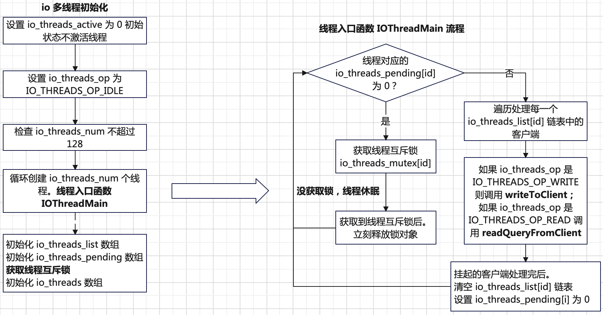
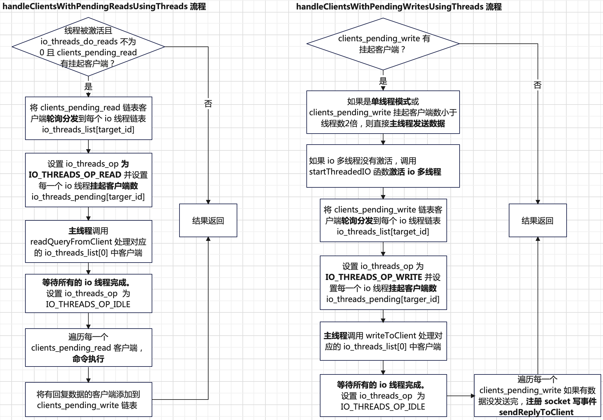

> 基于`redis`源码分支`7.4.2`

# 概述
`redis`服务端是**事件驱动**模式，基于`IO`多路复用，采样`Reactor`编程模式实现。`redis`服务端框架设计主要实现以下几部分功能：
+ **核心架构模块**
  + **网络层（`IO`多路复用）**
    + **事件驱动模型**：基于`AE`框架（`Adaptive Event Loop`），针对不同操作系统封装事件模型。具体来说，`Linux`使用`epoll`，`BSD`使用`kqueue`，`Windows`使用`select`。
    + **事件类型**：**文件事件**处理客户端的连接、请求读取和响应写入。**时间事件**处理定时任务，如键过期检查、后台`RDB`快照等。
    + **事件模型工作流程**：初始化事件循环（`aeCreateEventLoop`）并绑定服务端监听端口。注册客户端连接事件（`connAcceptHandler`）。
    通过`aeProcessEvents`轮询处理事件。
  + **命令处理层**
    + **单线程模型**：主线程顺序处理命令，避免锁竞争，依赖高效数据结构和内存操作实现高吞吐。
    + **请求解析**：根据自定义的数据解析协议，将客户端请求数据解析为对应命令及参数。
    + **命令执行**：将解析的命令通过`redisCommandTable`表查找具体的命令执行函数并执行，执行结果作为响应回复客户端。
  + **数据存储层**
    + **`key-value`数据库**：不管是`key`还是`value`，在`redis`中都是`redisObject`对象。`redisObject`对象的定义如下：
      ```c
      typedef struct redisObject {
          unsigned type:4;
          unsigned encoding:4;
          unsigned lru:LRU_BITS; /* LRU time (relative to global lru_clock) or
                                  * LFU data (least significant 8 bits frequency
                                  * and most significant 16 bits access time). */
          int refcount;
          void *ptr;
      } robj;
      ```
      基于`type`（对象类型。如字符串，链表，集合等）和`encoding`（底层使用的数据结构。如哈希表，数组，跳跃表等）动态优化存储。
    + **数据存储底层数据结构**：动态字符串`SDS`、链表、跳跃表，字典，集合、字典树等。
+ **高可用与拓展模块**
  + **持久化**
    + **RDB持久化**：定时生成内存快照，子进程异步写入磁盘。
    + **AOF持久化**：记录写命令日志，支持三种刷盘策略（`Always/Everysec/No`）。
  + **集群模式**
    + **主从复制**：**异步复制**，主节点将写命令传播至从节点。**增量同步**，断线重连后仅同步差异数据。
    + **哨兵模式**：监控主节点健康状态，自动故障转移。多哨兵协商机制，避免网络分区误判。
    + **分片集群模式**：数据分片（`16384 Slot`），通过`CRC`哈希分配键到不同节点。同时支持节点动态扩缩容。
+ **性能优化机制**
  + **内存管理**
    + 内存淘汰策略（`LRU/LFU/TTL`）。
    + 大`Key`拆分（如`Hash`分片）和热点`Key`多级缓存。
  + **线程模型拓展**
    + 从`6.0`版本开始，支持多线程处理网络`IO`，但命令还是由主线程负责执行。
    + 后台线程处理惰性删除、AOF 刷盘等任务。
  + **管道化与批处理**
    + 减少网络往返延迟。

其中`redis`服务端核心功能架构原理如下（不涉及集群模式和持久化能力）：


# 事件循环
## 数据结构定义
事件循环是`redis`的核心。`redis`封装了**事件循环对象`aeEventLoop`**。其定义如下：
```c
typedef struct aeEventLoop {
    int maxfd;   /* highest file descriptor currently registered */
    int setsize; /* max number of file descriptors tracked */
    long long timeEventNextId;
    aeFileEvent *events; /* Registered events */
    aeFiredEvent *fired; /* Fired events */
    aeTimeEvent *timeEventHead;
    int stop;
    void *apidata; /* This is used for polling API specific data */
    aeBeforeSleepProc *beforesleep;
    aeBeforeSleepProc *aftersleep;
    int flags;
} aeEventLoop;
```
各个字段的含义说明如下：
+ `maxfd`：当前已注册的最大文件描述符；
+ `setsize`：最多同时处理客户端数；
+ `timeEventNextId`：每个时间事件都需要一个唯一的`ID`。`timeEventNextId`是用于生成新时间事件`ID`的计数器。生成新时间事件时，
`timeEventNextId`会递增，确保每个时间事件的`ID`都是唯一的；
+ `stop`：表示事件循环是否结束；
+ `events`：文件事件数组（`socker`可读可写事件），存储**已注册**的文件事件；
+ `fired`：存储**被触发**的文件事件的数组；
+ `timeEventHead`：存放时间事件**链表头节点**；`redis`有多个时间事件，用链表存储；
+ `apidata`：`redis`底层可能使用不同的`IO`多路复用模型（`epoll`、`select`等），`apidata`是对不同`IO`复用多路模型统一封装；
+ `beforesleep`：在事件循环中，也就是在调用`aeApiPoll`**之前**会调用`beforesleep`函数；
+ `aftersleep`：在事件循环中，也就是在调用`aeApiPoll`**返回后**（有事件发生）会调用`aftersleep`函数；

在`redis`中，事件类型主要有两种：**文件事件（`socket`读写事件）**、**时间事件**。其中时间事件的定义如下：
```c
typedef struct aeTimeEvent {
    long long id; /* time event identifier. */
    monotime when;
    aeTimeProc *timeProc;
    aeEventFinalizerProc *finalizerProc;
    void *clientData;
    struct aeTimeEvent *prev;
    struct aeTimeEvent *next;
    int refcount; /* refcount to prevent timer events from being
  		   * freed in recursive time event calls. */
} aeTimeEvent;
```
所有的时间事件通过一个链表存储，`aeTimeEvent`结构是链表中的一个节点，其各个字段含义说明如下：
+ `id`：时间事件的唯一`ID`，通过`aeEventLoop->timeEventNextId`实现；
+ `when`：时间事件触发的时间，一个绝对时间点；
+ `timeProc`：函数指针，指向时间事件处理函数；
+ `finalizerProc`：函数指针，删除时间事件节点时调用此函数，用于一些资源清理工作；
+ `clientData`：对应的客户端对象；
+ `prev`：指向前一个时间事件节点；
+ `next`：指向下一个时间事件节点；
+ `refcount`：当前时间事件的引用计数。只有引用计数为`0`，才允许从时间事件链表中删除此时间事件节点；

文件事件在内部有两种结构：注册的文件事件和被触发的文件事件。其中注册的文件事件定义如下：
```c
typedef struct aeFileEvent {
    int mask; /* one of AE_(READABLE|WRITABLE|BARRIER) */
    aeFileProc *rfileProc;
    aeFileProc *wfileProc;
    void *clientData;
} aeFileEvent;
```
注册的文件事件`aeFileEvent`结构的各个字段含义如下：
+ `mask`：文件事件类型。取值`AE_READABLE`（可读）、`AE_WRITABLE`（可写）和`AE_BARRIER`；
+ `rfileProc`：函数指针，指向读事件处理函数；
+ `wfileProc`：函数指针，指向写事件处理函数；
+ `clientData`：对应的客户端对象；

被触发的文件事件`aeFileEvent`结构定义如下：
```c
typedef struct aeFiredEvent {
    int fd;    // 文件描述符
    int mask;  // 事件的标志，取值 AE_READABLE、`AE_WRITABLE`等
} aeFiredEvent;
```
## 工作原理
`redis`中事件循环的核心函数是`aeProcessEvents`。`aeProcessEvents`的工作原理如下：


## 文件事件
`redis`中文件事件主要有三种：**监听`socket`文件事件**、**客户端`socket`读事件**和**客户端`socket`写事件**。
其中监听`socket`的文件事件是在服务初始化阶段被注册，对应的事件处理函数是`connAcceptHandler`。当有客户端连接发生时，
对应的处理流程如下：


根据上图监听`socket`文件事件处理流程可知，每次和客户端成功建立连接后，都会注册对应客户端`socket`读文件事件，对应的事件处理函数是`readQueryFromClient`。
当客户端`socket`读事件发生时，对应的事件处理函数 `readQueryFromClient`的工作流程如下：


`readQueryFromClient`客户端**数据读事件函数**内部会通过`postponeClientRead`判断是否应该推迟客户端数据的读操作，
也就是读操作推迟到在下次事件循环在`beforesleep`函数中执行。
```c
void readQueryFromClient(connection *conn) {
    client *c = connGetPrivateData(conn);
    int nread, big_arg = 0;
    size_t qblen, readlen;

    /* Check if we want to read from the client later when exiting from
     * the event loop. This is the case if threaded I/O is enabled. */
    if (postponeClientRead(c)) return;
    ...
}
// 推迟读操作判断，用于 IO 多线程读
int postponeClientRead(client *c) {
    if (server.io_threads_active &&
        server.io_threads_do_reads &&
        !ProcessingEventsWhileBlocked &&
        !(c->flags & (CLIENT_MASTER|CLIENT_SLAVE|CLIENT_BLOCKED)) &&
        io_threads_op == IO_THREADS_OP_IDLE)
    {
        listAddNodeHead(server.clients_pending_read,c);
        c->pending_read_list_node = listFirst(server.clients_pending_read);
        return 1;
    } else {
        return 0;
    }
}
```
根据`postponeClientRead`的源码，需要推迟需要满足以下所有条件：
+ `IO`多线程被激活。通过调用`startThreadedIO`设置`server.io_threads_active=1`。
+ 在`redis.conf`配置文件中设置`io-threads-do-reads`值为`yes`。
+ 当前服务端没有处理阻塞操作，如执行`RDB`或`AOF`持久化操作。在`redis`内部，当处理阻塞操作时，会调用 `processEventsWhileBlokced`函数，
处理在执行阻塞操作期间收到的请求命令，避免`redis`长时间阻塞。所以对于调用`processEventsWhileBlokced`期间收到的请求是不会推迟处理的。
+ 当前的请求客户端不是用于主从复制的节点，且当前客户端没有在等待阻塞操作完成。
+ `IO`多线程操作状态是初始状态`IO_THREADS_OP_IDLE`。在`beforesleep`函数中会调用**多线程处理读函数**中设置`IO_THREADS_OP_READ`，
调用**多线程处理写函数**中设置`IO_THREADS_OP_WRITE`。

`redis`内部有两种命令请求协议：**内联命令**和**多批量命令**。其中**多批量命令**协议格式如下：
````bash
# 客户端输入如下命令
SET redis-key value1
# 多批量命令协议
*3\r\n$3\r\nSET\r\n$9\r\nredis-key\r\n$6\r\nvalue1\r\n
# 内联命令协议
SET redis-key value1\r\n
``````
**多批量命令**协议用于复杂的命令，以`*`开头。其中`\r\n`用于区分命令请求各个参数；`*3`表示该命令请求有三个参数；`$3`、`$9`和`$6`表示该参数字符串长度。
**内联命令**协议不以`*`开头，长用于简单的命令及参数。

需要注意的是，在`IO`多线程环境下，**命令的处理逻辑（`CPU`操作）还是在主线程完成**，避免多线程数据安全及线程切换开销。

当一个**请求命令处理完**后，会调用`addReply`函数将命令执行结果回复给客户端（**主线程完成**）。`addReply`函数的执行流程总结如下：


实际的回复数据写操作是在`beforesleep`函数中调用`handleClientsWithPendingWritesUsingThreads`完成。其中会遍历处理`server.clients_pending_write`链表，
依次处理每一个客户端的输出缓存数据。如果当前调用写操作数据没发送完，例如遇到写`socket`缓存区满，则会注册一个`socket`**写事件处理函数`sendReplyToClient`**。
详细的细节会在`IO`多线程章节介绍。

## 时间事件
`redis`中所有的时间事件都用一个链表（`eventLoop->timeEventHead`）存储。服务默认初始化下，只创建一个时间事件`serverCron`。
```c
// 在 initServer 中调用
if (aeCreateTimeEvent(server.el, 1, serverCron, NULL, NULL) == AE_ERR) {
    serverPanic("Can't create event loop timers.");
    exit(1);
}
```
在配置文件`redis.conf`中指定`maxmemory`配置，可以开始`evictionTimeProc`时间事件，用于内存淘汰。这里只介绍`serverCron`时间事件。
时间事件处理函数`serverCron`源码说明如下：
```c
int serverCron(struct aeEventLoop *eventLoop, long long id, void *clientData) {
    ...
    /* Adapt the server.hz value to the number of configured clients. If we have
     * many clients, we want to call serverCron() with an higher frequency. */
    if (server.dynamic_hz) {
        while (listLength(server.clients) / server.hz >
               MAX_CLIENTS_PER_CLOCK_TICK)
        {
            server.hz *= 2;
            if (server.hz > CONFIG_MAX_HZ) {
                server.hz = CONFIG_MAX_HZ;
                break;
            }
        }
    }
    ...
    run_with_period(100) {
        // 100ms 周期执行
        ...
    }
    run_with_period(5000) {
        // 5s 周期执行
        ...
    }
    /* We need to do a few operations on clients asynchronously. */
    // 清除客户端连接，例如超时，客户端缓存限制达到等
    clientsCron();

    /* Handle background operations on Redis databases. */
    // 处理数据库，例如清理过期键等
    databasesCron();
    ...
    /* Stop the I/O threads if we don't have enough pending work. */
    stopThreadedIOIfNeeded();
    ...
    server.cronloops++;
    return 1000/server.hz;
}
```
`serverCron`主要是用来执行周期性任务，例如：
+ 如果`redis.conf`配置文件开启了`dynamic-hz`参数（默认开启），则每次`serverCron`被调用都会根据当时建立连接客户端数目动态调整`serverCron`函数执行频率。
+ 更新一些统计信息，例如内存使用，数据发送和接收字节数等等。
+ 更新`LRU`缓存淘汰使用的时钟`server.lruclock`。
+ 处理`SIGTERM`和`SIGINT`等信号。
+ **客户端健康定时检查操作**。每次调用会尝试处理`listLength(server.clients)/server.hz`个客户端，因为期望`1s`内处理完所有客户端。
  + 断开清理超时客户端。通过判断客户端空闲时间是否超过`server.maxidletime`指定的大小。
    ```c
    if (now - c->lastinteraction > server.maxidletime)
        // 同步操作
        freeClient(c);
    ```
  + 调整客户端输入缓存`c->querybuf`占用内存空间，释放多余的空闲分配的内存。
  + 优化客户端输出缓存`c->buf`内存占用。
  + 跟踪记录客户端输入缓存`c->querybuf`和输出缓存`c->reply`峰值内存使用。累加统计总的客户端占用内存大小。
  + 如果客户端输出缓存`c->reply`链表大小超过限制，则关闭客户端（同步方式）。
+ **数据库检查处理**。
  + 过期键的删除。通过调用`activeExpireCycle(ACTIVE_EXPIRE_CYCLE_SLOW)`实现。每次调用最多遍历`16`个数据库，
  每个数据库迭代调用`16`次会检查函数`activeExpireCycle`是否超时且每次迭代最多处理默认`20`个过期数据。
  超时时间`timelimit`计算如下：
    ```c
    // config_cycle_slow_time_perc 默认是 25
    // 结果表示 activeExpireCycle 函数执行时间占CPU时间25%
    timelimit = config_cycle_slow_time_perc*1000000/server.hz/100;
    ```
  + 内存碎片整理。`rehash`数据库的`db->keys`和`db->expires`字典存储。
+ 如果`server.clients_pending_write`客户端数目小于`IO`线程数的`2`倍，则停止`IO`多线程。

# IO 多线程
在`redis 6.0`之前，`redis`是单线程模式。也就是事件循环，请求接收，请求解析，请求处理及响应回复都在主线程完成。
在`redis 6.0`开始，引入`IO`多线程模式。也就是请求接收、请求解析及响应回复在`IO`子线程完成。其他还是在主线程完成。
和`IO`多线程相关的变量如下：
```c
int io_threads_num       // 默认值是1。表示 io 线程数
int io_threads_do_reads  // 请求接收和解析是否使用 io 多线程。默认不使用
int io_threads_active    // io 多线程是否激活使用。初始状态是不激活
int io_threads_op        // io 多线程的操作状态，取值有如下三个。
    // IO_THREADS_OP_IDLE: 空闲状态，表示没有 io 线程在进行响应回复或请求读和解析。
    // IO_THREADS_OP_READ: 表示有 io 线程在进行请求读和解析操作。
    // IO_THREADS_OP_WRITE: 表示有 io 线程在进行响应回复操作。
pthread_t io_threads[IO_THREADS_MAX_NUM]    // 一个128大小的数组，存放 io 线程对象。
pthread_mutex_t io_threads_mutex[IO_THREADS_MAX_NUM] // 一个128大小数组，存放每一个 io 线程使用的互斥锁
threads_pending io_threads_pending[IO_THREADS_MAX_NUM] // 一个128大小数组，存放每一个 io 线程待处理的客户端数量
list *io_threads_list[IO_THREADS_MAX_NUM]  // 一个128大小数组，存放每一个 io 线程需要处理的客户端对象。
```
`IO`多线程初始化流程总结如下：



每一个`IO`线程初始化后，如果没有要处理的挂起客户端，则线程会处于休眠状态。下面需要解决两个问题：
+ 每一个线程对应的挂起客户端链表`io_threads_list[id]`和对应的挂起客户端数`io_threads_pending[id]`是何时添加的?
+ `IO`多线程是何时被唤醒的?

在上面介绍的文件事件执行流程中可知，每次事件循环中会执行`beforesleep`函数。在`beforesleep`的流程中，
`handleClientsWithPendingReadsUsingThreads`函数和`handleClientsWithPendingWritesUsingThreads`函数会被调用用于使用`IO`多线程处理挂起的读客户端和写客户端。
相关的原理说明如下：



需要注意一点，`IO`多线程的激活只在`handleClientsWithPendingWritesUsingThreads`中实现。

# 数据存储
`redis`是`key-value`型数据库。不管是`key`还是`value`，存储都是`redisObject`对象。相关定义如下：
```c
struct redisObject {
    unsigned type:4;
    unsigned encoding:4;
    unsigned lru:LRU_BITS; /* LRU time (relative to global lru_clock) or
                            * LFU data (least significant 8 bits frequency
                            * and most significant 16 bits access time). */
    int refcount;
    void *ptr;
};
```
各个字段的含义说明如下：
+ `type`：表示对象的类型，取值如下：
  ```c
  /* The actual Redis Object */
  #define OBJ_STRING 0    /* String object. */
  #define OBJ_LIST 1      /* List object. */
  #define OBJ_SET 2       /* Set object. */
  #define OBJ_ZSET 3      /* Sorted set object. */
  #define OBJ_HASH 4      /* Hash object. */
  #define OBJ_MODULE 5    /* Module object. */
  #define OBJ_STREAM 6    /* Stream object. */
  ```
+ `encoding`：当前对象底层存储采用的数据结构；对于某种类型对象，在不同的情况下，`redis`使用不同的数据结构，下表给出了`encoding`和`type`之间的关系：
  |encoding取值|数据结构|存储对象类型|
  |------------|--------|------------|
  |`OBJ_ENCODING_RAW`|简单动态字符串(`sds`)|字符串|
  |`OBJ_ENCODING_INT`|整数|字符串|
  |`OBJ_ENCODING_HT`|字典(`dict`)|集合、字典、有序集合|
  |`OBJ_ENCODING_ZIPMAP`|未使用|未使用|
  |`OBJ_ENCODING_LINKEDLIST`|废弃|废弃|
  |`OBJ_ENCODING_ZIPLIST`|压缩列表(`ziplist`)|有序集合、字典|
  |`OBJ_ENCODING_INTSET`|整数集合(`intset`)|集合|
  |`OBJ_ENCODING_SKIPLIST`|跳跃表(`skiplist`)|有序集合|
  |`OBJ_ENCODING_EMBSTR`|简单动态字符串(`sds`)|字符串|
  |`OBJ_ENCODING_QUICKLIST`|快速链表(`quicklist`)|列表|
  |`OBJ_ENCODING_STREAM`|`stream`|`stream`|

  在对象的生命周期内，对象的编码不是固定的。例如集合对象，当集合中元素可用整数表示时，底层数据结构使用整数集合。
  当执行`sadd`命令，会先判断添加的元素能否解析为整数，不能则底层数据结构转为字典（内部只使用字典的`key`，`value`为`NULL`）。

  有些对象同时也会使用不同的数据结构存储。例如有序集合对象定义如下：
  ```c
  typedef struct zset {
    dict *dict;
    zskiplist *zsl;
  } zset;
  ```
  同时使用字典和跳跃表存储，字典成员查询时间复杂度为`O(1)`，跳跃表范围查找时间复杂度为`O(logN)`。所以有序集合对象利用了字典和跳跃表的组合优势。
  实际的数据只存储一份，字典和跳跃表存储的都是数据指针也就是多增加指针开销。
+ `lru`：占`24`位，用于实现缓存淘汰策略。在配置文件`maxmemory-policy`字段配置内存达到限制时的缓存淘汰策略，常见的策略是`LRU`和`LFU`。
`LRU`的思想是如果数据最近被访问，则将来被访问的概率大。`lru`存储的是对象的访问时间。`LFU`的思想是如果数据过去被多次访问，
则数据将来被访问几率更高。`lru`存储的是对象上次访问时间与访问次数。例如在执行`GET`命令会执行如下逻辑更新`lru`：
  ```c
  if (server.maxmemory_policy & MAXMEMORY_FLAG_LFU) {
      updateLFU(val);
  } else {
      // 更新 lru 为当前时间
      val->lru = LRU_CLOCK();
  }

  /* Update LFU when an object is accessed.
   * Firstly, decrement the counter if the decrement time is reached.
   * Then logarithmically increment the counter, and update the access time. */
  void updateLFU(robj *val) {
      unsigned long counter = LFUDecrAndReturn(val);
      counter = LFULogIncr(counter);
      val->lru = (LFUGetTimeInMinutes()<<8) | counter;
  }
  ```
  对于`LFU`策略，`lru`低`8`位更新为频率值，高`16`位为对象上次访问时间。通过`LFUDecrAndReturn`函数获取对象访问频率，
  并在此基础上累积。因为越老的数据一般被访问次数越大，越新的数据被访问次数越少，即使老的数据很久没被访问，这是不公平的。所以，
  `LFUDecrAndReturn`函数实现了访问次数随时间衰减的过程。
+ `refcount`：对象的引用次数，用于对象的共享；共享对象时`refcount`值加`1`；删除对象时`refcount`值减 `1`；当`refcount`值为`0`时，
会释放对象。
+ `ptr`：指向对象底层存储的数据结构。当存储的数据长度小于等于`20`且可以表示为一个`long`类型的整数时或者字符串长度小于等于`44`时，数据则直接存储在`ptr`字段；
正常情况下，为了存储一个字符串对象，需要两次内存分配，一次是`redisObject`对象分配，一次是`sds`分配。对于短字符串，`OBJ_ENCODING_EMBSTR`编码，只分配一次`redisObject`对象内存，将数据存储在`ptr`，这样`redisObject`和`sds`连续存储，
会利用计算机的高速缓存。

`redis`中实现了数据库对象`redisDb`用于存储所有的数据。对象`redisDb`的定义如下：
```c
typedef struct redisDb {
    kvstore *keys;              /* The keyspace for this DB */
    kvstore *expires;           /* Timeout of keys with a timeout set */
    ebuckets hexpires;          /* Hash expiration DS. Single TTL per hash (of next min field to expire) */
    dict *blocking_keys;        /* Keys with clients waiting for data (BLPOP)*/
    dict *blocking_keys_unblock_on_nokey;   /* Keys with clients waiting for
                                             * data, and should be unblocked if key is deleted (XREADEDGROUP).
                                             * This is a subset of blocking_keys*/
    dict *ready_keys;           /* Blocked keys that received a PUSH */
    dict *watched_keys;         /* WATCHED keys for MULTI/EXEC CAS */
    int id;                     /* Database ID */
    long long avg_ttl;          /* Average TTL, just for stats */
    unsigned long expires_cursor; /* Cursor of the active expire cycle. */
    list *defrag_later;         /* List of key names to attempt to defrag one by one, gradually. */
} redisDb;
```
各个字段的含义说明如下：
+ `id`：数据库的编号，默认`redis`有`16`个数据库，取值`0-15`。
+ `keys`：存储数据库的所有键值对。`kvstore`是`redis`优化后的数据结构（替代旧版`dict`），用于高效管理键的增删改查。
+ `expires`：存储数据库所有键的过期时间（设置过期时间的键）。`key`是对应键对象的指针，`value`是过期时间值。
+ `hexpires`：

# 命令处理
