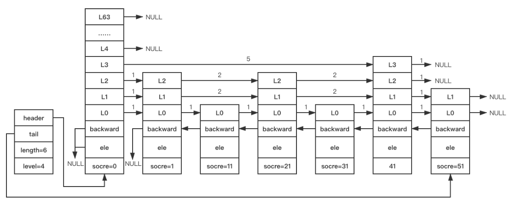

> 基于`redis`源码分支`5.0`
# 跳跃表
`redis`有序集合底层数据结构使用跳跃表实现（或者压缩列表实现）。
## 原理
跳跃表（简称跳表）用于**有序链表**的快速检索查找（通过索引方式，以空间换时间）。跳表在查找，插入和删除等操作时间复杂度为`O(logn)`，效率和红黑树、`AVL`数差不多，
同时相对红黑树或者`AVL`数，跳表在区间范围问题上有明显优势。

链表的的查找需要遍历整个链表，时间复杂度为`O(n)`。
```bash
    头节点
+-------------+     +----------+     +----------+     +----------+     +----------+     +----------+     +-----------+     +-----------+     +------+                                
| head | next | --> | 3 | next | --> | 4 | next | --> | 6 | next | --> | 7 | next | --> | 8 | next | --> | 10 | next | --> | 12 | next | --> | null |
+-------------+     +----------+     +----------+     +----------+     +----------+     +----------+     +-----------+     +-----------+     +------+                                
```
如何优化链表的查找呢？以空间换时间，在链表上加多层索引，通过索引将链表查找效率变为二分查找效率。
增加索引后的数据结构样例如下（添加两层索引）：
```bash
+-------------+                                                        +----------+                                                          +------+                                
| head | next | -----------------------------------------------------> | 7 | next | -------------------------------------------------------> | null |
+-------------+                                                        +----------+                                                          +------+                                
|    down     |                                                        |   down   |             
+-------------+                                                        +----------+
      |                                                                      |
      v                                                                      v
+-------------+                      +----------+                      +----------+                      +-----------+                       +------+                                
|      | next | -------------------> | 4 | next | -------------------> | 7 | next | -------------------> | 10 | next | --------------------> | null |
+-------------+                      +----------+                      +----------+                      +-----------+                       +------+                                
|    down     |                      |   down   |                      |   down   |                      |   down    |              
+-------------+                      +----------+                      +----------+                      +-----------+
      |                                    |                                 |                                 |
      v                                    v                                 v                                 v
+-------------+     +----------+     +----------+     +----------+     +----------+     +----------+     +-----------+     +-----------+     +------+                                
|      | next | --> | 3 | next | --> | 4 | next | --> | 6 | next | --> | 7 | next | --> | 8 | next | --> | 10 | next | --> | 12 | next | --> | null |
+-------------+     +----------+     +----------+     +----------+     +----------+     +----------+     +-----------+     +-----------+     +------+                                
|    down     |     |   down   |     |   down   |     |   down   |     |   down   |     |   down   |     |   down    |     |   down    |              
+-------------+     +----------+     +----------+     +----------+     +----------+     +----------+     +-----------+     +-----------+
```
索引节点并不需要保存链表的详细信息，保存某些用作查询的字段即可，每个节点的详细信息只需在最底层的链表节点中保存即可。

查找的过程变为从最高层索引开始查找，一直找到小于等于目标元素的最后一个节点，然后转到次高层索引继续查找，一直到底层链表为止。
这时候已经十分接近要查找的节点了。

## 数据结构定义
跳跃表节点定义如下：
```c
typedef struct zskiplistNode {
    sds ele;
    double score;
    struct zskiplistNode *backward;
    struct zskiplistLevel {
        struct zskiplistNode *forward;
        unsigned long span;
    } level[];
} zskiplistNode;
```
+ `ele`：存储`SDS`字符串类型数据；
+ `score`：用于排序的分值；
+ `backward`：指向当前节点最底层前一个节点的指针，用于从后往前遍历跳跃表；
+ `level`：表示当前节点层数的数组，每个节点的层数都可能不一样。
  + `forward`：指向当前层的下一个节点，尾节点`forward`指向`NULL`；
  + `span`：`forward`指向的节点与本节点之间的节点个数，`span`值越大，跳过的节点个数越多（**左开右闭**原则）。

下面给出跳跃表节点示意说明（指针上的数字表示对应层`span`值，`levelx`层后的指针表示`forward`）：
```bash
     zskiplistNode
     +----------+
     |  level2  | ---> null
     +----------+      +----------+
     |  level1  | -1-> |  level1  | ---> ...
     +----------+      +----------+
     |  level0  | -1-> |  level0  | ---> ...
     +----------+      +----------+
<--- | backward | <--- | backward |
     +----------+      +----------+
     |  score   |      |  score   |
     +----------+      +----------+
     |   ele    |      |   ele    |
     +----------+      +----------+
```
跳越表会根据`score`值排序，如果`score`值相同，以`ele`值排序。

跳跃表的定义如下：
```c
typedef struct zskiplist {
    struct zskiplistNode *header, *tail;
    unsigned long length;
    int level;
} zskiplist;
```
+ `header`：指向跳跃表头节点指针。`header`节点是特殊节点，里面有层级数组`level`元素个数为`64`，不存储`score`和`ele`值，
不计入跳跃表节点总数。初始化的时候，`64`层中的每一层中的`forward=null`且`span=0`。
+ `tail`：指向跳跃表尾节点指针；
+ `length`：跳跃表节点总数，不包括`header`节点；
+ `level`：跳跃表的高度；

跳跃表可以在常数时间复杂度`O(1)`内获取跳跃表的长度、头节点、尾节点和高度值。

下面给出跳跃表的示意说明：
```bash
                     +----------+
                     |  level63 | ---> null
                     +----------+
                     |  ......  | ---> null
                     +----------+            +----------+
                     |  level2  | -----1---> |  level2  | ---> null
                     +----------+            +----------+      +----------+
                     |  level1  | -----1---> |  level1  | -1-> |  level1  | ---> null
 +----------+        +----------+            +----------+      +----------+
 |  header  | ---+   |  level0  | -----1---> |  level0  | -1-> |  level0  | ---> null
 +----------+    |   +----------+            +----------+      +----------+
 |   tail   | -+ |   | backward |  null <--- | backward | <--- | backward |
 +----------+  | |   +----------+            +----------+      +----------+
 | length:2 |  | |   |  score   |            |  score   |      |  score   |
 +----------+  | |   +----------+            +----------+      +----------+
 | level:3  |  | |   |   ele    |            |   ele    |      |   ele    |
 +----------+  | |   +----------+            +----------+      +----------+
               | |       ^                                           ^
               | |_______|                                           |        
               |_____________________________________________________|
```
## 创建跳跃表
`redis`创建跳跃表的源码如下：
```c
/* Create a skiplist node with the specified number of levels.
 * The SDS string 'ele' is referenced by the node after the call. */
zskiplistNode *zslCreateNode(int level, double score, sds ele) {
    zskiplistNode *zn =
        zmalloc(sizeof(*zn)+level*sizeof(struct zskiplistLevel));
    zn->score = score;
    zn->ele = ele;
    return zn;
}

/* Create a new skiplist. */
zskiplist *zslCreate(void) {
    int j;
    zskiplist *zsl;

    zsl = zmalloc(sizeof(*zsl));
    zsl->level = 1;
    zsl->length = 0;
    // 创建 header 节点
    // ZSKIPLIST_MAXLEVEL: 64，跳跃表最大层数
    zsl->header = zslCreateNode(ZSKIPLIST_MAXLEVEL,0,NULL);
    // 每一层 level 的 forward 初始化为 null，span 初始化为 0
    for (j = 0; j < ZSKIPLIST_MAXLEVEL; j++) {
        zsl->header->level[j].forward = NULL;
        zsl->header->level[j].span = 0;
    }
    zsl->header->backward = NULL;
    zsl->tail = NULL;
    return zsl;
}
```
创建新的跳跃表后结构如下（指针上的数字表示各层`span`值）：
```bash
                        +----------+
                        |  level63 | -0-> null
                        +----------+
      +---------------->|  ......  | -0-> null
      |                 +----------+          
      |                 |  level2  | -0-> null
      |                 +----------+          
      |                 |  level1  | -0-> null
 +----------+           +----------+          
 |  header  |           |  level0  | -0-> null
 +----------+           +----------+          
 |   tail   | --> null  | backward | ---> null
 +----------+           +----------+          
 | length:0 |           | score:0  |          
 +----------+           +----------+          
 | level:1  |           | ele:null |          
 +----------+           +----------+          
```
## 插入跳跃表节点
假设已经有如下跳跃表：

需要插入跳跃表节点如下（`score=32`）:
```bash
+----------+
|  level2  |
+----------+
|  level1  |
+----------+
|  level0  |
+----------+
| backward |
+----------+
| score:32 |
+----------+
|   ele    |
+----------+
```
跳跃表的插入分为如下几个阶段：
+ 查找需要插入的位置；
+ 如果新插入的节点层数大于跳跃表最大层数，则调整跳跃表的最大层数（高度）；
+ 插入节点，调整受影响节点每层的`forward`和`span`；
+ 调整`backward`以及跳跃表的`length`属性；

如何调整受影响节点及插入节点的每层`forward`和`span`呢？`redis`使用如下两个辅助数组：
+ `update[ZSKIPLIST_MAXLEVEL]`：记录插入节点每一层的前一个节点；
+ `rank[ZSKIPLIST_MAXLEVEL]`：记录插入节点每一层的前一个节点到`header`距离（也就是`header`节点到插入节点每一层的前一个节点中间节点数）；

以上面插入`score=32`节点样例进行说明（最大四层，索引从`0`开始）：
+ `update[3] = header`，`rank[3] = 0`
+ `update[2] = score=21的节点`，`rank[2] = rank[3] + 1 + 2 = 3`
+ `update[1] = score=21的节点`，`rank[1] = rank[2] = 3`
+ `update[0] = score=31的节点`，`rank[0] = rank[1] + 1 = 4`

`redis`实现插入跳跃表节点源码如下：
```c
/* Insert a new node in the skiplist. Assumes the element does not already
 * exist (up to the caller to enforce that). The skiplist takes ownership
 * of the passed SDS string 'ele'. */
zskiplistNode *zslInsert(zskiplist *zsl, double score, sds ele) {
    // 定义 update 数组 ZSKIPLIST_MAXLEVEL=64，数组含义看上面介绍
    zskiplistNode *update[ZSKIPLIST_MAXLEVEL], *x;
    // 定义 rank 数组 ZSKIPLIST_MAXLEVE=64，数组含义看上面介绍
    unsigned int rank[ZSKIPLIST_MAXLEVEL];
    int i, level;

    serverAssert(!isnan(score));
    // 开始查找要插入的位置，从最高层开始查找
    // 同时更新 rank 和 update 数组
    x = zsl->header;
    for (i = zsl->level-1; i >= 0; i--) {
        /* store rank that is crossed to reach the insert position */
        // rank[i] 记录在第 i 层，要插入节点和 header 节点之间节点数
        // rank[i] 初始值设置为 rank[i+1]，因为第 i 层初始查找节点式 i+1 层对应的节点
        rank[i] = i == (zsl->level-1) ? 0 : rank[i+1];
        // 从第 i 层找到最后一个小于等于插入节点 score 的节点
        // 如果 score 一样，比较 ele 值
        while (x->level[i].forward &&
                (x->level[i].forward->score < score ||
                    (x->level[i].forward->score == score &&
                    sdscmp(x->level[i].forward->ele,ele) < 0)))
        {
            rank[i] += x->level[i].span;
            x = x->level[i].forward;
        }
        update[i] = x;
    }
    /* we assume the element is not already inside, since we allow duplicated
     * scores, reinserting the same element should never happen since the
     * caller of zslInsert() should test in the hash table if the element is
     * already inside or not. */
    // 计算插入节点的层数
    level = zslRandomLevel();
    // 如果插入节点层数大于跳跃表的最大层数，执行以下逻辑
    // 1. 将大于的每一层的 rank[i] 值更新为 0，表示插入节点当前层和 header 之间没有节点，也就是和 header 直连
    // 2. 将大于的每一层的 update[i] 更新为 header，表示和 header 直连
    // 3. 更新跳跃表的最大层数
    if (level > zsl->level) {
        for (i = zsl->level; i < level; i++) {
            rank[i] = 0;
            update[i] = zsl->header;
            update[i]->level[i].span = zsl->length;
        }
        zsl->level = level;
    }
    x = zslCreateNode(level,score,ele);
    // 开始更新插入节点和受影响节点的 forward 和 span
    for (i = 0; i < level; i++) {
        x->level[i].forward = update[i]->level[i].forward;
        update[i]->level[i].forward = x;

        /* update span covered by update[i] as x is inserted here */
        x->level[i].span = update[i]->level[i].span - (rank[0] - rank[i]);
        update[i]->level[i].span = (rank[0] - rank[i]) + 1;
    }

    /* increment span for untouched levels */
    // 对于插入节点 level 小于 跳跃表最大层数情况，因为插入一个节点，所以 span 需要加 1
    for (i = level; i < zsl->level; i++) {
        update[i]->level[i].span++;
    }
    // 更新插入节点的 backward
    x->backward = (update[0] == zsl->header) ? NULL : update[0];
    if (x->level[0].forward)
        x->level[0].forward->backward = x;
    else
        zsl->tail = x;
    // 跳跃表长度加 1
    zsl->length++;
    return x;
}
```
在插入节点和受影响节点更新`span`值过程中`rank[0] - rank[i]`的含义是：插入节点第`i`层前一个节点和插入节点位置之间节点数。
`update[i]->level[i].span`表示插入节点在第`i`层的前一个节点的`span`值，
则`update[i]->level[i].span - (rank[0] - rank[i])`表示插入节点在第`i`层的`span`值。

计算插入节点的`level`源码实现如下：
```c
/* Returns a random level for the new skiplist node we are going to create.
 * The return value of this function is between 1 and ZSKIPLIST_MAXLEVEL
 * (both inclusive), with a powerlaw-alike distribution where higher
 * levels are less likely to be returned. */
int zslRandomLevel(void) {
    int level = 1;
    // ZSKIPLIST_P = 0.25
    while ((random()&0xFFFF) < (ZSKIPLIST_P * 0xFFFF))
        level += 1;
    return (level<ZSKIPLIST_MAXLEVEL) ? level : ZSKIPLIST_MAXLEVEL;
}

#define ZSKIPLIST_P 0.25      /* Skiplist P = 1/4 */
```
根据源码可知：
+ 计算的节点`level = 1`的概率为`1-0.25`；
+ 计算的节点`level = 2`的概率为`0.25 * (1-0.25)`；
+ 计算的节点`level = 3`的概率为`0.25**2 * (1-0.25)`；

## 删除跳跃表节点
跳跃表节点的删除分两步：
+ 查找要删除的跳跃表节点；
+ 根据参数判断是否释放删除节点内存，调整受影响节点`forward`和`span`值以及跳跃表的层高`level`和长度`length`；

跳跃表删除源码如下：
```c
/* Delete an element with matching score/element from the skiplist.
 * The function returns 1 if the node was found and deleted, otherwise
 * 0 is returned.
 *
 * If 'node' is NULL the deleted node is freed by zslFreeNode(), otherwise
 * it is not freed (but just unlinked) and *node is set to the node pointer,
 * so that it is possible for the caller to reuse the node (including the
 * referenced SDS string at node->ele). */
int zslDelete(zskiplist *zsl, double score, sds ele, zskiplistNode **node) {
    // 定义辅助数组 update：记录插入节点每一层的前一个节点
    zskiplistNode *update[ZSKIPLIST_MAXLEVEL], *x;
    int i;
    // 开始查找要删除的节点，同时更新辅助数组 update
    // 从高层开始查找
    x = zsl->header;
    for (i = zsl->level-1; i >= 0; i--) {
        while (x->level[i].forward &&
                (x->level[i].forward->score < score ||
                    (x->level[i].forward->score == score &&
                     sdscmp(x->level[i].forward->ele,ele) < 0)))
        {
            x = x->level[i].forward;
        }
        update[i] = x;
    }
    /* We may have multiple elements with the same score, what we need
     * is to find the element with both the right score and object. */
    // x 是在最低层最靠近要删除节点的位置节点
    x = x->level[0].forward;
    if (x && score == x->score && sdscmp(x->ele,ele) == 0) {
        // 执行删除节点操作
        zslDeleteNode(zsl, x, update);
        if (!node)
            // 释放删除节点内存
            zslFreeNode(x);
        else
            // 删除节点返回给调用者，调用者可能会重用此节点内存
            *node = x;
        return 1;
    }
    return 0; /* not found */
}
```
节点删除操作也会使用辅助数组（参考节点插入中的介绍）：
+ `update[ZSKIPLIST_MAXLEVEL]`：记录插入节点每一层的前一个节点；

查找从高层往低层一层层查找。

删除节点的源码实现如下：
```c
/* Internal function used by zslDelete, zslDeleteByScore and zslDeleteByRank */
void zslDeleteNode(zskiplist *zsl, zskiplistNode *x, zskiplistNode **update) {
    int i;
    // 更新插入节点每一层的前一个节点的 level 和 span
    // x 是要删除的节点
    for (i = 0; i < zsl->level; i++) {
        if (update[i]->level[i].forward == x) {
            update[i]->level[i].span += x->level[i].span - 1;
            update[i]->level[i].forward = x->level[i].forward;
        } else {
            update[i]->level[i].span -= 1;
        }
    }
    // 调整 backward
    if (x->level[0].forward) {
        // x 不是尾节点
        x->level[0].forward->backward = x->backward;
    } else {
        // x 是尾节点
        zsl->tail = x->backward;
    }
    // 调整跳跃表的层高，通过从高到低层判断 header 节点对应层 forward 是否存在
    while(zsl->level > 1 && zsl->header->level[zsl->level-1].forward == NULL)
        zsl->level--;
    // 调整跳跃表的长度 -1
    zsl->length--;
}
```
删除从低层往高层更新每层的`forward`和`span`。
