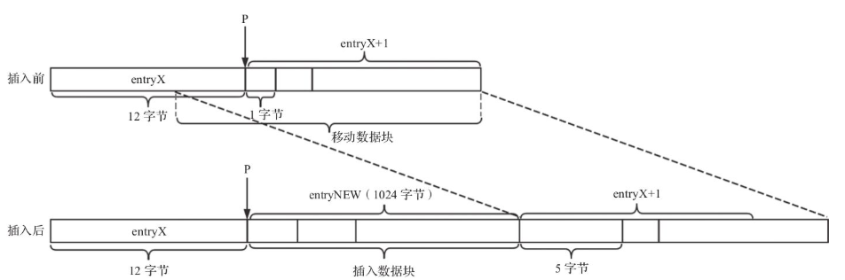
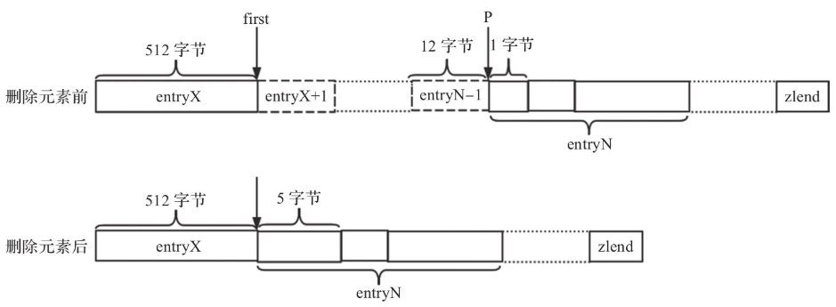

> 基于`redis`源码分支`5.0`
# 压缩列表
压缩列表`ziplist`是列表键和哈希键的底层实现之一。当一个列表键包含少量的列表项，且每个列表项是小整数或者长度比较短的字符串，
`redis`使用压缩列表作为列表键的底层实现。或者当一个哈希键包含少量的键值对，且每个键值对的键和值要么是小整数值或长度比较短的字符串，
`redis`使用压缩列表作为哈希键的底层实现。

压缩列表`ziplist`是`redis`为了节约内存开发的，由一系列特殊编码的连续内存块组成的顺序型数据结构。
一个压缩列表可以包含任意个节点`entry`，每个节点保存一个字节数组（字符串），或一个整数。

节约内存体现如下：
+ 压缩列表使用连续的存储空间，避免内存碎片；
+ 和数组相比，数据每个元素大小是根据最大元素类型定义的，对于小元素类型存在浪费。但压缩列表中的每一`entry`大小是根据实际存储值决定，
也就是没有浪费，`entry`大小可能都不一样；
+ 和链表相比，压缩列表由于存储小整数和短字符串，节约了链表上指针开销（一个指针占用字节蛮多的，`64`位操作系统是`8`字节）；

## 数据结构定义
`redis`使用字节数组表示压缩列表`ziplist`，`ziplist`的结构如下：
```bash
+-------+------+-----+-----+-----+-----+-----+-----+
|zlbytes|zltail|zllen|entry|entry| ... |entry|zlend|
+-------+------+-----+-----+-----+-----+-----+-----+
```
+ `zlbytes`：`4`个字节（`uint32_t`类型），记录整个压缩列表占用的内存字节数。用于压缩列表进行内存重分配或者计算特殊值`zlend`位置。
+ `zltail`：`4`个字节（`uint32_t`类型），记录压缩列表最后一个`entry`到压缩列表起始地址有多少字节，
通过这个偏移量，不需要遍历完整的压缩列表就可以知道压缩列表最后`entry`的地址。
+ `zllen`：`2`个字节（`uint16_t`类型），记录压缩列表节点数量，当实际压缩列表节点数量超过`2^16-1`时，
需要遍历整个`entry`项才可以获取实际节点数量。
+ `entry`：压缩列表中保存的节点，节点的长度由节点保存的内存决定。
+ `zlend`：`1`个字节（`uint8_t`类型），特殊值`0xFF`，表示压缩列表的结束。

节点`entry`的结构如下：
```bash
+-------+--------+----------+
|prevlen|encoding|entry-data|
+-------+--------+----------+
```
+ `prevlen`：记录压缩列表前一个节点的长度，以字节为单位。
  + 如果前一个节点长度小于`254`个字节，则`prevlen`的值用`1`个字节表示；
  + 如果前一个节点长度大于等于`254`个字节，则`prevlen`的值用`5`个字节表示，且第一个字节设置为`0xFE`，
  接下来的`4`个字节表示前一个节点的长度；
+ `encoding`：记录`entry-data`属性所保存数据类型以及长度，`encoding`的值大小可以是`1`字节、`2`字节或者`5字节`。
  + `encoding`前两位取值`00`，表示`entry-data`是一个**字符串**，且字符串长度小于等于`63`（`6 bits`），此时`encoding`大小是`1`字节。
  + `encoding`前两位取值`01`，表示`entry-data`是一个**字符串**，且字符串长度小于等于`16384`（`14 bits`），此时`encoding`大小是`2`字节。
  + `encoding`前两位取值`10`，表示`entry-data`是一个**字符串**，且字符串长度小于等于`2^32-1`（后面`4`字节表示长度），此时`encoding`大小是`5`字节。
  + `encoding`前两位取值`11`，表示`entry-data`是一个**整数**，`encoding`大小是`1`字节。
    + `encoding`取值`11000000`，表示`entry-data`保存整数是`int16_t`类型数据；
    + `encoding`取值`11010000`，表示`entry-data`保存整数是`int32_t`类型数据；
    + `encoding`取值`11100000`，表示`entry-data`保存整数是`int64_t`类型数据；
    + `encoding`取值`11110000`，表示`entry-data`保存整数是`24`位有符号数据；
    + `encoding`取值`11111110`，表示`entry-data`保存整数是`8`位有符号整数；
    + `encoding`取值`1111xxxx`，其中`xxxx`在`(0000, 1101]`之间，表示`0-12`整数（`xxxx`值减`1`），此时没有`entry-data`属性；
+ `entry-data`：保存的实际值，一个整数或者字符串。

每个节点由于有`prevlen`属性以及压缩列表有`zltail`属性，可以实现从节点尾部向前开始遍历节点。

## 创建压缩列表
压缩列表的创建实现如下：
```c
/* Create a new empty ziplist. */
unsigned char *ziplistNew(void) {
    // 计算压缩列表头（zlbytes, zltail, zllen）+ 尾（zlend）内存大小
    unsigned int bytes = ZIPLIST_HEADER_SIZE+ZIPLIST_END_SIZE;
    // 一个字符数组表示压缩列表
    unsigned char *zl = zmalloc(bytes);
    // 初始化压缩列表的总大小（单位字节），也就是初始化 zlbytes 值
    ZIPLIST_BYTES(zl) = intrev32ifbe(bytes);
    // 初始化 zltail 值
    ZIPLIST_TAIL_OFFSET(zl) = intrev32ifbe(ZIPLIST_HEADER_SIZE);
    // 初始化 zllen 值为 0
    ZIPLIST_LENGTH(zl) = 0;
    // 初始化 zlend 值为 0xFF
    zl[bytes-1] = ZIP_END;
    return zl;
}
```
其中相关的宏定义如下：
```c
/* The size of a ziplist header: two 32 bit integers for the total
 * bytes count and last item offset. One 16 bit integer for the number
 * of items field. */
#define ZIPLIST_HEADER_SIZE     (sizeof(uint32_t)*2+sizeof(uint16_t))

/* Size of the "end of ziplist" entry. Just one byte. */
#define ZIPLIST_END_SIZE        (sizeof(uint8_t))

/* Return total bytes a ziplist is composed of. */
#define ZIPLIST_BYTES(zl)       (*((uint32_t*)(zl)))

/* Return the offset of the last item inside the ziplist. */
#define ZIPLIST_TAIL_OFFSET(zl) (*((uint32_t*)((zl)+sizeof(uint32_t))))

/* Return the length of a ziplist, or UINT16_MAX if the length cannot be
 * determined without scanning the whole ziplist. */
#define ZIPLIST_LENGTH(zl)      (*((uint16_t*)((zl)+sizeof(uint32_t)*2)))

#define ZIP_END 255         /* Special "end of ziplist" entry. */
```
宏定义主要是根据内存布局，取对应地址的值以获取对应属性值，内存布局参考上面的数据结构定义。

执行创建压缩列表后，对应的数据结构如下（上面是每个属性占空间大小，下面是每个属性取值）：
```bash
  4字节   4字节  2字节  1字节
+-------+------+-----+-----+
|zlbytes|zltail|zllen|zlend|
+-------+------+-----+-----+
  11      10     0     255
```

## 节点添加
压缩列表节点插入流程主要分三步：
+ 将节点内容编码，也就是确定节点各个属性值及空间大小；
+ 压缩列表空间重分配；
+ 数据移动；

插入相关的`API`定义如下：
```c
unsigned char *__ziplistInsert(unsigned char *zl, unsigned char *p, unsigned char *s, unsigned int slen);
```
+ `zl`：表示压缩列表的首地址；
+ `p`：节点要插入的位置地址；
+ `s`：插入元素的地址，用字节数组表示数据；
+ `slen`：插入元素的长度；

元素节点的插入位置有如下三种情况：
```bash
  4字节   4字节  2字节  1字节
+-+-+-+-+-+-+-+-+--+--+-----+
|zlbytes|zltail |zllen|zlend|
+-+-+-+-+-+-+-+-+--+--+-----+
                      ^
                      |
                      p

  4字节   4字节  2字节  1字节
+-+-+-+-+-+-+-+-+--+--+------------------------------------+
|zlbytes|zltail |zllen|...|entryX|entryX+1|...|entryN|zlend|
+-+-+-+-+-+-+-+-+--+--+------------------------------------+
                                 ^                   ^
                                 |                   |
                                 p                   p
```
+ 插入空的压缩列表；
+ 插入压缩列表的尾部；
+ 插入压缩列表的中间；

获取节点元素内容编码的实现如下：
```c
    // curlen 表示当前压缩列表的大小
    size_t curlen = intrev32ifbe(ZIPLIST_BYTES(zl)), reqlen;
    unsigned int prevlensize, prevlen = 0;
    size_t offset;
    int nextdiff = 0;
    unsigned char encoding = 0;
    long long value = 123456789; /* initialized to avoid warning. Using a value
                                    that is easy to see if for some reason
                                    we use it uninitialized. */
    zlentry tail;

    /* Find out prevlen for the entry that is inserted. */ 
    // 根据插入位置 p 不在压缩列表结尾两种情况(如果压缩列表为空，prevlen=0)，
    // 计算插入节点 prevlen 属性值，附带计算prevlen大小prevlensize
    if (p[0] != ZIP_END) {
        ZIP_DECODE_PREVLEN(p, prevlensize, prevlen);
    } else {
        // 获取压缩列表尾节点位置
        unsigned char *ptail = ZIPLIST_ENTRY_TAIL(zl);
        if (ptail[0] != ZIP_END) {
            prevlen = zipRawEntryLength(ptail);
        }
    }

    /* See if the entry can be encoded */
    // 将插入元素 s 尝试转为整数
    if (zipTryEncoding(s,slen,&value,&encoding)) {
        /* 'encoding' is set to the appropriate integer encoding */
        reqlen = zipIntSize(encoding);
    } else {
        /* 'encoding' is untouched, however zipStoreEntryEncoding will use the
         * string length to figure out how to encode it. */
        reqlen = slen;
    }
    /* We need space for both the length of the previous entry and
     * the length of the payload. */
    // reqlen = prevlen大小 + encoding大小 + len 表示插入元素大小
    reqlen += zipStorePrevEntryLength(NULL,prevlen);
    reqlen += zipStoreEntryEncoding(NULL,encoding,slen);
```
如果插入的位置`p`不在压缩列表的尾部，说明压缩列表不为空，需要更新插入节点的`prevlen`属性，
也就直接读取原始`p`位置节点的`prevlen`值作为插入节点的`prevlen`值（例如，新节点插入`entryX`和`entryX+1`之间，
则`entryX+1`的`prevlen`值就是`entryX`节点长度）。

```c
#define ZIP_DECODE_PREVLEN(ptr, prevlensize, prevlen) do {                     \
    ZIP_DECODE_PREVLENSIZE(ptr, prevlensize);                                  \
    // 更新 prevlen 的值
    if ((prevlensize) == 1) {                                                  \
        (prevlen) = (ptr)[0];                                                  \
    } else if ((prevlensize) == 5) {                                           \
        assert(sizeof((prevlen)) == 4);                                    \
        memcpy(&(prevlen), ((char*)(ptr)) + 1, 4);                             \
        memrev32ifbe(&prevlen);                                                \
    }                                                                          \
} while(0);

#define ZIP_DECODE_PREVLENSIZE(ptr, prevlensize) do {                          \
    // ZIP_BIG_PREVLEN 是 254，也就是0xFE
    if ((ptr)[0] < ZIP_BIG_PREVLEN) {                                          \
        (prevlensize) = 1;                                                     \
    } else {                                                                   \
        (prevlensize) = 5;                                                     \
    }                                                                          \
} while(0);
```
如果插入位置`p`在压缩列表尾，但压缩列表不为空，则获取尾部节点的长度作为插入节点的`prevlen`值：
```c
unsigned int zipRawEntryLength(unsigned char *p) {
    unsigned int prevlensize, encoding, lensize, len;
    // 获取尾节点 prevlen 值大小
    ZIP_DECODE_PREVLENSIZE(p, prevlensize);
    ZIP_DECODE_LENGTH(p + prevlensize, encoding, lensize, len);
    // prevlensize 是 prevlen 值大小
    // lensize 是 encoding 值大小
    // len 是存储的元素值大小
    return prevlensize + lensize + len;
}

#define ZIP_DECODE_LENGTH(ptr, encoding, lensize, len) do {  \
    // 获取尾节点的 encoding 值
    ZIP_ENTRY_ENCODING((ptr), (encoding));                                     \
    // ZIP_STR_MASK 值是 0xc0
    if ((encoding) < ZIP_STR_MASK) {                                           \
        // 说明尾节点存储的值是字符串
        if ((encoding) == ZIP_STR_06B) {                                       \
            (lensize) = 1;                                                     \
            (len) = (ptr)[0] & 0x3f;                                           \
        } else if ((encoding) == ZIP_STR_14B) {                                \
            (lensize) = 2;                                                     \
            (len) = (((ptr)[0] & 0x3f) << 8) | (ptr)[1];                       \
        } else if ((encoding) == ZIP_STR_32B) {                                \
            (lensize) = 5;                                                     \
            (len) = ((ptr)[1] << 24) |                                         \
                    ((ptr)[2] << 16) |                                         \
                    ((ptr)[3] <<  8) |                                         \
                    ((ptr)[4]);                                                \
        } else {                                                               \
            panic("Invalid string encoding 0x%02X", (encoding));               \
        }                                                                      \
    } else {                                                                   \
        // 说明尾节点存储的值是整数
        (lensize) = 1;                                                         \
        (len) = zipIntSize(encoding);                                          \
    }                                                                          \
} while(0);
```
通过以上，我们得出插入元素的大小`reqlen`。

下面是开始进行压缩列表空间重分配：
```c
    /* When the insert position is not equal to the tail, we need to
     * make sure that the next entry can hold this entry's length in
     * its prevlen field. */
    int forcelarge = 0;
    nextdiff = (p[0] != ZIP_END) ? zipPrevLenByteDiff(p,reqlen) : 0;
    if (nextdiff == -4 && reqlen < 4) {
        nextdiff = 0;
        forcelarge = 1;
    }

    /* Store offset because a realloc may change the address of zl. */
    offset = p-zl;
    zl = ziplistResize(zl,curlen+reqlen+nextdiff);
    p = zl+offset;
```
`nextdiff`表示插入元素节点的后一个节点`prevlen`属性大小的变化：
+ `nextdiff = 0`：下一个节点的`prevlen`大小没有变化；
+ `nextdiff = 4`：下一个节点的`prevlen`大小需要增加`4`个字节；
+ `nextdiff = -4`：下一个节点的`prevlen`大小需要减少`4`个字节；

用于计算`nextdiff`的`zipPrevLenByteDiff`函数实现如下：
```c
int zipPrevLenByteDiff(unsigned char *p, unsigned int len) {
    unsigned int prevlensize;
    ZIP_DECODE_PREVLENSIZE(p, prevlensize);
    // zipStorePrevEntryLength（NULL，len) 根据 len 大小，取值为 1 或者 5
    return zipStorePrevEntryLength(NULL, len) - prevlensize;
}
```
条件`nextdiff = -4 && reqlen < 4`说明插入后压缩列表的空间比插入前小。由于`ziplistResize`内部调用`realloc`重新分配空间，
如果当前位置有足够的空间，`realloc`返回的地址不变，重新分配空间减少，`realloc`可能会将多余的空间回收，
导致数据丢失，所以这里设置`nextdiff = 0`，并用`forcelarge`标记这种情况。

空间分配完成后，下面开始数据拷贝。需要将原始的插入位置`p`之后的数据移动到新插入元素节点后面，示意图如下：

复制需要确保`entryX+1`及之后的数据完整性。

数据移动的代码如下：
```c
    /* Apply memory move when necessary and update tail offset. */
    if (p[0] != ZIP_END) {
        /* Subtract one because of the ZIP_END bytes */
        //为什么减1呢？zlend结束表示恒为0xFF，不需要移动
        memmove(p+reqlen,p-nextdiff,curlen-offset-1+nextdiff);

        /* Encode this entry's raw length in the next entry. */
        // 更新 entryX+1 的 prevlen 属性值
        if (forcelarge)
            zipStorePrevEntryLengthLarge(p+reqlen,reqlen);
        else
            zipStorePrevEntryLength(p+reqlen,reqlen);

        /* Update offset for tail */
        // 更新压缩列表的 zltail 属性值
        ZIPLIST_TAIL_OFFSET(zl) =
            intrev32ifbe(intrev32ifbe(ZIPLIST_TAIL_OFFSET(zl))+reqlen);

        /* When the tail contains more than one entry, we need to take
         * "nextdiff" in account as well. Otherwise, a change in the
         * size of prevlen doesn't have an effect on the *tail* offset. */
        zipEntry(p+reqlen, &tail);
        if (p[reqlen+tail.headersize+tail.len] != ZIP_END) {
            ZIPLIST_TAIL_OFFSET(zl) =
                intrev32ifbe(intrev32ifbe(ZIPLIST_TAIL_OFFSET(zl))+nextdiff);
        }
    } else {
        /* This element will be the new tail. */
        // 直接插入末尾，更新压缩列表 zltail 属性值
        ZIPLIST_TAIL_OFFSET(zl) = intrev32ifbe(p-zl);
    }
```
如果新的压缩列表空间变小，但是`entryX+1`的`prevlen`依然是`5`个字节，执行`zipStorePrevEntryLengthLarge`函数，实现如下：
```c
/* Encode the length of the previous entry and write it to "p". This only
 * uses the larger encoding (required in __ziplistCascadeUpdate). */
int zipStorePrevEntryLengthLarge(unsigned char *p, unsigned int len) {
    if (p != NULL) {
        p[0] = ZIP_BIG_PREVLEN;
        memcpy(p+1,&len,sizeof(len));
        memrev32ifbe(p+1);
    }
    return 1+sizeof(len);
}
```
如果新的压缩列表空间变大，执行`zipStorePrevEntryLength`函数，实现如下：
```c
unsigned int zipStorePrevEntryLength(unsigned char *p, unsigned int len) {
    if (p == NULL) {
        return (len < ZIP_BIG_PREVLEN) ? 1 : sizeof(len)+1;
    } else {
        if (len < ZIP_BIG_PREVLEN) {
            p[0] = len;
            return 1;
        } else {
            return zipStorePrevEntryLengthLarge(p,len);
        }
    }
}
```
如果`nextdiff != 0`，说明`entryX+1`节点的`prevlen`空间需要调整，这里涉及到整个压缩列表的连锁更新：
```c
    /* When nextdiff != 0, the raw length of the next entry has changed, so
     * we need to cascade the update throughout the ziplist */
    if (nextdiff != 0) {
        offset = p-zl;
        zl = __ziplistCascadeUpdate(zl,p+reqlen);
        p = zl+offset;
    }
```
> 连锁更新：当前节点空间的调整，可能影响后面节点空闲的调整，以此类推。连锁更新出现的概率不高。

最后将元素`s`数据写到压缩列表位置`p`处，同时更新插入节点的`prevlen`和`encoding`属性：
```c
    /* Write the entry */
    p += zipStorePrevEntryLength(p,prevlen);
    p += zipStoreEntryEncoding(p,encoding,slen);
    if (ZIP_IS_STR(encoding)) {
        memcpy(p,s,slen);
    } else {
        zipSaveInteger(p,value,encoding);
    }
    // 更新压缩列表的 zllen 属性
    ZIPLIST_INCR_LENGTH(zl,1);
    return zl;
```
## 节点删除
节点的删除流程如下：
+ 计算删除元素节点的总长度；
+ 数据复制；
+ 重新分配空间；

删除相关的实现如下：
```c
/* Delete a single entry from the ziplist, pointed to by *p.
 * Also update *p in place, to be able to iterate over the
 * ziplist, while deleting entries. */
unsigned char *ziplistDelete(unsigned char *zl, unsigned char **p) {
    size_t offset = *p-zl;
    zl = __ziplistDelete(zl,*p,1);

    /* Store pointer to current element in p, because ziplistDelete will
     * do a realloc which might result in a different "zl"-pointer.
     * When the delete direction is back to front, we might delete the last
     * entry and end up with "p" pointing to ZIP_END, so check this. */
    *p = zl+offset;
    return zl;
}
```
`__ziplistDelete`函数的定义如下：
```c
unsigned char *__ziplistDelete(unsigned char *zl, unsigned char *p, unsigned int num);
```
+ `p`：表示删除元素节点的地址；
+ `num`：表示删除元素的个数；

首先会计算要删除的总长度：
```c
    unsigned int i, totlen, deleted = 0;
    size_t offset;
    int nextdiff = 0;
    zlentry first, tail;
    // 解码删除第一个节点的各个属性
    zipEntry(p, &first);
    for (i = 0; p[0] != ZIP_END && i < num; i++) {
        // zipRawEntryLength 返回节点的总大小
        p += zipRawEntryLength(p);
        deleted++;
    }
    // 要删除元素的总大小
    totlen = p-first.p; /* Bytes taken by the element(s) to delete. */
```
数据复制示意图如下：

数据复制以及空间重分配的源码实现如下：
```c
    if (totlen > 0) {
        if (p[0] != ZIP_END) {
            /* Storing `prevrawlen` in this entry may increase or decrease the
             * number of bytes required compare to the current `prevrawlen`.
             * There always is room to store this, because it was previously
             * stored by an entry that is now being deleted. */
            // 计算 entryN prevlen 值占用内存大小的变化情况
            nextdiff = zipPrevLenByteDiff(p,first.prevrawlen);

            /* Note that there is always space when p jumps backward: if
             * the new previous entry is large, one of the deleted elements
             * had a 5 bytes prevlen header, so there is for sure at least
             * 5 bytes free and we need just 4. */
            p -= nextdiff;
            zipStorePrevEntryLength(p,first.prevrawlen);

            /* Update offset for tail */
            ZIPLIST_TAIL_OFFSET(zl) =
                intrev32ifbe(intrev32ifbe(ZIPLIST_TAIL_OFFSET(zl))-totlen);

            /* When the tail contains more than one entry, we need to take
             * "nextdiff" in account as well. Otherwise, a change in the
             * size of prevlen doesn't have an effect on the *tail* offset. */
            zipEntry(p, &tail);
            if (p[tail.headersize+tail.len] != ZIP_END) {
                ZIPLIST_TAIL_OFFSET(zl) =
                   intrev32ifbe(intrev32ifbe(ZIPLIST_TAIL_OFFSET(zl))+nextdiff);
            }

            /* Move tail to the front of the ziplist */
            memmove(first.p,p,
                intrev32ifbe(ZIPLIST_BYTES(zl))-(p-zl)-1);
        } else {
            /* The entire tail was deleted. No need to move memory. */
            ZIPLIST_TAIL_OFFSET(zl) =
                intrev32ifbe((first.p-zl)-first.prevrawlen);
        }

        /* Resize and update length */
        offset = first.p-zl;
        zl = ziplistResize(zl, intrev32ifbe(ZIPLIST_BYTES(zl))-totlen+nextdiff);
        ZIPLIST_INCR_LENGTH(zl,-deleted);
        p = zl+offset;

        /* When nextdiff != 0, the raw length of the next entry has changed, so
         * we need to cascade the update throughout the ziplist */
        if (nextdiff != 0)
            zl = __ziplistCascadeUpdate(zl,p);
    }
    return zl;
```
和插入操作一样，如果`nextdiff != 0`，说明`entryN`的`prevlen`属性大小需要调整，这里涉及到整个压缩列表的连锁更新。
> 连锁更新：当前节点空间的调整，可能影响后面节点空闲的调整，以此类推。连锁更新出现的概率不高。
