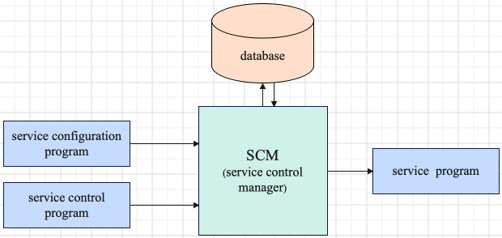
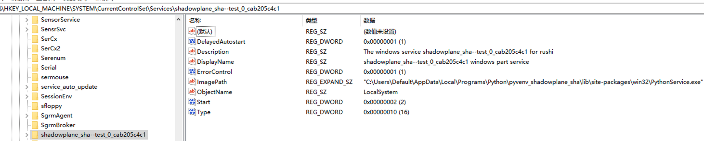
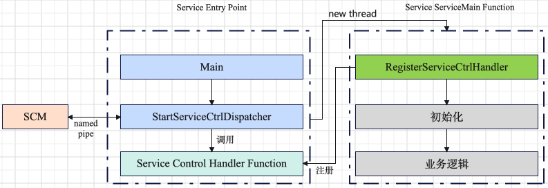

# Windows 服务概述

## SCM
> 维护已安装服务的数据库(包含每个服务如何被启动的相关信息)，同时提供一种统一安全的方式控制它们。

SCM 是系统组件的一部分，随着系统的启动而启动。SCM 提供如下功能：
+ 维护已安装服务的数据库
+ 自动或者按需启动服务
+ 枚举已安装的服务
+ 维护运行服务的状态信息
+ 将控制请求传输到正运行到服务
+ 加锁/解锁服务数据库

已安装服务数据库位置在注册表中，位置是 `HKEY_LOCAL_MACHINE\SYSTEM\CurrentControlSet\Services`，下面是一个已安装服务在
数据库的样例

[数据库中已安装服务的信息介绍](https://learn.microsoft.com/en-us/windows/win32/services/database-of-installed-services)

在系统启动时候，SCM 会启动所有配置为自动启动的服务及其依赖的服务。例如一个配置为自动启动的服务依赖一个手动启动的服务，
则手动启动的服务也会被自动启动。服务的启动顺序如下：
1. 加载顺序组列表中的组；相关信息存储在 `HKEY_LOCAL_MACHINE\System\CurrentControlSet\Control` 中的 `ServiceGroupOrder`
字段，可以使用函数 `CreateService ` 或者 函数 `ChangeServiceConfig` 的 `lpLoadOrderGroup` 参数指定；
2. 指定组中的服务顺序；相关信息存在在 `HKEY_LOCAL_MACHINE\System\CurrentControlSet\Control` 中的 `GroupOrderList`子段；
3. 每个服务依赖的服务

当系统启动完成，可以执行系统启动验证程序，此程序被 `HKEY_LOCAL_MACHINE\SYSTEM\CurrentControlSet\Control` 的 `BootVerificationProgram`
位置指定，可以使用函数 `NotifyBootConfigStatus` 配置(默认情况不指定此程序)。

系统成功启动后会保存一份数据库的快照，称为 `last-known-good(LKG)` 配置，位置在 `HKEY_LOCAL_MACHINE\SYSTEM\ControlSetXXX\Services`
其中 `XXX` 是存储在 `HKEY_LOCAL_MACHINE\System\Select\LastKnownGood` 的值。此快照用于发生错误时，恢复的作用。

对于配置为手动启动的服务，可以使用服务控制程序 `StartService` 函数启动服务，服务被启动后，SCM 会做如下工作：
+ 检索存储在数据库中的帐户信息
+ 登录服务帐户
+ 加载用户配置文件
+ 创建处于挂起状态的服务
+ 将登录令牌分配给进程
+ 允许执行进程

用户名和密码在服务安装的时候被指定，用户名存储在注册表，密码存储在 LSA。SCM 会保留两份密码，一个当前密码，一个备份密码。
第一次指定的密码存储为当前密码，备份密码没有初始化。当 SCM 在安全的用户账户上下文成功运行服务（使用当前密码），则其被
保留为备份密码，后续密码被修改(例如使用 `ChangeServiceConfig`)，则新密码存储为当前密码，之前的密码存储为备份密码。若
使用当前密码启动服务失败，则使用备份密码，备份密码使用成功，备份密码存储为当前密码。

使用 `SetServiceStatus` 函数通知 SCM 更新服务状态。

## Service Configuration Programs
> 修改查询已安装服务的数据库信息

- 安装新服务: `CreateService ` 函数
- 删除服务: `DeleteService` 函数
- 枚举服务: `EnumServicesStatusEx` 函数
- 修改服务配置信息: `ChangeServiceConfig` 和 `ChangeServiceConfig2`
- 查询服务配置信息: `QueryServiceConfig` 和 `QueryServiceConfig2`
- ...

## Service Control Programs
> 启动和控制服务

`StartService` 用于启动一个服务。服务启动时候，可以传递一个参数数组给 `ServiceMain` 函数。用于执行 `ServiceMain` 函数的
新线程被创建后，函数 `StartService` 返回。SCM 不支持环境变量，可以使用注册表或者 `ServiceMain` 函数参数。

服务的启动流程大概如下:
+ SCM 从数据库获取启动服务的程序路径，获取服务锁
+ SCM 启动进程，并等待子进程退出(包括失败的情况)，或者报导 `SERVICE_RUNNING` 状态
+ 应用程序 (用户开发的服务程序 `service programs`)，执行简单的初始化及调用 `StartServiceCtrlDispatcher` 函数
+ `StartServiceCtrlDispatcher` 函数负责连接 SCM 且启动一个新线程执行 `ServiceMain` 函数。`ServiceMain` 函数应尽可能快
上报 `SERVICE_RUNNING` 状态
+ 当 SCM 被通知服务在运行状态时，则其释放服务锁

当服务在 80s 内没有更新状态（加上 wait hint 时间），此时 SCM 认为服务停止响应，会上报一个日志事件并停止服务。

`ControlService`用于给一个正在运行的服务发送控制请求。此函数指定一个被传递给 `HandlerEx` 函数的控制码，控制码可以是
用户自定义或者标准控制码

## Service Programs
为满足 SCM 接口要求，服务程序有以下三部分组成:
+ Service Entry Point
+ Service ServiceMain Function
+ Service Control Handler Function

### Service Entry Point
一般情况下，服务的入口点是 main 函数，当 SCM 启动一个服务程序，它会等待其调用 `StartServiceCtrlDispatcher` 函数。函数
`StartServiceCtrlDispatcher` 调用成功后调用线程不会返回，直到进程中所有的服务进入 SERVICE_STOPPED 状态。SCM 通过一个
管道给调用线程发送控制请求，调用线程执行下面的任务：
+ 创建新线程以在新服务被启动时调用相应的 ServiceMain 函数
+ 调用相应的 Service Control Handler Function 来处理服务控制请求

在服务入口点，应该尽可能快调用 `StartServiceCtrlDispatcher` 函数，以和 SCM 建立通信。

### Service ServiceMain Function
[ServiceMain 函数开发流程](https://learn.microsoft.com/en-us/windows/win32/services/service-servicemain-function)

### Service Control Handler Function
在 ServiceMain 中，通过调用 `RegisterServiceCtrlHandler` 注册相关 Handler 函数。通过 `SetServiceStatus` 函数向 SCM 
报告服务状态，以及期望接收的控制请求，例如停服，关机事件等。[相关的详细信息参考](https://learn.microsoft.com/en-us/windows/win32/services/service-control-handler-function)

## Service State Transitions
通过函数 `SetServiceStatus` 向 SCM 报告服务状态。SCM 只会向服务发送指定的控制请求，具体是发送哪些控制请求，看
SERVICE_STATUS 结构的 `dwControlsAccepted` 成员。

服务的有效状态转换如下所示:

服务有效的状态流转如下所示:

[服务状态详细说明](https://learn.microsoft.com/en-us/windows/win32/services/service-status-transitions)
